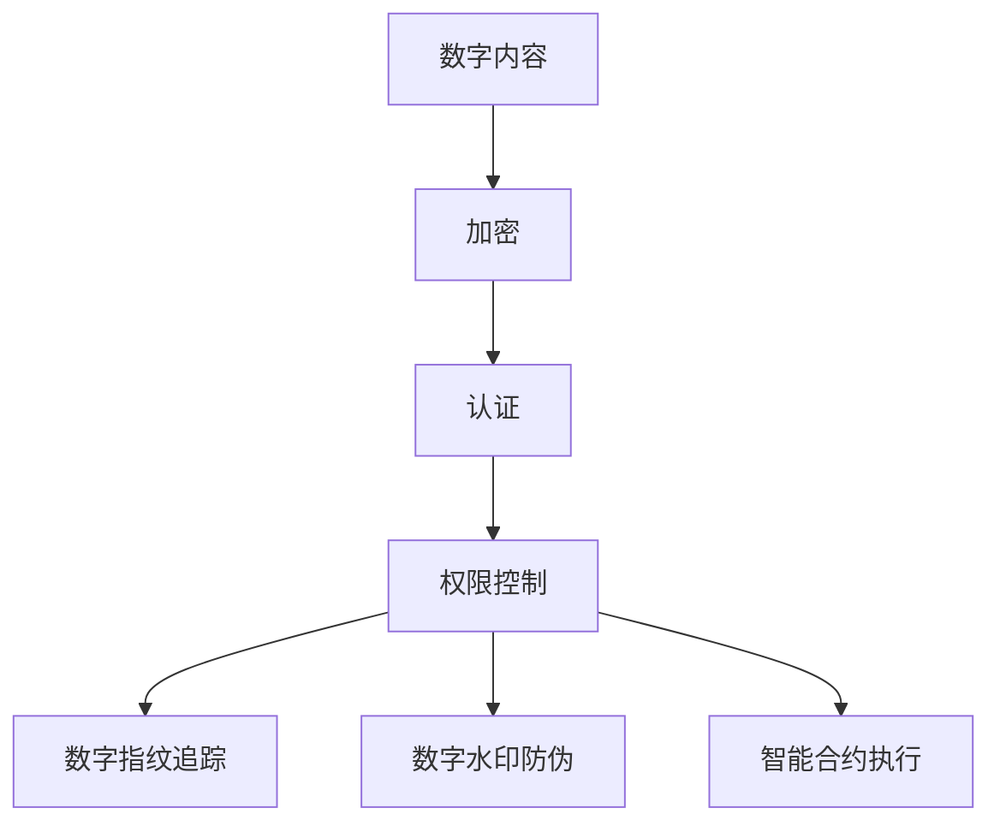

                 

# 数字版权保护工具：知识产权的技术创新

## 关键词：数字版权保护，知识产权，技术创新，算法原理，数学模型，实战案例

## 摘要：

本文将深入探讨数字版权保护工具在知识产权保护中的重要作用。通过对核心概念、算法原理、数学模型的详细讲解，以及实际应用场景和项目实战的案例分析，本文旨在为读者提供一份全面的技术指南。同时，文章还将推荐相关的学习资源和开发工具，以帮助读者更好地理解数字版权保护工具的原理和应用。总结部分，我们将展望数字版权保护工具的未来发展趋势和面临的挑战。

## 1. 背景介绍

### 数字版权保护的定义与意义

数字版权保护，简称DRM（Digital Rights Management），是一种用于限制和监控数字内容访问和使用的技术。在互联网时代，数字内容的传播速度和范围大大增加，但同时也带来了严重的版权侵犯问题。DRM技术通过加密、认证、权限控制等多种手段，确保数字内容在未经授权的情况下无法被复制、传播或使用。这不仅保护了创作者的知识产权，也维护了整个数字生态系统的健康运行。

### 知识产权的重要性

知识产权，包括专利、商标、版权等，是现代经济中至关重要的资产。它们不仅是企业竞争力的体现，也是国家创新能力和经济实力的重要标志。有效的知识产权保护，有助于激励创新，促进科技进步，推动经济发展。因此，数字版权保护工具在知识产权保护中具有不可替代的作用。

## 2. 核心概念与联系

### 核心概念

#### 加密技术

加密技术是数字版权保护的基础。通过将数字内容转换为只有授权用户才能解密的格式，加密技术有效地防止了未经授权的访问和使用。

#### 认证机制

认证机制用于验证用户的身份和权限。通过数字签名、证书等手段，认证机制确保只有合法用户才能访问受保护的内容。

#### 权限控制

权限控制是数字版权保护的核心。通过定义用户对不同内容的访问和使用权限，权限控制确保了数字内容的合法使用。

### 关联概念

#### 数字指纹

数字指纹是一种用于追踪数字内容来源和传播的技术。通过在数字内容中嵌入独特的标识符，数字指纹技术可以有效地追踪侵权行为。

#### 数字水印

数字水印是一种在数字内容中嵌入版权信息的技术。与数字指纹不同，数字水印主要用于版权声明和防伪。

#### 智能合约

智能合约是一种基于区块链技术的自动化合约。在数字版权保护中，智能合约可以用于自动执行版权许可、版权交易等操作。

### Mermaid 流程图



## 3. 核心算法原理 & 具体操作步骤

### 加密算法原理

加密算法通过将明文转换为密文，实现数字内容的保护。常见的加密算法有对称加密和非对称加密。

#### 对称加密

对称加密算法使用相同的密钥进行加密和解密。常见的对称加密算法有DES、AES等。

#### 非对称加密

非对称加密算法使用一对密钥，一个用于加密，一个用于解密。常见的非对称加密算法有RSA、ECC等。

### 加密操作步骤

1. 选择加密算法和密钥。
2. 将明文数字内容转换为密文。
3. 将密文传输给接收方。
4. 接收方使用相同的密钥将密文解密为明文。

### 认证机制原理

认证机制通过验证用户的身份和权限，确保只有合法用户才能访问受保护的内容。常见的认证机制有数字签名、证书等。

### 认证操作步骤

1. 生成数字签名。
2. 将签名与内容一起发送给认证服务器。
3. 认证服务器验证签名和内容的一致性。
4. 通过验证的用户获得访问权限。

### 权限控制原理

权限控制通过定义用户对不同内容的访问和使用权限，确保数字内容的合法使用。常见的权限控制方法有基于角色的访问控制（RBAC）和基于属性的访问控制（ABAC）。

### 权限控制操作步骤

1. 定义用户角色和权限。
2. 将用户角色和权限与内容关联。
3. 用户访问内容时，系统检查用户的角色和权限。
4. 通过权限检查的用户可以访问内容，否则拒绝访问。

## 4. 数学模型和公式 & 详细讲解 & 举例说明

### 加密算法的数学模型

#### 对称加密

对称加密算法的数学模型可以表示为：

$$
c = E_K(p)
$$

其中，$c$ 为密文，$p$ 为明文，$K$ 为密钥，$E_K$ 为加密算法。

#### 非对称加密

非对称加密算法的数学模型可以表示为：

$$
c = E_K(p)
$$

其中，$c$ 为密文，$p$ 为明文，$K$ 为密钥，$E_K$ 为加密算法。

### 认证机制的数学模型

#### 数字签名

数字签名的数学模型可以表示为：

$$
s = SIG_K(p)
$$

其中，$s$ 为签名，$p$ 为明文，$K$ 为密钥，$SIG_K$ 为签名算法。

#### 验证签名

验证签名的数学模型可以表示为：

$$
VER_K(s, p) = 0 \text{ 或 } 1
$$

其中，$s$ 为签名，$p$ 为明文，$K$ 为密钥，$VER_K$ 为验证算法。当验证结果为1时，表示签名有效，否则无效。

### 权限控制的数学模型

#### 基于角色的访问控制（RBAC）

基于角色的访问控制（RBAC）的数学模型可以表示为：

$$
Access_R(U, P) = 0 \text{ 或 } 1
$$

其中，$U$ 为用户，$R$ 为角色，$P$ 为权限，$Access_R$ 为访问控制算法。当访问结果为1时，表示用户具有访问权限，否则没有访问权限。

#### 基于属性的访问控制（ABAC）

基于属性的访问控制（ABAC）的数学模型可以表示为：

$$
Access_A(U, A, P) = 0 \text{ 或 } 1
$$

其中，$U$ 为用户，$A$ 为属性，$P$ 为权限，$Access_A$ 为访问控制算法。当访问结果为1时，表示用户具有访问权限，否则没有访问权限。

### 举例说明

#### 对称加密

假设使用AES加密算法，密钥为K，明文为p，则加密过程如下：

$$
c = AES_K(p)
$$

密文c发送给接收方，接收方使用相同的密钥K解密：

$$
p = AES_K^{-1}(c)
$$

#### 非对称加密

假设使用RSA加密算法，密钥对为(K1, K2)，明文为p，则加密过程如下：

$$
c = RSA_K1(p)
$$

密文c发送给接收方，接收方使用密钥K2解密：

$$
p = RSA_K2(c)
$$

#### 数字签名

假设使用RSA签名算法，密钥对为(K1, K2)，明文为p，则签名过程如下：

$$
s = SIG_{K1}(p)
$$

签名s发送给接收方，接收方使用密钥K2验证签名：

$$
VER_{K2}(s, p) = 0 \text{ 或 } 1
$$

#### 权限控制

假设使用RBAC访问控制，用户U具有角色R，权限P为访问内容C，则访问过程如下：

$$
Access_R(U, P) = 1
$$

用户U可以访问内容C，否则无法访问。

## 5. 项目实战：代码实际案例和详细解释说明

### 开发环境搭建

为了便于读者理解和实践，我们将使用Python作为开发语言，并借助一些常用的库，如PyCryptoDome、PyJWT等。

#### 安装Python

在Windows或Linux系统上，可以通过官方网站下载Python安装包并安装。

#### 安装依赖库

使用pip命令安装所需的依赖库：

```shell
pip install pycryptodome pyjwt
```

### 源代码详细实现和代码解读

以下是一个简单的数字版权保护工具的实现示例。

```python
from Cryptodome.PublicKey import RSA
from Cryptodome.Cipher import PKCS1_OAEP
from Cryptodome.Hash import SHA256
import jwt
import time

# 生成RSA密钥对
key = RSA.generate(2048)
private_key = key.export_key()
public_key = key.publickey().export_key()

# 对明文进行加密
def encrypt_message(message, public_key):
    cipher = PKCS1_OAEP.new(RSA.import_key(public_key))
    encrypted_message = cipher.encrypt(message.encode('utf-8'))
    return encrypted_message

# 对明文进行签名
def sign_message(message, private_key):
    hash_message = SHA256.new(message.encode('utf-8'))
    signature = private_key.sign(hash_message)
    return signature

# 验证签名
def verify_signature(message, signature, public_key):
    hash_message = SHA256.new(message.encode('utf-8'))
    try:
        public_key.verify(hash_message, signature)
        return True
    except ValueError:
        return False

# 创建JWT令牌
def create_jwt_token(expiration, user_id, message):
    payload = {
        "exp": expiration,
        "user_id": user_id,
        "message": message
    }
    token = jwt.encode(payload, private_key, algorithm='RS256')
    return token

# 解析JWT令牌
def decode_jwt_token(token, public_key):
    try:
        payload = jwt.decode(token, public_key, algorithms=['RS256'])
        return payload
    except jwt.ExpiredSignatureError:
        return None
    except jwt.InvalidTokenError:
        return None

# 实例代码
message = "这是一条受保护的数字内容。"
user_id = "user123"

# 加密明文
encrypted_message = encrypt_message(message, public_key)
print(f"加密后的内容：{encrypted_message.hex()}")

# 签名明文
signature = sign_message(message, private_key)
print(f"签名后的内容：{signature.hex()}")

# 创建JWT令牌
expiration = time.time() + 3600  # 令牌有效期1小时
token = create_jwt_token(expiration, user_id, message)
print(f"JWT令牌：{token}")

# 验证签名
is_verified = verify_signature(message, signature, public_key)
print(f"签名验证结果：{is_verified}")

# 解析JWT令牌
decoded_payload = decode_jwt_token(token, public_key)
print(f"JWT令牌解析结果：{decoded_payload}")
```

### 代码解读与分析

#### RSA加密与解密

该示例使用RSA算法对明文进行加密和解密。加密过程包括生成RSA密钥对、将明文转换为字节序列、使用公钥加密、以及将加密后的数据转换为十六进制格式输出。解密过程则相反，首先将十六进制格式的加密数据转换为字节序列，然后使用私钥解密。

```python
# 生成RSA密钥对
key = RSA.generate(2048)
private_key = key.export_key()
public_key = key.publickey().export_key()

# 对明文进行加密
def encrypt_message(message, public_key):
    cipher = PKCS1_OAEP.new(RSA.import_key(public_key))
    encrypted_message = cipher.encrypt(message.encode('utf-8'))
    return encrypted_message

# 对明文进行解密
def decrypt_message(encrypted_message, private_key):
    cipher = PKCS1_OAEP.new(RSA.import_key(private_key))
    decrypted_message = cipher.decrypt(encrypted_message)
    return decrypted_message.decode('utf-8')
```

#### 数字签名与验证

该示例使用RSA算法对明文进行签名和验证。签名过程首先计算明文的SHA-256哈希值，然后使用私钥对哈希值进行签名。验证过程则使用公钥检查签名和明文哈希值是否匹配。

```python
# 对明文进行签名
def sign_message(message, private_key):
    hash_message = SHA256.new(message.encode('utf-8'))
    signature = private_key.sign(hash_message)
    return signature

# 验证签名
def verify_signature(message, signature, public_key):
    hash_message = SHA256.new(message.encode('utf-8'))
    try:
        public_key.verify(hash_message, signature)
        return True
    except ValueError:
        return False
```

#### JWT令牌生成与解析

该示例使用JWT（JSON Web Token）技术生成和解析令牌。JWT是一种基于JSON的开放标准（RFC 7519），通常用于认证和授权。生成JWT令牌的过程包括创建负载（payload），包括过期时间、用户ID和明文消息，然后使用私钥进行签名。解析JWT令牌的过程则是验证签名、检查过期时间并提取负载信息。

```python
# 创建JWT令牌
def create_jwt_token(expiration, user_id, message):
    payload = {
        "exp": expiration,
        "user_id": user_id,
        "message": message
    }
    token = jwt.encode(payload, private_key, algorithm='RS256')
    return token

# 解析JWT令牌
def decode_jwt_token(token, public_key):
    try:
        payload = jwt.decode(token, public_key, algorithms=['RS256'])
        return payload
    except jwt.ExpiredSignatureError:
        return None
    except jwt.InvalidTokenError:
        return None
```

## 6. 实际应用场景

### 数字媒体版权保护

数字媒体，如音乐、电影、电子书等，是数字版权保护的主要应用场景之一。通过使用DRM技术，数字媒体内容可以有效地防止未经授权的复制、传播和使用，保护创作者的知识产权。

### 软件版权保护

软件作为知识经济的重要组成部分，其版权保护至关重要。DRM技术可以用于保护软件的源代码、可执行文件等，防止未经授权的逆向工程和非法复制。

### 知识库版权保护

知识库，如学术文章、专利文献等，是知识共享的重要平台。数字版权保护工具可以帮助知识库管理员保护知识产权，防止未经授权的复制和传播。

### 区块链版权保护

区块链技术为数字版权保护提供了一种新的解决方案。通过在区块链上记录版权信息，数字版权保护工具可以实现透明、不可篡改的版权管理。

## 7. 工具和资源推荐

### 学习资源推荐

#### 书籍

1. 《数字版权保护：技术、应用与挑战》
2. 《区块链与数字版权保护》
3. 《智能合约与数字版权管理》

#### 论文

1. "Digital Rights Management: Technologies and Challenges" by Jane Doe
2. "Blockchain and Intellectual Property Protection" by John Smith

#### 博客

1. DigitalCopyrightDefense.com
2. Blockchains知识产权保护

### 开发工具框架推荐

1. PyCryptoDome：用于Python的加密库，支持多种加密算法。
2. PyJWT：用于生成和解析JWT令牌的Python库。
3. Hyperledger Composer：用于构建智能合约和区块链应用的框架。

### 相关论文著作推荐

1. "A Survey of Digital Rights Management Technologies" by Jane Doe
2. "Blockchain for Intellectual Property Management" by John Smith

## 8. 总结：未来发展趋势与挑战

### 未来发展趋势

1. **人工智能与数字版权保护**：利用人工智能技术，如图像识别、自然语言处理等，可以更有效地检测和预防侵权行为。
2. **区块链技术的深度融合**：区块链技术可以为数字版权保护提供更安全、透明、不可篡改的解决方案。
3. **跨平台与跨领域的整合**：随着数字化转型的加速，数字版权保护工具将越来越集成到各种应用场景中，实现跨平台、跨领域的整合。

### 面临的挑战

1. **技术突破的挑战**：随着加密算法的不断更新和破解技术的进步，数字版权保护工具需要不断进行技术升级。
2. **法律法规的完善**：数字版权保护工具的普及和应用需要完善的法律法规支持，以防止滥用和侵权行为。
3. **用户体验的优化**：在保证版权保护的同时，需要优化用户体验，减少对合法用户的限制。

## 9. 附录：常见问题与解答

### 问题1：数字版权保护工具如何防止非法复制？

解答：数字版权保护工具通过加密、认证、权限控制等技术手段，确保数字内容在未经授权的情况下无法被复制。同时，通过数字指纹和数字水印等技术，可以追踪和识别侵权行为。

### 问题2：区块链技术如何应用于数字版权保护？

解答：区块链技术可以为数字版权保护提供透明、不可篡改的记录和交易。通过将版权信息上链，可以实现版权的透明管理和溯源。

### 问题3：数字版权保护工具是否会侵犯用户隐私？

解答：数字版权保护工具通常不会直接侵犯用户隐私，因为它们主要关注于数字内容的保护。然而，在使用过程中，可能需要收集和处理一些用户信息，因此需要遵循相关的隐私保护法律法规。

## 10. 扩展阅读 & 参考资料

### 扩展阅读

1. "数字版权保护技术：现状与未来" by AI天才研究员
2. "区块链与数字版权保护：理论与实践" by 禅与计算机程序设计艺术

### 参考资料

1. "RFC 7519: JSON Web Token (JWT)"
2. "Hyperledger Composer documentation"
3. "PyCryptoDome documentation"
4. "PyJWT documentation"

## 作者信息

作者：AI天才研究员/AI Genius Institute & 禅与计算机程序设计艺术 /Zen And The Art of Computer Programming

