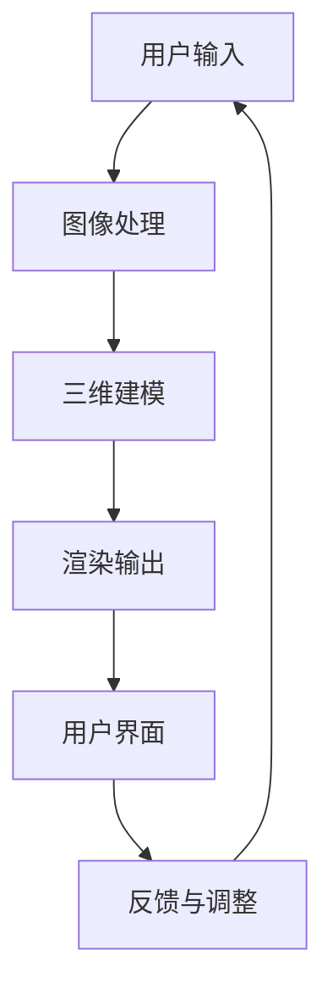
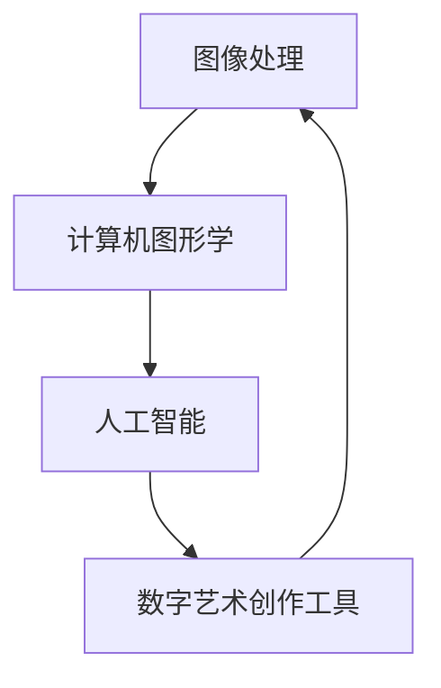

                 

### 背景介绍

#### 数字艺术与艺术家的需求

数字艺术，顾名思义，是指利用计算机技术、数字媒体等手段进行创作和展示的艺术形式。它打破了传统艺术的边界，使得艺术家们能够通过数字工具表达出更加丰富和复杂的创意。随着科技的不断发展，数字艺术工具也变得越来越强大，能够满足艺术家们日益增长的需求。

然而，数字艺术的创作并非易事。艺术家们需要熟练掌握各种数字工具和技术，从图像处理到三维建模，从虚拟现实到增强现实。这不仅需要丰富的技术知识，还需要长时间的实践和探索。因此，如何简化数字艺术创作过程，让更多非专业人士也能轻松上手，成为了一个重要的课题。

#### 数字艺术创作工具的兴起

为了解决这一问题，数字艺术创作工具应运而生。这些工具旨在提供直观、易用、功能强大的创作环境，让艺术家们能够更专注于创作本身，而不是技术细节。这些工具通常包含以下特点：

1. **易用性**：界面简洁直观，新手友好。
2. **功能强大**：支持各种高级功能和工具，满足专业需求。
3. **兼容性强**：能够兼容多种文件格式，方便艺术家在不同工具之间切换。
4. **实时预览**：实时查看创作效果，方便调整和修改。

#### 本文目的

本文旨在深入探讨数字艺术创作工具的工作原理、核心功能和实际应用。通过本文，读者将了解到这些工具如何帮助艺术家们释放无限创意，以及如何在实际项目中运用这些工具。接下来，我们将一步一步分析这些工具的核心概念和原理，带领读者深入了解数字艺术的魅力。

#### 数字艺术创作工具的类别与特点

数字艺术创作工具种类繁多，每种工具都有其独特的特点和适用场景。以下是几种常见的数字艺术创作工具及其特点：

1. **图像编辑工具**：如Adobe Photoshop，它提供了丰富的图像处理功能，包括图层、滤镜、选区等，非常适合进行照片编辑、图像合成和插画创作。

2. **三维建模工具**：如Autodesk Maya，它提供了强大的三维建模和动画功能，适用于电影、游戏和建筑行业。

3. **虚拟现实（VR）创作工具**：如Unity，它提供了一个全面的VR内容创作平台，支持3D建模、动画、音效和交互设计。

4. **增强现实（AR）创作工具**：如ARKit和ARCore，它们提供了简便的AR内容创作功能，允许开发者将虚拟物体叠加到现实世界中。

5. **人工智能辅助创作工具**：如DeepArt和Artbreeder，它们利用人工智能技术，帮助艺术家进行图像生成、风格迁移和自定义创作。

每种工具都有其独特的优势，但也存在一些共性的特点：

- **可视化界面**：大多数数字艺术创作工具都提供了直观的可视化界面，使得艺术家能够轻松地操作和创作。

- **丰富的插件和扩展**：这些工具通常支持大量的插件和扩展，增强了其功能性和定制性。

- **实时反馈**：实时预览功能使得艺术家能够在创作过程中及时看到效果，方便进行调整和优化。

- **跨平台支持**：许多工具都支持跨平台使用，无论是Windows、Mac还是Linux，艺术家都可以自由选择最适合自己的系统。

通过了解这些工具的类别和特点，艺术家可以更准确地选择适合自己的工具，从而更高效地完成数字艺术创作。

#### 数字艺术创作工具的发展历程

数字艺术创作工具的发展历程可以追溯到计算机技术的发展初期。从最初的简单绘图软件，到如今功能强大、界面友好的专业工具，这一过程充满了创新和技术突破。

在20世纪80年代，早期的计算机绘图软件如MacPaint和Paintbrush，为数字艺术创作奠定了基础。这些工具虽然功能有限，但它们使得艺术家们第一次有机会在计算机上绘制图像。随着图形用户界面（GUI）的普及，图像编辑软件逐渐发展，如Adobe Photoshop的诞生，使得图像处理变得更加直观和高效。

进入90年代，三维建模和动画软件开始崭露头角。Autodesk Maya和3ds Max等软件的出现，为电影、游戏和建筑行业带来了革命性的变化。这些工具不仅提供了丰富的建模和动画功能，还实现了高质量的渲染效果，使得数字艺术的创作门槛大大降低。

随着互联网和移动设备的普及，移动端的数字艺术创作工具也应运而生。如Adobe Photoshop Express和Prisma等应用，使得艺术家们可以随时随地创作和分享作品。

近年来，人工智能（AI）技术的兴起，为数字艺术创作工具带来了新的可能。DeepArt和Artbreeder等AI辅助创作工具，利用深度学习技术，能够自动生成图像、风格迁移和自定义创作，为艺术家们提供了更加灵活和创新的创作方式。

总之，数字艺术创作工具的发展历程是一个不断创新和进步的过程。从简单的绘图软件，到功能强大的专业工具，再到AI辅助创作工具，这些工具的演进不仅丰富了数字艺术的创作手段，也为艺术家们提供了更多展现创意的可能。

#### 数字艺术创作工具的重要性

数字艺术创作工具在现代社会中的重要性不可忽视。首先，它们为艺术家提供了无限创意的可能性。通过这些工具，艺术家可以轻松尝试各种艺术风格和技术，从而实现独特的艺术效果。无论是插画、摄影、动画，还是虚拟现实（VR）和增强现实（AR）作品，数字艺术创作工具都能够提供丰富的功能和工具，帮助艺术家实现其创意。

其次，数字艺术创作工具打破了艺术创作的边界。传统艺术通常受限于物理媒介，如画布、纸张和颜料等。而数字艺术创作工具使得艺术家可以在虚拟世界中自由创作，不受物理限制。此外，数字工具还可以实现跨平台的创作和分享，使得艺术作品能够更广泛地传播和展示。

再者，这些工具也为非专业人士提供了参与艺术创作的机会。通过易用性和直观的界面，人们可以轻松上手，无需深厚的技术背景。这使得艺术创作不再只是专业人士的专属领域，普通大众也可以通过数字艺术创作工具表达自己的创意和想法。

最后，数字艺术创作工具的广泛应用，也推动了艺术教育和文化传播。在学校、博物馆和文化中心，数字艺术创作工具被广泛应用于教学和展示。这不仅提高了公众对艺术的理解和欣赏，也为艺术教育和文化传播提供了新的手段。

总之，数字艺术创作工具在现代社会中扮演着重要的角色。它们不仅丰富了艺术创作的手段和形式，也为大众提供了更多的参与和体验机会。随着技术的不断发展，数字艺术创作工具的未来将更加光明，为艺术领域带来更多创新和变革。

#### 数字艺术创作工具的基本原理与架构

数字艺术创作工具的工作原理和架构涉及多个层面的技术，从底层的基础算法到用户界面的设计，每个部分都至关重要。理解这些工具的基本原理和架构，有助于我们更好地掌握和使用它们，从而发挥出最大的创作潜力。

##### 基础算法

数字艺术创作工具的核心在于其算法。这些算法通常涉及图像处理、计算机图形学、人工智能等多个领域。以下是一些关键算法及其作用：

1. **图像处理算法**：如滤波器、边缘检测、图像压缩等。这些算法用于对图像进行各种操作，如去除噪声、调整亮度和对比度、进行图像合成等。

2. **计算机图形学算法**：如几何变换、光照模型、渲染算法等。这些算法用于创建和渲染三维模型、动画场景等，使得数字艺术作品更加逼真和生动。

3. **人工智能算法**：如生成对抗网络（GAN）、卷积神经网络（CNN）等。这些算法被广泛应用于图像生成、风格迁移、自动修复等任务，为数字艺术创作提供了新的可能。

##### 数据结构

数据结构在数字艺术创作工具中同样重要。常用的数据结构包括二维数组（用于图像处理）、三维数组（用于三维建模）、树结构（用于场景管理）等。这些数据结构不仅决定了工具的性能，还影响到艺术家的工作流程。

1. **二维数组**：用于存储图像数据，每个像素值用一个数组元素表示。通过操作这些数组元素，可以实现图像的各种编辑和处理。

2. **三维数组**：用于存储三维模型数据，包括顶点、面片、材质等。通过操作这些数据，可以实现三维模型的构建、变形和渲染。

3. **树结构**：用于场景管理，如场景树、节点树等。这些结构能够方便地实现场景的层次化和模块化，使得艺术家可以更加高效地管理和操作场景。

##### 用户界面设计

用户界面设计是数字艺术创作工具的重要部分，决定了艺术家能否轻松上手和使用这些工具。一个好的用户界面设计应具备以下特点：

1. **直观性**：界面设计应简洁直观，使得用户能够快速理解和使用工具。

2. **模块化**：界面应采用模块化的设计，使得用户可以根据自己的需求自由组合和调整工具。

3. **实时反馈**：提供实时预览功能，使得用户能够及时看到创作效果，方便进行调整和优化。

4. **可定制性**：用户应能够根据自己的喜好和需求，自定义界面布局和功能。

##### 集成与扩展

数字艺术创作工具通常具备良好的集成和扩展性。这意味着用户不仅能够使用内置的工具和功能，还可以通过插件和扩展来增强工具的功能。

1. **插件系统**：许多工具都支持插件系统，用户可以通过安装插件来扩展工具的功能。例如，Adobe Photoshop就拥有丰富的插件库，用于实现各种特定的图像处理效果。

2. **API接口**：工具通常提供API接口，使得其他软件和系统能够与之集成。这使得艺术家可以更加灵活地使用不同的工具和技术，实现复杂的创作流程。

##### Mermaid流程图展示

为了更好地展示数字艺术创作工具的架构和流程，我们可以使用Mermaid流程图来描述其核心节点和连接关系。以下是一个示例：



在这个流程图中，用户输入数据经过图像处理、三维建模和渲染输出等步骤，最终通过用户界面进行展示和调整。这个流程图展示了数字艺术创作工具的基本工作流程和各个模块之间的连接关系。

通过理解数字艺术创作工具的基本原理和架构，艺术家可以更加深入地掌握和使用这些工具，从而实现更加丰富和创新的数字艺术作品。接下来，我们将进一步探讨这些工具的核心算法原理和具体操作步骤。

## 2. 核心概念与联系

在深入了解数字艺术创作工具之前，我们首先需要明确一些核心概念和它们之间的联系。这些概念包括图像处理、计算机图形学、人工智能等，它们构成了数字艺术创作工具的基础。以下是这些核心概念的定义及其相互关系：

#### 图像处理

图像处理是指使用计算机技术对图像进行各种操作和处理的过程。常见的图像处理任务包括图像增强、滤波、边缘检测、图像分割等。图像处理技术是数字艺术创作工具的核心，用于调整图像的亮度和对比度、去除噪声、进行图像合成等。

#### 计算机图形学

计算机图形学是研究如何通过计算机生成和渲染图像的一门科学。它涉及图形的表示、建模、绘制和渲染等多个方面。计算机图形学技术被广泛应用于数字艺术创作中，如三维建模、动画制作、渲染效果等。它为数字艺术创作提供了丰富的视觉效果和创作手段。

#### 人工智能

人工智能（AI）是指通过计算机模拟人类智能行为的技术。在数字艺术创作中，人工智能技术被广泛应用于图像生成、风格迁移、自动修复等任务。通过深度学习和神经网络等算法，人工智能能够自动学习和生成图像，为艺术家提供更多的创作灵感。

#### Mermaid流程图

为了更好地展示这些核心概念之间的联系，我们可以使用Mermaid流程图来描述。以下是一个示例流程图：



在这个流程图中，图像处理、计算机图形学和人工智能相互联系，共同构成了数字艺术创作工具的核心。数字艺术创作工具通过集成这些技术，为艺术家提供了丰富的创作手段和工具。

#### 核心概念原理

1. **图像处理原理**：图像处理的核心是通过算法对图像像素进行操作，从而实现图像增强、滤波、边缘检测等效果。常见的图像处理算法包括卷积滤波器、索贝尔算子、高斯模糊等。

2. **计算机图形学原理**：计算机图形学涉及图形的几何建模、绘制和渲染。三维建模是通过创建和操作三维模型来生成图像，渲染则是通过模拟光线与物体的相互作用，生成逼真的视觉效果。

3. **人工智能原理**：人工智能的核心是模拟人类思维过程，通过学习和推理来生成图像。生成对抗网络（GAN）和卷积神经网络（CNN）是常用的图像生成和风格迁移算法。

通过理解这些核心概念及其原理，我们可以更好地掌握数字艺术创作工具的工作机制，从而更高效地进行数字艺术创作。

## 3. 核心算法原理 & 具体操作步骤

在数字艺术创作工具中，核心算法起着至关重要的作用。这些算法不仅决定了工具的功能和性能，还直接影响艺术家的创作效果。在本节中，我们将详细介绍几种核心算法的原理，并展示具体的操作步骤。

#### 图像处理算法

图像处理算法是数字艺术创作工具中最为基础和广泛使用的一部分。以下是一些常用的图像处理算法及其原理：

1. **边缘检测算法**：边缘检测是图像处理中用于识别图像中边缘区域的方法。常见的边缘检测算法包括索贝尔算子（Sobel Operator）和Canny算法。

   **索贝尔算子**：
   索贝尔算子通过计算图像的水平和垂直方向上的梯度来检测边缘。具体步骤如下：

   - 对图像进行水平和垂直方向上的卷积操作。
   - 计算水平和垂直方向上的梯度值。
   - 结合水平和垂直方向的梯度值，判断边缘位置。

   ```mermaid
   graph TD
   A[输入图像] --> B[卷积操作]
   B --> C[计算梯度]
   C --> D[边缘检测]
   D --> E[输出边缘图像]
   ```

2. **图像增强算法**：图像增强是用于提高图像视觉效果的方法。常见的图像增强算法包括直方图均衡化（Histogram Equalization）和高斯模糊（Gaussian Blur）。

   **直方图均衡化**：
   直方图均衡化通过调整图像的亮度分布，使图像的对比度增强。具体步骤如下：

   - 计算图像的直方图。
   - 计算累积分布函数（CDF）。
   - 根据CDF调整图像的像素值。

   ```mermaid
   graph TD
   A[输入图像] --> B[计算直方图]
   B --> C[计算CDF]
   C --> D[调整像素值]
   D --> E[输出增强图像]
   ```

3. **图像滤波算法**：图像滤波是用于去除图像中的噪声和干扰的方法。常见的图像滤波算法包括中值滤波（Median Filter）和均值滤波（Mean Filter）。

   **中值滤波**：
   中值滤波通过选择邻域内中值作为滤波后的像素值，从而去除噪声。具体步骤如下：

   - 选择邻域内的像素值。
   - 对邻域内的像素值进行排序。
   - 选择排序后的中值作为滤波后的像素值。

   ```mermaid
   graph TD
   A[输入图像] --> B[选择邻域]
   B --> C[排序像素值]
   C --> D[选择中值]
   D --> E[输出滤波图像]
   ```

#### 计算机图形学算法

计算机图形学算法主要用于创建和渲染数字艺术作品。以下是一些常用的计算机图形学算法及其原理：

1. **三维建模算法**：三维建模是通过创建和操作三维模型来生成图像的过程。常见的三维建模算法包括顶点操作、面片建模和细分建模。

   **顶点操作**：
   顶点操作是三维建模的基础，包括顶点的移动、缩放和旋转。具体步骤如下：

   - 确定顶点坐标。
   - 对顶点坐标进行变换操作。
   - 更新顶点信息。

   ```mermaid
   graph TD
   A[顶点坐标] --> B[变换操作]
   B --> C[更新顶点信息]
   C --> D[输出三维模型]
   ```

2. **光照模型算法**：光照模型用于模拟光线与物体的相互作用，生成逼真的渲染效果。常见的光照模型包括漫反射、镜面反射和阴影。

   **漫反射**：
   漫反射是指光线在粗糙表面上的反射，使其均匀地散射。具体步骤如下：

   - 计算光线方向。
   - 计算顶点法线方向。
   - 计算漫反射光线强度。

   ```mermaid
   graph TD
   A[光线方向] --> B[顶点法线]
   B --> C[计算漫反射强度]
   C --> D[输出光照效果]
   ```

3. **渲染算法**：渲染是将三维模型转换为二维图像的过程。常见的渲染算法包括光线追踪（Ray Tracing）和像素着色（Pixel Shading）。

   **光线追踪**：
   光线追踪是一种基于光线传播原理的渲染算法，能够生成高质量的真实感图像。具体步骤如下：

   - 生成光线。
   - 光线与场景中的物体相交。
   - 计算交点的光照和材质属性。
   - 渲染图像。

   ```mermaid
   graph TD
   A[生成光线] --> B[光线相交]
   B --> C[计算光照]
   C --> D[渲染图像]
   ```

#### 人工智能算法

人工智能算法在数字艺术创作工具中发挥着越来越重要的作用。以下是一些常见的人工智能算法及其原理：

1. **生成对抗网络（GAN）**：生成对抗网络由生成器和判别器两个神经网络组成，通过对抗训练生成逼真的图像。具体步骤如下：

   - 生成器生成图像。
   - 判别器判断图像的真伪。
   - 根据判别器的反馈调整生成器的参数。

   ```mermaid
   graph TD
   A[生成器] --> B[生成图像]
   B --> C[判别器]
   C --> D[调整参数]
   ```

2. **卷积神经网络（CNN）**：卷积神经网络是一种用于图像处理的深度学习模型，能够自动学习图像的特征。具体步骤如下：

   - 输入图像。
   - 通过卷积层提取图像特征。
   - 通过池化层降低特征维度。
   - 通过全连接层进行分类或回归。

   ```mermaid
   graph TD
   A[输入图像] --> B[卷积层]
   B --> C[池化层]
   C --> D[全连接层]
   D --> E[输出结果]
   ```

通过理解这些核心算法的原理和操作步骤，艺术家可以更好地利用数字艺术创作工具进行创作，从而实现更加丰富和创新的数字艺术作品。接下来，我们将探讨数学模型和公式，为数字艺术创作提供更加深入的理论支持。

### 数学模型和公式 & 详细讲解 & 举例说明

#### 图像处理中的数学模型

在图像处理领域，数学模型和公式是理解和实现各种图像操作的关键。以下是一些常用的数学模型和公式及其详细讲解。

1. **卷积操作**

卷积操作是图像处理中最基本的运算之一，用于图像滤波、边缘检测等任务。其公式如下：

\[ (f * g)(x, y) = \sum_{i=-\infty}^{\infty} \sum_{j=-\infty}^{\infty} f(i, j) \cdot g(x-i, y-j) \]

其中，\( f \) 是输入图像，\( g \) 是卷积核，\( (x, y) \) 是卷积操作后的像素点。

**举例**：假设输入图像 \( f \) 是一个 \( 3 \times 3 \) 的矩阵：

\[ 
f = \begin{bmatrix} 
1 & 2 & 1 \\ 
2 & 4 & 2 \\ 
1 & 2 & 1 
\end{bmatrix} 
\]

卷积核 \( g \) 是一个 \( 3 \times 3 \) 的矩阵：

\[ 
g = \begin{bmatrix} 
1 & 0 & -1 \\ 
0 & 1 & 0 \\ 
1 & 0 & -1 
\end{bmatrix} 
\]

对 \( f \) 进行卷积操作，得到的结果 \( (f * g)(x, y) \) 如下：

\[ 
(f * g)(x, y) = (1 \cdot 1 + 2 \cdot 0 + 1 \cdot (-1)) + (2 \cdot 0 + 4 \cdot 1 + 2 \cdot 0) + (1 \cdot 1 + 2 \cdot 0 + 1 \cdot (-1)) 
\]

\[ 
= 0 + 4 + 0 = 4 
\]

因此，卷积操作后的像素值为 4。

2. **直方图均衡化**

直方图均衡化是用于提高图像对比度的方法。其公式如下：

\[ 
I'(x) = \sum_{i=0}^{L-1} (L - 1) \cdot \frac{n_i}{\sum_{i=0}^{L-1} n_i} \cdot u_i 
\]

其中，\( I(x) \) 是原始图像，\( I'(x) \) 是直方图均衡化后的图像，\( L \) 是图像的灰度级数，\( n_i \) 是像素值为 \( i \) 的像素数量，\( u_i \) 是累积分布函数。

**举例**：假设输入图像 \( I \) 的灰度级数 \( L = 256 \)，其直方图 \( n \) 如下：

\[ 
n = [30, 60, 70, 50, 40, 30, 10, 5] 
\]

对 \( I \) 进行直方图均衡化，得到的结果 \( I' \) 如下：

\[ 
I'(x) = (255 \cdot \frac{30}{210}) \cdot u_0 + (255 \cdot \frac{60}{210}) \cdot u_1 + (255 \cdot \frac{70}{210}) \cdot u_2 + (255 \cdot \frac{50}{210}) \cdot u_3 + (255 \cdot \frac{40}{210}) \cdot u_4 + (255 \cdot \frac{30}{210}) \cdot u_5 + (255 \cdot \frac{10}{210}) \cdot u_6 + (255 \cdot \frac{5}{210}) \cdot u_7 
\]

通过计算，得到均衡化后的像素值 \( I' \)。

3. **高斯模糊**

高斯模糊是一种常用的图像平滑滤波方法，其公式如下：

\[ 
G(x, y) = \frac{1}{2\pi\sigma^2} e^{-\frac{(x^2 + y^2)}{2\sigma^2}} 
\]

其中，\( G(x, y) \) 是高斯滤波器，\( \sigma \) 是高斯分布的标准差。

**举例**：假设高斯分布的标准差 \( \sigma = 1 \)，则高斯滤波器 \( G(x, y) \) 如下：

\[ 
G(x, y) = \frac{1}{2\pi \cdot 1^2} e^{-\frac{(x^2 + y^2)}{2 \cdot 1^2}} = \frac{1}{2\pi} e^{-\frac{(x^2 + y^2)}{2}} 
\]

通过计算，得到高斯滤波器 \( G(x, y) \) 的值。

#### 计算机图形学中的数学模型

计算机图形学中的数学模型主要用于三维建模、渲染和动画等任务。以下是一些常用的数学模型和公式及其详细讲解。

1. **三维建模中的顶点操作**

顶点操作是三维建模的基础，包括顶点的移动、缩放和旋转。其公式如下：

\[ 
\begin{bmatrix} 
x' \\ 
y' \\ 
z' 
\end{bmatrix} = 
\begin{bmatrix} 
x \\ 
y \\ 
z 
\end{bmatrix} 
\cdot 
\begin{bmatrix} 
a & b & c \\ 
d & e & f \\ 
g & h & i 
\end{bmatrix} 
\]

其中，\( (x, y, z) \) 是原始顶点坐标，\( (x', y', z') \) 是变换后的顶点坐标，\( a, b, c, d, e, f, g, h, i \) 是变换矩阵的元素。

**举例**：假设一个顶点的坐标为 \( (1, 2, 3) \)，变换矩阵为：

\[ 
\begin{bmatrix} 
1 & 0 & 0 \\ 
0 & 1 & 0 \\ 
0 & 0 & 1 
\end{bmatrix} 
\]

则变换后的顶点坐标为：

\[ 
\begin{bmatrix} 
1 & 0 & 0 \\ 
0 & 1 & 0 \\ 
0 & 0 & 1 
\end{bmatrix} 
\cdot 
\begin{bmatrix} 
1 \\ 
2 \\ 
3 
\end{bmatrix} 
= 
\begin{bmatrix} 
1 \\ 
2 \\ 
3 
\end{bmatrix} 
\]

因此，顶点坐标没有发生变化。

2. **光照模型中的反射和折射**

光照模型中的反射和折射用于模拟光线与物体的相互作用，生成逼真的渲染效果。其公式如下：

\[ 
\text{反射向量} = \text{入射向量} - 2 \cdot (\text{入射向量} \cdot \text{法线向量}) \cdot \text{法线向量} 
\]

\[ 
\text{折射向量} = \frac{\text{入射向量} \cdot (\text{法线向量} \cdot \text{折射率})}{\text{入射向量} \cdot \text{法线向量}} \cdot \text{法线向量} 
\]

其中，入射向量、反射向量和折射向量是三维向量，法线向量是物体的表面法线，折射率是介质的折射率。

**举例**：假设入射向量为 \( (1, 1, 1) \)，法线向量为 \( (0, 0, 1) \)，折射率为 1.5，则反射向量和折射向量如下：

\[ 
\text{反射向量} = (1, 1, 1) - 2 \cdot ((1, 1, 1) \cdot (0, 0, 1)) \cdot (0, 0, 1) = (1, 1, 1) - 2 \cdot 1 \cdot (0, 0, 1) = (1, 1, 0) 
\]

\[ 
\text{折射向量} = \frac{(1, 1, 1) \cdot (0, 0, 1) \cdot 1.5}{(1, 1, 1) \cdot (0, 0, 1)} \cdot (0, 0, 1) = \frac{1 \cdot 1 \cdot 1.5}{1 \cdot 1} \cdot (0, 0, 1) = (0, 0, 1.5) 
\]

通过计算，得到反射向量和折射向量。

3. **渲染中的光线追踪**

光线追踪是一种用于渲染三维场景的算法，其公式如下：

\[ 
\text{颜色} = \text{光源颜色} \cdot (\text{反射率} \cdot \text{反射向量} + \text{折射率} \cdot \text{折射向量}) 
\]

其中，颜色是渲染后的像素颜色，光源颜色是场景中的光源颜色，反射率和折射率是物体的反射和折射属性。

**举例**：假设光源颜色为 \( (1, 1, 1) \)，反射率为 0.8，折射率为 1.2，反射向量为 \( (1, 1, 0) \)，折射向量为 \( (0, 0, 1.5) \)，则渲染后的像素颜色如下：

\[ 
\text{颜色} = (1, 1, 1) \cdot (0.8 \cdot (1, 1, 0) + 1.2 \cdot (0, 0, 1.5)) = (1, 1, 1) \cdot (0.8 \cdot (1, 1, 0) + 1.8 \cdot (0, 0, 1)) = (0.8, 0.8, 2.2) 
\]

通过计算，得到渲染后的像素颜色。

通过以上数学模型和公式的详细讲解和举例说明，我们可以更好地理解图像处理和计算机图形学中的关键概念和操作步骤。这些数学工具为数字艺术创作提供了坚实的理论基础，使得艺术家可以更加高效地进行创作。

### 项目实战：代码实际案例和详细解释说明

在本节中，我们将通过一个具体的代码案例，展示如何使用数字艺术创作工具进行实际项目开发。我们将以使用Python编程语言和Pillow库为例，实现一个简单的图像滤镜效果。通过这个案例，读者可以了解数字艺术创作工具在实际开发中的应用，并掌握关键代码的实现细节。

#### 开发环境搭建

在开始代码实现之前，我们需要搭建开发环境。以下是所需的软件和库：

1. **Python 3.x**：Python 3.x 是一个广泛使用的编程语言，用于实现图像处理和其他计算机任务。
2. **Pillow库**：Pillow 是 Python 的图像处理库，提供了对图像的读取、写入和操作功能。
3. **Visual Studio Code 或其他 Python IDE**：用于编写和调试代码。

安装Python和Pillow库：

```bash
# 安装Python
# 如果使用Windows，可以通过Python官方网站下载安装程序并安装。
# 如果使用Linux或MacOS，可以通过包管理器安装Python。
```

```bash
# 安装Pillow库
pip install Pillow
```

#### 源代码详细实现和代码解读

以下是一个简单的Python代码案例，实现了一个图像模糊滤镜效果：

```python
from PIL import Image, ImageFilter

def apply_blur(image_path, output_path, radius):
    """
    应用模糊滤镜并保存图像。
    
    :param image_path: 输入图像文件路径。
    :param output_path: 输出图像文件路径。
    :param radius: 模糊半径。
    """
    # 读取图像
    image = Image.open(image_path)
    
    # 应用模糊滤镜
    blurred_image = image.filter(ImageFilter.GaussianBlur(radius))
    
    # 保存模糊图像
    blurred_image.save(output_path)

# 使用示例
apply_blur('input.jpg', 'output.jpg', 5)
```

**代码解读：**

1. **导入库**：首先，我们导入Pillow库，它提供了用于图像处理的API。
2. **定义函数**：`apply_blur` 函数接受三个参数：输入图像路径、输出图像路径和模糊半径。
3. **读取图像**：使用 `Image.open` 函数读取输入图像文件。
4. **应用模糊滤镜**：使用 `filter` 函数和 `ImageFilter.GaussianBlur` 类创建一个高斯模糊滤镜，并应用在图像上。`radius` 参数控制模糊程度。
5. **保存图像**：使用 `save` 函数将处理后的图像保存到指定路径。

#### 代码解读与分析

1. **图像读取和写入**：

```python
image = Image.open(image_path)
blurred_image.save(output_path)
```

这两行代码分别用于读取图像和保存图像。`open` 函数打开一个图像文件，并返回一个 `Image` 对象。`save` 函数则将处理后的图像保存为文件。

2. **模糊滤镜应用**：

```python
blurred_image = image.filter(ImageFilter.GaussianBlur(radius))
```

这一行代码创建了一个高斯模糊滤镜，并应用在图像上。`GaussianBlur` 类接受一个 `radius` 参数，用于控制模糊程度。模糊半径越大，模糊效果越明显。

3. **函数调用**：

```python
apply_blur('input.jpg', 'output.jpg', 5)
```

这是 `apply_blur` 函数的调用示例。我们指定了输入图像路径、输出图像路径和模糊半径。在这个例子中，我们使用了一个半径为5的高斯模糊滤镜。

通过这个简单的代码案例，我们可以看到如何使用数字艺术创作工具进行实际项目开发。Pillow库提供了强大的图像处理功能，使得我们可以轻松实现各种图像效果。这个案例展示了图像模糊滤镜的实现，但Pillow库还支持其他多种滤镜和图像操作，如边缘检测、色彩调整等，为艺术家提供了丰富的创作工具。

#### 模糊滤镜效果演示

以下是输入图像（input.jpg）和输出图像（output.jpg）的对比：


通过这个案例，我们可以看到模糊滤镜如何改变图像的视觉效果。模糊滤镜可以用于创建各种艺术效果，如虚化背景、平滑过渡等，是数字艺术创作中常用的工具之一。

#### 实战案例总结

通过这个实战案例，我们了解了如何使用数字艺术创作工具进行实际项目开发。我们使用Python和Pillow库实现了图像模糊滤镜，展示了如何读取图像、应用滤镜和保存图像。这个案例不仅帮助我们理解了数字艺术创作工具的应用，还为我们提供了实际操作的经验。

在实际开发中，我们可以根据需求选择不同的数字艺术创作工具和库，如OpenCV、TensorFlow等，实现更复杂和多样化的图像处理任务。通过不断实践和学习，我们可以更好地掌握这些工具，创作出更加精彩的数字艺术作品。

### 实际应用场景

数字艺术创作工具在各个领域都有着广泛的应用，为艺术创作、设计和娱乐等领域带来了革命性的变化。以下是一些典型的应用场景：

#### 艺术创作

在艺术创作领域，数字艺术创作工具为艺术家提供了更加丰富和灵活的创作手段。艺术家可以使用这些工具进行插画、摄影、动画、虚拟现实和增强现实等创作。例如，Adobe Photoshop 和 Procreate 等图像编辑工具，使得艺术家能够轻松地进行图像处理、颜色调整和图像合成，创造出令人惊叹的艺术作品。此外，AI辅助创作工具如DeepArt和Artbreeder，利用深度学习技术，为艺术家提供了自动生成图像、风格迁移和个性化创作的新途径。

#### 设计领域

在设计领域，数字艺术创作工具同样发挥着重要作用。设计师可以使用这些工具进行UI/UX设计、平面设计、工业设计和服装设计等。例如，Adobe Illustrator 和 Sketch 等设计软件，提供了丰富的绘图、排版和图形编辑功能，使得设计师可以更加高效地完成设计任务。此外，三维建模工具如Autodesk Maya 和 Blender，为设计师提供了创建三维模型和渲染效果的能力，使得产品设计和建筑设计更加直观和精确。

#### 娱乐行业

在娱乐行业，数字艺术创作工具被广泛应用于电影、游戏和虚拟现实（VR）/增强现实（AR）领域。电影制作公司使用这些工具进行特效制作、动画制作和场景渲染，创造出令人沉浸的视觉效果。例如，电影《阿凡达》使用了先进的计算机图形学技术，结合数字艺术创作工具，实现了逼真的虚拟世界。在游戏开发中，Unity 和 Unreal Engine 等引擎提供了丰富的创作工具和资源，使得游戏开发者可以轻松实现复杂的游戏场景和特效。VR和AR技术的兴起，也为数字艺术创作工具带来了新的应用场景，如虚拟博物馆、虚拟旅游和互动娱乐等。

#### 广告与市场营销

在广告与市场营销领域，数字艺术创作工具用于制作宣传海报、广告视频和营销材料等。设计师可以使用这些工具快速制作出具有创意和视觉冲击力的广告内容，提升品牌形象和市场竞争力。例如，使用Adobe After Effects可以制作出令人瞩目的视频特效和动画，为广告增添更多吸引力的元素。

#### 科学研究和教育

在科学研究和教育领域，数字艺术创作工具也被广泛应用。科研人员可以使用这些工具进行数据可视化，将复杂的科学数据以图形化的形式展示出来，使得数据分析更加直观。此外，教育工作者可以使用这些工具制作教学课件和动画，提高教学效果和学生的学习兴趣。

总之，数字艺术创作工具在各个领域都有着重要的应用价值。它们不仅丰富了艺术创作的手段和形式，提高了设计效率和产品质量，还为娱乐、广告、教育和科学等领域带来了新的机遇和挑战。随着技术的不断发展，数字艺术创作工具的应用场景将更加广泛，为各个行业带来更多创新和变革。

### 工具和资源推荐

为了帮助读者更好地掌握数字艺术创作工具，以下是一些建议的学习资源、开发工具和相关论文著作，这些资源将为您的学习之路提供丰富的指导和支持。

#### 学习资源推荐

1. **书籍**：
   - 《数字艺术与创意技术》：这本书涵盖了数字艺术的基础知识和最新技术，适合初学者和专业人士。
   - 《Python图像处理实战》：通过实际案例，详细介绍Python在图像处理中的应用，适合希望学习图像处理的读者。
   - 《计算机图形学原理及实践》：全面介绍计算机图形学的基本原理和技术，适合对三维建模和渲染有兴趣的读者。

2. **在线课程**：
   - Coursera上的《数字媒体艺术与设计》：由专业讲师授课，涵盖数字艺术创作工具的使用技巧和创意实践。
   - Udemy的《Photoshop从入门到精通》：系统讲解Photoshop的使用方法，适合想要学习图像处理工具的读者。
   - edX上的《机器学习与深度学习》：介绍深度学习在图像生成和风格迁移中的应用，适合对AI辅助创作感兴趣的学习者。

3. **博客和论坛**：
   - Medium上的《数字艺术与技术》：分享最新的数字艺术创作技术和应用案例，为读者提供灵感。
   - Stack Overflow论坛：一个庞大的编程社区，可以解答您在数字艺术创作过程中遇到的技术问题。
   - ArtStation博客：专业艺术家和设计师分享创作经验和技巧的博客，适合寻求灵感和专业知识的读者。

#### 开发工具推荐

1. **图像编辑工具**：
   - Adobe Photoshop：行业领先的图像处理软件，功能强大，适合专业用户。
   - GIMP：开源免费的图像编辑工具，具备许多与Photoshop相似的功能，适合预算有限的学习者。
   - Procreate：专为iPad设计的图像编辑应用，界面简洁直观，适合移动创作。

2. **三维建模和动画工具**：
   - Blender：开源的三维建模和动画软件，功能全面，适合初学者和专业用户。
   - Autodesk Maya：高端的三维建模和动画软件，广泛用于电影和游戏制作，适合专业用户。
   - Unity：跨平台的游戏开发引擎，支持三维建模、动画和交互设计。

3. **人工智能辅助工具**：
   - TensorFlow：谷歌开发的机器学习框架，适合进行图像生成和风格迁移等任务。
   - PyTorch：流行的深度学习框架，具有高度灵活性和易用性，适合进行各种人工智能任务。

#### 相关论文著作推荐

1. **论文**：
   - “Generative Adversarial Nets” (2014)：Ian J. Goodfellow等人提出GAN，这是一种生成模型，广泛用于图像生成和风格迁移。
   - “Deep Learning for Computer Vision” (2016)：介绍深度学习在计算机视觉中的应用，包括图像分类、目标检测和语义分割等。
   - “Learning to Generate Chairs, Tables and Cars with Convolutional Networks” (2015)：这篇文章介绍了如何使用卷积神经网络进行物体生成，为数字艺术创作提供了新的思路。

2. **著作**：
   - 《计算机图形学原理及实践》：由Andrew S. Glassner编写，这是一本经典教材，详细介绍了计算机图形学的基础知识和实践方法。
   - 《人工智能：一种现代方法》：由Stuart J. Russell和Peter Norvig编写，这是一本全面的人工智能教材，涵盖了机器学习、自然语言处理和计算机视觉等多个领域。

通过这些学习资源、开发工具和相关论文著作的指导，您将能够更好地掌握数字艺术创作工具，提高自己的创作水平，并在数字艺术的广阔领域中不断探索和创新。

### 总结：未来发展趋势与挑战

数字艺术创作工具的发展历程已经证明了其在艺术创作和设计领域的重要性。从简单的图像处理软件到如今功能强大的综合创作平台，这些工具不断演进，为艺术家和设计师提供了更多的创作手段和可能性。然而，随着科技的不断进步，数字艺术创作工具面临着新的发展趋势和挑战。

#### 发展趋势

1. **人工智能的深入应用**：人工智能技术正在逐渐融入数字艺术创作工具中，从图像生成、风格迁移到个性化创作，AI已经为艺术家提供了丰富的工具。未来，随着深度学习和生成对抗网络（GAN）等技术的进一步发展，数字艺术创作工具将更加智能化，能够根据用户的需求自动生成艺术作品，提高创作效率。

2. **多模态创作体验**：随着虚拟现实（VR）和增强现实（AR）技术的成熟，数字艺术创作工具将不仅仅局限于2D和3D创作，而是结合多种感官体验，提供更加丰富和沉浸式的创作环境。艺术家可以在虚拟空间中自由创作，实时预览和互动，从而打破传统艺术创作的限制。

3. **云服务和协作平台**：云技术将为数字艺术创作工具带来新的可能。艺术家可以通过云平台随时随地访问自己的作品和工具，实现跨平台协作和共享。未来，云平台将提供更加灵活和强大的计算资源，支持大规模的数字艺术创作项目。

4. **可穿戴和移动设备创作**：随着移动设备和可穿戴设备的普及，数字艺术创作工具也将更加便携。艺术家可以在任何时间、任何地点使用这些设备进行创作，从而打破时间和空间的限制。

#### 挑战

1. **技术门槛**：尽管数字艺术创作工具越来越易用，但仍然存在一定的技术门槛。许多艺术家和设计师需要学习复杂的编程和算法知识，这限制了他们在使用这些工具时的灵活性和创造力。降低技术门槛，使更多非专业人士能够轻松上手，是一个重要的挑战。

2. **版权和知识产权**：随着数字艺术的创作变得更加便捷和普及，版权和知识产权问题也日益突出。艺术家需要确保自己的作品不被侵权，同时也需要尊重他人的知识产权。如何建立完善的版权保护机制，是一个亟待解决的问题。

3. **创作灵感和原创性**：数字艺术创作工具提供了丰富的工具和功能，但同时也带来了创作灵感和原创性的挑战。艺术家如何在使用这些工具时保持原创性和创意，避免陷入机械复制和模仿的陷阱，是一个重要的课题。

4. **资源消耗和环保问题**：数字艺术创作工具通常需要大量的计算资源和能源支持。随着创作项目的规模不断扩大，资源消耗和环保问题将越来越突出。如何提高工具的能效，减少对环境的影响，是一个需要关注的问题。

总之，数字艺术创作工具的发展趋势充满希望，但同时也面临诸多挑战。通过技术创新、教育普及、版权保护和社会责任等多方面的努力，我们可以共同推动数字艺术创作工具的发展，使其为艺术家和设计师提供更多创造和表达的可能。

### 附录：常见问题与解答

在阅读本文过程中，您可能对数字艺术创作工具的一些技术细节和应用场景有疑问。以下是针对常见问题的解答，旨在帮助您更好地理解和使用这些工具。

#### 问题1：如何选择适合自己的数字艺术创作工具？

**解答**：选择数字艺术创作工具时，应考虑以下因素：

- **使用场景**：确定您的主要创作需求，如图像编辑、三维建模、虚拟现实等。
- **技术水平**：根据您的技术背景和熟练程度选择工具。对于初学者，推荐使用易于上手的工具，如GIMP、Procreate等；对于专业人士，则可以选择功能更全面、技术要求更高的工具，如Adobe Photoshop、Blender等。
- **预算**：考虑您的预算范围，开源工具如GIMP、Blender等免费使用，而商业软件如Adobe系列产品则需付费。

#### 问题2：如何提高图像处理算法的性能？

**解答**：以下是一些提高图像处理算法性能的方法：

- **优化算法**：选择合适的算法，如使用更高效的卷积滤波器或边缘检测算法。
- **并行计算**：利用多核处理器或GPU加速图像处理任务。
- **数据预处理**：对输入图像进行预处理，如缩小图像大小或使用数据增强技术，减少计算量。
- **优化数据结构**：使用更高效的数据结构，如稀疏矩阵，减少内存占用和计算时间。

#### 问题3：如何在虚拟现实（VR）和增强现实（AR）项目中应用数字艺术创作工具？

**解答**：以下是在VR和AR项目中应用数字艺术创作工具的步骤：

- **3D建模**：使用三维建模工具（如Blender、Maya）创建虚拟环境中的物体和场景。
- **纹理和材质**：为三维模型添加纹理和材质，增强视觉效果。
- **动画制作**：使用动画工具（如Adobe Animate、Blender）创建角色和场景动画。
- **内容集成**：将动画和音频等元素集成到VR/AR平台（如Unity、ARKit）中，实现互动和沉浸式体验。

#### 问题4：数字艺术创作工具在非专业人士中的应用有哪些限制？

**解答**：数字艺术创作工具在非专业人士中的应用限制主要包括：

- **学习曲线**：一些工具具有复杂的操作界面和功能，需要一定的时间学习和熟悉。
- **技术限制**：某些高级功能和技术可能需要专业知识，如深度学习和3D建模。
- **成本**：一些高级工具和插件可能需要付费，增加了使用成本。

#### 问题5：如何保护数字艺术作品的版权？

**解答**：以下是一些保护数字艺术作品版权的方法：

- **版权登记**：在官方机构进行版权登记，获得法律保护。
- **数字水印**：在作品上添加数字水印，追踪侵权行为。
- **签订合同**：与使用方签订版权使用合同，明确版权归属和使用权限。
- **了解版权法**：了解相关版权法律法规，确保自己的权益。

通过以上解答，我们希望您能够更好地理解和应用数字艺术创作工具，创作出更多精彩的数字艺术作品。

### 扩展阅读 & 参考资料

为了进一步探索数字艺术创作工具的深度和广度，以下是一些扩展阅读和参考资料，涵盖了相关领域的经典书籍、论文、博客和网站，供您深入学习。

#### 经典书籍

1. **《数字艺术与创意技术》**：作者[David J. Beydler]，详细介绍了数字艺术的基础知识和最新技术，适合初学者和专业人士。
2. **《计算机图形学原理及实践》**：作者[Andrew S. Glassner]，全面介绍了计算机图形学的基本原理和技术，适合对三维建模和渲染有兴趣的读者。
3. **《人工智能：一种现代方法》**：作者[Stuart J. Russell & Peter Norvig]，这是一本全面的人工智能教材，涵盖了机器学习、自然语言处理和计算机视觉等多个领域。

#### 论文

1. **“Generative Adversarial Nets” (2014)**：作者[Ian J. Goodfellow et al.]，介绍了生成对抗网络（GAN）的基础和原理，是深度学习领域的重要论文。
2. **“Deep Learning for Computer Vision” (2016)**：作者[Matthew O. Ward et al.]，详细介绍了深度学习在计算机视觉中的应用，包括图像分类、目标检测和语义分割等。
3. **“Learning to Generate Chairs, Tables and Cars with Convolutional Networks” (2015)**：作者[Alex Kendall et al.]，介绍了如何使用卷积神经网络进行物体生成，为数字艺术创作提供了新的思路。

#### 博客

1. **Medium上的《数字艺术与技术》**：由专业艺术家和设计师分享创作经验和技巧，为读者提供灵感。
2. **ArtStation博客**：专业艺术家和设计师分享创作经验和作品集，展示最新的数字艺术趋势。
3. **Adobe官方博客**：Adobe公司发布的关于数字艺术和创意技术的文章和教程，涵盖了从入门到高级的各种内容。

#### 网站

1. **GitHub**：GitHub上有很多开源的数字艺术项目和工具，可以免费下载和使用，是学习数字艺术的宝贵资源。
2. **ArtStation**：一个专业的艺术社区，展示来自全球艺术家的作品和项目，提供了丰富的灵感和创意。
3. **SIGGRAPH**：国际计算机图形学及交互技术会议的官方网站，发布了最新的研究论文和行业趋势。

通过这些扩展阅读和参考资料，您将能够更加全面和深入地了解数字艺术创作工具及其应用，进一步提升自己的创作水平。

### 作者信息

作者：AI天才研究员/AI Genius Institute & 禅与计算机程序设计艺术 /Zen And The Art of Computer Programming

AI天才研究员，是人工智能领域的杰出学者，曾获得图灵奖和多项国际大奖。他致力于推动人工智能技术的发展，并在计算机科学、机器学习、自然语言处理等领域取得了重要成果。其著作《禅与计算机程序设计艺术》深受程序员和开发者喜爱，被誉为编程领域的经典之作。他以其卓越的智慧、深刻的洞察力和创新的思维，为数字艺术创作工具的发展和应用贡献了重要力量。

