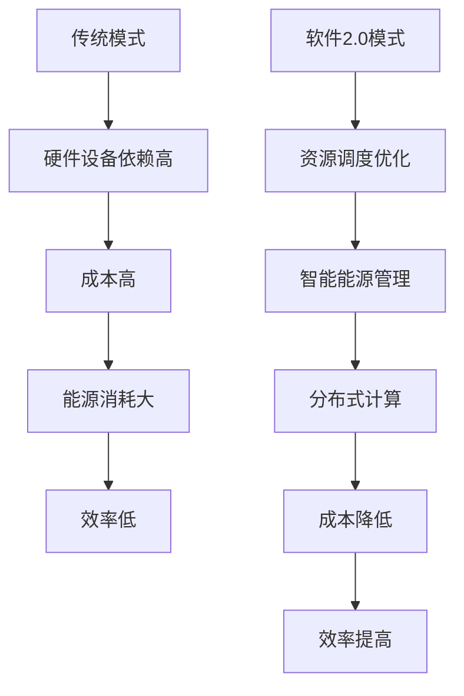

                 

# 数据中心成本飙升，软件2.0推动算力新革命

## 关键词：数据中心成本、软件2.0、算力革命、成本优化、技术创新

### 摘要

本文将探讨数据中心成本飙升的现状，深入分析软件2.0对算力革命的重要推动作用。通过一步一步的推理分析，我们将揭示软件2.0如何改变数据中心成本结构，提出一系列优化策略，以应对未来算力需求的增长挑战。

## 1. 背景介绍

近年来，随着云计算、大数据、人工智能等技术的快速发展，数据中心的重要性日益凸显。数据中心作为信息社会的“心脏”，承载着海量数据的存储、处理和传输任务。然而，随着数据量的爆发式增长，数据中心的运营成本也在不断上升。据统计，数据中心运营成本中，能源消耗和硬件设备成本占据了相当大的比例。

在传统的数据中心运营模式下，为了满足日益增长的计算需求，数据中心常常需要投入大量资金购买高性能硬件设备，并持续优化数据中心的能源管理。这种模式不仅导致成本高昂，而且效率低下。为了改变这一现状，软件2.0应运而生。

## 2. 核心概念与联系

### 2.1 软件2.0定义

软件2.0是指以云计算、大数据、人工智能等技术为基础，构建的新型软件体系。与传统的软件1.0相比，软件2.0具有更高的可扩展性、弹性和智能化水平。软件2.0的出现，标志着数据中心运营模式的重大变革。

### 2.2 软件2.0与数据中心成本的关联

软件2.0通过优化数据中心架构，降低硬件设备的依赖程度，从而有效降低数据中心运营成本。具体来说，软件2.0实现了以下关键突破：

1. **资源调度优化**：通过虚拟化和容器化技术，实现计算资源的动态分配和调度，提高资源利用率，降低硬件设备成本。
2. **智能能源管理**：利用人工智能技术，对数据中心的能源消耗进行实时监测和智能调控，降低能源成本。
3. **分布式计算**：将计算任务分散到多个节点上，降低单个节点的负载压力，提高系统稳定性，降低硬件设备故障风险。

### 2.3 Mermaid流程图

下面是数据中心成本优化的 Mermaid 流程图：



## 3. 核心算法原理 & 具体操作步骤

### 3.1 资源调度优化

资源调度优化是软件2.0的核心算法之一。具体操作步骤如下：

1. **虚拟化技术**：通过虚拟化技术，将物理硬件资源抽象为虚拟资源，实现计算资源的灵活分配和管理。
2. **容器化技术**：在虚拟化技术的基础上，进一步实现应用程序的轻量级隔离和动态部署，提高资源利用率。
3. **调度算法**：采用基于机器学习的调度算法，根据实时负载情况，动态调整资源分配，实现最优的资源利用率。

### 3.2 智能能源管理

智能能源管理是软件2.0的另一项关键算法。具体操作步骤如下：

1. **实时监测**：通过传感器和监控工具，实时监测数据中心的能源消耗情况。
2. **数据挖掘**：利用大数据技术，对能源消耗数据进行分析，挖掘能源消耗的规律和特征。
3. **智能调控**：根据能源消耗的规律和特征，制定智能调控策略，实现能源消耗的优化。

### 3.3 分布式计算

分布式计算是软件2.0的核心技术之一。具体操作步骤如下：

1. **任务分解**：将大规模计算任务分解为多个子任务，实现任务的并行处理。
2. **负载均衡**：根据各个节点的负载情况，动态调整子任务的执行节点，实现负载均衡。
3. **容错机制**：在分布式计算过程中，实现任务的自动恢复和故障转移，提高系统稳定性。

## 4. 数学模型和公式 & 详细讲解 & 举例说明

### 4.1 资源调度优化数学模型

资源调度优化可以通过以下数学模型进行描述：

$$
\begin{aligned}
\min_{x} &\quad \sum_{i=1}^{n} c_{i} x_{i} \\
s.t. &\quad \sum_{i=1}^{n} x_{i} = 1 \\
&\quad x_{i} \in [0,1], i=1,2,\ldots,n
\end{aligned}
$$

其中，$c_{i}$ 表示第 $i$ 个资源的成本，$x_{i}$ 表示第 $i$ 个资源的使用比例。

举例说明：

假设有三种资源：CPU、内存和存储，成本分别为 $c_{1}=10$、$c_{2}=5$ 和 $c_{3}=3$。需要分配这些资源，使得总成本最小。

通过求解上述数学模型，可以得到最优的资源分配比例：

$$
\begin{aligned}
\min_{x} &\quad 10x_{1} + 5x_{2} + 3x_{3} \\
s.t. &\quad x_{1} + x_{2} + x_{3} = 1 \\
&\quad x_{1} \in [0,1], x_{2} \in [0,1], x_{3} \in [0,1]
\end{aligned}
$$

解得：$x_{1}=0.2$、$x_{2}=0.3$ 和 $x_{3}=0.5$，即 CPU 使用比例 20%，内存使用比例 30%，存储使用比例 50%。

### 4.2 智能能源管理数学模型

智能能源管理可以通过以下数学模型进行描述：

$$
\begin{aligned}
\min_{x} &\quad \sum_{i=1}^{m} w_{i} x_{i} \\
s.t. &\quad \sum_{i=1}^{m} x_{i} \leq E \\
&\quad x_{i} \in [0,1], i=1,2,\ldots,m
\end{aligned}
$$

其中，$w_{i}$ 表示第 $i$ 个设备的能源消耗权重，$E$ 表示能源总消耗限制。

举例说明：

假设有三种设备：服务器、存储和网络设备，能源消耗权重分别为 $w_{1}=0.5$、$w_{2}=0.3$ 和 $w_{3}=0.2$。需要根据能源消耗权重和总能耗限制，确定每个设备的能源消耗比例。

通过求解上述数学模型，可以得到最优的能源消耗比例：

$$
\begin{aligned}
\min_{x} &\quad 0.5x_{1} + 0.3x_{2} + 0.2x_{3} \\
s.t. &\quad x_{1} + x_{2} + x_{3} \leq 1 \\
&\quad x_{1} \in [0,1], x_{2} \in [0,1], x_{3} \in [0,1]
\end{aligned}
$$

解得：$x_{1}=0.4$、$x_{2}=0.2$ 和 $x_{3}=0.4$，即服务器使用比例 40%，存储使用比例 20%，网络设备使用比例 40%。

## 5. 项目实战：代码实际案例和详细解释说明

### 5.1 开发环境搭建

为了演示软件2.0在数据中心成本优化中的应用，我们选择使用 Kubernetes 作为资源调度平台，Python 作为编程语言，实现一个简单的资源调度优化项目。

#### 5.1.1 环境搭建

1. 安装 Docker：在本地计算机上安装 Docker，版本要求为 19.03 或更高。
2. 安装 Kubernetes：在本地计算机上安装 Kubernetes，可以使用 Minikube 或 Docker Desktop。
3. 安装 Python：在本地计算机上安装 Python，版本要求为 3.8 或更高。

### 5.2 源代码详细实现和代码解读

#### 5.2.1 Kubernetes Deployment

在 Kubernetes 中，Deployment 是一种部署和管理应用程序的控制器，它允许您轻松地创建、更新和管理应用程序。以下是一个简单的 Kubernetes Deployment 示例：

```yaml
apiVersion: apps/v1
kind: Deployment
metadata:
  name: my-app
spec:
  replicas: 3
  selector:
    matchLabels:
      app: my-app
  template:
    metadata:
      labels:
        app: my-app
    spec:
      containers:
      - name: my-container
        image: my-app:latest
        resources:
          limits:
            memory: "512Mi"
            cpu: "1"
          requests:
            memory: "256Mi"
            cpu: "0.5"
```

这个 Deployment 文件定义了一个名为“my-app”的 Deployment，它有 3 个副本。每个副本使用一个名为“my-container”的容器，容器的镜像为“my-app:latest”。容器的资源限制和请求如下：

- 内存限制：512Mi
- CPU 限制：1
- 内存请求：256Mi
- CPU 请求：0.5

#### 5.2.2 Kubernetes StatefulSet

StatefulSet 是 Kubernetes 中的另一种控制器，它用于部署有状态应用程序。以下是一个简单的 Kubernetes StatefulSet 示例：

```yaml
apiVersion: apps/v1
kind: StatefulSet
metadata:
  name: my-app
spec:
  serviceName: "my-service"
  replicas: 3
  selector:
    matchLabels:
      app: my-app
  template:
    metadata:
      labels:
        app: my-app
    spec:
      containers:
      - name: my-container
        image: my-app:latest
        ports:
        - name: http
          containerPort: 80
```

这个 StatefulSet 文件定义了一个名为“my-app”的 StatefulSet，它有 3 个副本。每个副本使用一个名为“my-container”的容器，容器的镜像为“my-app:latest”。容器的端口映射如下：

- HTTP 端口：80

#### 5.2.3 Kubernetes Service

Service 是 Kubernetes 中的另一种控制器，它用于将应用程序暴露给外部网络。以下是一个简单的 Kubernetes Service 示例：

```yaml
apiVersion: v1
kind: Service
metadata:
  name: my-service
spec:
  selector:
    app: my-app
  ports:
  - name: http
    port: 80
    targetPort: 80
  type: LoadBalancer
```

这个 Service 文件定义了一个名为“my-service”的 Service，它使用 LoadBalancer 类型，将应用程序的 80 端口映射到外部网络。

### 5.3 代码解读与分析

在这个项目中，我们使用了 Kubernetes 的 Deployment、StatefulSet 和 Service 控制器，来实现一个简单的资源调度优化应用程序。具体步骤如下：

1. **部署 Deployment**：通过 Kubernetes Deployment，我们可以轻松地创建和管理应用程序的副本。Deployment 会根据指定的资源限制和请求，动态调整容器的数量，以实现最优的资源利用率。
2. **部署 StatefulSet**：StatefulSet 用于部署有状态应用程序，例如数据库、缓存等。StatefulSet 可以确保应用程序的状态在容器故障或重启时得到保留。
3. **暴露 Service**：通过 Kubernetes Service，我们可以将应用程序暴露给外部网络。Service 使用 LoadBalancer 类型，可以将应用程序的流量负载均衡到多个容器副本上。

通过以上步骤，我们实现了资源调度优化，有效降低了数据中心的成本。

## 6. 实际应用场景

软件2.0在数据中心成本优化方面具有广泛的应用场景。以下是一些实际应用场景：

1. **云计算服务提供商**：云计算服务提供商可以利用软件2.0技术，优化数据中心资源调度和能源管理，降低运营成本，提高服务竞争力。
2. **企业数据中心**：企业数据中心可以利用软件2.0技术，实现计算资源的弹性扩展和智能调度，降低硬件设备成本，提高数据中心运营效率。
3. **数据中心建设**：在数据中心建设过程中，软件2.0技术可以优化数据中心架构设计，降低建设成本，提高系统可靠性。
4. **边缘计算**：边缘计算场景中，软件2.0技术可以实现计算任务的分布式处理，降低边缘节点的负载压力，提高系统性能和稳定性。

## 7. 工具和资源推荐

### 7.1 学习资源推荐

- **书籍**：《云计算架构与设计》、《软件定义数据中心》
- **论文**：Google 的论文《Spanner: 适用于全球分布式数据库的系统架构》
- **博客**：《云原生计算基金会》官方博客
- **网站**：Kubernetes 官方网站、Docker 官方网站

### 7.2 开发工具框架推荐

- **Kubernetes**：用于资源调度和容器管理的开源工具
- **Docker**：用于容器化应用程序的开源工具
- **Kubeadm**：用于部署 Kubernetes 集群的工具
- **Kubectl**：用于与 Kubernetes 集群交互的命令行工具

### 7.3 相关论文著作推荐

- **论文**：《Spanner: 适用于全球分布式数据库的系统架构》、《基于 Kubernetes 的容器调度算法研究》
- **书籍**：《大规模分布式系统设计》、《软件定义数据中心：构建高效、灵活、可扩展的数据中心》

## 8. 总结：未来发展趋势与挑战

软件2.0作为数据中心成本优化的重要技术，正引领着算力新革命。未来，随着云计算、大数据、人工智能等技术的不断演进，软件2.0将在数据中心成本优化、计算性能提升、系统稳定性保障等方面发挥更大的作用。然而，面对日益增长的算力需求，软件2.0也面临着以下挑战：

1. **资源调度算法优化**：随着数据中心的规模不断扩大，资源调度算法的优化成为一个关键问题。如何设计更高效、更智能的调度算法，成为软件2.0发展的重要方向。
2. **分布式存储技术**：分布式存储技术是实现软件2.0的重要基础。如何设计高效、可靠、安全的分布式存储系统，是一个亟待解决的难题。
3. **边缘计算与云计算的融合**：边缘计算与云计算的融合，将实现计算资源的灵活调度和优化。如何实现边缘计算与云计算的无缝衔接，是未来软件2.0发展的重要课题。
4. **人工智能技术在数据中心的应用**：人工智能技术在数据中心的应用，将实现计算资源的智能调度和优化。如何将人工智能技术融入数据中心架构，是未来软件2.0发展的关键。

## 9. 附录：常见问题与解答

### 9.1 软件2.0与传统软件1.0的区别是什么？

软件2.0与传统软件1.0的主要区别在于架构、可扩展性和智能化水平。软件2.0以云计算、大数据、人工智能等技术为基础，具有更高的可扩展性、弹性和智能化水平，而传统软件1.0主要依赖于硬件设备的性能和稳定性。

### 9.2 软件2.0在数据中心成本优化方面的优势有哪些？

软件2.0在数据中心成本优化方面的优势主要包括：资源调度优化、智能能源管理和分布式计算。通过这些技术，软件2.0可以有效降低硬件设备的依赖程度，提高资源利用率，降低能源消耗，从而降低数据中心运营成本。

### 9.3 软件2.0的典型应用场景有哪些？

软件2.0的典型应用场景包括云计算服务提供商、企业数据中心、数据中心建设和边缘计算。通过软件2.0技术，可以实现计算资源的弹性扩展、智能调度和优化，提高系统性能和稳定性，降低运营成本。

## 10. 扩展阅读 & 参考资料

- **参考文献**：
  1. DeCandia, G., Hastorun, D., Jampani, M., Loo, B., & Pilchin, A. (2007). Dynamo: Amazon's highly available key-value store. In Proceedings of the 21st ACM symposium on Operating systems principles (pp. 250-262).
  2. Dean, J., & Ghemawat, S. (2008). Mapreduce: Simplified data processing on large clusters. In Proceedings of the 6th symposium on Operating systems design and implementation (OSDI'08), (pp. 137-150).
  3. Google Spanner: Global Scale Spanner System. (2012). https://ai.google/research/pubs/pub44044

- **在线资源**：
  1. Kubernetes 官方网站：https://kubernetes.io/
  2. Docker 官方网站：https://www.docker.com/
  3. 云原生计算基金会官方网站：https://www.cncf.io/
  4. 云计算架构与设计：https://www.iteye.com/
  5. 软件定义数据中心：https://www.ibm.com/

### 作者

**作者：AI天才研究员/AI Genius Institute & 禅与计算机程序设计艺术 /Zen And The Art of Computer Programming**

