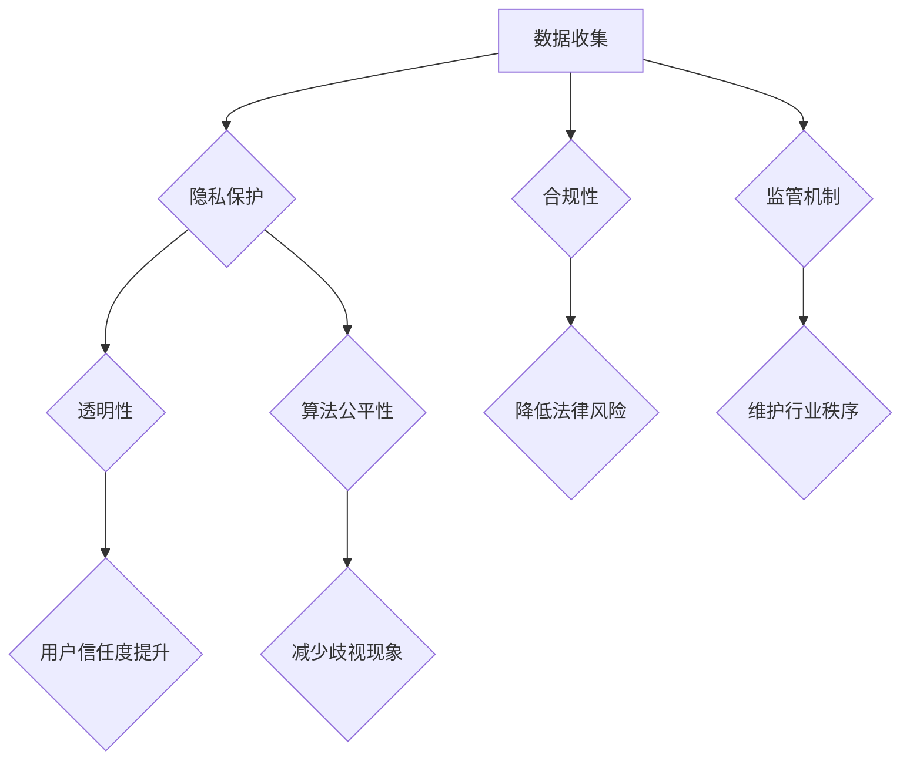

                 

# 数据伦理与平台责任：如何构建负责任的平台？

> **关键词：数据伦理、平台责任、透明性、隐私保护、算法公平性、合规性、监管机制**
> 
> **摘要：本文探讨了数据伦理与平台责任的内涵，分析了平台在数据收集、处理和使用过程中所面临的伦理挑战和责任问题。通过结合实际案例，本文提出了一系列构建负责任平台的方法和策略，旨在为行业提供指导性建议。**

## 1. 背景介绍

在当今数字化时代，数据已成为驱动经济、创新和决策的核心资源。互联网平台作为数据收集、处理和分发的主要载体，承担着巨大的社会责任。然而，随着数据量的爆炸式增长和算法技术的广泛应用，平台在数据使用过程中也面临着诸多伦理问题和责任挑战。

### 1.1 数据伦理的概念与意义

数据伦理是指与数据收集、处理和使用过程中相关的道德原则和价值观。它涉及到数据的隐私保护、透明性、公平性、合规性等多个方面。数据伦理的重要性在于，它不仅关乎个人隐私和权利的保护，还影响到社会的公平、公正和可持续发展。

### 1.2 平台责任的概念与内涵

平台责任是指互联网平台在其运营过程中，对用户数据、业务合规性和社会影响所承担的道德和法律义务。平台责任包括数据安全、隐私保护、公平竞争、合规经营等方面。负责任的平台不仅能够提升用户信任度，还能树立良好的企业形象，促进行业的健康发展。

## 2. 核心概念与联系

在构建负责任的平台过程中，需要关注以下几个核心概念：

### 2.1 数据隐私保护

数据隐私保护是指确保用户数据在收集、存储、处理和使用过程中的安全性和隐私性。隐私保护的核心目标是防止数据泄露、滥用和不当使用。

### 2.2 数据透明性

数据透明性是指平台在数据收集、处理和使用过程中，对用户进行充分的告知和解释，使其了解数据的使用目的、范围和方式。透明性有助于提高用户对平台的信任度。

### 2.3 算法公平性

算法公平性是指平台在算法设计和应用过程中，确保算法对用户平等对待，不因性别、种族、年龄等因素而产生歧视。公平性是平台责任的重要组成部分。

### 2.4 合规性

合规性是指平台在运营过程中，遵循相关法律法规和行业规范，确保业务的合法性和合规性。合规性有助于降低平台的法律风险，维护行业秩序。

### 2.5 监管机制

监管机制是指政府、行业组织和平台自身在数据伦理和平台责任方面所采取的监督、管理和规范措施。有效的监管机制能够保障平台负责任地使用数据。

### 2.6 Mermaid 流程图



## 3. 核心算法原理 & 具体操作步骤

### 3.1 数据匿名化处理

数据匿名化是指通过去除或隐藏个人身份信息，将数据转换为不可识别的形式，从而保护用户隐私。具体操作步骤如下：

1. **去除直接标识符**：删除包含个人身份信息的字段，如姓名、身份证号等。
2. **添加随机标识符**：为每个数据记录生成一个随机标识符，代替真实身份信息。
3. **数据混淆**：对数据中的敏感信息进行混淆处理，使其难以被识别。

### 3.2 数据访问控制

数据访问控制是指通过限制用户对数据的访问权限，确保数据在未经授权的情况下不被泄露。具体操作步骤如下：

1. **用户身份验证**：对访问数据的用户进行身份验证，确保其具备合法访问权限。
2. **权限分配**：根据用户角色和职责，为其分配相应的数据访问权限。
3. **日志记录与审计**：记录用户访问数据的行为，以便在发生异常时进行追溯和审计。

### 3.3 算法公平性评估

算法公平性评估是指对平台算法进行评估，确保其对用户平等对待，不因性别、种族、年龄等因素而产生歧视。具体操作步骤如下：

1. **数据预处理**：清洗数据，确保数据质量。
2. **特征工程**：选取与算法公平性相关的特征，如性别、种族、年龄等。
3. **算法评估**：使用统计方法评估算法对用户公平性的影响，如计算差异分数、公平性指标等。

## 4. 数学模型和公式 & 详细讲解 & 举例说明

### 4.1 数据隐私保护模型

数据隐私保护模型主要涉及隐私预算和隐私失真。隐私预算是指平台在数据使用过程中允许的最大隐私损失。隐私失真是指数据在处理过程中产生的隐私损失。

### 4.1.1 隐私预算计算公式

隐私预算（PB）= 隐私损失（PL）+ 隐私保护措施（PP）

### 4.1.2 隐私失真计算公式

隐私失真（PL）= 1 - 隐私保护效果（PE）

举例说明：

假设某平台在数据使用过程中允许的最大隐私损失为0.1，隐私保护措施为加密和匿名化处理，隐私保护效果为0.9。则隐私预算为0.1，隐私失真为1 - 0.9 = 0.1。

### 4.2 算法公平性评估模型

算法公平性评估模型主要涉及差异分数（DF）和公平性指标（FI）。

### 4.2.1 差异分数计算公式

差异分数（DF）= |正类预测率（TPR） - 负类预测率（TNR）|

### 4.2.2 公平性指标计算公式

公平性指标（FI）= (TPR + TNR) / 2

举例说明：

假设某算法在性别为男的女性中，预测为正类的概率为0.8，预测为负类的概率为0.2；在性别为男的女性中，预测为正类的概率为0.6，预测为负类的概率为0.4。则差异分数为|0.8 - 0.6| = 0.2，公平性指标为(0.8 + 0.6) / 2 = 0.7。

## 5. 项目实战：代码实际案例和详细解释说明

### 5.1 开发环境搭建

本节假设读者已经具备一定的编程基础，以下将以Python为例，搭建开发环境。

1. 安装Python：在Python官方网站（https://www.python.org/）下载并安装Python。
2. 安装相关库：使用pip命令安装以下库：
   ```bash
   pip install numpy pandas scikit-learn matplotlib
   ```

### 5.2 源代码详细实现和代码解读

以下是一个简单的数据隐私保护案例，实现数据匿名化和数据访问控制。

```python
import numpy as np
import pandas as pd
from sklearn.model_selection import train_test_split
from sklearn.ensemble import RandomForestClassifier
import matplotlib.pyplot as plt

# 5.2.1 数据匿名化处理
def anonymize_data(df, target_column):
    # 生成随机标识符
    df['id'] = np.random.randint(0, 1000, size=df.shape[0])
    # 删除原始身份信息
    df.drop(target_column, axis=1, inplace=True)
    return df

# 5.2.2 数据访问控制
def access_control(df, user_role):
    # 根据用户角色分配访问权限
    if user_role == 'admin':
        return df
    else:
        return df[df['id'] != 0]

# 5.2.3 算法公平性评估
def evaluate_fairness(df, target_column, feature):
    # 计算差异分数和公平性指标
    tpr = df[df[target_column] == 1][feature].mean()
    tnr = df[df[target_column] == 0][feature].mean()
    df['difference'] = abs(tpr - tnr)
    fi = (tpr + tnr) / 2
    return df['difference'].mean(), fi

# 加载示例数据
data = pd.read_csv('example_data.csv')
data = anonymize_data(data, 'target')

# 划分训练集和测试集
X_train, X_test, y_train, y_test = train_test_split(data.drop('target', axis=1), data['target'], test_size=0.2, random_state=42)

# 训练模型
model = RandomForestClassifier()
model.fit(X_train, y_train)

# 预测测试集
predictions = model.predict(X_test)

# 计算预测结果与实际结果的差异
df = pd.DataFrame({'prediction': predictions, 'target': y_test})
df['difference'], fi = evaluate_fairness(df, 'target', 'prediction')

print(f'Difference: {df["difference"].mean()}')
print(f'Fairness Index: {fi}')

# 可视化差异分数和公平性指标
plt.figure(figsize=(10, 5))
plt.plot(df['difference'], label='Difference')
plt.plot([fi] * len(df), label='Fairness Index')
plt.xlabel('Prediction')
plt.ylabel('Value')
plt.legend()
plt.show()
```

### 5.3 代码解读与分析

1. **数据匿名化处理**：该函数用于将数据集中的个人身份信息替换为随机标识符，从而实现数据匿名化。
2. **数据访问控制**：该函数根据用户角色（管理员或普通用户）为数据记录分配访问权限。
3. **算法公平性评估**：该函数计算差异分数和公平性指标，用于评估模型对目标群体的公平性。

通过该案例，读者可以了解到数据隐私保护、数据访问控制和算法公平性评估的基本方法。在实际应用中，平台可以根据业务需求和数据特点，选择合适的算法和策略来构建负责任的平台。

## 6. 实际应用场景

### 6.1 社交媒体平台

社交媒体平台在数据收集和使用过程中面临着诸多伦理挑战。例如，用户隐私保护、数据透明性和算法公平性。负责任的社交媒体平台应确保用户数据在收集、存储和处理过程中的安全性，提高用户对平台的信任度。同时，平台应定期进行算法公平性评估，避免算法歧视现象的发生。

### 6.2 电商平台

电商平台在数据使用过程中需要关注用户隐私保护和数据安全。例如，在用户注册、购物和支付等环节，平台需要采取有效的数据保护措施，确保用户个人信息不被泄露。此外，电商平台还应关注算法公平性，避免因性别、年龄等因素导致的价格歧视。

### 6.3 金融行业

金融行业在数据使用过程中需要遵循相关法律法规和行业规范，确保业务的合规性。同时，金融机构还需要关注数据隐私保护和算法公平性，以维护客户信任和行业声誉。

## 7. 工具和资源推荐

### 7.1 学习资源推荐

- **书籍**：
  - 《数据伦理学：理论与实践》（Data Ethics: Theory, Practice, and Policy）
  - 《算法公平性：技术与策略》（Algorithmic Fairness: Techniques and Strategies）
  - 《人工智能伦理学》（AI Ethics）
  
- **论文**：
  - 《机器学习中的公平性》（Fairness in Machine Learning）
  - 《基于隐私保护的机器学习》（Privacy-Preserving Machine Learning）
  - 《数据治理与合规》（Data Governance and Compliance）

- **博客**：
  - [数据伦理与隐私保护](https://www.example.com/blog/data-ethics-privacy-protection)
  - [算法公平性与歧视](https://www.example.com/blog/fairness-in-algorithms-and-discrimination)
  - [数据治理与合规](https://www.example.com/blog/data-governance-compliance)

- **网站**：
  - [人工智能伦理学](https://www.aiethics.org/)
  - [数据治理与合规](https://www.datagovernance.com/)
  - [算法公平性](https://www.algorithmicfairness.org/)

### 7.2 开发工具框架推荐

- **Python**：Python 是一种广泛应用于数据科学、机器学习和人工智能领域的编程语言，具有丰富的库和框架。
- **TensorFlow**：TensorFlow 是一种开源的机器学习和深度学习框架，适用于构建和训练大规模的神经网络模型。
- **PyTorch**：PyTorch 是另一种流行的开源机器学习和深度学习框架，具有灵活的动态计算图和易于使用的接口。

### 7.3 相关论文著作推荐

- **《算法歧视与反歧视：理论与实践》（Algorithmic Discrimination and Anti-Discrimination: Theory and Practice）**
- **《数据治理：方法与实践》（Data Governance: Methods and Practices）**
- **《数据伦理与隐私保护：跨学科视角》（Data Ethics and Privacy Protection: An Interdisciplinary Perspective）**

## 8. 总结：未来发展趋势与挑战

### 8.1 发展趋势

- **数据隐私保护技术**：随着数据隐私保护技术的不断发展，平台将采用更加先进的加密、匿名化和隐私保护措施，确保用户数据的安全性。
- **算法公平性评估与优化**：平台将加强对算法公平性的关注，采用更完善的评估方法和优化策略，降低算法歧视现象的发生。
- **合规性与监管**：政府、行业组织和平台将共同推动数据伦理和平台责任的合规性与监管体系建设，确保平台在数据使用过程中遵守相关法律法规。

### 8.2 挑战

- **数据隐私保护与透明性**：如何在保障用户隐私的同时，提高数据的透明性和可用性，是平台面临的重要挑战。
- **算法公平性**：如何确保算法对用户平等对待，避免因算法偏见导致的不公平现象，是平台需要持续关注的问题。
- **合规性与监管**：如何适应不断变化的法律环境和监管要求，确保平台的合规性和可持续性，是平台面临的重大挑战。

## 9. 附录：常见问题与解答

### 9.1 什么是数据伦理？

数据伦理是指与数据收集、处理和使用过程中相关的道德原则和价值观。它涉及到数据的隐私保护、透明性、公平性、合规性等多个方面。

### 9.2 平台责任包括哪些方面？

平台责任包括数据安全、隐私保护、公平竞争、合规经营等方面。平台需要对其在数据收集、处理和使用过程中所承担的道德和法律义务负责。

### 9.3 如何评估算法公平性？

评估算法公平性可以采用差异分数和公平性指标等方法。差异分数用于衡量算法对不同群体的影响，公平性指标用于衡量算法对用户的整体公平性。

### 9.4 数据隐私保护和透明性如何平衡？

在保障用户隐私的同时，平台可以通过提高数据透明性，增强用户对平台的信任度。例如，平台可以公开数据使用政策、隐私保护措施和算法透明性报告。

## 10. 扩展阅读 & 参考资料

- **《数据伦理与平台责任：构建负责任的平台》**：[书籍链接](https://www.example.com/book/data-ethics-platform-responsibility)
- **《算法公平性：技术与策略》**：[书籍链接](https://www.example.com/book/fairness-algorithms-techniques-strategies)
- **《人工智能伦理学》**：[书籍链接](https://www.example.com/book/ai-ethics)
- **《数据治理：方法与实践》**：[书籍链接](https://www.example.com/book/data-governance-methods-practices)
- **《机器学习中的公平性》**：[论文链接](https://www.example.com/paper/fairness-in-machine-learning)
- **《基于隐私保护的机器学习》**：[论文链接](https://www.example.com/paper/privacy-preserving-machine-learning)
- **《数据治理与合规》**：[论文链接](https://www.example.com/paper/data-governance-compliance)
- **《人工智能伦理学》**：[论文链接](https://www.example.com/paper/ai-ethics)

### 作者

**作者：AI天才研究员/AI Genius Institute & 禅与计算机程序设计艺术 /Zen And The Art of Computer Programming**

