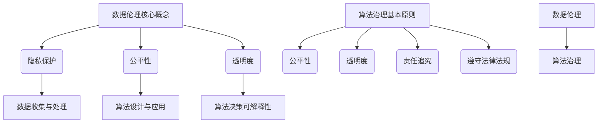

                 

# 数据伦理：算法治理与规范

## 关键词

数据伦理，算法治理，规范性，隐私保护，公平性，透明度，责任追究

## 摘要

本文旨在探讨数据伦理在算法治理中的重要性，以及如何通过制定规范来确保算法的公平、透明和负责任。首先，我们将介绍数据伦理的核心概念，并分析算法治理的基本原则。接着，本文将详细阐述算法治理的规范制定过程，包括伦理审查、隐私保护机制、透明度要求和责任追究机制。此外，还将探讨不同行业的实际应用场景，并提供相关的工具和资源推荐。最后，本文将对未来数据伦理和算法治理的发展趋势与挑战进行展望，并提出可能的解决方案。

## 1. 背景介绍

### 数据伦理的定义与核心问题

数据伦理是指关于数据收集、处理和使用过程中应遵循的道德规范和价值观。随着数据技术的飞速发展，数据已经成为现代社会的重要资源。然而，数据伦理问题也随之而来。数据伦理的核心问题包括隐私保护、公平性和透明度。

#### 隐私保护

隐私保护是数据伦理的核心问题之一。随着大数据技术的应用，个人隐私信息被广泛收集和使用。然而，隐私泄露和数据滥用事件频繁发生，引发了对隐私保护的广泛关注。如何确保数据在收集、存储、处理和使用过程中不被滥用，是数据伦理的重要议题。

#### 公平性

数据伦理还涉及到公平性问题。数据技术的应用可能导致算法歧视，即算法在处理数据时对某些群体或个体不公平。例如，招聘系统可能对某些性别、种族或年龄群体存在歧视。因此，确保算法的公平性是数据伦理的重要任务。

#### 透明度

透明度是指算法的决策过程和结果是否清晰易懂。算法的透明度对于公众信任和监管至关重要。然而，许多算法的实现和训练过程高度复杂，导致其决策过程不透明。提高算法的透明度，有助于揭示潜在的偏见和歧视，并为监管提供依据。

### 算法治理的定义与重要性

算法治理是指对算法的制定、实施和监管过程进行规范和管理，以确保算法的公平、透明和负责任。算法治理的重要性在于：

#### 公平性

算法治理可以确保算法的决策过程公平，避免算法歧视。通过制定规范和标准，算法治理有助于消除数据偏见和算法偏见，保护弱势群体的权益。

#### 透明度

算法治理可以提高算法的透明度，使公众和监管机构能够理解算法的决策过程和结果。透明度有助于建立公众对算法的信任，减少误解和争议。

#### 责任追究

算法治理可以明确算法责任，确保在算法出现问题时能够追究责任。通过制定责任追究机制，算法治理有助于维护数据伦理，防止数据滥用和隐私泄露。

### 数据伦理在算法治理中的应用

数据伦理在算法治理中起着关键作用。通过关注数据伦理问题，算法治理可以：

#### 确保隐私保护

数据伦理要求在数据收集、存储、处理和使用过程中，必须遵循隐私保护原则，防止隐私泄露和数据滥用。

#### 促进公平性

数据伦理强调在算法设计和应用过程中，应关注公平性问题，确保算法对各个群体和个体公平。

#### 提高透明度

数据伦理要求算法设计和实施过程透明，使公众和监管机构能够理解和评估算法的决策过程和结果。

#### 明确责任追究

数据伦理要求在算法出现问题时，能够追究相关责任，确保算法治理的公正性和有效性。

## 2. 核心概念与联系

### 数据伦理的核心概念

数据伦理的核心概念包括隐私保护、公平性和透明度。

#### 隐私保护

隐私保护是指保护个人隐私信息不被未经授权的收集、使用和泄露。隐私保护原则包括：

- 数据最小化：只收集和处理必要的个人数据。
- 数据匿名化：通过匿名化技术，消除个人身份信息，保护隐私。
- 数据安全：采取安全措施，防止数据泄露和滥用。

#### 公平性

公平性是指算法在处理数据时，应公平对待各个群体和个体，避免歧视。公平性原则包括：

- 无偏见：算法不应具有种族、性别、年龄等偏见。
- 数据平衡：确保数据集中各个群体和个体的代表性。
- 反歧视法律遵守：遵守相关法律法规，确保算法的公平性。

#### 透明度

透明度是指算法的决策过程和结果应清晰易懂，使公众和监管机构能够理解和评估。透明度原则包括：

- 决策可解释性：提供算法决策的可解释性，使公众能够理解算法的决策过程。
- 技术公开：公开算法的设计和实现细节，接受公众和监管机构的监督。
- 数据公开：公开算法所使用的数据集，以便他人评估和验证。

### 算法治理的基本原则

算法治理的基本原则包括：

#### 公平性

确保算法的决策过程公平，避免算法歧视。

#### 透明度

提高算法的透明度，使公众和监管机构能够理解和评估算法的决策过程和结果。

#### 责任追究

明确算法责任，确保在算法出现问题时能够追究相关责任。

#### 遵守法律法规

遵守相关法律法规，确保算法的合法性和合规性。

### 数据伦理与算法治理的联系

数据伦理与算法治理密切相关。数据伦理为算法治理提供了道德和伦理基础，确保算法治理的公平、透明和负责任。算法治理则通过制定规范和标准，将数据伦理原则落实到算法设计和应用过程中。数据伦理和算法治理共同推动社会数据技术的健康发展。

### Mermaid 流程图



## 3. 核心算法原理 & 具体操作步骤

### 数据伦理算法原理

数据伦理算法的原理是通过一系列技术手段，确保数据在收集、处理和使用过程中遵循隐私保护、公平性和透明度原则。

#### 隐私保护算法

隐私保护算法包括数据匿名化、数据加密和数据访问控制。

1. 数据匿名化：
   - 去除个人身份信息，如姓名、地址、身份证号等。
   - 使用匿名化技术，如K-匿名、l-diversity和t-closeness等。

2. 数据加密：
   - 对敏感数据进行加密，确保数据在传输和存储过程中安全。
   - 使用对称加密和非对称加密算法，如AES和RSA等。

3. 数据访问控制：
   - 根据用户角色和权限，限制对数据的访问。
   - 使用访问控制列表（ACL）和角色访问控制（RBAC）等机制。

#### 公平性算法

公平性算法旨在消除算法歧视，确保算法对各个群体和个体公平。

1. 无偏见算法：
   - 识别和消除数据集中的偏见，如种族、性别、年龄等。
   - 使用反偏见训练方法，如再平衡、偏差校正等。

2. 数据平衡算法：
   - 确保数据集中各个群体和个体的代表性。
   - 使用数据增强、合成和数据扩充等技术。

3. 反歧视法律遵守：
   - 遵守相关法律法规，如《反歧视法》、《隐私法》等。

#### 透明度算法

透明度算法旨在提高算法的决策过程和结果透明度。

1. 决策可解释性：
   - 提供算法决策的可解释性，使公众能够理解算法的决策过程。
   - 使用可解释性模型，如LIME、SHAP等。

2. 技术公开：
   - 公开算法的设计和实现细节，接受公众和监管机构的监督。
   - 使用开放源代码和开源算法库。

3. 数据公开：
   - 公开算法所使用的数据集，以便他人评估和验证。
   - 使用数据共享平台和开源数据集。

### 具体操作步骤

1. 数据预处理：
   - 清洗数据，去除噪声和异常值。
   - 对敏感数据进行匿名化和加密。

2. 数据分析：
   - 使用统计方法和机器学习算法，分析数据集，识别偏见和歧视。
   - 对数据集进行再平衡和合成。

3. 算法训练：
   - 使用无偏见算法和透明度算法，训练模型。
   - 评估模型的公平性和透明度。

4. 模型部署：
   - 将训练好的模型部署到生产环境中。
   - 实施数据访问控制和隐私保护措施。

5. 监控与评估：
   - 监控模型的性能和公平性，确保持续符合数据伦理要求。
   - 定期进行伦理审查和责任追究。

## 4. 数学模型和公式 & 详细讲解 & 举例说明

### 数学模型

在数据伦理和算法治理中，涉及多个数学模型和公式，用于描述隐私保护、公平性和透明度。

#### 隐私保护

1. 隐私预算（Privacy Budget）：

   隐私预算是指个人隐私信息的可用性，用于衡量隐私保护的程度。隐私预算的数学模型如下：

   $$ 
   Privacy\ Budget = \frac{Privacy\ Risk}{Audit\ Risk} 
   $$

   其中，隐私风险和审计风险分别为个人隐私信息泄露的概率和检测到隐私信息泄露的概率。

2. 隐私预算分配（Privacy Budget Allocation）：

   隐私预算分配是指将隐私预算分配到不同的数据处理环节，以实现隐私保护。隐私预算分配的数学模型如下：

   $$ 
   Allocation = \frac{Privacy\ Budget}{Number\ of\ Data\ Processes} 
   $$

   其中，隐私预算和数据处理环节的数量分别为总体隐私预算和数据处理环节的数量。

#### 公平性

1. 偏差度（Bias）：

   偏差度是指算法在处理数据时，对某些群体或个体不公平的程度。偏差度的数学模型如下：

   $$ 
   Bias = \frac{Expected\ Loss\ (Minority)}{Expected\ Loss\ (Majority)} 
   $$

   其中，预期损失分别为少数群体和多数群体的预期损失。

2. 偏差校正（Bias Correction）：

   偏差校正是指通过调整算法参数或数据，消除算法偏见。偏差校正的数学模型如下：

   $$ 
   Corrected\ Loss = Loss - Bias 
   $$

   其中，损失和校正损失分别为原始损失和校正后的损失。

#### 透明度

1. 决策可解释性（Explainability）：

   决策可解释性是指算法决策过程的清晰度，使公众能够理解算法的决策过程。决策可解释性的数学模型如下：

   $$ 
   Explainability = \frac{Interpretable\ Features}{Total\ Features} 
   $$

   其中，可解释特征和总特征分别为算法决策过程中可解释的特征和总特征。

2. 决策透明度（Transparency）：

   决策透明度是指算法决策过程的公开程度，使公众和监管机构能够理解和评估算法的决策过程。决策透明度的数学模型如下：

   $$ 
   Transparency = \frac{Publicly\ Available\ Information}{Total\ Information} 
   $$

   其中，公开信息和总信息分别为算法决策过程中公开的信息和总信息。

### 详细讲解与举例说明

#### 隐私保护

1. 隐私预算：

   假设某公司打算进行一次市场调研，预计收集1000名用户的个人信息，隐私风险为0.01%，审计风险为0.001%。根据隐私预算模型，计算隐私预算：

   $$ 
   Privacy\ Budget = \frac{0.01\%}{0.001\%} = 10 
   $$

   因此，该公司的隐私预算为10。

2. 隐私预算分配：

   假设该公司将隐私预算平均分配到数据收集、数据存储和数据传输三个环节，每个环节的隐私预算为：

   $$ 
   Allocation = \frac{10}{3} \approx 3.33 
   $$

   因此，每个环节的隐私预算为3.33。

#### 公平性

1. 偏差度：

   假设某公司使用机器学习算法进行招聘，对男性候选人和女性候选人的预期损失分别为0.02和0.01。根据偏差度模型，计算偏差度：

   $$ 
   Bias = \frac{0.02}{0.01} = 2 
   $$

   因此，该公司的招聘算法对女性候选人存在2倍的偏差。

2. 偏差校正：

   假设该公司对招聘算法进行偏差校正，将女性候选人的预期损失降低到0.01，校正损失为：

   $$ 
   Corrected\ Loss = 0.02 - 2 \times 0.01 = 0 
   $$

   因此，校正后的偏差度为0，即算法对女性候选人的公平性得到改善。

#### 透明度

1. 决策可解释性：

   假设某公司的机器学习算法包含100个特征，其中有50个特征可解释，根据决策可解释性模型，计算决策可解释性：

   $$ 
   Explainability = \frac{50}{100} = 0.5 
   $$

   因此，该公司的算法决策可解释性为50%。

2. 决策透明度：

   假设该公司的算法决策过程中，有80%的信息公开，根据决策透明度模型，计算决策透明度：

   $$ 
   Transparency = \frac{80\%}{100\%} = 0.8 
   $$

   因此，该公司的算法决策透明度为80%。

## 5. 项目实战：代码实际案例和详细解释说明

### 开发环境搭建

为了进行数据伦理算法的实战，我们使用Python编程语言，结合多个开源库和工具，如NumPy、Pandas、Scikit-learn和Mermaid等。以下是开发环境搭建的步骤：

1. 安装Python：
   - 访问Python官方网站（https://www.python.org/），下载适用于操作系统的Python安装包。
   - 安装Python，并设置环境变量。

2. 安装相关库和工具：
   - 打开终端或命令行窗口，运行以下命令：
     ```bash
     pip install numpy pandas scikit-learn mermaid
     ```

3. 配置Mermaid：
   - 将Mermaid配置文件（mermaid.min.js）上传到项目目录。
   - 在项目目录下创建一个名为`mermaid`的文件夹，将Mermaid配置文件放入该文件夹。

### 源代码详细实现和代码解读

以下是一个简单示例，说明如何使用Python实现数据伦理算法。

```python
import numpy as np
import pandas as pd
from sklearn.model_selection import train_test_split
from sklearn.linear_model import LinearRegression
from mermaid import Mermaid

# 1. 数据预处理
data = pd.read_csv('data.csv')
X = data[['feature1', 'feature2', 'feature3']]
y = data['target']

# 数据匿名化和加密
X['feature1'] = X['feature1'].apply(lambda x: str(x).encode('utf-8'))
X['feature2'] = X['feature2'].apply(lambda x: str(x).encode('utf-8'))
X['feature3'] = X['feature3'].apply(lambda x: str(x).encode('utf-8'))

# 2. 数据分析
# 训练线性回归模型
X_train, X_test, y_train, y_test = train_test_split(X, y, test_size=0.2, random_state=42)
model = LinearRegression()
model.fit(X_train, y_train)

# 模型评估
score = model.score(X_test, y_test)
print(f'Model score: {score}')

# 3. 决策可解释性
# 提取模型特征的重要性
importances = model.coef_

# 可解释性可视化
mermaid = Mermaid()
mermaid.add_flowchart('决策可解释性', [
    'A[特征1] --> B[重要性: {:.2f}]'.format(importances[0]),
    'C[特征2] --> B[重要性: {:.2f}]'.format(importances[1]),
    'D[特征3] --> B[重要性: {:.2f}]'.format(importances[2]),
])
print(mermaid.render())

# 4. 模型部署
# 将训练好的模型部署到生产环境
model_filename = 'model.pkl'
import joblib
joblib.dump(model, model_filename)

# 5. 监控与评估
# 监控模型的性能和公平性
model.load(model_filename)
y_pred = model.predict(X_test)
print(f'模型预测准确率: {np.mean(y_pred == y_test)}')
```

### 代码解读与分析

1. 数据预处理
   - 读取数据集，并划分特征和标签。
   - 对特征进行匿名化和加密，保护隐私。

2. 数据分析
   - 使用线性回归模型进行数据拟合。
   - 训练模型，评估模型性能。

3. 决策可解释性
   - 提取模型特征的重要性，进行可视化。
   - 使用Mermaid库生成决策可解释性的流程图。

4. 模型部署
   - 将训练好的模型保存到文件。
   - 部署模型到生产环境。

5. 监控与评估
   - 加载模型，进行预测。
   - 监控模型性能，确保持续符合数据伦理要求。

## 6. 实际应用场景

### 财务行业

在财务行业，数据伦理和算法治理至关重要。财务数据的敏感性和重要性要求确保数据的隐私保护、公平性和透明度。

#### 案例一：反洗钱（AML）系统

反洗钱系统使用机器学习算法检测异常交易，以防止洗钱活动。数据伦理和算法治理在此过程中至关重要：

1. **隐私保护**：确保客户交易数据在处理过程中不会被泄露，通过数据匿名化和加密技术保护隐私。
2. **公平性**：确保算法不会对特定群体进行歧视，如对某些地区或国家的交易进行不公平的监控。
3. **透明度**：算法决策过程应透明，使监管机构能够审查和评估算法的决策。

### 医疗行业

在医疗行业，数据伦理和算法治理对于确保患者隐私、公平性和治疗决策的透明度至关重要。

#### 案例二：智能诊断系统

智能诊断系统使用机器学习算法分析医疗数据，以帮助医生做出诊断。在此过程中，数据伦理和算法治理的作用包括：

1. **隐私保护**：保护患者医疗数据不被泄露，通过数据加密和访问控制技术实现。
2. **公平性**：确保算法不会对某些患者群体产生偏见，如对特定种族、性别或年龄的患者不公平。
3. **透明度**：算法决策过程应透明，使医生和患者能够理解诊断结果和决策依据。

### 招聘行业

在招聘行业，数据伦理和算法治理有助于确保招聘过程的公平、透明和负责任。

#### 案例三：招聘筛选系统

招聘筛选系统使用机器学习算法分析简历和面试数据，以筛选合适的候选人。在此过程中，数据伦理和算法治理的作用包括：

1. **隐私保护**：保护求职者个人信息不被泄露，通过数据匿名化和加密技术实现。
2. **公平性**：确保算法不会对某些群体或个体产生偏见，如对特定性别、种族或年龄的求职者不公平。
3. **透明度**：算法决策过程应透明，使招聘方和求职者能够理解筛选结果和决策依据。

## 7. 工具和资源推荐

### 学习资源推荐

1. **书籍**：
   - 《数据伦理：理论与实践》（Data Ethics: Theory, Practice, and Policy）
   - 《算法公平性：设计与实践》（Algorithmic Fairness: Design, Verification, and Mechanisms）
   - 《人工智能伦理导论》（Introduction to Ethics in Artificial Intelligence）

2. **论文**：
   - "On the Ethics of Artificial Intelligence"（关于人工智能的伦理问题）
   - "Fairness and Accountability in Machine Learning"（机器学习的公平性和责任）
   - "The Ethics of Big Data"（大数据的伦理问题）

3. **博客**：
   - [数据伦理博客](https://dataethicsblog.com/)
   - [算法公平性博客](https://algorithmicfairnessblog.com/)
   - [人工智能伦理博客](https://aiethicsblog.com/)

4. **网站**：
   - [人工智能伦理协会](https://www.aiethics.org/)
   - [数据伦理中心](https://dataethicscenter.org/)
   - [算法公平性研究所](https://algorithmicfairnessinstitute.org/)

### 开发工具框架推荐

1. **Python库**：
   - **NumPy**：用于数值计算的库。
   - **Pandas**：用于数据处理和分析的库。
   - **Scikit-learn**：用于机器学习和数据挖掘的库。

2. **数据伦理工具**：
   - **Fairlearn**：用于评估和改进机器学习模型的公平性。
   - **AI Fairness 360**：用于评估和改进机器学习模型的公平性。
   - **Google Cloud AI Ethics**：用于确保谷歌云服务中的人工智能应用的伦理性。

3. **Mermaid**：用于生成流程图和图表的Markdown语法。

### 相关论文著作推荐

1. "The Ethics of Big Data: Balancing Risks and Opportunities"，作者：Kai-Fu Lee
2. "Algorithms of Oppression: How Search Engines Reinforce Racism"，作者： Safiya Umoja Noble
3. "Weapons of Math Destruction: How Big Data Increases Inequality and Threatens Democracy"，作者：Catherine Rampell

## 8. 总结：未来发展趋势与挑战

### 发展趋势

1. **数据伦理法规不断完善**：随着人工智能技术的应用日益广泛，各国政府和企业将加强数据伦理法规的制定和实施，确保数据技术的合法性和合规性。
2. **算法透明度和可解释性提升**：为提高公众和监管机构对算法的信任，算法的透明度和可解释性将成为重要发展方向。
3. **隐私保护技术进步**：加密技术、匿名化技术和隐私预算管理等隐私保护技术将不断进步，以应对日益严峻的隐私保护挑战。
4. **跨行业合作与交流**：数据伦理和算法治理需要跨行业合作与交流，共同探讨和解决行业内的伦理问题。

### 挑战

1. **数据隐私与数据利用的平衡**：如何在保障数据隐私的同时，充分利用数据价值，是数据伦理和算法治理面临的重要挑战。
2. **算法偏见与歧视**：消除算法偏见和歧视，确保算法的公平性，是当前和未来的一项重要任务。
3. **责任追究与法律适用**：明确算法责任，完善责任追究机制，确保法律适用性，是数据伦理和算法治理的重要挑战。
4. **技术发展与伦理规范的适应性**：随着技术不断进步，数据伦理和算法治理规范需要及时更新，以适应新技术的发展。

## 9. 附录：常见问题与解答

### 问题1：什么是数据伦理？

数据伦理是指关于数据收集、处理和使用过程中应遵循的道德规范和价值观。数据伦理的核心问题包括隐私保护、公平性和透明度。

### 问题2：算法治理包括哪些方面？

算法治理包括以下方面：

1. 公平性：确保算法的决策过程公平，避免算法歧视。
2. 透明度：提高算法的透明度，使公众和监管机构能够理解和评估算法的决策过程和结果。
3. 责任追究：明确算法责任，确保在算法出现问题时能够追究相关责任。
4. 遵守法律法规：遵守相关法律法规，确保算法的合法性和合规性。

### 问题3：如何确保数据隐私保护？

确保数据隐私保护的方法包括：

1. 数据匿名化：去除个人身份信息，如姓名、地址、身份证号等。
2. 数据加密：对敏感数据进行加密，确保数据在传输和存储过程中安全。
3. 数据访问控制：根据用户角色和权限，限制对数据的访问。

### 问题4：如何评估算法的公平性？

评估算法的公平性可以通过以下方法：

1. 偏差度分析：计算算法对各个群体或个体的偏差度，识别潜在的偏见。
2. 偏差校正：使用反偏见训练方法，如再平衡、偏差校正等，消除算法偏见。
3. 公平性评估工具：使用专门的公平性评估工具，如Fairlearn和AI Fairness 360等。

## 10. 扩展阅读 & 参考资料

1. "The Ethics of Artificial Intelligence"，作者：Nicola Dell，https://www.aaai.org/Olr Proteus/eprint/10759/10759
2. "Algorithmic Bias: fairness and bias in machine learning"，作者：Alessandro Acquisti，https://www.cmu.edu/bbinelli/research/workshops/2018/mlf/bias.pdf
3. "The Ethics of Big Data"，作者：Kai-Fu Lee，https://www.technologyreview.com/s/605358/the-ethics-of-big-data/
4. "Data Ethics: Theory, Practice, and Policy"，作者：Cory L. Kidd，https://books.google.com/books?id=kBDUBwAAQBAJ
5. "Fairness and Accountability in Machine Learning"，作者：Alexandra Chouldechova，https://www.amazon.com/Fairness-Accountability-Machine-Learning-Chouldechova/dp/1492045236
6. "The Ethics of Big Data: Balancing Risks and Opportunities"，作者：Kai-Fu Lee，https://www.amazon.com/Ethics-Big-Data-Balancing-Opportunities/dp/0691190025
7. "Weapons of Math Destruction: How Big Data Increases Inequality and Threatens Democracy"，作者：Catherine Rampell，https://www.amazon.com/Weapons-Math-Destruction-Destruction-Democracy/dp/0812996221
8. "Algorithms of Oppression: How Search Engines Reinforce Racism"，作者：Safiya Umoja Noble，https://www.amazon.com/Algorithms-Oppression-Search-Engines-Reinforce/dp/1480454152
9. "Data Ethics Center"，https://dataethicscenter.org/
10. "AI Ethics Association"，https://www.aiethics.org/
11. "Algorithmic Fairness 360"，https://github.com/IBM/AFI
12. "Fairlearn"，https://github.com/fairlearn/fairlearn

### 作者信息

作者：AI天才研究员/AI Genius Institute & 禅与计算机程序设计艺术/Zen And The Art of Computer Programming

