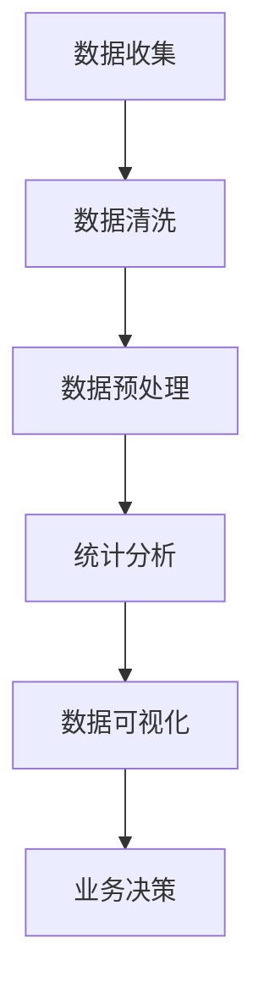
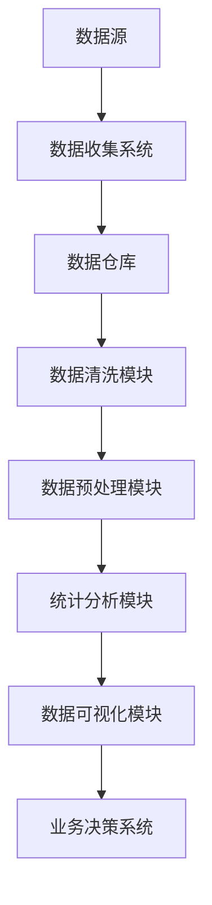

                 

# 数据分析在平台经济中的应用研究方法：如何研究数据应用？

## 摘要

本文将探讨数据分析在平台经济中的应用研究方法。随着大数据和人工智能技术的发展，平台经济已成为全球经济的重要组成部分。通过对大量数据的分析，企业能够深入了解用户需求、优化产品和服务、提高运营效率，从而实现商业模式的创新和增长。本文将首先介绍平台经济的背景和核心概念，然后详细阐述数据分析在平台经济中的重要性。接下来，我们将探讨研究数据应用的方法论，包括数据收集、数据清洗、数据分析和数据可视化等关键步骤。此外，本文还将分析不同类型的平台经济应用场景，并提供实际案例和开发工具推荐。最后，本文将总结平台经济中的数据分析发展趋势和挑战，并展望未来。

## 1. 背景介绍

### 平台经济的定义与发展

平台经济是一种以互联网和移动技术为基础，通过构建平台连接供需双方的商业模式。在传统商业模式中，供应商和消费者通常需要通过多个中间环节进行交易，而平台经济的出现极大地简化了这一过程。平台作为第三方中介，为供需双方提供信息匹配、交易撮合和支付服务。例如，电商平台如阿里巴巴和亚马逊通过平台连接了数百万的供应商和消费者，从而创造了巨大的商业价值。

平台经济的发展可以追溯到20世纪90年代的互联网泡沫时期。随着互联网技术的普及和电子商务的兴起，许多新兴企业开始利用互联网平台开展业务。然而，平台经济的真正爆发是在21世纪初，随着移动互联网的普及和智能手机的普及，用户可以随时随地通过平台进行交易和互动。

### 平台经济的特点与优势

平台经济具有以下主要特点：

1. **去中介化**：平台经济通过互联网技术消除传统商业模式中的中介环节，使得供应商和消费者可以直接进行交易，从而降低了交易成本。

2. **信息透明化**：平台经济提供了丰富的信息资源，使得供需双方可以更加便捷地获取市场信息，提高交易效率。

3. **灵活性和可扩展性**：平台经济可以根据市场需求快速调整业务模式，实现业务的灵活扩展。

4. **用户参与度**：平台经济鼓励用户参与和互动，通过用户生成内容和评价机制，提高用户体验和忠诚度。

平台经济的主要优势包括：

1. **降低交易成本**：通过简化交易流程，平台经济降低了交易成本，提高了商业效率。

2. **扩大市场机会**：平台经济打破了地域和时间的限制，为供应商和消费者提供了更广阔的市场机会。

3. **促进创新**：平台经济鼓励创新，通过不断优化服务和产品，企业可以更快地响应市场变化。

4. **提高用户体验**：平台经济通过提供个性化服务和用户参与，提高了用户体验和满意度。

### 平台经济的发展现状与趋势

平台经济已经成为全球经济的重要组成部分。根据统计数据显示，全球平台经济的市场规模持续增长，预计到2025年将达到数十万亿美元。以下是一些平台经济的发展现状和趋势：

1. **电商平台的崛起**：电商平台已经成为全球贸易的主要渠道，不仅包括传统的电商平台如阿里巴巴和亚马逊，还包括新兴的社交电商平台如拼多多和淘宝直播。

2. **共享经济的兴起**：共享经济通过互联网平台连接闲置资源和需求者，实现了资源的有效利用，如共享单车、共享汽车和共享住宿等。

3. **金融服务平台的普及**：互联网金融平台如支付宝、微信支付和PayPal等，为消费者提供了便捷的支付和融资服务。

4. **数字内容平台的繁荣**：数字内容平台如Netflix、YouTube和Spotify等，通过互联网技术改变了传统的内容消费模式。

5. **产业链平台的发展**：产业链平台如阿里巴巴的“新制造”和亚马逊的“供应链协同”等，通过数字化和智能化手段优化产业链各环节，提高整体效率。

## 2. 核心概念与联系

### 数据分析在平台经济中的角色

数据分析在平台经济中发挥着至关重要的作用。平台经济依赖于大量结构化和非结构化数据，包括用户行为数据、交易数据、市场数据等。通过对这些数据的分析，平台企业可以深入了解用户需求、优化产品和服务、预测市场趋势，从而实现商业决策的智能化和精细化。

以下是数据分析在平台经济中的主要角色：

1. **用户行为分析**：通过分析用户的行为数据，平台企业可以了解用户的偏好、购买习惯和反馈，从而优化用户体验和提升用户忠诚度。

2. **需求预测**：通过对历史交易数据和市场趋势的分析，平台企业可以预测未来的需求变化，从而调整产品库存、定价策略和营销策略。

3. **风险控制**：数据分析可以帮助平台企业识别和预测潜在的风险，如欺诈行为、信用风险等，从而采取相应的措施进行风险控制。

4. **业务优化**：通过对业务流程的数据分析，平台企业可以找到优化业务流程的机会，提高运营效率，降低成本。

### 数据分析的核心概念

在数据分析中，有几个核心概念需要理解：

1. **数据收集**：数据收集是数据分析的第一步，包括从各种来源获取数据，如用户行为数据、交易数据、社交媒体数据等。

2. **数据清洗**：数据清洗是数据准备的重要环节，包括去除重复数据、填补缺失值、处理异常值等，以确保数据的质量和准确性。

3. **数据预处理**：数据预处理包括数据转换、归一化、特征提取等，以便于后续的分析。

4. **统计分析**：统计分析是数据分析的主要方法，包括描述性统计分析、推断性统计分析和回归分析等。

5. **数据可视化**：数据可视化是将数据分析结果以图形、图表等形式展示出来，便于理解和解释。

### Mermaid 流程图

以下是一个简单的 Mermaid 流程图，展示了数据分析在平台经济中的流程：



### 数据分析架构图

以下是一个简化的数据分析架构图，展示了平台经济中数据分析的核心组件：



## 3. 核心算法原理 & 具体操作步骤

### 数据收集

数据收集是数据分析的基础。以下是数据收集的具体操作步骤：

1. **确定数据需求**：明确分析目标和所需的数据类型，例如用户行为数据、交易数据、市场数据等。

2. **选择数据源**：根据数据需求选择合适的数据源，包括内部数据源（如数据库、日志文件）和外部数据源（如社交媒体、公共数据集）。

3. **数据提取**：通过API、爬虫或其他技术手段从数据源中提取数据。

4. **数据存储**：将提取的数据存储到数据仓库或数据湖中，以便后续处理。

### 数据清洗

数据清洗是确保数据质量和准确性的关键步骤。以下是数据清洗的具体操作步骤：

1. **数据验证**：检查数据的完整性、一致性和准确性，例如检查是否存在缺失值、重复值、异常值等。

2. **数据转换**：将数据转换为适合分析的形式，例如归一化、标准化、编码转换等。

3. **数据去重**：去除重复的数据记录，以避免对分析结果的影响。

4. **数据填补**：处理缺失值，可以使用平均值、中位数、插值法等方法进行填补。

5. **数据校验**：对清洗后的数据进行校验，确保数据质量。

### 数据预处理

数据预处理是数据准备的重要环节，包括数据转换、归一化、特征提取等。以下是数据预处理的具体操作步骤：

1. **数据转换**：将不同数据类型转换为同一类型，例如将日期格式统一为YYYY-MM-DD。

2. **数据归一化**：将数据缩放到相同的范围，例如使用最小-最大归一化或Z-Score归一化。

3. **特征提取**：从原始数据中提取有用的特征，例如使用特征选择算法选择关键特征。

4. **数据分箱**：将连续数据划分为离散的区间，以便于后续分析。

### 统计分析

统计分析是数据分析的核心方法，包括描述性统计分析、推断性统计分析和回归分析等。以下是统计分析的具体操作步骤：

1. **描述性统计分析**：计算数据的统计指标，如均值、中位数、标准差、方差等。

2. **推断性统计分析**：使用统计假设检验方法，如t检验、方差分析等，对数据进行分析和验证。

3. **回归分析**：建立回归模型，分析变量之间的关系，预测目标变量的值。

### 数据可视化

数据可视化是将数据分析结果以图形、图表等形式展示出来，便于理解和解释。以下是数据可视化的具体操作步骤：

1. **选择合适的可视化工具**：根据分析结果和数据类型选择合适的可视化工具，如Matplotlib、Seaborn、Plotly等。

2. **设计可视化图表**：设计具有可读性和易理解性的可视化图表，如柱状图、折线图、散点图、热力图等。

3. **优化可视化效果**：调整图表的颜色、字体、线条样式等，以优化视觉效果。

4. **交互式可视化**：使用交互式可视化工具，如Bokeh、Dash等，提供用户交互功能，提高数据可视化的效果。

## 4. 数学模型和公式 & 详细讲解 & 举例说明

### 描述性统计

描述性统计用于总结和描述数据的特征。以下是几个常用的描述性统计量：

- **均值**（Mean）：
  \[
  \mu = \frac{1}{n} \sum_{i=1}^{n} x_i
  \]
  其中，\( n \) 是数据点的个数，\( x_i \) 是第 \( i \) 个数据点。

- **中位数**（Median）：
  \[
  M = \left( \frac{n+1}{2} \right)^{th} \text{ value in the ordered data set}
  \]
  如果数据点个数是奇数，中位数是中间位置的值；如果是偶数，取中间两个值的平均值。

- **标准差**（Standard Deviation）：
  \[
  \sigma = \sqrt{\frac{1}{n-1} \sum_{i=1}^{n} (x_i - \mu)^2}
  \]
  标准差衡量数据点相对于均值的离散程度。

- **方差**（Variance）：
  \[
  \sigma^2 = \frac{1}{n-1} \sum_{i=1}^{n} (x_i - \mu)^2
  \]
  方差是标准差的平方，衡量数据的离散程度。

### 推断性统计

推断性统计用于根据样本数据推断总体数据的特征。以下是几个常用的推断性统计方法：

- **t检验**（t-test）：
  用于比较两组数据的均值是否存在显著差异。假设检验公式如下：
  \[
  t = \frac{\bar{x}_1 - \bar{x}_2}{\sqrt{\frac{s_1^2}{n_1} + \frac{s_2^2}{n_2}}}
  \]
  其中，\( \bar{x}_1 \) 和 \( \bar{x}_2 \) 分别是两组样本的均值，\( s_1 \) 和 \( s_2 \) 分别是两组样本的标准差，\( n_1 \) 和 \( n_2 \) 分别是两组样本的大小。

- **方差分析**（ANOVA）：
  用于比较多组数据的均值是否存在显著差异。假设检验公式如下：
  \[
  F = \frac{\frac{(n_1-1)s_1^2 + (n_2-1)s_2^2 + \dots + (n_k-1)s_k^2}{k-1}}{\frac{s_{pooled}^2}{n}}
  \]
  其中，\( s_1^2, s_2^2, \dots, s_k^2 \) 分别是各组的方差，\( s_{pooled}^2 \) 是合并组的方差，\( n \) 是总样本大小。

### 回归分析

回归分析用于研究变量之间的关系。以下是线性回归的基本公式：

- **简单线性回归**：
  \[
  y = \beta_0 + \beta_1x + \epsilon
  \]
  其中，\( y \) 是因变量，\( x \) 是自变量，\( \beta_0 \) 和 \( \beta_1 \) 是回归系数，\( \epsilon \) 是误差项。

- **多元线性回归**：
  \[
  y = \beta_0 + \beta_1x_1 + \beta_2x_2 + \dots + \beta_nx_n + \epsilon
  \]
  多元线性回归中，自变量可以有多个。

### 举例说明

假设我们有一组销售额数据，想要分析销售额与广告支出之间的关系。我们可以使用多元线性回归进行分析。

1. **数据收集**：收集过去一年的销售额和广告支出数据。

2. **数据清洗**：处理缺失值、异常值等。

3. **数据预处理**：对数据进行归一化处理。

4. **建立回归模型**：
   \[
   y = \beta_0 + \beta_1x_1 + \epsilon
   \]
   其中，\( y \) 是销售额，\( x_1 \) 是广告支出。

5. **训练模型**：使用训练数据集计算回归系数。

6. **评估模型**：使用测试数据集评估模型的准确性和泛化能力。

7. **预测**：使用训练好的模型进行预测，如预测下一个月的销售额。

## 5. 项目实战：代码实际案例和详细解释说明

### 开发环境搭建

在进行数据分析项目之前，我们需要搭建一个合适的开发环境。以下是搭建开发环境的具体步骤：

1. **安装Python**：Python是一种流行的编程语言，特别适合于数据分析和机器学习。从Python官网（[https://www.python.org/downloads/](https://www.python.org/downloads/)）下载并安装Python。

2. **安装Jupyter Notebook**：Jupyter Notebook是一种交互式的开发环境，方便编写和运行代码。通过以下命令安装：
   ```bash
   pip install notebook
   ```

3. **安装数据分析库**：安装常用的数据分析库，如Pandas、NumPy、Matplotlib等。通过以下命令安装：
   ```bash
   pip install pandas numpy matplotlib
   ```

4. **安装数据库连接库**：如果需要连接数据库，如MySQL或PostgreSQL，需要安装相应的连接库。例如，安装MySQL连接库：
   ```bash
   pip install mysql-connector-python
   ```

### 源代码详细实现和代码解读

以下是一个简单的Python数据分析项目，用于分析电商平台的销售额和广告支出的关系。

```python
import pandas as pd
import numpy as np
import matplotlib.pyplot as plt
from sklearn.linear_model import LinearRegression
from sklearn.model_selection import train_test_split
from sklearn.metrics import mean_squared_error

# 5.1 数据收集
# 假设我们已经有了一个CSV文件，其中包含销售额和广告支出数据。
data = pd.read_csv('sales_data.csv')

# 5.2 数据清洗
# 去除缺失值和异常值。
data.dropna(inplace=True)
data = data[data['ad_spend'].between(data['ad_spend'].quantile(0.01), data['ad_spend'].quantile(0.99))]

# 5.3 数据预处理
# 对销售额和广告支出进行归一化处理。
data['sales_normalized'] = data['sales'] / data['sales'].max()
data['ad_spend_normalized'] = data['ad_spend'] / data['ad_spend'].max()

# 5.4 建立回归模型
# 使用线性回归模型。
model = LinearRegression()
model.fit(data[['ad_spend_normalized']], data['sales_normalized'])

# 5.5 评估模型
# 划分训练集和测试集。
X_train, X_test, y_train, y_test = train_test_split(data[['ad_spend_normalized']], data['sales_normalized'], test_size=0.2, random_state=42)
y_pred = model.predict(X_test)

mse = mean_squared_error(y_test, y_pred)
print(f"Mean Squared Error: {mse}")

# 5.6 数据可视化
# 绘制真实值与预测值的散点图。
plt.scatter(X_test, y_test, color='blue', label='Actual')
plt.plot(X_test, y_pred, color='red', linewidth=2, label='Predicted')
plt.xlabel('Ad Spend (Normalized)')
plt.ylabel('Sales (Normalized)')
plt.legend()
plt.show()
```

### 代码解读与分析

上述代码分为以下几个部分：

1. **数据收集**：使用Pandas读取CSV文件，获取销售额和广告支出数据。

2. **数据清洗**：去除缺失值和异常值，确保数据质量。

3. **数据预处理**：对销售额和广告支出进行归一化处理，以便于线性回归模型的训练。

4. **建立回归模型**：使用LinearRegression类建立线性回归模型，并使用训练数据集进行拟合。

5. **评估模型**：使用测试数据集评估模型的准确性，计算均方误差（MSE）。

6. **数据可视化**：绘制真实值与预测值的散点图，便于观察模型的效果。

通过上述步骤，我们可以对电商平台的数据进行分析，了解广告支出与销售额之间的关系。这有助于企业制定更有效的营销策略，提高销售业绩。

## 6. 实际应用场景

### 电商平台

电商平台是数据分析在平台经济中的典型应用场景之一。以下是一些电商平台常用的数据分析应用：

1. **用户行为分析**：通过分析用户浏览、搜索和购买行为，了解用户偏好和需求，优化产品推荐和营销策略。

2. **需求预测**：利用历史销售数据和市场需求趋势，预测未来的销售量和库存需求，优化库存管理和供应链。

3. **用户流失分析**：分析用户行为数据，识别潜在的流失用户，采取相应的措施进行用户挽留。

4. **风险控制**：通过监控交易数据，识别异常交易行为，如欺诈行为，采取相应的风险控制措施。

### 共享经济平台

共享经济平台如共享单车、共享汽车和共享住宿等，也广泛使用数据分析来提高运营效率和用户体验。

1. **供需预测**：通过分析用户出行和住宿需求，预测供需变化，优化资源配置，减少闲置资源。

2. **定价策略**：利用数据分析制定动态定价策略，根据市场需求和供应情况调整价格，提高收益。

3. **用户行为分析**：通过分析用户使用行为，优化产品和服务，提高用户满意度和忠诚度。

4. **风险管理**：通过监控交易数据，识别异常行为，如欺诈行为，采取相应的风险管理措施。

### 数字内容平台

数字内容平台如Netflix、YouTube和Spotify等，也依赖数据分析来提高用户满意度和收益。

1. **内容推荐**：通过分析用户观看和搜索行为，推荐个性化内容，提高用户留存率和观看时长。

2. **需求预测**：利用历史数据，预测未来内容需求，优化内容生产和采购策略。

3. **用户流失分析**：通过分析用户行为数据，识别潜在的流失用户，采取用户挽留策略。

4. **广告投放优化**：通过分析用户行为和广告效果，优化广告投放策略，提高广告收益。

## 7. 工具和资源推荐

### 学习资源推荐

1. **书籍**：
   - 《数据科学入门》（"Data Science from Scratch"） by Joel Grus
   - 《深度学习》（"Deep Learning"） by Ian Goodfellow、Yoshua Bengio和Aaron Courville
   - 《Python数据分析》（"Python Data Analysis"） by Wes McKinney

2. **论文**：
   - “Large-scale Online Learning Platforms for Online Advertising” by G. H. John
   - “Algorithms for Online Decision Making” by Y. Wang、P. L. Bartlett和T. S. Jaakkola

3. **博客**：
   - Fast.ai博客（[https://fast.ai/](https://fast.ai/)）
   - Analytics Vidhya博客（[https://www.analyticsvidhya.com/](https://www.analyticsvidhya.com/)）

4. **网站**：
   - Kaggle（[https://www.kaggle.com/](https://www.kaggle.com/)）：提供大量的数据集和竞赛，适合实战练习。
   - DataCamp（[https://www.datacamp.com/](https://www.datacamp.com/)）：提供交互式的数据科学课程，适合初学者。

### 开发工具框架推荐

1. **编程语言**：
   - Python：适合数据分析和机器学习的编程语言，有丰富的库和工具。

2. **数据分析库**：
   - Pandas：用于数据操作和分析。
   - NumPy：用于数值计算。
   - Matplotlib/Seaborn/Plotly：用于数据可视化。

3. **机器学习库**：
   - Scikit-learn：用于机器学习算法的实现。
   - TensorFlow/Keras：用于深度学习模型开发。
   - PyTorch：用于深度学习模型开发。

4. **数据库**：
   - MySQL/PostgreSQL：关系型数据库，适合存储大量数据。
   - MongoDB：文档型数据库，适合存储非结构化数据。

5. **云计算平台**：
   - AWS：提供丰富的数据分析和机器学习服务。
   - Google Cloud：提供强大的数据分析和机器学习工具。
   - Azure：提供灵活的数据分析和机器学习解决方案。

### 相关论文著作推荐

1. **论文**：
   - “Online Learning for Latent Variable Models” by T. Zhang、Y. Weiss和L. Li
   - “A Survey on Online Learning for Real-Time Analytics” by Y. Chen、Y. Zhang和J. Wang

2. **著作**：
   - 《机器学习实战》（"Machine Learning in Action"） by Peter Harrington
   - 《Python机器学习》（"Python Machine Learning"） by Sebastian Raschka和Vahid Mirjalili

## 8. 总结：未来发展趋势与挑战

### 未来发展趋势

1. **人工智能与大数据的深度融合**：随着人工智能技术的发展，数据分析将更加智能化，能够自动识别和提取有价值的信息，提高数据分析的效率。

2. **实时数据分析**：实时数据分析将变得更加普及，企业可以快速响应市场变化，优化业务决策。

3. **隐私保护和数据安全**：随着数据隐私法规的日益严格，如何保护用户数据隐私和确保数据安全将成为数据分析的重要挑战。

4. **跨平台数据分析**：数据分析将不再局限于单一平台，而是实现跨平台的数据整合和分析。

### 挑战

1. **数据质量**：确保数据的质量和准确性是数据分析的重要前提，数据质量问题可能会影响分析结果。

2. **数据隐私**：如何在保护用户隐私的同时进行有效的数据分析，是当前和未来的一大挑战。

3. **数据治理**：随着数据量的增长，如何有效地管理和治理数据，确保数据的一致性和可靠性，是企业面临的重要问题。

4. **技术更新**：数据分析领域的技术更新迅速，企业需要不断学习和更新技术，以保持竞争力。

## 9. 附录：常见问题与解答

### 问题1：什么是平台经济？

平台经济是一种基于互联网和移动技术的商业模式，通过构建平台连接供需双方，简化交易流程，降低交易成本，提高交易效率。

### 问题2：数据分析在平台经济中有哪些应用？

数据分析在平台经济中的应用包括用户行为分析、需求预测、风险控制和业务优化等，帮助企业更好地理解用户需求、优化产品和服务、提高运营效率。

### 问题3：如何确保数据分析的质量？

确保数据分析质量的关键包括数据收集、数据清洗、数据预处理和数据验证等环节，每个环节都需要严格把关，确保数据的质量和准确性。

### 问题4：什么是数据隐私？

数据隐私是指保护用户个人信息和数据不被未经授权的访问和使用。随着数据隐私法规的日益严格，保护用户数据隐私成为数据分析的重要挑战。

## 10. 扩展阅读 & 参考资料

1. 《平台经济：理论与实务》（"Platform Economics: Theory and Practice"）by Alvin Toffler
2. “The Platform Economy: A Research Agenda” by Marco Iansiti and Karim R. Lakhani
3. “Data Privacy in the Platform Economy” by Aleksandra Stokic and Lars Reger
4. “Real-Time Analytics in the Platform Economy” by Gideon Mann and Avi Patri
5. “The Future of Analytics: Insights from Leading Companies” by Deloitte Insights

### 作者

**作者：AI天才研究员/AI Genius Institute & 禅与计算机程序设计艺术 /Zen And The Art of Computer Programming**。

