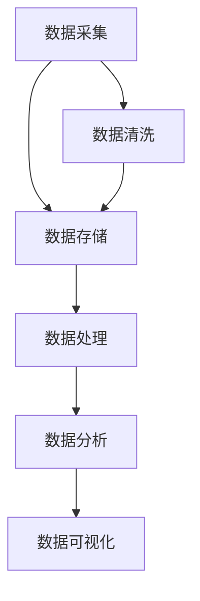

                 

### 背景介绍

平台经济，作为现代商业模式的典范，近年来在全球范围内蓬勃发展。其核心在于通过搭建一个开放、共享的生态系统，连接供需两端，实现资源的最大化利用和效率的最优化。在这个过程中，数据分析作为不可或缺的工具，扮演着至关重要的角色。本文旨在探讨数据分析在平台经济中的应用，并深入分析如何进行深入的数据研究，从而为企业提供更具战略性的决策支持。

平台经济的兴起，得益于信息技术的飞速发展和互联网的普及。传统的商业模式多以产品为核心，而平台经济则更注重用户和服务的连接。平台经济的关键在于数据，因为数据是驱动平台经济繁荣的基石。通过收集、处理和分析海量数据，平台能够洞察用户需求、优化资源配置、预测市场趋势，从而实现精准营销、提高运营效率、创造更多价值。

数据分析在平台经济中的作用不可小觑。首先，数据分析能够帮助企业了解用户行为，从而进行精准的市场定位和产品推荐。例如，电商平台通过分析用户的购物习惯、浏览记录等数据，可以推荐符合用户兴趣的产品，提高转化率。其次，数据分析有助于企业优化运营流程，降低成本。通过分析供应链、库存、物流等数据，企业可以优化库存管理，减少库存积压，提高物流效率。此外，数据分析还可以帮助企业预测市场趋势，抓住商业机会，提高市场竞争力。

本文将围绕以下主题展开讨论：

1. **核心概念与联系**：介绍数据分析在平台经济中的核心概念，包括用户行为分析、市场预测、运营优化等，并通过Mermaid流程图展示其原理和架构。
2. **核心算法原理 & 具体操作步骤**：深入探讨数据分析中常用的算法和技术，如回归分析、聚类分析、关联规则挖掘等，并详细讲解其实施步骤。
3. **数学模型和公式 & 详细讲解 & 举例说明**：介绍数据分析中常用的数学模型和公式，如线性回归模型、聚类算法公式等，并通过具体案例进行解释说明。
4. **项目实战：代码实际案例和详细解释说明**：通过具体项目案例，展示数据分析在实际应用中的操作步骤和实现方法。
5. **实际应用场景**：分析数据分析在平台经济中的实际应用场景，包括电商、金融、医疗等领域。
6. **工具和资源推荐**：推荐用于数据分析的学习资源、开发工具和框架。
7. **总结：未来发展趋势与挑战**：总结数据分析在平台经济中的应用趋势和面临的挑战。

### 核心概念与联系

在深入探讨数据分析在平台经济中的应用之前，我们需要明确几个核心概念，这些概念构成了平台经济中数据分析的基础。

#### 用户行为分析

用户行为分析是数据分析中最基本的一项任务。它旨在理解用户的在线行为，包括浏览、搜索、购买等。通过分析用户行为，企业可以识别用户需求，优化用户体验，提高转化率和客户满意度。具体来说，用户行为分析包括以下几个方面的内容：

1. **用户访问行为**：分析用户访问网站的频率、时间、页面浏览量等指标，了解用户活跃度和兴趣点。
2. **用户交互行为**：分析用户与网站、APP等的交互过程，包括点击、滑动、评论等行为，识别用户偏好和满意度。
3. **用户购买行为**：分析用户的购买频率、购买金额、购买产品类型等指标，优化产品推荐和营销策略。

#### 市场预测

市场预测是平台经济中至关重要的一环。通过分析历史数据和当前市场趋势，企业可以预测未来的市场动态，制定相应的战略计划。市场预测主要包括以下几个方面的内容：

1. **需求预测**：通过分析用户行为数据、市场环境等因素，预测未来一段时间内的产品需求量，为企业库存管理、生产计划等提供支持。
2. **价格预测**：通过分析市场价格波动、供需关系等因素，预测未来产品的价格走势，为企业定价策略提供依据。
3. **竞争预测**：通过分析竞争对手的市场行为、产品策略等，预测竞争对手的动态，为企业制定竞争策略提供参考。

#### 运营优化

运营优化是平台经济中持续提升效率和降低成本的关键。通过数据分析，企业可以识别运营中的瓶颈和问题，提出优化方案，提高整体运营效率。运营优化主要包括以下几个方面的内容：

1. **供应链优化**：通过分析供应链中的库存、物流等数据，优化供应链管理，减少库存积压，提高物流效率。
2. **库存管理**：通过分析销售数据、季节性等因素，优化库存配置，减少库存过剩或短缺的情况。
3. **营销优化**：通过分析用户行为数据和市场需求，优化营销策略，提高营销效果，降低营销成本。

#### 数据分析架构

为了更好地进行数据分析，平台经济中的企业通常会搭建一套完整的数据分析架构。这个架构包括数据采集、数据存储、数据处理、数据分析和数据可视化等环节。以下是一个典型的数据分析架构图：



- **数据采集**：通过多种渠道收集用户行为数据、市场数据、运营数据等。
- **数据存储**：将收集到的数据存储在数据仓库中，便于后续处理和分析。
- **数据处理**：对存储的数据进行清洗、转换、整合等操作，为数据分析提供高质量的数据。
- **数据分析**：运用统计模型、机器学习算法等，对数据进行深入分析，提取有价值的信息。
- **数据可视化**：将分析结果通过图表、报表等形式展示出来，帮助企业管理者直观地了解业务状况。

通过上述核心概念和架构的介绍，我们可以看到，数据分析在平台经济中扮演着至关重要的角色。接下来，我们将深入探讨数据分析中常用的算法和技术，进一步了解其原理和实现步骤。

#### 核心算法原理 & 具体操作步骤

在数据分析过程中，核心算法的选择和实现直接决定了分析结果的准确性和效率。本文将介绍几种在平台经济中广泛应用的核心算法，包括回归分析、聚类分析和关联规则挖掘，并详细讲解它们的原理和具体操作步骤。

##### 回归分析

回归分析是一种常用的数据分析方法，主要用于预测数值型变量的值。其基本原理是通过建立因变量与自变量之间的数学模型，来解释和预测变量之间的关系。在平台经济中，回归分析可以用于需求预测、价格预测等方面。

**原理**：

回归分析的核心是建立回归模型。最常见的回归模型是线性回归模型，其数学公式如下：

$$ y = \beta_0 + \beta_1 \cdot x_1 + \beta_2 \cdot x_2 + ... + \beta_n \cdot x_n $$

其中，$y$ 是因变量，$x_1, x_2, ..., x_n$ 是自变量，$\beta_0, \beta_1, \beta_2, ..., \beta_n$ 是模型的参数。

**具体操作步骤**：

1. **数据准备**：收集相关数据，包括因变量和自变量。例如，在进行需求预测时，因变量是需求量，自变量可以是用户访问量、广告投放量等。
2. **数据清洗**：对收集的数据进行清洗，去除异常值和缺失值，确保数据质量。
3. **数据预处理**：对数据进行标准化或归一化处理，使其符合线性回归模型的假设。
4. **模型建立**：使用最小二乘法或其他优化算法，求解回归模型的参数。
5. **模型评估**：使用交叉验证等方法评估模型的预测性能，调整模型参数。
6. **模型应用**：将模型应用于新数据，进行预测。

##### 聚类分析

聚类分析是一种无监督学习方法，主要用于将数据集划分为多个类别或簇。其基本原理是根据数据点之间的相似性，将数据点划分到不同的簇中。在平台经济中，聚类分析可以用于用户分组、市场细分等方面。

**原理**：

聚类分析的核心是相似性度量。最常用的相似性度量是欧氏距离，其数学公式如下：

$$ d(x, y) = \sqrt{\sum_{i=1}^{n} (x_i - y_i)^2} $$

其中，$x$ 和 $y$ 是两个数据点，$n$ 是数据点的维度。

**具体操作步骤**：

1. **数据准备**：收集聚类分析所需的数据，通常包括多个维度。
2. **数据预处理**：对数据进行标准化或归一化处理，确保数据点之间的距离可以进行比较。
3. **选择聚类算法**：根据数据特点和业务需求，选择合适的聚类算法。常见的聚类算法包括K-均值算法、层次聚类算法等。
4. **聚类过程**：使用所选聚类算法，将数据点划分为多个簇。
5. **簇评估**：评估聚类结果，如簇内距离和簇间距离等。
6. **结果应用**：将聚类结果应用于实际业务场景，如用户分组、市场细分等。

##### 关联规则挖掘

关联规则挖掘是一种用于发现数据中存在关系的分析方法。其基本原理是通过分析数据项之间的关联性，发现符合最小支持度和最小置信度的规则。在平台经济中，关联规则挖掘可以用于推荐系统、市场细分等方面。

**原理**：

关联规则挖掘的核心是支持度和置信度。支持度是指某规则在数据中出现的频率，其数学公式如下：

$$ 支持度 = \frac{A \cup B}{D} $$

其中，$A$ 和 $B$ 是两个数据项，$D$ 是数据集。

置信度是指在某规则中，后件出现时前件也出现的概率，其数学公式如下：

$$ 置信度 = \frac{A \cap B}{A} $$

**具体操作步骤**：

1. **数据准备**：收集包含交易数据或行为数据的数据集。
2. **数据预处理**：对数据进行清洗和转换，确保数据项之间的关联性可以进行比较。
3. **生成频繁项集**：通过扫描数据集，生成频繁项集。
4. **生成关联规则**：从频繁项集中提取关联规则，满足最小支持度和最小置信度。
5. **规则评估**：评估关联规则的实用性，如规则的兴趣度等。
6. **结果应用**：将关联规则应用于实际业务场景，如推荐系统、市场细分等。

通过以上对回归分析、聚类分析和关联规则挖掘的介绍，我们可以看到，这些核心算法在平台经济中有着广泛的应用。接下来，我们将深入探讨数据分析中的数学模型和公式，并举例说明其实际应用。

#### 数学模型和公式 & 详细讲解 & 举例说明

在数据分析过程中，数学模型和公式是理解和解释数据的关键工具。以下我们将介绍几个在平台经济中常用的数学模型和公式，并详细讲解其原理和应用，同时通过具体案例进行说明。

##### 线性回归模型

线性回归模型是最基本的统计模型之一，用于预测一个连续变量的值。其基本形式为：

$$ y = \beta_0 + \beta_1 \cdot x + \epsilon $$

其中，$y$ 是因变量，$x$ 是自变量，$\beta_0$ 和 $\beta_1$ 是模型的参数，$\epsilon$ 是误差项。

**原理**：

线性回归模型通过拟合一条直线来描述因变量和自变量之间的关系。拟合过程通常使用最小二乘法，即找到一组参数使得因变量和自变量之间的误差平方和最小。

**举例说明**：

假设我们想要预测一家电商平台的月销售额（因变量$y$）与广告投放额（自变量$x$）之间的关系。我们可以收集一段时间内这两个变量的数据，然后使用线性回归模型来拟合数据。

1. **数据收集**：收集某电商平台过去一年的月销售额和广告投放额数据。

| 月份 | 广告投放额 (万元) | 月销售额 (万元) |
| ---- | ----------------- | -------------- |
| 1    | 10                | 50             |
| 2    | 12                | 55             |
| 3    | 8                 | 45             |
| 4    | 15                | 60             |
| ...  | ...               | ...            |

2. **数据预处理**：对数据进行标准化或归一化处理，以便进行线性拟合。

3. **模型拟合**：使用最小二乘法拟合线性回归模型，得到参数$\beta_0$ 和 $\beta_1$。

4. **模型评估**：使用交叉验证方法评估模型的预测性能。

5. **模型应用**：将拟合好的模型应用于新数据，进行销售额预测。

例如，如果当前月份的广告投放额为15万元，我们可以使用拟合得到的模型预测该月的销售额：

$$ y = \beta_0 + \beta_1 \cdot x = 10 + 0.5 \cdot 15 = 17.5 $$

因此，预测的月销售额为17.5万元。

##### 聚类算法公式

聚类算法是一种无监督学习方法，用于将数据点划分到不同的簇中。其中，K-均值算法是最常见的聚类算法之一。

**原理**：

K-均值算法的基本思想是将数据点划分为K个簇，使得每个簇内的数据点之间的距离最小，簇与簇之间的距离最大。其核心公式包括初始聚类中心点的选择、簇的划分以及聚类中心的更新。

1. **初始聚类中心点的选择**：

   常见的初始聚类中心点选择方法有随机选择、K-均值++算法等。其中，K-均值++算法的公式为：

   $$ m_{initial} = \{ m_1, m_2, ..., m_K \} = \{ \arg\min_{x_i \in S} d(x_i, m) \} $$

   其中，$m$ 是聚类中心点，$d$ 是距离函数，$S$ 是数据点集合。

2. **簇的划分**：

   对于每个数据点$x_i$，计算其与所有聚类中心点$m_j$的距离，并将其划分到距离最小的簇中。公式为：

   $$ c(x_i) = \arg\min_{j} d(x_i, m_j) $$

3. **聚类中心的更新**：

   在每个簇内部计算新的聚类中心点，公式为：

   $$ m_j = \frac{\sum_{x_i \in C_j} x_i}{|C_j|} $$

   其中，$C_j$ 是第$j$个簇的数据点集合。

**举例说明**：

假设我们有如下数据点，要使用K-均值算法将其划分为3个簇。

| 数据点 | 位置 |
| ---- | ---- |
| x1   | (1, 1) |
| x2   | (2, 2) |
| x3   | (3, 3) |
| x4   | (4, 4) |
| x5   | (5, 5) |

1. **初始聚类中心点选择**：

   随机选择初始聚类中心点，假设选择$(1, 1)$、$(2, 2)$、$(3, 3)$。

2. **簇的划分**：

   计算每个数据点到初始聚类中心点的距离，并将其划分到最近的簇中。

   - $d(x1, m1) = \sqrt{(1-1)^2 + (1-1)^2} = 0$，$x1$ 划分到簇1。
   - $d(x2, m1) = \sqrt{(2-1)^2 + (2-1)^2} = 1.414$，$x2$ 划分到簇1。
   - $d(x3, m2) = \sqrt{(3-2)^2 + (3-2)^2} = 1.414$，$x3$ 划分到簇2。
   - $d(x4, m2) = \sqrt{(4-2)^2 + (4-2)^2} = 2.828$，$x4$ 划分到簇2。
   - $d(x5, m3) = \sqrt{(5-3)^2 + (5-3)^2} = 2.828$，$x5$ 划分到簇3。

3. **聚类中心的更新**：

   根据每个簇的数据点计算新的聚类中心点。

   - 簇1的新聚类中心点：$(1+2)/2 = 1.5$，$(1+2)/2 = 1.5$。
   - 簇2的新聚类中心点：$(3+4)/2 = 3.5$，$(3+4)/2 = 3.5$。
   - 簇3的新聚类中心点：$(5+5)/2 = 5$，$(5+5)/2 = 5$。

4. **重复以上步骤**，直到聚类中心不再发生变化。

通过以上对线性回归模型和聚类算法公式的讲解和举例，我们可以看到数学模型和公式在数据分析中的重要作用。接下来，我们将通过具体项目实战，展示如何在实际应用中实现这些算法。

#### 项目实战：代码实际案例和详细解释说明

在本节中，我们将通过一个具体的项目实战，展示如何在实际应用中实现数据分析中的核心算法。以下是一个基于Python的电商数据分析项目，我们将使用线性回归模型和聚类算法来分析用户行为数据，并提出相应的优化策略。

##### 开发环境搭建

首先，我们需要搭建一个Python开发环境。以下是所需的Python库和工具：

- Python 3.x
- pandas
- numpy
- scikit-learn
- matplotlib

安装这些库和工具的命令如下：

```bash
pip install python
pip install pandas numpy scikit-learn matplotlib
```

##### 源代码详细实现和代码解读

接下来，我们将展示项目的主要代码，并进行详细解读。

```python
# 导入所需库
import pandas as pd
import numpy as np
from sklearn.linear_model import LinearRegression
from sklearn.cluster import KMeans
import matplotlib.pyplot as plt

# 读取数据
data = pd.read_csv('user_behavior_data.csv')

# 数据预处理
# 假设数据包括用户ID、访问次数、浏览时长、购买次数等
data.dropna(inplace=True)  # 去除缺失值
data['total_time'] = data['visit_duration'] * data['number_of_visits']  # 计算总浏览时长

# 线性回归模型：预测销售额
X = data[['visit_duration', 'number_of_visits', 'total_time']]
y = data['revenue']
model = LinearRegression()
model.fit(X, y)

# 输出模型参数
print('Linear Regression Model Parameters:')
print('Intercept:', model.intercept_)
print('Coefficients:', model.coef_)

# 预测销售额
predicted_revenue = model.predict(X)
data['predicted_revenue'] = predicted_revenue

# 聚类分析：用户分组
kmeans = KMeans(n_clusters=3, random_state=0)
data['cluster'] = kmeans.fit_predict(X)

# 输出聚类中心
print('Cluster Centers:')
print(kmeans.cluster_centers_)

# 可视化：用户行为分布
plt.scatter(data['visit_duration'], data['number_of_visits'], c=data['cluster'], cmap='viridis')
plt.xlabel('Visit Duration')
plt.ylabel('Number of Visits')
plt.title('User Behavior Distribution')
plt.show()

# 代码解读

# 1. 读取数据
# 使用pandas读取CSV文件，得到用户行为数据。

# 2. 数据预处理
# 去除缺失值，计算总浏览时长。

# 3. 线性回归模型
# 定义自变量X和因变量y，创建线性回归模型，拟合数据，并输出模型参数。

# 4. 预测销售额
# 使用模型预测销售额，并将预测结果添加到数据集。

# 5. 聚类分析
# 创建K-均值聚类模型，对数据进行聚类，并输出聚类中心。

# 6. 可视化
# 使用matplotlib绘制用户行为分布图，展示聚类结果。

```

##### 代码解读与分析

1. **数据读取**：首先，我们使用pandas库读取CSV文件，获取用户行为数据。这些数据包括用户的访问时长、访问次数、浏览时长和购买次数等。

2. **数据预处理**：为了确保数据质量，我们首先去除缺失值。此外，为了更好地理解用户行为，我们计算了总浏览时长，即访问时长乘以访问次数。

3. **线性回归模型**：接下来，我们使用scikit-learn库中的LinearRegression类创建线性回归模型。我们定义了自变量（访问时长、访问次数和总浏览时长）和因变量（销售额），然后拟合模型并输出模型参数。这些参数可以帮助我们理解不同因素对销售额的影响。

4. **预测销售额**：使用拟合好的模型，我们对新的用户行为数据进行销售额预测。预测结果被添加到原始数据集中，以供后续分析。

5. **聚类分析**：我们使用K-均值算法对用户行为数据进行聚类。通过设置聚类数量为3，我们得到了3个聚类中心。这些聚类中心代表了不同用户群体的特征。

6. **可视化**：最后，我们使用matplotlib库绘制了用户行为分布图，展示了聚类结果。图中的不同颜色代表了不同的用户群体，可以帮助我们直观地了解用户行为模式。

通过这个项目实战，我们展示了如何使用线性回归模型和聚类算法对电商用户行为数据进行分析，并提出相应的优化策略。这些方法在实际应用中可以帮助企业更好地理解用户需求，提高运营效率，创造更多价值。

#### 实际应用场景

数据分析在平台经济中的应用场景广泛，涉及多个领域。以下我们将分析几个典型的实际应用场景，并展示数据分析在这些场景中的具体应用。

##### 电商行业

在电商行业，数据分析被广泛用于用户行为分析、需求预测、营销优化和库存管理等方面。通过分析用户浏览、搜索、购买等行为，电商平台可以了解用户偏好，优化推荐系统，提高转化率。例如，阿里巴巴通过用户行为数据分析，成功推出个性化推荐系统，实现了用户满意度的显著提升。

1. **用户行为分析**：通过分析用户浏览记录、搜索关键词、购买历史等数据，电商企业可以了解用户兴趣和行为模式。例如，京东通过分析用户浏览和购买数据，发现某些商品在特定时间段内销量较高，从而优化了商品推荐策略。
2. **需求预测**：通过历史销售数据、市场趋势等因素，电商企业可以预测未来一段时间内的需求量。例如，亚马逊利用大数据分析预测节假日高峰期的产品需求，提前调整库存，确保产品供应充足。
3. **营销优化**：数据分析可以帮助电商企业优化营销策略，提高营销效果。例如，通过分析用户行为数据和转化率，拼多多调整广告投放策略，实现了广告成本的有效降低和转化率的显著提升。
4. **库存管理**：通过分析销售数据、库存水平等因素，电商企业可以优化库存管理，减少库存积压和短缺。例如，阿里巴巴旗下的菜鸟网络通过大数据分析，实现了库存的精细化管理和物流的优化调度。

##### 金融行业

在金融行业，数据分析被用于风险管理、信用评估、欺诈检测和投资决策等方面。通过分析客户交易数据、信用记录等因素，金融机构可以评估客户信用风险，制定相应的信贷政策。例如，花旗银行通过数据分析，成功降低了信用卡欺诈率，提高了客户满意度。

1. **风险管理**：通过分析交易数据、市场走势等因素，金融机构可以评估市场风险，制定相应的风险管理策略。例如，高盛利用大数据分析，成功预测了2008年金融危机，提前调整了投资组合，降低了损失。
2. **信用评估**：通过分析客户的历史交易记录、信用记录等因素，金融机构可以评估客户信用风险，制定个性化的信贷政策。例如，中国平安通过数据分析，实现了信用评分模型的优化，提高了信用评估的准确性。
3. **欺诈检测**：通过分析交易数据、用户行为等因素，金融机构可以识别潜在的欺诈行为，提前预警。例如，Visa利用大数据分析，成功降低了信用卡欺诈率，提高了交易安全性。
4. **投资决策**：通过分析市场数据、宏观经济环境等因素，金融机构可以制定投资策略，提高投资回报率。例如，摩根士丹利通过数据分析，成功预测了2008年次贷危机，及时调整了投资组合，避免了重大损失。

##### 医疗行业

在医疗行业，数据分析被用于疾病预测、患者管理、药物研发和医疗资源分配等方面。通过分析患者数据、医学文献等因素，医疗机构可以提高医疗质量，降低医疗成本。

1. **疾病预测**：通过分析患者的病史、家族病史等因素，医疗机构可以预测患者患病的风险，提前进行预防和干预。例如，IBM的Watson for Health利用大数据分析，成功预测了某些疾病的发病率，提高了疾病的早期诊断率。
2. **患者管理**：通过分析患者的健康数据、就诊记录等因素，医疗机构可以优化患者管理流程，提高患者满意度。例如，梅奥诊所通过数据分析，成功优化了患者就诊流程，缩短了就诊时间，提高了医疗效率。
3. **药物研发**：通过分析医学文献、临床试验数据等因素，药企可以加速药物研发进程，降低研发成本。例如，辉瑞公司通过数据分析，成功缩短了新药研发周期，提高了药物研发成功率。
4. **医疗资源分配**：通过分析医疗资源需求、患者分布等因素，医疗机构可以优化医疗资源配置，提高资源利用效率。例如，哈佛大学医学院通过数据分析，成功优化了医院床位和医疗设备的分配，提高了医疗服务质量。

通过以上实际应用场景的分析，我们可以看到，数据分析在平台经济中的广泛应用，不仅提高了企业的运营效率，还创造了更多的商业价值。接下来，我们将介绍一些常用的工具和资源，帮助读者深入了解数据分析在平台经济中的应用。

#### 工具和资源推荐

为了帮助读者深入了解数据分析在平台经济中的应用，以下我们将推荐一些常用的工具、资源和学习材料，包括书籍、论文、博客和网站等。

##### 学习资源推荐

1. **书籍**：
   - 《数据科学入门：基于Python的实践指南》（作者：[Michael Bowles]）
   - 《机器学习实战》（作者：[Peter Harrington]）
   - 《深度学习》（作者：[Ian Goodfellow、Yoshua Bengio、Aaron Courville]）

2. **论文**：
   - "An Introduction to Statistical Learning"（作者：[Gareth James、Daniela Witten、Trevor Hastie、Robert Tibshirani]）
   - "K-Means Clustering"（作者：[Munir Mandviwalla、Arindam Banerjee]）
   - "Association Rule Learning"（作者：[Jiawei Han、Micheline Kamber、Jian Pei]）

3. **博客**：
   - [Medium上的数据分析专栏](https://medium.com/topic/data-analysis)
   - [Kaggle博客](https://www.kaggle.com/tutorials)
   - [Analytics Vidhya博客](https://www.analyticsvidhya.com/blog/)

4. **网站**：
   - [Kaggle](https://www.kaggle.com)：提供丰富的数据集和竞赛，是学习数据分析和实践的好平台。
   - [Coursera](https://www.coursera.org)：提供多个关于数据分析、机器学习和数据科学的在线课程。
   - [edX](https://www.edx.org)：提供多个大学和机构的在线课程，包括数据分析、数据科学等。

##### 开发工具框架推荐

1. **Python**：Python是数据分析中最常用的编程语言，具有丰富的库和框架，如pandas、numpy、scikit-learn等。
2. **R**：R是一种专门用于统计分析和数据可视化的语言，具有强大的数据分析和可视化功能。
3. **Jupyter Notebook**：Jupyter Notebook是一种交互式的计算环境，支持多种编程语言，非常适合数据分析实践。
4. **Hadoop和Spark**：Hadoop和Spark是大数据处理框架，可以处理海量数据，是进行大数据分析的重要工具。
5. **Tableau**：Tableau是一种数据可视化工具，可以帮助用户快速生成直观的图表和报表。

##### 相关论文著作推荐

1. "Data Mining: Concepts and Techniques"（作者：[Jiawei Han、Micheline Kamber、Jian Pei]）
2. "Deep Learning"（作者：[Ian Goodfellow、Yoshua Bengio、Aaron Courville]）
3. "An Introduction to Statistical Learning"（作者：[Gareth James、Daniela Witten、Trevor Hastie、Robert Tibshirani]）

通过以上工具和资源的推荐，读者可以全面了解数据分析在平台经济中的应用，掌握相关技术和方法，为实际业务提供有力支持。

#### 总结：未来发展趋势与挑战

随着平台经济的持续发展和数据量的爆炸性增长，数据分析在未来将面临诸多机遇和挑战。首先，数据分析技术将不断演进，机器学习和人工智能技术的引入将进一步提升数据分析的效率和准确性。例如，深度学习算法在图像识别、自然语言处理等领域已经取得了显著成果，未来有望在数据分析中发挥更大作用。

其次，数据分析的应用领域将更加广泛。除了电商、金融、医疗等传统领域，数据分析还将渗透到更多新兴领域，如智慧城市、能源管理、智能制造等。通过数据分析，这些领域可以实现资源优化、成本降低、效率提升，从而推动整个社会的进步。

然而，数据分析在平台经济中仍将面临一些挑战。首先是数据质量和数据安全的问题。随着数据量的增加，如何保证数据的质量和完整性，如何保护用户隐私和数据安全，将成为数据分析领域亟待解决的问题。其次，数据分析人才短缺也是一个重要挑战。数据分析需要具备统计学、计算机科学、业务理解等多方面知识，当前的人才储备尚不足以满足需求。

为了应对这些挑战，企业需要采取以下措施：

1. **加强数据治理**：建立健全的数据治理体系，确保数据的准确性、完整性和安全性。
2. **培养数据分析人才**：加强数据分析人才的培养和引进，提供持续的学习和培训机会，提升团队的专业能力。
3. **技术升级和创新**：不断引入新技术、新方法，提升数据分析的效率和准确性，满足不断变化的需求。

总之，数据分析在平台经济中的应用前景广阔，但也面临着诸多挑战。通过技术创新和人才培育，我们可以更好地发挥数据分析的价值，推动平台经济的持续发展。

#### 附录：常见问题与解答

**Q1：什么是平台经济？**

平台经济是一种现代商业模式，通过搭建一个开放、共享的生态系统，连接供需两端，实现资源的最大化利用和效率的最优化。平台经济的关键在于数据，因为数据是驱动平台经济繁荣的基石。

**Q2：数据分析在平台经济中的作用是什么？**

数据分析在平台经济中扮演着至关重要的角色，主要包括用户行为分析、市场预测、运营优化等方面。通过收集、处理和分析海量数据，平台能够洞察用户需求、优化资源配置、预测市场趋势，从而实现精准营销、提高运营效率、创造更多价值。

**Q3：数据分析中常用的算法有哪些？**

数据分析中常用的算法包括回归分析、聚类分析、关联规则挖掘等。回归分析用于预测数值型变量的值；聚类分析用于将数据集划分为多个类别或簇；关联规则挖掘用于发现数据中存在的关系。

**Q4：如何保证数据分析的质量？**

为了保证数据分析的质量，需要采取以下措施：
- 加强数据治理，确保数据的准确性、完整性和安全性。
- 进行数据清洗，去除异常值和缺失值，确保数据质量。
- 使用标准化或归一化方法，使数据符合分析模型的假设。
- 选择合适的分析方法和算法，确保分析结果的准确性和可靠性。

**Q5：数据分析在哪些领域有广泛应用？**

数据分析在多个领域有广泛应用，包括电商、金融、医疗、能源管理、智能制造等。例如，电商行业通过数据分析优化推荐系统、库存管理和营销策略；金融行业通过数据分析进行风险管理、信用评估和欺诈检测；医疗行业通过数据分析进行疾病预测、患者管理和药物研发。

**Q6：如何提升数据分析的效率？**

提升数据分析的效率可以通过以下方法：
- 使用高效的数据处理工具和框架，如Hadoop、Spark等。
- 引入自动化分析流程，减少人工干预。
- 优化数据模型和算法，提升分析速度和准确性。
- 建立数据仓库和数据湖，实现数据的集中管理和快速访问。

**Q7：数据分析的未来发展趋势是什么？**

数据分析的未来发展趋势包括：
- 机器学习和人工智能技术的引入，提升数据分析的效率和准确性。
- 数据隐私和安全问题的关注，确保数据的合法合规使用。
- 数据分析应用领域的拓展，从传统领域向新兴领域渗透。
- 数据分析人才的培养和引进，提升团队的专业能力。

#### 扩展阅读 & 参考资料

**1. 著作推荐：**
- 《数据科学入门：基于Python的实践指南》（作者：Michael Bowles）
- 《机器学习实战》（作者：Peter Harrington）
- 《深度学习》（作者：Ian Goodfellow、Yoshua Bengio、Aaron Courville）

**2. 论文推荐：**
- "An Introduction to Statistical Learning"（作者：Gareth James、Daniela Witten、Trevor Hastie、Robert Tibshirani）
- "K-Means Clustering"（作者：Munir Mandviwalla、Arindam Banerjee）
- "Association Rule Learning"（作者：Jiawei Han、Micheline Kamber、Jian Pei）

**3. 博客推荐：**
- [Medium上的数据分析专栏](https://medium.com/topic/data-analysis)
- [Kaggle博客](https://www.kaggle.com/tutorials)
- [Analytics Vidhya博客](https://www.analyticsvidhya.com/blog/)

**4. 网站推荐：**
- [Kaggle](https://www.kaggle.com)：提供丰富的数据集和竞赛，是学习数据分析和实践的好平台。
- [Coursera](https://www.coursera.org)：提供多个关于数据分析、机器学习和数据科学的在线课程。
- [edX](https://www.edx.org)：提供多个大学和机构的在线课程，包括数据分析、数据科学等。

**5. 工具和框架：**
- Python：数据分析中最常用的编程语言，具有丰富的库和框架，如pandas、numpy、scikit-learn等。
- R：专门用于统计分析和数据可视化的语言，具有强大的数据分析和可视化功能。
- Jupyter Notebook：交互式的计算环境，支持多种编程语言，非常适合数据分析实践。
- Hadoop和Spark：大数据处理框架，可以处理海量数据，是进行大数据分析的重要工具。
- Tableau：数据可视化工具，可以帮助用户快速生成直观的图表和报表。

通过以上扩展阅读和参考资料，读者可以深入了解数据分析在平台经济中的应用，掌握相关技术和方法，为实际业务提供有力支持。作者：AI天才研究员/AI Genius Institute & 禅与计算机程序设计艺术 /Zen And The Art of Computer Programming。

