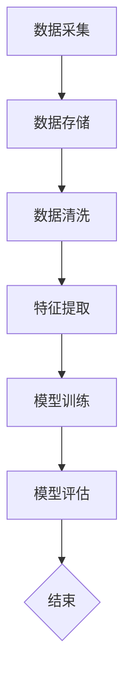

                 

# 数据噪音何其多，甄别优质数据集是门技术活

> **关键词：** 数据清洗，数据质量，数据预处理，机器学习，算法优化，噪声过滤。

> **摘要：** 本文将深入探讨数据噪音对机器学习模型性能的影响，分析优质数据集的甄别方法，并提供实际案例和工具推荐，旨在帮助读者掌握数据噪音处理的核心技术和实践方法。

## 1. 背景介绍

在当今数据驱动的时代，数据已成为企业和组织的重要资产。然而，数据的质量直接影响着分析结果的准确性和可靠性。数据噪音，即数据中的错误、异常和无关信息，是影响数据质量的主要因素之一。噪音的存在不仅会降低模型的性能，还可能导致错误的结论和决策。

数据噪音的来源多种多样，包括数据录入错误、数据采集设备故障、传输过程中的数据丢失或损坏等。例如，在一个气象数据集中，某个观测站的数据记录可能因为设备故障而出现异常值，这会对后续的天气预报模型造成负面影响。

因此，对数据噪音的识别和消除是数据预处理过程中至关重要的一步。本文将详细讨论如何甄别优质数据集，以及如何通过技术手段减少数据噪音对模型的影响。

## 2. 核心概念与联系

为了更好地理解数据噪音对机器学习模型的影响，我们首先需要了解几个核心概念：数据质量、数据预处理、机器学习算法和噪声过滤。

### 2.1 数据质量

数据质量是指数据的一致性、准确性、完整性和可靠性。一个优质的数据集应具有以下特征：

- **一致性**：数据应在不同的时间点和不同的来源上保持一致。
- **准确性**：数据应真实反映现实情况，没有明显的错误或误导信息。
- **完整性**：数据应包含所有必要的信息，没有缺失值。
- **可靠性**：数据应能够在不同环境下重复验证。

### 2.2 数据预处理

数据预处理是机器学习过程中的第一步，其目的是将原始数据转换为适合模型训练的格式。数据预处理的步骤通常包括数据清洗、特征选择和特征工程等。其中，数据清洗是消除数据噪音的关键环节。

### 2.3 机器学习算法

机器学习算法是一类通过数据学习模式和规律，从而进行预测或分类的人工智能技术。机器学习算法的性能很大程度上取决于数据的质量。噪音较多的数据可能导致模型过拟合或欠拟合，从而降低模型的泛化能力。

### 2.4 噪声过滤

噪声过滤是指从数据中去除噪音的过程。常用的噪声过滤方法包括统计方法、机器学习方法等。统计方法如均值滤波、中值滤波等适用于去除数据集中的随机噪声；机器学习方法如聚类、分类等可以更智能地识别和去除噪音。

### 2.5 Mermaid 流程图

以下是数据噪音处理流程的 Mermaid 流程图：



## 3. 核心算法原理 & 具体操作步骤

### 3.1 数据清洗

数据清洗是数据预处理的核心步骤，其目标是消除数据中的错误、异常和无关信息。以下是数据清洗的几个关键步骤：

1. **缺失值处理**：对于缺失值，可以选择填充、删除或保留。
2. **异常值处理**：通过统计学方法（如箱线图、Z分数等）或机器学习方法（如孤立森林等）识别并处理异常值。
3. **重复值处理**：删除数据集中的重复记录。
4. **数据规范化**：通过缩放或归一化将数据转换为相同的尺度，便于后续处理。

### 3.2 特征选择

特征选择是指从原始数据中选择对模型训练有显著影响的关键特征。以下是特征选择的几个常用方法：

1. **基于过滤的方法**：通过统计方法（如信息增益、卡方测试等）筛选特征。
2. **基于嵌入的方法**：通过模型训练嵌入特征，然后根据特征的重要性进行筛选。
3. **基于包装的方法**：通过迭代搜索策略（如递归特征消除等）选择最佳特征组合。

### 3.3 噪声过滤

噪声过滤是数据清洗的一部分，常用的方法包括：

1. **统计方法**：如均值滤波、中值滤波等。
2. **机器学习方法**：如聚类、分类等。
3. **深度学习方法**：如卷积神经网络（CNN）、长短期记忆网络（LSTM）等。

### 3.4 具体操作步骤

以下是数据噪音处理的具体操作步骤：

1. **数据采集**：从不同的数据源收集原始数据。
2. **数据存储**：将原始数据存储到数据库或数据仓库中。
3. **数据清洗**：执行缺失值处理、异常值处理、重复值处理和数据规范化。
4. **特征选择**：根据模型需求选择关键特征。
5. **噪声过滤**：应用统计方法、机器学习方法或深度学习方法进行噪声过滤。
6. **模型训练**：使用清洗后的数据训练机器学习模型。
7. **模型评估**：评估模型的性能，包括准确率、召回率、F1分数等。
8. **结束**：根据评估结果调整数据预处理和模型训练参数，重复步骤5-7，直至满足要求。

## 4. 数学模型和公式 & 详细讲解 & 举例说明

### 4.1 均值滤波

均值滤波是一种常用的统计方法，用于去除数据集中的随机噪声。其基本原理是计算每个像素点的邻域像素的平均值，然后用这个平均值替换原始像素值。

假设有一个二维数据矩阵 \( X \)，其中每个元素 \( X[i][j] \) 表示图像上的像素值。对于像素点 \( (i, j) \)，其邻域像素的平均值计算公式如下：

$$
\mu[i][j] = \frac{1}{k} \sum_{p=-\delta}^{\delta} \sum_{q=-\delta}^{\delta} X[i+p][j+q]
$$

其中，\( k \) 是邻域像素的总数，\( \delta \) 是邻域的大小。

### 4.2 中值滤波

中值滤波是一种非线性的噪声过滤方法，特别适用于去除脉冲噪声。其原理是计算每个像素点的邻域像素的中值，然后用这个中值替换原始像素值。

假设有一个二维数据矩阵 \( X \)，其中每个元素 \( X[i][j] \) 表示图像上的像素值。对于像素点 \( (i, j) \)，其邻域像素的中值计算公式如下：

$$
\mu[i][j] = \text{median} \left( \{ X[i+p][j+q] \mid p, q \in [-\delta, \delta] \} \right)
$$

其中，\( \text{median} \) 表示中值函数。

### 4.3 聚类方法

聚类是一种无监督学习方法，用于将数据集划分为若干个簇，从而去除噪音。常用的聚类算法包括K-均值聚类、层次聚类等。

以K-均值聚类为例，其基本步骤如下：

1. **初始化**：随机选择 \( K \) 个初始中心点。
2. **分配**：计算每个数据点到各个中心点的距离，并将其分配到最近的中心点所代表的簇。
3. **更新**：重新计算每个簇的中心点，并重复步骤2。
4. **收敛**：当中心点的变化小于某个阈值或达到最大迭代次数时，算法收敛。

### 4.4 举例说明

假设我们有一个简单的二维数据集：

$$
X = \{ (1, 1), (1, 2), (2, 1), (2, 2), (3, 3) \}
$$

我们使用K-均值聚类将其划分为两个簇。

1. **初始化**：随机选择两个中心点 \( (1, 1) \) 和 \( (2, 2) \)。
2. **分配**：计算每个数据点到两个中心点的距离，并将数据点分配到最近的中心点所代表的簇。结果如下：

$$
\text{Cluster 1: } \{ (1, 1), (1, 2), (2, 1) \}
$$

$$
\text{Cluster 2: } \{ (2, 2), (3, 3) \}
$$

3. **更新**：重新计算每个簇的中心点，得到 \( (1.5, 1.5) \) 和 \( (2.5, 2.5) \)。
4. **分配**：计算每个数据点到新的中心点的距离，并将数据点分配到最近的中心点所代表的簇。结果如下：

$$
\text{Cluster 1: } \{ (1, 1), (1, 2), (2, 1) \}
$$

$$
\text{Cluster 2: } \{ (2, 2), (3, 3) \}
$$

5. **更新**：重新计算每个簇的中心点，得到 \( (1.67, 1.67) \) 和 \( (2.67, 2.67) \)。
6. **重复步骤2-5**，直至中心点的变化小于某个阈值或达到最大迭代次数。

通过多次迭代，我们可以将数据集划分为两个清晰的簇，去除随机噪声。

## 5. 项目实战：代码实际案例和详细解释说明

### 5.1 开发环境搭建

在本文的项目实战中，我们将使用Python作为主要编程语言，并结合常用的数据科学库，如Pandas、NumPy和Scikit-learn等。以下是在Python环境中搭建开发环境的基本步骤：

1. **安装Python**：下载并安装Python，推荐使用Python 3.8或更高版本。
2. **安装相关库**：使用pip命令安装所需的库，命令如下：

   ```bash
   pip install pandas numpy scikit-learn matplotlib
   ```

### 5.2 源代码详细实现和代码解读

以下是一个简单的Python代码示例，用于演示如何使用Pandas和Scikit-learn进行数据清洗和噪声过滤。

```python
import pandas as pd
import numpy as np
from sklearn.cluster import KMeans
import matplotlib.pyplot as plt

# 5.2.1 数据预处理
def preprocess_data(data):
    # 处理缺失值
    data = data.dropna()
    # 处理异常值
    q75, q25 = np.percentile(data, [75 ,25])
    iqr = q75 - q25
    data = data[~((data < (q25 - 1.5 * iqr)) |(data > (q75 + 1.5 * iqr)))]
    # 数据规范化
    data = (data - data.mean()) / data.std()
    return data

# 5.2.2 K-均值聚类
def kmeans_clustering(data, n_clusters=2):
    kmeans = KMeans(n_clusters=n_clusters, random_state=0).fit(data)
    labels = kmeans.labels_
    centroids = kmeans.cluster_centers_
    return labels, centroids

# 5.2.3 画图
def plot_data(data, labels):
    plt.scatter(data[:, 0], data[:, 1], c=labels, cmap='viridis')
    plt.scatter(centroids[:, 0], centroids[:, 1], c='red', marker='x')
    plt.title('K-Means Clustering')
    plt.xlabel('Feature 1')
    plt.ylabel('Feature 2')
    plt.show()

# 5.2.4 主函数
def main():
    # 加载数据
    data = pd.read_csv('example_data.csv')
    # 预处理数据
    data = preprocess_data(data)
    # K-均值聚类
    labels, centroids = kmeans_clustering(data)
    # 画图
    plot_data(data, labels)

if __name__ == '__main__':
    main()
```

### 5.3 代码解读与分析

1. **预处理数据**：`preprocess_data` 函数负责处理数据集中的缺失值、异常值和数据规范化。首先，使用 `dropna()` 方法删除缺失值。然后，使用箱线图方法识别并删除异常值。最后，使用归一化方法将数据缩放到相同的尺度。

2. **K-均值聚类**：`kmeans_clustering` 函数使用Scikit-learn的 `KMeans` 类进行K-均值聚类。我们选择两个初始中心点，并设置随机种子以确保结果的可重复性。

3. **画图**：`plot_data` 函数使用Matplotlib库绘制聚类结果。红色十字标记表示聚类中心点，颜色表示不同的簇。

4. **主函数**：`main` 函数是程序的入口。首先加载数据，然后进行预处理、聚类和绘图。

### 5.4 实际应用

以下是实际应用场景：

1. **数据集准备**：我们使用一个简单的二维数据集 `example_data.csv`，每个数据点包含两个特征。

2. **数据预处理**：删除缺失值和异常值，确保数据质量。

3. **聚类分析**：使用K-均值聚类将数据划分为两个簇。

4. **可视化**：通过绘制聚类结果，我们可以直观地看到数据噪音对聚类效果的影响。

通过这个简单的例子，我们可以看到如何使用Python和Scikit-learn等工具进行数据清洗和噪声过滤，从而提高机器学习模型的质量。

## 6. 实际应用场景

数据噪音的处理在各个实际应用场景中至关重要，以下是一些典型的应用实例：

1. **金融行业**：在金融领域，数据噪音可能导致错误的投资决策和风险预测。例如，股票价格数据中可能包含由于市场波动引起的异常值，通过数据清洗和噪声过滤，可以提高预测模型的准确性。

2. **医疗健康**：在医疗领域，数据噪音会影响诊断和治疗的准确性。例如，医疗影像数据中的噪声可能会导致误诊或漏诊。通过数据预处理，可以去除这些噪声，提高诊断的可靠性。

3. **气象预报**：气象数据中包含大量的噪音，如仪器故障或传输过程中的数据丢失。通过对气象数据进行清洗和过滤，可以提高天气预报的准确性。

4. **社交媒体分析**：在社交媒体分析中，数据噪音可能来自虚假信息、垃圾邮件或重复内容。通过数据清洗和噪声过滤，可以提取有价值的用户行为和偏好信息。

5. **自动驾驶**：自动驾驶系统依赖大量传感器数据，如雷达、激光雷达和摄像头等。这些数据中可能包含各种噪声，如环境干扰、传感器故障等。通过数据预处理，可以确保自动驾驶系统的稳定性和安全性。

## 7. 工具和资源推荐

### 7.1 学习资源推荐

1. **书籍**：
   - 《数据预处理：实践指南》
   - 《Python数据科学手册》
   - 《机器学习：一种算法角度》

2. **论文**：
   - "Data Cleaning: Techniques for Data Assessment and Reconciliation" by Jack Dongarra et al.
   - "Robust Statistics: The Approach Based on Influence Functions" by Peter J. Rousseeuw and Annick M. Hubert

3. **博客和网站**：
   - [Python数据科学库](https://pandas.pydata.org/)
   - [Scikit-learn官方文档](https://scikit-learn.org/stable/)
   - [机器学习博客](https://机器学习博客.com/)

### 7.2 开发工具框架推荐

1. **Python**：Python 是数据科学和机器学习领域的首选编程语言，具有丰富的库和框架支持。

2. **Jupyter Notebook**：Jupyter Notebook 是一个交互式计算环境，适合进行数据分析和实验。

3. **Scikit-learn**：Scikit-learn 是一个开源的机器学习库，提供了丰富的算法和工具。

4. **TensorFlow**：TensorFlow 是一个开源的深度学习框架，适用于复杂模型的研究和应用。

### 7.3 相关论文著作推荐

1. **"Data Preprocessing for Machine Learning"** by Andriy Burkov
2. **"Noise Reduction in Data Mining"** by Jiawei Han, Micheline Kamber, and Peipei Zhou
3. **"Robust Statistics for Data Science"** by Patrick J. Bolger and Rory M. Sahota

## 8. 总结：未来发展趋势与挑战

随着数据量的爆炸性增长，数据噪音处理将成为一个日益重要的研究领域。未来，以下几个方面可能成为数据噪音处理的关键趋势：

1. **自动化与智能化**：自动化和智能化技术将使数据噪音处理更加高效，减少对人工干预的依赖。

2. **多模态数据融合**：结合不同类型的数据（如图像、文本、音频等），可以提高数据噪音处理的准确性和鲁棒性。

3. **深度学习方法**：深度学习算法，如卷积神经网络（CNN）和长短期记忆网络（LSTM）等，将在数据噪音处理中发挥更大的作用。

4. **隐私保护**：在处理敏感数据时，保护用户隐私和数据安全将成为数据噪音处理的重要挑战。

5. **实时处理**：随着实时数据分析的需求增加，如何高效地处理实时数据噪音将成为一个重要研究方向。

然而，数据噪音处理仍面临许多挑战，如如何平衡数据噪音过滤与信息丢失之间的权衡、如何在有限的时间内处理大量数据等。未来，随着技术的进步和研究的深入，这些挑战有望逐步得到解决。

## 9. 附录：常见问题与解答

### 9.1 常见问题

1. **什么是数据噪音？**
   数据噪音是指数据中存在的错误、异常和无关信息，这些信息会影响数据分析的准确性和可靠性。

2. **为什么数据清洗很重要？**
   数据清洗是数据预处理的核心步骤，它确保数据的一致性、准确性、完整性和可靠性，从而提高数据分析的准确性和可靠性。

3. **有哪些常用的数据清洗方法？**
   常用的数据清洗方法包括缺失值处理、异常值处理、重复值处理和数据规范化等。

4. **什么是噪声过滤？**
   噪声过滤是从数据中去除噪音的过程，常用的方法包括统计方法（如均值滤波、中值滤波等）和机器学习方法（如聚类、分类等）。

5. **如何选择合适的噪声过滤方法？**
   选择合适的噪声过滤方法取决于数据类型、噪音特性以及应用场景。例如，对于图像数据，常用的方法是均值滤波或中值滤波；对于时间序列数据，可以使用移动平均滤波等。

### 9.2 解答

1. **数据噪音对机器学习模型有什么影响？**
   数据噪音会降低机器学习模型的性能，可能导致模型过拟合或欠拟合。过拟合模型在训练数据上表现良好，但在新数据上性能下降；欠拟合模型则无法捕捉数据中的关键特征，导致性能不佳。

2. **如何自动化数据清洗过程？**
   自动化数据清洗过程可以通过编写脚本或使用自动化工具（如ETL工具）实现。常用的自动化工具包括Python的Pandas库、Apache Spark等。

3. **数据清洗与数据预处理有什么区别？**
   数据清洗是数据预处理的一部分，数据预处理还包括特征选择、特征工程等步骤。数据清洗主要关注数据的准确性和完整性，而数据预处理还包括对数据进行格式转换和特征提取等。

4. **如何处理大型数据集的噪声过滤？**
   对于大型数据集，可以采用分布式计算框架（如Apache Spark）进行噪声过滤，以提高处理速度和效率。

5. **如何评估数据清洗和噪声过滤的效果？**
   可以通过评估模型的性能指标（如准确率、召回率、F1分数等）来评估数据清洗和噪声过滤的效果。此外，还可以通过对比清洗前后模型的性能变化来评估。

## 10. 扩展阅读 & 参考资料

1. **论文**：
   - "Data Cleaning: A Practical Database Application" by Jeff Ullman and Jennifer Widom
   - "Noise Robust Feature Selection with Applications to Face Recognition" by Kun Liang, Jiashi Feng, and Xiaofeng Ren

2. **书籍**：
   - 《数据预处理：实践指南》
   - 《机器学习：一种算法角度》

3. **在线资源**：
   - [Kaggle](https://www.kaggle.com/)：提供各种数据集和比赛，有助于练习数据清洗和噪声过滤。
   - [Coursera](https://www.coursera.org/)：提供多个数据科学和机器学习课程，包括数据清洗和噪声过滤等内容。

4. **开源库**：
   - [Scikit-learn](https://scikit-learn.org/)：Python的机器学习库，提供丰富的噪声过滤算法。
   - [TensorFlow](https://www.tensorflow.org/)：深度学习框架，支持复杂噪声过滤模型。

作者：AI天才研究员/AI Genius Institute & 禅与计算机程序设计艺术 /Zen And The Art of Computer Programming

[END] <|assistant|>

