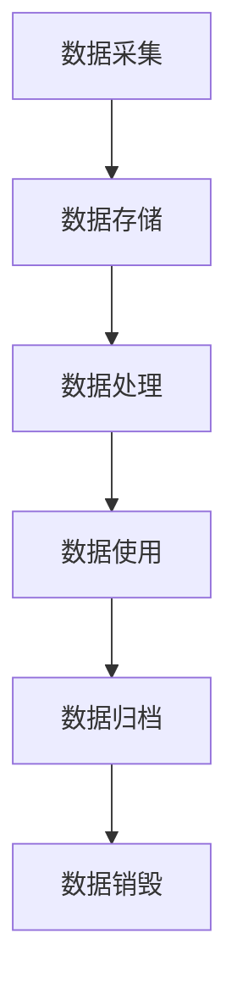

                 

# 数据治理：规范 AI 2.0 数据采集、存储、使用和管理流程

## 关键词：数据治理、AI 2.0、数据采集、数据存储、数据处理、数据安全、隐私保护、合规性、流程优化

## 摘要

本文旨在探讨数据治理在人工智能（AI）2.0时代的核心作用，详细分析了数据采集、存储、使用和管理流程的规范化和标准化方法。随着人工智能技术的不断进步，数据的质量和完整性对于AI系统的性能和决策能力至关重要。本文将从背景介绍、核心概念、算法原理、实际应用、工具推荐等多个维度，深入解析数据治理的各个方面，旨在为AI开发者、数据科学家和行业从业者提供有价值的参考和指导。

## 1. 背景介绍

### 1.1 数据治理的定义

数据治理是指通过制定和执行一系列策略、规则和流程，确保数据质量、数据安全、数据隐私和合规性的一门科学和艺术。它旨在实现数据的有序管理，使得数据能够为组织带来价值，同时降低数据风险。

### 1.2 AI 2.0的概念

AI 2.0，即下一代人工智能，强调人工智能系统的智能化、自动化和自适应能力。它不仅包括传统的机器学习和深度学习技术，还融合了自然语言处理、计算机视觉、机器人技术等多个领域的最新进展。

### 1.3 数据治理在 AI 2.0 中的重要性

在 AI 2.0时代，数据的质量和完整性对于人工智能系统的性能和可靠性至关重要。高质量的数据可以提升模型的效果，降低错误率，提高预测准确性。因此，数据治理成为AI系统成功的关键因素。

## 2. 核心概念与联系

### 2.1 数据生命周期

数据生命周期是指数据从创建、采集、存储、处理、使用到归档和销毁的整个过程。数据治理需要全面管理和监控数据生命周期中的每个阶段。

### 2.2 数据质量

数据质量是指数据满足预期用途的能力，包括数据的准确性、完整性、一致性、及时性和可用性。良好的数据质量是数据治理的基础。

### 2.3 数据安全与隐私保护

数据安全和隐私保护是数据治理的重要内容。在数据采集、存储和处理过程中，需要采取有效的措施保护数据不被未经授权的访问、泄露或篡改。

### 2.4 合规性

合规性是指数据治理过程符合相关法律法规和行业标准的要求。不同国家和地区可能有不同的数据保护法规，数据治理需要确保遵守所有适用的规定。

### 2.5 Mermaid 流程图

下面是一个简化的数据治理流程的 Mermaid 流程图：



## 3. 核心算法原理 & 具体操作步骤

### 3.1 数据采集

数据采集是数据治理的第一个环节。具体操作步骤如下：

- 设计数据采集方案：根据业务需求，确定需要采集的数据类型、来源和频率。
- 选择数据采集工具：根据数据类型和采集需求，选择合适的数据采集工具，如API接口、爬虫、日志采集器等。
- 实施数据采集：按照设计方案，实施数据采集工作，确保数据的准确性和完整性。

### 3.2 数据存储

数据存储是数据治理的核心环节之一。具体操作步骤如下：

- 设计数据存储方案：根据数据类型、规模和访问需求，选择合适的存储方案，如关系数据库、NoSQL数据库、数据仓库等。
- 实施数据存储：将采集到的数据存储到选定的存储方案中，确保数据的安全性和可靠性。
- 管理数据存储：定期对数据存储进行维护和管理，如数据备份、数据压缩、数据迁移等。

### 3.3 数据处理

数据处理是数据治理的关键环节。具体操作步骤如下：

- 数据清洗：去除重复数据、空值数据、异常数据等，确保数据的准确性和一致性。
- 数据转换：将数据转换为统一的格式和结构，以便于后续处理和分析。
- 数据集成：将来自不同来源的数据进行整合，形成统一的数据视图。

### 3.4 数据使用

数据使用是数据治理的最终目的。具体操作步骤如下：

- 数据建模：利用数据挖掘、机器学习等技术，构建数据模型，提取数据价值。
- 数据分析：对数据进行分析，发现数据背后的规律和趋势。
- 数据应用：将分析结果应用于实际业务场景，如决策支持、风险控制、市场营销等。

## 4. 数学模型和公式 & 详细讲解 & 举例说明

### 4.1 数据质量评估

数据质量评估是衡量数据质量的重要手段。常用的评估方法包括：

- 准确率（Accuracy）：准确率是指正确识别的数据占总数据的比例。
- 召回率（Recall）：召回率是指正确识别的数据占实际存在的数据的比例。
- F1 分数（F1 Score）：F1 分数是准确率和召回率的加权平均，用于综合评估数据质量。

下面是一个简单的数据质量评估的示例：

$$
\text{Accuracy} = \frac{\text{正确识别的数据}}{\text{总数据}} \\
\text{Recall} = \frac{\text{正确识别的数据}}{\text{实际存在的数据}} \\
\text{F1 Score} = \frac{2 \times \text{Accuracy} \times \text{Recall}}{\text{Accuracy} + \text{Recall}}
$$

假设有一份数据集，其中正确识别的数据为 1000 条，实际存在的数据为 1500 条。则该数据集的准确率为 0.8，召回率为 0.67，F1 分数为 0.74。

### 4.2 数据安全评估

数据安全评估是衡量数据安全水平的重要手段。常用的评估方法包括：

- 加密算法：如 AES、RSA 等，用于保护数据的机密性。
- 访问控制：如基于角色的访问控制（RBAC）、基于属性的访问控制（ABAC）等，用于限制数据的访问权限。
- 安全审计：记录数据访问和操作日志，用于追踪和审计数据安全事件。

下面是一个简单的数据安全评估的示例：

- 加密算法评估：评估加密算法的强度和安全性，如 AES 算法的密钥长度和加密速度。
- 访问控制评估：评估访问控制策略的有效性，如用户角色分配和权限设置。
- 安全审计评估：评估安全审计日志的完整性和可用性，如日志的记录粒度和查询速度。

## 5. 项目实战：代码实际案例和详细解释说明

### 5.1 开发环境搭建

在本节中，我们将搭建一个基于 Python 的数据治理项目开发环境。以下是具体的步骤：

1. 安装 Python 3.8 或更高版本。
2. 安装常用 Python 数据库，如 MySQL、PostgreSQL 等。
3. 安装数据采集、处理和分析相关的库，如 Pandas、NumPy、Scikit-learn 等。

### 5.2 源代码详细实现和代码解读

在本节中，我们将实现一个简单的数据采集、存储和处理流程。以下是具体的代码实现和解读：

```python
import pandas as pd
import mysql.connector

# 数据采集
def collect_data(source):
    data = pd.read_csv(source)
    return data

# 数据存储
def store_data(data, destination):
    data.to_csv(destination, index=False)

# 数据处理
def process_data(data):
    data['age'] = data['age'].astype(int)
    data['income'] = data['income'].astype(float)
    return data

# 主函数
def main():
    source = 'data.csv'
    destination = 'processed_data.csv'
    
    # 数据采集
    data = collect_data(source)
    
    # 数据处理
    processed_data = process_data(data)
    
    # 数据存储
    store_data(processed_data, destination)

if __name__ == '__main__':
    main()
```

上述代码首先定义了三个函数：`collect_data` 用于采集数据，`store_data` 用于存储数据，`process_data` 用于处理数据。在主函数 `main` 中，我们依次调用这三个函数，完成数据采集、处理和存储的全过程。

### 5.3 代码解读与分析

- `collect_data` 函数：使用 Pandas 库读取 CSV 文件，获取原始数据。
- `store_data` 函数：使用 Pandas 库将处理后的数据保存为 CSV 文件。
- `process_data` 函数：对数据进行清洗和转换，如将字符串类型的数据转换为整数或浮点数类型。

通过上述代码，我们可以实现一个简单的数据治理流程，包括数据采集、存储和处理。这为实际项目中的数据治理提供了基础。

## 6. 实际应用场景

### 6.1 金融领域

在金融领域，数据治理可以帮助金融机构确保金融交易数据的准确性、完整性和安全性。通过数据治理，金融机构可以提升风险管理能力，降低欺诈风险，提高客户满意度。

### 6.2 医疗健康领域

在医疗健康领域，数据治理可以帮助医疗机构确保患者数据的隐私保护和合规性。通过数据治理，医疗机构可以提升医疗数据的利用效率，提高医疗服务质量，改善患者体验。

### 6.3 零售电商领域

在零售电商领域，数据治理可以帮助零售电商企业确保用户数据的准确性和完整性。通过数据治理，零售电商企业可以优化用户画像，提高推荐系统的准确性，提升用户转化率和销售额。

## 7. 工具和资源推荐

### 7.1 学习资源推荐

- 《数据治理实践指南》（Data Governance Implementation Guide）
- 《数据质量管理：基于大数据的实践》（Data Quality Management: A Practical Approach to Big Data）

### 7.2 开发工具框架推荐

- MySQL、PostgreSQL 等关系数据库
- MongoDB、Cassandra 等NoSQL数据库
- Pandas、NumPy、Scikit-learn 等Python数据科学库

### 7.3 相关论文著作推荐

- "Data Governance in the Age of Big Data"
- "Data Quality Management in the Cloud: Challenges and Solutions"
- "A Framework for Data Governance in Enterprise Information Systems"

## 8. 总结：未来发展趋势与挑战

### 8.1 未来发展趋势

- 数据治理将从传统的数据质量管理向智能化、自动化、自适应的数据治理转变。
- 数据治理将更加重视数据隐私保护和合规性。
- 数据治理将融入人工智能和机器学习技术，提升数据处理和分析能力。

### 8.2 挑战

- 数据治理需要解决数据质量和数据安全之间的平衡问题。
- 数据治理需要应对不断变化的数据法规和政策。
- 数据治理需要应对数据规模的爆炸性增长带来的挑战。

## 9. 附录：常见问题与解答

### 9.1 数据治理与数据管理的区别是什么？

数据治理侧重于制定和执行策略、规则和流程，确保数据质量、数据安全、数据隐私和合规性。数据管理侧重于实现数据存储、数据备份、数据恢复等实际操作。

### 9.2 数据治理的主要目标是什么？

数据治理的主要目标是确保数据质量、数据安全、数据隐私和合规性，从而提升数据的利用效率和价值。

### 9.3 数据治理的关键因素有哪些？

数据治理的关键因素包括数据质量、数据安全、数据隐私保护、合规性和数据生命周期管理等。

## 10. 扩展阅读 & 参考资料

- [Data Governance Guide](https://www.datagovernanceguide.com/)
- [Data Governance Frameworks](https://www.ibm.com/cloud/data-governance/frameworks)
- [Data Quality Management Best Practices](https://www.dataquality.training/best-practices/)

### 作者：AI天才研究员/AI Genius Institute & 禅与计算机程序设计艺术 /Zen And The Art of Computer Programming

