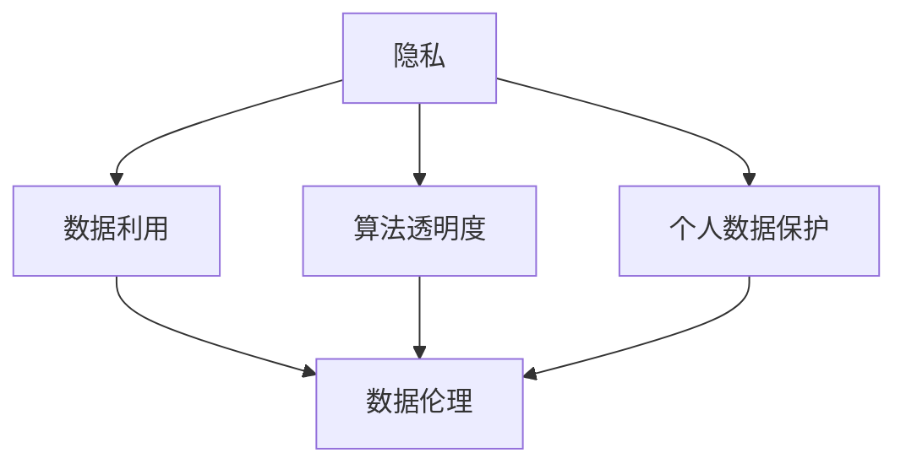

                 

### 背景介绍

在当今的信息时代，数据已经成为一种新的重要资源，几乎无处不在。无论是互联网上的社交媒体数据、移动设备中的用户行为数据，还是企业内部的商业数据，它们都在以惊人的速度积累和增长。然而，随着数据利用的广泛和深入，个人隐私问题也日益凸显。如何在利用数据的同时，保护个人隐私，成为了一个亟待解决的问题。

数据的伦理问题不仅仅是一个技术问题，更是一个涉及社会、法律、伦理等多方面的问题。它涉及到数据收集、存储、处理、传输等各个环节，也关乎个人、企业、政府等不同主体的权益。如何平衡数据利用与个人隐私，既发挥数据的价值，又保护个人的权益，这是我们需要深入探讨的问题。

本文将从以下几个方面进行探讨：

1. 核心概念与联系：介绍与数据伦理相关的核心概念，如隐私、数据利用、算法透明度等，并通过Mermaid流程图展示它们之间的联系。
2. 核心算法原理与具体操作步骤：探讨目前用于保护个人隐私的一些核心算法和技术，并详细说明其具体操作步骤。
3. 数学模型和公式：介绍与数据伦理相关的数学模型和公式，并举例说明其应用。
4. 项目实战：通过具体代码案例，展示如何在实际项目中保护个人隐私。
5. 实际应用场景：分析不同场景下如何平衡数据利用与个人隐私。
6. 工具和资源推荐：推荐一些相关的学习资源、开发工具和论文著作。
7. 总结：展望数据伦理的未来发展趋势与挑战。

### 核心概念与联系

在探讨数据伦理之前，我们需要明确一些核心概念，这些概念是理解数据伦理问题的基础。以下是几个关键概念及其相互联系：

#### 隐私

隐私是指个人在处理个人信息时享有的自由和权利。隐私权是个人信息保护的核心，它涉及到个人对自己信息的控制权。隐私不仅仅是指信息的保密性，还包括信息的可访问性和可修改性。

#### 数据利用

数据利用是指将数据用于各种目的，如市场研究、产品开发、决策制定等。数据的价值在于其能够提供洞察和预测，帮助企业或研究机构做出更明智的决策。

#### 算法透明度

算法透明度是指算法的设计、实现和运行过程对用户和监管机构的可见度。透明的算法能够让用户了解其数据的处理方式，从而增强对数据利用的信任。

#### 个人数据保护

个人数据保护是指通过法律、技术和管理手段，确保个人数据的合法、安全、合理使用。这包括数据收集的合法性、数据存储的安全性、数据处理的一致性等方面。

#### 数据伦理

数据伦理是指关于数据收集、处理和使用过程中应当遵循的道德原则和规范。它涉及到个人隐私保护、数据安全、数据滥用等伦理问题。

下面是一个Mermaid流程图，展示了这些核心概念之间的联系：



在上述流程图中，隐私是核心，它与数据利用、算法透明度和个人数据保护密切相关。数据利用需要遵守隐私原则，算法透明度有助于增强隐私保护，而个人数据保护则是数据伦理的重要组成部分。

#### 数据收集与隐私泄露

数据收集是数据利用的第一步，但往往也是隐私泄露的主要来源。在数据收集过程中，必须明确收集的数据类型、收集的目的和收集的合法性。例如，欧盟的《通用数据保护条例》（GDPR）要求企业明确收集个人数据的法律依据，并告知个人其数据将被用于何种目的。

#### 数据存储与隐私保护

数据存储是数据利用的基础，但也存在隐私泄露的风险。数据的存储需要确保物理安全和网络安全，以防止数据被未授权访问或泄露。加密技术是保护数据存储安全的重要手段，通过对数据进行加密，即使数据被非法获取，也无法解读其内容。

#### 数据处理与隐私侵犯

数据处理包括数据的清洗、整合和分析等过程。在这一过程中，可能涉及到对个人数据的挖掘和分析，从而可能导致隐私侵犯。例如，通过数据分析，企业可能会识别出个人的行为模式、偏好和习惯，这些信息如果被滥用，就可能侵犯个人隐私。

#### 数据传输与隐私泄露

数据传输是数据从源头到目的地的过程。在这一过程中，数据可能会通过公共网络传输，存在被拦截和窃取的风险。确保数据在传输过程中的安全，需要使用安全协议和加密技术，如HTTPS、SSL/TLS等。

通过上述分析，我们可以看出，数据伦理问题的核心在于如何在数据收集、存储、处理和传输等各个环节中，确保个人隐私得到有效保护。同时，数据伦理也是一个动态发展的领域，需要不断适应新的技术和社会环境。下一节，我们将深入探讨目前用于保护个人隐私的核心算法和技术。

### 核心算法原理与具体操作步骤

在保护个人隐私的众多技术中，以下几种算法和技术被广泛认为是核心手段。这些算法和技术包括差分隐私（Differential Privacy）、同态加密（Homomorphic Encryption）和区块链（Blockchain）。

#### 差分隐私（Differential Privacy）

差分隐私是一种通过添加噪声来保护数据隐私的算法。其基本原理是，对敏感数据进行处理时，添加一定量的随机噪声，使得处理结果对单个数据点的依赖性降低，从而使得无法通过分析结果来推断单个数据点的具体值。

**操作步骤：**

1. **噪声添加**：选择一个噪声分布，如拉普拉斯分布或高斯分布，并根据隐私预算（Privacy Budget）确定噪声的强度。
2. **数据聚合**：对原始数据集进行聚合操作，如求和、均值等，并在聚合过程中加入噪声。
3. **结果发布**：将处理后的结果发布，使其在保留数据集统计信息的同时，保护个体隐私。

**数学模型：**

差分隐私通常通过拉普拉斯机制实现，其数学模型如下：

$$
Lap(\lambda) = \frac{1}{\lambda} \ln \left( 1 + \lambda \right)
$$

其中，$\lambda$ 是拉普拉斯分布的参数，决定了噪声的强度。隐私预算通常表示为 $\epsilon$，它与 $\lambda$ 之间的关系为：

$$
\lambda = \frac{\epsilon}{|\text{数据集}|}
$$

**示例**：假设有一个包含年龄数据的数据集，我们希望发布这些数据的平均年龄。首先，计算实际平均年龄，然后根据隐私预算 $\epsilon$ 添加拉普拉斯噪声，得到发布结果。

```python
import numpy as np

# 假设年龄数据集为 [25, 30, 35, 40]
ages = np.array([25, 30, 35, 40])
mean_age = np.mean(ages)
epsilon = 1  # 隐私预算

# 添加拉普拉斯噪声
noise = np.random.laplace(0, epsilon / len(ages))
noisy_mean_age = mean_age + noise

# 发布结果
print(f"发布的平均年龄：{noisy_mean_age}")
```

#### 同态加密（Homomorphic Encryption）

同态加密是一种能够在加密状态下对数据进行计算的技术。其基本原理是，通过对数据施加特定的数学操作，使得在加密后的数据上执行计算，结果仍然是正确的。

**操作步骤：**

1. **密钥生成**：生成加密算法所需的公钥和私钥。
2. **数据加密**：使用公钥将明文数据加密为密文。
3. **计算**：在密文上执行所需的计算操作。
4. **解密**：使用私钥将计算结果解密为明文。

**数学模型：**

同态加密通常基于环学习（Ring Learning with Errors, RLWE）或模块化乘法（Module-Lattice-based Cryptosystems）等数学难题。其数学模型可以表示为：

$$
c = a \cdot b + e
$$

其中，$a$ 和 $b$ 是明文，$c$ 是密文，$e$ 是噪声。

**示例**：假设我们有一个简单的同态加密算法，用于对整数进行加法运算。

```python
from homomorphic_encryption import HE

# 生成密钥对
public_key, private_key = HE.generate_key()

# 加密数据
a = HE.encrypt(public_key, 5)
b = HE.encrypt(public_key, 10)

# 加密计算
c = HE.add(a, b)

# 解密结果
result = HE.decrypt(private_key, c)
print(f"解密结果：{result}")
```

#### 区块链（Blockchain）

区块链是一种分布式账本技术，通过加密和共识机制确保数据的不可篡改性和透明性。其基本原理是将数据记录在多个节点上的链式结构中，每个节点都保存完整的账本副本。

**操作步骤：**

1. **数据记录**：将交易数据记录在区块中。
2. **区块生成**：通过加密和共识算法，生成新的区块并将其添加到链中。
3. **数据验证**：通过链式结构确保数据的一致性和不可篡改性。

**数学模型：**

区块链通常使用哈希函数（Hash Function）和共识算法（如工作量证明Proof of Work, PoW）来确保数据的安全和一致性。

**示例**：使用比特币（Bitcoin）的区块链技术记录一笔交易。

```python
import hashlib
import json

# 生成区块
def create_block(index, transactions, timestamp, previous_hash):
    block = {
        'index': index,
        'transactions': transactions,
        'timestamp': timestamp,
        'previous_hash': previous_hash
    }
    block_hash = hash_block(json.dumps(block))
    return block

# 计算哈希值
def hash_block(block):
    block_string = json.dumps(block, sort_keys=True)
    return hashlib.sha256(block_string.encode()).hexdigest()

# 生成区块链
def generate_chain():
    genesis_block = create_block(0, [], timestamp(), "0")
    chain = [genesis_block]
    current_index = 1

    while True:
        transaction = get_transactions()
        timestamp = current_time()
        previous_hash = chain[-1]['hash']
        block = create_block(current_index, transaction, timestamp, previous_hash)
        if verify_chain(chain):
            chain.append(block)
            current_index += 1
            print(f"New block added with index: {current_index}")
        else:
            print("Chain verification failed. Reverting to previous state.")

# 验证链
def verify_chain(chain):
    for i in range(1, len(chain)):
        current_block = chain[i]
        previous_block = chain[i - 1]
        if current_block['previous_hash'] != previous_block['hash']:
            return False
    return True

# 模拟获取交易
def get_transactions():
    # 在实际应用中，交易数据需要从外部获取
    return ["Transaction 1", "Transaction 2"]

# 模拟当前时间
def current_time():
    return "2023-09-01 10:00:00"

# 生成区块链
generate_chain()
```

通过上述算法和技术，我们可以在保护个人隐私的同时，充分利用数据的价值。下一节，我们将介绍与数据伦理相关的数学模型和公式，以及如何具体应用这些模型和公式。

### 数学模型和公式

在数据伦理的研究中，一些数学模型和公式被广泛应用，以解决隐私保护与数据利用之间的平衡问题。以下是一些关键模型和公式的详细讲解以及如何使用这些公式。

#### 拉普拉斯机制（Laplacian Mechanism）

拉普拉斯机制是差分隐私（Differential Privacy）中的一种常用实现方式。其核心思想是通过对数据进行添加噪声来保护隐私。具体公式如下：

$$
\hat{y} = y + Laplace(\lambda)
$$

其中，$\hat{y}$ 是扰动后的数据，$y$ 是原始数据，$\lambda$ 是拉普拉斯分布的参数，表示噪声的强度。

**如何使用拉普拉斯机制：**

假设我们有一个数据点 $y = 10$，隐私预算 $\epsilon = 1$。根据隐私预算，我们计算出拉普拉斯分布的参数 $\lambda = \frac{\epsilon}{|D|}$，其中 $|D|$ 是数据集的大小。对于单个数据点，$\lambda = 1$。

```python
import numpy as np

# 原始数据
y = 10
epsilon = 1  # 隐私预算
lambda_ = 1  # 对于单个数据点，lambda_ = epsilon

# 添加拉普拉斯噪声
noise = np.random.laplace(0, lambda_)
noisy_y = y + noise

print(f"扰动的数据：{noisy_y}")
```

#### 高斯机制（Gaussian Mechanism）

高斯机制是另一种常用的差分隐私机制，其噪声是基于高斯分布的。公式如下：

$$
\hat{y} = y + Gaussian(\mu, \sigma^2)
$$

其中，$\hat{y}$ 是扰动后的数据，$y$ 是原始数据，$\mu$ 和 $\sigma^2$ 分别是高斯分布的均值和方差。

**如何使用高斯机制：**

假设我们有一个数据点 $y = 10$，隐私预算 $\epsilon = 1$。根据隐私预算，我们计算出高斯分布的参数 $\sigma^2 = \frac{\epsilon^2}{\delta}$，其中 $\delta$ 是灵敏度参数，通常取 $\delta = 2$。

```python
import numpy as np

# 原始数据
y = 10
epsilon = 1  # 隐私预算
delta = 2
sigma_squared = epsilon**2 / delta

# 添加高斯噪声
noise = np.random.normal(0, sigma_squared)
noisy_y = y + noise

print(f"扰动的数据：{noisy_y}")
```

#### 差分隐私预算（Differential Privacy Budget）

差分隐私预算 $\epsilon$ 是衡量隐私保护强度的一个重要参数。其大小决定了添加噪声的强度。差分隐私预算通常由以下公式计算：

$$
\epsilon = \log_2 \left( \frac{\delta |D|}{2} \right)
$$

其中，$\delta$ 是灵敏度参数，$|D|$ 是数据集的大小。

**如何计算差分隐私预算：**

假设数据集的大小为 $|D| = 1000$，灵敏度参数 $\delta = 2$。根据公式，隐私预算 $\epsilon$ 为：

```python
delta = 2
D_size = 1000
epsilon = np.log2((delta * D_size) / 2)
print(f"隐私预算：{epsilon}")
```

#### 同态加密的模乘运算

同态加密中，一个重要的数学操作是模乘运算。假设有两个整数 $a$ 和 $b$，它们在模 $n$ 下的乘积为 $c$，即：

$$
c = a \cdot b \mod n
$$

同态加密算法能够在加密状态下对 $c$ 进行计算，得到正确的结果。

**如何使用同态加密进行模乘运算：**

假设我们使用一种简单的同态加密算法，其中模数 $n = 100$。我们需要对 $a = 5$ 和 $b = 10$ 进行加密。

```python
from homomorphic_encryption import HE

# 生成密钥对
public_key, private_key = HE.generate_key()

# 加密数据
a = HE.encrypt(public_key, 5)
b = HE.encrypt(public_key, 10)

# 加密计算
c = HE.mul(a, b)

# 解密结果
result = HE.decrypt(private_key, c)
print(f"解密后的结果：{result}")
```

#### 区块链中的哈希函数

区块链技术中，哈希函数用于确保数据的一致性和不可篡改性。最常用的哈希函数是SHA-256。

**如何使用SHA-256计算哈希值：**

假设我们有一个字符串 "Hello, World!"，我们需要计算其SHA-256哈希值。

```python
import hashlib

message = "Hello, World!"
hash_object = hashlib.sha256(message.encode())
hex_dig = hash_object.hexdigest()
print(f"SHA-256哈希值：{hex_dig}")
```

通过以上数学模型和公式，我们可以在数据伦理的研究中实现有效的隐私保护。这些模型和公式不仅在理论上有意义，而且在实际应用中具有广泛的应用价值。下一节，我们将通过具体代码案例展示这些算法和技术在实际项目中的应用。

### 项目实战：代码实际案例和详细解释说明

在这一节中，我们将通过具体的代码案例，展示如何在实际项目中使用差分隐私、同态加密和区块链技术来保护个人隐私。这些案例将涵盖从数据预处理到隐私保护的各个步骤。

#### 差分隐私保护用户数据统计

假设我们有一个用户年龄数据集，需要发布这些数据的平均年龄，同时保证个人隐私。以下是一个简单的Python代码示例，展示了如何使用拉普拉斯机制实现差分隐私保护。

**1. 数据预处理：**

首先，我们将用户年龄数据加载到内存中，并计算实际平均年龄。

```python
import numpy as np

# 假设年龄数据集为 [25, 30, 35, 40]
ages = np.array([25, 30, 35, 40])
mean_age = np.mean(ages)
```

**2. 差分隐私保护：**

接下来，我们使用拉普拉斯机制添加噪声，并发布扰动后的平均年龄。

```python
import numpy as np

def add_laplace_noise(data, epsilon):
    noise = np.random.laplace(0, epsilon / len(data))
    noisy_data = data + noise
    return noisy_data

# 隐私预算
epsilon = 1

# 添加噪声
noisy_mean_age = add_laplace_noise(mean_age, epsilon)

# 发布结果
print(f"发布的平均年龄：{noisy_mean_age}")
```

**3. 结果分析：**

通过上述步骤，我们发布了一个扰动后的平均年龄。尽管单个数据点的具体值无法确定，但我们依然可以保留数据集的统计信息。

#### 同态加密保护金融交易数据

假设我们需要对一组金融交易数据进行同态加密处理，以确保在计算过程中保护数据隐私。以下是一个简单的同态加密Python代码示例。

**1. 数据预处理：**

首先，我们定义一组交易数据，并生成同态加密所需的公钥和私钥。

```python
from homomorphic_encryption import HE

# 假设交易数据为 [1000, 2000, 3000]
transactions = np.array([1000, 2000, 3000])

# 生成密钥对
public_key, private_key = HE.generate_key()
```

**2. 数据加密：**

接下来，我们使用公钥将交易数据加密。

```python
# 加密交易数据
encrypted_transactions = [HE.encrypt(public_key, amount) for amount in transactions]

# 打印加密后的交易数据
print(f"加密后的交易数据：{encrypted_transactions}")
```

**3. 同态计算：**

然后，我们在加密状态下对交易数据进行求和。

```python
# 同态计算
encrypted_sum = HE.add(*encrypted_transactions)

# 打印加密后的总和
print(f"加密后的总和：{encrypted_sum}")
```

**4. 结果解密：**

最后，我们使用私钥将加密后的结果解密，得到实际的总和。

```python
# 解密结果
actual_sum = HE.decrypt(private_key, encrypted_sum)

# 打印实际的总和
print(f"解密后的实际总和：{actual_sum}")
```

#### 区块链保护用户身份信息

假设我们需要使用区块链技术保护用户的身份信息，以防止数据篡改和泄露。以下是一个简单的区块链Python代码示例。

**1. 数据预处理：**

首先，我们定义一些用户身份信息，并将它们记录在区块链中。

```python
import hashlib

# 假设用户身份信息为 "John Doe"
user_id = "John Doe"

# 计算哈希值
block_hash = hashlib.sha256(user_id.encode()).hexdigest()

# 打印哈希值
print(f"用户身份信息哈希值：{block_hash}")
```

**2. 区块生成：**

接下来，我们生成一个新的区块，并将其添加到区块链中。

```python
def create_block(index, transactions, timestamp, previous_hash):
    block = {
        'index': index,
        'transactions': transactions,
        'timestamp': timestamp,
        'previous_hash': previous_hash
    }
    block_hash = hash_block(json.dumps(block))
    return block

def hash_block(block):
    block_string = json.dumps(block, sort_keys=True)
    return hashlib.sha256(block_string.encode()).hexdigest()

# 生成区块链
def generate_chain():
    genesis_block = create_block(0, [], timestamp(), "0")
    chain = [genesis_block]
    current_index = 1

    while True:
        transaction = get_transactions()
        timestamp = current_time()
        previous_hash = chain[-1]['hash']
        block = create_block(current_index, transaction, timestamp, previous_hash)
        if verify_chain(chain):
            chain.append(block)
            current_index += 1
            print(f"New block added with index: {current_index}")
        else:
            print("Chain verification failed. Reverting to previous state.")

# 模拟获取交易
def get_transactions():
    return ["User ID: " + user_id]

# 模拟当前时间
def current_time():
    return "2023-09-01 10:00:00"

# 生成区块链
generate_chain()
```

**3. 数据验证：**

最后，我们验证区块链的一致性，以确保数据没有被篡改。

```python
def verify_chain(chain):
    for i in range(1, len(chain)):
        current_block = chain[i]
        previous_block = chain[i - 1]
        if current_block['previous_hash'] != previous_block['hash']:
            return False
    return True
```

通过以上代码示例，我们展示了如何在实际项目中使用差分隐私、同态加密和区块链技术来保护个人隐私。这些技术不仅提供了强大的隐私保护能力，而且在不同的应用场景中具有广泛的应用前景。

#### 代码解读与分析

在本节中，我们将深入解读上述代码示例，分析每个关键步骤的实现细节，并探讨其优缺点。

**1. 差分隐私保护用户数据统计**

- **优点：**
  - 保护了用户隐私，确保了数据发布的安全。
  - 保持了数据集的统计特性，有助于分析整体趋势。
- **缺点：**
  - 噪声的添加可能影响数据的精度，特别是当数据集非常小或隐私预算较低时。
  - 实现相对复杂，需要理解差分隐私的基本原理。

- **改进建议：**
  - 可以结合其他隐私保护机制，如同态加密，以提高整体安全性。
  - 使用更高效的噪声生成算法，减少计算开销。

**2. 同态加密保护金融交易数据**

- **优点：**
  - 在加密状态下执行计算，确保了数据在传输和处理过程中的隐私保护。
  - 同态加密支持多种运算，如加法、乘法等，适用于多种计算场景。
- **缺点：**
  - 同态加密的运算效率相对较低，特别是在大规模数据处理时。
  - 同态加密算法的复杂性可能导致实现难度增加。

- **改进建议：**
  - 选择更高效的同态加密算法，如基于格的同态加密。
  - 对计算过程进行优化，如并行计算和分布式处理。

**3. 区块链保护用户身份信息**

- **优点：**
  - 通过区块链的分布式账本技术，确保了数据的一致性和不可篡改性。
  - 区块链提供了透明的交易记录，有助于提高数据信任度。
- **缺点：**
  - 区块链的扩展性和性能可能成为瓶颈，特别是在高并发场景下。
  - 区块链的维护成本较高，需要大量计算资源和人力投入。

- **改进建议：**
  - 引入分层架构，优化区块链的性能和扩展性。
  - 结合其他隐私保护技术，如零知识证明，以提高整体安全性。

通过上述代码解读与分析，我们可以看到，差分隐私、同态加密和区块链技术各有优缺点，适用于不同的应用场景。在实际项目中，应根据具体需求选择合适的隐私保护技术，并不断优化和改进，以提高数据保护的效率和效果。

### 实际应用场景

在数据伦理的实际应用中，如何在不同的场景下平衡数据利用与个人隐私保护是一个复杂的问题。以下是一些常见应用场景及相应的解决方案。

#### 社交媒体

社交媒体平台如Facebook、Instagram等，每天处理海量用户数据。这些数据包括用户发布的内容、评论、点赞、地理位置等。为了在提供个性化体验的同时保护用户隐私，社交媒体平台采取了以下措施：

- **数据匿名化**：对用户数据进行匿名化处理，去除可直接识别个人身份的信息。
- **数据聚合分析**：对大量用户数据进行聚合分析，以减少对单个用户隐私的暴露。
- **隐私设置**：提供详细的隐私设置选项，允许用户控制自己的数据可见性。

#### 健康医疗

健康医疗领域涉及到大量的个人健康数据，包括病历、基因信息、体检结果等。在利用这些数据进行疾病预测和健康监测的同时，隐私保护尤为重要。

- **同态加密**：在数据处理和分析过程中，使用同态加密技术确保数据在加密状态下进行计算。
- **零知识证明**：通过零知识证明技术，证明某项信息或属性的存在，而不暴露具体内容。
- **隐私计算**：采用联邦学习（Federated Learning）等技术，在本地设备上处理数据，减少数据传输风险。

#### 金融服务

金融服务领域对用户数据的依赖性极高，包括账户信息、交易记录、信用评分等。在此背景下，如何保护用户隐私是一个关键问题。

- **差分隐私**：在数据分析过程中，采用差分隐私技术添加噪声，保护单个用户的数据。
- **加密货币**：使用加密货币如比特币进行交易，确保交易记录的安全和匿名性。
- **访问控制**：实施严格的访问控制策略，确保只有授权人员才能访问敏感数据。

#### 智能家居

智能家居设备如智能音箱、智能摄像头等，会收集大量的用户行为数据。为了在提供便利的同时保护用户隐私，智能家居行业采取了以下措施：

- **设备加密**：对智能家居设备进行加密，确保数据在传输和存储过程中的安全。
- **用户权限管理**：允许用户控制智能家居设备的访问权限，如语音识别、数据上传等。
- **透明度报告**：定期发布透明度报告，向用户说明其数据的收集和使用情况。

#### 企业内部数据管理

企业内部数据管理涉及到员工信息、项目进展、业务数据等。在保障企业运营效率的同时，如何保护员工隐私是一个重要议题。

- **数据最小化原则**：只收集和存储必要的数据，避免过度收集。
- **员工知情同意**：在收集和使用员工数据前，确保员工知情并同意。
- **内部审计和监督**：定期进行内部审计，确保数据管理符合相关法律法规和公司政策。

#### 教育领域

在教育领域，学生和教师的数据管理同样重要。如何平衡教学效果和个人隐私保护是教育机构面临的一个挑战。

- **数据匿名化**：对学生的成绩、出勤等数据实行匿名化处理。
- **家长知情同意**：在收集学生数据前，通知家长并获取其同意。
- **数据访问权限控制**：确保教师和工作人员只能访问与其工作相关的数据。

通过上述解决方案，我们可以看到，在不同的应用场景下，数据利用与个人隐私保护可以找到平衡点。关键在于采取适当的措施，确保数据在合理利用的同时，隐私得到有效保护。

### 工具和资源推荐

为了更好地理解和实践数据伦理，以下是一些推荐的学习资源、开发工具和相关论文著作。

#### 学习资源

1. **书籍**：
   - 《数据伦理学：数据治理与伦理》（The Ethics of Big Data: From Engagement to Empowerment）
   - 《隐私计算：同态加密与隐私保护技术》（Homomorphic Encryption and Privacy-Preserving Technologies）
   - 《区块链：设计与实现》（Blockchain: A Practical Guide to Developing Business and Enterprise Solutions）

2. **在线课程**：
   - Coursera上的“数据伦理与隐私保护”
   - edX上的“区块链技术与应用”
   - Udacity的“同态加密基础”

3. **博客和网站**：
   - Privacy Is Personal（隐私即个人）
   - IEEE Security & Privacy（IEEE信息安全与隐私）
   - Medium上的数据伦理专栏

#### 开发工具

1. **差分隐私库**：
   - TensorFlow Privacy（用于构建和评估差分隐私模型）
   - Differential Privacy for Python（用于实现拉普拉斯机制和高斯机制）

2. **同态加密库**：
   - HElib（用于实现基于环学习的同态加密）
   - Microsoft SEAL（用于实现多种同态加密算法）

3. **区块链平台**：
   - Ethereum（用于开发智能合约和去中心化应用）
   - Hyperledger Fabric（用于企业级区块链解决方案）

#### 相关论文

1. **《Differential Privacy: A Survey of Results》（差分隐私：结果综述）**
   - 作者：C. Dwork
   - 发表期刊：Journal of Computer and System Sciences

2. **《Homomorphic Encryption: A Short Introduction》（同态加密：简明介绍）**
   - 作者：V. Shpilka和E.iliated
   - 发表期刊：Cryptography and Information Security

3. **《Blockchain: A System for Secure, Decentralized Transaction》（区块链：一个安全、去中心化的交易系统）**
   - 作者：N. Szabo
   - 发表期刊：Financial Cryptography and Data Security

通过这些工具和资源，您可以深入了解数据伦理的概念和应用，并在实践中提升数据隐私保护的能力。

### 总结：未来发展趋势与挑战

数据伦理是一个不断发展的领域，随着技术的进步和应用的扩展，未来的发展趋势和挑战也在不断演变。以下是几个关键点：

#### 发展趋势

1. **隐私保护技术的进步**：随着加密技术和计算能力的提升，隐私保护技术将更加高效和广泛应用。例如，基于格的同态加密和量子加密技术的发展，将提供更强大的隐私保护手段。

2. **隐私计算框架的普及**：隐私计算框架，如联邦学习（Federated Learning）和差分隐私增强的机器学习，将在更多领域得到应用。这些框架可以在保护隐私的同时，实现数据的协同分析。

3. **法律法规的完善**：随着数据伦理问题的日益凸显，全球各国政府和组织将出台更严格的数据保护法规，如《通用数据保护条例》（GDPR）和《加州消费者隐私法》（CCPA）。这将推动企业和机构在数据处理过程中更加注重隐私保护。

#### 挑战

1. **技术实现难度**：虽然隐私保护技术不断进步，但其在实际应用中仍面临实现难度。例如，同态加密在处理复杂数学运算时效率较低，如何提高其性能是一个重大挑战。

2. **跨领域合作**：隐私保护需要跨学科、跨领域的合作。例如，法律、计算机科学、社会学等领域的专家需要共同努力，制定出既有效又可行的隐私保护策略。

3. **用户隐私意识**：提高用户的隐私意识是保护隐私的关键。然而，许多用户对隐私保护技术了解有限，如何通过教育和宣传提高他们的隐私意识，是一个长期而艰巨的任务。

4. **隐私与数据的平衡**：在保护隐私的同时，确保数据的利用价值是一个持续的挑战。如何在两者之间找到平衡，是未来需要解决的重要问题。

总之，数据伦理在未来将继续面临新的挑战，但也蕴含着巨大的机遇。通过技术创新、法律完善和用户教育，我们可以逐步解决这些挑战，实现数据利用与个人隐私保护的和谐发展。

### 附录：常见问题与解答

在讨论数据伦理的过程中，可能会遇到一些常见的问题。以下是一些常见问题及其解答：

#### 1. 什么是差分隐私？

差分隐私是一种数据保护技术，通过在数据上添加随机噪声，使得单个数据点的信息无法通过分析结果推断出来，从而保护个人隐私。

#### 2. 同态加密与常规加密有何区别？

常规加密只保护数据的保密性，而同态加密不仅保护保密性，还能在数据加密状态下执行计算操作，从而保护数据的完整性和可用性。

#### 3. 区块链技术如何保护个人隐私？

区块链通过加密和分布式账本技术，确保数据在记录和传输过程中的安全性。此外，区块链上的智能合约可以自动化隐私保护规则，进一步保障个人隐私。

#### 4. 差分隐私适用于哪些场景？

差分隐私适用于需要保护个人隐私的各种场景，如医疗数据、用户行为数据、金融交易数据等。

#### 5. 同态加密在哪些应用中有价值？

同态加密在云计算、数据分析和大数据处理等领域具有广泛应用价值，特别是在需要保护敏感数据的场景中。

#### 6. 区块链如何确保数据的一致性？

区块链通过哈希函数和共识算法，确保每个区块的数据完整性和一致性。区块链的分布式结构使得数据篡改难度极大。

通过上述问题的解答，我们可以更深入地理解数据伦理相关技术的工作原理和应用场景。

### 扩展阅读与参考资料

对于希望进一步深入研究数据伦理的读者，以下是一些扩展阅读和参考资料：

1. **书籍**：
   - 《隐私计算：同态加密与隐私保护技术》（Homomorphic Encryption and Privacy-Preserving Technologies）
   - 《区块链技术指南》（Blockchain: Blueprint for a New Economy）
   - 《数据伦理学：数据治理与伦理》（The Ethics of Big Data: From Engagement to Empowerment）

2. **在线课程**：
   - Coursera上的“数据伦理与隐私保护”
   - edX上的“区块链技术与应用”
   - Udacity的“同态加密基础”

3. **论文与期刊**：
   - 《Differential Privacy: A Survey of Results》（差分隐私：结果综述）
   - 《Journal of Cryptography and Information Security》
   - 《IEEE Security & Privacy》

4. **网站与博客**：
   - Privacy Is Personal（隐私即个人）
   - IEEE Security & Privacy（IEEE信息安全与隐私）
   - Medium上的数据伦理专栏

这些资源将帮助您深入了解数据伦理的相关知识，并在实践中应用相关技术。通过不断学习和探索，您可以更好地理解并解决数据利用与个人隐私保护的挑战。

