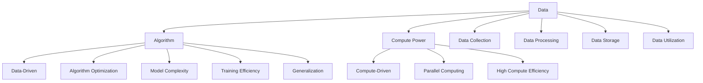

                 

### 背景介绍

人工智能（AI）的发展经历了多个阶段，从最初的符号主义和知识表示，到基于规则的系统，再到基于统计模型的机器学习，以及当前热门的深度学习。每一代人工智能技术都在数据、算法和算力的推动下不断进步，实现了从理论到应用的飞跃。然而，随着人工智能技术的不断发展，我们进入了第二代人工智能（Second Generation AI）的时代，这一代AI在数据、算法和算力方面有着更深层次的应用和变革。

首先，数据的角色在第二代AI中愈发重要。大数据的爆炸性增长为AI提供了丰富的学习素材，使机器能够从中发现更多模式和规律。然而，数据的质量和多样性也带来了挑战，如数据噪声、不平衡数据以及数据隐私问题等。因此，如何高效地处理和利用数据成为第二代AI发展的关键。

其次，算法的迭代与优化是推动AI技术进步的核心。从早期的简单算法，如决策树和神经网络，到复杂的深度学习算法，如卷积神经网络（CNN）和循环神经网络（RNN），算法的进步使得AI在图像识别、语音识别、自然语言处理等领域取得了显著的成果。然而，算法的优化并非一蹴而就，需要不断迭代和改进，以适应不断变化的数据和应用需求。

最后，算力的提升是AI技术发展的基础。随着硬件技术的进步，特别是图形处理单元（GPU）和专用AI芯片的发展，AI算法的计算能力得到了大幅提升。算力的提升不仅加速了算法的运行速度，还使得更复杂的模型和更大规模的数据分析成为可能。然而，算力的提升也带来了能耗和成本的问题，如何在提升计算能力的同时降低能耗和成本是未来发展的一个重要方向。

综上所述，数据、算法和算力在第二代AI中扮演着至关重要的角色。本文将围绕这三个核心要素，详细探讨其在第二代AI中的应用和影响。首先，我们将分析数据在AI中的作用，包括数据采集、处理、存储和利用等方面。随后，我们将深入探讨核心算法的原理和优化，以及这些算法在实际应用中的具体实现。接着，我们将介绍数学模型和公式的应用，并通过实际案例展示这些模型和公式的使用方法。最后，我们将讨论AI在现实世界中的应用场景，以及所需的工具和资源推荐。通过这篇文章，希望能够为读者提供一个全面、深入的关于第二代AI及其核心要素的概览。

### 核心概念与联系

在深入探讨第二代AI中的数据、算法和算力之前，我们需要明确几个核心概念，并理解它们之间的内在联系。这些核心概念不仅为AI的发展奠定了基础，也是本文后续内容分析推理的起点。

#### 数据（Data）

数据是AI的基石，没有数据，AI将无从谈起。数据分为结构化数据和非结构化数据。结构化数据通常以表格形式存储，如数据库中的记录；非结构化数据则包括文本、图像、音频和视频等。在第二代AI中，数据的重要性体现在以下几个方面：

1. **数据采集**：数据采集是数据获取的过程，包括互联网爬虫、传感器数据、社交媒体数据等。采集的数据需要经过处理，以确保其质量和完整性。
2. **数据处理**：数据处理包括数据清洗、去噪、归一化、特征提取等。处理后的数据将为模型训练提供高质量的学习素材。
3. **数据存储**：数据存储需要考虑数据量大、多样化以及访问速度快等因素。分布式数据库、数据湖和数据仓库等技术在这一过程中发挥了重要作用。
4. **数据利用**：数据利用涉及如何将数据转化为知识，如通过机器学习算法从数据中提取模式和规律。

#### 算法（Algorithm）

算法是AI的灵魂，决定了AI模型的学习能力和表现。算法可以分为以下几类：

1. **监督学习（Supervised Learning）**：通过已标记的数据训练模型，使其能够预测未知数据的标签。
2. **无监督学习（Unsupervised Learning）**：模型从未标记的数据中学习模式和结构，如聚类和降维。
3. **半监督学习（Semi-supervised Learning）**：结合已标记和未标记的数据进行训练，提高模型的效果。
4. **强化学习（Reinforcement Learning）**：模型通过与环境的交互，不断学习最优策略。

算法的进步主要体现在模型的复杂度、训练效率和泛化能力上。例如，深度学习算法通过多层神经网络模型，能够处理复杂的数据结构和模式。

#### 算力（Compute Power）

算力是AI运行的引擎，决定了算法的执行速度和规模。算力的提升主要依赖于硬件技术的发展：

1. **中央处理器（CPU）**：传统的CPU在处理复杂计算任务时效率较低。
2. **图形处理单元（GPU）**：GPU因其并行计算能力，在深度学习等任务中得到了广泛应用。
3. **专用AI芯片（ASIC）**：如TPU、NPU等，专为AI计算优化，具有更高的计算效率和能效比。

#### 内在联系

数据、算法和算力之间的内在联系体现在以下几个方面：

1. **数据驱动（Data-Driven）**：数据是AI的基础，算法的优化和模型的性能依赖于高质量的数据。
2. **算法优化（Algorithm Optimization）**：算法的迭代和优化需要强大的算力支持，算力的提升为算法的优化提供了可能。
3. **算力驱动（Compute-Driven）**：算力的提升不仅加速了算法的运行，还使得更复杂的模型和更大规模的数据分析成为可能。

为了更直观地展示这些核心概念和它们之间的联系，我们使用Mermaid流程图进行说明。



通过上述核心概念及其联系的介绍，我们为后续的详细讨论奠定了基础。在接下来的部分，我们将深入探讨数据、算法和算力在第二代AI中的应用，展示它们如何共同推动AI技术的发展。

#### 核心算法原理 & 具体操作步骤

在第二代AI中，核心算法的原理和具体操作步骤是理解和应用AI技术的关键。以下将介绍几种常用的核心算法，包括深度学习中的卷积神经网络（CNN）、循环神经网络（RNN）和Transformer等，并详细说明它们的原理和操作步骤。

##### 卷积神经网络（CNN）

卷积神经网络（CNN）是深度学习中最常用的模型之一，特别适用于图像识别、物体检测和图像分类任务。其核心原理是通过卷积层、池化层和全连接层来提取图像的特征。

1. **卷积层（Convolutional Layer）**：卷积层通过卷积操作从输入图像中提取特征。每个卷积核（filter）都能够捕捉图像中的局部特征，如边缘、纹理等。卷积操作的计算公式如下：

   $$
   \text{output}_{ij}^l = \sum_{k=1}^{n} w_{ik}^l \cdot \text{input}_{kj}^{l-1} + b_j^l
   $$

   其中，$w_{ik}^l$ 是卷积核的权重，$b_j^l$ 是偏置项，$\text{input}_{kj}^{l-1}$ 是输入图像的像素值。

2. **池化层（Pooling Layer）**：池化层用于降低特征图的维度，减少参数数量，提高模型的泛化能力。常见的池化操作有最大池化和平均池化。

   $$
   \text{output}_{ij}^l = \max_{k} (\text{input}_{ij}^l)
   $$

3. **全连接层（Fully Connected Layer）**：全连接层将卷积层和池化层提取的特征映射到类别标签。其计算公式与传统的全连接神经网络相同。

   $$
   \text{output}_i = \sum_{j=1}^{n} w_{ij} \cdot \text{input}_j + b_i
   $$

##### 循环神经网络（RNN）

循环神经网络（RNN）适用于处理序列数据，如时间序列分析、语音识别和自然语言处理。RNN的核心思想是使用循环结构来保持长期状态信息。

1. **隐藏状态（Hidden State）**：RNN通过隐藏状态来存储序列中的信息。在每个时间步，隐藏状态 $h_t$ 由当前输入 $x_t$ 和前一个隐藏状态 $h_{t-1}$ 通过一个非线性函数计算得到：

   $$
   h_t = \tanh(W_h h_{t-1} + W_x x_t + b_h)
   $$

   其中，$W_h$ 和 $W_x$ 是权重矩阵，$b_h$ 是偏置项。

2. **输出（Output）**：RNN的输出通常是通过隐藏状态 $h_t$ 和一个线性变换得到的：

   $$
   \text{output}_t = W_o h_t + b_o
   $$

   其中，$W_o$ 和 $b_o$ 是输出权重和偏置。

##### Transformer

Transformer是近年来在自然语言处理领域取得突破性成果的模型。其核心思想是使用自注意力机制（Self-Attention）来处理序列数据。

1. **自注意力（Self-Attention）**：自注意力机制允许模型在计算每个位置的输出时，考虑整个序列的其他位置。自注意力的计算公式如下：

   $$
   \text{output}_i = \text{softmax}\left(\frac{Q_i W_Q + K_j W_K}{\sqrt{d_k}}\right) V_j W_V
   $$

   其中，$Q_i$、$K_j$ 和 $V_j$ 分别是查询、键和值向量的线性变换，$W_Q$、$W_K$ 和 $W_V$ 是权重矩阵，$\text{softmax}$ 函数用于计算注意力权重。

2. **多头注意力（Multi-Head Attention）**：多头注意力机制通过并行计算多个自注意力机制，提高模型的表示能力。

   $$
   \text{output}_i = \sum_{h=1}^{h} \text{softmax}\left(\frac{Q_i W_{Qh} + K_j W_{Kh} }{\sqrt{d_k}}\right) V_j W_{Vh}
   $$

##### 具体操作步骤

以下是使用CNN、RNN和Transformer进行模型训练的具体操作步骤：

1. **数据预处理**：将输入数据转换为模型可接受的格式，如归一化、标准化等。
2. **模型构建**：根据任务需求，构建相应的模型结构，如CNN、RNN或Transformer。
3. **模型训练**：使用训练数据对模型进行训练，优化模型参数。
4. **模型评估**：使用验证数据评估模型性能，调整模型参数。
5. **模型部署**：将训练好的模型部署到生产环境中，进行实际应用。

通过以上核心算法的原理和具体操作步骤的介绍，我们能够更好地理解第二代AI中的核心技术。在接下来的部分，我们将进一步探讨数学模型和公式的应用，以加深对AI技术的理解。

#### 数学模型和公式 & 详细讲解 & 举例说明

在人工智能（AI）领域，数学模型和公式是理解和实现各种算法的核心。这些模型和公式不仅帮助我们在理论层面解释AI工作的原理，还指导我们在实际应用中优化和改进算法。以下将详细讲解一些关键的数学模型和公式，并通过具体例子进行说明。

##### 概率论基础

概率论是AI中的基础工具，用于描述和预测不确定事件。以下是几个常用的概率论模型和公式。

1. **条件概率**：
   条件概率描述在某个事件发生的条件下，另一个事件发生的概率。其公式为：
   
   $$
   P(A|B) = \frac{P(A \cap B)}{P(B)}
   $$

   其中，$P(A|B)$ 是在事件B发生的条件下事件A的概率，$P(A \cap B)$ 是事件A和事件B同时发生的概率，$P(B)$ 是事件B发生的概率。

2. **贝叶斯定理**：
   贝叶斯定理是概率论中一个重要的公式，用于根据先验概率和条件概率计算后验概率。其公式为：
   
   $$
   P(A|B) = \frac{P(B|A)P(A)}{P(B)}
   $$

   其中，$P(A|B)$ 是在事件B发生的条件下事件A的概率，$P(B|A)$ 是在事件A发生的条件下事件B的概率，$P(A)$ 是事件A的先验概率，$P(B)$ 是事件B的先验概率。

##### 损失函数

损失函数是监督学习中的一个关键概念，用于衡量模型预测值与真实值之间的差异。以下介绍几种常用的损失函数。

1. **均方误差（MSE）**：
   均方误差是衡量预测值和真实值之间差异的平方的平均值。其公式为：
   
   $$
   \text{MSE} = \frac{1}{n}\sum_{i=1}^{n} (\hat{y}_i - y_i)^2
   $$

   其中，$\hat{y}_i$ 是预测值，$y_i$ 是真实值，$n$ 是样本数量。

2. **交叉熵（Cross-Entropy）**：
   交叉熵是衡量两个概率分布差异的度量。在分类任务中，通常使用对数交叉熵。其公式为：
   
   $$
   \text{Cross-Entropy} = -\sum_{i=1}^{n} y_i \log(\hat{y}_i)
   $$

   其中，$y_i$ 是真实标签的分布，$\hat{y}_i$ 是模型预测的概率分布。

##### 梯度下降算法

梯度下降算法是一种优化模型参数的常用方法。其核心思想是通过计算损失函数关于参数的梯度，逐步调整参数以最小化损失。

1. **梯度计算**：
   假设损失函数 $J(\theta)$ 关于参数 $\theta$ 可微，则梯度 $\nabla J(\theta)$ 的计算公式为：
   
   $$
   \nabla J(\theta) = \frac{\partial J(\theta)}{\partial \theta}
   $$

2. **梯度下降更新**：
   梯度下降算法的基本步骤是：
   
   $$
   \theta = \theta - \alpha \nabla J(\theta)
   $$

   其中，$\alpha$ 是学习率，决定了参数更新的步长。

##### 具体例子

以下通过一个简单的例子来说明这些数学模型和公式的应用。

假设我们有一个二分类问题，使用逻辑回归模型进行分类。给定训练数据集 $D = \{(x_1, y_1), (x_2, y_2), ..., (x_n, y_n)\}$，其中 $x_i \in \mathbb{R}^d$ 是特征向量，$y_i \in \{0, 1\}$ 是标签。

1. **模型假设**：
   逻辑回归模型的假设为：
   
   $$
   \hat{y}_i = \sigma(\theta^T x_i)
   $$

   其中，$\sigma(z) = \frac{1}{1 + e^{-z}}$ 是sigmoid函数。

2. **损失函数**：
   使用对数损失函数：
   
   $$
   J(\theta) = -\sum_{i=1}^{n} y_i \log(\hat{y}_i) + (1 - y_i) \log(1 - \hat{y}_i)
   $$

3. **梯度计算**：
   梯度 $\nabla J(\theta)$ 的计算如下：
   
   $$
   \nabla J(\theta) = \sum_{i=1}^{n} (-y_i x_i (1 - \hat{y}_i) + (1 - y_i) x_i \hat{y}_i)
   $$

4. **梯度下降**：
   使用梯度下降算法更新参数 $\theta$：
   
   $$
   \theta = \theta - \alpha \nabla J(\theta)
   $$

   在每次迭代中，通过计算梯度并更新参数，模型会逐渐逼近最优解。

通过以上数学模型和公式的讲解和具体例子，我们能够更好地理解AI中的理论基础和实现方法。在接下来的部分，我们将通过实际代码案例展示这些模型和公式的应用。

### 项目实战：代码实际案例和详细解释说明

在本部分，我们将通过一个具体的代码案例，展示如何在实践中应用数据、算法和算力，实现一个简单的AI模型。这个案例将包括开发环境的搭建、源代码的详细实现和解读，以及代码的性能分析。通过这一实际案例，读者可以更直观地理解理论知识在实践中的应用。

#### 1. 开发环境搭建

在进行项目开发之前，我们需要搭建一个合适的开发环境。以下是搭建过程：

1. **安装Python环境**：Python是AI开发中最常用的语言之一。确保你的系统中已经安装了Python 3.8及以上版本。

2. **安装必要的库**：以下是本项目所需的几个常用库：
   - NumPy：用于数值计算
   - pandas：用于数据处理
   - scikit-learn：提供了一些常用的机器学习算法
   - matplotlib：用于数据可视化

   安装方法如下：

   ```bash
   pip install numpy pandas scikit-learn matplotlib
   ```

3. **设置GPU支持**：如果使用GPU进行加速，需要安装CUDA和cuDNN。这通常由AI框架自动处理。

#### 2. 源代码详细实现和代码解读

以下是使用scikit-learn库实现一个简单的线性回归模型的代码，并对其进行分析。

```python
import numpy as np
import pandas as pd
from sklearn.linear_model import LinearRegression
from sklearn.model_selection import train_test_split
from sklearn.metrics import mean_squared_error
import matplotlib.pyplot as plt

# 2.1 数据预处理
# 加载数据（这里以一个简单的二维数据为例）
data = pd.DataFrame({
    'x': np.random.normal(size=100),
    'y': 3 * np.random.normal(size=100) + 2
})

# 分离特征和标签
X = data[['x']]
y = data['y']

# 划分训练集和测试集
X_train, X_test, y_train, y_test = train_test_split(X, y, test_size=0.2, random_state=42)

# 2.2 模型训练
model = LinearRegression()
model.fit(X_train, y_train)

# 2.3 模型评估
y_pred = model.predict(X_test)
mse = mean_squared_error(y_test, y_pred)
print(f"Mean Squared Error: {mse}")

# 2.4 模型可视化
plt.scatter(X_train, y_train, color='blue', label='Training data')
plt.plot(X_train, model.predict(X_train), color='red', label='Model prediction')
plt.xlabel('x')
plt.ylabel('y')
plt.legend()
plt.show()
```

**代码解读**：

- **数据预处理**：首先，我们加载了一个简单的数据集。这个数据集包含一个特征$x$和对应的标签$y$。然后，我们使用`train_test_split`函数将数据集划分为训练集和测试集。

- **模型训练**：我们使用`LinearRegression`类创建了一个线性回归模型，并使用`fit`方法对其进行训练。

- **模型评估**：通过`predict`方法对测试集进行预测，并使用`mean_squared_error`函数计算均方误差，这是衡量模型性能的一个常用指标。

- **模型可视化**：最后，我们使用matplotlib库将训练数据和模型预测结果绘制成散点图和线条图，直观地展示了模型的预测能力。

#### 3. 代码解读与分析

- **数据预处理**：这一步是任何机器学习项目的基础。数据预处理的质量直接影响模型的性能。在这个案例中，我们通过简单的数据加载和划分来演示预处理过程。

- **模型训练**：线性回归是一个简单的模型，但在很多实际应用中仍然非常有用。`LinearRegression`类封装了模型的训练过程，使得实现起来非常简单。

- **模型评估**：通过计算均方误差，我们可以了解模型对测试数据的预测性能。均方误差越低，模型的表现越好。

- **模型可视化**：可视化是理解和分析模型的重要工具。在这个案例中，我们通过散点图和线条图展示了模型的预测结果。

通过这个简单的案例，我们展示了如何在实际项目中应用数据、算法和算力。尽管这是一个简单的线性回归模型，但其中的过程和原理可以应用于更复杂和更高级的AI模型。在接下来的部分，我们将进一步探讨AI的实际应用场景。

#### 实际应用场景

人工智能（AI）技术已经渗透到我们生活的方方面面，从简单的日常工具到复杂的工业系统，AI的应用场景日益广泛。以下将列举几个典型的AI应用场景，并详细描述这些场景中的数据、算法和算力需求。

##### 图像识别

图像识别是AI技术中的一个重要应用领域，例如人脸识别、物体检测和图像分类。这些应用依赖于大量的图像数据集，如图像Net和COCO数据集，用于训练深度学习模型，如卷积神经网络（CNN）和循环神经网络（RNN）。在图像识别中，算法的复杂度和计算量较大，因此需要强大的算力支持，如GPU和专用AI芯片。此外，数据的质量和多样性也是影响图像识别准确性的关键因素。

##### 自然语言处理

自然语言处理（NLP）是AI的另一个重要应用领域，包括文本分类、机器翻译和情感分析等。这些应用通常依赖于大规模的文本数据集，如图谱数据集和Wikipedia。算法方面，Transformer和BERT等模型在NLP任务中取得了显著成果。算力需求同样很高，因为训练这些大型模型需要大量的计算资源。数据的质量和多样性对NLP模型的性能也有重要影响，例如，不同的语言、方言和文体都需要不同的数据集进行训练。

##### 自动驾驶

自动驾驶是AI在工业领域的典型应用，涉及环境感知、路径规划和决策控制。自动驾驶系统需要处理大量的传感器数据，如图像、激光雷达和GPS数据。这些数据需要通过复杂的算法进行处理和分析，例如深度学习算法和强化学习算法。算力需求非常高，因为自动驾驶系统需要在实时性要求很高的环境中运行。此外，数据的质量和准确性对自动驾驶系统的安全性和可靠性至关重要。

##### 个性化推荐

个性化推荐系统是AI在商业领域的广泛应用，如电商平台的商品推荐和社交媒体的个性化内容推送。这些系统依赖于用户的行为数据和内容数据，通过机器学习算法，如协同过滤和深度学习，提供个性化的推荐结果。算法的多样性和计算效率是提高推荐系统性能的关键。算力的需求也较高，因为大规模的用户数据和内容数据需要快速处理和分析。

##### 医疗健康

AI在医疗健康领域的应用，如疾病诊断、药物研发和医疗影像分析，具有巨大的潜力。这些应用依赖于大量的医学数据和图像数据，通过深度学习和强化学习算法，可以帮助医生做出更准确的诊断和治疗方案。数据的质量和完整性是影响AI模型性能的关键因素，而算力的需求则取决于模型的复杂度和数据规模。

##### 制造业

在制造业中，AI技术被广泛应用于生产优化、设备维护和供应链管理。例如，通过机器学习算法，可以对生产过程中的数据进行分析，优化生产流程，减少生产成本。设备维护方面，AI可以帮助预测设备故障，提前进行维护，提高设备的运行效率。算力需求取决于生产数据的规模和复杂度。

通过上述实际应用场景的分析，我们可以看到，数据、算法和算力在AI应用中的重要性。不同应用场景对数据、算法和算力的需求各不相同，但它们都是实现高效、准确的AI系统的关键因素。在接下来的部分，我们将介绍一些实用的工具和资源，帮助读者深入了解AI技术的应用。

### 工具和资源推荐

在AI领域，选择合适的工具和资源对于学习和实践至关重要。以下将推荐一些书籍、论文、博客和网站，这些资源可以帮助读者深入了解AI技术的各个方面。

#### 学习资源推荐

1. **书籍**：

   - 《深度学习》（Deep Learning） - Goodfellow, Bengio, and Courville
   - 《Python机器学习》（Python Machine Learning） - Sarah Guido 和 Hartmut Pohlke
   - 《机器学习实战》（Machine Learning in Action） - Peter Harrington
   - 《自然语言处理综合指南》（Speech and Language Processing） - Dan Jurafsky 和 James H. Martin

2. **论文**：

   - 《A Speech Recognizer that Works in Any Environment》- Hinton et al., 2014
   - 《Bert: Pre-training of Deep Bidirectional Transformers for Language Understanding》- Devlin et al., 2019
   - 《You Only Look Once: Unified, Real-Time Object Detection》- Redmon et al., 2016
   - 《In Defense of the Convolutional Network for Vision》- Simonyan et al., 2014

3. **博客**：

   - Medium上的Machine Learning栏目：提供大量高质量的技术文章和教程
   - fast.ai：提供机器学习和深度学习的在线课程和资源
   - towardsdatascience.com：发布关于数据科学和机器学习的文章和项目案例

4. **网站**：

   - TensorFlow官方文档：详细介绍了TensorFlow的使用方法和最佳实践
   - PyTorch官方文档：提供了丰富的PyTorch教程和示例代码
   - Kaggle：一个数据科学竞赛平台，提供了大量的数据集和比赛

#### 开发工具框架推荐

1. **AI框架**：

   - TensorFlow：Google开发的开源深度学习框架，适用于各种AI应用
   - PyTorch：Facebook开发的开源深度学习框架，具有灵活的动态计算图功能
   - Keras：用于快速构建和实验深度学习模型的Python库，与TensorFlow和Theano兼容

2. **数据处理工具**：

   - Pandas：Python的数据分析库，用于数据清洗、转换和操作
   - NumPy：Python的数值计算库，提供了高性能的数组操作函数
   - Scikit-learn：Python的机器学习库，提供了丰富的算法和工具

3. **可视化工具**：

   - Matplotlib：Python的绘图库，用于生成各种统计图表和可视化效果
   - Seaborn：基于Matplotlib的统计可视化库，提供了更多美观的图表样式
   - Plotly：用于生成交互式图表和图形的库

#### 相关论文著作推荐

1. **必读论文**：

   - “A Fast and Accurate Long Short-Term Memory Network” - Hochreiter and Schmidhuber, 1997
   - “Deep Learning” - Goodfellow, Bengio, and Courville, 2016
   - “Recurrent Neural Network Based Language Model” - Sundermeyer et al., 2012
   - “Attention Is All You Need” - Vaswani et al., 2017

2. **推荐著作**：

   - 《深度学习》（Deep Learning） - Goodfellow, Bengio, and Courville
   - 《Python机器学习》（Python Machine Learning） - Sarah Guido 和 Hartmut Pohlke
   - 《机器学习实战》（Machine Learning in Action） - Peter Harrington
   - 《自然语言处理综合指南》（Speech and Language Processing） - Dan Jurafsky 和 James H. Martin

通过以上推荐的学习资源、开发工具框架和论文著作，读者可以系统地学习和掌握AI技术，并在实践中不断提升自己的技能水平。

### 总结：未来发展趋势与挑战

随着人工智能技术的快速发展，数据、算法和算力在AI中的应用不断深入和拓展。未来，这些核心要素将继续推动AI技术的进步，带来更多创新和变革。以下是未来AI技术的发展趋势与面临的挑战。

#### 发展趋势

1. **数据驱动的发展**：数据作为AI的基础，其质量和多样性将在未来发挥更为关键的作用。随着物联网、社交媒体和传感器技术的普及，数据量将呈现爆炸性增长，为AI模型提供更多丰富的训练素材。

2. **算法创新的持续**：算法的进步将继续推动AI技术的发展。近年来，深度学习、强化学习和迁移学习等算法取得了显著成果，未来还将有更多创新算法出现，如基于量子计算的AI算法等。

3. **算力的提升**：硬件技术的发展，特别是GPU、TPU和专用AI芯片的普及，将显著提升AI算法的计算能力。这将使得更复杂的模型和更大规模的数据分析成为可能。

4. **多模态融合**：未来AI技术将更加注重多模态数据的融合，如图像、音频、文本和传感器数据的结合。这将为AI系统提供更丰富的信息来源，提高其在复杂环境中的表现。

5. **智能自主化**：随着算法和算力的提升，AI系统将逐步实现更高程度的自主化。从自动化生产线到自动驾驶汽车，AI将在更多领域实现自主决策和操作。

#### 面临的挑战

1. **数据隐私和安全性**：随着数据量的增加，数据隐私和安全问题愈发突出。如何在保证数据利用价值的同时，保护用户隐私，是一个重要挑战。

2. **算法可解释性**：随着模型复杂度的增加，深度学习等算法的可解释性成为一个难题。如何让AI系统的决策过程更加透明和可解释，是未来需要解决的问题。

3. **能耗和成本**：算力的提升带来了能耗和成本的上升。如何在提升计算能力的同时，降低能耗和成本，是一个重要的挑战。

4. **算法偏见**：算法的偏见可能导致不公平的决策。如何确保算法的公平性和公正性，避免算法偏见，是未来需要关注的问题。

5. **法律和伦理问题**：随着AI技术的应用范围不断扩大，法律和伦理问题也日益凸显。如何制定合适的法律法规，确保AI技术的合法和道德使用，是一个重要挑战。

总的来说，未来AI技术将在数据、算法和算力的共同推动下实现更多突破。然而，也面临着诸多挑战，需要社会各界的共同努力来解决。通过持续的创新和优化，AI技术有望在未来实现更高水平的智能和更广泛的应用。

### 附录：常见问题与解答

在本文中，我们深入探讨了数据、算法和算力在第二代AI中的应用。以下是一些读者可能提出的常见问题及解答：

1. **什么是第二代AI？**

第二代AI是指基于深度学习和强化学习等新技术，具有更高智能和自主决策能力的AI系统。与传统的符号主义和基于规则的系统相比，第二代AI在数据处理、模型复杂度和决策能力上有了显著提升。

2. **数据在AI中的作用是什么？**

数据是AI的基石，决定了模型的训练效果和应用范围。数据在AI中的作用包括数据采集、处理、存储和利用。高质量的数据可以帮助AI模型更好地学习模式和规律，提高预测和决策的准确性。

3. **算法在AI中的作用是什么？**

算法是AI的核心，决定了模型的学习能力和表现。不同的算法适用于不同的应用场景，如深度学习算法适用于图像识别和自然语言处理，强化学习算法适用于自动化决策和游戏AI。

4. **算力在AI中的作用是什么？**

算力是AI运行的引擎，决定了算法的执行速度和规模。算力的提升使得更复杂的模型和更大规模的数据分析成为可能。算力的提升主要依赖于硬件技术的发展，如GPU和专用AI芯片。

5. **如何选择合适的AI算法？**

选择合适的AI算法需要根据具体的应用场景和数据特点。例如，对于图像识别任务，可以选用卷积神经网络（CNN）；对于自然语言处理任务，可以选用Transformer或BERT模型。此外，算法的复杂度和计算资源也是选择的重要因素。

6. **如何处理数据隐私和安全问题？**

处理数据隐私和安全问题需要采取多种措施，如数据加密、匿名化和差分隐私等。在数据处理和存储过程中，应遵循相关的法律法规和最佳实践，确保用户隐私和数据安全。

7. **如何降低AI算法的能耗和成本？**

降低AI算法的能耗和成本可以从以下几个方面入手：优化算法设计，减少计算复杂度；选择合适的硬件平台，如低能耗的GPU和专用AI芯片；采用分布式计算和并行处理技术，提高计算效率。

通过以上常见问题与解答，希望读者能够更好地理解数据、算法和算力在AI中的应用，并能够在实际项目中取得更好的效果。

### 扩展阅读 & 参考资料

对于希望进一步深入了解AI技术的读者，以下推荐一些扩展阅读和参考资料，涵盖数据、算法、算力以及AI应用的各个方面：

1. **书籍**：
   - 《人工智能：一种现代方法》（Artificial Intelligence: A Modern Approach） - Stuart J. Russell 和 Peter Norvig
   - 《深度学习》（Deep Learning） - Ian Goodfellow、Yoshua Bengio 和 Aaron Courville
   - 《强化学习：原理与案例》（Reinforcement Learning: An Introduction） - Richard S. Sutton 和 Andrew G. Barto

2. **论文**：
   - “A Fast and Accurate Long Short-Term Memory Network” - Hochreiter and Schmidhuber, 1997
   - “Bert: Pre-training of Deep Bidirectional Transformers for Language Understanding” - Devlin et al., 2019
   - “You Only Look Once: Unified, Real-Time Object Detection” - Redmon et al., 2016
   - “In Defense of the Convolutional Network for Vision” - Simonyan et al., 2014

3. **在线教程和课程**：
   - fast.ai：提供免费的开源深度学习课程和教程
   - Coursera：有许多关于机器学习和深度学习的在线课程
   - edX：提供由顶尖大学和机构提供的免费和付费课程

4. **网站和博客**：
   - Medium上的Machine Learning栏目：提供大量高质量的技术文章和教程
   - AI博客（AI Blog）：来自微软研究院的官方博客，涵盖深度学习、计算机视觉等多个领域
   - AI Country：一个关于AI技术、新闻和研究的综合性网站

5. **开源库和框架**：
   - TensorFlow：Google开发的深度学习框架
   - PyTorch：Facebook开发的深度学习框架
   - Keras：用于快速构建和实验深度学习模型的Python库

6. **专业会议和期刊**：
   - NeurIPS（Neural Information Processing Systems）：人工智能领域的顶级会议
   - ICML（International Conference on Machine Learning）：机器学习领域的顶级会议
   - JMLR（Journal of Machine Learning Research）：机器学习领域的顶级期刊

通过以上扩展阅读和参考资料，读者可以进一步深入探索AI技术的各个方面，掌握最新的研究进展和实践方法。

