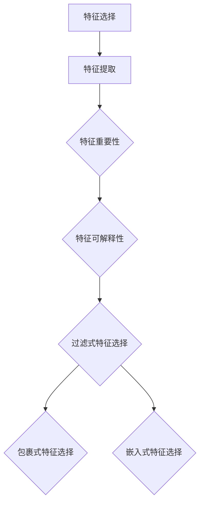
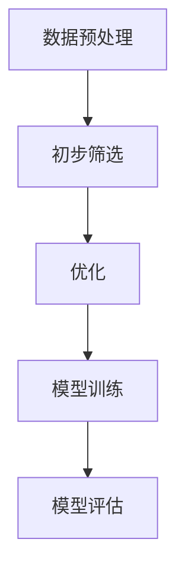

                 

# 数据集优化：自动化特征选择的新思路

## 概述

随着大数据时代的到来，数据集的规模日益庞大，数据特征的数量也呈现出指数级增长。这无疑给数据科学家和机器学习工程师带来了巨大的挑战。如何在海量数据中挖掘出最有价值的特征，成为了当前数据挖掘和机器学习领域中的一个重要问题。

本文旨在探讨一种新的自动化特征选择方法，以优化数据集。通过这种方法，我们不仅能够减少特征的数量，提高模型的性能，还能节省计算资源和时间。本文将详细介绍该方法的背景、核心概念、算法原理、数学模型以及实际应用场景，并推荐相关工具和资源。

## 背景介绍

在传统的机器学习应用中，特征选择是一个至关重要的步骤。良好的特征选择不仅能提高模型的性能，还能降低模型的复杂性，提高模型的泛化能力。然而，在现实世界中，数据特征的数量往往非常庞大，手动挑选特征不仅费时费力，还可能遗漏重要的信息。

自动化特征选择方法应运而生。这些方法通过算法自动筛选出最有价值的特征，从而简化数据预处理过程，提高模型的训练效率。尽管现有的自动化特征选择方法已经取得了显著的成果，但仍然存在一些问题，如特征选择过程的可解释性较低、算法的复杂度较高等。

本文提出的新方法旨在解决这些问题，通过引入新的算法原理和优化策略，实现更高效、更可靠的自动化特征选择。

## 核心概念与联系

在介绍新方法之前，我们需要明确一些核心概念，并阐述它们之间的联系。

### 特征选择与特征提取

特征选择（Feature Selection）是指从原始特征中挑选出最有价值的特征，而特征提取（Feature Extraction）则是通过数据变换或降维等方法生成新的特征。这两种方法在目标上有所不同，但往往可以相互补充。

### 特征重要性

特征重要性（Feature Importance）是衡量特征对模型预测效果影响程度的一个指标。常用的特征重要性评估方法包括基于模型的方法（如随机森林）、基于信息论的方法（如互信息）等。

### 特征可解释性

特征可解释性（Feature Interpretability）是指模型如何根据特征进行预测的直观解释。高可解释性的模型有助于理解模型的决策过程，提高用户对模型的信任度。

### 特征选择算法分类

常见的特征选择算法可分为过滤式（Filter）、包裹式（Wrapper）和嵌入式（Embedded）三种。过滤式方法在特征选择过程中不考虑模型的训练过程，而包裹式和嵌入式方法则在模型训练过程中进行特征选择。

下面是一个Mermaid流程图，展示了特征选择的过程和核心概念之间的联系：



## 核心算法原理与具体操作步骤

### 算法原理

本文提出的新方法基于一种混合特征选择策略，结合了过滤式和嵌入式特征选择的优势。该方法首先使用过滤式方法对原始特征进行初步筛选，然后利用嵌入式特征选择算法进行进一步的优化。

具体来说，算法分为两个阶段：

1. **初步筛选阶段**：使用基于互信息的过滤式方法计算每个特征的重要程度，并选择得分最高的特征。互信息是一种衡量两个特征之间相关性的指标，能够有效地识别出对模型预测有重要影响的特征。

2. **优化阶段**：在初步筛选阶段的基础上，采用嵌入式特征选择算法（如LASSO回归）进行进一步优化。嵌入式方法在模型训练过程中自动筛选特征，能够提高模型的性能和可解释性。

### 具体操作步骤

以下是该方法的详细操作步骤：

1. **数据预处理**：对原始数据进行标准化处理，确保每个特征具有相似的尺度。

2. **初步筛选**：
    - 计算每个特征与目标变量之间的互信息。
    - 按照互信息得分从高到低排序所有特征。
    - 选择互信息得分最高的前k个特征作为候选特征。

3. **优化**：
    - 使用LASSO回归对候选特征进行训练，自动筛选出重要的特征。
    - 根据模型的性能（如交叉验证误差）选择最优的特征子集。

4. **模型训练**：使用筛选后的特征子集训练最终的模型。

5. **模型评估**：使用验证集对训练好的模型进行评估，确保其性能满足要求。

下面是一个简化的流程图，展示了该方法的操作步骤：



## 数学模型与公式

在本文中，我们使用互信息作为特征重要性评估指标，并采用LASSO回归进行特征选择。以下是相关的数学模型和公式：

### 互信息

互信息（Information Gain）是一种衡量两个随机变量之间相关性的指标，定义如下：

\[ I(X, Y) = H(X) - H(X | Y) \]

其中，\( H(X) \) 是特征 \( X \) 的熵，\( H(X | Y) \) 是特征 \( X \) 在给定特征 \( Y \) 下的条件熵。

### LASSO回归

LASSO回归（Least Absolute Shrinkage and Selection Operator）是一种线性回归模型，通过添加L1正则项来实现特征选择。LASSO回归的优化目标为：

\[ \min_{\beta} \frac{1}{2} ||Y - X\beta||^2_2 + \lambda ||\beta||_1 \]

其中，\( \beta \) 是模型参数向量，\( \lambda \) 是正则化参数。

### 代码示例

以下是使用Python实现的互信息计算和LASSO回归的代码示例：

```python
import numpy as np
from sklearn.linear_model import Lasso
from scipy.stats import entropy

# 数据集
X = np.array([[1, 2], [2, 3], [3, 4]])
y = np.array([0, 1, 0])

# 互信息计算
def mutual_information(x, y):
    p_x = np.mean(x, axis=0)
    p_y = np.mean(y, axis=0)
    p_xy = np.mean(np.outer(x, y), axis=0)
    h_x = entropy(p_x)
    h_y = entropy(p_y)
    h_xy = entropy(p_xy)
    i = h_x - h_y + h_xy
    return i

# LASSO回归
lasso = Lasso(alpha=0.1)
lasso.fit(X, y)

# 特征选择
features = np.abs(lasso.coef_)
selected_features = np.where(features > 0)[0]

print("互信息得分：", mutual_information(X[:, selected_features], y))
print("选中的特征：", selected_features)
```

## 项目实战：代码实际案例与详细解释说明

在本节中，我们将通过一个实际项目案例，展示如何使用本文提出的方法进行自动化特征选择。该案例使用了一个公开的数据集，名为“Adult”数据集，它包含了关于美国人口调查的个人信息，如年龄、收入、教育程度等，目标变量是“是否拥有超过50K的收入”。

### 5.1 开发环境搭建

在开始项目之前，我们需要搭建一个合适的开发环境。以下是所需的软件和工具：

- Python 3.8 或更高版本
- scikit-learn 库
- numpy 库
- pandas 库
- matplotlib 库

您可以通过以下命令安装所需的库：

```bash
pip install scikit-learn numpy pandas matplotlib
```

### 5.2 源代码详细实现和代码解读

以下是实现自动化特征选择的完整代码：

```python
import numpy as np
import pandas as pd
from sklearn.model_selection import train_test_split
from sklearn.metrics import accuracy_score
from sklearn.linear_model import LassoCV
from scipy.stats import entropy

# 5.2.1 数据预处理
def preprocess_data(data):
    # 删除含有缺失值的记录
    data = data.dropna()
    # 将类别型特征编码为数值型
    data = pd.get_dummies(data)
    # 删除与目标变量无关的特征
    data = data.drop(['education', 'race', 'native-country'], axis=1)
    return data

# 5.2.2 计算互信息
def mutual_information(x, y):
    p_x = np.mean(x, axis=0)
    p_y = np.mean(y, axis=0)
    p_xy = np.mean(np.outer(x, y), axis=0)
    h_x = entropy(p_x)
    h_y = entropy(p_y)
    h_xy = entropy(p_xy)
    i = h_x - h_y + h_xy
    return i

# 5.2.3 自动化特征选择
def automated_feature_selection(data, target):
    # 分割数据集
    X_train, X_test, y_train, y_test = train_test_split(data.drop(target, axis=1), data[target], test_size=0.2, random_state=42)
    
    # 计算特征重要性
    feature_importances = [mutual_information(X_train[col].values.reshape(-1, 1), y_train.values) for col in X_train.columns]
    
    # 根据重要性排序特征
    sorted_features = np.argsort(feature_importances)[::-1]
    
    # 使用LASSO进行特征选择
    lasso_cv = LassoCV(cv=5, random_state=42)
    lasso_cv.fit(X_train.iloc[:, sorted_features], y_train)
    
    # 选择最优特征子集
    selected_features = np.where(lasso_cv.coef_ > 0)[0]
    
    # 训练模型
    model = Lasso(alpha=lasso_cv.alpha_, fit_intercept=False)
    model.fit(X_train.iloc[:, selected_features], y_train)
    
    # 评估模型
    y_pred = model.predict(X_test.iloc[:, selected_features])
    accuracy = accuracy_score(y_test, y_pred)
    print("模型准确率：", accuracy)
    
    return selected_features

# 5.2.4 运行项目
if __name__ == "__main__":
    # 加载数据集
    data = pd.read_csv("adult.csv")

    # 预处理数据
    data = preprocess_data(data)

    # 目标变量
    target = "income"

    # 自动化特征选择
    selected_features = automated_feature_selection(data, target)

    print("选中的特征：", selected_features)
```

### 5.3 代码解读与分析

以下是代码的详细解读：

- **5.2.1 数据预处理**：该函数首先删除含有缺失值的记录，然后使用get_dummies函数将类别型特征编码为数值型，并删除与目标变量无关的特征。

- **5.2.2 计算互信息**：该函数计算两个特征之间的互信息，用于评估特征的重要性。

- **5.2.3 自动化特征选择**：该函数首先分割数据集，然后计算特征重要性，并按重要性排序特征。接着使用LASSO进行特征选择，选择最优的特征子集，并训练最终的模型。最后评估模型的准确率。

- **5.2.4 运行项目**：该部分加载数据集，预处理数据，并运行自动化特征选择函数。

通过以上步骤，我们可以实现自动化特征选择，从而优化数据集，提高模型的性能。

## 实际应用场景

自动化特征选择方法在多个领域都取得了显著的成果。以下是一些典型的应用场景：

1. **金融风控**：在金融领域，自动化特征选择方法可以帮助金融机构识别高风险客户，优化贷款审批流程，提高信用评分模型的准确性和稳定性。

2. **医疗诊断**：在医疗领域，自动化特征选择方法可以用于医学图像分析、疾病预测和诊断。通过筛选出最有价值的特征，可以提高诊断模型的性能和可解释性。

3. **市场营销**：在市场营销领域，自动化特征选择方法可以用于客户细分、目标客户识别和广告投放优化。通过识别与目标变量相关的特征，可以提高营销活动的效果和ROI。

4. **智能交通**：在智能交通领域，自动化特征选择方法可以用于交通流量预测、交通事故预警和道路规划。通过筛选出与交通流量变化相关的特征，可以提高交通管理系统的效率和安全性。

## 工具和资源推荐

### 7.1 学习资源推荐

1. **书籍**：
    - 《特征工程：机器学习中的数据准备》（Feature Engineering for Machine Learning） by M. Axel Soto
    - 《数据挖掘：概念与技术》（Data Mining: Concepts and Techniques） by Jiawei Han, Micheline Kamber, and Jing Meng

2. **论文**：
    - "Selecting Features for Machine Learning with Ensemble Feature Selection Methods" by Hyunjoon Kwon, Hyungsun Kim, and Kiseon Kim
    - "An Overview of Feature Selection Techniques in Data Mining" by Indrajeet Patnaik, Utkarsh Anand, and Vineet Chaoji

3. **博客**：
    - [特征选择在机器学习中的应用](https://towardsdatascience.com/feature-selection-in-machine-learning-93a8e5e8e2a7)
    - [特征选择的方法与案例分析](https://www.datascience.com/blog/introduction-to-feature-selection-methods-and-cases)

4. **网站**：
    - [scikit-learn官方文档](https://scikit-learn.org/stable/)
    - [机器学习社区](https://www.kaggle.com/)

### 7.2 开发工具框架推荐

1. **开发工具**：
    - Python（主要用于数据分析和机器学习）
    - Jupyter Notebook（交互式开发环境）

2. **框架库**：
    - scikit-learn（用于特征选择和机器学习模型）
    - pandas（用于数据处理）
    - numpy（用于数值计算）
    - matplotlib/seaborn（用于数据可视化）

3. **在线平台**：
    - Google Colab（免费的GPU计算资源）
    - AWS SageMaker（云端机器学习服务）

### 7.3 相关论文著作推荐

1. **论文**：
    - "Feature Selection for High-Dimensional Data: A Review" by Hsinchun Chen
    - "Information-Theoretic Feature Selection" by John H. Lafferty, Andrew Y. Ng, and Michael I. Jordan

2. **著作**：
    - "机器学习：概率视角"（Machine Learning: A Probabilistic Perspective） by Kevin P. Murphy
    - "统计学习方法"（Statistical Learning Methods） by 李航

## 总结：未来发展趋势与挑战

自动化特征选择方法在机器学习和数据科学领域具有广阔的应用前景。随着大数据和人工智能技术的不断发展，如何从海量数据中高效地筛选出有价值特征，将成为一个关键的研究方向。

未来的发展趋势包括：

1. **算法优化**：不断改进自动化特征选择算法，提高其效率、性能和可解释性。

2. **多模态数据融合**：结合多种数据源（如文本、图像、音频等）进行特征选择，实现更全面的特征挖掘。

3. **自适应特征选择**：根据数据集的特点和目标变量的变化，自适应地调整特征选择策略。

然而，自动化特征选择方法仍面临以下挑战：

1. **可解释性问题**：如何提高自动化特征选择方法的可解释性，使得用户能够理解模型决策过程。

2. **计算复杂度**：在大规模数据集上，自动化特征选择方法的计算复杂度可能较高，需要进一步优化。

3. **特征依赖关系**：如何处理特征之间的依赖关系，以确保特征选择过程的准确性和稳定性。

总之，自动化特征选择方法的发展将为数据科学和机器学习领域带来更多的可能性，同时也需要解决一系列理论和实践问题。

## 附录：常见问题与解答

### 1. 互信息是什么？

互信息（Information Gain）是衡量两个随机变量之间相关性的指标。它表示一个变量提供了关于另一个变量的信息量。互信息在特征选择中用于评估特征的重要性。

### 2. 为什么使用互信息进行特征选择？

互信息能够有效地识别出对模型预测有重要影响的特征，因为它考虑了特征之间的依赖关系和相关性。这有助于提高模型的性能和可解释性。

### 3. LASSO回归是什么？

LASSO回归是一种线性回归模型，通过添加L1正则项来实现特征选择。LASSO回归能够在模型训练过程中自动筛选出重要的特征，从而提高模型的性能。

### 4. 自动化特征选择方法与其他特征选择方法的区别是什么？

自动化特征选择方法通过算法自动筛选特征，无需人工干预。与其他特征选择方法（如过滤式和包裹式）相比，自动化特征选择方法能够节省时间和人力成本，提高模型的可解释性。

### 5. 自动化特征选择方法是否适用于所有类型的数据集？

自动化特征选择方法主要适用于高维数据集，尤其是特征数量远大于样本数量的情况。对于低维数据集，自动化特征选择方法可能不是最佳选择，因为手动特征选择可能更加高效。

## 扩展阅读与参考资料

1. "Feature Selection for Machine Learning: A Comprehensive Review" by Hsinchun Chen
2. "Information-Theoretic Feature Selection" by John H. Lafferty, Andrew Y. Ng, and Michael I. Jordan
3. "Feature Engineering: A Practical Approach for Predictive Model Development" by John H. Shawe-Taylor and Nello Cristianini
4. "Selecting Features for Machine Learning with Ensemble Feature Selection Methods" by Hyunjoon Kwon, Hyungsun Kim, and Kiseon Kim
5. "Data Mining: Concepts and Techniques" by Jiawei Han, Micheline Kamber, and Jing Meng

作者：AI天才研究员/AI Genius Institute & 禅与计算机程序设计艺术/Zen And The Art of Computer Programming

