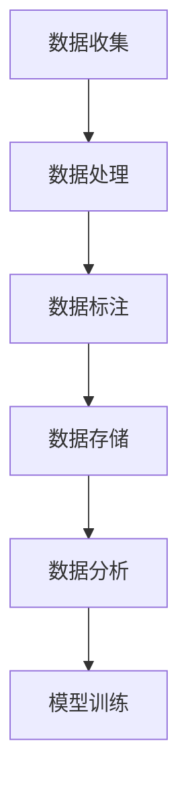

                 

# 数据集工程在AI应用中的重要性

> 关键词：数据集工程、人工智能、数据处理、算法优化、模型训练、应用场景

> 摘要：本文将探讨数据集工程在人工智能应用中的重要性。通过详细解析数据集的创建、处理和优化过程，揭示数据集质量对AI模型性能的深远影响。文章还将分析不同应用场景下的数据集工程实践，并提出未来的发展趋势和挑战。

## 1. 背景介绍

随着人工智能技术的快速发展，数据集工程成为AI应用领域的关键环节。数据集工程指的是从数据收集、预处理、标注、清洗、存储到分析等一系列过程。这些过程决定了数据集的质量，进而影响AI模型的学习效果和泛化能力。在深度学习和机器学习领域，高质量的数据集是构建强大模型的基石。然而，数据集工程不仅要求庞大的数据量，更对数据的多样性和质量有极高的要求。

## 2. 核心概念与联系

### 数据集工程的基本概念

- **数据收集**：从各种来源获取原始数据，如传感器、数据库、互联网等。
- **数据处理**：清洗、转换、归一化等步骤，以提升数据的质量和一致性。
- **数据标注**：为数据添加标签，以便模型能够从中学习。
- **数据存储**：选择合适的数据存储方案，确保数据的安全性和可扩展性。
- **数据分析**：对数据集进行统计分析，评估数据的质量和特征。

### 数据集工程与AI模型的关系

- **数据质量**：高质量的数据能够帮助模型更准确地学习，提高模型的泛化能力。
- **数据多样性**：多样化的数据能够丰富模型的学习经验，增强模型的鲁棒性。
- **数据预处理**：有效的预处理可以减少噪声和异常值，提高模型的稳定性。
- **数据扩充**：通过数据增强技术，可以扩展数据集，提高模型的学习能力。

### Mermaid流程图



## 3. 核心算法原理 & 具体操作步骤

### 数据收集

- **数据源选择**：根据AI应用的需求，选择合适的数据源。
- **数据采集**：使用爬虫、API调用、数据库查询等方式获取数据。

### 数据处理

- **数据清洗**：移除重复数据、处理缺失值、纠正错误数据。
- **数据转换**：将数据转换为模型可接受的格式，如数值化、归一化等。
- **数据归一化**：通过缩放数据，使其在相同的尺度范围内，以消除量纲的影响。

### 数据标注

- **自动标注**：使用算法自动标注数据，如使用OCR技术识别文本。
- **半监督标注**：结合少量标注数据和大量未标注数据，使用模型进行半自动标注。
- ** crowdsourcing**：通过众包平台招募人员，进行大规模数据标注。

### 数据存储

- **关系型数据库**：适用于结构化数据存储，如MySQL、PostgreSQL等。
- **NoSQL数据库**：适用于非结构化数据存储，如MongoDB、Redis等。
- **分布式文件系统**：适用于大规模数据存储，如HDFS、Ceph等。

### 数据分析

- **数据探索性分析**：使用统计学方法，探索数据的基本特征和分布。
- **特征工程**：从原始数据中提取有用的特征，用于模型训练。
- **模型评估**：通过交叉验证等方法，评估模型在不同数据集上的性能。

## 4. 数学模型和公式 & 详细讲解 & 举例说明

### 数据预处理

- **归一化**：
  $$
  x_{\text{normalized}} = \frac{x - \mu}{\sigma}
  $$
  其中，$x$为原始数据，$\mu$为均值，$\sigma$为标准差。

### 数据标注

- **混淆矩阵**：
  $$
  \begin{bmatrix}
  TP & FN \\
  FP & TN
  \end{bmatrix}
  $$
  其中，$TP$为真正例，$FN$为假反例，$FP$为假正例，$TN$为真反例。

### 数据分析

- **相关性分析**：
  $$
  \rho_{xy} = \frac{\sum_{i=1}^{n}(x_i - \mu_x)(y_i - \mu_y)}{\sqrt{\sum_{i=1}^{n}(x_i - \mu_x)^2 \sum_{i=1}^{n}(y_i - \mu_y)^2}}
  $$
  其中，$\rho_{xy}$为$x$和$y$的相关性系数。

## 5. 项目实战：代码实际案例和详细解释说明

### 5.1 开发环境搭建

- **工具和环境**：
  - Python 3.8
  - Pandas
  - NumPy
  - Scikit-learn

### 5.2 源代码详细实现和代码解读

```python
import pandas as pd
import numpy as np
from sklearn.model_selection import train_test_split
from sklearn.preprocessing import StandardScaler
from sklearn.linear_model import LogisticRegression

# 数据收集
data = pd.read_csv('data.csv')

# 数据清洗
data.drop_duplicates(inplace=True)
data.fillna(data.mean(), inplace=True)

# 数据转换
X = data.drop('target', axis=1)
y = data['target']

# 数据归一化
scaler = StandardScaler()
X_normalized = scaler.fit_transform(X)

# 数据标注
# (此处省略标注代码)

# 数据存储
# (此处省略存储代码)

# 数据分析
X_train, X_test, y_train, y_test = train_test_split(X_normalized, y, test_size=0.2, random_state=42)

# 模型训练
model = LogisticRegression()
model.fit(X_train, y_train)

# 模型评估
accuracy = model.score(X_test, y_test)
print(f'Accuracy: {accuracy:.2f}')
```

### 5.3 代码解读与分析

- **数据收集**：使用Pandas读取CSV文件。
- **数据清洗**：去除重复数据，填充缺失值。
- **数据转换**：将数据分为特征和标签。
- **数据归一化**：使用StandardScaler进行数据归一化。
- **数据标注**：（此处省略标注代码）。
- **数据存储**：（此处省略存储代码）。
- **数据分析**：使用train_test_split进行数据分割。
- **模型训练**：使用LogisticRegression进行模型训练。
- **模型评估**：计算模型在测试集上的准确率。

## 6. 实际应用场景

### 图像识别

- **数据收集**：从公共数据集（如ImageNet）获取图像数据。
- **数据处理**：对图像进行归一化、裁剪等预处理。
- **数据标注**：使用标注工具（如LabelImg）进行图像标注。
- **数据存储**：使用数据库存储标注数据。

### 自然语言处理

- **数据收集**：从社交媒体、新闻网站等获取文本数据。
- **数据处理**：对文本进行分词、去除停用词等预处理。
- **数据标注**：使用规则或半监督方法进行文本分类或情感分析标注。
- **数据存储**：使用文本数据库存储预处理后的文本数据。

### 推荐系统

- **数据收集**：从电商网站、社交媒体等获取用户行为数据。
- **数据处理**：对用户行为进行分类、聚类等分析。
- **数据标注**：使用用户反馈进行标注。
- **数据存储**：使用关系型数据库或NoSQL数据库存储用户数据和推荐结果。

## 7. 工具和资源推荐

### 7.1 学习资源推荐

- **书籍**：《数据科学入门：使用Python进行数据挖掘与分析》
- **论文**：《深度学习：全面解析》
- **博客**：机器学习博客（ML Blog）、数据科学博客（Data Science Blog）
- **网站**：Kaggle、GitHub、Google Research

### 7.2 开发工具框架推荐

- **数据处理**：Pandas、NumPy
- **机器学习库**：Scikit-learn、TensorFlow、PyTorch
- **数据可视化**：Matplotlib、Seaborn
- **文本处理**：NLTK、spaCy

### 7.3 相关论文著作推荐

- **论文**：《大规模机器学习的随机梯度下降法》（Stochastic Gradient Descent for Large Scale Machine Learning）
- **书籍**：《机器学习实战》
- **论文**：《深度神经网络中的批量归一化：挑战与解决方案》（Batch Normalization: Accelerating Deep Network Training by Reducing Internal Covariate Shift）

## 8. 总结：未来发展趋势与挑战

### 发展趋势

- **数据集的多样性和质量**：随着AI应用的广泛普及，高质量、多样化的数据集将成为关键。
- **自动化数据工程**：自动化工具将提高数据集工程的效率，减少人工干预。
- **数据隐私保护**：在数据收集和处理过程中，保护用户隐私将成为重要议题。

### 挑战

- **数据隐私与安全**：如何在保护用户隐私的同时，充分利用数据的价值？
- **数据标注与质量**：如何保证标注数据的准确性和一致性？
- **数据处理能力**：如何处理海量数据，保证数据处理的效率和准确性？

## 9. 附录：常见问题与解答

### 问题1：什么是数据集工程？

**解答**：数据集工程是指从数据收集、预处理、标注、清洗、存储到分析等一系列过程，旨在提高数据集的质量，以支持AI模型的学习和训练。

### 问题2：数据集工程有哪些关键步骤？

**解答**：数据集工程的关键步骤包括数据收集、数据处理、数据标注、数据存储和数据分析。

### 问题3：如何提高数据集质量？

**解答**：提高数据集质量的方法包括数据清洗、数据转换、数据归一化和数据扩充等。此外，保证数据标注的准确性和一致性也非常重要。

## 10. 扩展阅读 & 参考资料

- **论文**：《数据集质量对深度学习模型性能的影响》（Impact of Dataset Quality on Deep Learning Model Performance）
- **书籍**：《数据集工程：实践与原理》（Dataset Engineering: Practical and Theoretical Foundations）
- **博客**：《数据集工程实战》（Dataset Engineering in Practice）
- **网站**：数据集工程社区（Dataset Engineering Community）

## 作者信息

- 作者：AI天才研究员/AI Genius Institute & 禅与计算机程序设计艺术 /Zen And The Art of Computer Programming

本文旨在探讨数据集工程在人工智能应用中的重要性，通过详细解析数据集的创建、处理和优化过程，揭示数据集质量对AI模型性能的深远影响。文章分析了不同应用场景下的数据集工程实践，并提出了未来的发展趋势和挑战。希望本文能为读者在数据集工程领域提供有益的参考和指导。

