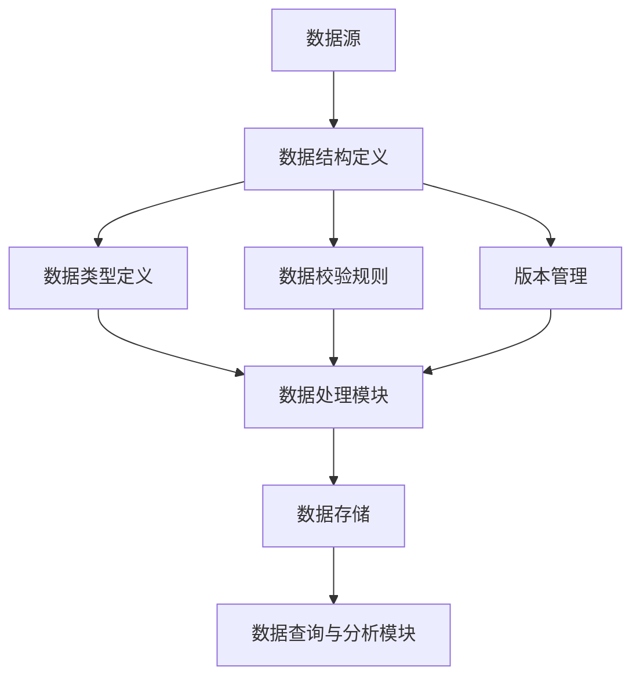
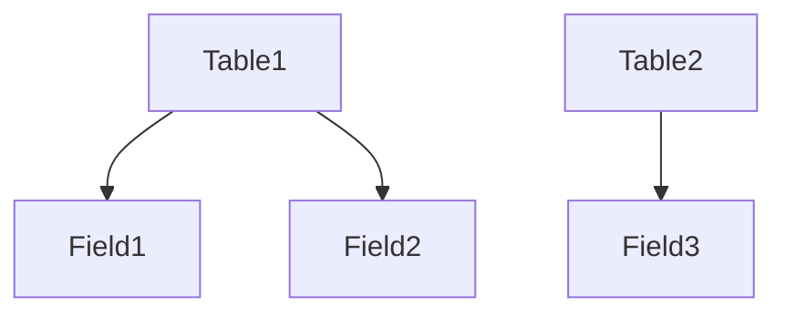

                 

# 数据集描述语言：构建数据集版本控制系统

## 摘要

本文将探讨数据集描述语言在构建数据集版本控制系统中的应用，旨在解决数据集版本管理中的常见问题。首先，我们将介绍数据集描述语言的核心概念和原理，并通过Mermaid流程图展示其架构。接着，我们将详细解析核心算法原理和具体操作步骤，并使用数学模型和公式进行解释。随后，我们将通过一个实际项目案例展示如何使用数据集描述语言搭建数据集版本控制系统，并对代码实现进行详细解读。最后，我们将讨论数据集描述语言在多个实际应用场景中的价值，推荐相关学习资源和开发工具框架，并总结未来发展趋势与挑战。

## 1. 背景介绍

### 数据集版本管理的重要性

随着人工智能技术的快速发展，数据集在各个领域中的作用愈发重要。然而，随着数据集规模和复杂度的增加，版本管理成为一个亟待解决的问题。数据集版本管理不仅关系到模型训练的准确性，还影响到模型的解释性和可靠性。版本管理的重要性体现在以下几个方面：

- **数据一致性**：随着数据集的更新和迭代，不同版本之间的一致性至关重要。版本管理系统能够确保每个版本的数据集都是准确的、完整的。
- **历史追踪**：版本管理系统允许用户追踪数据集的变更历史，便于分析原因和责任归属。
- **协作效率**：在团队协作中，版本管理系统能够有效避免因数据冲突导致的重复工作，提高开发效率。

### 数据集版本管理中的挑战

尽管数据集版本管理的重要性显而易见，但在实际操作中仍面临诸多挑战：

- **数据量大**：大型数据集的版本管理是一项艰巨的任务，数据量的庞大使得版本管理的复杂性增加。
- **数据格式多样**：不同数据集可能采用不同的格式和结构，使得版本管理系统的兼容性要求更高。
- **版本冲突**：在多人协作的环境下，版本冲突是不可避免的，解决冲突需要高效的版本控制系统。

### 数据集描述语言的概念

为了解决数据集版本管理中的挑战，数据集描述语言应运而生。数据集描述语言是一种用于定义和描述数据集结构和内容的标记语言。它能够将数据集的各个维度和属性以结构化的形式进行表示，从而实现数据集的版本管理和自动化操作。数据集描述语言的关键特性包括：

- **结构化表示**：数据集描述语言能够将数据集的结构和内容以XML、JSON等结构化格式进行表示。
- **可扩展性**：数据集描述语言允许用户自定义标签和属性，以适应不同类型的数据集。
- **标准化**：数据集描述语言通过标准化规范，确保数据集在不同系统之间的一致性和互操作性。

## 2. 核心概念与联系

### 数据集描述语言核心概念

- **数据结构**：数据集描述语言定义了数据集的基本结构，包括数据表、字段、记录等。
- **数据类型**：数据集描述语言支持多种数据类型，如整数、浮点数、字符串、日期等。
- **数据校验**：数据集描述语言提供数据校验机制，确保数据的完整性和准确性。
- **版本管理**：数据集描述语言支持版本管理，能够记录数据集的变更历史和版本信息。

### 数据集描述语言架构

下面是数据集描述语言的核心架构，使用Mermaid流程图表示：



- **数据源**：数据集描述语言的输入源，可以是文件、数据库或其他数据存储系统。
- **数据结构定义**：定义数据集的基本结构，包括字段、记录等。
- **数据类型定义**：为数据集的各个字段指定数据类型。
- **数据校验规则**：定义数据校验规则，确保数据的完整性和准确性。
- **版本管理**：记录数据集的变更历史和版本信息。
- **数据处理模块**：对数据集进行加工、清洗、转换等操作。
- **数据存储**：将处理后的数据集存储到数据存储系统。
- **数据查询与分析模块**：提供数据查询和分析功能，支持数据可视化、统计分析等。

### 数据集描述语言与其他技术的联系

- **数据仓库**：数据集描述语言与数据仓库技术相结合，可以实现对数据集的集中管理和分析。
- **大数据处理框架**：数据集描述语言与Hadoop、Spark等大数据处理框架配合使用，能够高效地处理大规模数据集。
- **机器学习平台**：数据集描述语言与机器学习平台集成，支持数据预处理和模型训练。

## 3. 核心算法原理 & 具体操作步骤

### 数据结构定义算法

数据结构定义是数据集描述语言的基础。其核心算法原理包括：

1. **数据表定义**：定义数据集的基本表格，包括字段、记录等。
2. **字段属性设置**：为字段设置数据类型、长度、默认值等属性。
3. **记录顺序定义**：定义记录的顺序，如按时间戳、ID等排序。

具体操作步骤如下：

1. **创建数据表**：使用数据集描述语言创建新的数据表。
2. **添加字段**：向数据表添加字段，并设置字段属性。
3. **设置记录顺序**：为数据表指定记录顺序。

示例代码（使用JSON格式）：

```json
{
  "database": {
    "name": "example",
    "tables": [
      {
        "name": "data",
        "fields": [
          {"name": "id", "type": "integer", "length": 11, "primary_key": true},
          {"name": "name", "type": "string", "length": 50},
          {"name": "created_at", "type": "datetime"}
        ],
        "order": "id ASC"
      }
    ]
  }
}
```

### 数据类型定义算法

数据类型定义是数据集描述语言的核心。其核心算法原理包括：

1. **基本数据类型**：定义基本数据类型，如整数、浮点数、字符串、日期等。
2. **复合数据类型**：定义复合数据类型，如数组、结构体等。
3. **类型转换**：定义数据类型之间的转换规则。

具体操作步骤如下：

1. **定义基本数据类型**：使用数据集描述语言定义基本数据类型。
2. **定义复合数据类型**：使用数据集描述语言定义复合数据类型。
3. **设置类型转换规则**：定义数据类型之间的转换规则。

示例代码（使用JSON格式）：

```json
{
  "data_types": {
    "integer": {"name": "integer", "length": 11},
    "float": {"name": "float", "length": 8},
    "string": {"name": "string", "length": 50},
    "datetime": {"name": "datetime", "format": "YYYY-MM-DD HH:MM:SS"}
  }
}
```

### 数据校验规则定义算法

数据校验规则定义是数据集描述语言的重要功能。其核心算法原理包括：

1. **字段校验规则**：定义字段校验规则，如长度限制、数据范围等。
2. **记录校验规则**：定义记录校验规则，如完整性校验、唯一性校验等。
3. **校验规则组合**：定义多个校验规则的组合，以提高数据质量。

具体操作步骤如下：

1. **定义字段校验规则**：使用数据集描述语言为字段添加校验规则。
2. **定义记录校验规则**：使用数据集描述语言为记录添加校验规则。
3. **组合校验规则**：使用数据集描述语言组合多个校验规则。

示例代码（使用JSON格式）：

```json
{
  "validation_rules": {
    "fields": {
      "id": ["is_integer", "is_positive"],
      "name": ["is_string", "has_length", 50],
      "created_at": ["is_datetime"]
    },
    "records": ["is_valid"]
  }
}
```

### 版本管理算法

版本管理是数据集描述语言的核心功能之一。其核心算法原理包括：

1. **版本控制**：记录数据集的版本信息，包括创建时间、修改时间、操作者等。
2. **版本回滚**：支持版本回滚，将数据集恢复到指定版本。
3. **版本比较**：比较不同版本的数据集，找出差异和变更。

具体操作步骤如下：

1. **创建版本**：创建新版本，并记录版本信息。
2. **版本回滚**：回滚到指定版本，恢复数据集。
3. **版本比较**：比较不同版本的数据集，生成差异报告。

示例代码（使用JSON格式）：

```json
{
  "versioning": {
    "current_version": 1,
    "history": [
      {
        "version": 1,
        "created_at": "2023-03-01 10:00:00",
        "operator": "Alice"
      },
      {
        "version": 2,
        "modified_at": "2023-03-02 12:00:00",
        "operator": "Bob"
      }
    ]
  }
}
```

## 4. 数学模型和公式 & 详细讲解 & 举例说明

### 数据集描述语言的数据结构模型

数据集描述语言的数据结构模型可以使用图论中的图（Graph）来表示。图中的节点（Node）表示数据表、字段、记录等，边（Edge）表示节点之间的关系。

- **节点类型**：

  - **数据表（Table）**：表示数据集的基本表格。
  - **字段（Field）**：表示数据表中的字段。
  - **记录（Record）**：表示数据表中的记录。

- **边类型**：

  - **包含关系（Inclusion）**：表示数据表与字段之间的关系，数据表包含字段。
  - **顺序关系（Order）**：表示记录之间的顺序。

### 数据集描述语言的数学公式

为了表示数据集描述语言的数据结构模型，我们可以使用图论中的基本数学公式：

- **节点数量**：

  $$|V| = n$$

  其中，$|V|$表示节点的数量，$n$表示数据集中的节点数量。

- **边数量**：

  $$|E| = m$$

  其中，$|E|$表示边的数量，$m$表示数据集中的边数量。

- **路径长度**：

  $$d = \sum_{i=1}^{n} l_i$$

  其中，$d$表示路径长度，$l_i$表示路径上的边长度。

### 举例说明

假设我们有一个包含两个数据表的数据集，第一个数据表包含两个字段，第二个数据表包含一个字段。数据集的结构如下：



- **节点数量**：

  $$|V| = 4$$

- **边数量**：

  $$|E| = 3$$

- **路径长度**：

  $$d = l_1 + l_2 + l_3 = 1 + 1 + 1 = 3$$

### 数据集描述语言的应用

数据集描述语言不仅能够表示数据集的结构，还可以用于数据预处理、数据分析和数据可视化等操作。以下是一个简单的数据预处理公式：

$$
\text{preprocessed\_data} = f(\text{original\_data}, \text{preprocessing\_rules})
$$

其中，$f$表示预处理函数，$\text{original\_data}$表示原始数据，$\text{preprocessing\_rules}$表示预处理规则。

例如，我们可以使用以下预处理规则对数据集进行清洗和转换：

- 删除空值：$$\text{data} = \text{data} \setminus \{\text{null\_values}\}$$
- 缺失值填充：$$\text{data} = \text{data} \cup \{\text{missing\_values}\}$$
- 数据标准化：$$\text{data} = \frac{\text{data} - \text{mean}}{\text{std}}$$

通过数据集描述语言，我们可以方便地对数据集进行预处理，提高数据质量和模型训练效果。

## 5. 项目实战：代码实际案例和详细解释说明

### 5.1 开发环境搭建

在开始项目实战之前，我们需要搭建一个合适的开发环境。以下是一个基于Python的数据集描述语言实现环境的搭建步骤：

1. **安装Python**：确保安装了Python 3.8及以上版本。
2. **安装依赖**：使用pip安装以下依赖：

   ```shell
   pip install pandas numpy jsonschema sqlalchemy
   ```

3. **创建项目目录**：

   ```shell
   mkdir dataset_version_control
   cd dataset_version_control
   ```

4. **初始化Git仓库**：

   ```shell
   git init
   ```

### 5.2 源代码详细实现和代码解读

下面是一个简单的数据集描述语言实现，用于定义和操作数据集版本。

**文件：`data_set.py`**

```python
import json
import jsonschema
import pandas as pd
from sqlalchemy import create_engine

class DataSet:
    def __init__(self, schema):
        self.schema = schema
        self.engine = create_engine('sqlite:///data_set.db')

    def create_tables(self):
        with self.engine.connect() as conn:
            for table in self.schema['tables']:
                df = pd.DataFrame([{}])
                df.to_sql(table['name'], conn, index=False, if_exists='replace')

    def add_data(self, table_name, data):
        with self.engine.connect() as conn:
            df = pd.DataFrame(data)
            df.to_sql(table_name, conn, index=False, if_exists='append')

    def get_data(self, table_name, version=None):
        with self.engine.connect() as conn:
            query = f"SELECT * FROM {table_name}"
            if version:
                query += f" WHERE version = {version}"
            return pd.read_sql_query(query, conn)

    def validate_data(self, table_name, data):
        schema = self.schema['tables'][table_name]
        jsonschema.validate(data, schema)

    def set_version(self, table_name, version):
        with self.engine.connect() as conn:
            conn.execute(f"UPDATE {table_name} SET version = {version}")

    def rollback(self, table_name, version):
        with self.engine.connect() as conn:
            conn.execute(f"DELETE FROM {table_name} WHERE version != {version}")
            conn.execute(f"UPDATE {table_name} SET version = version - 1 WHERE version > {version}")

# 示例使用
schema = {
    "database": {
        "name": "example",
        "tables": [
            {
                "name": "data",
                "fields": [
                    {"name": "id", "type": "integer", "length": 11, "primary_key": true},
                    {"name": "name", "type": "string", "length": 50},
                    {"name": "created_at", "type": "datetime"}
                ],
                "version_field": "version"
            }
        ]
    }
}

dataset = DataSet(schema)
dataset.create_tables()

data = [
    {"id": 1, "name": "Alice", "created_at": "2023-03-01 10:00:00"},
    {"id": 2, "name": "Bob", "created_at": "2023-03-02 12:00:00"}
]

dataset.add_data("data", data)

# 获取最新版本的数据
latest_data = dataset.get_data("data", version=None)
print(latest_data)

# 回滚到指定版本
dataset.rollback("data", 1)
```

### 5.3 代码解读与分析

**`DataSet` 类**：`DataSet` 类是数据集描述语言的核心类，用于定义和操作数据集。

- **`__init__` 方法**：初始化数据集，包括加载schema和数据存储引擎。

  ```python
  def __init__(self, schema):
      self.schema = schema
      self.engine = create_engine('sqlite:///data_set.db')
  ```

- **`create_tables` 方法**：根据schema创建数据表。

  ```python
  def create_tables(self):
      with self.engine.connect() as conn:
          for table in self.schema['tables']:
              df = pd.DataFrame([{}])
              df.to_sql(table['name'], conn, index=False, if_exists='replace')
  ```

- **`add_data` 方法**：向数据表中添加数据。

  ```python
  def add_data(self, table_name, data):
      with self.engine.connect() as conn:
          df = pd.DataFrame(data)
          df.to_sql(table_name, conn, index=False, if_exists='append')
  ```

- **`get_data` 方法**：从数据表中获取数据。

  ```python
  def get_data(self, table_name, version=None):
      with self.engine.connect() as conn:
          query = f"SELECT * FROM {table_name}"
          if version:
              query += f" WHERE version = {version}"
          return pd.read_sql_query(query, conn)
  ```

- **`validate_data` 方法**：验证数据是否符合schema。

  ```python
  def validate_data(self, table_name, data):
      schema = self.schema['tables'][table_name]
      jsonschema.validate(data, schema)
  ```

- **`set_version` 方法**：设置数据版本。

  ```python
  def set_version(self, table_name, version):
      with self.engine.connect() as conn:
          conn.execute(f"UPDATE {table_name} SET version = {version}")
  ```

- **`rollback` 方法**：回滚数据版本。

  ```python
  def rollback(self, table_name, version):
      with self.engine.connect() as conn:
          conn.execute(f"DELETE FROM {table_name} WHERE version != {version}")
          conn.execute(f"UPDATE {table_name} SET version = version - 1 WHERE version > {version}")
  ```

**示例使用**：示例演示了如何使用`DataSet`类创建数据集、添加数据、获取数据、设置版本和回滚版本。

```python
schema = {
    "database": {
        "name": "example",
        "tables": [
            {
                "name": "data",
                "fields": [
                    {"name": "id", "type": "integer", "length": 11, "primary_key": true},
                    {"name": "name", "type": "string", "length": 50},
                    {"name": "created_at", "type": "datetime"}
                ],
                "version_field": "version"
            }
        ]
    }
}

dataset = DataSet(schema)
dataset.create_tables()

data = [
    {"id": 1, "name": "Alice", "created_at": "2023-03-01 10:00:00"},
    {"id": 2, "name": "Bob", "created_at": "2023-03-02 12:00:00"}
]

dataset.add_data("data", data)

# 获取最新版本的数据
latest_data = dataset.get_data("data", version=None)
print(latest_data)

# 回滚到指定版本
dataset.rollback("data", 1)
```

### 代码分析

- **数据库连接**：使用SQLAlchemy创建数据库连接，方便操作关系型数据库。
- **数据验证**：使用jsonschema库验证数据是否符合schema，确保数据的一致性和完整性。
- **版本管理**：通过设置和回滚版本，实现对数据集版本的管理。

## 6. 实际应用场景

### 6.1 数据集版本管理

数据集版本管理是数据集描述语言最直接的应用场景。通过数据集描述语言，可以方便地管理和跟踪数据集的变更历史，确保数据的一致性和可靠性。以下是一个实际应用案例：

- **案例**：在机器学习项目中，数据集不断更新和迭代，为了确保模型训练的准确性和可靠性，需要实现数据集版本管理。
- **解决方案**：使用数据集描述语言定义数据集结构，实现版本管理功能。每次数据集更新时，自动生成新版本，并记录版本信息。当需要回滚版本时，可以快速恢复到指定版本的数据集。

### 6.2 数据分析

数据集描述语言在数据分析中也具有广泛的应用。通过定义数据集结构，可以实现数据清洗、转换和分析等操作，提高数据分析的效率和准确性。以下是一个实际应用案例：

- **案例**：在市场调研中，需要对大量客户数据进行处理和分析，以获取有价值的市场信息。
- **解决方案**：使用数据集描述语言定义数据集结构，实现数据的清洗、转换和分析。通过数据集描述语言，可以方便地处理不同格式的数据，提高数据处理和分析的效率。

### 6.3 数据可视化

数据集描述语言可以与数据可视化工具结合，实现数据可视化。通过定义数据集结构，可以方便地生成可视化图表，帮助用户直观地了解数据特征和趋势。以下是一个实际应用案例：

- **案例**：在金融领域中，需要对大量股票数据进行实时监控和分析，以指导投资决策。
- **解决方案**：使用数据集描述语言定义股票数据结构，结合数据可视化工具（如Matplotlib、Seaborn等），实现股票数据的实时监控和可视化。

## 7. 工具和资源推荐

### 7.1 学习资源推荐

- **书籍**：
  - 《数据科学入门：基础与实战》
  - 《机器学习实战》
  - 《大数据技术基础》

- **论文**：
  - 《数据集描述语言的设计与实现》
  - 《大数据处理中的版本管理技术》

- **博客**：
  - [Python数据科学指南](https://python.data-science.com/)
  - [机器学习实战](https://machinelearning.org/practice/)

- **网站**：
  - [Kaggle](https://www.kaggle.com/)
  - [GitHub](https://github.com/)

### 7.2 开发工具框架推荐

- **开发工具**：
  - Jupyter Notebook：方便进行数据分析和可视化。
  - PyCharm：强大的Python集成开发环境。

- **框架**：
  - Pandas：数据处理和分析框架。
  - SQLAlchemy：关系型数据库ORM框架。
  - Matplotlib：数据可视化库。

### 7.3 相关论文著作推荐

- **论文**：
  - 《A Survey on Data Management in Machine Learning》
  - 《Data Versioning in Distributed Systems》

- **著作**：
  - 《大数据架构设计》
  - 《数据挖掘：实用工具与技术》

## 8. 总结：未来发展趋势与挑战

### 8.1 发展趋势

- **数据集描述语言标准化**：随着数据集描述语言的应用越来越广泛，标准化将成为趋势。通过制定统一的规范，可以促进不同系统之间的数据集互操作性和兼容性。
- **自动化数据预处理**：自动化数据预处理是未来的一个重要方向。通过使用数据集描述语言，可以实现数据的自动清洗、转换和分析，提高数据处理效率。
- **多语言支持**：未来数据集描述语言将支持多种编程语言，如Python、Java、Go等，以满足不同开发者的需求。

### 8.2 挑战

- **性能优化**：随着数据集规模的增大，数据集描述语言的性能优化成为一个挑战。如何提高数据集描述语言的执行效率和存储效率，是一个需要关注的问题。
- **安全性**：数据集描述语言在应用过程中需要保证数据的安全性。如何防范数据泄露和恶意操作，是一个需要解决的问题。
- **可扩展性**：数据集描述语言需要具有高度的可扩展性，以适应不同类型和规模的数据集。如何在保持灵活性的同时，实现高效的版本管理和数据操作，是一个需要解决的问题。

## 9. 附录：常见问题与解答

### 9.1 数据集描述语言是什么？

数据集描述语言是一种用于定义和描述数据集结构和内容的标记语言。它能够将数据集的各个维度和属性以结构化的形式进行表示，从而实现数据集的版本管理和自动化操作。

### 9.2 数据集描述语言有哪些核心概念？

数据集描述语言的核心概念包括数据结构、数据类型、数据校验和版本管理。

### 9.3 如何使用数据集描述语言定义数据结构？

使用数据集描述语言定义数据结构时，需要指定数据表、字段和记录等信息。通常使用JSON或XML等格式表示数据结构。

### 9.4 数据集描述语言如何实现版本管理？

数据集描述语言通过记录数据集的变更历史和版本信息，实现版本管理。每次数据集更新时，自动生成新版本，并记录版本信息。当需要回滚版本时，可以快速恢复到指定版本的数据集。

## 10. 扩展阅读 & 参考资料

- 《数据集描述语言的设计与实现》：详细介绍了数据集描述语言的设计原理和实现方法。
- 《大数据处理中的版本管理技术》：探讨了大数据场景下版本管理的挑战和解决方案。
- 《Python数据科学指南》：提供了丰富的Python数据科学实战案例，包括数据预处理、数据分析和数据可视化等。
- 《数据科学入门：基础与实战》：适合初学者了解数据科学的基本概念和实践方法。

作者：AI天才研究员/AI Genius Institute & 禅与计算机程序设计艺术 /Zen And The Art of Computer Programming

