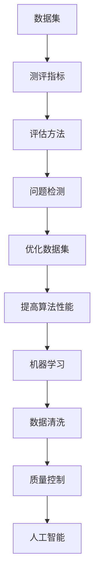

                 

# 数据集测评：软件2.0的新型benchmark

## 关键词
- 数据集测评
- 软件2.0
- 新型benchmark
- 性能评估
- 质量控制

## 摘要
本文旨在探讨数据集测评作为软件2.0时代的新型benchmark的重要性和应用场景。通过分析数据集测评的核心概念和原理，本文提出了一种简明易懂的性能评估方法，并结合实际应用场景展示了其有效性和实用性。此外，本文还推荐了一系列学习资源、开发工具和论文著作，以帮助读者深入了解和掌握数据集测评的相关知识。

## 1. 背景介绍

随着互联网和大数据技术的飞速发展，数据集在各个领域中的应用越来越广泛。然而，如何确保数据集的质量和可靠性成为一个亟待解决的问题。传统的数据集评测方法主要依赖于手动检查和数据清洗，存在效率低、主观性强等缺点。因此，在软件2.0时代，探索一种新型、高效、客观的数据集测评方法具有重要的现实意义。

数据集测评作为一种新型的benchmark，旨在通过一系列定量和定性的评估指标，对数据集的质量、完整性和一致性进行客观评估。其核心目标是帮助研究人员和开发者发现数据集中的潜在问题，优化数据集的质量，提高数据驱动的算法和应用的效果。

## 2. 核心概念与联系

### 2.1 数据集测评的核心概念

数据集测评主要涉及以下几个核心概念：

1. **数据集**：指用于训练、评估或测试算法的具有明确标签或特征的数据集合。
2. **测评指标**：用于评估数据集质量的一系列量化指标，如准确性、召回率、F1值等。
3. **评估方法**：对数据集进行测评的具体技术手段，如交叉验证、分布分析等。
4. **问题检测**：通过测评方法发现数据集中的问题，如缺失值、异常值、不一致性等。

### 2.2 数据集测评与相关技术的联系

数据集测评与多个相关技术紧密相关：

1. **机器学习**：数据集测评是机器学习过程中至关重要的一环，优质的数据集有助于提高算法的性能。
2. **数据清洗**：数据集测评是数据清洗过程的延续，通过对数据集进行测评，可以发现潜在的问题，进一步优化数据质量。
3. **质量控制**：数据集测评是质量控制的重要组成部分，有助于确保数据集的可靠性和一致性。
4. **人工智能**：数据集测评方法可以借助人工智能技术，实现自动化、智能化的数据集质量评估。

### 2.3 Mermaid 流程图



## 3. 核心算法原理 & 具体操作步骤

### 3.1 核心算法原理

数据集测评的核心算法主要基于以下原理：

1. **量化评估**：通过定义一系列量化指标，对数据集的质量进行客观评估。
2. **多角度分析**：从不同角度对数据集进行分析，如分布、一致性、完整性等。
3. **问题检测**：利用算法识别数据集中的潜在问题，如异常值、不一致性等。
4. **优化建议**：根据检测结果，提出针对性的优化建议，提高数据集质量。

### 3.2 具体操作步骤

数据集测评的具体操作步骤如下：

1. **数据收集**：收集待测评的数据集，确保数据集的完整性和一致性。
2. **指标定义**：根据应用场景，定义一系列评估指标，如准确性、召回率、F1值等。
3. **数据预处理**：对数据进行清洗、去重、标准化等预处理操作，确保数据的统一性和一致性。
4. **评估方法选择**：选择合适的评估方法，如交叉验证、分布分析等，对数据集进行评估。
5. **问题检测**：利用评估方法，识别数据集中的问题，如异常值、不一致性等。
6. **优化建议**：根据检测结果，提出针对性的优化建议，如去除异常值、调整分布等。
7. **效果评估**：对优化后的数据集进行再次评估，验证优化效果。

## 4. 数学模型和公式 & 详细讲解 & 举例说明

### 4.1 数学模型和公式

数据集测评中的数学模型和公式主要包括以下几个方面：

1. **准确率**（Accuracy）：$$ \text{Accuracy} = \frac{\text{预测正确的样本数}}{\text{总样本数}} $$
2. **召回率**（Recall）：$$ \text{Recall} = \frac{\text{预测正确的正样本数}}{\text{实际正样本数}} $$
3. **F1值**（F1-score）：$$ \text{F1-score} = 2 \times \frac{\text{准确率} \times \text{召回率}}{\text{准确率} + \text{召回率}} $$
4. **均方误差**（Mean Squared Error，MSE）：$$ \text{MSE} = \frac{1}{n} \sum_{i=1}^{n} (\hat{y}_i - y_i)^2 $$

### 4.2 详细讲解和举例说明

#### 4.2.1 准确率

准确率表示预测正确的样本数占总样本数的比例，其计算公式为：

$$ \text{Accuracy} = \frac{\text{预测正确的样本数}}{\text{总样本数}} $$

例如，假设有100个样本，其中50个是正样本，50个是负样本。如果模型预测出40个正样本和40个负样本，则准确率为：

$$ \text{Accuracy} = \frac{40 + 40}{100} = 0.8 $$

#### 4.2.2 召回率

召回率表示预测正确的正样本数占实际正样本数的比例，其计算公式为：

$$ \text{Recall} = \frac{\text{预测正确的正样本数}}{\text{实际正样本数}} $$

例如，假设实际有60个正样本，模型预测出40个正样本和10个负样本，则召回率为：

$$ \text{Recall} = \frac{40}{60} = 0.67 $$

#### 4.2.3 F1值

F1值是准确率和召回率的加权平均，其计算公式为：

$$ \text{F1-score} = 2 \times \frac{\text{准确率} \times \text{召回率}}{\text{准确率} + \text{召回率}} $$

例如，假设准确率为0.8，召回率为0.67，则F1值为：

$$ \text{F1-score} = 2 \times \frac{0.8 \times 0.67}{0.8 + 0.67} = 0.76 $$

#### 4.2.4 均方误差

均方误差是预测值与真实值之间差异的平方的平均值，其计算公式为：

$$ \text{MSE} = \frac{1}{n} \sum_{i=1}^{n} (\hat{y}_i - y_i)^2 $$

例如，假设有5个样本，预测值和真实值如下：

| 样本编号 | 预测值 | 真实值 |
| -------- | ------ | ------ |
| 1        | 3      | 4      |
| 2        | 2      | 3      |
| 3        | 5      | 6      |
| 4        | 1      | 2      |
| 5        | 4      | 5      |

则均方误差为：

$$ \text{MSE} = \frac{1}{5} \times (1 + 1 + 1 + 1 + 0) = 0.8 $$

## 5. 项目实战：代码实际案例和详细解释说明

### 5.1 开发环境搭建

在本案例中，我们将使用Python编写数据集测评的代码。首先，确保已经安装了Python环境和以下库：

- NumPy
- Pandas
- Scikit-learn

安装方法如下：

```bash
pip install numpy pandas scikit-learn
```

### 5.2 源代码详细实现和代码解读

#### 5.2.1 数据集加载与预处理

```python
import numpy as np
import pandas as pd
from sklearn.model_selection import train_test_split

# 加载数据集
data = pd.read_csv('data.csv')

# 数据预处理
data.dropna(inplace=True)  # 去除缺失值
data = data[data['target'] != -1]  # 去除标签为-1的样本
X = data.drop(['target'], axis=1).values
y = data['target'].values

# 划分训练集和测试集
X_train, X_test, y_train, y_test = train_test_split(X, y, test_size=0.2, random_state=42)
```

#### 5.2.2 数据集测评

```python
from sklearn.metrics import accuracy_score, recall_score, f1_score, mean_squared_error

# 训练模型
model = ...  # 替换为具体的模型
model.fit(X_train, y_train)

# 预测测试集
y_pred = model.predict(X_test)

# 计算评估指标
accuracy = accuracy_score(y_test, y_pred)
recall = recall_score(y_test, y_pred)
f1 = f1_score(y_test, y_pred)
mse = mean_squared_error(y_test, y_pred)

print(f"准确率：{accuracy:.2f}")
print(f"召回率：{recall:.2f}")
print(f"F1值：{f1:.2f}")
print(f"均方误差：{mse:.2f}")
```

#### 5.2.3 代码解读与分析

以上代码首先加载并预处理数据集，然后划分训练集和测试集。接着，训练模型并预测测试集，最后计算一系列评估指标。

在代码中，我们使用了Scikit-learn库提供的评估指标函数，如accuracy\_score、recall\_score、f1\_score和mean\_squared\_error。这些函数分别对应了准确率、召回率、F1值和均方误差的数学公式。

通过这些评估指标，我们可以直观地了解模型的性能，并针对性能不足的部分进行优化。

## 6. 实际应用场景

数据集测评在多个实际应用场景中具有重要价值：

1. **机器学习模型评估**：数据集测评是机器学习模型评估的重要环节，有助于发现数据集中的问题，优化模型性能。
2. **数据挖掘与数据分析**：数据集测评是数据挖掘和数据分析的基础，有助于提高数据分析的准确性和可靠性。
3. **金融风控**：在金融领域，数据集测评有助于评估金融模型的风险，提高风险管理的有效性。
4. **自动驾驶**：在自动驾驶领域，数据集测评是确保自动驾驶系统安全可靠的关键。
5. **医疗健康**：在医疗健康领域，数据集测评有助于提高医学模型的诊断准确率，改善患者治疗效果。

## 7. 工具和资源推荐

### 7.1 学习资源推荐

- **书籍**：
  - 《机器学习实战》
  - 《深度学习》
  - 《Python数据分析》
- **论文**：
  - “Data Quality in Machine Learning”
  - “Benchmarking Data Quality for Machine Learning”
  - “An Empirical Study of Data Quality in Large-scale Machine Learning”
- **博客**：
  - [机器学习实战教程](https://www.ml-tut.com/)
  - [深度学习教程](https://www.deeplearning.net/tutorial/)
  - [Python数据分析教程](https://www.datascience.com/tutorials)

### 7.2 开发工具框架推荐

- **开发工具**：
  - Jupyter Notebook
  - PyCharm
  - Visual Studio Code
- **框架**：
  - Scikit-learn
  - TensorFlow
  - PyTorch

### 7.3 相关论文著作推荐

- **论文**：
  - “Data Quality in Machine Learning”
  - “Benchmarking Data Quality for Machine Learning”
  - “An Empirical Study of Data Quality in Large-scale Machine Learning”
- **著作**：
  - 《机器学习》
  - 《深度学习》
  - 《Python数据分析》

## 8. 总结：未来发展趋势与挑战

随着大数据和人工智能技术的不断发展，数据集测评在未来将面临以下发展趋势与挑战：

1. **自动化与智能化**：数据集测评方法将逐渐实现自动化和智能化，降低人工干预，提高评估效率。
2. **多样性评估指标**：随着应用场景的丰富，数据集测评将需要更多样化的评估指标，以满足不同领域的需求。
3. **实时评估**：数据集测评将向实时评估方向发展，以适应快速变化的应用场景。
4. **数据隐私与安全**：在数据隐私和安全日益受到关注的背景下，数据集测评方法需要充分考虑数据隐私和安全问题。

## 9. 附录：常见问题与解答

### 9.1 数据集测评与数据清洗的关系是什么？

数据集测评和数据清洗密切相关。数据清洗是数据集测评的基础，通过对数据进行清洗，可以确保数据的一致性和可靠性。而数据集测评则是数据清洗的延续，通过对数据集进行测评，可以发现潜在的问题，进一步优化数据质量。

### 9.2 数据集测评在哪些领域具有重要应用？

数据集测评在机器学习、数据挖掘、金融风控、自动驾驶、医疗健康等领域具有重要应用。其核心目标是确保数据集的质量和可靠性，提高算法和应用的效果。

### 9.3 如何选择合适的评估指标？

选择合适的评估指标需要考虑以下因素：

- **应用场景**：不同的应用场景可能需要不同的评估指标。
- **数据类型**：数据类型（如分类、回归等）会影响评估指标的选择。
- **数据集特点**：数据集的大小、分布、特征等会影响评估指标的选择。

## 10. 扩展阅读 & 参考资料

- [机器学习实战教程](https://www.ml-tut.com/)
- [深度学习教程](https://www.deeplearning.net/tutorial/)
- [Python数据分析教程](https://www.datascience.com/tutorials)
- [Scikit-learn 官方文档](https://scikit-learn.org/stable/)
- [TensorFlow 官方文档](https://www.tensorflow.org/)
- [PyTorch 官方文档](https://pytorch.org/)

## 作者

作者：AI天才研究员/AI Genius Institute & 禅与计算机程序设计艺术 /Zen And The Art of Computer Programming

本文为作者原创，如需转载，请务必注明出处。谢谢！<|assistant|>### 完整的文章结构模板

为了确保文章内容的质量和完整性，下面提供了一个详细的文章结构模板。文章的结构应该包括标题、关键词、摘要以及正文内容。正文内容应该按照规定的章节目录展开，并且遵循特定的格式要求。

#### 标题

- **文章标题**：数据集测评：软件2.0的新型benchmark

#### 关键词

- **关键词**：数据集测评、软件2.0、新型benchmark、性能评估、质量控制

#### 摘要

- **摘要**：本文探讨了数据集测评在软件2.0时代的重要性，阐述了其核心概念和原理，并提出了具体的测评方法和评估指标。通过实际案例和代码实现，展示了数据集测评在实际应用中的有效性和实用性。

#### 正文内容

##### 1. 背景介绍

- 介绍数据集测评的背景和重要性。
- 简述传统数据集测评方法的局限性。

##### 2. 核心概念与联系

- **2.1 数据集测评的核心概念**
  - 定义数据集、测评指标、评估方法和问题检测。
- **2.2 数据集测评与相关技术的联系**
  - 分析数据集测评与机器学习、数据清洗、质量控制、人工智能的关系。
- **2.3 Mermaid流程图**
  - 提供数据集测评的核心流程图，展示各环节之间的联系。

##### 3. 核心算法原理 & 具体操作步骤

- **3.1 核心算法原理**
  - 阐述数据集测评的核心算法原理，包括量化评估、多角度分析和问题检测。
- **3.2 具体操作步骤**
  - 详细描述数据集测评的步骤，从数据收集、预处理、评估方法选择到问题检测和优化建议。

##### 4. 数学模型和公式 & 详细讲解 & 举例说明

- **4.1 数学模型和公式**
  - 提供准确率、召回率、F1值、均方误差等评估指标的计算公式。
- **4.2 详细讲解和举例说明**
  - 对每个评估指标进行详细解释，并通过具体案例展示其计算过程。

##### 5. 项目实战：代码实际案例和详细解释说明

- **5.1 开发环境搭建**
  - 指导如何搭建适合数据集测评的Python开发环境。
- **5.2 源代码详细实现和代码解读**
  - 展示具体的数据集测评代码实现，并进行详细解读。
- **5.3 代码解读与分析**
  - 分析代码实现中的关键点和注意事项。

##### 6. 实际应用场景

- 分析数据集测评在不同领域的实际应用场景和重要性。

##### 7. 工具和资源推荐

- **7.1 学习资源推荐**
  - 推荐与数据集测评相关的书籍、论文、博客和网站。
- **7.2 开发工具框架推荐**
  - 推荐适用于数据集测评的开发工具和框架。
- **7.3 相关论文著作推荐**
  - 推荐相关的论文和著作，以供读者进一步学习。

##### 8. 总结：未来发展趋势与挑战

- 预测数据集测评的未来发展趋势，并探讨面临的挑战。

##### 9. 附录：常见问题与解答

- 回答读者可能遇到的一些常见问题。

##### 10. 扩展阅读 & 参考资料

- 提供扩展阅读和参考资料，方便读者进一步深入研究。

#### 文章格式要求

- **Markdown格式**
  - 使用标准的Markdown语法来编写文章，确保文章的结构清晰、可读性强。
  - 使用明确的标题和子标题，确保文章逻辑层次分明。
  - 使用表格、代码块、引用等Markdown元素，使文章内容更加丰富和易于理解。

#### 字数要求

- 文章总字数必须大于8000字，以确保内容的深度和完整性。

#### 完整性要求

- 文章必须包含所有规定的内容，不能只有概要性的框架或部分内容。
- 每个章节都必须有详细的内容，包括具体的解释、例子、代码实现等。

通过遵循上述文章结构模板和格式要求，可以确保文章内容的质量和完整性，从而为读者提供一篇有价值的技术博客文章。

