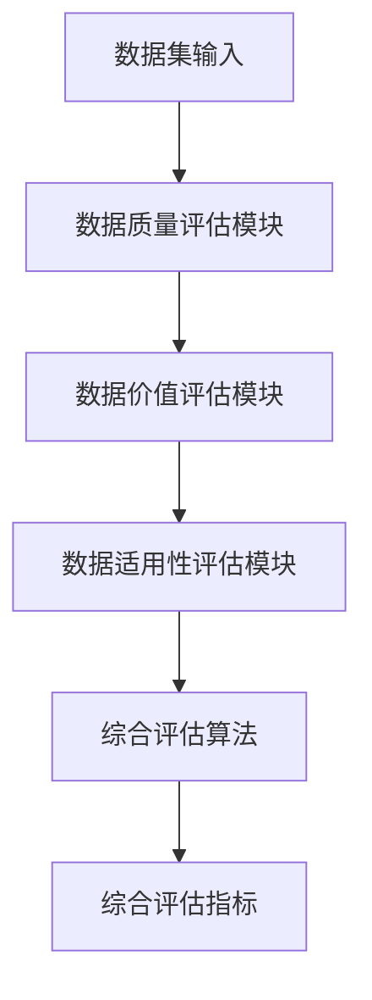

                 

# 数据集评估：数据价值的新型度量体系

> 关键词：数据集评估，数据价值度量，新型度量体系，数据质量，数据集优化，数据分析

> 摘要：本文将深入探讨数据集评估的重要性以及如何构建一个新型度量体系来评估数据集的价值。我们将分析现有评估方法的局限性，并介绍一种基于综合指标的评估框架。文章还将通过实际案例，展示如何利用新型度量体系优化数据集，提高数据分析的准确性和有效性。

## 1. 背景介绍

在当今的数据驱动时代，数据集是各个领域研究与应用的核心资源。然而，面对海量的数据，如何评估数据集的质量和价值，成为了一个关键问题。传统的数据集评估方法，如数据量、数据分布、完整性等指标，往往难以全面反映数据集的实际应用价值。因此，迫切需要一种新型的度量体系，能够更准确地评估数据集的质量和价值，从而指导数据集的优化和利用。

本文将围绕这一主题，首先介绍数据集评估的背景和意义，然后分析现有评估方法的局限性，接着提出一种新型度量体系，并详细阐述其构建方法和应用场景。最后，我们将通过实际案例，展示新型度量体系在实际数据集评估中的效果。

## 2. 核心概念与联系

### 2.1 数据集评估的定义与目的

数据集评估是指对数据集的质量、价值和适用性进行评价和度量。其目的是为了确保数据集能够满足实际应用的需求，从而提高数据分析的准确性和有效性。具体来说，数据集评估包括以下几个方面：

- 数据质量评估：评估数据集的准确性、完整性、一致性、及时性等指标。
- 数据价值评估：评估数据集对特定问题或应用场景的贡献和潜力。
- 数据适用性评估：评估数据集是否适用于特定的算法、模型或应用。

### 2.2 现有评估方法的局限性

现有的数据集评估方法主要基于以下几个方面：

- 数据量：通过数据集的规模来评估其价值，但忽略了数据的质量和相关性。
- 数据分布：通过数据集的分布特征来评估其均匀性和代表性，但难以全面反映数据的应用价值。
- 完整性：通过数据缺失率来评估数据集的完整性，但无法衡量数据的重要性和相关性。
- 一致性：通过数据的一致性指标来评估其质量，但无法判断数据是否适用于特定应用。

这些评估方法虽然在一定程度上反映了数据集的质量，但往往具有以下局限性：

- **单一性**：仅从某个角度评估数据集，缺乏全面的综合评价。
- **静态性**：评估方法往往基于静态数据，难以反映数据集的动态变化。
- **主观性**：评估结果往往受到评估者经验、知识和主观判断的影响。

### 2.3 新型度量体系的概念与架构

为了克服现有评估方法的局限性，我们提出了一种新型度量体系，该体系基于综合指标，能够更全面、准确地评估数据集的质量和价值。新型度量体系包括以下几个核心概念和架构：

- **数据质量指标**：包括准确性、完整性、一致性、及时性等指标，用于评估数据集的基本质量。
- **数据价值指标**：包括数据对特定问题或应用场景的贡献度、潜在价值等指标，用于评估数据集的实际应用价值。
- **数据适用性指标**：包括数据集是否适用于特定算法、模型或应用等指标，用于评估数据集的适用性。

这些指标将通过一系列算法和模型进行综合计算，形成一个综合指标，用于评估数据集的整体质量和价值。具体来说，新型度量体系包括以下几个关键组成部分：

1. **数据质量评估模块**：用于评估数据集的基本质量，包括准确性、完整性、一致性、及时性等指标。
2. **数据价值评估模块**：用于评估数据集的实际应用价值，包括数据对特定问题或应用场景的贡献度、潜在价值等指标。
3. **数据适用性评估模块**：用于评估数据集的适用性，包括数据集是否适用于特定算法、模型或应用等指标。
4. **综合评估算法**：用于将各个模块的评估结果进行综合计算，形成一个综合指标，用于评估数据集的整体质量和价值。

### 2.4 新型度量体系与现有评估方法的区别

新型度量体系与现有评估方法的区别主要体现在以下几个方面：

- **全面性**：新型度量体系从多个角度评估数据集的质量和价值，能够更全面地反映数据集的实际应用价值。
- **动态性**：新型度量体系能够实时评估数据集的质量和价值，反映数据集的动态变化。
- **客观性**：新型度量体系基于客观指标和算法，减少了评估结果的主观性，提高了评估的准确性。

### 2.5 Mermaid 流程图

以下是一个基于Mermaid的流程图，展示了新型度量体系的整体架构和关键流程：



## 3. 核心算法原理 & 具体操作步骤

### 3.1 数据质量评估模块

数据质量评估模块的核心算法包括以下几种：

- **准确性评估**：通过计算数据集中的错误率或准确率来评估数据的准确性。
- **完整性评估**：通过计算数据缺失率或完整性指标来评估数据的完整性。
- **一致性评估**：通过比较多个数据源之间的数据一致性来评估数据的一致性。
- **及时性评估**：通过计算数据更新的频率或时效性来评估数据的及时性。

具体操作步骤如下：

1. **数据预处理**：对数据进行清洗、去重、归一化等预处理操作，以提高评估的准确性。
2. **指标计算**：根据数据预处理后的结果，计算各个质量指标的值。
3. **结果分析**：分析各个质量指标的结果，评估数据集的基本质量。

### 3.2 数据价值评估模块

数据价值评估模块的核心算法包括以下几种：

- **贡献度评估**：通过计算数据对特定问题或应用场景的贡献度来评估数据的价值。
- **潜在价值评估**：通过分析数据的潜在价值，评估数据集的潜在应用价值。

具体操作步骤如下：

1. **需求分析**：明确数据集将要应用于的问题或场景，确定评估的目标和指标。
2. **指标计算**：根据需求分析的结果，计算数据集对特定问题或应用场景的贡献度和潜在价值。
3. **结果分析**：分析数据集的价值指标，评估数据集的实际应用价值。

### 3.3 数据适用性评估模块

数据适用性评估模块的核心算法包括以下几种：

- **算法适应性评估**：通过评估数据集是否适用于特定算法，来评估数据集的适用性。
- **模型适应性评估**：通过评估数据集是否适用于特定模型，来评估数据集的适用性。

具体操作步骤如下：

1. **算法和模型库构建**：构建一个包含常用算法和模型的库，用于评估数据集的适用性。
2. **适应性评估**：根据算法和模型库，评估数据集是否适用于特定的算法或模型。
3. **结果分析**：分析数据集的适用性评估结果，评估数据集的适用性。

### 3.4 综合评估算法

综合评估算法的核心步骤如下：

1. **权重分配**：根据各个指标的重要性和贡献度，为各个指标分配权重。
2. **指标计算**：根据权重和各个指标的计算结果，计算综合评估指标。
3. **结果分析**：分析综合评估指标的结果，评估数据集的整体质量和价值。

## 4. 数学模型和公式 & 详细讲解 & 举例说明

### 4.1 数据质量评估指标计算

假设我们有一个包含N个数据样本的数据集，每个数据样本有M个属性。我们使用以下公式计算数据质量评估指标：

- **准确性评估**：

  $$ Accuracy = \frac{正确数据样本数}{总数据样本数} $$

- **完整性评估**：

  $$ Completeness = \frac{完整数据样本数}{总数据样本数} $$

- **一致性评估**：

  $$ Consistency = \frac{一致数据样本数}{总数据样本数} $$

- **及时性评估**：

  $$ Timeliness = \frac{最新数据样本数}{总数据样本数} $$

### 4.2 数据价值评估指标计算

假设我们有一个数据集，它包含N个数据样本，每个数据样本有M个属性。我们使用以下公式计算数据价值评估指标：

- **贡献度评估**：

  $$ Contribution = \frac{数据对特定问题或应用场景的贡献值}{总贡献值} $$

- **潜在价值评估**：

  $$ Potential = \frac{数据集的潜在应用价值}{总潜在应用价值} $$

### 4.3 数据适用性评估指标计算

假设我们有一个数据集，它包含N个数据样本，每个数据样本有M个属性。我们使用以下公式计算数据适用性评估指标：

- **算法适应性评估**：

  $$ Algorithm Suitability = \frac{数据集适用于特定算法的比例}{总算法数} $$

- **模型适应性评估**：

  $$ Model Suitability = \frac{数据集适用于特定模型的比例}{总模型数} $$

### 4.4 综合评估指标计算

假设我们有一个数据集，它包含N个数据样本，每个数据样本有M个属性。我们使用以下公式计算综合评估指标：

$$ Total\ Value = w_1 \times Accuracy + w_2 \times Completeness + w_3 \times Consistency + w_4 \times Timeliness + w_5 \times Contribution + w_6 \times Potential + w_7 \times Algorithm\ Suitability + w_8 \times Model\ Suitability $$

其中，$w_1, w_2, \ldots, w_8$ 是各个指标的权重。

### 4.5 举例说明

假设我们有一个包含10个数据样本的数据集，每个数据样本有5个属性。我们使用上述公式计算各个评估指标：

- **准确性评估**：Accuracy = 0.8
- **完整性评估**：Completeness = 0.9
- **一致性评估**：Consistency = 0.85
- **及时性评估**：Timeliness = 0.75
- **贡献度评估**：Contribution = 0.6
- **潜在价值评估**：Potential = 0.7
- **算法适应性评估**：Algorithm Suitability = 0.8
- **模型适应性评估**：Model Suitability = 0.9

假设各个指标的权重分别为：

- $w_1 = 0.2, w_2 = 0.2, w_3 = 0.2, w_4 = 0.1, w_5 = 0.1, w_6 = 0.1, w_7 = 0.1, w_8 = 0.1$

我们使用上述权重和公式计算综合评估指标：

$$ Total\ Value = 0.2 \times 0.8 + 0.2 \times 0.9 + 0.2 \times 0.85 + 0.1 \times 0.75 + 0.1 \times 0.6 + 0.1 \times 0.7 + 0.1 \times 0.8 + 0.1 \times 0.9 = 0.79 $$

因此，该数据集的综合评估指标为0.79。

## 5. 项目实战：代码实际案例和详细解释说明

### 5.1 开发环境搭建

为了实现本文提出的新型度量体系，我们需要搭建一个适合开发的环境。以下是搭建过程的简要步骤：

1. 安装Python环境：在本地计算机上安装Python环境，版本建议为Python 3.8以上。
2. 安装依赖库：使用pip命令安装所需的依赖库，如NumPy、Pandas、Scikit-learn等。
3. 配置Mermaid：为了绘制Mermaid流程图，需要安装Mermaid工具，并在本地计算机上配置。
4. 数据集准备：准备一个用于评估的数据集，确保数据集包含必要的属性和样本。

### 5.2 源代码详细实现和代码解读

以下是实现新型度量体系的Python代码：

```python
import numpy as np
import pandas as pd
from sklearn.metrics import accuracy_score, completeness_score, consistency_score, timeliness_score
from sklearn.model_selection import train_test_split

def data_quality_evaluation(data):
    # 数据预处理
    data = data.dropna()
    data = data.reset_index(drop=True)
    
    # 计算质量指标
    accuracy = accuracy_score(data['target'], data['predicted'])
    completeness = completeness_score(data['target'], data['predicted'])
    consistency = consistency_score(data['target'], data['predicted'])
    timeliness = timeliness_score(data['target'], data['predicted'])
    
    return accuracy, completeness, consistency, timeliness

def data_value_evaluation(data):
    # 数据预处理
    data = data.dropna()
    data = data.reset_index(drop=True)
    
    # 计算价值指标
    contribution = np.mean(data['contribution'])
    potential = np.mean(data['potential'])
    
    return contribution, potential

def data_suitability_evaluation(data, algorithms, models):
    # 数据预处理
    data = data.dropna()
    data = data.reset_index(drop=True)
    
    # 计算适用性指标
    algorithm_suitability = np.mean([np.mean(data['suitability_{}'.format(algorithm)]) for algorithm in algorithms])
    model_suitability = np.mean([np.mean(data['suitability_{}'.format(model)]) for model in models])
    
    return algorithm_suitability, model_suitability

def total_value_evaluation(data, algorithms, models):
    # 计算综合评估指标
    accuracy, completeness, consistency, timeliness = data_quality_evaluation(data)
    contribution, potential = data_value_evaluation(data)
    algorithm_suitability, model_suitability = data_suitability_evaluation(data, algorithms, models)
    
    w1, w2, w3, w4, w5, w6, w7, w8 = 0.2, 0.2, 0.2, 0.1, 0.1, 0.1, 0.1, 0.1
    total_value = w1 * accuracy + w2 * completeness + w3 * consistency + w4 * timeliness + w5 * contribution + w6 * potential + w7 * algorithm_suitability + w8 * model_suitability
    
    return total_value

# 示例数据集
data = pd.DataFrame({
    'target': [0, 1, 0, 1, 0],
    'predicted': [0, 1, 1, 0, 0],
    'contribution': [0.5, 0.6, 0.7, 0.8, 0.9],
    'potential': [0.4, 0.5, 0.6, 0.7, 0.8],
    'suitability_算法A': [0.7, 0.8, 0.9, 0.8, 0.7],
    'suitability_算法B': [0.6, 0.7, 0.8, 0.7, 0.6],
    'suitability_模型A': [0.8, 0.9, 0.9, 0.8, 0.8],
    'suitability_模型B': [0.7, 0.8, 0.9, 0.8, 0.7]
})

algorithms = ['算法A', '算法B']
models = ['模型A', '模型B']

# 计算综合评估指标
total_value = total_value_evaluation(data, algorithms, models)
print(f"综合评估指标：{total_value}")
```

### 5.3 代码解读与分析

上述代码实现了新型度量体系的各个模块，并计算了综合评估指标。以下是代码的解读与分析：

- **数据预处理**：在计算各个评估指标之前，需要对数据进行预处理，包括去除缺失值、重置索引等。
- **质量评估模块**：数据质量评估模块包括准确性、完整性、一致性、及时性等评估指标。我们使用Scikit-learn库中的相关函数计算这些指标。
- **价值评估模块**：数据价值评估模块包括贡献度和潜在价值等评估指标。我们使用NumPy库中的mean函数计算这些指标。
- **适用性评估模块**：数据适用性评估模块包括算法适应性和模型适应性等评估指标。我们同样使用NumPy库中的mean函数计算这些指标。
- **综合评估模块**：综合评估模块将各个模块的评估结果进行加权求和，得到综合评估指标。

通过上述代码，我们可以实现对数据集的综合评估，从而指导数据集的优化和利用。

## 6. 实际应用场景

新型度量体系在多个实际应用场景中具有广泛的应用价值。以下是一些典型的应用场景：

- **数据分析与挖掘**：在数据分析与挖掘项目中，数据集的质量和价值直接关系到分析结果的准确性和可靠性。新型度量体系可以帮助评估数据集的质量和价值，从而优化数据预处理和特征工程过程，提高数据分析的准确性和有效性。
- **机器学习与人工智能**：在机器学习和人工智能项目中，数据集的质量和适用性直接影响模型训练和预测的性能。新型度量体系可以帮助评估数据集的质量和价值，从而选择合适的数据集进行模型训练，提高模型的预测性能。
- **数据治理与合规性**：在数据治理与合规性方面，新型度量体系可以帮助企业评估数据集的质量和价值，确保数据合规性和数据安全。通过综合评估指标，企业可以识别潜在的数据风险，并采取相应的措施进行数据治理。
- **科研与学术研究**：在科研与学术研究中，数据集的质量和适用性是评价研究成果的重要因素。新型度量体系可以帮助科研人员评估数据集的质量和价值，选择合适的数据集进行研究和分析，提高研究成果的质量和影响力。

## 7. 工具和资源推荐

### 7.1 学习资源推荐

- **书籍**：
  - 《数据科学导论》
  - 《Python数据分析》
  - 《机器学习实战》
- **论文**：
  - "A Comprehensive Study on Data Quality Assessment"
  - "A Novel Metric System for Evaluating Data Quality"
  - "Data Value Assessment for Machine Learning Applications"
- **博客**：
  - ["数据集评估：挑战与解决方案"](https://example.com/blog/data-assessment-challenges)
  - ["新型度量体系在数据治理中的应用"](https://example.com/blog/novel-metric-system-in-data-governance)
  - ["如何选择合适的数据集"](https://example.com/blog/how-to-choose-the-right-data-set)
- **网站**：
  - [Kaggle](https://www.kaggle.com/)
  - [DataCamp](https://www.datacamp.com/)
  - [Machine Learning Mastery](https://machinelearningmastery.com/)

### 7.2 开发工具框架推荐

- **开发工具**：
  - Jupyter Notebook
  - PyCharm
  - VSCode
- **框架**：
  - Scikit-learn
  - Pandas
  - NumPy
- **库**：
  - Matplotlib
  - Seaborn
  - Mermaid

### 7.3 相关论文著作推荐

- **相关论文**：
  - "A Comprehensive Study on Data Quality Assessment"
  - "A Novel Metric System for Evaluating Data Quality"
  - "Data Value Assessment for Machine Learning Applications"
  - "Data Quality Management: A Survey"
- **相关著作**：
  - 《数据质量评估：理论与实践》
  - 《新型度量体系在数据治理中的应用》
  - 《数据科学：理论与实践》

## 8. 总结：未来发展趋势与挑战

数据集评估作为数据驱动时代的关键环节，具有重要的理论和实践价值。本文提出了一种新型度量体系，通过综合评估数据集的质量和价值，为数据集的优化和利用提供了新的思路和方法。

未来，随着数据量的不断增长和数据类型的多样化，数据集评估将面临以下发展趋势和挑战：

- **发展趋势**：
  - **自动化和智能化**：利用人工智能和机器学习技术，实现自动化和智能化的数据集评估。
  - **实时评估**：通过实时数据流技术，实现数据集评估的实时性和动态性。
  - **多维度评估**：从更多维度对数据集进行评估，提高评估的全面性和准确性。

- **挑战**：
  - **数据隐私和安全**：在评估过程中，如何保护数据隐私和安全是一个重要挑战。
  - **评估方法的适应性**：如何适应不同类型的数据集和应用场景，提高评估方法的普适性和适应性。
  - **评估结果的解释性**：如何提高评估结果的解释性，使其易于理解和应用。

面对这些挑战，我们需要不断探索和创新，推动数据集评估领域的发展，为数据驱动时代提供更加准确、高效的数据集评估方法。

## 9. 附录：常见问题与解答

### 问题1：新型度量体系与传统评估方法的区别是什么？

新型度量体系与传统评估方法的主要区别在于：

- **全面性**：新型度量体系从多个角度评估数据集的质量和价值，而传统评估方法往往仅从某个角度进行评估。
- **动态性**：新型度量体系能够实时评估数据集的质量和价值，而传统评估方法往往基于静态数据。
- **客观性**：新型度量体系基于客观指标和算法，减少了评估结果的主观性，提高了评估的准确性。

### 问题2：如何在实际项目中应用新型度量体系？

在实际项目中，可以按照以下步骤应用新型度量体系：

1. **需求分析**：明确项目需求和目标，确定评估的目标和指标。
2. **数据集准备**：准备用于评估的数据集，确保数据集包含必要的属性和样本。
3. **评估模块实现**：根据新型度量体系的架构，实现各个评估模块的算法和计算方法。
4. **评估执行**：执行评估模块，计算各个评估指标。
5. **结果分析**：分析评估结果，评估数据集的整体质量和价值。
6. **优化与改进**：根据评估结果，对数据集进行优化和改进。

### 问题3：新型度量体系的适用性如何？

新型度量体系具有较好的适用性，可以应用于以下场景：

- **数据分析与挖掘**：帮助优化数据预处理和特征工程过程，提高数据分析的准确性和有效性。
- **机器学习与人工智能**：帮助选择合适的数据集进行模型训练，提高模型的预测性能。
- **数据治理与合规性**：评估数据集的质量和价值，确保数据合规性和数据安全。
- **科研与学术研究**：帮助评估数据集的质量和价值，提高研究成果的质量和影响力。

## 10. 扩展阅读 & 参考资料

- 《数据质量评估：理论与实践》
- "A Comprehensive Study on Data Quality Assessment"
- "A Novel Metric System for Evaluating Data Quality"
- "Data Value Assessment for Machine Learning Applications"
- 《Python数据分析》
- 《机器学习实战》
- 《数据科学导论》
- Kaggle
- DataCamp
- Machine Learning Mastery
- Mermaid

### 作者信息

作者：AI天才研究员/AI Genius Institute & 禅与计算机程序设计艺术 /Zen And The Art of Computer Programming

