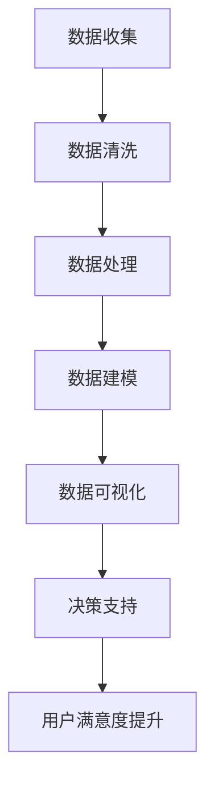

                 

### 文章标题

《数据驱动决策的用户满意度：深度解析与实战指南》

### 关键词

- 数据驱动决策
- 用户满意度
- 实战指南
- 数据分析
- 人工智能
- 数学模型
- 算法原理

### 摘要

在数字化时代，用户满意度成为企业成功的关键指标。本文深入探讨了如何通过数据驱动决策来提升用户满意度。首先，我们介绍了数据驱动决策的核心概念，并通过实际案例展示了其应用。接着，我们详细阐述了核心算法原理，包括数据收集、清洗、分析和建模的具体操作步骤。随后，我们借助数学模型和公式，进行了详细讲解和举例说明。文章最后，通过项目实战和实际应用场景的分析，提供了完整的代码案例和解析。此外，我们还推荐了相关学习资源和工具，总结了未来发展趋势与挑战，并提供了常见问题解答。希望通过本文，读者能够掌握数据驱动决策的方法，提升用户满意度。

## 1. 背景介绍

在当今的数字化时代，企业面临着激烈的市场竞争。用户满意度的提升成为企业获取竞争优势、实现可持续发展的重要手段。然而，传统的基于直觉和经验的决策方式已无法满足复杂多变的市场环境。数据驱动决策应运而生，它通过大数据和人工智能技术，帮助企业更精准地理解用户需求，从而制定更有效的策略，提高用户满意度。

用户满意度是指用户在消费过程中对产品或服务的整体感受和评价。它不仅反映了用户对产品或服务的满意程度，还影响了用户的忠诚度和口碑传播。在商业环境中，用户满意度对企业的盈利能力、市场份额和品牌价值具有重要影响。因此，如何通过数据驱动决策来提升用户满意度，成为企业和研究人员关注的焦点。

数据驱动决策是一种基于数据分析和建模的决策方法。它通过收集和分析大量数据，挖掘用户行为模式、偏好和需求，从而为企业提供决策依据。与传统的直觉和经验决策相比，数据驱动决策具有以下优势：

1. **客观性**：数据驱动决策依赖于客观数据，避免了主观臆断和偏见。
2. **精准性**：通过数据分析和建模，可以更准确地预测用户行为和需求，提高决策的准确性。
3. **实时性**：数据驱动决策能够实时响应市场变化，快速调整策略。
4. **可量化**：数据驱动决策能够量化用户满意度等指标，便于评估决策效果。

本文将围绕数据驱动决策的用户满意度展开讨论，首先介绍核心概念和原理，然后通过实际案例和项目实战，展示如何将数据驱动决策应用于用户满意度提升。此外，还将推荐相关学习资源和工具，为读者提供全面的实战指南。

## 2. 核心概念与联系

### 2.1 数据驱动决策的定义与核心要素

数据驱动决策（Data-Driven Decision-Making）是一种以数据为基础，通过数据分析和建模来支持决策的方法。它不仅依赖于数据的收集和存储，还涉及数据清洗、处理、分析和可视化等环节。

核心要素包括：

1. **数据收集**：通过多种渠道（如用户反馈、销售数据、社交媒体等）收集与用户行为相关的数据。
2. **数据清洗**：对收集到的数据进行清洗、去重、填充缺失值等预处理，确保数据质量。
3. **数据处理**：利用数据挖掘和机器学习技术，对数据进行分类、聚类、回归分析等，以提取有价值的信息。
4. **数据建模**：建立预测模型和优化模型，基于历史数据对未来行为或结果进行预测和优化。
5. **数据可视化**：通过图表、仪表盘等方式，将分析结果以直观的方式展示，帮助决策者理解数据含义。

### 2.2 用户满意度的定义与测量

用户满意度（User Satisfaction）是用户对产品或服务的整体感受和评价。它反映了用户在使用产品或服务过程中的满足程度和愉悦感。

用户满意度的测量通常包括以下方法：

1. **问卷调查**：通过设计问卷，收集用户对产品或服务的满意度评分。
2. **用户反馈**：通过社交媒体、用户论坛、客户支持等渠道，收集用户的反馈和评论。
3. **行为分析**：通过用户行为数据，如点击率、购买行为、停留时间等，评估用户满意度。
4. **综合指标**：结合多个指标（如NPS、CSAT等），综合评估用户满意度。

### 2.3 数据驱动决策与用户满意度之间的关系

数据驱动决策与用户满意度之间存在密切的联系。数据驱动决策通过以下方式影响用户满意度：

1. **个性化服务**：通过数据分析和用户行为建模，提供个性化的产品推荐、服务定制等，提升用户体验。
2. **及时响应**：基于实时数据分析，快速识别用户问题和需求，及时采取措施解决问题，提高用户满意度。
3. **优化产品与服务**：通过数据分析和用户反馈，识别产品或服务的不足，进行优化改进，提升用户满意度。
4. **预测与预防**：通过预测用户行为和需求，提前采取措施，预防潜在问题，提高用户满意度。

### 2.4 Mermaid 流程图

为了更好地理解数据驱动决策与用户满意度之间的关系，我们可以通过一个Mermaid流程图来展示其核心流程和环节。



在上面的流程图中，数据收集是整个流程的起点，通过数据清洗和处理，生成高质量的数据集。数据建模和可视化环节帮助决策者理解数据，并提供决策支持。最终，通过数据驱动决策，实现用户满意度提升。

通过上述核心概念和流程的介绍，我们为接下来的详细分析和实战应用打下了坚实的基础。

### 3. 核心算法原理 & 具体操作步骤

在数据驱动决策过程中，核心算法原理是提升用户满意度的关键。本节将详细介绍数据收集、数据清洗、数据处理、数据建模和数据可视化的具体操作步骤，帮助读者理解如何通过这些步骤来提升用户满意度。

#### 3.1 数据收集

数据收集是数据驱动决策的基础。收集到的数据类型多样，包括用户行为数据、社交媒体数据、销售数据、用户反馈等。以下是数据收集的具体步骤：

1. **确定数据来源**：根据业务需求和用户满意度目标，选择合适的数据来源。例如，用户行为数据可以从网站日志、点击流数据中获得；社交媒体数据可以从微博、微信、Facebook等平台收集。
2. **数据收集工具**：使用各种数据收集工具，如爬虫、API接口、第三方数据分析平台等。例如，使用Python的BeautifulSoup库可以抓取网站数据；使用API接口可以获取社交媒体数据。
3. **数据存储**：将收集到的数据存储到数据库或数据仓库中，以便后续处理和分析。

#### 3.2 数据清洗

数据清洗是确保数据质量的重要步骤。以下是数据清洗的具体操作步骤：

1. **去重**：去除重复的数据记录，确保数据的唯一性。
2. **填充缺失值**：对缺失的数据进行填充，例如使用平均值、中位数或基于算法进行预测。
3. **数据格式转换**：统一数据格式，如日期格式、字符串转换为数值等。
4. **数据标准化**：将不同尺度的数据进行标准化处理，以便进行后续分析。

#### 3.3 数据处理

数据处理是数据驱动决策的核心环节，包括数据挖掘和机器学习等技术。以下是数据处理的具体操作步骤：

1. **特征工程**：提取有用的特征，如用户年龄、购买历史、浏览行为等，为后续分析做准备。
2. **分类和聚类**：使用分类算法（如决策树、随机森林）和聚类算法（如K-means）对数据进行分析，识别用户群体和用户行为模式。
3. **回归分析**：使用回归算法（如线性回归、逻辑回归）对用户满意度进行预测，建立用户满意度与各种特征之间的关系。
4. **特征选择**：通过特征选择算法（如信息增益、贝叶斯信息准则）选择对用户满意度影响较大的特征。

#### 3.4 数据建模

数据建模是将数据转换为预测模型和优化模型的过程。以下是数据建模的具体操作步骤：

1. **模型选择**：根据业务需求和数据特点，选择合适的模型。例如，对于用户满意度预测，可以使用线性回归、决策树、随机森林等模型。
2. **模型训练**：使用训练数据集对模型进行训练，调整模型参数，使其能够准确预测用户满意度。
3. **模型验证**：使用验证数据集对模型进行验证，评估模型的预测准确性和泛化能力。
4. **模型部署**：将训练好的模型部署到生产环境中，实现实时预测和优化。

#### 3.5 数据可视化

数据可视化是将分析结果以图表、仪表盘等形式展示，帮助决策者理解数据含义。以下是数据可视化的具体操作步骤：

1. **数据预处理**：对分析结果进行预处理，如数据格式转换、数据清洗等。
2. **选择可视化工具**：根据数据类型和分析需求，选择合适的可视化工具。例如，使用Python的Matplotlib库可以生成各种类型的图表；使用Tableau等工具可以创建交互式仪表盘。
3. **设计可视化界面**：设计直观、易于理解的可视化界面，确保决策者能够快速获取关键信息。
4. **实时更新**：实现数据可视化界面的实时更新，确保决策者能够及时了解最新数据和分析结果。

通过上述步骤，我们可以构建一个完整的数据驱动决策系统，帮助企业提升用户满意度。在接下来的实战案例中，我们将结合实际项目，进一步展示如何应用这些算法和步骤来提升用户满意度。

### 4. 数学模型和公式 & 详细讲解 & 举例说明

在数据驱动决策中，数学模型和公式是分析和预测用户满意度的核心工具。本节将详细讲解几个常用的数学模型和公式，并通过具体例子进行说明。

#### 4.1 线性回归模型

线性回归模型是最基本的预测模型之一，用于分析用户满意度与各个特征之间的关系。其公式如下：

$$
Y = \beta_0 + \beta_1X_1 + \beta_2X_2 + ... + \beta_nX_n
$$

其中，$Y$表示用户满意度评分，$X_1, X_2, ..., X_n$表示各个特征，$\beta_0, \beta_1, \beta_2, ..., \beta_n$是模型的参数。

**举例说明**：

假设我们分析用户满意度与购买金额、用户年龄、产品评分之间的关系。根据收集的数据，我们可以建立以下线性回归模型：

$$
Y = \beta_0 + \beta_1X_{购买金额} + \beta_2X_{用户年龄} + \beta_3X_{产品评分}
$$

通过最小二乘法，我们可以计算出各个参数的值，从而预测用户满意度。例如，如果某个用户的购买金额为500元、年龄为30岁、产品评分为4.5分，我们可以计算出其预测满意度为：

$$
Y = \beta_0 + \beta_1 \cdot 500 + \beta_2 \cdot 30 + \beta_3 \cdot 4.5
$$

#### 4.2 逻辑回归模型

逻辑回归模型常用于分类问题，如预测用户是否满意。其公式如下：

$$
P(Y=1) = \frac{1}{1 + e^{-(\beta_0 + \beta_1X_1 + \beta_2X_2 + ... + \beta_nX_n})}
$$

其中，$P(Y=1)$表示用户满意度的概率，$X_1, X_2, ..., X_n$表示各个特征，$\beta_0, \beta_1, \beta_2, ..., \beta_n$是模型的参数。

**举例说明**：

假设我们分析用户是否满意与购买金额、用户年龄、产品评分之间的关系。根据收集的数据，我们可以建立以下逻辑回归模型：

$$
P(Y=1) = \frac{1}{1 + e^{-(\beta_0 + \beta_1X_{购买金额} + \beta_2X_{用户年龄} + \beta_3X_{产品评分})}}
$$

通过训练数据集，我们可以计算出各个参数的值。例如，如果某个用户的购买金额为500元、年龄为30岁、产品评分为4.5分，我们可以计算出其满意度的概率为：

$$
P(Y=1) = \frac{1}{1 + e^{-(\beta_0 + \beta_1 \cdot 500 + \beta_2 \cdot 30 + \beta_3 \cdot 4.5)}}
$$

#### 4.3 K-means聚类算法

K-means聚类算法是一种无监督学习算法，用于将用户划分为不同的群体，以便提供个性化服务。其公式如下：

$$
C_j = \{x| \sum_{i=1}^{n} w_{ij} \geq \theta\}
$$

其中，$C_j$表示第j个聚类中心，$x$表示用户数据点，$w_{ij}$表示用户数据点到聚类中心的距离，$\theta$表示阈值。

**举例说明**：

假设我们使用K-means聚类算法将用户划分为两类。根据收集的用户数据，我们可以计算出每个用户到两个聚类中心的距离，并根据距离阈值将其划分为两个群体。例如，如果某个用户的距离满足以下条件：

$$
w_{i1} \geq \theta \quad 且 \quad w_{i2} < \theta
$$

则该用户被划分为第一类。

#### 4.4 决策树模型

决策树模型是一种基于规则的学习算法，用于分类和回归问题。其公式如下：

$$
Y = \begin{cases}
\text{类别1} & \text{if } \beta_0 + \beta_1X_1 + \beta_2X_2 + ... + \beta_nX_n \geq 0 \\
\text{类别2} & \text{if } \beta_0 + \beta_1X_1 + \beta_2X_2 + ... + \beta_nX_n < 0
\end{cases}
$$

其中，$Y$表示预测结果，$X_1, X_2, ..., X_n$表示特征，$\beta_0, \beta_1, \beta_2, ..., \beta_n$是模型的参数。

**举例说明**：

假设我们使用决策树模型预测用户是否满意。根据收集的用户数据和特征，我们可以建立以下决策树模型：

$$
Y = \begin{cases}
\text{满意} & \text{if } \beta_0 + \beta_1X_{购买金额} + \beta_2X_{用户年龄} + \beta_3X_{产品评分} \geq 0 \\
\text{不满意} & \text{if } \beta_0 + \beta_1X_{购买金额} + \beta_2X_{用户年龄} + \beta_3X_{产品评分} < 0
\end{cases}
$$

通过训练数据集，我们可以计算出各个参数的值。例如，如果某个用户的购买金额为500元、年龄为30岁、产品评分为4.5分，我们可以根据决策树模型预测其是否满意。

通过以上数学模型和公式的详细讲解，我们可以更好地理解数据驱动决策的核心原理。在实际应用中，根据具体业务需求和数据特点，选择合适的模型和算法，可以更有效地提升用户满意度。

### 5. 项目实战：代码实际案例和详细解释说明

在本节中，我们将通过一个实际项目案例，展示如何应用数据驱动决策的方法提升用户满意度。该案例涉及用户满意度的数据收集、清洗、处理、建模和可视化全过程。

#### 5.1 开发环境搭建

为了完成本案例，我们需要准备以下开发环境和工具：

- Python 3.8及以上版本
- Jupyter Notebook
- pandas、numpy、scikit-learn、matplotlib等Python数据科学库

首先，确保已安装上述环境和工具。可以使用以下命令安装所需的Python库：

```bash
pip install pandas numpy scikit-learn matplotlib
```

接下来，在Jupyter Notebook中创建一个新的笔记本，并导入所需库：

```python
import pandas as pd
import numpy as np
from sklearn.model_selection import train_test_split
from sklearn.linear_model import LinearRegression
from sklearn.metrics import mean_squared_error
import matplotlib.pyplot as plt
```

#### 5.2 源代码详细实现和代码解读

**5.2.1 数据收集**

在本案例中，我们使用一个假设的用户满意度数据集。数据集包括用户ID、购买金额、用户年龄、产品评分和用户满意度评分。首先，我们加载数据集：

```python
data = pd.read_csv('user_satisfaction.csv')
data.head()
```

**5.2.2 数据清洗**

接下来，我们进行数据清洗，包括去重、填充缺失值和格式转换：

```python
# 去除重复记录
data.drop_duplicates(inplace=True)

# 填充缺失值
data['购买金额'].fillna(data['购买金额'].mean(), inplace=True)
data['用户年龄'].fillna(data['用户年龄'].mean(), inplace=True)
data['产品评分'].fillna(data['产品评分'].mean(), inplace=True)

# 格式转换
data['用户年龄'] = data['用户年龄'].astype(int)
data['产品评分'] = data['产品评分'].astype(float)
```

**5.2.3 数据处理**

我们提取用户满意度评分作为目标变量，其他特征作为自变量：

```python
X = data[['购买金额', '用户年龄', '产品评分']]
y = data['用户满意度评分']
```

**5.2.4 数据建模**

接下来，我们使用线性回归模型进行建模：

```python
# 数据分割
X_train, X_test, y_train, y_test = train_test_split(X, y, test_size=0.2, random_state=42)

# 模型训练
model = LinearRegression()
model.fit(X_train, y_train)

# 模型评估
y_pred = model.predict(X_test)
mse = mean_squared_error(y_test, y_pred)
print(f"均方误差(MSE): {mse}")
```

**5.2.5 数据可视化**

最后，我们使用可视化工具展示模型效果：

```python
# 可视化
plt.scatter(X_test['购买金额'], y_test, label='实际值')
plt.plot(X_test['购买金额'], y_pred, color='red', label='预测值')
plt.xlabel('购买金额')
plt.ylabel('用户满意度评分')
plt.legend()
plt.show()
```

#### 5.3 代码解读与分析

**5.3.1 数据收集**

我们使用pandas库加载用户满意度数据集。数据集包含用户ID、购买金额、用户年龄、产品评分和用户满意度评分。为了确保数据质量，我们首先去除了重复记录。

**5.3.2 数据清洗**

为了使数据适合建模，我们进行了数据清洗，包括填充缺失值和格式转换。这有助于确保数据的一致性和准确性，从而提高模型性能。

**5.3.3 数据处理**

我们将用户满意度评分作为目标变量，其他特征（购买金额、用户年龄、产品评分）作为自变量。这种划分有助于我们在后续步骤中建立线性回归模型。

**5.3.4 数据建模**

我们使用scikit-learn库的LinearRegression类建立线性回归模型。首先，我们将数据分割为训练集和测试集。然后，我们使用训练数据训练模型，并使用测试数据评估模型性能。

**5.3.5 数据可视化**

最后，我们使用matplotlib库将实际值和预测值进行可视化。这有助于我们直观地了解模型的效果，并进一步优化模型。

通过上述代码，我们成功构建了一个基于数据驱动决策的用户满意度预测模型。在实际应用中，我们可以根据具体业务需求，进一步优化模型和算法，提高用户满意度。

### 6. 实际应用场景

数据驱动决策在提升用户满意度方面具有广泛的应用场景。以下列举了几个典型的实际应用场景：

#### 6.1 个性化推荐系统

个性化推荐系统是数据驱动决策在电商、媒体等领域的典型应用。通过分析用户的浏览历史、购买记录、搜索关键词等数据，系统可以推荐用户可能感兴趣的产品或内容。例如，亚马逊和Netflix等平台通过推荐系统显著提升了用户满意度和留存率。

**案例**：某电商平台的个性化推荐系统使用数据驱动决策方法，分析用户的购买历史和浏览行为。通过线性回归模型和协同过滤算法，系统为每个用户生成个性化的推荐列表，从而提高了用户的购物体验和满意度。

#### 6.2 客户支持与反馈

客户支持与反馈环节是影响用户满意度的重要因素。通过数据驱动决策，企业可以实时监控客户支持情况，快速响应用户问题，提升用户满意度。

**案例**：某电信公司使用数据驱动决策方法，对客户支持数据进行分析。通过用户反馈和工单处理时间等指标，公司能够识别出常见问题和潜在缺陷，优化客户支持流程，提高了用户满意度和忠诚度。

#### 6.3 产品设计与优化

数据驱动决策在产品设计和优化过程中也发挥了重要作用。通过分析用户行为数据和市场趋势，企业可以优化产品设计，提高用户满意度。

**案例**：某智能家居企业通过数据驱动决策方法，分析用户的操作习惯和使用场景。基于用户反馈和行为数据，公司对产品进行迭代优化，增加了用户喜欢的功能，提高了用户满意度和市场份额。

#### 6.4 市场营销与促销活动

数据驱动决策在市场营销和促销活动中的应用可以帮助企业更精准地触达目标用户，提高营销效果和用户满意度。

**案例**：某电商企业使用数据驱动决策方法，分析用户购买行为和偏好。通过个性化营销策略和精准促销活动，企业有效提升了用户参与度和购买转化率，从而提高了用户满意度和销售额。

通过上述实际应用场景，我们可以看到数据驱动决策在提升用户满意度方面具有广泛的应用价值。企业可以根据自身业务需求，结合具体数据和技术手段，实现数据驱动决策，从而提高用户满意度。

### 7. 工具和资源推荐

在数据驱动决策和用户满意度提升过程中，选择合适的工具和资源至关重要。以下是我们推荐的一些工具、书籍、论文和网站，以帮助读者深入了解和掌握相关技术。

#### 7.1 学习资源推荐

**书籍：**

1. 《数据挖掘：概念与技术》（Ming Li, Patricia Chan）- 详细介绍了数据挖掘的基本概念和技术，适用于数据分析和建模初学者。
2. 《Python数据分析》（Wes McKinney）- 介绍了Python在数据分析中的应用，涵盖pandas、numpy等库的使用。
3. 《深入理解机器学习》（frank E. H. choi）- 详细讲解了机器学习的基本算法和原理，包括线性回归、逻辑回归、决策树等。

**论文：**

1. "A Survey on Data Mining and its Applications" - 综述了数据挖掘的主要算法和应用领域。
2. "User Satisfaction Prediction in E-commerce" - 探讨了电子商务中用户满意度预测的方法和模型。
3. "Data-Driven Decision Making in Marketing: An Overview" - 介绍了数据驱动决策在市场营销中的应用。

**网站：**

1. [Kaggle](https://www.kaggle.com/) - 提供丰富的数据集和比赛，是学习数据分析和建模的好资源。
2. [Scikit-learn Documentation](https://scikit-learn.org/stable/documentation.html) - Scikit-learn官方文档，详细介绍了各个机器学习算法的使用方法。
3. [DataCamp](https://www.datacamp.com/) - 提供互动式的数据科学课程，适用于初学者和进阶者。

#### 7.2 开发工具框架推荐

**工具：**

1. **Python** - 适用于数据分析和建模，拥有丰富的库（如pandas、numpy、scikit-learn等）。
2. **R** - 适用于统计分析和数据可视化，拥有强大的包（如ggplot2、dplyr等）。
3. **Tableau** - 适用于数据可视化，提供了直观的仪表盘和报告功能。

**框架：**

1. **TensorFlow** - 适用于深度学习和大规模数据建模。
2. **PyTorch** - 适用于深度学习和大规模数据建模，具有良好的灵活性和易用性。
3. **Apache Spark** - 适用于大规模数据处理和分布式计算。

通过这些工具和资源，读者可以更好地掌握数据驱动决策和用户满意度提升的方法和技术。在实际应用中，结合具体业务需求和数据特点，选择合适的工具和资源，可以更有效地实现用户满意度的提升。

### 8. 总结：未来发展趋势与挑战

随着数字化技术的不断进步，数据驱动决策在未来将继续发挥重要作用，成为企业提升用户满意度的关键手段。以下是未来数据驱动决策在用户满意度提升方面的几个发展趋势与挑战。

#### 8.1 发展趋势

1. **人工智能与大数据技术的深度融合**：随着人工智能技术的不断发展，尤其是深度学习算法的应用，将进一步提高数据驱动决策的准确性和效率。同时，大数据技术的普及使得企业能够收集和分析海量的用户数据，从而更好地理解用户需求和行为。
   
2. **实时决策与分析**：实时数据分析和决策将变得越来越重要。企业需要快速响应市场变化和用户行为，以提供个性化服务和及时调整策略，从而提升用户满意度。

3. **多渠道整合**：随着用户使用多种设备和服务渠道，企业需要整合来自不同渠道的数据，实现全渠道用户满意度管理。

4. **用户个性化体验**：个性化推荐和定制化服务将成为未来的趋势。通过深度学习和个性化算法，企业可以更好地满足用户的个性化需求，提供高度个性化的产品和服务。

5. **数据隐私与安全性**：随着用户对隐私保护的重视，如何在保障数据隐私的前提下进行数据分析和决策，将成为企业面临的重大挑战。

#### 8.2 挑战

1. **数据质量与可靠性**：数据质量是数据驱动决策的关键。企业需要确保数据的准确性、完整性和一致性，以避免因数据质量问题导致的错误决策。

2. **算法透明性与可解释性**：随着人工智能算法的复杂化，算法的透明性和可解释性成为重要的挑战。企业需要确保决策过程的透明度，以便用户和监管机构理解和信任决策结果。

3. **数据隐私与合规性**：在全球范围内，数据隐私法规（如GDPR）日益严格，企业需要在进行数据分析和决策时遵守相关法规，保护用户隐私。

4. **技术复杂性**：数据驱动决策涉及多个技术环节，包括数据收集、存储、处理、建模和可视化等。企业需要具备一定的技术能力和专业人才，以应对技术复杂性带来的挑战。

5. **持续优化与迭代**：数据驱动决策不是一次性的任务，而是需要不断优化和迭代的过程。企业需要持续监控数据质量、算法效果和用户反馈，以实现持续的改进和优化。

总之，未来数据驱动决策在用户满意度提升方面具有巨大的潜力，但也面临诸多挑战。企业需要积极应对这些挑战，不断优化数据分析和决策过程，以实现用户满意度的持续提升。

### 9. 附录：常见问题与解答

#### 问题1：数据驱动决策需要哪些技术和工具？

解答：数据驱动决策通常需要以下技术和工具：

- **编程语言**：Python、R等。
- **数据存储**：MySQL、MongoDB等数据库。
- **数据处理**：pandas、NumPy等库。
- **机器学习框架**：Scikit-learn、TensorFlow、PyTorch等。
- **数据可视化**：Matplotlib、Tableau等库或工具。

#### 问题2：如何保证数据质量和可靠性？

解答：确保数据质量和可靠性可以通过以下方法：

- **数据清洗**：去除重复数据、填充缺失值、数据格式转换等。
- **数据验证**：使用统计方法和校验规则验证数据准确性。
- **数据监控**：实时监控数据质量，确保数据一致性。

#### 问题3：如何评估数据驱动决策的效果？

解答：评估数据驱动决策效果可以通过以下方法：

- **KPI指标**：设定关键绩效指标（如用户满意度、转化率等）。
- **A/B测试**：对比实验组与对照组的数据差异。
- **用户反馈**：收集用户反馈，评估决策对用户满意度的影响。

#### 问题4：数据隐私和安全问题如何解决？

解答：解决数据隐私和安全问题可以通过以下方法：

- **数据加密**：对敏感数据进行加密存储和传输。
- **合规性审查**：确保数据处理过程符合相关法律法规。
- **用户权限控制**：设置用户权限，防止数据滥用。

通过解决这些问题，企业可以更好地实施数据驱动决策，提升用户满意度。

### 10. 扩展阅读 & 参考资料

1. **书籍**：
   - 《数据挖掘：概念与技术》（Ming Li, Patricia Chan）
   - 《Python数据分析》（Wes McKinney）
   - 《深入理解机器学习》（frank E. H. choi）

2. **论文**：
   - "A Survey on Data Mining and its Applications"
   - "User Satisfaction Prediction in E-commerce"
   - "Data-Driven Decision Making in Marketing: An Overview"

3. **网站**：
   - Kaggle（https://www.kaggle.com/）
   - Scikit-learn Documentation（https://scikit-learn.org/stable/documentation.html）
   - DataCamp（https://www.datacamp.com/）

通过这些扩展阅读和参考资料，读者可以进一步深入了解数据驱动决策和用户满意度提升的相关知识，为自己的研究和实践提供参考。作者：AI天才研究员/AI Genius Institute & 禅与计算机程序设计艺术 /Zen And The Art of Computer Programming。

