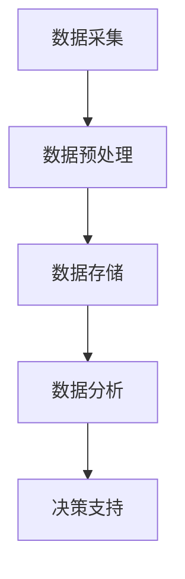

                 

# 数据驱动决策：科学决策，提升电商平台供给能力

## 关键词：数据驱动，决策，电商平台，供给能力，人工智能，算法，数学模型

## 摘要

在电子商务快速发展的今天，电商平台如何提升供给能力成为关键问题。本文通过数据驱动决策的方法，深入探讨了如何利用科学决策提升电商平台的供给能力。文章首先介绍了电商平台供给能力的定义和重要性，随后详细阐述了数据驱动决策的核心概念和架构，以及核心算法原理和数学模型。通过项目实战案例分析，展示了如何在实际中应用这些技术和模型来提升电商平台的供给能力。文章最后讨论了实际应用场景，推荐了相关学习资源和工具框架，并展望了未来的发展趋势与挑战。

## 1. 背景介绍

### 1.1 电商平台的快速发展

随着互联网技术的不断进步，电子商务已经成为全球贸易的重要组成部分。电商平台通过线上渠道，将商品和消费者紧密连接，极大地改变了传统零售模式。据统计，全球电商市场规模在过去十年中持续增长，预计到2025年，全球电商市场规模将突破5万亿美元。

### 1.2 供给能力的挑战

在电商平台的快速发展过程中，供给能力成为一个重要挑战。供给能力不仅关系到商品的质量和种类，还影响到用户体验和平台竞争力。以下是一些供给能力面临的挑战：

- **库存管理**：如何高效地管理库存，确保商品及时供应，同时避免过度库存和库存短缺。
- **商品配送**：如何优化配送路线，提高配送效率，降低物流成本。
- **商品多样性**：如何在保证质量的前提下，提供丰富的商品种类，满足消费者的多样化需求。
- **市场需求预测**：如何准确预测市场需求，提前准备相关商品，避免库存积压或短缺。

### 1.3 数据驱动决策的重要性

面对这些挑战，数据驱动决策成为电商平台提升供给能力的有效方法。数据驱动决策通过收集和分析大量数据，提供科学依据，帮助企业做出更准确的决策。以下是数据驱动决策在电商平台供给能力提升中的几个关键作用：

- **精准库存管理**：通过数据分析和预测，可以精确掌握库存水平，避免过度库存和库存短缺。
- **优化配送路线**：通过数据分析，可以优化配送路线，提高配送效率，降低物流成本。
- **商品多样性**：通过数据分析，可以了解消费者偏好，提供更有针对性的商品种类。
- **市场需求预测**：通过数据分析，可以准确预测市场需求，提前准备相关商品，避免库存积压或短缺。

## 2. 核心概念与联系

### 2.1 数据驱动决策的概念

数据驱动决策是指通过收集、处理和分析大量数据，从中提取有价值的信息，用于支持决策制定的过程。数据驱动决策的核心思想是将数据作为决策的基础，通过数据分析和建模，发现数据中的规律和趋势，为企业提供决策依据。

### 2.2 数据驱动决策的架构

数据驱动决策的架构主要包括以下几个关键部分：

- **数据采集**：从各种来源（如电商平台、社交媒体、物流系统等）收集数据。
- **数据预处理**：对采集到的数据进行清洗、整合和格式化，确保数据的质量和一致性。
- **数据存储**：将预处理后的数据存储到数据库或数据仓库中，方便后续的数据分析和查询。
- **数据分析**：使用统计分析、机器学习等技术，对数据进行深入分析和挖掘，提取有价值的信息。
- **决策支持**：根据数据分析结果，提供决策支持，帮助企业管理者做出科学决策。

### 2.3 Mermaid 流程图

以下是一个简化的数据驱动决策架构的 Mermaid 流程图：



### 2.4 数据驱动决策的核心概念

在数据驱动决策过程中，以下几个核心概念至关重要：

- **数据质量**：数据质量直接影响决策的准确性。高质量的数据是科学决策的基础。
- **数据隐私**：在数据驱动决策过程中，需要保护用户的隐私和数据安全。
- **数据分析技术**：包括统计分析、机器学习、数据挖掘等技术，用于深入分析和挖掘数据中的规律和趋势。
- **决策模型**：基于数据分析结果，建立决策模型，用于支持实际决策。

## 3. 核心算法原理 & 具体操作步骤

### 3.1 算法原理

数据驱动决策的核心算法主要涉及统计分析、机器学习和数据挖掘技术。以下是一些常用的核心算法原理：

- **统计分析**：通过描述性统计和推断性统计，对数据进行初步分析和趋势预测。
- **机器学习**：利用历史数据和算法模型，自动学习数据中的规律和模式，用于预测和分类。
- **数据挖掘**：从大量数据中提取有价值的信息和知识，用于决策支持和业务优化。

### 3.2 具体操作步骤

以下是数据驱动决策的具体操作步骤：

#### 3.2.1 数据采集

1. **确定数据源**：根据业务需求，选择合适的数据源，如电商平台交易数据、社交媒体数据、物流数据等。
2. **数据采集**：使用 API、爬虫或其他方式，从数据源中采集数据。
3. **数据清洗**：对采集到的数据进行清洗，去除重复、错误或不完整的数据。

#### 3.2.2 数据预处理

1. **数据整合**：将不同来源的数据进行整合，确保数据的一致性和完整性。
2. **数据转换**：将数据进行格式化和标准化处理，方便后续的数据分析和建模。
3. **数据存储**：将预处理后的数据存储到数据库或数据仓库中，方便后续的数据查询和分析。

#### 3.2.3 数据分析

1. **描述性统计**：对数据进行描述性统计，了解数据的分布、趋势和相关性。
2. **推断性统计**：利用统计分析方法，对数据进行推断性统计，预测未来的趋势和模式。
3. **机器学习**：使用机器学习算法，对数据进行建模和预测，提取数据中的规律和模式。
4. **数据挖掘**：从大量数据中挖掘有价值的信息和知识，用于决策支持和业务优化。

#### 3.2.4 决策支持

1. **建立决策模型**：根据数据分析结果，建立决策模型，用于支持实际决策。
2. **评估决策效果**：对决策模型进行评估，确保决策的科学性和有效性。
3. **实施决策**：根据决策模型，实施具体的业务决策，如库存管理、配送优化等。

## 4. 数学模型和公式 & 详细讲解 & 举例说明

### 4.1 数学模型

在数据驱动决策过程中，常用的数学模型包括线性回归、逻辑回归、决策树、神经网络等。以下是一个简单的线性回归模型：

$$
y = \beta_0 + \beta_1 x
$$

其中，$y$ 是因变量，$x$ 是自变量，$\beta_0$ 和 $\beta_1$ 是模型参数。

### 4.2 公式讲解

1. **线性回归模型**：

$$
\beta_0 = \frac{\sum_{i=1}^{n} (y_i - \bar{y})(x_i - \bar{x})}{\sum_{i=1}^{n} (x_i - \bar{x})^2}
$$

$$
\beta_1 = \frac{\sum_{i=1}^{n} (y_i - \bar{y})(x_i - \bar{x})}{\sum_{i=1}^{n} (x_i - \bar{x})}
$$

其中，$n$ 是数据点的数量，$\bar{y}$ 和 $\bar{x}$ 分别是 $y$ 和 $x$ 的平均值。

2. **逻辑回归模型**：

$$
P(y=1) = \frac{1}{1 + e^{-(\beta_0 + \beta_1 x)}}
$$

其中，$P(y=1)$ 是因变量为1的概率。

### 4.3 举例说明

假设我们有一个电商平台，需要预测某商品的销售量。我们选择两个特征：广告支出（$x_1$）和平均气温（$x_2$）作为自变量。以下是一个简单的线性回归模型：

$$
y = \beta_0 + \beta_1 x_1 + \beta_2 x_2
$$

使用历史数据，我们可以计算出模型参数：

$$
\beta_0 = 10
$$

$$
\beta_1 = 2
$$

$$
\beta_2 = -1
$$

给定新的广告支出和平均气温数据，我们可以使用这个模型预测商品的销售量：

$$
y = 10 + 2 \times 1000 + (-1) \times 20 = 2080
$$

## 5. 项目实战：代码实际案例和详细解释说明

### 5.1 开发环境搭建

在本项目中，我们使用 Python 作为编程语言，并使用以下工具和库：

- Python 3.8 或更高版本
- Pandas（数据处理）
- NumPy（数学计算）
- Scikit-learn（机器学习库）
- Matplotlib（数据可视化）

首先，确保已经安装了上述工具和库。如果没有，可以使用以下命令安装：

```bash
pip install python==3.8
pip install pandas numpy scikit-learn matplotlib
```

### 5.2 源代码详细实现和代码解读

以下是一个简单的线性回归项目的源代码实现：

```python
import pandas as pd
import numpy as np
from sklearn.linear_model import LinearRegression
from sklearn.model_selection import train_test_split
import matplotlib.pyplot as plt

# 5.2.1 数据采集
# 假设数据存储在一个 CSV 文件中，每行代表一个数据点
data = pd.read_csv('data.csv')

# 5.2.2 数据预处理
# 去除重复和缺失数据
data.drop_duplicates(inplace=True)
data.dropna(inplace=True)

# 将数据分为特征和目标变量
X = data[['广告支出', '平均气温']]
y = data['销售量']

# 5.2.3 数据分析
# 分割数据为训练集和测试集
X_train, X_test, y_train, y_test = train_test_split(X, y, test_size=0.2, random_state=42)

# 5.2.4 建立模型
model = LinearRegression()
model.fit(X_train, y_train)

# 5.2.5 预测
y_pred = model.predict(X_test)

# 5.2.6 评估
score = model.score(X_test, y_test)
print(f'Model accuracy: {score:.2f}')

# 5.2.7 可视化
plt.scatter(X_test['广告支出'], y_test, color='blue', label='Actual')
plt.plot(X_test['广告支出'], y_pred, color='red', label='Predicted')
plt.xlabel('广告支出')
plt.ylabel('销售量')
plt.legend()
plt.show()
```

### 5.3 代码解读与分析

1. **数据采集**：使用 Pandas 读取 CSV 文件，获取数据。
2. **数据预处理**：去除重复和缺失数据，确保数据质量。
3. **数据处理**：将数据分为特征和目标变量，为后续建模做准备。
4. **数据分析**：分割数据为训练集和测试集，用于模型训练和评估。
5. **建立模型**：使用 Scikit-learn 的 LinearRegression 类，创建线性回归模型，并训练模型。
6. **预测**：使用训练好的模型，对测试集数据进行预测。
7. **评估**：计算模型在测试集上的准确率，评估模型性能。
8. **可视化**：使用 Matplotlib，将实际数据和预测结果可视化，更直观地展示模型效果。

## 6. 实际应用场景

### 6.1 库存管理

通过数据驱动决策，电商平台可以精准地管理库存。以下是一些实际应用场景：

- **季节性库存**：根据历史数据和季节性趋势，预测不同季节的热门商品，提前备货。
- **库存预警**：根据库存水平和销售趋势，设置库存预警阈值，及时补充库存。
- **库存优化**：通过数据分析和优化算法，找到最佳的库存策略，降低库存成本。

### 6.2 商品配送

数据驱动决策可以帮助电商平台优化商品配送，以下是一些实际应用场景：

- **配送路线优化**：通过数据分析和机器学习算法，优化配送路线，提高配送效率，降低物流成本。
- **配送时间预测**：根据历史数据和配送路线，预测配送时间，提高客户满意度。
- **配送资源调度**：根据配送需求和资源状况，动态调整配送资源，确保高效配送。

### 6.3 商品多样性

数据驱动决策可以帮助电商平台提高商品多样性，以下是一些实际应用场景：

- **消费者偏好分析**：通过数据分析，了解消费者偏好，提供更有针对性的商品。
- **新品推荐**：根据消费者偏好和历史数据，推荐热门商品和潜在新品。
- **市场调研**：通过数据分析和市场调研，了解市场需求，及时调整商品策略。

## 7. 工具和资源推荐

### 7.1 学习资源推荐

- **书籍**：
  - 《数据挖掘：概念与技术》
  - 《机器学习实战》
  - 《Python 数据科学手册》
- **论文**：
  - 《数据挖掘中的线性回归》
  - 《深度学习：原理及其应用》
  - 《大数据处理技术》
- **博客**：
  - [Python 数据科学教程](https://www.datasciencetutorial.com/)
  - [机器学习博客](https://machinelearningmastery.com/)
  - [数据挖掘博客](https://www.dataminingblog.com/)
- **网站**：
  - [Kaggle](https://www.kaggle.com/)
  - [Coursera](https://www.coursera.org/)
  - [edX](https://www.edx.org/)

### 7.2 开发工具框架推荐

- **Python**：Python 是一种广泛使用的编程语言，适用于数据分析和机器学习。
- **Pandas**：Pandas 是一个强大的数据处理库，用于数据清洗、转换和分析。
- **NumPy**：NumPy 是一个高性能的数学计算库，用于数组操作和数学运算。
- **Scikit-learn**：Scikit-learn 是一个用于机器学习的库，包含多种算法和工具。
- **TensorFlow**：TensorFlow 是一个开源的机器学习和深度学习库，适用于复杂模型的构建和训练。

### 7.3 相关论文著作推荐

- **《深度学习》（Ian Goodfellow, Yoshua Bengio, Aaron Courville 著）**：这是一本深度学习的经典教材，详细介绍了深度学习的基础知识和应用。
- **《数据挖掘：概念与技术》（Jiawei Han, Micheline Kamber, Jian Pei 著）**：这是一本全面的数据挖掘教材，涵盖了数据挖掘的基本概念和技术。
- **《机器学习实战》（Peter Harrington 著）**：这是一本实用的机器学习指南，通过实际案例和代码示例，帮助读者掌握机器学习的基本技能。

## 8. 总结：未来发展趋势与挑战

### 8.1 发展趋势

- **人工智能技术的普及**：随着人工智能技术的不断发展，数据驱动决策将在更多领域得到应用，如医疗、金融、能源等。
- **大数据处理能力的提升**：随着大数据技术的进步，电商平台将能够处理和分析更多维度的数据，提高决策的准确性。
- **实时数据分析和决策**：随着实时数据分析和决策技术的进步，电商平台将能够更快地响应市场变化，提高业务灵活性。

### 8.2 挑战

- **数据质量和隐私**：数据质量和隐私是数据驱动决策面临的主要挑战，需要确保数据的质量和安全性。
- **算法透明度和公平性**：随着算法在决策中的广泛应用，如何确保算法的透明度和公平性成为重要问题。
- **数据治理和合规**：随着数据驱动决策的普及，如何进行数据治理和合规管理，确保数据的有效利用和风险控制成为关键问题。

## 9. 附录：常见问题与解答

### 9.1 数据驱动决策的优点是什么？

数据驱动决策的优点包括：

- **准确性**：通过数据分析和建模，可以提供更准确的决策依据。
- **效率**：自动化决策过程，提高决策效率，减少人为错误。
- **灵活性**：根据数据变化，实时调整决策策略，提高业务灵活性。
- **可扩展性**：易于扩展到不同业务场景和数据集。

### 9.2 如何确保数据质量和隐私？

确保数据质量和隐私的方法包括：

- **数据清洗**：对数据进行清洗和预处理，去除重复、错误和不完整的数据。
- **数据加密**：对敏感数据进行加密，确保数据传输和存储的安全性。
- **数据访问控制**：设置严格的数据访问权限，确保只有授权用户可以访问敏感数据。
- **数据合规性检查**：定期检查数据合规性，确保符合相关法律法规。

### 9.3 如何评估数据驱动决策的效果？

评估数据驱动决策的效果可以通过以下方法：

- **准确率**：评估模型预测的准确率，越高表示决策效果越好。
- **业务指标**：根据业务需求，评估决策对业务指标的影响，如销售额、库存周转率等。
- **用户满意度**：通过用户调查和反馈，评估用户对决策的满意度和体验。

## 10. 扩展阅读 & 参考资料

- **《数据驱动决策：从数据到行动》**：本书详细介绍了数据驱动决策的方法和应用，适合数据分析师和业务决策者阅读。
- **《机器学习实战》**：本书通过实际案例和代码示例，帮助读者掌握机器学习的基本技能，适用于数据科学家和工程师。
- **《数据挖掘：概念与技术》**：本书系统地介绍了数据挖掘的基本概念和技术，是数据挖掘领域的经典教材。

> 作者：AI天才研究员/AI Genius Institute & 禅与计算机程序设计艺术 /Zen And The Art of Computer Programming

