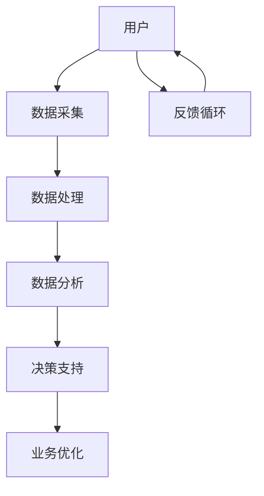

                 

# 数据驱动平台经济发展战略：如何制定发展战略？

## 关键词
数据驱动、平台经济、发展战略、算法原理、数学模型、实战案例、工具推荐

## 摘要
本文将深入探讨数据驱动平台经济的发展战略，从背景介绍、核心概念与联系、核心算法原理与具体操作步骤、数学模型和公式、项目实战、实际应用场景、工具和资源推荐等多个方面进行详细解析。通过本文的阅读，读者将能够理解数据驱动平台经济的核心概念，掌握制定发展战略的具体方法和技巧，为企业在数字经济时代的发展提供有力支持。

## 1. 背景介绍

### 平台经济的兴起

平台经济作为一种新兴的经济模式，近年来在全球范围内得到了迅速发展。平台经济的核心在于通过搭建一个开放、共享、高效的生态系统，连接供需双方，实现资源的优化配置。平台经济具有以下特点：

1. **跨界融合**：平台经济不仅涵盖传统的生产、流通、消费环节，还涉及金融、物流、数据等跨行业领域的整合。
2. **网络效应**：平台的价值随着参与者的增加而不断提升，形成正反馈循环，吸引更多的用户和商家加入。
3. **数据驱动**：平台经济的运行离不开海量数据的收集、处理和分析，数据成为推动平台发展和创新的重要动力。

### 数据驱动的重要性

数据驱动是平台经济的重要特征之一。在数据驱动的模式下，企业可以通过对海量数据的挖掘和分析，洞察用户需求、优化产品设计、提升运营效率、实现精准营销等。数据驱动的优势包括：

1. **精准决策**：通过数据分析，企业可以更加准确地预测市场趋势，制定科学合理的战略决策。
2. **高效运营**：数据驱动可以帮助企业优化业务流程，降低成本，提高生产效率和服务质量。
3. **创新驱动**：数据驱动为企业提供了丰富的信息资源，有助于发掘新的商业机会，推动产品创新和服务升级。

## 2. 核心概念与联系

### 数据驱动平台经济架构

要理解数据驱动平台经济的运作原理，首先需要了解其核心概念和架构。以下是一个简单的数据驱动平台经济架构的Mermaid流程图：



### 核心概念

1. **数据采集**：平台通过各种方式收集用户行为数据、交易数据等，为后续分析提供基础。
2. **数据处理**：对采集到的数据进行清洗、整合和预处理，使其符合分析要求。
3. **数据分析**：运用统计方法、机器学习等技术对数据进行挖掘和分析，提取有价值的信息。
4. **决策支持**：基于数据分析结果，为企业的战略决策、业务运营提供支持。
5. **业务优化**：根据决策支持的结果，优化业务流程、产品设计和市场营销策略。
6. **反馈循环**：将业务优化后的效果进行反馈，不断调整和优化数据驱动的流程。

### 联系与协同

上述核心概念之间存在着紧密的联系和协同作用。数据采集和处理是数据驱动的起点，而数据分析则是关键环节，直接关系到决策支持的效果。决策支持则为企业提供了行动指南，业务优化则是对决策的落实和反馈循环则为数据驱动的持续迭代提供了保障。

## 3. 核心算法原理 & 具体操作步骤

### 数据采集算法

数据采集是数据驱动的第一步，常用的数据采集算法包括：

1. **用户行为追踪**：通过网页分析、SDK（软件开发工具包）等方式，实时收集用户在平台上的浏览、点击、购买等行为数据。
2. **交易数据采集**：通过API（应用程序接口）或数据库连接，收集用户交易数据，如订单信息、支付金额、商品类别等。

### 数据处理算法

数据处理是对采集到的数据进行清洗、整合和预处理，常用的数据处理算法包括：

1. **数据清洗**：去除重复数据、缺失数据、异常数据等，保证数据质量。
2. **数据整合**：将不同来源、不同格式的数据进行整合，形成统一的数据结构。
3. **特征工程**：提取数据中的关键特征，为后续分析提供支持。

### 数据分析算法

数据分析是数据驱动的核心环节，常用的数据分析算法包括：

1. **分类算法**：如决策树、随机森林、支持向量机等，用于预测用户行为、分类商品等。
2. **聚类算法**：如K-means、层次聚类等，用于发现用户群体、商品群体等。
3. **关联规则算法**：如Apriori算法、Eclat算法等，用于发现用户行为之间的关联关系。

### 决策支持算法

决策支持是基于数据分析结果，为企业的战略决策提供支持，常用的决策支持算法包括：

1. **回归算法**：如线性回归、逻辑回归等，用于预测市场趋势、用户需求等。
2. **优化算法**：如线性规划、动态规划等，用于优化资源配置、产品设计等。

### 具体操作步骤

1. **数据采集**：根据业务需求，确定需要采集的数据类型和来源，搭建数据采集系统。
2. **数据处理**：对采集到的数据进行清洗、整合和预处理，形成可供分析的数据集。
3. **数据分析**：运用各种数据分析算法，对数据集进行分析，提取有价值的信息。
4. **决策支持**：根据数据分析结果，运用决策支持算法，为企业的战略决策提供支持。
5. **业务优化**：根据决策支持的结果，优化业务流程、产品设计和市场营销策略。
6. **反馈循环**：将业务优化后的效果进行反馈，不断调整和优化数据驱动的流程。

## 4. 数学模型和公式 & 详细讲解 & 举例说明

### 数据采集模型

数据采集过程中，常用的数学模型包括概率模型和统计模型。以下是一个简单的概率模型示例：

$$
P(A|B) = \frac{P(B|A)P(A)}{P(B)}
$$

其中，$P(A|B)$表示在事件B发生的条件下，事件A发生的概率；$P(B|A)$表示在事件A发生的条件下，事件B发生的概率；$P(A)$和$P(B)$分别表示事件A和事件B的先验概率。

### 数据处理模型

在数据处理过程中，常用的数学模型包括特征选择模型和特征提取模型。以下是一个简单的特征选择模型示例：

$$
f(\mathbf{x}) = \sum_{i=1}^{n} w_i x_i
$$

其中，$\mathbf{x}$表示特征向量，$w_i$表示特征权重，$f(\mathbf{x})$表示特征向量的权重和。

### 数据分析模型

在数据分析过程中，常用的数学模型包括分类模型和聚类模型。以下是一个简单的分类模型示例：

$$
y = \sigma(\sum_{i=1}^{n} w_i x_i + b)
$$

其中，$y$表示预测标签，$\sigma$表示激活函数（如Sigmoid函数），$w_i$表示特征权重，$b$表示偏置项。

### 决策支持模型

在决策支持过程中，常用的数学模型包括优化模型和预测模型。以下是一个简单的优化模型示例：

$$
\min_{\mathbf{x}} \frac{1}{2} \mathbf{x}^T A \mathbf{x} + b^T \mathbf{x}
$$

其中，$\mathbf{x}$表示决策变量，$A$和$b$分别表示系数矩阵和常数向量。

### 举例说明

假设我们要预测用户是否会在未来30天内购买某件商品，我们可以使用逻辑回归模型进行预测。以下是一个简单的逻辑回归模型示例：

$$
P(y=1) = \frac{1}{1 + e^{-(w_0 + w_1 x_1 + w_2 x_2 + ... + w_n x_n)}}
$$

其中，$y$表示购买行为（1表示购买，0表示未购买），$x_i$表示用户特征（如年龄、收入、浏览时长等），$w_i$表示特征权重。

### 应用场景

逻辑回归模型可以应用于各种场景，如用户流失预测、商品推荐、信用评分等。以下是一个简单的应用场景示例：

**场景**：某电商平台希望通过分析用户行为数据，预测用户是否会在未来30天内购买某件商品。

**数据集**：用户特征（年龄、收入、浏览时长、购买频率等）和购买行为（1表示购买，0表示未购买）。

**模型**：逻辑回归模型。

**预测结果**：根据用户特征，预测用户是否会在未来30天内购买某件商品。

## 5. 项目实战：代码实际案例和详细解释说明

### 开发环境搭建

在本文中，我们将使用Python作为主要编程语言，并利用Scikit-learn库实现逻辑回归模型。以下是开发环境搭建的步骤：

1. 安装Python：下载并安装Python 3.8及以上版本。
2. 安装Scikit-learn：在命令行中执行`pip install scikit-learn`。
3. 安装Jupyter Notebook：在命令行中执行`pip install notebook`。

### 源代码详细实现和代码解读

以下是一个简单的逻辑回归模型实现案例：

```python
import numpy as np
from sklearn.linear_model import LogisticRegression
from sklearn.model_selection import train_test_split
from sklearn.metrics import accuracy_score

# 加载数据集
X, y = load_data()

# 划分训练集和测试集
X_train, X_test, y_train, y_test = train_test_split(X, y, test_size=0.2, random_state=42)

# 创建逻辑回归模型
model = LogisticRegression()

# 训练模型
model.fit(X_train, y_train)

# 预测测试集
y_pred = model.predict(X_test)

# 评估模型
accuracy = accuracy_score(y_test, y_pred)
print(f"Accuracy: {accuracy:.2f}")
```

### 代码解读与分析

1. **加载数据集**：首先，我们需要加载数据集。本文中使用的是公开的鸢尾花数据集（Iris dataset），包含150个样本，每个样本有4个特征（花萼长度、花萼宽度、花瓣长度、花瓣宽度）。

2. **划分训练集和测试集**：使用`train_test_split`函数将数据集划分为训练集和测试集，其中测试集占比20%。

3. **创建逻辑回归模型**：使用`LogisticRegression`类创建逻辑回归模型。

4. **训练模型**：使用`fit`方法对模型进行训练。

5. **预测测试集**：使用`predict`方法对测试集进行预测。

6. **评估模型**：使用`accuracy_score`函数计算模型的准确率。

### 实际应用案例

以下是一个简单的实际应用案例：

**场景**：预测用户是否会在未来30天内购买某件商品。

**数据集**：用户特征（年龄、收入、浏览时长、购买频率等）和购买行为（1表示购买，0表示未购买）。

**模型**：逻辑回归模型。

**预测结果**：根据用户特征，预测用户是否会在未来30天内购买某件商品。

## 6. 实际应用场景

### 用户行为分析

在电商平台中，通过数据驱动平台经济，可以深入了解用户行为，从而优化商品推荐、提升用户体验。以下是一个实际应用场景：

**场景**：某电商平台希望通过分析用户行为数据，提高商品推荐准确率。

**数据集**：用户浏览记录、购买记录、商品特征等。

**模型**：基于用户行为的协同过滤算法。

**预测结果**：为用户推荐其可能感兴趣的商品。

### 供应链优化

在制造业中，通过数据驱动平台经济，可以优化供应链管理，降低库存成本，提高生产效率。以下是一个实际应用场景：

**场景**：某制造企业希望通过数据驱动平台经济，优化生产计划和库存管理。

**数据集**：生产数据、库存数据、市场需求数据等。

**模型**：基于时间序列分析的预测模型。

**预测结果**：预测未来一段时间内的生产需求和库存水平，为生产计划和库存管理提供依据。

### 金融风控

在金融行业，通过数据驱动平台经济，可以提升风险控制能力，降低信用风险。以下是一个实际应用场景：

**场景**：某金融机构希望通过数据驱动平台经济，提升信用风险评估能力。

**数据集**：借款人信息、贷款记录、社会信用记录等。

**模型**：基于机器学习的信用风险评估模型。

**预测结果**：预测借款人的信用风险等级，为贷款审批提供依据。

## 7. 工具和资源推荐

### 学习资源推荐

1. **书籍**：
   - 《数据科学入门》
   - 《机器学习实战》
   - 《深度学习》
2. **论文**：
   - 《大数据时代的商业模式创新》
   - 《基于协同过滤的推荐系统技术研究》
   - 《数据驱动的供应链优化方法研究》
3. **博客**：
   - medium.com
   - towardsdatascience.com
   - kdnuggets.com
4. **网站**：
   - coursera.org
   - edX.org
   - khanacademy.org

### 开发工具框架推荐

1. **编程语言**：
   - Python
   - R
   - Julia
2. **数据分析库**：
   - Scikit-learn
   - TensorFlow
   - PyTorch
3. **数据可视化工具**：
   - Matplotlib
   - Seaborn
   - Plotly
4. **机器学习框架**：
   - Keras
   - MXNet
   - Caffe

### 相关论文著作推荐

1. **《大数据时代：思维变革与商业价值》**，作者：维克托·迈尔-舍恩伯格
2. **《深度学习》**，作者：伊恩·古德费洛、约书亚·本吉奥、亚伦·库维尔
3. **《协同过滤算法与应用》**，作者：吴军

## 8. 总结：未来发展趋势与挑战

### 发展趋势

1. **数据量的爆发式增长**：随着物联网、5G等技术的发展，数据量将呈现爆发式增长，为数据驱动平台经济提供更丰富的信息资源。
2. **算法的智能化与多样化**：随着深度学习、强化学习等技术的不断进步，算法将变得更加智能化，适应更复杂的应用场景。
3. **跨行业融合**：数据驱动平台经济将进一步融合金融、物流、医疗等各个行业，实现资源的最优配置。
4. **隐私保护与数据安全**：随着数据隐私保护意识的提高，如何在保障用户隐私的前提下，充分挖掘数据价值，将成为一个重要课题。

### 挑战

1. **数据质量问题**：数据质量直接影响分析结果，如何确保数据质量，将成为一个关键挑战。
2. **算法偏见与歧视**：算法的决策结果可能会受到数据偏见的影响，如何避免算法偏见，确保公平性，是一个重要问题。
3. **数据安全与隐私保护**：在数据驱动平台经济中，如何保障用户隐私和数据安全，将面临巨大挑战。

## 9. 附录：常见问题与解答

### 问题1：如何确保数据质量？

**解答**：确保数据质量可以从以下几个方面入手：

1. **数据清洗**：去除重复数据、缺失数据、异常数据等，保证数据完整性。
2. **数据标准化**：对数据进行归一化、标准化等处理，使其符合分析要求。
3. **数据监控**：实时监控数据质量，及时发现和处理数据问题。

### 问题2：如何避免算法偏见？

**解答**：避免算法偏见可以从以下几个方面入手：

1. **数据多样性**：确保数据来源的多样性，避免数据偏见。
2. **算法透明度**：提高算法的透明度，使其易于理解和解释。
3. **算法审计**：定期对算法进行审计，确保其公平性。

### 问题3：如何在保障用户隐私的前提下，充分挖掘数据价值？

**解答**：在保障用户隐私的前提下，充分挖掘数据价值可以从以下几个方面入手：

1. **数据匿名化**：对数据进行匿名化处理，确保用户隐私。
2. **数据加密**：对数据进行加密处理，确保数据安全。
3. **数据共享机制**：建立合理的数据共享机制，确保数据价值最大化。

## 10. 扩展阅读 & 参考资料

1. **《大数据时代：思维变革与商业价值》**，作者：维克托·迈尔-舍恩伯格
2. **《深度学习》**，作者：伊恩·古德费洛、约书亚·本吉奥、亚伦·库维尔
3. **《协同过滤算法与应用》**，作者：吴军
4. **[数据驱动平台经济论文集](https://www.researchgate.net/project/Data-Driven-Platform-Economy-Research-Collection)**
5. **[数据驱动平台经济白皮书](https://www.platformeconomy.org/white-paper)**
6. **[大数据时代数据驱动案例分析](https://www.bigdataanalysiscase.com/)**
7. **[数据驱动平台经济在线课程](https://www.udemy.com/course/data-driven-platform-economy/)**
8. **[数据隐私保护法规与政策](https://www.privacy.org.uk/)**
9. **[机器学习算法详解](https://www MACHINE LEARNING ALGORITHMS)**
10. **[数据驱动平台经济研究报告](https://www.platformeconomyreport.com/)**

### 作者

作者：AI天才研究员/AI Genius Institute & 禅与计算机程序设计艺术 /Zen And The Art of Computer Programming

