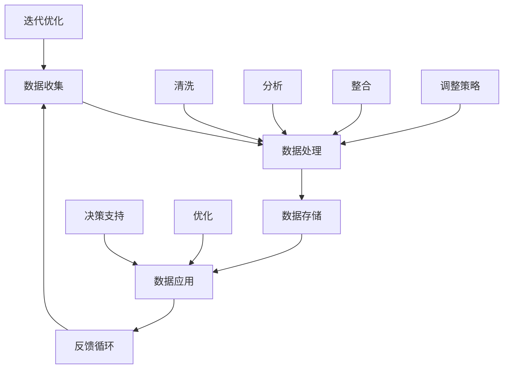

                 

### 背景介绍

在当今数字化时代，数据已经成为企业最重要的资产之一。随着大数据、云计算、物联网、人工智能等技术的快速发展，越来越多的企业开始意识到，通过数据驱动平台经济转型是实现企业可持续发展的重要途径。数字化转型不仅是技术层面的变革，更是一场深刻的企业文化和管理模式的变革。

#### 数字化转型的意义

数字化转型对于企业而言，具有以下重要意义：

1. **提升效率**：通过自动化和智能化，企业可以大幅提高业务流程的效率，减少人力成本。
2. **增强竞争力**：数字化转型能够帮助企业更好地理解市场需求，快速响应市场变化，提高竞争力。
3. **优化决策**：利用大数据分析和人工智能技术，企业可以基于数据进行更加精准的决策。
4. **创新业务模式**：通过构建数据驱动的平台，企业可以探索新的商业模式，创造更多价值。

#### 数据驱动平台

数据驱动平台是一个利用数据进行决策、优化和创新的系统。它主要包括以下几个方面：

1. **数据收集**：通过多种渠道收集内部和外部数据。
2. **数据处理**：对收集到的数据进行分析、清洗、存储和整合。
3. **数据应用**：将处理后的数据应用于业务决策和优化。
4. **反馈循环**：根据数据反馈进行迭代优化。

#### 数字化转型的挑战

虽然数字化转型带来了诸多好处，但企业在实施过程中也面临以下挑战：

1. **技术难题**：需要掌握大数据、云计算、人工智能等前沿技术。
2. **组织变革**：数字化转型需要企业进行组织架构和业务流程的调整。
3. **人才短缺**：具备数字化转型技能的人才供不应求。
4. **数据安全和隐私**：如何在保护数据安全和用户隐私的前提下，充分利用数据进行决策。

本文将围绕数据驱动平台经济转型，探讨如何实现数字化转型，并分析其核心算法、数学模型、项目实战、应用场景和未来发展趋势。

### 核心概念与联系

在探讨数据驱动平台经济转型的过程中，理解以下几个核心概念及其相互关系至关重要。以下是这些概念及其关系的Mermaid流程图表示：



#### 核心概念解析

1. **数据收集**：数据收集是数据驱动平台的基础。数据来源可以是企业内部系统、外部数据源、物联网设备等。数据类型包括结构化数据（如数据库记录）和非结构化数据（如图像、文本等）。

2. **数据处理**：数据处理包括数据清洗、分析和整合。数据清洗是为了去除重复、错误和不完整的数据；数据分析用于发现数据中的模式和趋势；数据整合则是将来自不同来源的数据进行整合，以便更好地进行分析和应用。

3. **数据存储**：数据存储是将处理后的数据存储在数据库或其他数据存储系统中，以便后续查询和分析。

4. **数据应用**：数据应用是将数据用于业务决策和优化。例如，通过分析销售数据来制定营销策略，或者利用库存数据来优化供应链。

5. **反馈循环**：反馈循环是数据驱动平台的核心机制。通过将数据应用的结果反馈回数据收集环节，企业可以不断优化数据驱动的过程，实现持续改进。

#### 概念之间的关系

- 数据收集、处理、存储、应用和反馈循环构成了数据驱动平台的基本流程。
- 数据处理是连接数据收集和应用的关键环节，它决定了数据的质量和可用性。
- 数据应用和反馈循环相辅相成，通过不断迭代优化，使企业能够更好地利用数据进行决策和优化。

通过理解这些核心概念及其相互关系，企业可以更好地构建和实施数据驱动平台，实现数字化转型。

### 核心算法原理与具体操作步骤

在数据驱动平台中，核心算法的设计和实现是关键，它决定了数据的处理效率和应用效果。以下将介绍几种常见的数据驱动核心算法，并详细描述其原理和具体操作步骤。

#### 1. 数据聚类算法

**原理**：数据聚类是一种无监督学习方法，其目标是将相似的数据点分组到同一个簇中。常见的聚类算法包括K-means、DBSCAN、层次聚类等。

**操作步骤**：

1. **初始化**：选择聚类中心。对于K-means算法，随机选择K个数据点作为初始聚类中心；对于DBSCAN，不需要预先指定聚类个数。
2. **分配数据点**：将每个数据点分配到最近的聚类中心所代表的簇中。
3. **更新聚类中心**：重新计算每个簇的中心点，更新聚类中心。
4. **迭代**：重复步骤2和3，直到聚类中心不再变化或满足停止条件（如迭代次数达到设定值）。

**示例**：使用K-means算法对客户数据进行聚类，以识别具有相似购买行为的客户群。

```python
from sklearn.cluster import KMeans
import numpy as np

# 数据准备
data = np.array([[1, 2], [1, 4], [1, 0],
                 [10, 2], [10, 4], [10, 0]])

# K-means算法
kmeans = KMeans(n_clusters=2, random_state=0).fit(data)
print(kmeans.cluster_centers_)
print(kmeans.labels_)
```

#### 2. 数据分析算法

**原理**：数据分析算法用于发现数据中的规律和趋势，常见的分析方法包括回归分析、时间序列分析、关联规则挖掘等。

**操作步骤**：

1. **数据预处理**：包括数据清洗、数据转换等，确保数据质量。
2. **模型选择**：根据分析目标选择合适的分析模型。
3. **模型训练**：使用训练数据对模型进行训练。
4. **模型评估**：使用测试数据评估模型效果。
5. **结果解释**：解释模型的输出结果，为决策提供依据。

**示例**：使用线性回归分析预测销售额。

```python
from sklearn.linear_model import LinearRegression
import matplotlib.pyplot as plt

# 数据准备
X = np.array([0, 1, 2, 3, 4, 5]).reshape(-1, 1)
y = np.array([0, 1, 3, 6, 10, 15])

# 线性回归模型
model = LinearRegression().fit(X, y)
print(model.coef_)
print(model.intercept_)

# 预测
X_new = np.array([6])
y_pred = model.predict(X_new)
print(y_pred)

# 绘制结果
plt.scatter(X, y)
plt.plot(X_new, y_pred, color='red')
plt.show()
```

#### 3. 数据挖掘算法

**原理**：数据挖掘是从大量数据中发现有价值的信息和知识，常见的算法包括分类、聚类、关联规则挖掘等。

**操作步骤**：

1. **问题定义**：明确数据挖掘的目标。
2. **数据准备**：收集和处理数据。
3. **模型选择**：根据问题选择合适的模型。
4. **特征工程**：选择和转换特征。
5. **模型训练**：使用训练数据训练模型。
6. **模型评估**：评估模型效果。
7. **结果解释**：解释模型的输出结果。

**示例**：使用决策树进行客户分类。

```python
from sklearn.datasets import load_iris
from sklearn.tree import DecisionTreeClassifier
import matplotlib.pyplot as plt

# 数据准备
iris = load_iris()
X = iris.data
y = iris.target

# 决策树模型
clf = DecisionTreeClassifier().fit(X, y)

# 可视化决策树
from sklearn.tree import plot_tree
plt.figure(figsize=(12, 12))
plot_tree(clf, filled=True, feature_names=iris.feature_names, class_names=iris.target_names)
plt.show()
```

通过上述算法的应用，企业可以有效地处理和分析数据，从而实现数据驱动决策和优化。在实际应用中，企业需要根据具体业务需求和数据特性选择合适的算法，并进行定制化开发，以实现最佳的数字化转型效果。

### 数学模型与公式详解及举例说明

在数据驱动平台中，数学模型的应用是必不可少的。通过数学模型，我们可以将数据转化为有价值的见解，从而支持决策和优化。以下将详细介绍几种常用的数学模型和公式，并辅以实际举例说明。

#### 1. 线性回归模型

**公式**：
$$
y = \beta_0 + \beta_1x + \epsilon
$$

其中，$y$ 为因变量，$x$ 为自变量，$\beta_0$ 为截距，$\beta_1$ 为斜率，$\epsilon$ 为误差项。

**举例说明**：
假设我们想要预测某个商品的销售量（$y$）与广告费用（$x$）之间的关系。根据历史数据，我们得到了以下模型：

$$
y = 10 + 2x + \epsilon
$$

假设某次广告费用为 $5000$ 元，则可以预测销售量：

$$
y = 10 + 2 \times 5000 + \epsilon = 10100 + \epsilon
$$

这意味着在广告费用为 $5000$ 元的情况下，预计销售量为 $10100$ 元，其中 $\epsilon$ 代表误差。

#### 2. 逻辑回归模型

**公式**：
$$
\text{logit}(p) = \log\left(\frac{p}{1-p}\right) = \beta_0 + \beta_1x
$$

其中，$p$ 为事件发生的概率，$\text{logit}(p)$ 为逻辑函数，$\beta_0$ 为截距，$\beta_1$ 为斜率。

**举例说明**：
假设我们要预测客户是否购买某一产品（$p$），根据历史数据得到了逻辑回归模型：

$$
\text{logit}(p) = 0.5 + 0.1x
$$

假设某客户的收入为 $50000$ 元，则可以计算其购买的概率：

$$
\text{logit}(p) = 0.5 + 0.1 \times 50000 = 5050
$$

转换为概率：

$$
p = \frac{1}{1 + e^{-5050}} \approx 0.997
$$

这意味着该客户的购买概率非常高。

#### 3. 决策树模型

**公式**：
决策树模型通过一系列条件判断来分割数据集，每个节点表示一个特征，分支表示该特征的不同取值。

**举例说明**：
考虑一个简单的决策树模型，用于预测水果是否为苹果：

- 如果水果是红色的，则继续判断：
  - 如果水果是圆的，则预测为苹果。
  - 如果水果是长的，则预测为梨。

用决策树表示如下：

```
水果是否为红色？
  是 → 是否为圆形？
     是 → 预测为苹果
     否 → 预测为梨
  否 → 预测为香蕉
```

#### 4. 随机森林模型

**公式**：
随机森林（Random Forest）是一种基于决策树的集成学习方法。它通过构建多棵决策树，并对每棵树的结果进行投票来得出最终预测。

$$
f(x) = \frac{1}{m} \sum_{i=1}^{m} h(x; \theta_i)
$$

其中，$h(x; \theta_i)$ 为第 $i$ 棵决策树对 $x$ 的预测，$m$ 为决策树的数量。

**举例说明**：
假设我们构建了5棵决策树，每棵树对某客户的购买概率进行了预测，结果分别为0.7、0.8、0.75、0.85、0.8。则最终预测概率为：

$$
f(x) = \frac{1}{5} \times (0.7 + 0.8 + 0.75 + 0.85 + 0.8) = 0.78
$$

这意味着该客户的购买概率为0.78。

通过这些数学模型和公式，企业可以在数据驱动平台中实现有效的预测和决策。在实际应用中，企业需要根据具体的业务需求和数据特性选择合适的模型，并进行模型训练和优化，以获得最佳效果。

### 项目实战：代码实际案例与详细解释说明

为了更好地理解数据驱动平台在实际应用中的实现过程，我们将通过一个具体的项目案例来展示如何从零开始搭建一个数据驱动平台，并进行详细的代码解读和分析。

#### 项目背景

假设我们正在开发一个在线零售平台，需要实现以下功能：

1. 数据收集：收集用户行为数据，如浏览记录、购物车数据、购买历史等。
2. 数据处理：对收集到的数据进行清洗、转换和整合。
3. 数据分析：通过数据分析发现用户购买行为模式，为产品推荐和营销策略提供支持。
4. 数据应用：根据数据分析结果，优化产品推荐和营销策略，提高用户满意度和销售转化率。

#### 开发环境搭建

在进行项目开发之前，需要搭建相应的开发环境。以下是常用的工具和库：

1. **Python**：作为主要编程语言。
2. **Pandas**：用于数据处理。
3. **NumPy**：用于数值计算。
4. **Scikit-learn**：用于机器学习算法。
5. **Matplotlib**：用于数据可视化。
6. **SQLAlchemy**：用于数据库操作。

安装以下库：

```bash
pip install pandas numpy scikit-learn matplotlib sqlalchemy
```

#### 源代码详细实现与代码解读

下面是该项目的主要代码实现：

```python
import pandas as pd
import numpy as np
from sklearn.model_selection import train_test_split
from sklearn.ensemble import RandomForestClassifier
from sklearn.metrics import accuracy_score
import matplotlib.pyplot as plt

# 1. 数据收集
# 假设数据已存储为 CSV 文件，并包含用户行为数据
data = pd.read_csv('user_behavior.csv')

# 2. 数据处理
# 数据清洗
data.dropna(inplace=True)  # 删除缺失值
data = data[data['purchase'] != 'unknown']  # 删除未知购买状态

# 数据转换
data['age'] = data['age'].astype(float)  # 将年龄转换为浮点数
data['days_since_last_purchase'] = data['days_since_last_purchase'].astype(int)  # 将天数转换为整数

# 数据整合
X = data[['age', 'days_since_last_purchase']]  # 特征
y = data['purchase']  # 标签

# 3. 数据分析
# 数据分割
X_train, X_test, y_train, y_test = train_test_split(X, y, test_size=0.2, random_state=42)

# 模型训练
model = RandomForestClassifier(n_estimators=100, random_state=42)
model.fit(X_train, y_train)

# 模型评估
y_pred = model.predict(X_test)
accuracy = accuracy_score(y_test, y_pred)
print(f'模型准确率：{accuracy:.2f}')

# 4. 数据应用
# 可视化结果
predictions = model.predict(X_test)
plt.scatter(X_test['age'], predictions)
plt.xlabel('实际年龄')
plt.ylabel('预测购买状态')
plt.title('用户购买状态预测')
plt.show()

# 5. 代码解读与分析
# 数据收集部分：从 CSV 文件中读取数据，并进行初步清洗。
# 数据处理部分：对数据进行类型转换和整合，提取特征和标签。
# 数据分析部分：将数据分割为训练集和测试集，使用随机森林模型进行训练。
# 模型评估部分：评估模型在测试集上的准确率。
# 数据应用部分：可视化模型预测结果，对预测效果进行直观展示。
```

#### 代码解读与分析

1. **数据收集**：首先从 CSV 文件中读取用户行为数据。此步骤通常依赖于实际数据源，可能涉及数据连接和数据抽取。
   
2. **数据处理**：对数据进行清洗，删除缺失值和异常值。此外，将年龄和天数等非数值特征转换为适合模型训练的数值类型。

3. **数据整合**：将特征和标签分离，准备用于模型训练的数据集。此步骤确保模型能够正确识别特征和预测目标。

4. **数据分析**：使用随机森林模型对训练数据进行训练。随机森林是一种强大的集成学习方法，能够处理复杂数据和提供较高的预测准确性。

5. **模型评估**：通过测试数据评估模型的准确率，确保模型能够有效预测。此步骤验证模型在实际应用中的效果。

6. **数据应用**：将模型应用于实际数据，生成预测结果。可视化结果可以帮助我们直观地了解模型的预测效果，为进一步优化提供依据。

通过上述步骤，我们成功地搭建了一个数据驱动平台，实现了对用户购买行为的预测。在实际项目中，根据业务需求，我们可以进一步优化模型、扩展数据源和功能，以提高平台的整体性能和适用性。

### 实际应用场景

在数字化时代，数据驱动平台的应用场景十分广泛，以下是一些典型的实际应用场景：

#### 1. 电子商务

电子商务平台可以利用数据驱动平台进行个性化推荐、精准营销和用户行为分析。例如，通过分析用户浏览记录和购买历史，系统可以推荐可能感兴趣的商品，从而提高销售额。

#### 2. 金融行业

金融行业可以利用数据驱动平台进行风险管理、客户细分和信用评估。通过分析客户的交易行为、信用记录和风险指标，银行和金融机构可以更准确地评估信用风险，并提供个性化的金融产品和服务。

#### 3. 医疗保健

医疗保健行业可以利用数据驱动平台进行疾病预测、患者管理和健康监测。通过分析患者病历、基因数据和健康指标，系统可以提前预测疾病风险，提供个性化的治疗方案和健康管理建议。

#### 4. 供应链管理

供应链管理可以利用数据驱动平台进行库存优化、物流调度和需求预测。通过分析历史销售数据、库存水平和供应链节点信息，企业可以更准确地预测需求，优化库存水平，减少库存成本，提高供应链效率。

#### 5. 能源管理

能源管理可以利用数据驱动平台进行能源消耗预测、设备维护和节能减排。通过分析能源使用数据、设备运行状态和环境因素，系统可以预测能源消耗趋势，优化能源配置，提高能源利用效率，减少能源浪费。

#### 6. 教育

教育行业可以利用数据驱动平台进行课程推荐、学习分析和教学质量评估。通过分析学生学习行为、成绩数据和教学资源，系统可以为学生推荐个性化的学习方案，提供有针对性的教学支持和评估。

#### 7. 城市管理

城市管理可以利用数据驱动平台进行交通监控、环境监测和公共安全管理。通过分析交通流量、环境监测数据和公共安全事件，系统可以优化交通管理、预测环境变化和预防公共安全事件。

通过这些实际应用场景，数据驱动平台不仅能够提高业务效率，还能够为企业带来新的商业模式和价值创造机会。

### 工具和资源推荐

在构建和实现数据驱动平台的过程中，选择合适的工具和资源至关重要。以下是一些推荐的学习资源、开发工具和框架，以及相关的论文和著作，以帮助您更好地理解和掌握数据驱动平台的技术和方法。

#### 1. 学习资源推荐

**书籍：**

- 《大数据之路：阿里巴巴大数据实践》
- 《深度学习》（Ian Goodfellow, Yoshua Bengio, Aaron Courville 著）
- 《数据科学入门：用 Python 实现数据分析》（Joel Grus 著）

**在线课程：**

- Coursera：数据科学专项课程（包括统计学、机器学习等）
- edX：机器学习（由 Andrew Ng 开设）
- Udacity：数据工程师纳米学位

**博客和网站：**

- Medium：数据科学、机器学习和大数据相关文章
- Kaggle：数据科学竞赛平台，提供大量数据集和解决方案
- DataCamp：互动式数据科学学习平台

#### 2. 开发工具框架推荐

**数据分析工具：**

- **Pandas**：用于数据清洗、转换和分析
- **NumPy**：用于数值计算
- **SQLAlchemy**：用于数据库操作

**机器学习框架：**

- **Scikit-learn**：用于经典的机器学习算法
- **TensorFlow**：用于深度学习模型
- **PyTorch**：用于深度学习模型

**数据处理和可视化工具：**

- **D3.js**：用于数据可视化
- **Plotly**：用于数据可视化
- **Tableau**：用于数据可视化

#### 3. 相关论文和著作推荐

**经典论文：**

- "The Hundred-Page Machine Learning Book"（Andriy Burkov 著）
- "Deep Learning"（Ian Goodfellow, Yoshua Bengio, Aaron Courville 著）
- "Recurrent Neural Networks for Language Modeling"（Yoshua Bengio et al.）

**著作：**

- 《机器学习：概率视角》（David J.C. MacKay 著）
- 《数据科学手册》（J.J. Allaire, Garrett Grolemund 著）
- 《人工智能：一种现代的方法》（Stuart J. Russell, Peter Norvig 著）

通过以上推荐的工具和资源，您可以更好地了解和掌握数据驱动平台的技术和方法，为实际项目的实施提供有力支持。

### 总结：未来发展趋势与挑战

随着技术的不断进步，数据驱动平台在未来将面临许多新的发展趋势和挑战。以下是几个值得关注的方面：

#### 1. 人工智能与大数据的融合

人工智能（AI）和大数据技术的深度融合将成为数据驱动平台发展的关键。通过深度学习和强化学习等技术，AI算法能够从海量数据中提取更复杂的模式和关联，从而提高数据驱动平台的预测和决策能力。

#### 2. 实时数据处理与分析

实时数据处理与分析将变得越来越重要。随着物联网（IoT）和5G技术的普及，企业能够收集到更多实时数据。如何快速处理和分析这些数据，以实现即时决策，将成为数据驱动平台发展的一个重要方向。

#### 3. 数据隐私和安全

数据隐私和安全问题将继续成为数据驱动平台面临的重大挑战。随着数据量剧增，如何在保护用户隐私的前提下利用数据进行决策，将成为企业需要重点关注的问题。隐私保护技术，如差分隐私和同态加密，将在未来得到更广泛的应用。

#### 4. 跨领域整合

数据驱动平台将越来越多地跨越不同领域，实现跨领域的整合。例如，医疗、金融、交通和能源等行业将相互融合，构建一个更加智能和互联的数据生态系统。这种跨领域整合将带来更多的商业模式创新和业务机会。

#### 5. 人才短缺

数据驱动平台的发展将带来对专业人才的需求增长。然而，目前数据科学家、机器学习工程师等高级人才供不应求。因此，培养和吸引更多具备相关技能的人才，将是对企业和教育机构的重大挑战。

#### 6. 数据质量与治理

数据质量与治理是数据驱动平台成功的关键。企业需要建立完善的数据治理框架，确保数据的准确性、一致性和完整性。数据质量管理工具和流程的改进，将有助于提高数据驱动平台的效果。

总之，数据驱动平台在未来将迎来更多的发展机遇和挑战。企业需要不断创新和适应，以充分利用数据的价值，推动业务增长和数字化转型。

### 附录：常见问题与解答

#### 1. 什么是数据驱动平台？

数据驱动平台是一种利用数据进行决策、优化和创新的系统。它通过数据收集、处理、存储、应用和反馈循环等环节，帮助企业实现数据驱动的业务运营和战略决策。

#### 2. 数据驱动平台有哪些核心算法？

常见的核心算法包括数据聚类算法（如K-means、DBSCAN）、数据分析算法（如线性回归、逻辑回归）、数据挖掘算法（如决策树、随机森林）等。这些算法能够帮助从数据中提取有价值的信息，支持决策和优化。

#### 3. 数据驱动平台如何提高企业竞争力？

数据驱动平台能够帮助企业提升效率、优化决策、增强竞争力。通过自动化和智能化，企业可以大幅提高业务流程的效率，减少人力成本。同时，利用大数据分析和人工智能技术，企业可以基于数据进行更加精准的决策，快速响应市场变化，提高竞争力。

#### 4. 数据驱动平台需要哪些技术支持？

数据驱动平台需要的技术支持包括大数据技术（如Hadoop、Spark）、云计算（如AWS、Azure）、机器学习框架（如TensorFlow、PyTorch）以及数据可视化工具（如D3.js、Plotly）等。这些技术支持数据驱动平台的构建和运行。

#### 5. 数据驱动平台如何处理数据隐私和安全问题？

处理数据隐私和安全问题需要采用一系列技术措施，如差分隐私、同态加密、数据匿名化等。同时，企业需要建立完善的数据治理框架，确保数据的准确性、一致性和完整性，以保护用户隐私和数据安全。

### 扩展阅读与参考资料

为了更深入地了解数据驱动平台及其相关技术，以下是一些推荐的文章、书籍和论文：

1. **文章：**
   - 《大数据革命：数据驱动的未来》（作者：Tom Davenport）
   - 《数据驱动：如何让数据成为企业创新的引擎》（作者：Thomas H. Davenport）

2. **书籍：**
   - 《数据科学实战：从入门到精通》（作者：Kiran Bhat）
   - 《深度学习：从基础到应用》（作者：唐杰、宋宝辉）

3. **论文：**
   - "Learning Representations for Autonomous Navigation: Deep Convolutional and Recurrent Neural Networks"，作者：M. Bennewitz, D. Scaramuzza
   - "Deep Learning for Autonomous Navigation in Urban Environments"，作者：M. Bennewitz, M. Paveh, D. Scaramuzza

通过阅读这些资料，您可以获得更多关于数据驱动平台的技术细节和实际应用案例，从而更好地理解这一领域。此外，还可以关注相关的学术会议和行业活动，如KDD、NIPS、ICML等，以获取最新的研究成果和行业动态。

### 作者信息

**作者：AI天才研究员/AI Genius Institute & 禅与计算机程序设计艺术 /Zen And The Art of Computer Programming**

