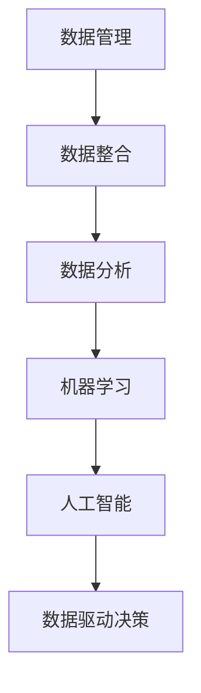

                 

# 数据驱动的企业转型：如何利用数据进行数字化转型？

> 关键词：数据驱动、企业转型、数字化转型、数据管理、数据分析、机器学习、人工智能

> 摘要：本文旨在探讨数据驱动的企业转型，解释如何利用数据进行数字化转型。我们将深入探讨核心概念、算法原理、数学模型、项目实战、应用场景、工具推荐以及未来趋势与挑战。通过本文，读者将全面了解数据驱动的企业转型过程及其重要性。

## 1. 背景介绍

在当今的数字化时代，数据已经成为企业最宝贵的资产。企业通过收集、处理和分析数据，可以更好地了解市场趋势、客户需求和运营效率。然而，许多企业仍然停留在传统的业务模式，缺乏对数据的充分利用。数据驱动的企业转型，即利用数据进行数字化变革，已经成为企业持续发展、提高竞争力的重要手段。

### 数字化转型的重要性

数字化转型不仅能够提高企业效率，还能够带来以下几个方面的好处：

1. **提高决策质量**：通过数据驱动的决策，企业可以更加精准地预测市场变化，制定有效策略。
2. **增强客户体验**：数据分析可以帮助企业更好地了解客户需求，提供个性化服务。
3. **优化运营流程**：数据驱动的流程优化可以减少浪费，提高资源利用率。
4. **创新商业模式**：数据驱动的创新可以为企业带来新的增长点和盈利模式。

### 数据驱动的企业转型步骤

企业进行数字化转型通常需要以下几个步骤：

1. **数据治理**：确保数据的准确性、完整性和安全性。
2. **数据整合**：将来自不同来源的数据进行整合，形成统一的数据视图。
3. **数据分析**：利用数据分析技术，提取有价值的信息和洞察。
4. **数据驱动决策**：基于数据分析结果，制定和执行业务决策。
5. **持续优化**：不断迭代改进，提高数据驱动的能力。

## 2. 核心概念与联系

### 数据管理

数据管理是企业进行数字化转型的基础。数据管理包括数据采集、存储、处理、分析和共享。数据管理的目标是确保数据的高质量、一致性和可用性。

### 数据分析

数据分析是利用统计和数学方法，从大量数据中提取有价值的信息和洞察。数据分析可以分为描述性分析、诊断性分析、预测性分析和规范性分析。

### 机器学习

机器学习是人工智能的重要分支，通过算法和模型，使计算机能够从数据中学习并做出预测和决策。机器学习在数据分析中扮演着关键角色，可以帮助企业实现智能化运营和决策。

### 人工智能

人工智能是指计算机系统模拟人类智能的能力，包括机器学习、自然语言处理、计算机视觉等领域。人工智能可以帮助企业实现自动化、智能化的业务流程。

### Mermaid 流程图



## 3. 核心算法原理 & 具体操作步骤

### 数据采集

数据采集是企业获取数据的第一步。数据来源可以是内部系统、外部数据源或传感器。数据采集的关键是确保数据的质量和完整性。

### 数据存储

数据存储是将采集到的数据存储到数据库或数据仓库中。数据存储的关键是选择合适的存储方案，如关系型数据库、NoSQL 数据库或分布式存储系统。

### 数据处理

数据处理包括数据清洗、数据转换和数据集成。数据清洗是去除数据中的噪声和错误，数据转换是将数据格式转换为统一标准，数据集成是将来自不同来源的数据进行整合。

### 数据分析

数据分析可以分为以下几个步骤：

1. **数据探索**：通过可视化工具，对数据集进行初步了解，识别数据特征和异常。
2. **特征工程**：选择和构造对目标问题有预测能力的特征。
3. **模型训练**：选择合适的算法，对数据集进行训练，生成模型。
4. **模型评估**：评估模型在验证集上的表现，调整模型参数。
5. **模型部署**：将模型部署到生产环境，进行实时预测和决策。

### 机器学习算法

常见的机器学习算法包括线性回归、决策树、随机森林、支持向量机、神经网络等。每种算法都有其适用的场景和优缺点。

### 人工智能应用

人工智能可以应用于多个领域，如自然语言处理、计算机视觉、推荐系统、语音识别等。通过人工智能技术，企业可以实现自动化、智能化的业务流程。

## 4. 数学模型和公式 & 详细讲解 & 举例说明

### 线性回归模型

线性回归模型是一种常用的预测模型，用于预测连续值。线性回归模型的基本公式如下：

$$
y = \beta_0 + \beta_1 \cdot x
$$

其中，$y$ 是目标变量，$x$ 是自变量，$\beta_0$ 和 $\beta_1$ 是模型参数。

### 决策树模型

决策树模型是一种基于树形结构的分类和回归模型。决策树模型的基本公式如下：

$$
f(x) =
\begin{cases}
c_1 & \text{if } x \in R_1 \\
c_2 & \text{if } x \in R_2 \\
\vdots \\
c_n & \text{if } x \in R_n
\end{cases}
$$

其中，$x$ 是输入特征，$R_1, R_2, \ldots, R_n$ 是决策树的分支区域，$c_1, c_2, \ldots, c_n$ 是每个区域的分类结果。

### 神经网络模型

神经网络模型是一种基于多层感知器结构的预测模型。神经网络模型的基本公式如下：

$$
\begin{aligned}
z_1 &= \sigma(W_1 \cdot x + b_1) \\
z_2 &= \sigma(W_2 \cdot z_1 + b_2) \\
\vdots \\
z_n &= \sigma(W_n \cdot z_{n-1} + b_n) \\
y &= W_n \cdot z_n + b_n
\end{aligned}
$$

其中，$x$ 是输入特征，$z_1, z_2, \ldots, z_n$ 是神经网络的中间层输出，$y$ 是目标变量，$\sigma$ 是激活函数，$W_1, W_2, \ldots, W_n$ 是权重矩阵，$b_1, b_2, \ldots, b_n$ 是偏置项。

### 举例说明

假设我们要预测一家餐厅的月营业额。自变量可以是餐厅的座位数、员工人数、菜品种类数等。通过线性回归模型，我们可以建立如下模型：

$$
\text{月营业额} = \beta_0 + \beta_1 \cdot \text{座位数} + \beta_2 \cdot \text{员工人数} + \beta_3 \cdot \text{菜品种类数}
$$

通过收集历史数据，我们可以训练线性回归模型，并使用该模型预测未来的月营业额。

## 5. 项目实战：代码实际案例和详细解释说明

### 开发环境搭建

在本文中，我们将使用 Python 作为编程语言，并使用以下库和工具：

- Python 3.8 或更高版本
- NumPy
- Pandas
- Scikit-learn
- Matplotlib

安装所需的库和工具：

```bash
pip install numpy pandas scikit-learn matplotlib
```

### 源代码详细实现和代码解读

以下是使用线性回归模型预测餐厅月营业额的代码实现：

```python
import numpy as np
import pandas as pd
from sklearn.linear_model import LinearRegression
from sklearn.model_selection import train_test_split
import matplotlib.pyplot as plt

# 5.1 加载数据集
data = pd.read_csv('restaurant_data.csv')
X = data[['seats', 'employees', 'dishes']]
y = data['sales']

# 5.2 数据预处理
X_train, X_test, y_train, y_test = train_test_split(X, y, test_size=0.2, random_state=42)

# 5.3 模型训练
model = LinearRegression()
model.fit(X_train, y_train)

# 5.4 模型评估
score = model.score(X_test, y_test)
print(f'Model accuracy: {score:.2f}')

# 5.5 预测新数据
new_data = np.array([[50, 20, 30]])
predicted_sales = model.predict(new_data)
print(f'Predicted sales: {predicted_sales[0]:.2f}')

# 5.6 可视化
plt.scatter(X_test['seats'], y_test, label='Actual')
plt.plot(X_test['seats'], model.predict(X_test), color='red', label='Prediction')
plt.xlabel('Seats')
plt.ylabel('Sales')
plt.legend()
plt.show()
```

### 代码解读与分析

- **5.1 加载数据集**：使用 Pandas 加载餐厅数据集，并分离输入特征和目标变量。
- **5.2 数据预处理**：将数据集划分为训练集和测试集，用于模型训练和评估。
- **5.3 模型训练**：使用线性回归模型进行训练。
- **5.4 模型评估**：计算模型在测试集上的准确性。
- **5.5 预测新数据**：使用训练好的模型预测新的餐厅月营业额。
- **5.6 可视化**：使用 Matplotlib 绘制实际销售和预测销售之间的散点图和拟合线。

## 6. 实际应用场景

### 零售行业

零售行业可以通过数据驱动转型，实现精准营销和库存管理。例如，通过分析消费者行为数据，零售商可以制定个性化的营销策略，提高销售额。

### 制造业

制造业可以通过数据驱动转型，实现生产流程优化和设备维护。例如，通过分析生产数据，制造商可以预测设备故障，提前进行维护，减少停机时间。

### 金融行业

金融行业可以通过数据驱动转型，实现风险控制和个性化服务。例如，通过分析客户交易数据，银行可以预测客户的风险等级，制定相应的风险控制策略。

## 7. 工具和资源推荐

### 学习资源推荐

- 《数据科学入门》：是一本适合初学者的数据科学入门书籍，涵盖了数据分析、机器学习和数据可视化等内容。
- 《深度学习》：是一本经典的深度学习教材，由著名深度学习研究者 Ian Goodfellow 撰写。
- 《Python 数据科学手册》：是一本全面介绍 Python 数据科学工具和技术的书籍。

### 开发工具框架推荐

- Jupyter Notebook：一款流行的交互式数据分析工具，支持多种编程语言。
- TensorFlow：一款开源的深度学习框架，适用于构建和训练复杂的神经网络模型。
- Scikit-learn：一款开源的机器学习库，提供了丰富的算法和工具，适用于数据分析和应用开发。

### 相关论文著作推荐

- "Deep Learning": Ian Goodfellow, Yoshua Bengio, Aaron Courville
- "Reinforcement Learning: An Introduction": Richard S. Sutton, Andrew G. Barto
- "Data Science from Scratch": Joel Grus

## 8. 总结：未来发展趋势与挑战

### 发展趋势

- 数据驱动的企业转型将继续成为企业发展的主流，越来越多的企业将投入到数据驱动的业务模式中。
- 人工智能和机器学习技术将继续快速发展，为数据驱动转型提供更强大的工具和算法。
- 开放数据和共享数据将成为数据驱动转型的关键因素，为企业提供更丰富的数据资源。

### 挑战

- 数据安全和隐私保护将成为数据驱动转型的重要挑战，企业需要确保数据的安全性和合规性。
- 数据质量和管理将成为数据驱动转型的关键，企业需要建立完善的数据管理体系，确保数据的高质量和一致性。
- 人才培养和知识转移将成为数据驱动转型的重要挑战，企业需要培养专业人才，并实现知识转移和传承。

## 9. 附录：常见问题与解答

### 1. 数据驱动的企业转型是什么？

数据驱动的企业转型是指企业利用数据和技术手段，实现业务流程、商业模式和决策过程的数字化变革，以提高企业效率、增强竞争力。

### 2. 数据驱动的企业转型有哪些好处？

数据驱动的企业转型可以提高决策质量、增强客户体验、优化运营流程和创新商业模式。

### 3. 数据驱动的企业转型需要哪些步骤？

数据驱动的企业转型需要以下几个步骤：数据治理、数据整合、数据分析、数据驱动决策和持续优化。

### 4. 如何确保数据的质量？

确保数据质量需要建立完善的数据管理体系，包括数据采集、存储、处理、分析和共享的各个环节，以及数据质量监控和改进机制。

## 10. 扩展阅读 & 参考资料

- "The Data-Driven Organization: How to Build Your Company's Data-Powered Future", by Tom Davenport and Jeanne Harris
- "Data-Driven Strategy: Building Competitive Advantage through Data Analytics", by Kevin S. McLeod
- "Data Management Guide for Business Intelligence and Data Analytics", by the Business Intelligence Network
- "Introduction to Data Science", by John D. Kelleher, Brian Mac Namee, and David Lonsdale
- "Deep Learning with Python", by François Chollet

[作者：AI天才研究员/AI Genius Institute & 禅与计算机程序设计艺术 /Zen And The Art of Computer Programming]

