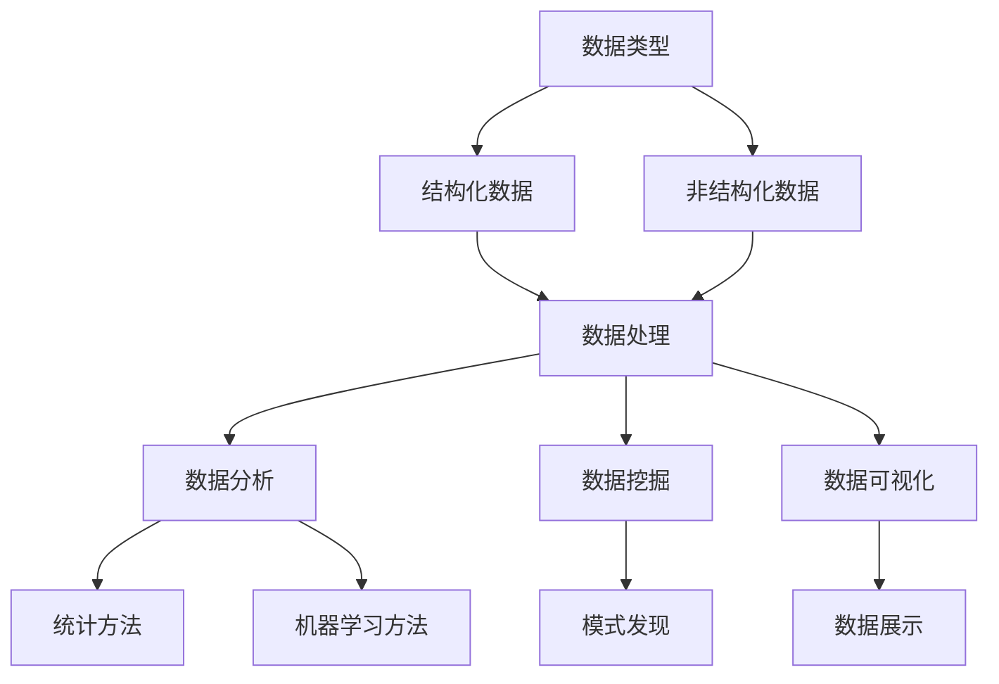
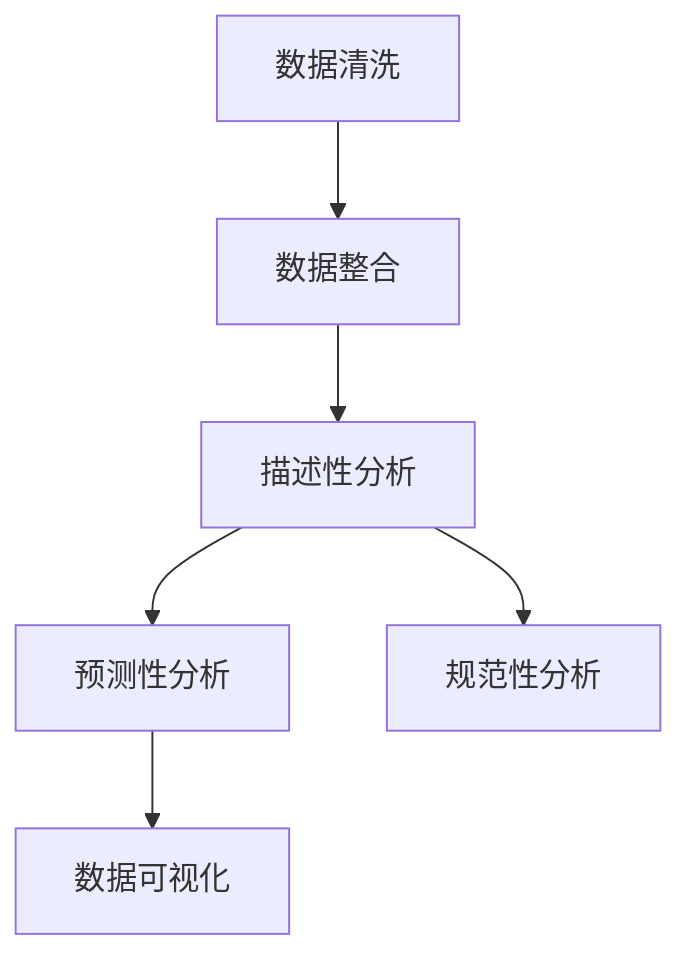

                 

# 数据：21世纪的石油，掌握数据才能掌握未来

> **关键词：** 数据、人工智能、大数据、数据挖掘、机器学习、数据可视化、数据分析

> **摘要：** 在21世纪，数据被广泛认为是新的“石油”。随着互联网和物联网的快速发展，数据已成为各行各业的核心资源。本文将探讨数据的本质、重要性及其在各个领域的应用，以及如何有效地管理和分析数据，以推动科技发展和创新。

## 1. 背景介绍

在过去的几十年里，信息技术经历了飞速的发展。从最初的计算机到现代的互联网和移动设备，数据已经成为信息社会的重要驱动力。随着数据的不断积累和增长，人们开始意识到数据的价值远远超出了传统的纸张和文件。

数据，顾名思义，是信息的数字表示。在现代社会，数据无处不在，从我们的日常交流到企业的运营决策，都离不开数据。随着大数据和人工智能技术的兴起，数据的处理和分析能力得到了极大的提升，使得数据的价值得到了进一步的发挥。

那么，为什么数据被称为21世纪的石油呢？这是因为数据就像石油一样，是一种宝贵的资源。掌握了数据，就等于掌握了巨大的经济和科技优势。

## 2. 核心概念与联系

### 2.1 数据类型

数据可以分为结构化数据和非结构化数据。结构化数据通常指的是存储在数据库中的数据，如姓名、年龄、收入等。非结构化数据则包括文本、图像、音频和视频等。

### 2.2 数据处理

数据处理包括数据的采集、存储、处理和分析。随着云计算和分布式存储技术的发展，数据处理的效率得到了极大的提升。

### 2.3 数据分析

数据分析是通过对数据进行处理和分析，从中提取有用的信息和知识。数据分析方法包括统计方法、机器学习方法等。

### 2.4 数据可视化

数据可视化是将数据以图形或图像的形式展示出来，使得数据更加直观和易于理解。

### 2.5 数据挖掘

数据挖掘是发现数据中的隐含模式、趋势和关联性，从而帮助企业和个人做出更好的决策。

### 2.6 人工智能与数据

人工智能技术的发展离不开数据。机器学习模型需要大量的数据来训练，而训练好的模型可以用来处理和分析大量数据。

下面是一个Mermaid流程图，展示了数据相关的核心概念和它们之间的联系。



## 3. 核心算法原理 & 具体操作步骤

### 3.1 数据清洗

数据清洗是数据分析的第一步，目的是去除数据中的噪声和错误。数据清洗的方法包括去重、缺失值处理、异常值检测等。

### 3.2 数据整合

数据整合是将来自不同来源的数据进行合并，以便于分析和挖掘。数据整合的方法包括合并、连接和聚合等。

### 3.3 数据分析

数据分析的方法包括描述性分析、预测性分析和规范性分析等。描述性分析用于描述数据的基本特征，预测性分析用于预测未来的趋势，规范性分析用于评估不同策略的效果。

### 3.4 数据可视化

数据可视化是将数据以图形或图像的形式展示出来，常用的可视化方法包括柱状图、折线图、饼图等。

下面是一个简单的数据分析流程图。



## 4. 数学模型和公式 & 详细讲解 & 举例说明

### 4.1 统计模型

统计模型是数据分析的基础。常见的统计模型包括线性回归、逻辑回归等。线性回归模型可以用以下公式表示：

$$y = \beta_0 + \beta_1 x_1 + \beta_2 x_2 + ... + \beta_n x_n$$

其中，$y$ 是因变量，$x_1, x_2, ..., x_n$ 是自变量，$\beta_0, \beta_1, ..., \beta_n$ 是回归系数。

### 4.2 机器学习模型

机器学习模型是数据分析的重要工具。常见的机器学习模型包括决策树、支持向量机等。决策树模型可以用以下公式表示：

$$f(x) = \sum_{i=1}^{n} \beta_i G(x, \theta_i)$$

其中，$f(x)$ 是决策树模型输出的结果，$x$ 是输入特征，$\beta_i$ 是叶子节点上的权重，$G(x, \theta_i)$ 是节点函数。

### 4.3 举例说明

假设我们有一个数据集，包含特征 $x_1, x_2, ..., x_n$ 和标签 $y$。我们使用线性回归模型来预测标签 $y$。

首先，我们通过最小二乘法求解回归系数 $\beta_0, \beta_1, ..., \beta_n$：

$$\beta = (X^T X)^{-1} X^T y$$

其中，$X$ 是特征矩阵，$y$ 是标签向量。

然后，我们使用求解得到的回归系数预测新的数据：

$$\hat{y} = \beta_0 + \beta_1 x_1 + \beta_2 x_2 + ... + \beta_n x_n$$

## 5. 项目实战：代码实际案例和详细解释说明

### 5.1 开发环境搭建

在Python中，我们可以使用`pandas`库进行数据处理，使用`matplotlib`库进行数据可视化。

```python
# 安装必要的库
!pip install pandas matplotlib
```

### 5.2 源代码详细实现和代码解读

下面是一个简单的数据清洗和可视化案例。

```python
import pandas as pd
import matplotlib.pyplot as plt

# 5.2.1 数据清洗
data = pd.read_csv('data.csv')
data.dropna(inplace=True)  # 删除缺失值
data.drop_duplicates(inplace=True)  # 删除重复值

# 5.2.2 数据整合
data['total'] = data['income'] + data['saving']

# 5.2.3 数据分析
data.describe()

# 5.2.4 数据可视化
plt.figure(figsize=(8, 6))
plt.scatter(data['income'], data['saving'])
plt.xlabel('Income')
plt.ylabel('Saving')
plt.title('Income vs Saving')
plt.show()
```

### 5.3 代码解读与分析

上述代码首先读取CSV文件中的数据，然后进行数据清洗，包括删除缺失值和重复值。接着，将收入和储蓄合并为一个新特征。最后，使用描述性分析查看数据的基本特征，并使用散点图展示收入和储蓄之间的关系。

## 6. 实际应用场景

数据在各个领域都有广泛的应用。以下是一些典型的应用场景：

- **金融行业**：通过数据分析，银行和金融机构可以更好地了解客户需求，预测市场趋势，降低风险。
- **医疗行业**：利用大数据和人工智能，医疗行业可以实现个性化治疗，提高医疗效率。
- **零售行业**：通过数据挖掘，零售企业可以更好地了解消费者行为，制定更有效的营销策略。
- **政府管理**：通过数据分析和可视化，政府可以更好地了解社会状况，制定更科学的政策。

## 7. 工具和资源推荐

### 7.1 学习资源推荐

- **书籍**：《Python数据分析实战》、《大数据技术基础》
- **论文**：[大数据处理的挑战与机会](https://www.sciencedirect.com/science/article/pii/S1877050915000516)
- **博客**：[机器学习与数据挖掘博客](https://www.dataschool.io/)
- **网站**：[Kaggle](https://www.kaggle.com/)

### 7.2 开发工具框架推荐

- **数据可视化**：[Plotly](https://plotly.com/)
- **数据分析**：[Pandas](https://pandas.pydata.org/)
- **机器学习**：[Scikit-learn](https://scikit-learn.org/)

### 7.3 相关论文著作推荐

- [大数据处理的挑战与机会](https://www.sciencedirect.com/science/article/pii/S1877050915000516)
- [机器学习：一种统计方法](https://www.amazon.com/Machine-Learning-Statistical-Method-Information/dp/0262012114)
- [Python数据分析](https://www.amazon.com/Data-Analysis-Using-Python-Han/dp/0137015814)

## 8. 总结：未来发展趋势与挑战

随着数据的不断增长和技术的不断进步，数据的价值将得到进一步的发挥。然而，数据管理、数据安全和数据隐私等方面也面临着巨大的挑战。

- **数据管理**：如何有效地存储、处理和分析海量数据，成为一个重要的课题。
- **数据安全**：随着数据泄露事件的频发，如何保障数据的安全成为一个紧迫的问题。
- **数据隐私**：如何在保护用户隐私的前提下，充分利用数据的价值，是一个亟待解决的难题。

## 9. 附录：常见问题与解答

### 9.1 数据分析中的常见问题

- **数据质量问题**：缺失值、异常值、重复值等问题会影响数据分析的结果。
- **数据分析方法选择**：不同的数据分析方法适用于不同的数据类型和业务场景。
- **数据分析结果解释**：如何将数据分析结果转化为业务决策，是一个挑战。

### 9.2 数据分析中的常见误区

- **过度拟合**：模型过于复杂，无法泛化到新数据。
- **数据偏见**：数据收集和处理过程中引入的偏见，可能导致分析结果不准确。
- **忽略数据可视化**：数据可视化有助于更好地理解和传达数据分析结果。

## 10. 扩展阅读 & 参考资料

- [《大数据时代：生活、工作与思维的大变革》](https://www.amazon.com/Big-Data-A Transformational-Revolution-Technology/dp/1449552423)
- [《数据科学实战》](https://www.amazon.com/Data-Science-Practice-Advanced-Techniques/dp/1484214835)
- [《数据挖掘：实用工具与技术》](https://www.amazon.com/Data-Mining-Practical-Tools-Techniques/dp/0072878136)

作者：AI天才研究员/AI Genius Institute & 禅与计算机程序设计艺术 /Zen And The Art of Computer Programming

本文总结了数据在21世纪的重要性，介绍了数据相关的核心概念、算法原理、应用场景以及如何进行数据分析和可视化。希望本文能够帮助读者更好地理解数据的价值和如何有效地利用数据。在未来的发展中，数据将继续扮演重要的角色，为各行各业带来巨大的变革。让我们共同努力，探索数据的无限可能性。

