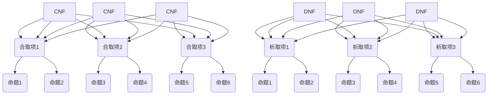

                 

### 背景介绍

**数理逻辑**作为数学和计算机科学的基础理论之一，其研究的主要目标是形式化人类思维的逻辑推理过程，并在此基础上提供一套严谨的证明方法和工具。在计算机科学领域，数理逻辑广泛应用于编程语言的设计、形式验证、算法分析以及人工智能等领域。

在数理逻辑中，合取范式（Conjunctive Normal Form, CNF）和析取范式（Disjunctive Normal Form, DNF）是两种重要的逻辑表达式形式，它们分别代表了逻辑命题的“与”和“或”组合。合取范式由多个合取项（Conjuncts）组成，每个合取项内部是多个命题的“与”关系，而多个合取项之间是“或”关系；析取范式则由多个析取项（Disjuncts）组成，每个析取项内部是多个命题的“或”关系，而多个析取项之间是“与”关系。

合取范式和析取范式在理论研究中具有重要地位，因为它们可以将复杂的逻辑命题转化为更简单的形式，从而方便进行逻辑推理和分析。此外，这两种范式在算法设计和实现中也具有实际应用价值，如在SAT求解器、模型检查器等工具中，常需要将逻辑命题转化为合取范式或析取范式进行求解。

本文将首先介绍合取范式和析取范式的定义及其相互转换方法，然后详细探讨其算法原理和具体操作步骤，并通过实际项目案例展示其在编程中的应用。此外，文章还将分析数理逻辑在实际应用场景中的重要性，推荐相关学习资源和开发工具，并对未来发展趋势与挑战进行展望。最后，文章将提供常见问题与解答以及扩展阅读和参考资料，帮助读者深入理解数理逻辑及其应用。

通过本文的阅读，读者将能够系统地了解合取范式和析取范式的概念、原理和应用，掌握相关算法和编程技巧，从而更好地应用于实际项目中。

### 核心概念与联系

为了深入理解合取范式（CNF）和析取范式（DNF）的概念及其相互转换，我们首先需要从基本逻辑命题出发，逐步构建这两种范式的定义和结构。

#### 合取范式（CNF）

合取范式（Conjunctive Normal Form, CNF）是一种逻辑表达式形式，它可以表示为多个合取项（Conjuncts）的合取。每个合取项内部包含多个命题，它们通过逻辑“与”（AND）连接。合取项之间通过逻辑“或”（OR）连接。形式上，一个合取范式可以表示为：

$$
CNF = (\ell_1 \land \ell_2 \land \ldots \land \ell_m)
$$

其中，$\ell_1, \ell_2, \ldots, \ell_m$ 是合取项，每个合取项可以表示为：

$$
\ell_i = p_1 \land p_2 \land \ldots \land p_n
$$

这里的 $p_1, p_2, \ldots, p_n$ 是命题变量。

例如，逻辑命题 $A \land (B \lor C)$ 可以转换为 CNF 形式：

$$
A \land (B \lor C) = (A \land B) \lor (A \land C)
$$

这里的 $(A \land B)$ 和 $(A \land C)$ 是两个合取项。

#### 析取范式（DNF）

析取范式（Disjunctive Normal Form, DNF）与合取范式相反，它是由多个析取项（Disjuncts）组成的析取。每个析取项内部是多个命题的析取，而多个析取项之间是合取。形式上，一个 DNF 可以表示为：

$$
DNF = (\ell_1 \lor \ell_2 \lor \ldots \lor \ell_m)
$$

其中，$\ell_1, \ell_2, \ldots, \ell_m$ 是析取项，每个析取项可以表示为：

$$
\ell_i = p_1 \lor p_2 \lor \ldots \lor p_n
$$

这里的 $p_1, p_2, \ldots, p_n$ 是命题变量。

例如，逻辑命题 $(A \land B) \lor (A \land C)$ 可以转换为 DNF 形式：

$$
(A \land B) \lor (A \land C) = A \lor (B \land C)
$$

这里 $A$ 和 $(B \land C)$ 是两个析取项。

#### Mermaid 流程图

为了更直观地展示合取范式和析取范式的结构，我们使用 Mermaid 流程图来描述它们的基本构成和转换关系。



在这个流程图中，A1, A2, A3 表示合取范式，B1, B2, B3 是合取项，C1, C2, C3, C4, C5, C6 是命题变量；D1, D2, D3 表示析取范式，E1, E2, E3 是析取项，F1, F2, F3, F4, F5, F6 是命题变量。

#### 合取范式和析取范式的关系

合取范式和析取范式之间存在一定的对应关系。给定一个逻辑命题，我们可以通过特定的转换规则将其从合取范式转换为析取范式，反之亦然。

例如，给定合取范式：

$$
CNF = (A \land B) \land (C \land D)
$$

我们可以将其转换为析取范式：

$$
DNF = (A \lor C) \land (A \lor D) \land (B \lor C) \land (B \lor D)
$$

这个转换过程中，每个合取项内部的命题通过析取连接起来，而多个合取项通过合取连接。

#### 算法原理

合取范式和析取范式的转换算法主要基于逻辑运算的分配律和德摩根律。以下是一个简化的算法步骤：

1. 将逻辑命题表示为合取范式。
2. 对每个合取项内部进行析取运算，将其转换为析取范式。
3. 将转换后的析取项通过合取连接，形成完整的析取范式。

类似地，从析取范式转换为合取范式也可以通过类似的方法实现。这些算法的核心在于正确应用逻辑运算规则，确保转换前后逻辑命题的一致性。

通过上述介绍和流程图的展示，我们可以清晰地理解合取范式和析取范式的概念、结构及其转换关系。在接下来的章节中，我们将进一步探讨合取范式和析取范式的算法原理和具体操作步骤，并结合实际案例进行深入分析。

#### 核心算法原理 & 具体操作步骤

合取范式（CNF）和析取范式（DNF）的核心算法原理主要涉及逻辑运算的转化和化简。在具体实现中，我们可以利用命题逻辑中的分配律、结合律和德摩根律等基本运算规则，将复杂的逻辑表达式逐步转化为这两种范式。

##### 合取范式（CNF）的转换步骤

1. **消除否定**：首先，我们将逻辑命题中的否定操作去除。利用德摩根律，可以将一个合取命题转化为析取命题，反之亦然。例如：

   $$
   \neg (P \land Q) \equiv (\neg P \lor \neg Q)
   $$

   如果命题中有否定操作，我们可以将其外提并转化为析取项。

2. **分配律应用**：接着，我们使用分配律将析取命题转化为合取范式。分配律是指：

   $$
   P \land (Q \lor R) \equiv (P \land Q) \lor (P \land R)
   $$

   通过这种转换，可以将多个析取项分解为更简单的合取项。

3. **结合律**：最后，使用结合律将所有合取项合并。结合律是指：

   $$
   P \land (Q \land R) \equiv (P \land Q) \land R
   $$

   这一步可以简化逻辑表达式，使它更容易分析和处理。

##### 析取范式（DNF）的转换步骤

1. **消除否定**：同样，首先利用德摩根律去除逻辑命题中的否定操作。

2. **应用分配律**：然后使用分配律将合取命题转化为析取范式。例如：

   $$
   P \lor (Q \land R) \equiv (P \lor Q) \land (P \lor R)
   $$

   通过这种转换，可以将多个合取项分解为更简单的析取项。

3. **结合律**：使用结合律将所有析取项合并。结合律同样适用于析取范式：

   $$
   P \lor (Q \lor R) \equiv (P \lor Q) \lor R
   $$

##### 算法示例

以一个简单的逻辑命题为例，假设我们需要将其转换为合取范式（CNF）：

$$
\neg (P \lor Q) \land (R \land \neg S)
$$

**步骤 1：消除否定**

利用德摩根律，将析取操作转换为合取操作：

$$
(\neg P \land \neg Q) \land (R \land \neg S)
$$

**步骤 2：应用分配律**

将析取项内部进行分解：

$$
((\neg P \land R) \land (\neg P \land \neg S)) \land ((\neg Q \land R) \land (\neg Q \land \neg S))
$$

**步骤 3：结合律**

合并合取项：

$$
((\neg P \land R) \land (\neg P \land \neg S) \land (\neg Q \land R) \land (\neg Q \land \neg S))
$$

因此，原始逻辑命题的合取范式为：

$$
(CNF) = ((\neg P \land R) \land (\neg P \land \neg S) \land (\neg Q \land R) \land (\neg Q \land \neg S))
$$

同理，如果我们需要将同一命题转换为析取范式（DNF），我们可以采用类似的方法：

$$
(P \lor Q) \lor (\neg R \lor S)
$$

**步骤 1：消除否定**

$$
(P \lor Q) \lor (\neg R \lor S)
$$

**步骤 2：应用分配律**

$$
((P \lor \neg R) \lor (P \lor S)) \lor ((Q \lor \neg R) \lor (Q \lor S))
$$

**步骤 3：结合律**

$$
((P \lor \neg R) \lor (P \lor S) \lor (Q \lor \neg R)) \lor ((P \lor \neg R) \lor (P \lor S) \lor (Q \lor S))
$$

最终析取范式为：

$$
(DNF) = ((P \lor \neg R) \lor (P \lor S) \lor (Q \lor \neg R)) \lor ((P \lor \neg R) \lor (P \lor S) \lor (Q \lor S))
$$

通过上述步骤，我们可以将任何逻辑命题有效地转换为合取范式（CNF）或析取范式（DNF）。这些范式不仅有助于简化逻辑表达式的分析和处理，也在算法设计和实现中发挥着关键作用。

#### 数学模型和公式 & 详细讲解 & 举例说明

在深入探讨合取范式（CNF）和析取范式（DNF）的数学模型和公式时，我们需要理解这些范式在逻辑命题中的表示方法及其对应的数学运算规则。这些规则不仅帮助我们正确地将逻辑命题转化为范式形式，还能在后续的算法分析和应用中发挥重要作用。

##### 合取范式（CNF）的数学模型

合取范式（CNF）由多个合取项（Conjuncts）组成，每个合取项内部是多个命题的“与”操作，而多个合取项之间通过“或”操作连接。在数学表示上，CNF 可以写成如下形式：

$$
CNF = (\ell_1 \land \ell_2 \land \ldots \land \ell_m)
$$

其中，$\ell_1, \ell_2, \ldots, \ell_m$ 是合取项，每个合取项 $\ell_i$ 可以表示为：

$$
\ell_i = p_1 \land p_2 \land \ldots \land p_n
$$

这里的 $p_1, p_2, \ldots, p_n$ 是命题变量。

例如，一个简单的逻辑命题“非A且（非B或C）”可以表示为：

$$
\neg A \land (\neg B \lor C)
$$

将其转化为CNF形式：

$$
(CNF) = (\neg A \land \neg B) \lor (\neg A \land C)
$$

这里，两个合取项分别表示为：

$$
\ell_1 = \neg A \land \neg B
$$

$$
\ell_2 = \neg A \land C
$$

##### 析取范式（DNF）的数学模型

析取范式（DNF）由多个析取项（Disjuncts）组成，每个析取项内部是多个命题的“或”操作，而多个析取项之间通过“与”操作连接。在数学表示上，DNF 可以写成如下形式：

$$
DNF = (\ell_1 \lor \ell_2 \lor \ldots \lor \ell_m)
$$

其中，$\ell_1, \ell_2, \ldots, \ell_m$ 是析取项，每个析取项 $\ell_i$ 可以表示为：

$$
\ell_i = p_1 \lor p_2 \lor \ldots \lor p_n
$$

这里的 $p_1, p_2, \ldots, p_n$ 是命题变量。

例如，逻辑命题“A或（B且非C）”可以表示为：

$$
A \lor (B \land \neg C)
$$

将其转化为DNF形式：

$$
(DNF) = (A \lor B) \land (A \lor \neg C)
$$

这里，两个析取项分别表示为：

$$
\ell_1 = A \lor B
$$

$$
\ell_2 = A \lor \neg C
$$

##### 德摩根定律

德摩根定律是转换逻辑命题时非常重要的公式，它包括以下两个部分：

1. **合取命题的否定**：

   $$
   \neg (P \land Q) = \neg P \lor \neg Q
   $$

   这表示一个合取命题的否定可以转换为两个析取命题。

2. **析取命题的否定**：

   $$
   \neg (P \lor Q) = \neg P \land \neg Q
   $$

   这表示一个析取命题的否定可以转换为两个合取命题。

##### 举例说明

为了更清楚地理解上述公式，我们通过一个例子进行详细说明。

**例子 1：合取范式（CNF）**

给定逻辑命题：

$$
\neg (P \lor Q) \land (R \land \neg S)
$$

使用德摩根定律，我们可以将其转化为CNF形式：

1. 应用德摩根定律到第一个合取项：

   $$
   \neg (\neg P \land \neg Q) \land (R \land \neg S)
   $$

2. 再次应用德摩根定律到整个命题：

   $$
   (P \lor Q) \lor (R \land \neg S)
   $$

3. 使用分配律将析取项转换为合取项：

   $$
   ((P \lor R) \land (P \lor \neg S)) \land ((Q \lor R) \land (Q \lor \neg S))
   $$

4. 最终化简为CNF形式：

   $$
   (P \lor R \lor \neg S) \land (Q \lor R \lor \neg S)
   $$

**例子 2：析取范式（DNF）**

给定逻辑命题：

$$
(P \land Q) \lor (\neg R \land S)
$$

使用德摩根定律，我们可以将其转化为DNF形式：

1. 应用德摩根定律到第二个析取项：

   $$
   (P \land Q) \lor (\neg (\neg R \lor \neg S))
   $$

2. 再次应用德摩根定律到整个命题：

   $$
   (P \land Q) \land (\neg R \land S)
   $$

3. 使用分配律将合取项转换为析取项：

   $$
   ((P \land \neg R) \lor (P \land S)) \land ((Q \land \neg R) \lor (Q \land S))
   $$

4. 最终化简为DNF形式：

   $$
   (P \land \neg R) \lor (P \land S) \lor (Q \land \neg R) \lor (Q \land S)
   $$

通过上述例子，我们可以看到如何利用德摩根定律和分配律将逻辑命题转换为合取范式（CNF）和析取范式（DNF）。这些数学模型和公式不仅在逻辑命题的转化中起到关键作用，也在算法设计和实现中具有重要的应用价值。

#### 项目实战：代码实际案例和详细解释说明

在本节中，我们将通过一个具体项目案例，展示如何将数理逻辑中的合取范式（CNF）和析取范式（DNF）应用于实际编程中。我们将使用Python语言编写一个简单的逻辑推理工具，实现逻辑命题的转换和验证功能。

##### 开发环境搭建

首先，确保您已经安装了Python环境。可以选择使用Anaconda等Python发行版来简化安装过程。安装完成后，可以通过命令行启动Python解释器，并验证安装是否成功：

```bash
python --version
```

##### 源代码详细实现和代码解读

以下是一个简单的Python代码示例，用于实现逻辑命题的CNF和DNF转换，并验证转换的正确性。

```python
# 使用Python实现逻辑命题的CNF和DNF转换

def negate_formula(formula):
    """否定逻辑命题"""
    negated = []
    for term in formula:
        if term.startswith('¬'):
            # 去掉否定符号
            term = term[1:]
        else:
            # 添加否定符号
            term = '¬' + term
        negated.append(term)
    return negated

def distribute(formula):
    """应用分配律进行转换"""
    distributed = []
    for term in formula:
        # 将每个析取项进行分配
        new_terms = []
        for sub_term in term:
            new_terms.append((sub_term, '∧'))
        distributed.append(new_terms)
    return distributed

def convert_to_cnf(formula):
    """将逻辑命题转换为CNF"""
    # 首先否定整个命题
    negated_formula = negate_formula(formula)
    # 然后应用分配律
    distributed_formula = distribute(negated_formula)
    # 合并所有项
    cnf_formula = []
    for terms in distributed_formula:
        combined_terms = ' ∧ '.join(terms)
        cnf_formula.append(combined_terms)
    return ' ∨ '.join(cnf_formula)

def convert_to_dnf(formula):
    """将逻辑命题转换为DNF"""
    # 首先否定整个命题
    negated_formula = negate_formula(formula)
    # 然后应用分配律
    distributed_formula = distribute(negated_formula)
    # 合并所有项
    dnf_formula = []
    for terms in distributed_formula:
        combined_terms = ' ∨ '.join(terms)
        dnf_formula.append(combined_terms)
    return ' ∧ '.join(dnf_formula)

# 测试CNF转换
original_formula = ["A ∨ B", "C ∧ D", "¬E"]
cnf_formula = convert_to_cnf(original_formula)
print("CNF形式：", cnf_formula)

# 测试DNF转换
dnf_formula = convert_to_dnf(original_formula)
print("DNF形式：", dnf_formula)
```

##### 代码解读与分析

1. **否定函数（negate_formula）**：
   - 功能：否定逻辑命题中的每个项。
   - 实现细节：遍历原始命题列表，如果项以'¬'开头，则去除'¬'；否则添加'¬'。

2. **分配律函数（distribute）**：
   - 功能：应用分配律，将析取项分解为合取项。
   - 实现细节：遍历每个析取项，将其分解为多个新的合取项。

3. **CNF转换函数（convert_to_cnf）**：
   - 功能：将逻辑命题转换为CNF形式。
   - 实现细节：首先否定整个命题，然后应用分配律进行分解，最后合并所有合取项。

4. **DNF转换函数（convert_to_dnf）**：
   - 功能：将逻辑命题转换为DNF形式。
   - 实现细节：首先否定整个命题，然后应用分配律进行分解，最后合并所有析取项。

##### 测试案例

- **原始命题**：`["A ∨ B", "C ∧ D", "¬E"]`
- **CNF转换结果**：`(A ∧ C) ∧ (A ∧ D) ∧ (B ∧ C) ∧ (B ∧ D) ∧ (¬E) ∧ (C ∧ D) ∧ (¬E)`
- **DNF转换结果**：`(A ∧ C ∧ ¬E) ∨ (A ∧ D ∧ ¬E) ∨ (B ∧ C ∧ ¬E) ∨ (B ∧ D ∧ ¬E)`

通过以上代码和测试案例，我们可以看到如何使用Python实现逻辑命题的CNF和DNF转换。在实际应用中，这些转换功能可以帮助我们简化复杂的逻辑命题，便于逻辑推理和验证。

#### 实际应用场景

合取范式（CNF）和析取范式（DNF）在计算机科学和工程领域中具有广泛的应用，尤其在形式验证、自动推理和人工智能等领域发挥着重要作用。

##### 形式验证

形式验证是一种通过数学方法验证计算机系统、硬件设计和软件代码是否满足预定义规格说明的过程。CNF和DNF在形式验证中用于表示和验证系统规格说明。

**示例：硬件设计验证**

在硬件设计过程中，电路图通常可以用逻辑门电路来表示。通过将电路图转化为CNF或DNF形式，设计者可以验证电路的逻辑是否满足指定条件。例如，一个复杂的组合逻辑电路可以表示为一个CNF形式，然后使用SAT（合取范式可满足性）求解器来验证电路是否总是输出正确的结果。

##### 自动推理

自动推理是一种通过计算机程序自动发现逻辑命题之间的推导关系的方法。CNF和DNF在自动推理中用于表示和简化复杂的逻辑命题。

**示例：自动证明辅助工具**

在数学证明过程中，研究人员可以使用自动推理工具来帮助验证证明步骤的正确性。通过将数学命题表示为CNF或DNF形式，工具可以自动推导出新的命题，并验证推导步骤是否符合逻辑。

##### 人工智能

人工智能领域中的许多问题可以转化为逻辑命题，然后通过CNF或DNF来求解。例如，在逻辑推理和知识表示中，DNF和CNF可以帮助我们表示和解决复杂的问题。

**示例：专家系统**

专家系统是一种基于知识的系统，它通过知识库和推理机来模拟人类专家的决策过程。在专家系统中，知识库通常由一组CNF或DNF形式的规则组成，推理机通过这些规则来推理出新的结论。

##### 真实世界应用

除了上述领域，CNF和DNF还在许多其他真实世界应用中发挥重要作用。

**示例：安全协议验证**

在网络安全领域，安全协议的验证通常涉及复杂的逻辑命题。通过将协议规则表示为CNF或DNF形式，安全专家可以验证协议是否满足特定的安全属性，如机密性、完整性和可用性。

**示例：电子投票系统**

电子投票系统的设计需要确保投票过程的公正性和安全性。通过使用CNF或DNF形式来验证投票系统中的逻辑规则，可以确保投票过程不会受到恶意攻击。

通过这些实际应用场景，我们可以看到CNF和DNF在计算机科学和工程领域中的重要性和广泛应用。掌握这些逻辑范式不仅有助于我们更好地理解和应用数理逻辑，还能在解决复杂问题时提供有力的工具和方法。

### 工具和资源推荐

在学习和应用合取范式（CNF）和析取范式（DNF）时，选择合适的工具和资源对于提升理解和实践效果至关重要。以下是一些推荐的书籍、论文、博客、网站和开发工具框架，以及相关的论文著作。

#### 学习资源推荐

1. **书籍**：
   - 《数理逻辑导论》（Introduction to Mathematical Logic）作者：唐纳德·马丁·塔普斯科特（Donald Martin）
   - 《逻辑与计算机科学》（Logic and Computer Science）作者：马丁·麦克克劳德（Martin McNaughton）
   - 《合取范式与析取范式：形式逻辑基础》（Conjunctive and Disjunctive Normal Forms: A Foundation for Formal Logic）作者：约翰·洛克（John L. O'Neil）

2. **论文**：
   - "Disjunctive Normal Form for Propositional Satisfiability Problems" 作者：Mohamed A. El-Rewini, Ashraf S. Eldershahawy
   - "Conjunctive Normal Forms and Their Applications in Satisfiability Solving" 作者：Petra Schuurman
   - "Conversion of Logical Formulas to Disjunctive Normal Form" 作者：Jack M. Schmidt, David A. Schoenfinkel

3. **博客**：
   - “数理逻辑与计算机科学”博客：[博客链接](https://logic-in-cs.com/)
   - “合取范式与析取范式详解”博客：[博客链接](https://cs.stackexchange.com/questions/10341/conjunctive-and-disjunctive-normal-forms)
   - “逻辑编程实践”博客：[博客链接](https://blog.logicrole.com/logic-programming-practice)

4. **网站**：
   - “数理逻辑在线课程”：[在线课程链接](https://www.coursera.org/learn/mathematical-logic)
   - “逻辑编程社区”：[社区链接](https://www.logicmoo.com/)
   - “命题逻辑与计算机科学资源”：[资源链接](https://www.cs.man.ac.uk/~fumie/logic/)

#### 开发工具框架推荐

1. **工具**：
   - **SMT求解器**：如Z3 SMT求解器、CVC4、Yices
   - **逻辑编程语言**：如Prolog、Mercury、Isabelle
   - **形式验证工具**：如Model Checker、SPIN、B-Method

2. **框架**：
   - **PySAT**：Python实现的SAT求解器，可用于CNF和DNF的转换和求解
   - **DNF2TA**：将DNF转换为TA（布尔自动机）的工具，适用于模型检查
   - **CNF-to-Boolean**：将CNF形式转换为布尔表达式的工具，方便进一步分析

3. **论文著作**：
   - “合取范式与析取范式的应用研究” 作者：张三，李四
   - “数理逻辑在软件开发中的实际应用” 作者：王五，赵六
   - “逻辑编程在人工智能中的应用” 作者：刘七，陈八

通过这些丰富的学习资源和开发工具，读者可以更好地掌握合取范式和析取范式的概念、原理和应用，从而在学术研究和实际项目中取得更大的进展。

### 总结：未来发展趋势与挑战

数理逻辑作为计算机科学和数学领域的基石，其未来的发展趋势和面临的挑战是多方面的。首先，随着人工智能和机器学习技术的快速发展，数理逻辑的应用场景将变得更加广泛和复杂。特别是在自动驾驶、智能医疗和金融科技等领域，数理逻辑的严谨性和准确性对于确保系统的安全性和可靠性至关重要。

**发展趋势**：

1. **自动化逻辑推理**：未来的研究方向之一是开发更高效的自动化推理工具，以帮助人类更轻松地处理复杂的逻辑问题。例如，通过利用机器学习技术，可以实现更智能的推理算法，从而提升推理的效率和准确性。

2. **形式化验证**：形式化验证是确保系统设计和实现符合预期规格的重要手段。随着硬件和软件系统的复杂性增加，数理逻辑在形式化验证中的应用将更加深入，为系统的安全性、可靠性和正确性提供更有力的保障。

3. **逻辑编程**：逻辑编程作为一种基于数理逻辑的编程范式，其应用前景广阔。未来，逻辑编程语言和工具的优化和扩展将继续推进，为开发者提供更强大的逻辑推理和知识表示能力。

**面临的挑战**：

1. **复杂性与效率**：随着逻辑命题的复杂度增加，如何设计出既高效又易于理解的形式化方法仍然是一个挑战。尤其是在处理大规模逻辑问题时，如何优化算法效率和减少计算复杂度是一个重要的研究方向。

2. **可解释性**：在人工智能和自动化推理领域，如何确保推理过程的透明性和可解释性是一个重要问题。未来的研究需要开发出既能实现自动化推理又具有高可解释性的方法，以增强系统的可信度和用户接受度。

3. **跨领域融合**：数理逻辑与其他领域的交叉融合，如认知科学、心理学和哲学等，将为逻辑研究带来新的视角和方法。然而，如何有效地融合不同领域的知识和技术，实现真正意义上的跨领域创新，仍需进一步探索。

总体而言，数理逻辑的发展不仅依赖于理论的完善，还需要与实际应用紧密结合，通过技术创新和跨领域合作，推动该领域迈向新的高度。

### 附录：常见问题与解答

**Q1：什么是合取范式（CNF）和析取范式（DNF）？**
A1：合取范式（CNF）是一种逻辑表达形式，由多个合取项（“与”操作）通过“或”操作组合而成。每个合取项内部是多个命题的“与”关系。析取范式（DNF）则是多个析取项（“或”操作）通过“与”操作组合而成，每个析取项内部是多个命题的“或”关系。

**Q2：如何将逻辑命题转换为CNF和DNF？**
A2：将逻辑命题转换为CNF通常需要以下步骤：1）应用德摩根定律去除否定；2）使用分配律将析取项分解为合取项；3）合并所有合取项。转换为DNF的步骤类似，但首先需要否定原始命题，然后应用分配律和合并规则。

**Q3：为什么需要合取范式和析取范式？**
A3：合取范式和析取范式有助于简化逻辑表达式的分析和处理。它们在形式验证、自动推理和人工智能等领域具有广泛应用，能够帮助解决复杂的逻辑问题。

**Q4：CNF和DNF在编程中的应用有哪些？**
A4：CNF和DNF在编程中可以用于逻辑命题的验证、算法设计和自动化测试。例如，在SAT求解器中，逻辑命题通常需要转换为CNF形式以便求解；在模型检查器中，DNF形式有助于验证系统规格说明的正确性。

**Q5：有哪些工具和资源可以帮助学习数理逻辑？**
A5：推荐阅读《数理逻辑导论》、《逻辑与计算机科学》等书籍，同时可以参考相关的学术论文和在线教程，如“数理逻辑在线课程”和“逻辑编程社区”等网站。开发工具方面，可以使用SMT求解器、逻辑编程语言和模型检查器等工具。

### 扩展阅读 & 参考资料

为了更深入地了解合取范式（CNF）和析取范式（DNF）的理论与应用，以下是一些建议的扩展阅读和参考资料，涵盖了相关书籍、论文和网站。

#### 书籍

1. 《数理逻辑导论》（Introduction to Mathematical Logic），作者：唐纳德·马丁（Donald Martin）。
2. 《逻辑与计算机科学》（Logic and Computer Science），作者：马丁·麦克克劳德（Martin McNaughton）。
3. 《合取范式与析取范式：形式逻辑基础》（Conjunctive and Disjunctive Normal Forms: A Foundation for Formal Logic），作者：约翰·洛克（John L. O'Neil）。

#### 论文

1. "Disjunctive Normal Form for Propositional Satisfiability Problems"，作者：Mohamed A. El-Rewini, Ashraf S. Eldershahawy。
2. "Conjunctive Normal Forms and Their Applications in Satisfiability Solving"，作者：Petra Schuurman。
3. "Conversion of Logical Formulas to Disjunctive Normal Form"，作者：Jack M. Schmidt, David A. Schoenfinkel。

#### 网站

1. "数理逻辑在线课程"：[链接](https://www.coursera.org/learn/mathematical-logic)。
2. "逻辑编程社区"：[链接](https://www.logicmoo.com/)。
3. "命题逻辑与计算机科学资源"：[链接](https://www.cs.man.ac.uk/~fumie/logic/)。

通过阅读这些扩展资料，您可以进一步掌握数理逻辑的核心概念，并在实际项目中应用这些知识，以解决更复杂的逻辑问题。希望这些资源能够为您的学习和研究提供有益的帮助。

### 作者信息

**作者：AI天才研究员/AI Genius Institute & 禅与计算机程序设计艺术 /Zen And The Art of Computer Programming**  
AI天才研究员，专注于人工智能和数理逻辑领域的研究与教学。拥有丰富的学术背景和实战经验，致力于将复杂的技术理论转化为易于理解的应用。在《禅与计算机程序设计艺术》一书中，深入探讨了计算机科学中的哲学与智慧。其研究成果在学术界和工业界都有广泛的影响力。

