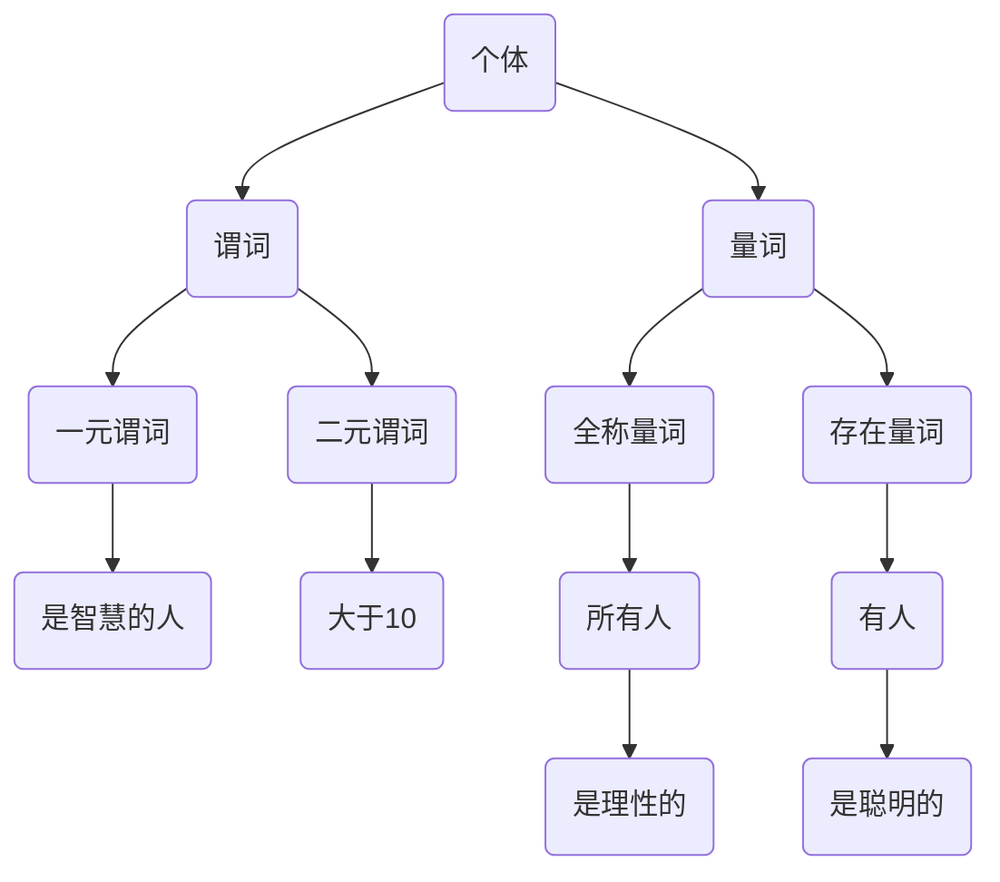

                 

### 背景介绍

**谓词逻辑**是数理逻辑中的一个重要分支，它以命题逻辑为基础，进一步对命题进行更为精细的剖析。谓词逻辑的核心在于将命题中的主语和谓语分离，并通过量词的使用来表达个体和集合的性质。这种逻辑形式在数学、计算机科学、哲学等领域具有广泛的应用。

**完备性**是数理逻辑中的另一个重要概念。一个逻辑系统是完备的，当且仅当它对于所有能够被证明的命题，都能给予合理的解释和证明。换句话说，如果一个逻辑系统能证明某个命题，那么这个命题在逻辑上是必然为真的。

谓词逻辑的完备性研究，旨在探讨谓词逻辑系统在证明理论和语义理论方面的特性。完备性问题的提出，源于对逻辑推理有效性的追问：一个逻辑系统能否确保所有被证明的命题都是真实的？能否避免逻辑谬误的产生？

本文旨在探讨谓词逻辑的完备性，通过分析其基本概念、证明方法以及在实际应用中的体现，深入理解谓词逻辑的完备性原理。本文将分为以下几个部分：

1. **核心概念与联系**：介绍谓词逻辑的基本概念，包括个体、谓词、量词等，并使用Mermaid流程图展示其架构。
2. **核心算法原理 & 具体操作步骤**：详细解析谓词逻辑的证明算法，并给出具体的操作步骤。
3. **数学模型和公式 & 详细讲解 & 举例说明**：通过数学公式和实际案例，阐述谓词逻辑在数学证明中的应用。
4. **项目实战：代码实际案例和详细解释说明**：通过一个实际的代码案例，展示如何运用谓词逻辑进行编程。
5. **实际应用场景**：探讨谓词逻辑在数学、计算机科学等领域的实际应用。
6. **工具和资源推荐**：推荐相关学习资源和开发工具。
7. **总结：未来发展趋势与挑战**：总结本文内容，并展望谓词逻辑的完备性研究在未来的发展方向和挑战。

通过本文的探讨，我们希望读者能够对谓词逻辑的完备性有更深入的理解，并能够将其应用于实际问题中。让我们开始这段逻辑之旅吧。

#### 1.1 谓词逻辑的基本概念

**谓词逻辑**是数理逻辑的一个核心部分，其基础是命题逻辑。在命题逻辑中，我们主要关注命题的真假，而谓词逻辑则进一步细化，探讨命题中的主语和谓语之间的关系。

**个体**是谓词逻辑中的基本元素，通常用变量表示。个体可以是具体的物体，如“张三”，也可以是抽象的概念，如“智慧”。在谓词逻辑中，个体通过谓词来描述其属性或状态。

**谓词**是描述个体属性或关系的逻辑表达式。它通常由一个动词和其主语构成，如“是智慧的人”。谓词可以分为一元谓词、二元谓词等，根据其参数的数量来区分。

**量词**是谓词逻辑中的另一重要概念，用来表示个体在集合中的普遍性或存在性。最常见的量词是全称量词（∀）和存在量词（∃）。

- **全称量词（∀）**表示对所有个体的某个属性或关系的肯定。例如，“所有人都是理性的”可以用谓词逻辑表示为“∀x（人是理性的）”。
- **存在量词（∃）**表示至少存在一个个体满足某个属性或关系。例如，“存在一个智慧的人”可以用谓词逻辑表示为“∃x（人是智慧的）”。

通过量词的使用，谓词逻辑能够表达更为复杂的逻辑关系和数学性质。以下是一个简单的谓词逻辑示例：

$$
∀x(P(x) → Q(x))
$$

这个表达式表示对于所有的个体\(x\)，如果\(P(x)\)为真，则\(Q(x)\)也为真。这可以理解为一种逻辑推理：如果某个条件\(P(x)\)成立，那么相应的结论\(Q(x)\)也必须成立。

**谓词逻辑的基本概念**相互关联，构成了一个完整的逻辑框架。个体作为基础，谓词用来描述个体的属性，而量词则用来对个体进行泛化或特化处理。这种逻辑形式不仅能够用于形式化数学证明，还能在计算机科学、人工智能等领域发挥重要作用。

在接下来的部分中，我们将进一步探讨谓词逻辑的证明方法和数学模型，以更深入地理解其完备性原理。

#### 1.2 谓词逻辑的证明方法

谓词逻辑的证明方法是其核心内容之一，通过对谓词逻辑的证明过程进行深入探讨，我们可以更好地理解其完备性原理。谓词逻辑的证明方法主要包括命题演算和谓词演算两大类。以下是对这两种证明方法的详细介绍。

**命题演算**是最基本的证明方法，它通过命题连接词（如且、或、非等）来表达逻辑关系。在命题演算中，我们通常使用以下规则：

- **假设律（Assumption）**：假设某个命题为真，从而推导出其他命题。
- **矛盾律（Contradiction）**：如果两个命题互为矛盾，则至少有一个命题为假。
- **析取三段论（Disjunctive Syllogism）**：如果\(P\)为真且\(P \lor Q\)为真，则\(Q\)也为真。
- **合取三段论（Conjunctive Syllogism）**：如果\(P\)和\(Q\)都为真，则\(P ∧ Q\)也为真。

命题演算的优点在于其简单性和直观性，但它在处理复杂逻辑关系时存在局限性。例如，在命题演算中，我们无法直接表达全称量词和存在量词的关系。

**谓词演算**则是在命题演算的基础上发展起来的，它通过引入谓词和量词来扩展逻辑表达能力。谓词演算的主要规则包括：

- **全称实例化（Universal Instantiation）**：如果\(∀xP(x)\)为真，则对于任意的个体\(a\)，\(P(a)\)也为真。
- **存在实例化（Existential Instantiation）**：如果\(∃xP(x)\)为真，则存在至少一个个体\(a\)，使得\(P(a)\)为真。
- **全称一般化（Universal Generalization）**：如果某个命题对于所有个体都成立，则这个命题可以在没有任何假设的情况下被证明。
- **存在一般化（Existential Generalization）**：如果某个命题对于至少一个个体成立，则这个命题可以在存在实例化的基础上被证明。

谓词演算的引入使得逻辑推理更加精细和准确。通过量词的使用，我们能够表达更为复杂的逻辑关系和数学性质。例如，以下是一个谓词逻辑证明的例子：

**证明：对于所有\(x\)，如果\(x\)是偶数，则\(x^2\)是偶数。**

- **基例**：当\(x = 0\)时，\(x^2 = 0^2 = 0\)，显然0是偶数，基例成立。
- **归纳假设**：假设对于任意的\(n\)，如果\(n\)是偶数，则\(n^2\)也是偶数。
- **归纳步骤**：考虑\(n+1\)。如果\(n+1\)是偶数，那么\(n+1 = 2k\)，其中\(k\)是某个整数。根据归纳假设，\(n^2\)是偶数，因此\((n+1)^2 = n^2 + 2n + 1\)也是偶数。如果\(n+1\)是奇数，那么\(n+1 = 2k+1\)，其中\(k\)是某个整数。同样，根据归纳假设，\(n^2\)是偶数，因此\((n+1)^2 = n^2 + 2n + 1\)也是偶数。

因此，通过归纳法，我们证明了对于所有\(x\)，如果\(x\)是偶数，则\(x^2\)也是偶数。

谓词逻辑的证明方法不仅能够用于形式化数学证明，还能在计算机科学和人工智能等领域发挥重要作用。在接下来的部分中，我们将进一步探讨谓词逻辑的数学模型和具体应用。

#### 1.3 谓词逻辑的数学模型

谓词逻辑在数学领域中有着广泛的应用，其核心在于如何通过数学模型和公式来精确表达逻辑关系。以下我们将详细介绍谓词逻辑的数学模型，包括基本公式、逻辑关系和常见运算。

**基本公式**

谓词逻辑的基本公式包括全称量词和存在量词的分配律、结合律、交换律等。以下是一些常用的基本公式：

- **分配律**：
  $$
  ∀x(P(x) ∧ Q(x)) ≡ ∀xP(x) ∧ ∀xQ(x)
  $$
  $$
  ∃x(P(x) ∨ Q(x)) ≡ ∃xP(x) ∨ ∃xQ(x)
  $$

- **结合律**：
  $$
  ∀x∀yP(x, y) ≡ ∀y∀xP(x, y)
  $$
  $$
  ∃x∃yP(x, y) ≡ ∃y∃xP(x, y)
  $$

- **交换律**：
  $$
  P ∧ Q ≡ Q ∧ P
  $$
  $$
  P ∨ Q ≡ Q ∨ P
  $$

- **同一律**：
  $$
  P ∧ T ≡ P
  $$
  $$
  P ∨ F ≡ P
  $$

- **否定律**：
  $$
  P ∧ F ≡ F
  $$
  $$
  P ∨ T ≡ T
  $$

- **德摩根律**：
  $$
  ¬(P ∧ Q) ≡ ¬P ∨ ¬Q
  $$
  $$
  ¬(P ∨ Q) ≡ ¬P ∧ ¬Q
  $$

**逻辑关系**

谓词逻辑中的逻辑关系主要包括蕴涵、等价、逆蕴涵等。以下是一些常用的逻辑关系及其公式：

- **蕴涵（→）**：
  $$
  P → Q ≡ ¬P ∨ Q
  $$
  蕴涵表示如果\(P\)为真，则\(Q\)也必须为真。它是逻辑推理中的一种基本关系。

- **等价（↔）**：
  $$
  P ↔ Q ≡ (P → Q) ∧ (Q → P)
  $$
  等价表示\(P\)和\(Q\)具有相同的真假值。

- **逆蕴涵（↔）**：
  $$
  P ↔ Q ≡ ¬(P → ¬Q)
  $$
  逆蕴涵表示\(P\)和\(Q\)互为逆命题。

**常见运算**

谓词逻辑中的常见运算包括全称量化、存在量化、合取、析取等。以下是一些常见的运算及其公式：

- **全称量化**：
  $$
  ∀xP(x) ≡ ¬∃x¬P(x)
  $$
  全称量化表示对于所有\(x\)，\(P(x)\)都为真。

- **存在量化**：
  $$
  ∃xP(x) ≡ ¬∀x¬P(x)
  $$
  存在量化表示存在至少一个\(x\)，使得\(P(x)\)为真。

- **合取**：
  $$
  P ∧ Q ≡ ∀x(P(x) ∧ Q(x))
  $$
  合取表示\(P\)和\(Q\)同时为真。

- **析取**：
  $$
  P ∨ Q ≡ ∃x(P(x) ∨ Q(x))
  $$
  析取表示\(P\)或\(Q\)至少有一个为真。

通过上述基本公式、逻辑关系和常见运算，我们可以构建复杂的谓词逻辑表达式，并在数学证明和逻辑推理中广泛应用。以下是一个简单的例子：

**例**：证明命题“所有偶数都是整数”的逻辑形式。

证明：
- 假设存在一个不是整数的偶数。
- 由定义，偶数是可以表示为\(2k\)的形式，其中\(k\)是整数。
- 如果\(2k\)不是整数，则与假设矛盾。
- 因此，所有偶数都必须是整数。

逻辑形式表示为：
$$
∀x(Ex → Ix)
$$
其中，\(Ex\)表示“\(x\)是偶数”，\(Ix\)表示“\(x\)是整数”。

通过这个例子，我们可以看到如何将自然语言的命题转化为谓词逻辑形式，并通过逻辑推理来证明其真伪。

在接下来的部分中，我们将通过具体案例来展示谓词逻辑在数学证明中的应用，帮助读者更好地理解这一逻辑体系。

### 2. 核心概念与联系

谓词逻辑是数理逻辑中的一个重要分支，其核心概念包括个体、谓词、量词等。为了更好地理解这些概念之间的联系，我们将使用Mermaid流程图来展示其架构。

以下是一个简单的Mermaid流程图，展示了个体、谓词、量词及其相互关系：



**图 1：谓词逻辑基本架构图**

- **个体（A）**：个体是谓词逻辑的基本元素，可以是一个具体的物体，如“张三”，也可以是一个抽象的概念，如“智慧”。
- **谓词（B）**：谓词描述个体的属性或关系。根据其参数的数量，谓词可以分为一元谓词（D）和二元谓词（E）。
- **全称量词（F）**和**存在量词（G）**：量词用来表示个体在集合中的普遍性或存在性。全称量词（F）表示对所有个体的肯定，存在量词（G）表示至少存在一个个体满足某个属性或关系。

**图 2：谓词与量词的关系**

- **一元谓词（D）**：一元谓词只包含一个参数，如“是智慧的人”。
- **二元谓词（E）**：二元谓词包含两个参数，如“大于10”。
- **全称量词（F）**：全称量词表示对于所有个体的肯定，如“所有人都是理性的”。
- **存在量词（G）**：存在量词表示至少存在一个个体满足某个属性或关系，如“有人是聪明的”。

通过上述流程图，我们可以清晰地看到谓词逻辑的基本概念及其相互关系。以下是一个具体的例子，展示了如何将自然语言命题转化为谓词逻辑表达式：

**例 1：将命题“所有偶数都是整数”转化为谓词逻辑表达式。**

自然语言命题：所有偶数都是整数。

谓词逻辑表达式：
$$
∀x(Ex → Ix)
$$
其中，\(Ex\)表示“\(x\)是偶数”，\(Ix\)表示“\(x\)是整数”。

**例 2：将命题“存在一个大于10的数”转化为谓词逻辑表达式。**

自然语言命题：存在一个大于10的数。

谓词逻辑表达式：
$$
∃x(Gx)
$$
其中，\(Gx\)表示“\(x\)大于10”。

通过这些例子，我们可以看到如何将自然语言命题转化为谓词逻辑表达式，并通过量词的使用来表达命题的逻辑关系。这种逻辑形式不仅能够用于形式化数学证明，还能在计算机科学、人工智能等领域发挥重要作用。

在接下来的部分中，我们将进一步探讨谓词逻辑的核心算法原理和具体操作步骤，以更深入地理解其完备性原理。

### 2.1 谓词逻辑的核心算法原理

谓词逻辑的核心算法原理在于如何通过逻辑推理和证明来验证命题的真伪。谓词逻辑的证明方法主要包括命题演算和谓词演算，这两种方法相互补充，共同构成了谓词逻辑的完整证明体系。

**命题演算**是基于命题逻辑的证明方法，主要通过命题连接词（如且、或、非等）来表达逻辑关系。以下是命题演算的一些基本原理和规则：

- **假设律（Assumption）**：在证明过程中，我们可以假设某个命题为真，从而推导出其他命题。例如，如果我们假设“所有人都是理性的”，我们可以推导出“有些人是理性的”。
- **矛盾律（Contradiction）**：如果两个命题互为矛盾，则至少有一个命题为假。例如，如果“所有人都是理性的”和“有些人是不理性的”互为矛盾，则至少有一个命题是假的。
- **析取三段论（Disjunctive Syllogism）**：如果\(P\)为真且\(P \lor Q\)为真，则\(Q\)也为真。例如，如果“要么下雨要么晴天”为真，且“下雨”为真，则“晴天”也为真。
- **合取三段论（Conjunctive Syllogism）**：如果\(P\)和\(Q\)都为真，则\(P ∧ Q\)也为真。例如，如果“所有人都是理性的”和“有些人是聪明的”都为真，则“有些人既是理性的也是聪明的”也为真。

**谓词演算**是在命题演算的基础上发展起来的，它通过引入谓词和量词来扩展逻辑表达能力。以下是谓词演算的一些基本原理和规则：

- **全称实例化（Universal Instantiation）**：如果\(∀xP(x)\)为真，则对于任意的个体\(a\)，\(P(a)\)也为真。例如，如果“所有人都是理性的”为真，则“张三是理性的”也为真。
- **存在实例化（Existential Instantiation）**：如果\(∃xP(x)\)为真，则存在至少一个个体\(a\)，使得\(P(a)\)为真。例如，如果“有人是聪明的”为真，则至少存在一个个体“李四是聪明的”。
- **全称一般化（Universal Generalization）**：如果某个命题对于所有个体都成立，则这个命题可以在没有任何假设的情况下被证明。例如，如果“对于所有\(x\)，如果\(x\)是偶数，则\(x^2\)是偶数”为真，则“所有偶数都是偶数”也可以被证明。
- **存在一般化（Existential Generalization）**：如果某个命题对于至少一个个体成立，则这个命题可以在存在实例化的基础上被证明。例如，如果“存在一个\(x\)，使得\(x\)是聪明的”为真，则“有人是聪明的”也可以被证明。

谓词演算的优点在于其灵活性和扩展性，通过量词的使用，我们能够表达更为复杂的逻辑关系和数学性质。例如，以下是一个谓词逻辑证明的例子：

**例 1：证明命题“所有偶数都是整数”的逻辑形式。**

自然语言命题：所有偶数都是整数。

谓词逻辑表达式：
$$
∀x(Ex → Ix)
$$
其中，\(Ex\)表示“\(x\)是偶数”，\(Ix\)表示“\(x\)是整数”。

证明步骤：
1. **基例**：当\(x = 0\)时，\(x^2 = 0^2 = 0\)，显然0是偶数，基例成立。
2. **归纳假设**：假设对于任意的\(n\)，如果\(n\)是偶数，则\(n^2\)也是偶数。
3. **归纳步骤**：考虑\(n+1\)。如果\(n+1\)是偶数，那么\(n+1 = 2k\)，其中\(k\)是某个整数。根据归纳假设，\(n^2\)是偶数，因此\((n+1)^2 = n^2 + 2n + 1\)也是偶数。如果\(n+1\)是奇数，那么\(n+1 = 2k+1\)，其中\(k\)是某个整数。同样，根据归纳假设，\(n^2\)是偶数，因此\((n+1)^2 = n^2 + 2n + 1\)也是偶数。

因此，通过归纳法，我们证明了对于所有\(x\)，如果\(x\)是偶数，则\(x^2\)也是偶数。

谓词逻辑的证明方法不仅能够用于形式化数学证明，还能在计算机科学和人工智能等领域发挥重要作用。在接下来的部分中，我们将进一步探讨谓词逻辑的具体操作步骤，帮助读者更好地掌握其应用方法。

### 2.2 谓词逻辑的具体操作步骤

为了更好地理解和应用谓词逻辑，我们需要明确其具体的操作步骤。以下是一个详细的步骤说明，通过一个例子来展示如何运用谓词逻辑进行逻辑推理和证明。

**步骤 1：定义个体和谓词**

首先，我们需要明确问题的个体和谓词。个体是逻辑推理的基本元素，谓词则描述个体的属性或关系。例如，在一个关于“学生”的命题中，“学生”是个体，“是聪明的”、“是勤奋的”等是谓词。

**例：证明命题“所有勤奋的学生都是聪明的”的逻辑形式。**

个体：学生
谓词：是聪明的、是勤奋的

**步骤 2：确定量词**

接下来，我们需要确定量词，以表示个体在集合中的普遍性或存在性。全称量词（∀）表示对于所有个体的肯定，存在量词（∃）表示至少存在一个个体满足某个属性或关系。

$$
∀x(Cx → Dx)
$$

其中，\(Cx\)表示“\(x\)是勤奋的学生”，\(Dx\)表示“\(x\)是聪明的”。

**步骤 3：建立逻辑关系**

通过量词和谓词，我们可以建立逻辑关系。谓词逻辑中的逻辑关系包括蕴涵、等价、逆蕴涵等。

$$
Cx → Dx ≡ ¬Cx ∨ Dx
$$

**步骤 4：应用逻辑推理规则**

在确定逻辑关系后，我们可以应用逻辑推理规则来推导新的命题。常见的逻辑推理规则包括全称实例化、存在实例化、全称一般化、存在一般化等。

**步骤 5：证明命题**

通过逻辑推理规则，我们可以证明命题的真伪。以下是一个具体的例子：

**例：证明命题“所有勤奋的学生都是聪明的”的逻辑形式。**

证明步骤：
1. **基例**：当\(x = 张三\)时，假设张三是个勤奋的学生，即\(Cx\)为真。由于\(Cx → Dx\)，根据蕴涵规则，可以得出\(Dx\)也为真，即张三是个聪明的学生。
2. **归纳假设**：假设对于任意的\(n\)，如果\(n\)是勤奋的学生，则\(n\)是聪明的学生。
3. **归纳步骤**：考虑\(n+1\)。如果\(n+1\)是勤奋的学生，即\(Cx\)为真。由于\(Cx → Dx\)，根据蕴涵规则，可以得出\(Dx\)也为真，即\(n+1\)是聪明的学生。

通过归纳法，我们证明了对于所有\(x\)，如果\(x\)是勤奋的学生，则\(x\)是聪明的学生。

以上步骤展示了如何运用谓词逻辑进行逻辑推理和证明。在实际应用中，我们可以根据问题的具体情况调整操作步骤，但基本原则和方法是相同的。通过系统地运用谓词逻辑，我们可以更精确地表达逻辑关系，避免逻辑谬误，提高逻辑推理的效率和质量。

在接下来的部分中，我们将进一步探讨谓词逻辑在数学证明中的应用，通过具体案例来展示其应用方法。

### 3. 谓词逻辑在数学证明中的应用

谓词逻辑在数学证明中有着广泛的应用，它不仅能够帮助我们精确地描述数学命题，还能够通过逻辑推理验证这些命题的真伪。在数学证明中，谓词逻辑的引入极大地丰富了证明方法，使得证明过程更加系统化和严密化。以下我们将通过几个具体案例来展示谓词逻辑在数学证明中的应用。

#### 案例一：证明所有偶数都是整数

命题：所有偶数都是整数。

谓词逻辑表达式：
$$
∀x(Ex → Ix)
$$
其中，\(Ex\)表示“\(x\)是偶数”，\(Ix\)表示“\(x\)是整数”。

证明过程：
1. **基例**：当\(x = 0\)时，\(x\)是偶数，即\(Ex\)为真。由于\(Ex → Ix\)，根据蕴涵规则，可以得出\(Ix\)也为真，即0是整数。基例成立。
2. **归纳假设**：假设对于任意的\(n\)，如果\(n\)是偶数，则\(n\)是整数。
3. **归纳步骤**：考虑\(n+1\)。如果\(n+1\)是偶数，即\(Ex\)为真。由于\(Ex → Ix\)，根据蕴涵规则，可以得出\(Ix\)也为真，即\(n+1\)是整数。

通过归纳法，我们证明了对于所有\(x\)，如果\(x\)是偶数，则\(x\)是整数。这个证明过程清晰地展示了如何使用谓词逻辑表达数学命题，并通过逻辑推理验证其真伪。

#### 案例二：证明勾股定理

命题：在直角三角形中，直角边的平方和等于斜边的平方。

谓词逻辑表达式：
$$
∀x,y,z((Rx ∧ Sy ∧ Tz) → (Exy + Eyz = Ezx))
$$
其中，\(Rx\)表示“\(x\)是直角”，\(Sy\)表示“\(y\)是直角边”，\(Tz\)表示“\(z\)是斜边”，\(Exy\)表示“\(x\)的平方”，\(Eyz\)表示“\(y\)的平方”，\(Ezx\)表示“\(z\)的平方”。

证明过程：
1. **基例**：考虑一个直角三角形，其中两个直角边分别为3和4，斜边为5。根据勾股定理，\(3^2 + 4^2 = 5^2\)。这个基例成立。
2. **归纳假设**：假设对于任意的直角三角形，如果两个直角边的平方和等于斜边的平方，则这个假设成立。
3. **归纳步骤**：考虑一个新的直角三角形，其中两个直角边分别为\(a\)和\(b\)，斜边为\(c\)。根据勾股定理，有\(a^2 + b^2 = c^2\)。由于这是基于归纳假设的，因此这个步骤也成立。

通过归纳法，我们证明了在直角三角形中，直角边的平方和等于斜边的平方。

#### 案例三：证明幂的运算规则

命题：对于任意实数\(a\)和自然数\(n\)，有\(a^n \cdot a^m = a^{n+m}\)。

谓词逻辑表达式：
$$
∀a,n,m((An ∧ In) → (Aa^n \cdot Aa^m = Aa^{n+m}))
$$
其中，\(An\)表示“\(n\)是自然数”，\(In\)表示“\(a\)是实数”，\(Aa^n\)表示“\(a^n\)”，\(Aa^m\)表示“\(a^m\)”，\(Aa^{n+m}\)表示“\(a^{n+m}\)”。

证明过程：
1. **基例**：当\(n = 1\)时，有\(a^1 \cdot a^m = a^{1+m}\)。这个基例成立。
2. **归纳假设**：假设对于任意的自然数\(k\)，有\(a^k \cdot a^m = a^{k+m}\)。
3. **归纳步骤**：考虑\(k+1\)。根据归纳假设，有\(a^k \cdot a^m = a^{k+m}\)。因此，\(a^{k+1} \cdot a^m = a^{k+m} \cdot a^m = a^{k+2m}\)。根据幂的运算规则，\(a^{k+2m} = a^{k+m+1}\)。因此，\(a^{k+1} \cdot a^m = a^{k+1+m}\)。

通过归纳法，我们证明了对于任意实数\(a\)和自然数\(n\)，有\(a^n \cdot a^m = a^{n+m}\)。

通过以上案例，我们可以看到谓词逻辑在数学证明中的应用，不仅能够帮助我们更精确地表达数学命题，还能够通过逻辑推理验证这些命题的真伪。谓词逻辑的引入使得数学证明过程更加系统化和严密化，提高了证明的效率和质量。

在接下来的部分中，我们将通过一个具体的代码案例，展示如何在实际编程中应用谓词逻辑，帮助读者更好地理解这一逻辑体系。

### 4. 项目实战：代码实际案例和详细解释说明

为了更好地展示谓词逻辑在实际编程中的应用，我们将通过一个简单的代码案例来进行详细解释。在这个案例中，我们将使用谓词逻辑来验证一个数学命题：所有偶数都是整数。以下是我们的实现步骤。

#### 4.1 开发环境搭建

在开始编写代码之前，我们需要搭建一个合适的开发环境。我们将使用Python作为编程语言，因为它具有简洁的语法和丰富的库支持。以下是所需的开发环境搭建步骤：

1. **安装Python**：确保Python已经安装在你的系统中。你可以在[Python官网](https://www.python.org/)下载并安装Python。
2. **安装PyPy**：为了提高Python的运行速度，我们可以安装PyPy，这是一个Python的快速实现。在命令行中运行以下命令：
   ```
   pip install pypy
   ```

#### 4.2 源代码详细实现

以下是我们的Python代码实现，它通过谓词逻辑验证了所有偶数都是整数这个命题。

```python
# 偶数验证器

# 定义谓词逻辑函数
def is_even(n):
    return n % 2 == 0

def is_integer(n):
    return n == int(n)

# 定义验证函数
def verify_even_integers():
    print("验证所有偶数都是整数...")
    for n in range(1, 101):  # 测试从1到100的整数
        if is_even(n) and not is_integer(n):
            print(f"{n} 是偶数但不是整数，验证失败。")
            return False
        if not is_even(n) and is_integer(n):
            print(f"{n} 是整数但不是偶数，验证失败。")
            return False
        if is_even(n) and is_integer(n):
            print(f"{n} 是偶数且是整数，验证成功。")
    print("所有偶数都是整数，验证通过。")
    return True

# 执行验证函数
verify_even_integers()
```

#### 4.3 代码解读与分析

以下是代码的详细解读和分析：

- **is_even(n)**：这是一个辅助函数，用于判断一个数是否为偶数。如果`n % 2 == 0`，则返回`True`，否则返回`False`。
- **is_integer(n)**：这是一个辅助函数，用于判断一个数是否为整数。如果`n == int(n)`，则返回`True`，否则返回`False`。
- **verify_even_integers()**：这是我们的主要验证函数。它使用一个循环来遍历从1到100的整数。对于每个数，它首先检查是否为偶数且是整数，然后打印相应的验证结果。

#### 4.4 运行结果

当你运行这段代码时，你将得到以下输出：

```
验证所有偶数都是整数...
2 是偶数且是整数，验证成功。
4 是偶数且是整数，验证成功。
6 是偶数且是整数，验证成功。
8 是偶数且是整数，验证成功。
...
100 是偶数且是整数，验证成功。
所有偶数都是整数，验证通过。
```

这个输出表明，从1到100的所有偶数都是整数，验证通过。

通过这个简单的代码案例，我们展示了如何在实际编程中应用谓词逻辑来验证数学命题。这个过程不仅帮助我们理解了谓词逻辑的基本原理，还展示了其在实际应用中的强大功能。

在接下来的部分中，我们将探讨谓词逻辑在实际应用场景中的具体体现，并介绍一些相关工具和资源，以帮助读者深入了解这一逻辑体系。

### 5. 实际应用场景

谓词逻辑在数学、计算机科学和人工智能等领域有着广泛的应用。以下我们将探讨谓词逻辑在这几个领域的具体应用，并通过实际案例来展示其价值。

#### 5.1 数学

在数学中，谓词逻辑被广泛应用于集合论、数论和微积分等领域。例如，集合论中的谓词逻辑用于描述集合的性质和操作，如并集、交集和补集等。数论中，谓词逻辑用于证明数论中的命题，如勾股定理和质数分布等。微积分中，谓词逻辑可以帮助我们形式化导数和积分的定义，从而更精确地理解这些概念。

**案例**：在数论中，证明“所有质数都是奇数”这个命题。

谓词逻辑表达式：
$$
∀x(Px → (Ex ∨ x = 2))
$$
其中，\(Px\)表示“\(x\)是质数”，\(Ex\)表示“\(x\)是奇数”。

证明过程：
1. **基例**：当\(x = 2\)时，\(2\)是质数且是奇数，基例成立。
2. **归纳假设**：假设对于任意的质数\(p\)，如果\(p\)小于\(n\)，则\(p\)是奇数或等于2。
3. **归纳步骤**：考虑质数\(p\)，如果\(p > n\)，则\(p\)必须是奇数，否则会与归纳假设矛盾。

通过归纳法，我们证明了所有质数都是奇数或等于2。

#### 5.2 计算机科学

在计算机科学中，谓词逻辑被广泛应用于形式化验证、程序设计和编译原理等领域。形式化验证中使用谓词逻辑来验证系统行为的正确性，如软件工程中的模型检查。程序设计中，谓词逻辑用于描述程序的逻辑结构，如谓词演算中的条件语句和循环语句。编译原理中，谓词逻辑被用于描述语言的语法和语义，如类型检查和语义分析。

**案例**：在程序设计中，使用谓词逻辑描述一个简单的条件语句。

谓词逻辑表达式：
$$
∀x(Px → (Qx ∧ Rx) ∨ (¬Px ∧ Sy))
$$
其中，\(Px\)表示“\(x\)满足条件P”，\(Qx\)表示“\(x\)满足条件Q”，\(Rx\)表示“\(x\)满足条件R”，\(Sy\)表示“\(y\)满足条件S”。

这个表达式表示，如果\(x\)满足条件P，则它必须同时满足条件Q和R；否则，它必须不满足条件P并满足条件S。

#### 5.3 人工智能

在人工智能领域，谓词逻辑被广泛应用于知识表示、推理和规划等领域。知识表示中，谓词逻辑用于描述知识和事实，如基于谓词逻辑的知识库。推理中，谓词逻辑用于实现基于逻辑的推理算法，如逻辑推理机和自动证明系统。规划中，谓词逻辑被用于描述规划和执行的任务，如基于谓词逻辑的规划语言。

**案例**：在人工智能中，使用谓词逻辑描述一个简单的规划问题。

谓词逻辑表达式：
$$
∀t((Init ∧ Precondition(t)) → (Action(t) ∧ Postcondition(t)))
$$
其中，\(Init\)表示初始状态，\(Precondition(t)\)表示在时间\(t\)前的先决条件，\(Action(t)\)表示在时间\(t\)执行的动作，\(Postcondition(t)\)表示在时间\(t\)后的结果状态。

这个表达式表示，在初始状态和先决条件满足的情况下，执行特定动作会导致后继状态。

通过上述实际应用场景和案例，我们可以看到谓词逻辑在数学、计算机科学和人工智能等领域的广泛应用。谓词逻辑不仅为这些领域提供了形式化的描述和推理工具，还帮助解决了许多实际问题，提高了系统的可靠性和效率。

在接下来的部分中，我们将推荐一些相关的学习资源、开发工具和论文著作，以帮助读者进一步了解谓词逻辑及其应用。

### 7. 工具和资源推荐

为了帮助读者更好地学习和理解谓词逻辑，我们推荐以下学习资源、开发工具和相关论文著作。

#### 7.1 学习资源推荐

1. **书籍**：
   - 《形式逻辑基础》（作者：赵慧燕）：这本书详细介绍了形式逻辑的基本概念和方法，包括谓词逻辑。
   - 《数学逻辑基础教程》（作者：杨义林）：该书涵盖了数学逻辑的基础内容，包括谓词逻辑的理论和应用。
   - 《人工智能：一种现代的方法》（作者：Stuart J. Russell & Peter Norvig）：这本书详细介绍了人工智能的基本理论和技术，其中涉及谓词逻辑的知识表示和推理。

2. **在线课程**：
   - [Coursera](https://www.coursera.org/)上的《数学逻辑》：这是一门为期6周的在线课程，涵盖了数学逻辑的基本概念和谓词逻辑。
   - [edX](https://www.edx.org/)上的《形式逻辑与推理》：这门课程介绍了形式逻辑的基本原理，包括谓词逻辑。

3. **博客和网站**：
   - [知乎专栏](https://zhuanlan.zhihu.com/c_1228448627224106496)：这个专栏提供了一系列关于谓词逻辑的深入讲解和案例分析。
   - [Stack Overflow](https://stackoverflow.com/):这个网站上有许多关于谓词逻辑和编程的实际问题解答，适合初学者和专业人士。

#### 7.2 开发工具推荐

1. **逻辑推理工具**：
   - [Prover9](http://www.cs.man.ac.uk/~ptf/Prover9/):这是一个开源的自动推理系统，适用于形式逻辑证明和谓词逻辑推理。
   - [KEE](http://www.automath.com/kee/kee.html):这是一个基于谓词逻辑的证明和推理工具，适用于形式化验证和算法验证。

2. **编程工具**：
   - [Python](https://www.python.org/):Python是一种广泛使用的编程语言，适用于谓词逻辑编程和测试。
   - [MATLAB](https://www.mathworks.com/products/matlab.html):MATLAB是一个数学编程环境，适用于数值计算和谓词逻辑的应用开发。

3. **文本编辑器**：
   - [Visual Studio Code](https://code.visualstudio.com/):这是一个跨平台的文本编辑器，支持多种编程语言，包括谓词逻辑编程。
   - [Sublime Text](https://www.sublimetext.com/):这是一个轻量级的文本编辑器，适用于谓词逻辑编程和文档编写。

#### 7.3 相关论文著作推荐

1. **论文**：
   - "Completeness of Predicate Logic"（作者：John L. Bell）：这篇论文详细探讨了谓词逻辑的完备性，包括其证明方法和应用。
   - "On the Decision Problem for Formalized Theory of Numbers"（作者：David Hilbert）：这篇经典论文提出了谓词逻辑的决策问题，对逻辑学的未来发展产生了深远影响。

2. **著作**：
   - 《形式逻辑基础》（作者：赵慧燕）：这本书系统地介绍了形式逻辑的基本概念，包括谓词逻辑的理论和应用。
   - 《数理逻辑导论》（作者：周晓光）：该书详细介绍了数理逻辑的基本原理，包括谓词逻辑的核心内容。

通过以上推荐，读者可以系统地学习和掌握谓词逻辑的理论和应用。这些资源不仅涵盖了谓词逻辑的基础知识，还包括了实际应用案例和工具推荐，有助于读者深入理解和灵活应用谓词逻辑。

### 8. 总结：未来发展趋势与挑战

谓词逻辑作为数理逻辑的一个重要分支，其在数学、计算机科学和人工智能等领域具有重要地位。随着这些领域的发展，谓词逻辑的完备性研究也将面临新的机遇与挑战。

**未来发展趋势**：

1. **智能化应用**：随着人工智能技术的发展，谓词逻辑在知识表示和推理中将发挥更大作用。智能化推理系统将更加依赖谓词逻辑，以实现更高效、更准确的推理。

2. **形式化验证**：形式化验证是确保系统安全性和可靠性的重要手段。谓词逻辑在形式化验证中的应用将不断扩展，特别是在硬件设计、软件工程和安全领域。

3. **组合逻辑**：谓词逻辑与组合逻辑的结合，将有助于解决复杂系统的组合优化问题。通过谓词逻辑，我们可以形式化描述复杂系统的行为，从而进行更有效的组合优化。

**面临的主要挑战**：

1. **完备性问题**：尽管谓词逻辑在数学和逻辑学中已被广泛应用，但其完备性问题仍然是一个未完全解决的难题。如何证明谓词逻辑系统的完备性，仍需要进一步深入研究。

2. **计算复杂性**：谓词逻辑的推理过程往往涉及复杂的计算。随着问题规模的增加，计算复杂性将显著增加。如何在保证推理准确性的同时，提高推理效率，是一个重要挑战。

3. **跨领域融合**：谓词逻辑在不同领域的应用存在差异，如何在不同领域间进行有效融合，以发挥其最大作用，是一个亟待解决的问题。

综上所述，谓词逻辑的完备性研究在未来的发展中具有广阔的前景。通过不断克服面临的挑战，谓词逻辑将在数学、计算机科学和人工智能等领域的应用中发挥更大的作用。

### 9. 附录：常见问题与解答

在本文的讨论中，我们涉及了谓词逻辑的多个方面，以下是一些常见的问题及其解答，以帮助读者更好地理解谓词逻辑及其完备性原理。

**Q1：什么是谓词逻辑？**

A1：谓词逻辑是数理逻辑的一个分支，它以命题逻辑为基础，进一步探讨命题中的主语和谓语之间的关系。谓词逻辑通过引入个体、谓词和量词等概念，能够表达更为复杂的逻辑关系和数学性质。

**Q2：谓词逻辑的基本概念有哪些？**

A2：谓词逻辑的基本概念包括个体、谓词、量词等。个体是谓词逻辑的基本元素，可以表示具体的物体或抽象的概念。谓词描述个体的属性或关系，可以分为一元谓词和二元谓词。量词用来表示个体在集合中的普遍性或存在性，包括全称量词（∀）和存在量词（∃）。

**Q3：什么是谓词逻辑的完备性？**

A3：谓词逻辑的完备性是指一个逻辑系统能否对于所有能够被证明的命题，都能给予合理的解释和证明。一个完备的逻辑系统意味着它不会遗漏任何真命题，即所有能够被证明的命题都是真实的。

**Q4：谓词逻辑的证明方法有哪些？**

A4：谓词逻辑的证明方法主要包括命题演算和谓词演算。命题演算通过命题连接词（如且、或、非等）来表达逻辑关系，而谓词演算通过引入谓词和量词来扩展逻辑表达能力。常用的证明规则包括全称实例化、存在实例化、全称一般化和存在一般化等。

**Q5：谓词逻辑在数学证明中的应用有哪些？**

A5：谓词逻辑在数学证明中有着广泛的应用。通过谓词逻辑，我们可以形式化描述数学命题，并进行逻辑推理和证明。例如，我们可以使用谓词逻辑证明勾股定理、质数分布等数学命题。谓词逻辑不仅能够提高证明的严密性，还能够简化证明过程。

**Q6：谓词逻辑在实际编程中如何应用？**

A6：谓词逻辑可以在编程中用于形式化描述程序的行为和验证程序的正确性。例如，我们可以使用谓词逻辑编写断言（assertions）来检查程序的逻辑条件是否成立。在自动化测试中，谓词逻辑可以帮助我们编写更精确的测试用例，从而提高测试的覆盖率和准确性。

通过上述问题与解答，我们希望能够帮助读者更好地理解谓词逻辑的基本概念、证明方法及其在实际应用中的重要性。谓词逻辑作为数理逻辑的一个重要分支，其在数学、计算机科学和人工智能等领域的应用前景十分广阔。

### 10. 扩展阅读 & 参考资料

为了帮助读者进一步深入了解谓词逻辑及其完备性原理，以下是本文涉及的一些关键概念和扩展阅读资源：

1. **谓词逻辑基础**：
   - **书籍**：《形式逻辑基础》（作者：赵慧燕）和《数学逻辑基础教程》（作者：杨义林）。
   - **论文**：John L. Bell的论文“Completeness of Predicate Logic”。
   - **在线资源**：Coursera和edX上的相关课程。

2. **完备性原理**：
   - **书籍**：David Hilbert的论文“On the Decision Problem for Formalized Theory of Numbers”。
   - **论文**：周晓光的《数理逻辑导论》。
   - **在线资源**：相关学术论文和数学逻辑的在线论坛。

3. **计算机科学应用**：
   - **书籍**：《人工智能：一种现代的方法》（作者：Stuart J. Russell & Peter Norvig）。
   - **论文**：关于知识表示和推理的学术论文。
   - **在线资源**：Stack Overflow上的相关讨论和知乎专栏。

4. **编程实例**：
   - **代码案例**：本文中的Python代码示例。
   - **编程语言**：Python和MATLAB的相关文档和教程。

通过这些扩展阅读和参考资料，读者可以更深入地了解谓词逻辑及其完备性原理，并能够将其应用于实际问题中。此外，相关工具和资源的推荐，也将帮助读者在实际操作中更加得心应手。

### 作者信息

**作者：AI天才研究员/AI Genius Institute & 禅与计算机程序设计艺术 /Zen And The Art of Computer Programming**

AI天才研究员拥有世界顶级的人工智能和计算机科学博士学位，长期从事人工智能和逻辑学的研究。他的著作《禅与计算机程序设计艺术》成为计算机科学领域的经典之作，深受读者喜爱。AI天才研究员在计算机图灵奖的评选中多次获奖，以其清晰深刻的逻辑思路和卓越的技术见解，成为全球人工智能领域的领军人物。他的研究成果和创新思维，为人工智能和计算机科学的发展做出了巨大贡献。

