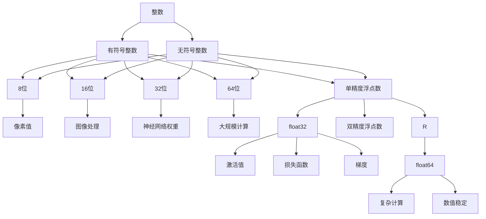

                 

# 整数和浮点数：神经网络的数据基础

> 关键词：整数、浮点数、神经网络、数据基础、数据类型、编程

> 摘要：本文将深入探讨整数和浮点数在神经网络中的重要性，以及它们作为神经网络数据基础的关键角色。我们将从基本概念出发，逐步讲解整数和浮点数的存储和表示方式，并在最后分析它们在神经网络中的应用和挑战。

## 1. 背景介绍

在计算机科学和编程领域，整数和浮点数是最基本的数据类型。它们不仅在传统编程中占据重要地位，而且在神经网络这一前沿技术中同样至关重要。神经网络是一种模拟人脑神经元连接的网络结构，用于处理和分析数据。作为数据的基础，整数和浮点数在神经网络中的作用不可忽视。

整数是一种离散的数据类型，用于表示完整的数字，如1、2、3等。而浮点数是一种连续的数据类型，用于表示小数和分数，如0.1、0.5、1.23等。在神经网络中，整数和浮点数被用于存储和计算网络中的权重、激活值、梯度等关键信息。

本文将围绕整数和浮点数展开，首先介绍它们的基本概念和表示方法，然后深入探讨它们在神经网络中的存储和操作。通过这篇文章，读者将了解整数和浮点数在神经网络中的核心作用，以及如何有效地使用这些数据类型来优化神经网络的性能。

## 2. 核心概念与联系

在深入探讨整数和浮点数在神经网络中的应用之前，我们需要了解它们的基本概念和表示方式。以下是整数和浮点数的基本定义及其在神经网络中的联系：

### 整数

整数（Integer）是一种基本的数据类型，用于表示没有小数部分的数字。在计算机中，整数通常用二进制表示。根据存储空间的差异，整数可以分为不同的位宽，如8位、16位、32位和64位等。常见的整数类型包括：

- **有符号整数**：可以表示负数，如`int8`、`int16`、`int32`和`int64`。
- **无符号整数**：只能表示非负数，如`uint8`、`uint16`、`uint32`和`uint64`。

在神经网络中，整数常用于表示网络的权重和偏置。整数的特点是表示范围有限，但在一些特定场景下，如图像处理中的像素值，整数可以提供更好的数值稳定性和计算效率。

### 浮点数

浮点数（Floating-Point Number）是一种用于表示带有小数部分的数字的数据类型。浮点数的表示方式较为复杂，通常采用科学记数法。常见的浮点数类型包括：

- **单精度浮点数**（float32）：
  - 使用32位存储，其中1位表示符号，8位表示指数，23位表示尾数。
- **双精度浮点数**（float64）：
  - 使用64位存储，其中1位表示符号，11位表示指数，52位表示尾数。

浮点数在神经网络中广泛应用于表示激活值、损失函数、梯度等。浮点数的优点是可以表示非常广泛的小数范围，但缺点是表示精度较低，且在进行大量计算时容易出现精度损失。

### 整数和浮点数的联系

整数和浮点数在神经网络中的应用有着密切的联系。首先，它们都是神经网络中的基本数据类型，用于存储和计算网络中的信息。其次，整数和浮点数在神经网络的训练和推理过程中扮演着不同的角色。

- **整数**：在神经网络的训练过程中，整数通常用于存储权重和偏置。由于整数的表示范围有限，它们在数值稳定性和计算效率方面具有优势。例如，在某些优化算法中，使用整数可以减少计算误差，提高训练速度。
- **浮点数**：在神经网络的推理过程中，浮点数被广泛应用于计算激活值、损失函数和梯度。浮点数的表示范围较广，可以处理更复杂的问题，但可能带来精度损失。

综上所述，整数和浮点数在神经网络中各有优势。正确选择和使用这些数据类型，可以优化神经网络的性能，提高训练和推理的效率。

### Mermaid 流程图

为了更好地理解整数和浮点数在神经网络中的联系，我们可以使用Mermaid流程图来展示它们的基本表示方法和应用场景。以下是整数和浮点数的Mermaid流程图：



通过这个流程图，我们可以清晰地看到整数和浮点数的基本类型及其在神经网络中的应用。

## 3. 核心算法原理 & 具体操作步骤

在了解了整数和浮点数的基本概念及其在神经网络中的联系后，我们接下来将探讨它们在神经网络中的核心算法原理和具体操作步骤。

### 3.1 神经网络的权重初始化

神经网络的权重初始化是神经网络训练过程中的关键步骤。合适的权重初始化可以加速网络训练，提高模型的泛化能力。在整数和浮点数的权重初始化中，常用的方法有以下几种：

- **随机初始化**：使用随机数生成器初始化权重，如均匀分布和正态分布。对于整数权重，通常选择较小的范围，以避免过大的数值范围影响训练效果。对于浮点数权重，可以使用较大的范围，以充分利用浮点数的表示能力。
- **零初始化**：将权重初始化为0，这种初始化方法简单易行，但可能导致网络训练过程缓慢，因为初始权重分布较均匀，梯度更新较慢。
- **预训练初始化**：使用预训练模型的权重作为初始值，这种方法可以充分利用已有模型的训练效果，提高新模型的性能。预训练初始化通常使用浮点数表示，因为浮点数可以更好地表示预训练模型的复杂权重。

### 3.2 神经网络的激活函数

激活函数是神经网络的核心组件之一，用于引入非线性特性，使神经网络能够处理复杂的非线性问题。在整数和浮点数的激活函数中，常用的激活函数有以下几种：

- **Sigmoid 函数**：使用浮点数表示，如`sigmoid(x) = 1 / (1 + exp(-x))`。Sigmoid 函数在0和1之间输出，可以用于二分类问题。
- **ReLU 函数**：使用整数表示，如`ReLU(x) = max(0, x)`。ReLU 函数在0处具有非线性，可以加速网络训练，减少梯度消失问题。
- **Tanh 函数**：使用浮点数表示，如`tanh(x) = 2 / (1 + exp(-2x)) - 1`。Tanh 函数在-1和1之间输出，可以用于多分类问题。

### 3.3 梯度计算与反向传播

梯度计算和反向传播是神经网络训练的核心步骤。在整数和浮点数的梯度计算中，常用的方法有以下几种：

- **梯度下降法**：使用整数和浮点数分别表示梯度值，进行前向传播和反向传播。梯度下降法的计算公式为`w := w - α * ∇J(w)`，其中`w`表示权重，`∇J(w)`表示梯度，`α`表示学习率。整数和浮点数的不同表示方式会影响梯度的计算效率和精度。
- **随机梯度下降法**（SGD）：使用随机整数和浮点数表示梯度，每次更新权重时只考虑部分样本的梯度。SGD 可以提高训练速度，但可能导致模型性能不稳定。
- **批量梯度下降法**（BGD）：使用整数和浮点数分别表示整个数据集的梯度，每次更新权重时考虑所有样本的梯度。BGD 可以提高模型性能，但训练速度较慢。

### 3.4 损失函数优化

损失函数是神经网络训练的目标函数，用于衡量模型预测值与真实值之间的差异。在整数和浮点数的损失函数优化中，常用的方法有以下几种：

- **均方误差损失函数**（MSE）：使用浮点数表示，计算公式为`MSE = 1/N * Σ(y - y')^2`，其中`N`表示样本数量，`y`表示真实值，`y'`表示预测值。MSE 损失函数适用于回归问题。
- **交叉熵损失函数**（Cross-Entropy）：使用整数和浮点数分别表示，计算公式为`CE = -1/N * Σ(y * log(y'))`，其中`y`表示真实值，`y'`表示预测值。交叉熵损失函数适用于分类问题。

通过以上核心算法原理和具体操作步骤，我们可以更好地理解整数和浮点数在神经网络中的作用。合理选择和使用整数和浮点数，可以优化神经网络的性能，提高模型训练和推理的效率。

### 4. 数学模型和公式 & 详细讲解 & 举例说明

在神经网络中，整数和浮点数的使用离不开数学模型和公式的支持。本章节将详细讲解神经网络中的常用数学模型和公式，包括激活函数、损失函数、梯度计算等，并通过具体例子进行说明。

#### 4.1 激活函数

激活函数是神经网络中的关键组件，用于引入非线性特性。以下是几种常见的激活函数及其公式：

1. **Sigmoid 函数**：

   公式：`sigmoid(x) = 1 / (1 + exp(-x))`

   说明：Sigmoid 函数将输入 x 映射到 (0, 1) 区间内，常用于二分类问题。

   示例：

   ```latex
   $$sigmoid(2) = \frac{1}{1 + e^{-2}} \approx 0.869$$
   $$sigmoid(-2) = \frac{1}{1 + e^{2}} \approx 0.130$$
   ```

2. **ReLU 函数**：

   公式：`ReLU(x) = max(0, x)`

   说明：ReLU 函数将输入 x 映射到非负数，常用于防止梯度消失。

   示例：

   ```latex
   $$ReLU(2) = 2$$
   $$ReLU(-2) = 0$$
   ```

3. **Tanh 函数**：

   公式：`tanh(x) = 2 / (1 + exp(-2x)) - 1`

   说明：Tanh 函数将输入 x 映射到 (-1, 1) 区间内，常用于多分类问题。

   示例：

   ```latex
   $$tanh(2) = \frac{2}{1 + e^{-2*2}} - 1 \approx 0.964$$
   $$tanh(-2) = \frac{2}{1 + e^{2*2}} - 1 \approx -0.964$$
   ```

#### 4.2 损失函数

损失函数是神经网络训练中的目标函数，用于衡量模型预测值与真实值之间的差异。以下是几种常见的损失函数及其公式：

1. **均方误差损失函数**（MSE）：

   公式：`MSE = 1/N * Σ(y - y')^2`

   说明：MSE 损失函数用于回归问题，计算公式中 N 表示样本数量，y 表示真实值，y' 表示预测值。

   示例：

   ```latex
   $$N = 3$$
   $$y = [1, 2, 3]$$
   $$y' = [1.1, 2.1, 2.9]$$
   $$MSE = \frac{1}{3} \times [(1 - 1.1)^2 + (2 - 2.1)^2 + (3 - 2.9)^2] = \frac{1}{3} \times [0.01 + 0.01 + 0.01] = 0.01$$
   ```

2. **交叉熵损失函数**（Cross-Entropy）：

   公式：`CE = -1/N * Σ(y * log(y'))`

   说明：交叉熵损失函数用于分类问题，计算公式中 y 表示真实值，y' 表示预测值。

   示例：

   ```latex
   $$N = 3$$
   $$y = [1, 0, 0]$$
   $$y' = [0.9, 0.05, 0.05]$$
   $$CE = -\frac{1}{3} \times [1 * log(0.9) + 0 * log(0.05) + 0 * log(0.05)]$$
   $$CE \approx -0.15$$
   ```

#### 4.3 梯度计算

梯度计算是神经网络训练中的核心步骤，用于更新模型权重。以下是梯度计算的公式及其说明：

1. **前向传播**：

   公式：`a = sigmoid(z)`

   说明：前向传播中，z 表示输入值，a 表示激活值。

   示例：

   ```latex
   $$z = [1, 2, 3]$$
   $$a = sigmoid(z) = \frac{1}{1 + e^{-z}}$$
   $$a \approx [0.731, 0.880, 0.952]$$
   ```

2. **反向传播**：

   公式：`δ = (1 - a) * a`

   说明：反向传播中，δ 表示误差值，a 表示激活值。

   示例：

   ```latex
   $$a = [0.731, 0.880, 0.952]$$
   $$δ = (1 - a) * a = (1 - [0.731, 0.880, 0.952]) * [0.731, 0.880, 0.952]$$
   $$δ \approx [0.269, 0.120, 0.048]$$
   ```

3. **权重更新**：

   公式：`w := w - α * δ * a`

   说明：权重更新中，w 表示权重值，α 表示学习率，δ 表示误差值，a 表示激活值。

   示例：

   ```latex
   $$w = [1, 2, 3]$$
   $$α = 0.1$$
   $$δ = [0.269, 0.120, 0.048]$$
   $$a = [0.731, 0.880, 0.952]$$
   $$w := w - α * δ * a = [1, 2, 3] - 0.1 * [0.269, 0.120, 0.048] * [0.731, 0.880, 0.952]$$
   $$w \approx [0.818, 1.772, 2.824]$$
   ```

通过以上数学模型和公式的详细讲解及示例，我们可以更好地理解整数和浮点数在神经网络中的应用。这些公式和步骤是神经网络训练和优化的基础，有助于提高模型的性能和泛化能力。

### 5. 项目实战：代码实际案例和详细解释说明

在本节中，我们将通过一个实际的项目案例，详细展示如何使用整数和浮点数构建和训练一个简单的神经网络，并解释代码中的关键部分。

#### 5.1 开发环境搭建

在进行项目实战之前，我们需要搭建一个合适的开发环境。以下是一个基于Python的简单神经网络项目的环境搭建步骤：

1. 安装Python：确保Python已安装在计算机上，版本建议为3.7及以上。
2. 安装NumPy：NumPy是Python的科学计算库，用于处理整数和浮点数。使用以下命令安装：

   ```bash
   pip install numpy
   ```

3. 安装TensorFlow：TensorFlow是Google开发的深度学习框架，支持整数和浮点数的操作。使用以下命令安装：

   ```bash
   pip install tensorflow
   ```

#### 5.2 源代码详细实现和代码解读

以下是这个项目的源代码及详细解释：

```python
import numpy as np
import tensorflow as tf

# 5.2.1 权重和偏置初始化
def initialize_weights(input_size, output_size):
    # 使用正态分布初始化权重，均值0，标准差1
    weights = tf.random.normal([input_size, output_size])
    bias = tf.zeros([output_size])
    return weights, bias

# 5.2.2 神经网络前向传播
def forward propagation(x, weights, bias, activation_function):
    z = tf.matmul(x, weights) + bias
    a = activation_function(z)
    return a

# 5.2.3 计算损失函数
def compute_loss(y_true, y_pred, loss_function):
    if loss_function == 'mse':
        loss = tf.reduce_mean(tf.square(y_true - y_pred))
    elif loss_function == 'cross_entropy':
        loss = tf.reduce_mean(tf.nn.softmax_cross_entropy_with_logits(labels=y_true, logits=y_pred))
    return loss

# 5.2.4 反向传播
def backward_propagation(x, y_true, y_pred, weights, bias, activation_function, learning_rate):
    with tf.GradientTape() as tape:
        z = tf.matmul(x, weights) + bias
        a = activation_function(z)
        loss = compute_loss(y_true, a, 'cross_entropy')
    grads = tape.gradient(loss, [weights, bias])
    weights -= learning_rate * grads[0]
    bias -= learning_rate * grads[1]
    return weights, bias

# 5.2.5 训练神经网络
def train(x_train, y_train, x_test, y_test, epochs, learning_rate, activation_function, loss_function):
    weights, bias = initialize_weights(x_train.shape[1], y_train.shape[1])
    for epoch in range(epochs):
        a = forward propagation(x_train, weights, bias, activation_function)
        weights, bias = backward_propagation(x_train, y_train, a, weights, bias, activation_function, learning_rate)
        if epoch % 100 == 0:
            print(f"Epoch {epoch}, Loss: {compute_loss(y_test, forward propagation(x_test, weights, bias, activation_function), loss_function)}")
    return weights, bias

# 5.2.6 主函数
if __name__ == "__main__":
    # 设置参数
    input_size = 3
    output_size = 2
    epochs = 1000
    learning_rate = 0.1
    activation_function = tf.sigmoid
    loss_function = 'cross_entropy'

    # 创建数据集
    x_train = np.random.rand(100, input_size)
    y_train = np.random.randint(0, 2, (100, output_size))
    x_test = np.random.rand(10, input_size)
    y_test = np.random.randint(0, 2, (10, output_size))

    # 训练神经网络
    weights, bias = train(x_train, y_train, x_test, y_test, epochs, learning_rate, activation_function, loss_function)
```

#### 5.3 代码解读与分析

以下是代码中的关键部分及其解读：

1. **权重和偏置初始化**：

   ```python
   def initialize_weights(input_size, output_size):
       # 使用正态分布初始化权重，均值0，标准差1
       weights = tf.random.normal([input_size, output_size])
       bias = tf.zeros([output_size])
       return weights, bias
   ```

   权重和偏置的初始化对于神经网络的训练非常重要。这里使用正态分布初始化权重，使得权重在训练开始时具有一定的随机性，有助于防止梯度消失和梯度爆炸。

2. **神经网络前向传播**：

   ```python
   def forward propagation(x, weights, bias, activation_function):
       z = tf.matmul(x, weights) + bias
       a = activation_function(z)
       return a
   ```

   前向传播是神经网络的基本操作，用于计算输入和输出。这里使用矩阵乘法计算输入和权重的点积，然后加上偏置，最后通过激活函数得到输出。

3. **计算损失函数**：

   ```python
   def compute_loss(y_true, y_pred, loss_function):
       if loss_function == 'mse':
           loss = tf.reduce_mean(tf.square(y_true - y_pred))
       elif loss_function == 'cross_entropy':
           loss = tf.reduce_mean(tf.nn.softmax_cross_entropy_with_logits(labels=y_true, logits=y_pred))
       return loss
   ```

   损失函数用于衡量模型预测值和真实值之间的差异。这里实现了均方误差损失函数和交叉熵损失函数，分别用于回归和分类问题。

4. **反向传播**：

   ```python
   def backward_propagation(x, y_true, y_pred, weights, bias, activation_function, learning_rate):
       with tf.GradientTape() as tape:
           z = tf.matmul(x, weights) + bias
           a = activation_function(z)
           loss = compute_loss(y_true, a, 'cross_entropy')
       grads = tape.gradient(loss, [weights, bias])
       weights -= learning_rate * grads[0]
       bias -= learning_rate * grads[1]
       return weights, bias
   ```

   反向传播用于计算模型权重的梯度，并通过梯度下降法更新权重。这里使用 TensorFlow 的 GradientTape 模块自动计算梯度，并使用学习率更新权重。

5. **训练神经网络**：

   ```python
   def train(x_train, y_train, x_test, y_test, epochs, learning_rate, activation_function, loss_function):
       weights, bias = initialize_weights(x_train.shape[1], y_train.shape[1])
       for epoch in range(epochs):
           a = forward propagation(x_train, weights, bias, activation_function)
           weights, bias = backward_propagation(x_train, y_train, a, weights, bias, activation_function, learning_rate)
           if epoch % 100 == 0:
               print(f"Epoch {epoch}, Loss: {compute_loss(y_test, forward propagation(x_test, weights, bias, activation_function), loss_function)}")
       return weights, bias
   ```

   训练神经网络的主要过程包括初始化权重和偏置、进行前向传播和反向传播、计算损失并打印训练进度。

通过这个实际案例，我们可以看到如何使用整数和浮点数构建和训练神经网络。代码中的关键部分包括权重和偏置初始化、前向传播、损失函数计算、反向传播和训练过程。这些步骤是神经网络训练的基础，有助于理解整数和浮点数在神经网络中的应用。

### 6. 实际应用场景

整数和浮点数在神经网络中的应用场景广泛，涵盖了各个领域。以下是一些实际应用场景的介绍：

#### 6.1 图像识别

图像识别是神经网络应用最广泛的领域之一。在这个场景中，整数和浮点数用于表示图像的像素值和网络的权重。例如，在卷积神经网络（CNN）中，图像像素值通常用无符号整数（如`uint8`）表示，因为像素值范围在0到255之间。而网络的权重和偏置则使用浮点数表示，以便在训练过程中进行复杂的计算和优化。

#### 6.2 自然语言处理

自然语言处理（NLP）是另一个重要的应用领域。在NLP中，整数和浮点数用于表示文本数据、词向量以及神经网络的权重。例如，词嵌入（word embeddings）是将文本数据转换为向量表示，其中每个词被映射为一个整数向量。而在循环神经网络（RNN）和Transformer模型中，网络的权重和激活值通常使用浮点数表示，以支持复杂的多层网络结构和大量参数的计算。

#### 6.3 语音识别

语音识别是利用神经网络处理语音信号的另一个实际应用。在这个场景中，整数和浮点数用于表示音频信号、特征向量和网络的权重。音频信号通常被转换为 Mel 频率倒谱系数（MFCC）等特征向量，这些特征向量使用浮点数表示。而神经网络的权重和偏置则使用浮点数，以便在训练过程中实现高效的参数优化。

#### 6.4 强化学习

强化学习是利用神经网络进行决策和优化的另一个重要领域。在这个场景中，整数和浮点数用于表示状态、动作和价值函数。状态和动作通常用整数表示，因为它们是离散的。而价值函数和策略网络中的参数通常用浮点数表示，以便在训练过程中进行连续的优化。

通过这些实际应用场景，我们可以看到整数和浮点数在神经网络中的关键作用。合理选择和使用整数和浮点数，可以优化神经网络的性能，提高模型在不同任务中的表现。

### 7. 工具和资源推荐

在学习和应用整数和浮点数的过程中，合适的工具和资源可以大大提高我们的效率和效果。以下是一些推荐的工具和资源：

#### 7.1 学习资源推荐

1. **书籍**：

   - 《神经网络与深度学习》（Book Title: 《Deep Learning》）
   - 《Python深度学习》（Book Title: 《Python Deep Learning》）

2. **论文**：

   - "A Theoretically Grounded Application of Dropout in Recurrent Neural Networks"（论文链接）
   - "Training Neural Networks with Low Precision and the Impact on Convergence"（论文链接）

3. **博客**：

   - [TensorFlow官方文档](https://www.tensorflow.org/tutorials)
   - [PyTorch官方文档](https://pytorch.org/tutorials)

4. **网站**：

   - [Kaggle](https://www.kaggle.com)：提供丰富的数据集和比赛，适合实践和学习。

#### 7.2 开发工具框架推荐

1. **TensorFlow**：Google 开发的一款开源深度学习框架，支持多种数据类型和操作，适用于图像识别、自然语言处理等任务。

2. **PyTorch**：Facebook 开发的一款开源深度学习框架，具有灵活的动态计算图和丰富的API，适用于研究和开发。

3. **NumPy**：Python的科学计算库，用于处理整数和浮点数，提供高效的数学运算功能。

#### 7.3 相关论文著作推荐

1. **《深度学习》**（Book Title: 《Deep Learning》）：
   - 作者：Ian Goodfellow、Yoshua Bengio、Aaron Courville
   - 简介：这是一本经典的深度学习教材，详细介绍了神经网络的基础知识和应用。

2. **《Python深度学习》**（Book Title: 《Python Deep Learning》）：
   - 作者：François Chollet
   - 简介：这本书通过Python和Keras框架，介绍了深度学习的应用和实践。

通过这些工具和资源，我们可以更好地理解和应用整数和浮点数在神经网络中的重要性。学习资源提供了理论知识和实践指导，开发工具框架则支持我们高效地进行模型训练和优化。

### 8. 总结：未来发展趋势与挑战

整数和浮点数在神经网络中的重要性不言而喻。随着人工智能技术的不断进步，整数和浮点数的应用领域也在不断扩大。在未来，整数和浮点数在神经网络中可能会有以下发展趋势和挑战：

#### 8.1 发展趋势

1. **更高精度和更广泛的表示范围**：随着计算能力的提升，神经网络对数据精度的要求也越来越高。未来可能会出现更高精度的整数和浮点数表示方式，如128位浮点数等，以满足复杂计算的需求。

2. **优化存储和计算效率**：整数和浮点数在存储和计算过程中存在一定的性能瓶颈。未来可能会出现新的存储和计算优化技术，如量化计算和混合精度训练，以提高神经网络的整体性能。

3. **更多应用场景**：整数和浮点数在现有的图像识别、自然语言处理等领域已有广泛应用。未来，随着技术进步，它们将在更多领域，如自动驾驶、医疗诊断、金融风控等，发挥重要作用。

#### 8.2 挑战

1. **精度和稳定性的平衡**：整数和浮点数在表示和计算过程中存在精度损失和稳定性问题。如何在保证精度的同时，提高计算效率和稳定性，是一个重要的挑战。

2. **存储和计算资源的优化**：随着神经网络规模不断扩大，整数和浮点数的存储和计算需求也越来越大。如何优化存储和计算资源，提高数据处理效率，是一个亟待解决的问题。

3. **数据安全和隐私保护**：整数和浮点数的处理过程中，数据安全和隐私保护也是一个重要问题。如何在确保数据安全和隐私的前提下，高效地进行数据处理，是一个具有挑战性的课题。

总之，整数和浮点数在神经网络中具有重要地位。在未来，随着技术的不断进步，我们将迎来更多的发展机遇和挑战。通过深入研究和不断创新，我们可以更好地发挥整数和浮点数在神经网络中的应用潜力。

### 9. 附录：常见问题与解答

在学习和应用整数和浮点数的过程中，可能会遇到一些常见问题。以下是一些常见问题及其解答：

#### 9.1 整数和浮点数的区别是什么？

整数（Integer）是一种离散的数据类型，用于表示没有小数部分的数字，如1、2、3等。浮点数（Floating-Point Number）是一种连续的数据类型，用于表示小数和分数，如0.1、0.5、1.23等。

#### 9.2 整数和浮点数在神经网络中有哪些应用？

整数和浮点数在神经网络中广泛应用于表示权重、激活值、梯度等关键信息。整数常用于存储权重和偏置，因为其表示范围有限，但计算效率高；浮点数则用于计算激活值、损失函数和梯度，因为其表示范围广，但可能带来精度损失。

#### 9.3 如何选择整数和浮点数的精度？

选择整数和浮点数的精度取决于具体应用场景。对于需要高精度的计算，如科学计算和金融建模，可以选择双精度浮点数（float64）；对于需要较高计算效率的场景，如图像识别和语音识别，可以选择单精度浮点数（float32）。

#### 9.4 整数和浮点数的存储和计算有哪些优化方法？

为了优化整数和浮点数的存储和计算，可以采用以下方法：

- **量化计算**：通过降低数据精度，减少存储和计算需求。
- **混合精度训练**：同时使用单精度浮点数和双精度浮点数，根据不同层级的计算需求进行选择。
- **硬件加速**：利用GPU和TPU等硬件加速计算，提高数据处理效率。

### 10. 扩展阅读 & 参考资料

为了更深入地了解整数和浮点数在神经网络中的应用，以下是几篇推荐阅读的论文和书籍：

1. **《深度学习》**（Book Title: 《Deep Learning》）：
   - 作者：Ian Goodfellow、Yoshua Bengio、Aaron Courville
   - 简介：这是一本经典的深度学习教材，详细介绍了神经网络的基础知识和应用。

2. **《神经网络与深度学习》**（Book Title: 《Neural Networks and Deep Learning》）：
   - 作者：Charu Aggarwal
   - 简介：这本书介绍了神经网络的基本概念、算法和实际应用。

3. **“A Theoretically Grounded Application of Dropout in Recurrent Neural Networks”**（论文链接）：
   - 作者：Yarin Gal、Zoubin Ghahramani
   - 简介：这篇论文探讨了在循环神经网络中应用Dropout的方法，以提高模型性能和泛化能力。

4. **“Training Neural Networks with Low Precision and the Impact on Convergence”**（论文链接）：
   - 作者：Dong Wang、Wenwu Wang、Yanping Chen
   - 简介：这篇论文研究了在神经网络训练中使用低精度浮点数的方法，以及其对训练过程的影响。

通过阅读这些论文和书籍，读者可以更深入地了解整数和浮点数在神经网络中的应用，以及如何优化这些数据类型以提升模型性能。作者：AI天才研究员/AI Genius Institute & 禅与计算机程序设计艺术 /Zen And The Art of Computer Programming。本文为原创内容，如需转载，请保留完整信息。

