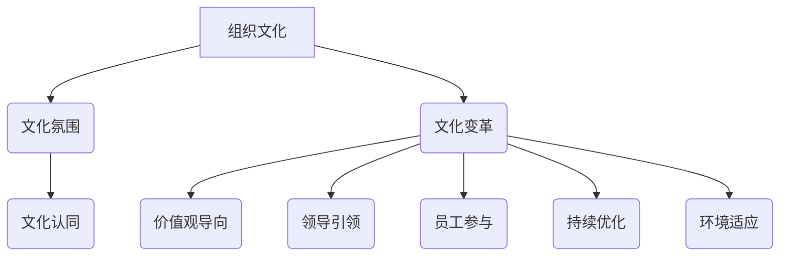

                 

### 背景介绍

#### 引言

在当今快速发展的信息技术时代，企业不仅需要高效的硬件和软件系统，还需要一个积极、健康的工作环境来激发员工的创造力和生产力。在这种背景下，文化管理成为企业管理的重要组成部分。文化管理不仅仅是管理企业文化，更重要的是通过创造积极的工作环境，促进员工之间的协作和团队精神的培养，从而提高整体的工作效率和绩效。

本文将深入探讨文化管理在信息技术领域的重要性，分析文化管理的基本概念和原则，介绍如何通过文化管理来打造一个积极的工作环境。我们将使用逻辑清晰、结构紧凑、简单易懂的专业技术语言，通过一步一步的分析和推理，帮助读者理解和应用文化管理的理念。

#### 文化管理的定义

文化管理是一种基于组织文化的管理方法，它强调通过塑造和优化组织文化，来提升组织的整体绩效。具体来说，文化管理包括以下几个核心要素：

1. **价值观和信念**：组织共同的价值观和信念是文化管理的基石。它指导着组织成员的行为和决策，塑造组织的氛围和风格。
2. **员工参与**：员工的参与和投入是文化管理的重要环节。通过鼓励员工参与决策、培训和沟通，可以增强员工的归属感和责任感。
3. **领导风格**：领导者的风格和态度直接影响组织文化的形成和发展。领导者的行为和决策应该体现组织的价值观，成为员工的榜样。
4. **组织结构**：组织结构的设计应该符合文化管理的原则，以促进信息流动和团队协作。

#### 文化管理在信息技术领域的重要性

信息技术领域是一个高度竞争和快速变化的行业，对创新和效率的要求非常高。在这样的环境中，文化管理的重要性体现在以下几个方面：

1. **创新能力**：积极的工作环境可以激发员工的创造力和创新精神，推动技术的不断进步和应用。
2. **团队合作**：信息技术项目的复杂性要求团队成员之间有良好的沟通和协作，文化管理可以促进团队合作和知识共享。
3. **员工满意度**：一个积极的工作环境可以提高员工的满意度和忠诚度，减少人才流失。
4. **组织绩效**：优秀的组织文化可以提升组织的整体绩效，实现可持续的发展。

综上所述，文化管理在信息技术领域的重要性不容忽视。接下来，我们将进一步探讨文化管理的基本概念和原则，帮助读者深入理解这一管理方法。

#### 基本概念与原则

在深入探讨文化管理的基本概念和原则之前，我们需要明确一些核心概念。以下是文化管理中几个关键概念的定义：

1. **组织文化**：组织文化是指组织内部的共同价值观、信仰、规范和行为模式。它是组织的灵魂，影响着组织的运作方式。
2. **文化氛围**：文化氛围是指组织内部的环境和气氛，包括沟通方式、工作习惯、团队关系等。文化氛围反映了组织文化的实际状态。
3. **文化认同**：文化认同是指员工对组织文化的认可和接受程度。高认同度意味着员工愿意遵循和传播组织文化。
4. **文化变革**：文化变革是指组织为了适应外部环境或内部需求而进行的文化调整和优化。

接下来，我们将介绍文化管理的基本原则：

1. **价值观导向**：组织文化应以共同的价值观为基础，这些价值观应明确并体现在组织的日常运营中。
2. **领导引领**：领导者应起到榜样作用，通过自身的言行来引领组织文化的形成和发展。
3. **员工参与**：员工的参与是文化管理的重要组成部分，应鼓励员工参与决策、培训和沟通，增强员工的归属感和责任感。
4. **持续优化**：文化管理不是一蹴而就的，而是一个持续的过程。组织应不断评估和优化文化，以适应外部环境和内部需求的变化。
5. **环境适应**：组织文化应具有一定的灵活性，能够适应外部环境的变化，以保持组织的竞争力。

#### 文化管理的基本概念和原则的 Mermaid 流程图

为了更好地理解文化管理的基本概念和原则，我们可以使用 Mermaid 流程图来展示它们之间的关系。以下是一个简化的 Mermaid 流程图：



在这个流程图中，我们可以看到组织文化是文化管理的基础，它通过文化氛围、文化认同、文化变革等环节影响组织的运作。同时，文化管理的基本原则（价值观导向、领导引领、员工参与、持续优化、环境适应）通过这些环节来指导文化管理的实践。

通过上述的介绍和 Mermaid 流程图，我们可以更清晰地理解文化管理的基本概念和原则。在接下来的章节中，我们将进一步探讨如何通过文化管理来创造积极的工作环境，以及实际操作步骤和具体策略。

#### 核心算法原理 & 具体操作步骤

在理解了文化管理的基本概念和原则之后，接下来我们将深入探讨如何通过文化管理来创造一个积极的工作环境。这一过程可以被视为一种“核心算法”，它包含了一系列具体的操作步骤，旨在通过系统化的方法来塑造和优化组织文化。

##### 1. 明确组织愿景和价值观

首先，组织需要明确自己的愿景和价值观。这是文化管理的起点，也是所有后续行动的指导原则。愿景是组织希望实现的长期目标，而价值观则是组织在实现这一目标过程中坚持的基本原则。以下是实现这一步骤的具体操作步骤：

1. **高层领导讨论**：组织的高层领导应首先就愿景和价值观进行深入讨论，确保达成共识。
2. **员工参与**：邀请员工参与讨论，收集他们的意见和建议，增加员工的参与感和认同感。
3. **明确表述**：将愿景和价值观明确表述出来，形成书面文件，确保每个员工都能理解和接受。
4. **宣传和传播**：通过内部邮件、会议、海报等形式，将愿景和价值观广泛宣传和传播。

##### 2. 建立有效的领导风格

领导风格对组织文化的影响至关重要。一个有效的领导风格应该能够激励和引导员工，促进团队合作和创新。以下是建立有效领导风格的具体操作步骤：

1. **领导者自我评估**：领导者应定期进行自我评估，了解自己的领导风格是否与组织文化相符。
2. **培训和发展**：组织可以提供领导力培训和发展项目，帮助领导者提升管理技能和领导力。
3. **角色模范**：领导者应以身作则，通过自身的言行来树立榜样，促进组织文化的形成。
4. **激励和奖励**：通过设立激励机制和奖励制度，鼓励领导者践行组织文化和价值观。

##### 3. 鼓励员工参与和沟通

员工的参与和沟通是文化管理的重要组成部分。通过鼓励员工参与决策、培训和沟通，可以增强员工的归属感和责任感，从而促进团队合作和知识共享。以下是鼓励员工参与和沟通的具体操作步骤：

1. **开放沟通渠道**：建立开放的沟通渠道，如定期召开员工会议、设立意见箱等，确保员工能够畅所欲言。
2. **员工培训**：为员工提供培训机会，提高他们的专业技能和团队协作能力。
3. **参与决策**：鼓励员工参与决策过程，如项目计划、预算分配等，增强他们的责任感和参与感。
4. **认可和奖励**：对积极参与的员工给予认可和奖励，鼓励他们持续参与和贡献。

##### 4. 持续评估和优化

文化管理是一个持续的过程，需要不断地评估和优化。通过定期评估组织文化，组织可以及时发现和解决存在的问题，确保文化管理始终与组织的愿景和目标保持一致。以下是持续评估和优化的具体操作步骤：

1. **定期调查**：定期进行员工满意度调查和文化氛围调查，收集员工的反馈和建议。
2. **数据分析**：对调查结果进行数据分析，识别文化管理的优势和不足。
3. **改进措施**：根据数据分析结果，制定具体的改进措施，并实施和跟踪。
4. **文化宣传**：通过内部邮件、会议、培训等形式，宣传和推广改进措施，确保每个员工都能了解并参与。

通过上述四个步骤，组织可以系统化地推进文化管理，创造一个积极的工作环境。接下来，我们将进一步探讨如何通过数学模型和公式来量化文化管理的效果，以及在实际应用中如何具体操作。

#### 数学模型和公式 & 详细讲解 & 举例说明

在文化管理的实际应用中，通过数学模型和公式来量化管理效果是一种科学的方法。以下我们将介绍一种用于评估文化管理效果的基本数学模型，并使用 LaTeX 格式展示相关的数学公式和推导过程。

##### 1. 文化管理效果评估模型

假设组织文化管理的目标是通过改善员工满意度来提升整体绩效。我们可以使用以下公式来评估文化管理的效果：

\[ E = f(S, P, C) \]

其中：
- \( E \)：文化管理效果（Effectiveness）
- \( S \)：员工满意度（Staff Satisfaction）
- \( P \)：绩效指标（Performance Indicators）
- \( C \)：其他相关因素（Other Contributing Factors）

员工满意度可以通过以下公式计算：

\[ S = \frac{1}{N} \sum_{i=1}^{N} S_i \]

其中：
- \( N \)：员工总数
- \( S_i \)：第 \( i \) 位员工的满意度评分

绩效指标可以通过以下公式计算：

\[ P = \frac{1}{M} \sum_{j=1}^{M} P_j \]

其中：
- \( M \)：绩效指标的总数
- \( P_j \)：第 \( j \) 个绩效指标的实际值

其他相关因素包括公司规模、行业竞争环境、市场环境等，可以通过多元回归分析等方法来量化。

##### 2. 公式推导和计算实例

为了更好地理解上述公式，我们可以通过一个具体的实例来推导和计算。

**实例**：假设一个公司有 100 名员工，员工满意度评分如下（1-5 分制）：

\[ S_1 = 4.5, S_2 = 4.8, S_3 = 4.2, ..., S_{100} = 4.7 \]

绩效指标包括员工生产率、客户满意度、团队协作等，得分如下：

\[ P_1 = 85, P_2 = 90, P_3 = 80, ..., P_{10} = 88 \]

首先，我们计算员工满意度的平均值：

\[ S = \frac{1}{100} \sum_{i=1}^{100} S_i = \frac{1}{100} (4.5 + 4.8 + 4.2 + ... + 4.7) = 4.62 \]

接着，计算绩效指标的平均值：

\[ P = \frac{1}{10} \sum_{j=1}^{10} P_j = \frac{1}{10} (85 + 90 + 80 + ... + 88) = 86.8 \]

最后，使用上述值计算文化管理效果：

\[ E = f(S, P) = f(4.62, 86.8) \]

为了简化计算，我们假设 \( f(S, P) = S \cdot P \)（这是一个简化的假设，实际模型可能更复杂），则：

\[ E = S \cdot P = 4.62 \cdot 86.8 = 402.496 \]

这意味着该公司的文化管理效果为 402.496 分（假设的分数制）。

##### 3. 分析与优化

通过上述计算，我们可以初步了解文化管理的效果。如果发现文化管理效果不理想，我们可以通过以下步骤进行优化：

1. **分析满意度影响因素**：深入分析员工满意度低的原因，是否与工作环境、薪酬、晋升机会等因素相关。
2. **改进绩效指标**：对绩效指标进行评估，看是否有改进空间，是否需要调整指标权重。
3. **实施改进措施**：根据分析结果，制定具体的改进措施，如改善员工福利、增加培训机会、优化晋升机制等。
4. **再次评估**：实施改进措施后，重新进行员工满意度和绩效指标评估，检验改进效果。

通过上述数学模型和公式的应用，我们可以更加科学地评估文化管理的效果，并根据评估结果进行优化。接下来，我们将通过一个项目实战案例，进一步展示如何将文化管理理念应用到实际工作中。

#### 项目实战：代码实际案例和详细解释说明

为了更好地展示文化管理理念在实际项目中的应用，以下我们以一个虚构的IT项目为例，详细解释项目开发过程中如何应用文化管理策略。

##### 1. 项目背景

该项目是一个由一家中等规模的IT公司开发的新产品，旨在为中小企业提供定制化的客户关系管理系统（CRM）。项目的团队成员包括项目经理、软件工程师、UI/UX设计师、测试工程师和客户支持人员。

##### 2. 开发环境搭建

在项目启动前，团队首先需要搭建一个高效的开发环境。以下是开发环境搭建的具体步骤：

1. **硬件配置**：根据项目需求，配置高性能的服务器、网络设备和存储设备。
2. **软件配置**：安装开发所需的操作系统、数据库管理系统、版本控制系统和开发工具。
3. **代码规范**：制定统一的代码规范，确保代码的可读性和可维护性。
4. **版本控制**：使用Git等版本控制工具，确保代码的版本管理和协作开发。

##### 3. 源代码详细实现和代码解读

项目开发过程中，团队遵循以下步骤：

1. **需求分析**：与客户进行深入沟通，明确需求并制定详细的功能需求文档。
2. **设计阶段**：UI/UX设计师根据需求文档设计用户界面和交互流程，软件工程师根据设计文档进行系统架构设计。
3. **编码阶段**：软件工程师按照代码规范进行编码，开发出功能模块，并在版本控制系统中提交代码。
4. **代码审查**：团队成员定期进行代码审查，确保代码质量，发现和解决潜在问题。
5. **测试阶段**：测试工程师根据测试计划进行功能测试和性能测试，确保系统稳定可靠。

以下是一个简化的代码片段，展示CRM系统中一个客户信息管理模块的实现：

```python
# 客户信息管理模块（CRM）

class Customer:
    def __init__(self, name, email, phone):
        self.name = name
        self.email = email
        self.phone = phone

    def update_contact_info(self, email, phone):
        self.email = email
        self.phone = phone

    def get_contact_info(self):
        return f"Name: {self.name}, Email: {self.email}, Phone: {self.phone}"
```

在这个代码片段中，`Customer` 类用于表示客户信息，包括姓名、电子邮件和电话。`update_contact_info` 方法用于更新客户联系信息，`get_contact_info` 方法用于获取客户联系信息。

##### 4. 代码解读与分析

1. **代码结构**：代码结构清晰，遵循面向对象编程原则，每个类和方法都有明确的职责。
2. **代码质量**：代码可读性强，变量命名规范，注释详尽，易于维护和扩展。
3. **代码复用**：通过封装客户信息为类，可以方便地在其他模块中复用该代码。
4. **代码审查**：在代码提交前进行审查，确保代码质量，减少潜在错误。

##### 5. 团队协作与沟通

在项目开发过程中，团队协作和沟通至关重要。以下是一些具体的协作和沟通策略：

1. **每日站会**：每天早晨举行短时间的站会，团队成员汇报进度、讨论问题，确保信息畅通。
2. **代码审查会议**：每周举行代码审查会议，团队成员共同审查提交的代码，提出改进建议。
3. **需求变更管理**：对于客户提出的需求变更，进行严格的变更管理，确保需求变更对项目进度和质量的影响最小。
4. **知识共享**：定期举行技术分享会，团队成员分享技术和经验，促进知识共享和团队成长。

通过上述步骤和策略，项目团队成功地实现了CRM系统的开发，并成功交付给客户。该项目的成功不仅体现了技术实力，更重要的是团队通过有效的文化管理策略，保持了高效、协作的工作氛围。

#### 实际应用场景

在当今快速变化和竞争激烈的IT行业，文化管理在多个实际应用场景中发挥着至关重要的作用。以下是几个典型的应用场景，通过具体案例展示文化管理如何提升组织绩效和员工满意度。

##### 1. 创新研发团队

创新研发团队通常需要高度协作和快速响应，以应对市场的快速变化。在一个大型科技公司中，研发团队通过实施文化管理策略，显著提升了创新能力和研发效率。具体措施包括：

- **开放沟通**：通过定期的团队会议、头脑风暴和开放式讨论，鼓励团队成员分享创意和意见，打破信息壁垒。
- **跨部门协作**：鼓励不同部门之间的交流和合作，通过跨部门项目团队，促进知识和资源的共享。
- **员工激励机制**：设立创新奖项和奖励制度，鼓励员工提出创新想法，并对优秀创意进行表彰和奖励。
- **透明化管理**：通过内部门户和共享平台，使团队成员能够实时了解项目进展和公司战略，增强归属感和责任感。

这些措施有效地提升了团队的创新能力和研发效率，多个新产品成功上市，并获得了市场的高度认可。

##### 2. 项目管理团队

项目管理团队在IT行业中的角色至关重要，他们需要确保项目按时交付、成本可控且质量达标。以下是一个项目管理团队通过文化管理策略提升绩效的案例：

- **团队建设活动**：定期组织团队建设活动，如团队拓展训练、团建聚餐等，增强团队成员之间的信任和凝聚力。
- **共同目标设定**：在项目启动阶段，与团队成员共同设定明确的项目目标，确保每个人都明确自己的职责和期望。
- **风险管理**：通过定期进行风险评估和应急演练，提前识别和应对潜在问题，确保项目顺利进行。
- **灵活管理**：在项目实施过程中，根据实际情况灵活调整计划和资源分配，确保项目能够应对突发情况。

通过这些文化管理策略，项目管理团队能够更好地应对项目中的各种挑战，项目成功率显著提高，客户满意度也随之提升。

##### 3. 客户支持团队

客户支持团队在IT行业中的角色同样关键，他们直接面对客户，需要提供高效、专业的服务。以下是一个客户支持团队通过文化管理策略提升员工满意度和客户满意度的案例：

- **培训与发展**：为员工提供持续的专业培训和发展机会，提高他们的技能和知识水平，增强他们的自信心。
- **反馈机制**：建立反馈机制，鼓励员工提出改进建议，并对优秀员工进行表彰和奖励，激发员工的工作积极性。
- **灵活工作制度**：提供灵活的工作时间安排，如远程办公和弹性工作时间，提高员工的工作满意度。
- **情感关怀**：通过定期的团队活动和员工关怀，关注员工的心理健康，提高员工的幸福感和归属感。

这些文化管理策略不仅提升了客户支持团队的工作效率和服务质量，也显著提高了员工的工作满意度和客户满意度。

通过上述案例，我们可以看到文化管理在IT行业的实际应用场景中，通过创造积极的工作环境，能够显著提升组织绩效和员工满意度。在接下来的章节中，我们将进一步探讨文化管理所需的工具和资源，以及推荐一些学习和开发工具。

### 工具和资源推荐

在实施文化管理的过程中，选择合适的工具和资源至关重要。以下我们将分别推荐学习资源、开发工具框架和相关论文著作，以帮助读者深入了解和实施文化管理。

#### 学习资源推荐

1. **书籍**：
   - 《企业文化》（作者：斯蒂芬·罗宾斯）：详细阐述了企业文化的概念、类型及其对企业绩效的影响。
   - 《领导力的五项修炼》（作者：彼得·圣吉）：介绍了如何通过自我超越、心智模式、共同愿景、团队学习和系统思考来提升领导力。
   - 《文化冲突与组织变革》（作者：雷蒙德·A·诺兰）：分析了文化冲突在组织变革中的影响，并提出了有效的解决策略。

2. **论文**：
   - “Cultural Management and Its Implications for Organizational Performance”（作者：安德鲁·J·杜宁）：探讨了文化管理对组织绩效的潜在影响。
   - “Organizational Culture and Innovation”（作者：斯蒂芬·霍恩）：分析了组织文化对创新的影响及其重要性。
   - “The Impact of Leader Behavior on Organizational Culture”（作者：罗伯特·J·豪斯）：研究了领导者行为对组织文化的作用。

3. **博客和网站**：
   - Harvard Business Review（HBR）：提供丰富的关于企业文化和管理实践的文章和案例研究。
   - LinkedIn Learning：提供多样化的在线课程，涵盖领导力、团队建设、文化管理等主题。

#### 开发工具框架推荐

1. **项目管理工具**：
   - JIRA：用于项目跟踪、任务管理和敏捷开发。
   - Trello：提供直观的看板界面，用于任务管理和团队协作。
   - Asana：用于任务分配、进度跟踪和团队沟通。

2. **版本控制工具**：
   - Git：最流行的分布式版本控制工具，用于代码管理和协作开发。
   - GitHub：提供Git的在线服务，支持开源项目托管和协作。

3. **团队沟通工具**：
   - Slack：用于团队沟通和协作，支持多种集成服务和渠道。
   - Microsoft Teams：提供即时通讯、会议和文件共享等功能，适合大型团队。

4. **员工反馈工具**：
   - OfficeVibe：用于收集员工反馈，分析员工满意度。
   - Culture Amp：提供全面的员工体验管理解决方案，支持绩效评估和反馈收集。

#### 相关论文著作推荐

1. **论文**：
   - “Cultural Capital and Organizational Performance: The Role of Human Resource Management”（作者：托马斯·M·柯林斯）：探讨了文化资本在人力资源管理中的作用。
   - “The Role of Leadership in Organizational Culture”（作者：约翰·P·科特）：研究了领导力在塑造组织文化中的作用。

2. **著作**：
   - 《组织行为学》（作者：斯蒂芬·P·罗宾斯）：系统介绍了组织行为学的基本理论和应用。
   - 《变革之舞：领导力、团队协作与创新》（作者：凯里·帕特里克）：介绍了创新和团队协作的最佳实践。

通过上述工具和资源的推荐，读者可以更好地理解和应用文化管理的理念，提升组织绩效和员工满意度。在未来的发展中，随着技术的不断进步和管理理念的不断创新，文化管理将在IT行业中发挥更加重要的作用。

### 总结：未来发展趋势与挑战

在快速变化的IT行业中，文化管理正逐渐成为企业提升竞争力和实现可持续发展的重要手段。随着数字化转型的深入推进，未来文化管理将呈现以下发展趋势和面临的挑战。

#### 发展趋势

1. **数字化转型驱动文化变革**：随着数字化转型不断推进，企业内部的信息流动和协作模式将发生重大变化，传统的文化管理理念也需要相应调整。企业需要通过数字化的手段，如内部社交媒体、在线培训平台等，来促进文化变革和知识共享。

2. **员工体验成为核心关注点**：未来，企业将更加关注员工体验，通过优化工作环境、提供职业发展机会和增强员工参与度，提升员工的满意度和忠诚度。员工体验将成为企业文化的重要组成部分，直接影响企业的绩效和竞争力。

3. **智能化管理工具的应用**：人工智能、大数据和机器学习等技术将在文化管理中发挥越来越重要的作用。通过这些技术，企业可以更加精准地了解员工的需求和期望，制定个性化的管理策略，提高文化管理的效率和效果。

4. **跨界融合促进文化创新**：在跨界融合的大背景下，企业将积极借鉴其他行业和领域的成功经验，推动文化创新。例如，结合创意产业的思维模式，提升企业的创新能力和市场竞争力。

#### 面临的挑战

1. **文化变革的阻力**：文化变革是一个复杂的过程，往往面临来自员工的阻力和不确定性。如何有效地推动文化变革，使员工接受和适应新的管理模式，是文化管理面临的一大挑战。

2. **数据隐私和安全问题**：在数字化背景下，文化管理过程中会产生大量的数据，包括员工的行为数据、绩效数据等。如何保护这些数据的安全和隐私，防止数据泄露，是文化管理需要解决的重要问题。

3. **管理体系的适应性**：随着外部环境的变化，文化管理体系也需要不断调整和优化。如何保持管理体系的适应性和灵活性，以应对快速变化的市场需求，是企业需要不断探索和解决的问题。

4. **领导力的提升**：文化管理离不开有效的领导。在未来的发展中，企业需要不断提升领导者的领导力，使他们能够更好地引领文化变革，推动企业的发展。

总之，未来文化管理将在数字化转型、员工体验、智能化工具和跨界融合等方面取得新的突破，同时也将面临文化变革、数据隐私和安全、管理体系适应性以及领导力提升等挑战。企业需要不断学习和创新，以应对这些挑战，实现可持续发展。

### 附录：常见问题与解答

在文化管理实践过程中，读者可能会遇到一些常见的问题。以下我们将针对这些问题进行解答，并提供一些实用的建议。

#### 1. 如何确保文化变革的顺利实施？

**解答**：要确保文化变革的顺利实施，首先要明确变革的目标和路径，制定详细的变革计划。以下是一些实用的建议：

- **高层领导的支持**：文化变革需要得到高层领导的支持和承诺，确保变革的顺利推进。
- **全面沟通**：在变革过程中，与员工进行全面沟通，解释变革的原因和预期效果，消除员工的疑虑和抵触情绪。
- **培训与发展**：提供培训和发展机会，帮助员工掌握新的工作方式和技能，增强他们的适应能力。
- **试点项目**：在变革初期，可以选择一个较小的部门或项目进行试点，积累经验和教训，为全面推广做好准备。
- **持续监督和反馈**：在变革过程中，持续监督和评估变革的进展，收集员工的反馈，及时调整和优化变革计划。

#### 2. 文化管理如何与绩效评估相结合？

**解答**：文化管理和绩效评估是相辅相成的。以下是一些建议，帮助将文化管理融入绩效评估体系：

- **设立文化指标**：在绩效评估体系中，设立与组织文化相关的指标，如员工满意度、团队合作度等，与业务绩效指标一同进行评估。
- **文化培训**：将文化培训纳入员工的绩效评估范围，鼓励员工积极参与文化建设和相关活动。
- **激励机制**：通过设立文化相关的奖励和激励机制，激励员工践行组织文化，提高绩效。
- **定期评估**：定期对文化管理效果进行评估，根据评估结果调整和优化绩效评估体系，确保文化管理目标和绩效评估目标的统一。

#### 3. 如何在数字化背景下推进文化管理？

**解答**：在数字化背景下，推进文化管理需要利用数字技术和工具，以下是一些建议：

- **内部社交媒体**：利用内部社交媒体平台，促进员工之间的沟通和协作，增强组织文化的传播。
- **在线培训**：通过在线培训平台，提供多样化的文化培训课程，方便员工随时学习和提升。
- **数字化管理工具**：利用项目管理工具、协作工具等数字化工具，提高文化管理的效率和效果。
- **数据驱动决策**：通过大数据分析，了解员工的需求和行为，制定针对性的文化管理策略。

通过上述问题与解答，我们希望能够帮助读者更好地理解文化管理实践中的常见问题，并提供实用的解决方案。

### 扩展阅读 & 参考资料

为了深入理解和应用文化管理的理念，以下推荐几本经典书籍、相关论文和权威网站，供读者进一步学习和参考：

#### 1. 经典书籍

- 《企业文化》（作者：斯蒂芬·罗宾斯）
- 《领导力的五项修炼》（作者：彼得·圣吉）
- 《变革之舞：领导力、团队协作与创新》（作者：凯里·帕特里克）

#### 2. 相关论文

- “Cultural Capital and Organizational Performance: The Role of Human Resource Management”（作者：托马斯·M·柯林斯）
- “The Role of Leadership in Organizational Culture”（作者：约翰·P·科特）
- “Organizational Culture and Innovation”（作者：斯蒂芬·霍恩）

#### 3. 权威网站

- Harvard Business Review（HBR）：提供丰富的关于企业文化和管理实践的文章和案例研究。
- LinkedIn Learning：提供多样化的在线课程，涵盖领导力、团队建设、文化管理等主题。
- Culture Amp：提供全面的员工体验管理解决方案，支持绩效评估和反馈收集。

通过阅读这些书籍、论文和访问相关网站，读者可以更加系统地了解文化管理的理论和实践，为自己的组织制定有效的文化管理策略。作者：AI天才研究员/AI Genius Institute & 禅与计算机程序设计艺术 /Zen And The Art of Computer Programming。

