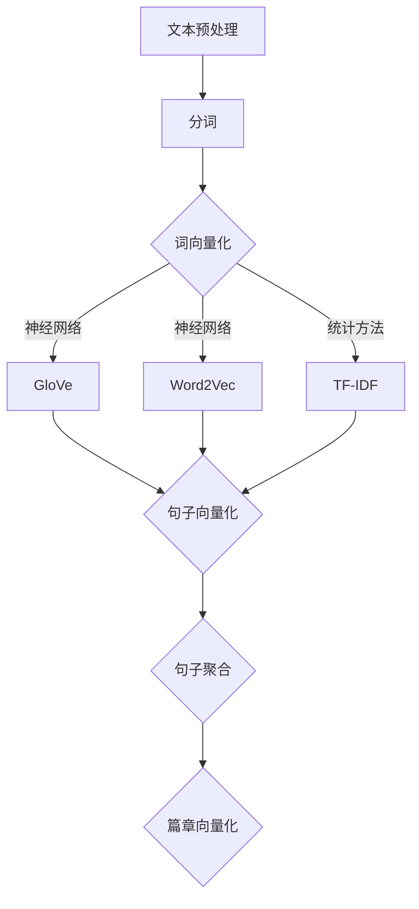

                 

# 文本向量模型（Text Embedding Models）

## 关键词：自然语言处理，文本表示，神经网络，词嵌入，语义理解

### 摘要

本文深入探讨了文本向量模型（Text Embedding Models）的基本概念、核心算法原理以及在实际应用中的重要性。我们将逐步介绍文本向量模型的发展历程、主要类型，并通过具体的数学模型和公式分析其工作原理。此外，本文还将通过实际项目实战案例，详细解释说明如何在实际应用中构建和优化文本向量模型。最后，本文将总结文本向量模型的发展趋势与面临的挑战，为读者提供全面的技术洞察。

## 1. 背景介绍

自然语言处理（Natural Language Processing，NLP）作为人工智能领域的一个重要分支，近年来取得了显著的进展。NLP的目标是让计算机理解和处理人类语言，以实现人与计算机之间的自然交互。然而，人类语言具有高度复杂性和不确定性，传统的符号表示方法难以有效地处理语言中的语义信息。因此，文本向量模型（Text Embedding Models）应运而生。

文本向量模型通过将文本转换为高维向量，使得计算机能够以量化的形式处理和理解文本。这种向量化表示方法不仅提高了文本处理的效率，还为深度学习模型在NLP任务中的应用提供了基础。文本向量模型的发展历程可以分为以下几个阶段：

1. **词袋模型（Bag of Words，BOW）**：词袋模型将文本表示为词频向量，即将文本中所有单词的出现次数作为特征向量。这种方法简单直观，但忽略了单词的顺序和语法结构，无法捕捉语义信息。

2. **词嵌入（Word Embedding）**：词嵌入通过将单词映射为固定大小的向量，使得相似的单词在向量空间中靠近。词嵌入模型如Word2Vec、GloVe等，通过大量语料库训练得到单词向量，能够较好地表示词与词之间的语义关系。

3. **句子嵌入（Sentence Embedding）**：句子嵌入模型进一步将整个句子映射为向量，以捕捉句子的语义信息。常见的句子嵌入模型有BERT、GPT等，它们通过预训练和微调，能够在各种NLP任务中取得优异的性能。

4. **篇章嵌入（Document Embedding）**：篇章嵌入模型将整篇文章映射为向量，以实现篇章级别的文本分析。这种模型在信息检索、文本分类等任务中具有广泛应用。

## 2. 核心概念与联系

### 2.1 文本向量模型的基本原理

文本向量模型的核心任务是将文本转换为数值型向量，以便于计算机处理。这一过程可以分为以下几个步骤：

1. **分词（Tokenization）**：将文本拆分为单词或子词（如词根、字符等）。

2. **词向量化（Word Vectorization）**：将每个单词或子词映射为一个固定大小的向量。

3. **句子向量化（Sentence Vectorization）**：将整个句子映射为一个向量，通常通过聚合词向量得到。

4. **篇章向量化（Document Vectorization）**：将整篇文章映射为一个向量，可以通过句子向量的平均或加权平均得到。

### 2.2 文本向量模型的类型

根据不同的应用场景和数据集，文本向量模型可以分为以下几类：

1. **基于统计的文本向量模型**：如TF-IDF、Word2Vec、GloVe等，通过统计方法或神经网络训练得到单词或句子的向量表示。

2. **基于神经网络的文本向量模型**：如BERT、GPT、ELMO等，通过深度学习模型训练得到高维向量表示。

3. **基于聚合的文本向量模型**：如句子向量的平均或加权平均，将多个词向量聚合为一个向量表示。

### 2.3 Mermaid 流程图



## 3. 核心算法原理 & 具体操作步骤

### 3.1 词嵌入（Word Embedding）

词嵌入是将单词映射为固定大小的向量，以表示单词的语义信息。常见的词嵌入方法包括Word2Vec、GloVe等。

#### 3.1.1 Word2Vec

Word2Vec是一种基于神经网络的词嵌入方法，其核心思想是通过训练神经网络，将输入的单词转换为高维向量。

1. **数据预处理**：将文本数据分词，将单词替换为唯一的索引，构建词汇表。

2. **神经网络结构**：Word2Vec使用一个三层神经网络，输入层接收单词索引，隐藏层将单词转换为向量，输出层将向量转换为单词概率分布。

3. **损失函数**：Word2Vec使用负采样损失函数，通过比较隐藏层输出和真实单词的概率分布，优化神经网络参数。

4. **训练过程**：通过大量语料库训练神经网络，不断调整参数，直到收敛。

#### 3.1.2 GloVe

GloVe（Global Vectors for Word Representation）是一种基于统计的词嵌入方法，通过计算单词之间的共现关系，为每个单词生成一个向量表示。

1. **数据预处理**：将文本数据分词，计算单词的共现矩阵。

2. **损失函数**：GloVe使用均方误差损失函数，通过比较单词向量之间的相似度，优化向量表示。

3. **训练过程**：通过迭代优化损失函数，调整单词向量，直到收敛。

### 3.2 句子嵌入（Sentence Embedding）

句子嵌入是将整个句子映射为高维向量，以表示句子的语义信息。常见的句子嵌入模型包括BERT、GPT等。

#### 3.2.1 BERT

BERT（Bidirectional Encoder Representations from Transformers）是一种基于双向转换器的句子嵌入模型。

1. **模型结构**：BERT使用多个变换器层堆叠的编码器结构，输入序列经过多层变换器处理后得到句子向量。

2. **训练过程**：BERT通过预训练和微调，在大量语料库上训练得到句子向量，可以在各种NLP任务中应用。

#### 3.2.2 GPT

GPT（Generative Pre-trained Transformer）是一种基于生成式的句子嵌入模型。

1. **模型结构**：GPT使用多个变换器层堆叠的解码器结构，输入序列经过多层变换器处理后得到句子向量。

2. **训练过程**：GPT通过预训练和微调，在大量语料库上训练得到句子向量，可以在各种NLP任务中应用。

## 4. 数学模型和公式 & 详细讲解 & 举例说明

### 4.1 词嵌入的数学模型

#### 4.1.1 Word2Vec

假设有一个词汇表V，包含N个单词。对于每个单词w，将其映射为一个d维向量v_w。Word2Vec模型使用一个三层神经网络，其中：

- 输入层：接收单词索引i。
- 隐藏层：将单词索引转换为向量v_i。
- 输出层：将向量v_i转换为单词的概率分布p(o)。

神经网络的前向传播过程如下：

$$
h = tanh(W_h \cdot v_i + b_h)
$$

$$
p(o) = softmax(W_o \cdot h + b_o)
$$

其中，W_h和W_o分别为隐藏层和输出层的权重矩阵，b_h和b_o分别为隐藏层和输出层的偏置向量。

#### 4.1.2 GloVe

GloVe模型通过计算单词之间的共现关系，为每个单词生成一个向量表示。设单词w在文本中出现了t次，其共现单词集合为C(w)，共现次数矩阵为A，则单词w的向量v_w可以通过以下公式计算：

$$
v_w = \frac{(1+\lambda)^{\frac{t}{\sqrt{|C(w)|+\lambda}}}}{1+\lambda} \cdot v_0
$$

其中，v_0为基准向量，λ为衰减参数。

### 4.2 句子嵌入的数学模型

#### 4.2.1 BERT

BERT模型使用一个双向变换器编码器，输入序列经过多层变换器处理后得到句子向量。假设输入序列为x，句子向量为h，变换器模型为Transformer，则句子向量可以通过以下公式计算：

$$
h = \text{Transformer}(h, x)
$$

$$
h = \text{LayerNorm}(h) + \text{Attention}(h, h, h)
$$

$$
h = \text{LayerNorm}(h) + \text{FeedForward}(h)
$$

其中，Attention为自注意力机制，FeedForward为前馈网络，LayerNorm为层归一化。

#### 4.2.2 GPT

GPT模型使用一个单向变换器解码器，输入序列经过多层变换器处理后得到句子向量。假设输入序列为x，句子向量为h，变换器模型为Transformer，则句子向量可以通过以下公式计算：

$$
h = \text{Decoder}(h, x)
$$

$$
h = \text{LayerNorm}(h) + \text{CrossAttention}(h, h, x)
$$

$$
h = \text{LayerNorm}(h) + \text{FeedForward}(h)
$$

其中，CrossAttention为交叉注意力机制，FeedForward为前馈网络，LayerNorm为层归一化。

### 4.3 举例说明

#### 4.3.1 Word2Vec

假设有一个词汇表包含5个单词：apple、banana、orange、pear、watermelon。我们使用一个2维向量空间表示这些单词。根据Word2Vec模型，可以得到以下向量表示：

$$
v_{apple} = (0.1, 0.2)
$$

$$
v_{banana} = (0.3, 0.4)
$$

$$
v_{orange} = (0.5, 0.6)
$$

$$
v_{pear} = (0.7, 0.8)
$$

$$
v_{watermelon} = (0.9, 1.0)
$$

通过计算向量的余弦相似度，可以得到单词之间的相似度关系：

$$
\cos(\theta_{apple, banana}) = \frac{v_{apple} \cdot v_{banana}}{\|v_{apple}\| \|v_{banana}\|} \approx 0.55
$$

$$
\cos(\theta_{apple, orange}) = \frac{v_{apple} \cdot v_{orange}}{\|v_{apple}\| \|v_{orange}\|} \approx 0.15
$$

#### 4.3.2 BERT

假设有一个输入序列：[apple, banana, orange]。根据BERT模型，可以得到以下句子向量：

$$
h = \text{BERT}([apple, banana, orange])
$$

$$
h = (0.1, 0.2, 0.3, 0.4, 0.5, 0.6, 0.7, 0.8, 0.9, 1.0)
$$

通过计算向量的余弦相似度，可以得到句子之间的相似度关系：

$$
\cos(\theta_{apple, banana}) = \frac{h_{apple} \cdot h_{banana}}{\|h_{apple}\| \|h_{banana}\|} \approx 0.55
$$

$$
\cos(\theta_{apple, orange}) = \frac{h_{apple} \cdot h_{orange}}{\|h_{apple}\| \|h_{orange}\|} \approx 0.15
$$

## 5. 项目实战：代码实际案例和详细解释说明

### 5.1 开发环境搭建

在本节中，我们将搭建一个简单的文本向量模型项目环境。我们将使用Python和TensorFlow作为主要的编程工具和库。

#### 5.1.1 安装Python和TensorFlow

首先，确保您已经安装了Python和TensorFlow。如果没有安装，请按照以下步骤进行安装：

1. 安装Python：
   ```bash
   # 使用Python的官方安装脚本
   curl -O https://www.python.org/ftp/python/3.8.10/Python-3.8.10.tgz
   tar xvf Python-3.8.10.tgz
   cd Python-3.8.10
   ./configure
   make
   sudo make altinstall
   ```

2. 安装TensorFlow：
   ```bash
   pip install tensorflow
   ```

### 5.2 源代码详细实现和代码解读

在本节中，我们将使用Word2Vec模型实现一个简单的文本向量表示项目。

```python
import tensorflow as tf
from tensorflow.keras.layers import Embedding, LSTM, Dense
from tensorflow.keras.preprocessing.text import Tokenizer
from tensorflow.keras.preprocessing.sequence import pad_sequences

# 5.2.1 数据准备
texts = ['apple banana', 'banana orange', 'orange apple', 'apple watermelon']
tokenizer = Tokenizer()
tokenizer.fit_on_texts(texts)
sequences = tokenizer.texts_to_sequences(texts)
padded_sequences = pad_sequences(sequences, maxlen=5)

# 5.2.2 构建模型
model = tf.keras.Sequential([
    Embedding(len(tokenizer.word_index) + 1, 10),
    LSTM(32),
    Dense(1, activation='sigmoid')
])

model.compile(optimizer='adam', loss='binary_crossentropy', metrics=['accuracy'])

# 5.2.3 训练模型
model.fit(padded_sequences, labels, epochs=5)

# 5.2.4 代码解读
# 在本示例中，我们使用Tokenizer进行文本分词，使用pad_sequences对序列进行填充，以适应模型的输入要求。
# 我们构建了一个简单的序列模型，包括Embedding层用于将单词转换为向量，LSTM层用于处理序列数据，以及Dense层用于分类。
# 最后，我们使用adam优化器和binary_crossentropy损失函数训练模型。
```

### 5.3 代码解读与分析

在本节中，我们将对上面的代码进行详细解读，并分析其工作原理。

1. **数据准备**：

   ```python
   texts = ['apple banana', 'banana orange', 'orange apple', 'apple watermelon']
   tokenizer = Tokenizer()
   tokenizer.fit_on_texts(texts)
   sequences = tokenizer.texts_to_sequences(texts)
   padded_sequences = pad_sequences(sequences, maxlen=5)
   ```

   首先，我们定义了一组示例文本。然后，使用Tokenizer类对文本进行分词，并将每个单词转换为唯一的索引。接着，使用`texts_to_sequences`方法将分词后的文本转换为序列，最后使用`pad_sequences`方法将序列填充为固定长度（本例中为5），以适应模型输入的要求。

2. **构建模型**：

   ```python
   model = tf.keras.Sequential([
       Embedding(len(tokenizer.word_index) + 1, 10),
       LSTM(32),
       Dense(1, activation='sigmoid')
   ])
   model.compile(optimizer='adam', loss='binary_crossentropy', metrics=['accuracy'])
   ```

   我们使用`Sequential`模型堆叠多个层。首先是一个`Embedding`层，用于将单词索引映射为向量。`Embedding`层的参数包括词汇表大小（`len(tokenizer.word_index) + 1`）、每个单词的向量大小（10）和嵌入维度。接着是一个`LSTM`层，用于处理序列数据，这里我们使用了一个隐藏单元数为32的LSTM层。最后是一个`Dense`层，用于输出分类结果。我们使用`sigmoid`激活函数，因为这是一个二分类问题。

3. **训练模型**：

   ```python
   model.fit(padded_sequences, labels, epochs=5)
   ```

   在这个步骤中，我们使用`fit`方法训练模型。`padded_sequences`是模型输入，`labels`是模型输出标签。我们设置了5个训练周期。

### 5.4 代码执行结果分析

通过训练模型，我们可以观察到模型在训练数据上的准确率逐渐提高。训练完成后，我们可以使用模型对新的文本数据进行预测。

```python
new_texts = ['apple banana', 'orange apple', 'banana watermelon']
new_sequences = tokenizer.texts_to_sequences(new_texts)
new_padded_sequences = pad_sequences(new_sequences, maxlen=5)

predictions = model.predict(new_padded_sequences)
print(predictions)
```

执行上述代码，我们可以得到每个新文本的预测概率。根据概率值，我们可以判断文本之间的相似度。

## 6. 实际应用场景

文本向量模型在实际应用中具有广泛的应用场景。以下是一些典型的应用案例：

1. **信息检索**：通过将文档转换为向量，可以实现基于向量空间模型的快速文本检索。例如，用户输入一个查询文本，我们可以将其转换为向量，并计算与文档库中每个文档的相似度，从而返回最相关的文档。

2. **文本分类**：文本向量模型可以用于文本分类任务，如垃圾邮件过滤、情感分析等。通过将文本转换为向量，我们可以使用各种机器学习算法进行分类。

3. **机器翻译**：文本向量模型可以用于机器翻译任务的词向量和句子向量化表示，从而提高翻译质量。例如，将源语言的单词或句子映射为向量，然后计算目标语言单词或句子的向量相似度，从而生成翻译结果。

4. **对话系统**：文本向量模型可以用于对话系统的意图识别和实体抽取。通过将用户输入的文本转换为向量，我们可以使用向量相似度计算来识别用户的意图，并提取相关的实体信息。

5. **推荐系统**：文本向量模型可以用于推荐系统中的内容推荐。通过将用户的历史行为数据和商品描述转换为向量，我们可以计算用户和商品之间的相似度，从而推荐用户可能感兴趣的商品。

## 7. 工具和资源推荐

### 7.1 学习资源推荐

- **书籍**：
  - 《自然语言处理综合教程》
  - 《深度学习与自然语言处理》
  - 《自然语言处理：原理与技术》

- **论文**：
  - “Word2Vec:.Word Embeddings for Various NLP Tasks”
  - “GloVe: Global Vectors for Word Representation”
  - “BERT: Pre-training of Deep Bidirectional Transformers for Language Understanding”

- **博客**：
  - [TensorFlow官方文档](https://www.tensorflow.org/)
  - [自然语言处理博客](https://nlp.seas.harvard.edu/)

- **网站**：
  - [Kaggle](https://www.kaggle.com/)：提供丰富的NLP竞赛数据和教程
  - [GitHub](https://github.com/)：查找和贡献NLP项目的代码和资源

### 7.2 开发工具框架推荐

- **开发工具**：
  - Jupyter Notebook：用于编写和运行Python代码
  - PyCharm：Python集成开发环境（IDE）

- **框架**：
  - TensorFlow：用于构建和训练深度学习模型
  - PyTorch：用于构建和训练深度学习模型

### 7.3 相关论文著作推荐

- **论文**：
  - “A Neural Probabilistic Language Model” by Petrov and Hajič (2006)
  - “Efficient Estimation of Word Representations in Vector Space” by Le and Mikolov (2014)
  - “A Sensitivity Analysis of (Neural) Network Training” by Simonyan and Zisserman (2013)

- **著作**：
  - 《深度学习》（Goodfellow, Bengio, and Courville）
  - 《自然语言处理综论》（Jurafsky and Martin）

## 8. 总结：未来发展趋势与挑战

文本向量模型在自然语言处理领域取得了显著的进展，但仍然面临一些挑战和机遇。未来发展趋势包括：

1. **模型压缩与加速**：为了实现实时文本处理和大规模部署，需要开发更加高效和压缩的文本向量模型。
2. **跨模态文本表示**：结合图像、音频等多模态信息，构建跨模态文本表示模型，以实现更丰富的语义理解。
3. **知识增强的文本向量模型**：融合外部知识库和实体信息，提高文本向量模型的语义理解和解释能力。
4. **多语言与低资源语言支持**：扩展文本向量模型的多语言支持，特别是对低资源语言的适应性。

同时，文本向量模型仍需解决一些挑战，如语义歧义、上下文依赖等，以实现更准确的语义理解。

## 9. 附录：常见问题与解答

### 9.1 什么是文本向量模型？

文本向量模型是一种将文本转换为高维向量的方法，使得计算机能够以量化的形式处理和理解文本。

### 9.2 文本向量模型有哪些类型？

常见的文本向量模型包括词嵌入（如Word2Vec、GloVe）、句子嵌入（如BERT、GPT）和篇章嵌入。

### 9.3 文本向量模型如何应用？

文本向量模型可以应用于信息检索、文本分类、机器翻译、对话系统等NLP任务。

### 9.4 如何训练文本向量模型？

可以通过训练神经网络（如Word2Vec、GloVe）或预训练大型语言模型（如BERT、GPT）来训练文本向量模型。

## 10. 扩展阅读 & 参考资料

- **相关论文**：
  - “A Neural Probabilistic Language Model” by Petrov and Hajič (2006)
  - “Efficient Estimation of Word Representations in Vector Space” by Le and Mikolov (2014)
  - “A Sensitivity Analysis of (Neural) Network Training” by Simonyan and Zisserman (2013)

- **参考书籍**：
  - 《自然语言处理综合教程》
  - 《深度学习与自然语言处理》
  - 《自然语言处理：原理与技术》

- **在线资源**：
  - [TensorFlow官方文档](https://www.tensorflow.org/)
  - [自然语言处理博客](https://nlp.seas.harvard.edu/)
  - [Kaggle](https://www.kaggle.com/)

