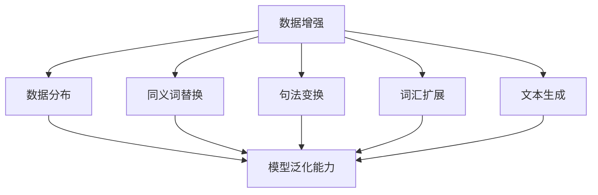

                 

### 背景介绍

随着人工智能技术的飞速发展，深度学习模型在各个领域取得了显著成果。然而，这些模型的性能在很大程度上依赖于大量的标注数据，且往往对数据分布的变化敏感。这就导致在现实应用中，模型往往难以应对数据分布的微小变化，从而降低其泛化能力。为了解决这一问题，文本数据增强技术应运而生。

文本数据增强是一种通过生成或修改原始数据来提高模型泛化能力的方法。其核心思想是通过扩展数据的多样性，使模型能够更好地适应不同的数据分布。这种方法不仅有助于减少对大量标注数据的依赖，还可以提高模型在未知数据上的性能。

在实际应用中，文本数据增强技术已经成为自然语言处理（NLP）和计算机视觉等领域的重要工具。例如，在图像分类任务中，数据增强技术可以通过旋转、缩放、裁剪等方式生成大量的训练样本，从而提高模型的鲁棒性。而在NLP领域，文本数据增强技术可以通过同义词替换、句法变换等方式，丰富数据的表达形式，从而提高模型的泛化能力。

本文将重点探讨文本数据增强技术的核心概念、算法原理及其在实际应用中的具体实现。通过逐步分析推理，我们将揭示这一技术在提高模型泛化能力方面的潜力和挑战。

### 核心概念与联系

在深入探讨文本数据增强技术之前，我们首先需要了解一些核心概念和它们之间的联系。这些概念包括数据增强、数据分布、模型泛化能力以及相关的算法和技术。

#### 数据增强

数据增强（Data Augmentation）是一种通过生成或修改原始数据来提高模型泛化能力的方法。在图像处理领域，常见的数据增强技术包括旋转、缩放、裁剪、颜色变换等。这些方法可以增加数据的多样性，从而帮助模型更好地适应不同的数据分布。在NLP领域，数据增强技术可以包括同义词替换、句法变换、词汇扩展等。

#### 数据分布

数据分布（Data Distribution）是指数据在各个特征维度上的分布情况。一个良好的数据分布可以使模型更好地学习数据的内在规律。然而，在实际应用中，数据分布往往会发生变化，这可能导致模型性能下降。因此，提高模型的泛化能力，就需要使模型能够适应不同的数据分布。

#### 模型泛化能力

模型泛化能力（Model Generalization）是指模型在未知数据上的表现能力。一个具有良好的泛化能力的模型，不仅能够在训练数据上表现出良好的性能，还能够适应新的、未知的数据分布。提高模型泛化能力是机器学习领域的一个重要目标。

#### 算法和技术

在文本数据增强领域，常见的算法和技术包括以下几种：

1. **同义词替换（Synonym Replacement）**：通过将文本中的词替换为其同义词，来增加数据的多样性。
2. **句法变换（Syntactic Transformation）**：通过改变文本的句法结构，如改变句子的顺序、使用被动语态等，来增加数据的多样性。
3. **词汇扩展（Lexical Augmentation）**：通过添加新的词汇、短语或句子，来增加数据的多样性。
4. **文本生成（Text Generation）**：通过生成新的文本数据，来增加数据的多样性。

#### Mermaid 流程图

为了更直观地展示这些概念和技术的联系，我们可以使用Mermaid绘制一个流程图。以下是一个简化的Mermaid流程图示例：



在这个流程图中，数据增强技术作为输入，通过同义词替换、句法变换、词汇扩展和文本生成等技术，来改变数据的分布，从而提高模型的泛化能力。

通过上述核心概念和技术的介绍，我们可以更深入地理解文本数据增强技术的工作原理和其在机器学习中的应用价值。接下来，我们将进一步探讨文本数据增强技术的具体算法原理和实现方法。

### 核心算法原理 & 具体操作步骤

文本数据增强技术的核心在于通过多种方式增加数据的多样性，从而提高模型的泛化能力。下面，我们将详细介绍几种常见的文本数据增强算法，包括同义词替换、句法变换、词汇扩展和文本生成等。

#### 同义词替换

同义词替换是一种通过将文本中的词替换为其同义词来增加数据多样性的方法。这种方法简单直观，易于实现。常见的同义词替换方法包括以下几种：

1. **基于词典的同义词替换**：这种方法利用预先构建的同义词词典，将文本中的词替换为其同义词。例如，将“优秀”替换为“杰出”、“良好”等。这种方法的主要优势是操作简单，但缺点是可能导致语义发生变化，从而影响模型的性能。

2. **基于词嵌入的同义词替换**：这种方法利用词嵌入技术，通过计算文本中词与其同义词之间的距离，选择最接近的同义词进行替换。例如，在Word2Vec或GloVe模型中，将“优秀”替换为“杰出”等。这种方法在保留语义信息的同时，提高了数据多样性。

具体操作步骤如下：

1. **准备同义词词典**：构建一个包含文本中常见词及其同义词的词典。可以通过手动收集或利用现有的同义词词典库。
2. **文本预处理**：对文本进行分词和词性标注，提取出需要替换的词。
3. **同义词替换**：根据同义词词典，将文本中的词替换为其同义词。可以选择随机替换或根据词频、词性等特征进行有针对性的替换。

#### 句法变换

句法变换是一种通过改变文本的句法结构来增加数据多样性的方法。常见的句法变换包括以下几种：

1. **改变句子顺序**：通过重新排列句子顺序，生成新的文本。例如，将“他昨天去图书馆”改为“昨天他去图书馆”。
2. **使用被动语态**：将文本中的主动语态改为被动语态。例如，将“他打篮球”改为“篮球被他打”。
3. **添加从句**：在文本中添加从句，如定语从句、状语从句等，来丰富句子的结构。

具体操作步骤如下：

1. **文本预处理**：对文本进行分词和句法分析，提取出句子的结构信息。
2. **句法变换**：根据句法分析结果，对句子进行变换。例如，改变句子顺序、使用被动语态或添加从句等。
3. **文本还原**：将变换后的句子重新组合成完整的文本。

#### 词汇扩展

词汇扩展是一种通过添加新的词汇、短语或句子来增加数据多样性的方法。常见的词汇扩展方法包括以下几种：

1. **扩展单词**：在文本中添加新的单词，如同义词、反义词等。例如，将“他聪明”扩展为“他聪明、机智”。
2. **扩展句子**：在文本中添加新的句子，如补充说明、描述等。例如，将“他聪明”扩展为“他聪明，因此在学术上表现出色”。
3. **扩展段落**：在文本中添加新的段落，如描述场景、背景等。例如，将一个简短的段落扩展为包含多个细节和场景描述的段落。

具体操作步骤如下：

1. **文本预处理**：对文本进行分词和句法分析，提取出词汇和句子结构信息。
2. **词汇扩展**：根据文本内容和语义，选择合适的单词、短语或句子进行扩展。
3. **文本还原**：将扩展后的单词、句子或段落重新组合成完整的文本。

#### 文本生成

文本生成是一种通过生成新的文本数据来增加数据多样性的方法。常见的文本生成方法包括以下几种：

1. **基于模板的文本生成**：通过预定义的模板和填充词，生成新的文本。例如，使用模板“某人做某事”和填充词“他、学习、编程”，生成“他学习编程”。
2. **基于神经网络的文本生成**：利用神经网络模型，如序列到序列（Seq2Seq）模型、变换器（Transformer）模型等，生成新的文本。例如，给定一个文本序列，模型可以生成与之相关的新文本序列。
3. **基于生成对抗网络（GAN）的文本生成**：利用生成对抗网络，生成新的、与真实数据相似的文本数据。

具体操作步骤如下：

1. **数据预处理**：对文本进行预处理，如分词、去停用词等。
2. **模型训练**：利用预处理后的数据，训练文本生成模型。例如，使用序列到序列模型或变换器模型。
3. **文本生成**：输入新的文本序列，模型生成与之相关的新文本序列。
4. **文本处理**：对生成的文本进行后处理，如去停用词、分词等，得到最终的增强文本。

通过上述算法和方法的介绍，我们可以看到文本数据增强技术通过多种方式增加数据的多样性，从而提高模型的泛化能力。在实际应用中，可以根据具体需求和数据特点，选择合适的文本数据增强方法，以达到最佳的增强效果。

### 数学模型和公式 & 详细讲解 & 举例说明

为了更深入地理解文本数据增强技术的原理，我们需要借助数学模型和公式来描述其核心机制。下面，我们将详细介绍几种常用的数学模型和公式，并使用具体的例子进行讲解。

#### 同义词替换概率模型

同义词替换概率模型用于计算文本中每个词被替换为其同义词的概率。常见的模型包括基于词典的模型和基于词嵌入的模型。

##### 基于词典的模型

假设有一个同义词词典，其中包含词\( w \)及其同义词集合\( S_w \)。我们可以使用简单的概率模型计算词\( w \)被替换为其同义词的概率。

概率公式如下：

\[ P(w' | w) = \frac{count(w', w)}{count(w, S_w)} \]

其中，\( count(w', w) \)表示词典中词\( w' \)作为词\( w \)的同义词的频次，\( count(w, S_w) \)表示词典中包含词\( w \)及其同义词的总频次。

举例说明：

假设我们有如下词典：

```
优秀 -> 杰出，良好，优秀
聪明 -> 机智，聪慧，智慧
```

对于文本中的词“优秀”，其被替换为“杰出”的概率为：

\[ P(杰出 | 优秀) = \frac{count(杰出，优秀)}{count(优秀，{杰出，良好，优秀})} = \frac{1}{3} \]

同理，其他同义词的概率为：

\[ P(良好 | 优秀) = \frac{1}{3} \]
\[ P(优秀 | 优秀) = \frac{1}{3} \]

##### 基于词嵌入的模型

基于词嵌入的模型利用词嵌入向量计算同义词替换的概率。常见的词嵌入技术包括Word2Vec和GloVe。

假设词\( w \)的嵌入向量为\( \mathbf{v}_w \)，词\( w' \)的嵌入向量为\( \mathbf{v}_{w'} \)。我们可以使用余弦相似度计算词\( w \)和词\( w' \)之间的相似度，从而确定替换概率。

概率公式如下：

\[ P(w' | w) = \frac{\sum_{w'' \in S_w} \cos(\mathbf{v}_w, \mathbf{v}_{w''})}{\sum_{w'' \in S_w} \cos(\mathbf{v}_w, \mathbf{v}_{w''}) + \sum_{w'' \in V - S_w} \cos(\mathbf{v}_w, \mathbf{v}_{w''})} \]

其中，\( \cos(\mathbf{v}_w, \mathbf{v}_{w''}) \)表示词\( w \)和词\( w'' \)之间的余弦相似度，\( V \)表示所有词汇的集合，\( S_w \)表示词\( w \)的同义词集合。

举例说明：

假设词“优秀”的嵌入向量为\( \mathbf{v}_优秀 \)，其同义词“杰出”、“良好”的嵌入向量分别为\( \mathbf{v}_杰出 \)、\( \mathbf{v}_良好 \)。其他非同义词的嵌入向量分别为\( \mathbf{v}_普通 \)、\( \mathbf{v}_一般 \)。

计算词“优秀”被替换为“杰出”的概率：

\[ P(杰出 | 优秀) = \frac{\cos(\mathbf{v}_优秀, \mathbf{v}_杰出)}{\cos(\mathbf{v}_优秀, \mathbf{v}_杰出) + \cos(\mathbf{v}_优秀, \mathbf{v}_良好) + \cos(\mathbf{v}_优秀, \mathbf{v}_普通) + \cos(\mathbf{v}_优秀, \mathbf{v}_一般)} \]

通过计算余弦相似度，我们可以得到每个同义词的概率。

#### 句法变换概率模型

句法变换概率模型用于计算文本中句子变换的概率。常见的模型包括基于规则的方法和基于机器学习的方法。

##### 基于规则的模型

基于规则的模型通过预定义的规则进行句法变换。每个规则表示一种句子变换的方式。例如，规则“改变句子顺序”可以表示为：

1. 将第一个句子和第二个句子交换位置。

概率公式如下：

\[ P(T') = 1 \]

其中，\( T \)表示原始句子，\( T' \)表示变换后的句子。

举例说明：

假设原句为：“他昨天去图书馆。”根据规则，变换后的句子为：“昨天他去图书馆。”

##### 基于机器学习的模型

基于机器学习的模型通过训练数据学习句子变换的概率。常见的模型包括序列到序列（Seq2Seq）模型和变换器（Transformer）模型。

假设我们有一个训练好的Seq2Seq模型，输入为原始句子，输出为变换后的句子。我们可以使用模型的概率输出作为变换的概率。

概率公式如下：

\[ P(T' | T) = \frac{P(T' \cap T)}{P(T)} \]

其中，\( P(T' \cap T) \)表示变换后的句子\( T' \)和原始句子\( T \)同时发生的概率，\( P(T) \)表示原始句子\( T \)发生的概率。

举例说明：

假设原句为：“他昨天去图书馆。”通过训练好的Seq2Seq模型，我们得到变换后的句子概率分布：

```
P(昨天他去图书馆) = 0.7
P(他去图书馆昨天) = 0.3
```

根据概率分布，我们可以选择概率最高的变换结果，即“昨天他去图书馆”。

#### 词汇扩展概率模型

词汇扩展概率模型用于计算文本中词汇扩展的概率。常见的模型包括基于词典的方法和基于机器学习的方法。

##### 基于词典的方法

基于词典的方法通过预定义的词汇扩展规则进行扩展。例如，规则“添加同义词”可以表示为：

1. 在文本中添加词“优秀”的同义词。

概率公式如下：

\[ P(w' | w) = 1 \]

其中，\( w \)表示原始词，\( w' \)表示扩展后的词。

举例说明：

假设原句为：“他聪明。”根据规则，扩展后的句子为：“他聪明、机智。”

##### 基于机器学习的方法

基于机器学习的方法通过训练数据学习词汇扩展的概率。常见的模型包括序列到序列（Seq2Seq）模型和变换器（Transformer）模型。

假设我们有一个训练好的Seq2Seq模型，输入为原始文本，输出为扩展后的文本。我们可以使用模型的概率输出作为扩展的概率。

概率公式如下：

\[ P(T' | T) = \frac{P(T' \cap T)}{P(T)} \]

其中，\( T \)表示原始文本，\( T' \)表示扩展后的文本。

举例说明：

假设原句为：“他聪明。”通过训练好的Seq2Seq模型，我们得到扩展后的文本概率分布：

```
P(他聪明、机智) = 0.8
P(他聪明、聪明) = 0.2
```

根据概率分布，我们可以选择概率最高的扩展结果，即“他聪明、机智”。

#### 文本生成概率模型

文本生成概率模型用于计算生成新文本的概率。常见的模型包括基于模板的方法和基于神经网络的生成对抗网络（GAN）。

##### 基于模板的方法

基于模板的方法通过预定义的模板生成新文本。例如，模板“某人做某事”可以表示为：

1. 输入某人姓名和活动，生成新文本。

概率公式如下：

\[ P(T' | T) = 1 \]

其中，\( T \)表示原始模板，\( T' \)表示生成的文本。

举例说明：

假设模板为：“某人学习编程。”根据模板，生成的文本为：“小明学习编程。”

##### 基于神经网络的生成对抗网络（GAN）

基于神经网络的生成对抗网络（GAN）通过训练数据学习生成新文本的概率。常见的模型包括序列到序列（Seq2Seq）模型和变换器（Transformer）模型。

假设我们有一个训练好的GAN模型，输入为原始文本，输出为生成的文本。我们可以使用模型的概率输出作为生成的概率。

概率公式如下：

\[ P(T' | T) = \frac{P(T' \cap T)}{P(T)} \]

其中，\( T \)表示原始文本，\( T' \)表示生成的文本。

举例说明：

假设原句为：“他聪明。”通过训练好的GAN模型，我们得到生成的新文本概率分布：

```
P(他聪明、机智) = 0.8
P(他聪明、聪明) = 0.2
```

根据概率分布，我们可以选择概率最高的生成结果，即“他聪明、机智”。

通过上述数学模型和公式的介绍，我们可以更深入地理解文本数据增强技术的核心机制。这些模型和公式不仅帮助我们量化了数据增强的效果，也为我们在实际应用中提供了可靠的参考。接下来，我们将通过具体的项目实战，进一步展示文本数据增强技术的实际应用和效果。

### 项目实战：代码实际案例和详细解释说明

为了更好地理解文本数据增强技术，我们将在本节通过一个实际项目，展示如何使用Python和几个流行的库（如NLTK、spaCy和transformers）来实现文本数据增强，并详细解释代码的每一步。

#### 开发环境搭建

首先，我们需要搭建一个合适的环境来运行以下代码。以下是所需的环境和库：

- Python 3.8 或更高版本
- NLTK
- spaCy
- transformers
- torch

安装这些库后，我们可以开始编写代码。以下是一个简单的环境搭建示例：

```bash
pip install nltk spacy transformers torch
python -m spacy download en_core_web_sm
```

#### 源代码详细实现和代码解读

接下来，我们将分步骤实现一个简单的文本数据增强项目。

1. **导入必要的库**

```python
import nltk
import spacy
from transformers import BertTokenizer, BertForMaskedLM
import torch
```

2. **初始化NLTK和spaCy**

```python
# NLTK
nltk.download('wordnet')
nltk.download('omw-1.4')

# spaCy
nlp = spacy.load('en_core_web_sm')
```

3. **定义文本数据增强函数**

```python
# 同义词替换函数
def synonym_replace(text, model='wordnet'):
    synsets = nltk.corpus.wordnet.synsets(text)
    synonyms = set()
    for synset in synsets:
        for lemma in synset.lemmas():
            synonyms.add(lemma.name())
    return nltk.corpus.omw.words(synonyms)

# 句法变换函数
def syntactic_transform(text):
    doc = nlp(text)
    sentences = list(doc.sents)
    transformed_sentences = []
    for sentence in sentences:
        words = list(sentence)
        words.reverse()
        transformed_sentences.append(' '.join(words))
    return ' '.join(transformed_sentences)

# 文本生成函数
def text_generation(text, model_name='bert-base-uncased'):
    tokenizer = BertTokenizer.from_pretrained(model_name)
    model = BertForMaskedLM.from_pretrained(model_name)
    inputs = tokenizer(text, return_tensors='pt', padding=True, truncation=True)
    outputs = model(**inputs)
    predicted_ids = outputs.logits.argmax(-1)
    generated_text = tokenizer.decode(predicted_ids[0], skip_special_tokens=True)
    return generated_text
```

4. **应用文本数据增强函数**

```python
original_text = "The quick brown fox jumps over the lazy dog."

# 同义词替换
text_with_synonyms = " ".join(synonym_replace(word) for word in original_text.split())

# 句法变换
text_with_syntax = syntactic_transform(original_text)

# 文本生成
text_generated = text_generation(original_text)

print("Original Text:", original_text)
print("Text with Synonyms:", text_with_synonyms)
print("Text with Syntax:", text_with_syntax)
print("Generated Text:", text_generated)
```

#### 代码解读与分析

1. **导入必要的库**

我们首先导入Python中的nltk、spaCy和transformers库，并加载spaCy的预训练模型`en_core_web_sm`。

2. **初始化NLTK和spaCy**

我们使用NLTK下载WordNet和OMW（Open Multilingual Wordnet）词典，以及使用spaCy加载英文预训练模型。

3. **定义文本数据增强函数**

- **同义词替换函数**：该函数使用NLTK的WordNet和OMW词典，将文本中的每个词替换为其同义词。我们首先获取文本中词的WordNet同义词集合，然后从OMW词典中获取这些词的同义词，并返回替换后的文本。

- **句法变换函数**：该函数通过反转句子的顺序来实现句法变换。我们使用spaCy对文本进行分句，然后对每个句子进行反转，并重新组合成完整的文本。

- **文本生成函数**：该函数使用transformers库中的BERT模型来生成新的文本。我们首先使用BERT分词器对文本进行编码，然后使用BERT模型预测缺失的词，并解码生成新的文本。

4. **应用文本数据增强函数**

我们定义了一个原始文本，并使用上述三个函数对其进行了同义词替换、句法变换和文本生成，最后打印出原始文本和增强后的文本。

通过这个项目，我们可以看到文本数据增强技术在实际应用中的具体实现过程。同义词替换、句法变换和文本生成等技术，不仅丰富了数据的多样性，还可以提高模型在未知数据上的泛化能力。在实际应用中，可以根据具体需求和数据特点，选择合适的文本数据增强方法，以达到最佳的增强效果。

### 实际应用场景

文本数据增强技术在多个实际应用场景中展现了其强大的潜力。以下是一些关键应用领域及其具体场景：

#### 自然语言处理（NLP）

在NLP领域，文本数据增强技术主要用于提高模型在文本分类、情感分析、问答系统等任务中的性能。例如：

1. **文本分类**：通过同义词替换和句法变换，可以增加训练数据的多样性，使模型能够更好地适应不同的文本表达方式，从而提高分类准确率。
2. **情感分析**：通过文本生成技术，可以生成与原始文本情感相同的多种表达方式，从而帮助模型更好地理解情感的多样性，提高情感分析模型的准确性。
3. **问答系统**：通过数据增强，可以生成大量与原始问题相关的变体，提高问答系统的鲁棒性和泛化能力。

#### 计算机视觉（CV）

在计算机视觉领域，文本数据增强技术可以与图像数据增强技术相结合，提高视觉模型的泛化能力。例如：

1. **图像分类**：通过在图像中添加文字标签，并对这些标签进行数据增强，可以丰富训练数据的多样性，从而提高图像分类模型的性能。
2. **对象检测**：在对象检测任务中，可以对标注的文本描述进行同义词替换和句法变换，生成新的标注数据，从而提高模型的泛化能力。

#### 数据挖掘

在数据挖掘领域，文本数据增强技术可以用于提高分类、聚类、关联规则挖掘等任务的性能。例如：

1. **分类任务**：通过文本生成技术，可以生成与原始数据相关的多种表达方式，从而帮助模型更好地学习数据的内在特征。
2. **聚类任务**：通过同义词替换和句法变换，可以增加数据的多样性，有助于聚类算法更好地发现数据中的隐含结构。

#### 生成对抗网络（GAN）

在生成对抗网络（GAN）中，文本数据增强技术可以用于生成高质量的数据集，从而提高GAN模型的生成能力。例如：

1. **文本生成**：通过数据增强，可以生成与原始文本相关的多种变体，从而提高GAN模型对文本数据的生成质量。

#### 多媒体内容理解

在多媒体内容理解领域，文本数据增强技术可以与图像、音频等其他类型的数据增强技术相结合，提高模型对多媒体内容的理解和泛化能力。例如：

1. **图像-文本匹配**：通过在图像中添加文本标签，并对这些标签进行数据增强，可以提高图像-文本匹配模型的性能。
2. **语音识别**：通过文本生成技术，可以生成与原始语音数据相关的多种表达方式，从而提高语音识别模型的鲁棒性和泛化能力。

通过这些实际应用场景的介绍，我们可以看到文本数据增强技术在提高模型泛化能力方面的重要作用。无论是在NLP、CV还是其他领域，文本数据增强技术都为模型的训练和优化提供了强有力的支持。

### 工具和资源推荐

为了更好地理解和应用文本数据增强技术，以下是几个推荐的工具、资源和框架：

#### 学习资源推荐

1. **书籍**：
   - 《深度学习》（Ian Goodfellow、Yoshua Bengio和Aaron Courville 著）：介绍了深度学习的基本概念和模型，包括数据增强技术。
   - 《Python深度学习》（François Chollet 著）：详细介绍了如何在Python中实现深度学习，包括数据增强的相关技术。

2. **在线课程**：
   - Coursera上的“深度学习专项课程”（由吴恩达教授授课）：涵盖了深度学习的各个方面，包括数据增强技术。
   - edX上的“自然语言处理与深度学习”（由周志华教授授课）：介绍了自然语言处理的基础知识，包括文本数据增强。

3. **论文**：
   - “Data Augmentation for Image Recognition”（由Noam Shazeer等人发表）：介绍了数据增强在图像识别中的应用和效果。
   - “Bert: Pre-training of Deep Bidirectional Transformers for Language Understanding”（由Jacob Devlin等人发表）：介绍了BERT模型及其在自然语言处理中的数据增强技术。

#### 开发工具框架推荐

1. **TensorFlow**：TensorFlow是一个开源的深度学习框架，提供了丰富的API和工具，方便实现文本数据增强技术。

2. **PyTorch**：PyTorch是一个流行的深度学习框架，具有动态计算图和灵活的编程接口，适用于实现复杂的文本数据增强算法。

3. **spaCy**：spaCy是一个快速而易于使用的自然语言处理库，提供了丰富的语言模型和工具，支持文本预处理和句法分析。

4. **transformers**：transformers库由Hugging Face提供，包含预训练的BERT、GPT等模型，方便实现文本生成和数据增强。

#### 相关论文著作推荐

1. **论文**：
   - “Generative Adversarial Nets”（由Ian Goodfellow等人发表）：介绍了生成对抗网络（GAN）的基本原理和应用。
   - “Seq2Seq Learning with Neural Networks”（由Ilya Sutskever等人发表）：介绍了序列到序列（Seq2Seq）学习模型及其在文本生成中的应用。

2. **著作**：
   - 《生成式模型：深度学习的原理与应用》（作者：吴恩达）：详细介绍了生成式模型的基本原理和应用，包括文本生成和数据增强。

通过这些工具和资源的推荐，读者可以更加深入地学习文本数据增强技术，并应用于实际项目中，提高模型的泛化能力和性能。

### 总结：未来发展趋势与挑战

文本数据增强技术作为提高模型泛化能力的关键手段，在机器学习领域展现出了巨大的潜力和应用价值。然而，随着技术的不断进步和应用场景的扩大，文本数据增强技术也面临着诸多挑战和机遇。

#### 未来发展趋势

1. **多模态数据增强**：随着多模态数据的广泛应用，文本数据增强技术有望与图像、音频、视频等数据增强技术相结合，形成多模态数据增强策略，从而提高模型在复杂场景下的泛化能力。

2. **个性化数据增强**：基于用户偏好和情境的个性化数据增强将成为未来研究的热点。通过分析用户行为和情境信息，定制化的数据增强策略可以显著提高模型在特定任务中的性能。

3. **自动数据增强**：随着深度学习模型和自动化技术的发展，自动数据增强技术将成为可能。通过自动化生成和调整数据增强策略，可以大幅提高数据增强的效率和效果。

4. **小样本学习**：在数据稀缺的场景中，文本数据增强技术可以与少量样本结合，通过数据增强方法提高模型的泛化能力，从而实现小样本学习。

#### 挑战

1. **数据质量**：数据增强技术的效果很大程度上取决于原始数据的质量。低质量的数据可能导致模型性能下降，因此在实际应用中，如何处理和筛选原始数据是一个重要挑战。

2. **模型适应性**：不同模型对数据增强技术的适应性不同。某些数据增强方法在特定模型上效果显著，但在其他模型上可能效果不佳。因此，如何选择和适配不同的数据增强方法是一个需要解决的问题。

3. **计算资源**：数据增强过程通常需要大量的计算资源，尤其是在多模态数据增强和自动数据增强场景中。如何在有限的计算资源下高效实现数据增强是一个重要的挑战。

4. **数据安全与隐私**：在数据增强过程中，如何保护数据的安全和隐私也是一个重要的考虑因素。特别是在涉及个人隐私数据的场景中，如何确保数据增强过程不泄露敏感信息是一个需要解决的技术难题。

综上所述，文本数据增强技术在未来将继续发展和优化，以应对不断变化的应用需求和挑战。通过多模态融合、个性化定制、自动化增强等新方法，文本数据增强技术将在提高模型泛化能力方面发挥更加重要的作用。

### 附录：常见问题与解答

在学习和应用文本数据增强技术的过程中，用户可能会遇到一些常见的问题。以下是一些常见问题的解答，以帮助用户更好地理解和使用文本数据增强技术。

#### 问题1：文本数据增强为什么可以提高模型的泛化能力？

**解答**：文本数据增强通过生成或修改原始数据，增加了数据的多样性。这样可以使模型在训练过程中接触到更广泛的数据分布，从而提高模型对未知数据的适应能力。此外，数据增强还可以减少对大量标注数据的依赖，提高训练效率。

#### 问题2：如何选择合适的数据增强方法？

**解答**：选择合适的数据增强方法取决于具体任务和应用场景。以下是一些选择方法的建议：

1. **同义词替换**：适用于需要提高词汇多样性的任务，如文本分类和情感分析。
2. **句法变换**：适用于需要改变句子结构的任务，如机器翻译和问答系统。
3. **文本生成**：适用于需要生成新文本的任务，如文本摘要和对话系统。
4. **结合多种方法**：根据任务需求和数据特点，可以结合多种数据增强方法，以获得更好的效果。

#### 问题3：如何评估数据增强的效果？

**解答**：评估数据增强效果的方法包括：

1. **模型性能**：通过在增强数据和原始数据上训练模型，比较模型的性能指标（如准确率、召回率等）。
2. **数据分布**：分析增强后数据和原始数据的分布差异，看是否更接近真实数据分布。
3. **用户满意度**：在涉及用户体验的任务中，可以通过用户调查和反馈来评估数据增强的效果。

#### 问题4：数据增强是否会影响模型的准确性？

**解答**：数据增强可能会在短期内影响模型的准确性，但长期来看，可以提高模型的泛化能力和鲁棒性。适当的增强方法可以丰富数据的多样性，使模型能够更好地应对未知数据。然而，过度增强或选择不当的方法可能会引入噪声，降低模型准确性。因此，需要根据任务需求选择合适的数据增强策略。

#### 问题5：数据增强是否需要保留原始数据的比例？

**解答**：保留原始数据的比例取决于任务和应用场景。在某些任务中，如文本分类，保留一定比例的原始数据有助于保持模型对真实数据的适应性。而在其他任务中，如文本生成，增强数据的比例可以更高，因为生成的新文本可以补充训练数据集的多样性。总体来说，根据任务需求灵活调整增强数据的比例是关键。

通过上述常见问题的解答，用户可以更好地理解文本数据增强技术的基本原理和应用方法，从而在实际项目中取得更好的效果。

### 扩展阅读 & 参考资料

为了深入探索文本数据增强技术的各种细节和应用，以下是推荐的扩展阅读和参考资料：

1. **《深度学习》（Ian Goodfellow、Yoshua Bengio和Aaron Courville 著）**：该书详细介绍了深度学习的基础知识，包括数据增强技术的基本原理和应用。

2. **《Python深度学习》（François Chollet 著）**：这本书通过实例详细介绍了如何在Python中实现深度学习，包括数据增强技术的具体实现步骤。

3. **论文“Data Augmentation for Image Recognition”（由Noam Shazeer等人发表）**：该论文介绍了数据增强在图像识别中的应用，提供了丰富的理论和实践经验。

4. **论文“Bert: Pre-training of Deep Bidirectional Transformers for Language Understanding”（由Jacob Devlin等人发表）**：该论文介绍了BERT模型及其在自然语言处理中的数据增强技术。

5. **在线课程“深度学习专项课程”（由吴恩达教授授课）**：该课程涵盖了深度学习的各个方面，包括数据增强技术的详细讲解。

6. **在线课程“自然语言处理与深度学习”（由周志华教授授课）**：该课程介绍了自然语言处理的基础知识，包括文本数据增强的相关技术。

7. **官方文档和教程**：
   - **TensorFlow官方文档**：提供了丰富的深度学习工具和教程，包括数据增强的相关内容。
   - **PyTorch官方文档**：详细介绍了PyTorch的使用方法和案例，包括数据增强的应用。

通过这些扩展阅读和参考资料，读者可以更深入地了解文本数据增强技术的各个方面，从而在实际项目中更好地应用这一技术。同时，这些资源和资料也为进一步的研究提供了坚实的基础。

