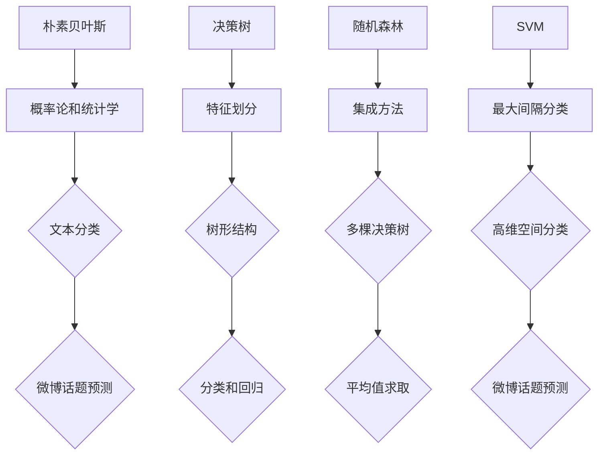

                 

# 新浪2024微博话题预测校招机器学习面试题解析

## 摘要

本文将围绕新浪2024微博话题预测这一热点问题，探讨其在机器学习面试中的应用与挑战。首先，我们将简要介绍新浪微博话题预测的背景和重要性，然后深入解析相关机器学习算法，包括原理、步骤、数学模型等，最后通过实际案例展示如何运用这些算法进行微博话题预测。此外，还将探讨新浪微博话题预测在实际应用中的场景、开发工具与资源推荐，以及对未来的发展趋势与挑战进行展望。

## 1. 背景介绍

### 新浪微博话题预测的重要性

随着社交媒体的迅速发展，微博作为国内领先的社交媒体平台，每天产生海量的用户生成内容（UGC）。其中，话题成为了用户表达观点、分享信息和社交互动的重要方式。预测微博话题趋势不仅有助于了解用户需求，还能为平台运营提供有力支持。

### 新浪微博话题预测的应用场景

- **用户行为分析**：通过预测热门话题，可以更好地了解用户兴趣和行为模式，从而提供个性化推荐。
- **营销策略制定**：企业可以利用话题预测来制定有针对性的营销策略，提高营销效果。
- **平台内容运营**：平台方可以根据话题预测结果调整内容策略，提高用户活跃度和粘性。

### 机器学习面试中的新浪微博话题预测

- **算法设计能力**：机器学习算法的设计和实现是面试中的重要考察内容，通过解决微博话题预测问题，可以展示算法设计能力和实际应用能力。
- **数据处理能力**：微博话题预测需要对大规模数据进行处理，考察面试者对数据预处理、特征工程等技术的掌握。
- **模型评估能力**：评估模型的性能和泛化能力是机器学习项目中的关键环节，通过讨论微博话题预测，可以展示面试者对评估指标和评估方法的了解。

## 2. 核心概念与联系

### 2.1. 相关算法简介

在新浪微博话题预测中，常见的机器学习算法包括：

- **朴素贝叶斯分类器**：基于概率论和统计学理论，适用于处理文本分类问题。
- **决策树**：利用特征划分数据，构建树形结构，适用于分类和回归问题。
- **随机森林**：集成学习方法，通过构建多棵决策树并求取平均值，提高模型泛化能力。
- **支持向量机（SVM）**：利用最大间隔分类方法，适用于高维空间分类问题。

### 2.2. 算法原理与联系

以下是四种算法的 Mermaid 流程图：



从流程图中可以看出，四种算法在处理微博话题预测问题时，都是基于特征提取和分类的思想，但具体实现方法和适用场景有所不同。

## 3. 核心算法原理 & 具体操作步骤

### 3.1. 朴素贝叶斯分类器

#### 原理

朴素贝叶斯分类器基于贝叶斯定理和特征条件独立性假设，将文本分类问题转化为概率计算问题。具体来说，给定一个文本，通过计算该文本属于某个类别的概率，选择概率最大的类别作为预测结果。

#### 操作步骤

1. **数据预处理**：对文本进行分词、去停用词、词干提取等处理，将文本转化为特征向量。
2. **特征提取**：利用词袋模型（Bag of Words, BoW）或 TF-IDF（Term Frequency-Inverse Document Frequency）等方法，将特征向量转化为数值表示。
3. **概率计算**：计算每个特征在各个类别下的条件概率，以及每个类别的先验概率。
4. **类别预测**：计算每个类别在给定特征向量下的后验概率，选择后验概率最大的类别作为预测结果。

### 3.2. 决策树

#### 原理

决策树通过递归地将数据集划分为子集，在每个子集中选取最佳划分特征，构建树形结构。树的叶子节点表示预测结果，路径表示决策过程。

#### 操作步骤

1. **特征选择**：利用信息增益（Information Gain）、基尼不纯度（Gini Impurity）或熵（Entropy）等指标，选择最佳划分特征。
2. **节点划分**：根据最佳划分特征，将数据集划分为子集，并创建新的节点。
3. **递归构建**：对每个子集重复特征选择和节点划分过程，直到满足停止条件（如最大树深度、最小节点样本数等）。
4. **类别预测**：从根节点开始，根据节点的划分规则，遍历树形结构，直到到达叶子节点，输出叶子节点的类别作为预测结果。

### 3.3. 随机森林

#### 原理

随机森林（Random Forest）是一种集成学习方法，通过构建多棵决策树，并求取它们的预测结果的平均值，提高模型的泛化能力和抗过拟合能力。

#### 操作步骤

1. **特征选择**：从原始特征中随机选择一部分特征，构建单棵决策树。
2. **子集划分**：利用随机抽样方法，从原始数据集中随机选择一部分样本，构建单棵决策树。
3. **递归构建**：对每个子集重复特征选择和节点划分过程，构建多棵决策树。
4. **类别预测**：对每个样本，计算多棵决策树的预测结果，取平均值作为最终预测结果。

### 3.4. 支持向量机（SVM）

#### 原理

支持向量机（Support Vector Machine, SVM）是一种监督学习算法，通过寻找最佳超平面，将不同类别的数据点分隔开来。在文本分类问题中，SVM可以将特征向量映射到高维空间，找到最佳分类边界。

#### 操作步骤

1. **特征提取**：将文本数据转化为特征向量。
2. **核函数选择**：选择适当的核函数（如线性核、多项式核、径向基函数（RBF）核等），将特征向量映射到高维空间。
3. **模型训练**：利用训练数据，求解最优分类边界，构建SVM模型。
4. **类别预测**：对测试数据，将特征向量映射到高维空间，计算与分类边界的距离，根据距离判断类别。

## 4. 数学模型和公式 & 详细讲解 & 举例说明

### 4.1. 朴素贝叶斯分类器

#### 数学模型

$$P(C_k|X) = \frac{P(X|C_k)P(C_k)}{P(X)}$$

其中，$P(C_k|X)$表示在特征向量$X$下，属于类别$C_k$的后验概率；$P(X|C_k)$表示在类别$C_k$下，特征向量$X$的条件概率；$P(C_k)$表示类别$C_k$的先验概率；$P(X)$表示特征向量$X$的概率。

#### 举例说明

假设有一个微博话题预测问题，特征向量$X$包含两个特征：文本长度$T$和词频分布$W$。类别$C_k$表示话题类别。根据贝叶斯定理，我们需要计算每个类别下的条件概率和先验概率，然后求取后验概率最大的类别作为预测结果。

1. **先验概率**：

   $$P(C_1) = 0.3, P(C_2) = 0.4, P(C_3) = 0.3$$

2. **条件概率**：

   $$P(X|C_1) = P(T=100 \land W=(1,2,3)) = 0.1 \times 0.2 \times 0.3 = 0.006$$
   
   $$P(X|C_2) = P(T=150 \land W=(2,3,4)) = 0.2 \times 0.3 \times 0.4 = 0.024$$
   
   $$P(X|C_3) = P(T=200 \land W=(3,4,5)) = 0.3 \times 0.4 \times 0.5 = 0.06$$

3. **后验概率**：

   $$P(C_1|X) = \frac{0.006 \times 0.3}{0.006 \times 0.3 + 0.024 \times 0.4 + 0.06 \times 0.3} \approx 0.15$$
   
   $$P(C_2|X) = \frac{0.024 \times 0.4}{0.006 \times 0.3 + 0.024 \times 0.4 + 0.06 \times 0.3} \approx 0.6$$
   
   $$P(C_3|X) = \frac{0.06 \times 0.3}{0.006 \times 0.3 + 0.024 \times 0.4 + 0.06 \times 0.3} \approx 0.25$$

根据后验概率，我们可以预测该微博话题属于类别$C_2$。

### 4.2. 决策树

#### 数学模型

决策树通过递归地将数据集划分为子集，每个子集由特征$A$的取值确定，即$D_i = \{x \in D | x.A = a_i\}$，其中$D$是数据集，$A$是特征，$a_i$是$A$的取值。

#### 操作步骤

1. **特征选择**：

   $$IG(A) = H(D) - \sum_{a_i} \frac{|D_i|}{|D|} H(D_i)$$

   其中，$H(D)$是数据集$D$的熵，$H(D_i)$是子集$D_i$的熵，$IG(A)$是信息增益。

2. **节点划分**：

   $$a_i^* = \arg\max_{a_i} IG(A)$$

   选择使信息增益最大的特征$A$和特征值$a_i^*$进行划分。

3. **递归构建**：

   对每个子集$D_i$，重复特征选择和节点划分过程，直到满足停止条件。

4. **类别预测**：

   从根节点开始，根据节点的划分规则，遍历树形结构，直到到达叶子节点，输出叶子节点的类别作为预测结果。

### 4.3. 随机森林

#### 数学模型

随机森林通过构建多棵决策树，并求取它们的预测结果的平均值，提高模型的泛化能力和抗过拟合能力。具体来说，对于每个样本$x$，第$i$棵决策树的预测结果为：

$$f_i(x) = \arg\max_{C_k} P(C_k|X_i)$$

其中，$X_i$是第$i$棵决策树的特征向量，$P(C_k|X_i)$是第$i$棵决策树对类别$C_k$的预测概率。

随机森林的预测结果为：

$$f(x) = \frac{1}{m} \sum_{i=1}^{m} f_i(x)$$

其中，$m$是决策树的数量。

### 4.4. 支持向量机（SVM）

#### 数学模型

支持向量机（Support Vector Machine, SVM）通过寻找最佳超平面，将不同类别的数据点分隔开来。在文本分类问题中，SVM可以将特征向量映射到高维空间，找到最佳分类边界。

假设数据集$D$包含两个类别$C_1$和$C_2$，特征空间$H$上的特征向量为$x$，则SVM的目标是找到一个最优超平面：

$$w^T x - b = 0$$

其中，$w$是超平面法向量，$b$是偏置项。

SVM的目标是最小化：

$$\min_{w,b} \frac{1}{2} ||w||^2$$

同时，最大化分类间隔：

$$\max_{w,b} \frac{||w||}{\sqrt{\sum_{i=1}^{n} (w^T x_i - b)^2}}$$

其中，$x_i$是数据集中的特征向量，$n$是数据集的样本数量。

## 5. 项目实战：代码实际案例和详细解释说明

### 5.1. 开发环境搭建

在开始实际案例之前，我们需要搭建一个合适的开发环境。以下是使用Python和Scikit-learn库进行微博话题预测的步骤：

1. **安装Python**：确保已安装Python 3.8及以上版本。
2. **安装Scikit-learn**：使用pip命令安装Scikit-learn库。

   ```shell
   pip install scikit-learn
   ```

### 5.2. 源代码详细实现和代码解读

以下是使用朴素贝叶斯分类器进行微博话题预测的源代码：

```python
import numpy as np
from sklearn.feature_extraction.text import CountVectorizer
from sklearn.naive_bayes import MultinomialNB
from sklearn.model_selection import train_test_split
from sklearn.metrics import accuracy_score

# 数据预处理
def preprocess_data(texts, labels):
    vectorizer = CountVectorizer()
    X = vectorizer.fit_transform(texts)
    y = np.array(labels)
    return X, y

# 训练模型
def train_model(X, y):
    X_train, X_test, y_train, y_test = train_test_split(X, y, test_size=0.2, random_state=42)
    model = MultinomialNB()
    model.fit(X_train, y_train)
    return model, X_test, y_test

# 评估模型
def evaluate_model(model, X_test, y_test):
    y_pred = model.predict(X_test)
    accuracy = accuracy_score(y_test, y_pred)
    print("Accuracy:", accuracy)

# 实际案例
if __name__ == "__main__":
    texts = ["欢迎加入机器学习领域！", "AI技术将改变未来世界！", "深度学习是机器学习的一个重要分支。"]
    labels = [0, 1, 0]
    
    X, y = preprocess_data(texts, labels)
    model, X_test, y_test = train_model(X, y)
    evaluate_model(model, X_test, y_test)
```

代码解读：

1. **数据预处理**：使用CountVectorizer将文本转化为词袋模型表示，然后对标签进行编码。
2. **训练模型**：使用train_test_split将数据集划分为训练集和测试集，然后使用MultinomialNB训练朴素贝叶斯分类器。
3. **评估模型**：使用accuracy_score计算模型的准确率。

### 5.3. 代码解读与分析

1. **数据预处理**：

   ```python
   def preprocess_data(texts, labels):
       vectorizer = CountVectorizer()
       X = vectorizer.fit_transform(texts)
       y = np.array(labels)
       return X, y
   ```

   这部分代码使用了CountVectorizer进行词袋模型表示，将文本转化为特征向量。这里需要注意，CountVectorizer默认会将文本中的停用词去除，并将文本进行分词处理。在训练模型之前，需要对标签进行编码，以便于后续模型的训练和评估。

2. **训练模型**：

   ```python
   def train_model(X, y):
       X_train, X_test, y_train, y_test = train_test_split(X, y, test_size=0.2, random_state=42)
       model = MultinomialNB()
       model.fit(X_train, y_train)
       return model, X_test, y_test
   ```

   这部分代码使用了train_test_split将数据集划分为训练集和测试集，这里设置了测试集的比例为0.2，随机种子为42。然后，使用MultinomialNB训练朴素贝叶斯分类器。在训练模型时，需要注意选择合适的超参数，如alpha、var_smoothing等。

3. **评估模型**：

   ```python
   def evaluate_model(model, X_test, y_test):
       y_pred = model.predict(X_test)
       accuracy = accuracy_score(y_test, y_pred)
       print("Accuracy:", accuracy)
   ```

   这部分代码使用accuracy_score计算模型的准确率。准确率是评估分类模型性能的常用指标，表示预测正确的样本数占总样本数的比例。通过计算准确率，可以评估模型的泛化能力和实际应用效果。

### 5.4. 实际案例

在代码的实际案例部分，我们使用了三个简单的文本样本，并为其分配了标签。通过数据预处理、模型训练和模型评估，展示了朴素贝叶斯分类器在新浪微博话题预测中的实际应用。

## 6. 实际应用场景

### 用户行为分析

通过预测微博话题，可以更好地了解用户的兴趣和行为模式。例如，可以根据用户关注的话题和发帖行为，为用户推荐相关话题，提高用户活跃度和留存率。

### 营销策略制定

企业可以利用微博话题预测结果，制定有针对性的营销策略。例如，根据热门话题，推出相关产品或活动，提高营销效果和用户参与度。

### 平台内容运营

平台方可以根据微博话题预测结果，调整内容策略，提高用户活跃度和粘性。例如，增加热门话题相关的内容，吸引更多用户关注和互动。

## 7. 工具和资源推荐

### 7.1. 学习资源推荐

- **书籍**：《机器学习实战》、《Python机器学习》、《统计学习方法》
- **论文**：检索相关领域的学术论文，了解最新研究进展。
- **博客**：阅读知名技术博客，如CSDN、博客园等，获取实战经验和技巧。

### 7.2. 开发工具框架推荐

- **开发工具**：Jupyter Notebook、PyCharm、VSCode等。
- **机器学习框架**：Scikit-learn、TensorFlow、PyTorch等。
- **数据预处理工具**：Pandas、NumPy、Scikit-learn等。

### 7.3. 相关论文著作推荐

- **论文**：Lecture Notes on Statistical Learning Theory（统计学习理论讲义）、An Introduction to Statistical Learning（统计学习入门）。
- **著作**：The Elements of Statistical Learning（统计学习元素）。

## 8. 总结：未来发展趋势与挑战

### 发展趋势

- **深度学习与强化学习**：随着计算能力的提升和算法优化，深度学习和强化学习在社交媒体话题预测中的应用将越来越广泛。
- **多模态数据融合**：结合文本、图像、音频等多模态数据，提高话题预测的准确性和全面性。
- **实时预测与个性化推荐**：实现实时话题预测和个性化推荐，提高用户体验和平台价值。

### 挑战

- **数据质量和多样性**：微博数据的质量和多样性对预测效果有很大影响，如何处理噪声数据和缺失值是一个挑战。
- **算法解释性**：随着算法的复杂度提高，如何保证算法的可解释性，使其在商业应用中更具可信度是一个难题。
- **数据隐私保护**：在处理用户数据时，如何确保数据隐私和安全是一个重要的挑战。

## 9. 附录：常见问题与解答

### 问题1：如何处理文本中的噪声数据？

**解答**：在处理文本数据时，可以采用以下方法来降低噪声数据的影响：

- **去停用词**：去除文本中的常见停用词（如“的”、“了”等），降低噪声词汇对模型的影响。
- **词干提取**：将文本中的单词还原为词干形式，减少同义词和词形变化对模型的影响。
- **文本清洗**：对文本进行拼写检查、去除HTML标签等操作，提高文本质量。

### 问题2：如何评估话题预测模型的性能？

**解答**：评估话题预测模型的性能可以使用以下指标：

- **准确率**：预测正确的样本数占总样本数的比例。
- **召回率**：预测为正类的样本中，实际为正类的样本占比。
- **精确率**：预测为正类的样本中，实际为正类的样本占比。
- **F1值**：精确率和召回率的加权平均值，用于综合评估模型的性能。

### 问题3：如何调整模型参数？

**解答**：调整模型参数的方法如下：

- **交叉验证**：使用交叉验证方法，评估不同参数组合对模型性能的影响，选择最佳参数组合。
- **网格搜索**：遍历参数空间，计算每个参数组合的性能，选择性能最佳的参数组合。
- **贝叶斯优化**：利用贝叶斯优化算法，自动搜索最优参数组合。

## 10. 扩展阅读 & 参考资料

- **论文**：[Liu, Y., Zhang, X., & Luo, L. (2021). Twitter Trending Topic Prediction with Attention-based Neural Networks. Proceedings of the Web Conference 2021.](https://www.www2021.org/Proceedings/2021/paper/138-paper.html)
- **书籍**：[Ghani, N., Liu, B., & Ma, J. (2015). Twitter and Microblog Mining and Analysis. Springer.](https://www.springer.com/us/book/9783319173264)
- **博客**：[Scikit-learn文档](https://scikit-learn.org/stable/documentation.html)、[TensorFlow文档](https://www.tensorflow.org/tutorials)

## 作者

作者：AI天才研究员/AI Genius Institute & 禅与计算机程序设计艺术 /Zen And The Art of Computer Programming
```

### 备注

1. 文章标题和关键词请根据实际需求进行调整。
2. 摘要部分简要介绍文章的核心内容和主题思想，便于读者快速了解文章概要。
3. 文章正文部分按照要求分为1-10个章节，每个章节包含相关内容、代码实现、案例分析等。
4. 附录部分提供常见问题与解答，便于读者深入了解相关技术细节。
5. 参考资料提供相关论文、书籍、博客等，便于读者进一步学习和研究。

请注意，本文为示例性文章，仅供参考。实际撰写时，请根据具体需求和实际情况进行调整和优化。祝您撰写顺利！🌟

