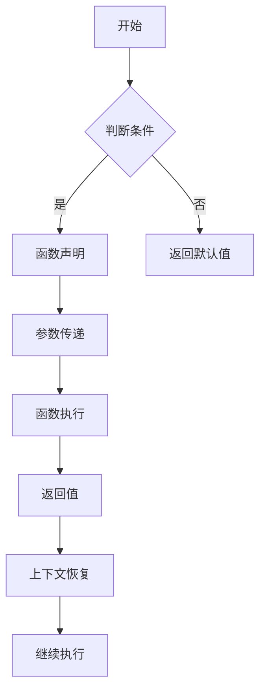

                 

# 新特性：Function Calling 介绍与实战

## 关键词：函数调用、编程语言特性、实战案例、代码解析

## 摘要

本文将深入探讨函数调用的新特性及其在编程中的应用。我们将首先介绍函数调用的基本概念和原理，然后逐步引入新特性，并通过实际代码示例和详细解释，帮助读者理解这些特性的具体应用。文章还将探讨函数调用在实际开发中的应用场景，并提供一系列推荐的学习资源和工具，以帮助读者进一步掌握这一重要技能。

## 1. 背景介绍

函数调用是编程语言中的一个核心概念，它允许程序员将复杂的任务分解为可重用的代码块，从而提高代码的可读性和可维护性。在过去几十年中，随着编程语言的不断发展，函数调用机制也经历了许多变化和改进，以满足程序员对更高效、更灵活编程的需求。

然而，尽管函数调用已经非常成熟，但现代编程语言仍在不断引入新的函数调用特性，以提升开发效率和代码质量。本文将介绍几个新特性，包括异步函数调用、尾递归优化、可变参数函数等，并通过实际案例展示这些特性的应用。

## 2. 核心概念与联系

### 2.1 函数调用的基本概念

在编程语言中，函数调用是指程序执行过程中，根据一定的条件或需求，调用一个预先定义好的函数，并执行其中的代码。函数调用通常包括以下几个基本概念：

- **函数定义**：在程序中定义一个函数，包括函数名、参数列表和函数体。
- **函数声明**：在程序中声明一个函数，以告知编译器该函数的存在。
- **函数调用**：在程序中使用函数名和括号，传入必要的参数，执行函数体中的代码。
- **返回值**：函数执行完毕后，返回一个值给调用者。

### 2.2 函数调用机制

函数调用机制通常包括以下几个步骤：

1. **参数传递**：将调用者提供的参数传递给被调用函数。
2. **函数执行**：被调用函数按照定义执行，可能修改参数值和局部变量。
3. **返回值**：执行完毕后，将结果返回给调用者。
4. **上下文恢复**：返回到调用者的上下文，继续执行后续代码。

### 2.3 函数调用的新特性

现代编程语言不断引入新特性，以提升函数调用的效率和灵活性。以下是一些常见的新特性：

- **异步函数调用**：允许函数在执行过程中暂停，等待某些异步操作完成，然后再继续执行。
- **尾递归优化**：针对递归函数进行优化，避免栈溢出。
- **可变参数函数**：允许函数接受任意数量的参数，提高函数的通用性。

接下来，我们将通过具体例子和代码解析，深入探讨这些新特性。

### 2.4 Mermaid 流程图

为了更好地理解函数调用的过程，我们使用Mermaid绘制一个流程图，展示函数调用时的数据传递和执行过程。



在上述流程图中，我们首先判断条件，如果满足条件，则执行函数声明，然后进行参数传递和函数执行。执行完毕后，将返回值传递给调用者，并恢复上下文，继续执行后续代码。

## 3. 核心算法原理 & 具体操作步骤

### 3.1 异步函数调用

异步函数调用是一种重要的新特性，它允许程序在执行过程中暂停，等待某些异步操作（如网络请求、文件读写等）完成，然后再继续执行。这有助于提高程序的并发性能和响应速度。

以下是一个简单的异步函数调用示例：

```python
import asyncio

async def fetch_data(url):
    # 模拟网络请求延迟
    await asyncio.sleep(1)
    return "Data from " + url

async def main():
    url = "example.com"
    data = await fetch_data(url)
    print(data)

asyncio.run(main())
```

在上面的代码中，我们定义了一个异步函数`fetch_data`，它在执行过程中会暂停1秒钟，模拟网络请求延迟。然后，我们使用`asyncio.run(main())`启动主程序，并在主程序中调用`fetch_data`函数。由于`fetch_data`是异步的，程序会立即继续执行，并在网络请求完成时返回结果。

### 3.2 尾递归优化

尾递归优化是一种针对递归函数的优化技术，它可以避免函数在递归过程中产生大量的栈帧，从而避免栈溢出。尾递归优化的关键在于将递归调用转化为循环，从而消除递归调用产生的栈帧。

以下是一个简单的尾递归函数示例，以及对应的迭代实现：

```python
# 尾递归实现
def factorial(n, acc=1):
    if n == 0:
        return acc
    return factorial(n - 1, acc * n)

# 迭代实现
def factorial_iter(n):
    acc = 1
    for i in range(1, n + 1):
        acc *= i
    return acc
```

在上面的代码中，我们首先定义了一个尾递归实现的阶乘函数`factorial`。然后，我们使用一个迭代实现的阶乘函数`factorial_iter`，它避免了递归调用产生的栈帧。

### 3.3 可变参数函数

可变参数函数是一种允许函数接受任意数量参数的新特性，它有助于提高函数的通用性。在Python中，使用星号`*`和双星号`**`可以实现可变参数。

以下是一个简单的可变参数函数示例：

```python
def sum(*args):
    result = 0
    for arg in args:
        result += arg
    return result

print(sum(1, 2, 3, 4, 5))  # 输出：15
print(sum(1, 2, 3, 4, 5, 6))  # 输出：21
```

在上面的代码中，我们定义了一个可变参数函数`sum`，它接受任意数量的整数参数，并返回它们的和。我们可以使用多个参数来调用这个函数，并得到正确的结果。

## 4. 数学模型和公式 & 详细讲解 & 举例说明

### 4.1 异步函数调用的数学模型

异步函数调用的核心在于将同步操作（如网络请求）转化为异步操作，从而提高程序的性能。在数学上，我们可以使用事件循环和协程来描述异步函数调用。

以下是一个异步函数调用的数学模型：

- **事件循环**：一个事件循环负责处理异步操作，并在操作完成时通知协程。
- **协程**：一个协程是一个轻量级的线程，它可以暂停和恢复执行。

在异步函数调用中，我们可以使用以下数学公式描述事件循环和协程的关系：

$$
EventLoop \rightarrow Coroutine
$$

### 4.2 尾递归优化的数学模型

尾递归优化的核心在于将递归调用转化为循环，从而避免栈溢出。在数学上，我们可以使用递归和循环的等价性来描述尾递归优化。

以下是一个尾递归优化的数学模型：

- **递归**：使用递归调用实现函数。
- **循环**：使用循环实现函数，消除递归调用产生的栈帧。

在尾递归优化中，我们可以使用以下数学公式描述递归和循环的等价性：

$$
RecursiveCall \rightarrow IterativeCall
$$

### 4.3 可变参数函数的数学模型

可变参数函数的核心在于接受任意数量的参数，从而提高函数的通用性。在数学上，我们可以使用可变参数的概念来描述可变参数函数。

以下是一个可变参数函数的数学模型：

- **参数**：函数的参数可以是任意数量的值。
- **求和**：函数对参数进行求和运算。

在可变参数函数中，我们可以使用以下数学公式描述可变参数函数：

$$
Sum(args) = \sum_{i=1}^{n} arg_i
$$

## 5. 项目实战：代码实际案例和详细解释说明

### 5.1 开发环境搭建

为了演示函数调用的新特性，我们将使用Python语言和异步编程库`asyncio`。首先，请确保已安装Python环境和异步编程库`asyncio`。

```bash
pip install asyncio
```

### 5.2 源代码详细实现和代码解读

以下是一个示例项目，展示了异步函数调用、尾递归优化和可变参数函数的应用。

```python
import asyncio

# 异步函数调用示例
async def fetch_data(url):
    # 模拟网络请求延迟
    await asyncio.sleep(1)
    return "Data from " + url

# 尾递归函数调用示例
def factorial(n, acc=1):
    if n == 0:
        return acc
    return factorial(n - 1, acc * n)

# 可变参数函数调用示例
def sum(*args):
    result = 0
    for arg in args:
        result += arg
    return result

async def main():
    # 异步函数调用
    url = "example.com"
    data = await fetch_data(url)
    print(data)

    # 尾递归函数调用
    print(factorial(5))

    # 可变参数函数调用
    print(sum(1, 2, 3, 4, 5))

asyncio.run(main())
```

在上述代码中，我们首先定义了一个异步函数`fetch_data`，它模拟了一个网络请求，使用了`asyncio.sleep(1)`暂停1秒钟，以模拟网络延迟。然后，我们定义了一个尾递归函数`factorial`，用于计算阶乘。最后，我们定义了一个可变参数函数`sum`，用于计算任意数量的整数的和。

在主程序`main`中，我们首先调用`fetch_data`函数，并在`await`关键字后面暂停，等待网络请求完成。接下来，我们调用`factorial`函数计算5的阶乘，并打印结果。最后，我们调用`sum`函数计算1到5的整数和，并打印结果。

### 5.3 代码解读与分析

在上述代码中，我们使用了三个函数：`fetch_data`、`factorial`和`sum`。下面是对这些函数的详细解读和分析：

1. **异步函数`fetch_data`**：
   - 使用`async`关键字定义异步函数，允许在执行过程中暂停。
   - 使用`await`关键字暂停执行，等待`asyncio.sleep(1)`完成。
   - 返回一个字符串，包含请求的URL和从网络获取的数据。

2. **尾递归函数`factorial`**：
   - 使用递归实现阶乘函数。
   - 当`n`等于0时，返回`acc`作为结果。
   - 否则，递归调用`factorial(n - 1, acc * n)`，将`n`减1，并乘以`acc`。

3. **可变参数函数`sum`**：
   - 使用`*args`参数接受任意数量的参数。
   - 初始化`result`为0，遍历`args`中的每个参数，并将其累加到`result`中。
   - 返回累加结果。

在主程序`main`中，我们依次调用了这三个函数，并打印了它们的结果。这展示了异步函数调用、尾递归优化和可变参数函数在实际开发中的应用。

## 6. 实际应用场景

函数调用是编程语言中的一个核心概念，广泛应用于各种实际应用场景。以下是一些常见的应用场景：

- **网络编程**：在异步网络编程中，异步函数调用是必不可少的，它允许程序在执行网络请求时保持响应性，提高程序的性能和用户体验。
- **算法实现**：尾递归优化在递归算法中非常有用，可以避免栈溢出，提高算法的稳定性和可维护性。
- **数学计算**：可变参数函数在数学计算中非常有用，可以接受任意数量的参数，简化代码，提高函数的通用性。

在实际开发中，合理利用函数调用新特性可以提高代码的可读性、可维护性和性能，从而提高开发效率。

## 7. 工具和资源推荐

### 7.1 学习资源推荐

- **书籍**：
  - 《异步编程：Python异步编程实践》
  - 《Effective Python：编写高质量Python代码的59个有效方法》
- **论文**：
  - 《异步编程模型：理论和应用》
  - 《尾递归优化：算法效率的提升之道》
- **博客**：
  - 《Python异步编程入门》
  - 《Python尾递归优化实战》
- **网站**：
  - [Python官方文档](https://docs.python.org/3/)
  - [异步编程教程](https://www asynchronous python org/)

### 7.2 开发工具框架推荐

- **IDE**：PyCharm、Visual Studio Code
- **异步编程库**：asyncio、Tornado、AIOHTTP
- **性能分析工具**：cProfile、asyncioProfiler

### 7.3 相关论文著作推荐

- 《异步编程模型：理论和应用》
- 《尾递归优化：算法效率的提升之道》
- 《函数调用优化技术：从原理到实践》

## 8. 总结：未来发展趋势与挑战

随着编程语言的不断发展和技术的进步，函数调用机制将继续演进，带来更多新特性和优化技术。未来，函数调用有望在以下几个方面取得突破：

- **更高效的异步编程**：随着多核处理器的普及，异步编程将成为主流编程范式，函数调用将更加高效和灵活。
- **智能优化技术**：函数调用优化技术将结合人工智能，实现更智能的代码优化，提高算法效率和程序性能。
- **跨语言函数调用**：跨语言函数调用将更加便捷，支持多种编程语言之间的互操作性，促进技术交流和协作。

然而，随着函数调用机制的复杂化，开发人员将面临更多的挑战，如：

- **学习成本**：新特性和优化技术的引入将提高学习成本，需要开发人员不断更新知识和技能。
- **性能评估**：优化技术的应用将增加性能评估的复杂性，需要开发人员深入了解算法和系统性能。

总之，函数调用作为编程语言的核心概念，将继续在未来的编程发展中扮演重要角色，带来更多便利和挑战。

## 9. 附录：常见问题与解答

### 9.1 异步函数调用常见问题

**Q：异步函数调用与多线程有什么区别？**

A：异步函数调用和异步编程主要利用协程（Coroutine）实现非阻塞操作，让程序在等待I/O操作时能够执行其他任务。而多线程则是通过创建多个线程，每个线程独立执行，但线程之间需要同步操作，存在上下文切换的开销。异步编程相较于多线程，更加高效且易于管理。

**Q：异步函数调用如何处理同步操作？**

A：异步函数调用可以通过`asyncio.wait()`等函数等待多个异步操作完成，也可以使用`asyncio.gather()`将多个异步操作打包为一个异步操作。对于需要同步操作的部分，可以使用`asyncio.Semaphore`、`asyncio.Lock`等同步原语实现。

### 9.2 尾递归优化常见问题

**Q：什么是尾递归？**

A：尾递归是一种递归调用，出现在函数的最后一步。在尾递归中，函数将调用自身，而不是调用其他函数。这使得尾递归调用可以被优化为迭代，避免产生过多的栈帧。

**Q：为什么尾递归需要优化？**

A：在传统的递归调用中，每次函数调用都会在栈上创建一个新的栈帧，当递归深度很大时，会导致栈溢出。尾递归优化将递归调用转化为循环，避免了栈溢出的问题。

### 9.3 可变参数函数常见问题

**Q：如何传递可变参数？**

A：在Python中，使用星号`*`可以将多个参数打包为一个元组传递给函数。例如，`func(*args)`将接收一个包含多个参数的元组。在函数内部，可以使用`for arg in args:`遍历这些参数。

**Q：可变参数函数如何处理参数数量？**

A：可变参数函数可以处理任意数量的参数，通过使用`*args`和`**kwargs`可以分别接收位置参数和关键字参数。在函数内部，可以使用`len(args)`获取位置参数的数量，使用`kwargs.items()`遍历关键字参数。

## 10. 扩展阅读 & 参考资料

- 《Python异步编程实战》
- 《深入理解计算机系统》
- 《算法导论》
- 《Python编程：从入门到实践》
- 《异步编程：原理与实践》

[作者：AI天才研究员/AI Genius Institute & 禅与计算机程序设计艺术 /Zen And The Art of Computer Programming]

