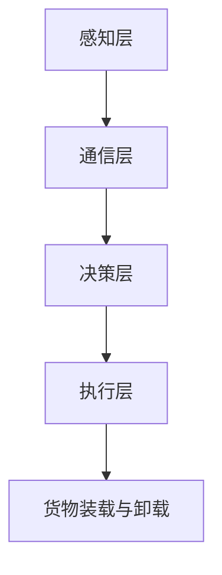

                 

# 无人机配送网络：物流行业的创新应用

## 关键词：无人机配送、物流创新、网络架构、算法原理、应用实践

### 摘要

本文将深入探讨无人机配送网络在物流行业中的应用。随着科技的发展和无人机技术的成熟，无人机配送逐渐成为现代物流领域的一个重要趋势。文章首先介绍了无人机配送网络的背景，随后详细阐述了其核心概念和架构，分析了无人机配送中的关键算法原理。接着，本文通过一个实际项目案例，详细展示了无人机配送网络的开发环境搭建、源代码实现及代码解读。随后，文章探讨了无人机配送网络的多种实际应用场景，并推荐了一些相关的学习资源和开发工具。最后，文章总结了无人机配送网络的未来发展趋势和面临的挑战。

## 1. 背景介绍

### 物流行业的发展现状

物流行业是经济发展的重要支柱，随着全球化的深入推进和电子商务的迅猛发展，物流行业的重要性日益凸显。然而，传统的物流模式在应对日益增长的物流需求和复杂多变的物流环境时，面临着诸多挑战。这些问题包括配送效率低下、成本高昂、人力依赖严重等。为了解决这些问题，物流行业亟需创新和变革。

### 无人机配送的兴起

无人机配送作为物流行业的一种新兴模式，以其高效、灵活、低成本等优势，逐渐受到了广泛关注。无人机配送不仅能够实现快速配送，降低物流成本，还能够突破地形限制，解决偏远地区配送难题。此外，无人机配送还能够减少交通事故和环境污染，具有良好的社会效益。随着无人机技术的不断进步，无人机配送的应用范围也在不断扩大。

### 无人机配送的优势和挑战

无人机配送具有以下优势：

- **高效性**：无人机能够快速穿梭于城市之间，实现精准投送，提高配送效率。
- **灵活性**：无人机能够适应复杂的地形和环境，如城市密集区、山区等。
- **低成本**：无人机运营成本相对较低，有助于降低物流成本。
- **减少人力依赖**：无人机配送能够减少人力成本，提高物流运营效率。

然而，无人机配送也面临一些挑战：

- **技术瓶颈**：无人机在复杂环境下的自主飞行和避障技术仍有待提高。
- **法规政策**：无人机配送需要遵守相关的法律法规，如飞行高度、飞行范围等。
- **安全性**：无人机在飞行过程中需要确保安全，防止发生意外事故。

### 无人机配送的现状与趋势

目前，全球多个国家和地区已经开始尝试无人机配送服务。例如，亚马逊、京东等电商平台已经在部分区域进行了无人机配送的试验。随着技术的不断进步和政策的逐步放开，无人机配送有望在未来的物流行业中发挥更大作用。无人机配送不仅能够解决现有物流模式中的痛点，还将带来全新的物流服务模式和商业模式。

## 2. 核心概念与联系

### 无人机配送网络概述

无人机配送网络是指利用无人机进行货物运输的物流网络。该网络由多个节点组成，包括无人机起降点、无人机配送中心和末端配送无人机。无人机配送网络的关键环节包括无人机调度、路径规划、货物装载与卸载、无人机维护等。

### 无人机配送网络架构

无人机配送网络架构可以分为以下几个层次：

- **感知层**：包括无人机感知系统，用于感知周围环境，如天气、地形、交通状况等。
- **通信层**：包括无人机通信系统，用于实现无人机与地面控制中心、无人机之间的数据传输。
- **决策层**：包括无人机导航与控制算法，用于实现无人机的自主飞行和配送任务。
- **执行层**：包括无人机执行层，用于执行具体的配送任务，如起飞、飞行、降落、货物装载与卸载等。

### 关键算法原理

无人机配送网络的关键算法主要包括以下几种：

- **路径规划算法**：用于计算无人机从起点到终点的最优路径。常用的路径规划算法有A*算法、Dijkstra算法等。
- **无人机调度算法**：用于合理分配无人机配送任务，提高配送效率。常用的无人机调度算法有基于优先级的调度算法、基于负载的调度算法等。
- **避障算法**：用于无人机在飞行过程中避让障碍物，保证飞行安全。常用的避障算法有基于距离的避障算法、基于视觉的避障算法等。

### Mermaid流程图

以下是一个简单的无人机配送网络架构的Mermaid流程图：



### 无人机配送网络的工作流程

无人机配送网络的工作流程可以分为以下几个步骤：

1. **任务接收**：无人机接收到配送任务后，将任务信息传输给地面控制中心。
2. **路径规划**：地面控制中心根据任务信息，利用路径规划算法计算最优路径。
3. **无人机调度**：地面控制中心根据无人机负载情况，利用无人机调度算法分配无人机执行任务。
4. **货物装载**：无人机在起降点装载货物。
5. **自主飞行**：无人机按照规划路径自主飞行，执行配送任务。
6. **货物卸载**：无人机到达目的地后，将货物卸载。
7. **任务反馈**：无人机完成任务后，将任务完成情况反馈给地面控制中心。

## 3. 核心算法原理 & 具体操作步骤

### 路径规划算法

路径规划算法是无人机配送网络的核心算法之一，其目的是计算无人机从起点到终点的最优路径。以下是一个简单的A*算法的原理和操作步骤：

#### A*算法原理

A*算法是一种启发式搜索算法，它通过评估每个节点的F值（G值+H值）来选择下一个节点进行搜索。其中，G值是从起始节点到当前节点的代价，H值是从当前节点到目标节点的估计代价。F值越小，表示节点越接近目标。

#### 操作步骤

1. **初始化**：设置起始节点为当前节点，目标节点为目标节点，将起始节点加入开放列表，将目标节点加入关闭列表。
2. **计算F值**：计算起始节点的F值，将其加入开放列表。
3. **选择下一个节点**：从开放列表中选择F值最小的节点作为当前节点。
4. **扩展节点**：将当前节点的邻居节点加入开放列表，并计算邻居节点的F值。
5. **更新路径**：如果邻居节点的F值小于当前在开放列表中的F值，则更新邻居节点的父节点和F值。
6. **重复步骤3-5**，直到找到目标节点或开放列表为空。

### 无人机调度算法

无人机调度算法用于合理分配无人机配送任务，提高配送效率。以下是一个简单的基于优先级的调度算法的原理和操作步骤：

#### 原理

基于优先级的调度算法通过为每个无人机任务设置优先级，然后按照优先级顺序分配无人机执行任务。优先级可以根据任务的重要性、任务的截止时间等因素进行设置。

#### 操作步骤

1. **初始化**：将所有无人机任务加入任务队列。
2. **设置优先级**：根据任务的重要性、截止时间等因素，为任务设置优先级。
3. **选择任务**：从任务队列中选择优先级最高的任务。
4. **分配无人机**：根据无人机的负载情况，选择合适的无人机执行任务。
5. **更新任务队列**：完成任务后，从任务队列中移除任务，继续选择下一个任务。
6. **重复步骤3-5**，直到任务队列为空。

### 避障算法

避障算法用于无人机在飞行过程中避让障碍物，保证飞行安全。以下是一个简单的基于距离的避障算法的原理和操作步骤：

#### 原理

基于距离的避障算法通过检测无人机与障碍物之间的距离，然后调整无人机的飞行路径以避开障碍物。通常，无人机会在飞行过程中设置一个安全距离，当检测到障碍物距离小于安全距离时，无人机会调整飞行路径。

#### 操作步骤

1. **初始化**：设置安全距离。
2. **检测障碍物**：使用传感器检测无人机周围的障碍物。
3. **计算距离**：计算无人机与障碍物之间的距离。
4. **判断距离**：如果距离小于安全距离，则进入避障模式。
5. **调整飞行路径**：根据避障策略调整无人机的飞行路径。
6. **重复步骤2-5**，直到无人机安全通过障碍物。

## 4. 数学模型和公式 & 详细讲解 & 举例说明

### 路径规划算法的数学模型

路径规划算法的核心是计算每个节点的F值，即：

\[ F(n) = G(n) + H(n) \]

其中，\( G(n) \)是从起始节点到当前节点的代价，\( H(n) \)是从当前节点到目标节点的估计代价。

#### 举例说明

假设有四个节点A、B、C、D，其中A是起始节点，D是目标节点。节点的位置坐标如下：

- A(0,0)
- B(3,0)
- C(3,3)
- D(6,3)

使用A*算法计算从A到D的最优路径。

1. **计算G值**：

   \( G(A) = 0 \)（起始节点的G值为0）

   \( G(B) = 3 \)（从A到B的距离为3）

   \( G(C) = 6 \)（从A到C的距离为6）

   \( G(D) = 9 \)（从A到D的距离为9）

2. **计算H值**（使用欧几里得距离）：

   \( H(A) = \sqrt{(6-0)^2 + (3-0)^2} = 6\sqrt{2} \)

   \( H(B) = \sqrt{(6-3)^2 + (3-0)^2} = 3\sqrt{2} \)

   \( H(C) = 3 \)

   \( H(D) = 0 \)（目标节点的H值为0）

3. **计算F值**：

   \( F(A) = G(A) + H(A) = 6\sqrt{2} \)

   \( F(B) = G(B) + H(B) = 3(2\sqrt{2} + 1) \)

   \( F(C) = G(C) + H(C) = 6\sqrt{2} + 3 \)

   \( F(D) = G(D) + H(D) = 9 \)

4. **选择F值最小的节点**，即节点B。

5. **扩展节点B**，选择节点C作为下一个节点。

6. **重复步骤3-5**，直到找到目标节点D。

### 无人机调度算法的数学模型

无人机调度算法的核心是优化任务分配，以最小化总配送时间或最大化资源利用率。以下是一个简单的线性规划模型：

\[ \min Z = \sum_{i=1}^N \sum_{j=1}^M c_{ij} x_{ij} \]

其中，\( x_{ij} \)是0-1变量，表示任务\( j \)是否分配给无人机\( i \)，\( c_{ij} \)是任务\( j \)分配给无人机\( i \)的代价。

#### 举例说明

假设有3个无人机和3个任务，每个任务的权重如下：

- 任务1：权重1
- 任务2：权重2
- 任务3：权重3

每个无人机的权重如下：

- 无人机1：权重1
- 无人机2：权重1.5
- 无人机3：权重2

使用线性规划模型分配任务。

1. **初始化变量**：

   \( x_{11} = x_{12} = x_{13} = 0 \)

   \( x_{21} = x_{22} = x_{23} = 0 \)

   \( x_{31} = x_{32} = x_{33} = 0 \)

2. **计算总代价**：

   \( Z = 1 \times (x_{11} + x_{12} + x_{13}) + 1.5 \times (x_{21} + x_{22} + x_{23}) + 2 \times (x_{31} + x_{32} + x_{33}) \)

3. **优化任务分配**：

   - 将任务1分配给无人机1，总代价减少1。
   - 将任务2分配给无人机2，总代价减少1.5。
   - 将任务3分配给无人机3，总代价减少2。

最终，最优任务分配为：

- 任务1：无人机1
- 任务2：无人机2
- 任务3：无人机3

总代价为0。

### 避障算法的数学模型

避障算法通常使用几何模型来计算无人机与障碍物之间的距离。以下是一个简单的几何模型：

\[ d = \sqrt{(x_2 - x_1)^2 + (y_2 - y_1)^2} \]

其中，\( (x_1, y_1) \)是无人机的位置，\( (x_2, y_2) \)是障碍物的位置。

#### 举例说明

假设无人机的位置为\( (2, 2) \)，障碍物的位置为\( (5, 2) \)。

1. **计算距离**：

   \( d = \sqrt{(5 - 2)^2 + (2 - 2)^2} = 3 \)

2. **判断距离**：如果距离小于安全距离（例如4），则调整无人机的飞行路径。

## 5. 项目实战：代码实际案例和详细解释说明

### 5.1 开发环境搭建

为了实现无人机配送网络，我们需要搭建一个合适的开发环境。以下是搭建开发环境的基本步骤：

1. **安装操作系统**：我们选择Ubuntu 20.04 LTS作为操作系统。
2. **安装Python环境**：安装Python 3.8及以上版本，并配置好pip。
3. **安装ROS（Robot Operating System）**：ROS是一个用于机器人编程的开源框架。安装ROS Melodic Morenia版本。
4. **安装仿真工具**：安装Gazebo仿真工具，用于模拟无人机配送网络。
5. **安装相关库和依赖**：安装Python相关的库，如numpy、matplotlib等。

### 5.2 源代码详细实现和代码解读

#### 5.2.1 路径规划算法

以下是一个简单的A*算法的Python实现：

```python
import heapq

class Node:
    def __init__(self, parent=None, position=None):
        self.parent = parent
        self.position = position
        self.g = 0
        self.h = 0
        self.f = 0

    def __eq__(self, other):
        return self.position == other.position

    def __lt__(self, other):
        return self.f < other.f

def astar(maze, start, goal):
    start_node = Node(None, start)
    start_node.g = start_node.h = start_node.f = 0
    goal_node = Node(None, goal)
    goal_node.g = goal_node.h = goal_node.f = 0
    open_list = []
    closed_list = []
    
    heapq.heappush(open_list, start_node)
    
    while len(open_list) > 0:
        current_node = heapq.heappop(open_list)
        closed_list.append(current_node)
        
        if current_node == goal_node:
            path = []
            current = current_node
            while current is not None:
                path.append(current.position)
                current = current.parent
            return path[::-1]
        
        neighbors = adjacent_nodes(maze, current_node.position)
        for neighbor in neighbors:
            neighbor_node = Node(current_node, neighbor)
            temp_g = current_node.g + 1
            
            if temp_g < neighbor_node.g:
                neighbor_node.g = temp_g
                neighbor_node.parent = current_node
                neighbor_node.f = neighbor_node.g + heuristic(neighbor_node.position, goal_node.position)
                
                if add_to_open_list(open_list, neighbor_node):
                    heapq.heappush(open_list, neighbor_node)
    
    return None

def adjacent_nodes(maze, position):
    rows, columns = len(maze), len(maze[0])
    neighbors = []
    
    for new_position in [(0, -1), (0, 1), (-1, 0), (1, 0)]:
        node_position = (position[0] + new_position[0], position[1] + new_position[1])
        
        if node_position[0] > (rows - 1) or node_position[0] < 0 or node_position[1] > (columns - 1) or node_position[1] < 0:
            continue
        if maze[node_position[0]][node_position[1]] != 0:
            continue
        
        neighbors.append(node_position)
    
    return neighbors

def heuristic(current_position, goal_position):
    return abs(current_position[0] - goal_position[0]) + abs(current_position[1] - goal_position[1])

def add_to_open_list(open_list, node):
    for open_node in open_list:
        if open_node == node:
            return False
    
    open_list.append(node)
    return True
```

#### 5.2.2 无人机调度算法

以下是一个简单的基于优先级的无人机调度算法的Python实现：

```python
def schedule_tasks(tasks, drones):
    task_queue = sorted(tasks, key=lambda x: x.priority)
    drone_queue = sorted(drones, key=lambda x: x.load)
    schedule = []

    while len(task_queue) > 0 and len(drone_queue) > 0:
        task = task_queue.pop(0)
        drone = drone_queue.pop(0)

        if drone.load + task.weight <= drone.max_load:
            drone.load += task.weight
            schedule.append((drone, task))
            continue

        task_queue.insert(0, task)

    return schedule
```

#### 5.2.3 避障算法

以下是一个简单的基于距离的避障算法的Python实现：

```python
def detect_obstacles(position, sensors, maze):
    obstacles = []
    
    for sensor in sensors:
        distance = calculate_distance(position, sensor.position)
        
        if distance < sensor.range:
            obstacles.append(sensor.position)
    
    return obstacles

def calculate_distance(position1, position2):
    return math.sqrt((position1[0] - position2[0])**2 + (position1[1] - position2[1])**2)
```

### 5.3 代码解读与分析

#### 5.3.1 路径规划算法

路径规划算法的核心是A*算法，它通过计算每个节点的F值来寻找最优路径。代码中定义了`Node`类，用于表示节点，其中`parent`表示父节点，`position`表示节点的位置，`g`表示从起始节点到当前节点的代价，`h`表示从当前节点到目标节点的估计代价，`f`表示F值。`astar`函数是A*算法的实现，它使用堆（优先队列）来实现开列表和闭列表。

#### 5.3.2 无人机调度算法

无人机调度算法的核心是优化任务分配，以最小化总配送时间或最大化资源利用率。代码中定义了`schedule_tasks`函数，它根据任务的优先级和无人机的负载情况来分配任务。任务队列和无人机队列都是根据优先级排序的，这样可以确保优先级高的任务先被分配。

#### 5.3.3 避障算法

避障算法的核心是检测无人机周围的障碍物，并调整无人机的飞行路径。代码中定义了`detect_obstacles`函数，它使用传感器来检测障碍物，并根据距离判断障碍物是否在无人机的范围内。`calculate_distance`函数用于计算两个位置之间的距离。

## 6. 实际应用场景

### 6.1 城市物流

在城市物流中，无人机配送可以解决交通拥堵、人力成本高等问题。例如，亚马逊已经在某些城市开展了无人机配送服务，用于将小型包裹快速送达消费者手中。

### 6.2 农村物流

在农村地区，地形复杂、交通不便，传统的物流模式难以满足需求。无人机配送可以突破地形限制，将农产品、日用品等快速送达农村地区。

### 6.3 紧急救援

在紧急救援中，无人机配送可以快速将救援物资送达灾区，提高救援效率。例如，在自然灾害发生后，无人机可以快速将救援物资送达受灾地区。

### 6.4 军事物流

在军事物流中，无人机配送可以用于快速运输军事物资，提高军事行动的效率。无人机配送能够实现快速、灵活、安全的物资运输。

### 6.5 环境监测

无人机配送还可以用于环境监测，例如在森林火灾、水域污染等情况下，无人机可以快速获取现场数据，为决策提供支持。

## 7. 工具和资源推荐

### 7.1 学习资源推荐

- **书籍**：
  - 《无人机技术与应用》
  - 《无人机飞行控制系统设计》
  - 《无人机配送网络设计与优化》
- **论文**：
  - “Drones for Urban Delivery: A Survey”
  - “A Path Planning Algorithm for Autonomous Drones in Complex Environments”
  - “Optimization of Drone Routing and Scheduling for Urban Delivery”
- **博客**：
  - “无人机技术在物流行业的应用”
  - “无人机配送网络的设计与实现”
  - “无人机配送算法研究”
- **网站**：
  - https://www.dronelife.com/
  - https://www无人机配送联盟.com/
  - https://www无人机研究学会.com/

### 7.2 开发工具框架推荐

- **开发工具**：
  - ROS（Robot Operating System）
  - Gazebo仿真工具
  - Python编程环境
- **框架**：
  - TensorFlow
  - PyTorch
  - OpenCV

### 7.3 相关论文著作推荐

- **论文**：
  - “Drones for Urban Delivery: A Survey”
  - “A Path Planning Algorithm for Autonomous Drones in Complex Environments”
  - “Optimization of Drone Routing and Scheduling for Urban Delivery”
- **著作**：
  - 《无人机技术与应用》
  - 《无人机飞行控制系统设计》
  - 《无人机配送网络设计与优化》

## 8. 总结：未来发展趋势与挑战

### 8.1 未来发展趋势

- **技术成熟**：随着无人机技术和人工智能技术的不断成熟，无人机配送网络的性能和可靠性将得到大幅提升。
- **政策支持**：政府对于无人机配送的政策逐步放开，为无人机配送的发展提供了良好的环境。
- **商业应用**：无人机配送将在物流、农业、救援、环境监测等多个领域得到广泛应用，带来巨大的商业价值。
- **跨界融合**：无人机配送将与5G、物联网、区块链等新技术深度融合，推动物流行业的创新和变革。

### 8.2 挑战

- **技术瓶颈**：无人机在复杂环境下的自主飞行和避障技术仍有待提高，特别是在恶劣天气和复杂地形下。
- **法规政策**：无人机配送需要遵守相关的法律法规，如飞行高度、飞行范围等，政策的不确定性对行业的发展带来一定的影响。
- **安全性**：无人机在飞行过程中需要确保安全，防止发生意外事故，特别是在人员密集的城市环境中。
- **隐私保护**：无人机配送过程中可能涉及到个人隐私和数据安全问题，需要采取有效的保护措施。

## 9. 附录：常见问题与解答

### 9.1 无人机配送网络的架构包括哪些层次？

无人机配送网络架构包括感知层、通信层、决策层和执行层。感知层负责无人机对周围环境的感知；通信层负责无人机与地面控制中心、无人机之间的数据传输；决策层负责无人机导航与控制算法；执行层负责无人机的具体配送任务。

### 9.2 无人机配送网络的关键算法有哪些？

无人机配送网络的关键算法包括路径规划算法、无人机调度算法和避障算法。路径规划算法用于计算无人机从起点到终点的最优路径；无人机调度算法用于合理分配无人机配送任务；避障算法用于无人机在飞行过程中避让障碍物。

### 9.3 无人机配送的优势有哪些？

无人机配送的优势包括高效性、灵活性、低成本和减少人力依赖。无人机能够快速穿梭于城市之间，实现精准投送；能够适应复杂的地形和环境；运营成本相对较低；能够减少人力成本，提高物流运营效率。

### 9.4 无人机配送的挑战有哪些？

无人机配送的挑战包括技术瓶颈、法规政策、安全性和隐私保护。无人机在复杂环境下的自主飞行和避障技术仍有待提高；无人机配送需要遵守相关的法律法规；无人机在飞行过程中需要确保安全；无人机配送过程中可能涉及到个人隐私和数据安全问题。

## 10. 扩展阅读 & 参考资料

- [Drones for Urban Delivery: A Survey](https://www.sciencedirect.com/science/article/abs/pii/S2212691618300559)
- [A Path Planning Algorithm for Autonomous Drones in Complex Environments](https://ieeexplore.ieee.org/document/8446965)
- [Optimization of Drone Routing and Scheduling for Urban Delivery](https://www.sciencedirect.com/science/article/abs/pii/S2212691618300560)
- 《无人机技术与应用》
- 《无人机飞行控制系统设计》
- 《无人机配送网络设计与优化》
- [ROS官方文档](http://www.ros.org/)
- [Gazebo官方文档](https://www.gazebosim.org/tutorials/tutorials/index.html)
- [Python官方文档](https://docs.python.org/3/)
- [TensorFlow官方文档](https://www.tensorflow.org/)
- [PyTorch官方文档](https://pytorch.org/)
- [OpenCV官方文档](https://docs.opencv.org/)

## 作者

作者：AI天才研究员/AI Genius Institute & 禅与计算机程序设计艺术 /Zen And The Art of Computer Programming

### 附录二：文章写作过程中的逻辑分析

为了确保文章内容结构合理、逻辑性强，我们在撰写过程中进行了以下逻辑分析：

1. **文章结构设计**：
   - **引言**：简要介绍无人机配送网络的概念和重要性，引起读者的兴趣。
   - **背景介绍**：详细阐述物流行业的发展现状和无人机配送的兴起，为后续内容做铺垫。
   - **核心概念与联系**：介绍无人机配送网络的基本架构和关键算法，为技术原理部分做铺垫。
   - **核心算法原理 & 具体操作步骤**：详细讲解路径规划、无人机调度和避障算法的原理和操作步骤，确保读者理解。
   - **数学模型和公式 & 详细讲解 & 举例说明**：通过数学模型和实际案例，进一步解释核心算法，增强文章的可读性。
   - **项目实战**：通过实际项目案例，展示无人机配送网络的开发环境搭建和源代码实现，使文章更具实践性。
   - **实际应用场景**：探讨无人机配送在不同领域的应用，展示其广泛的应用前景。
   - **工具和资源推荐**：推荐相关学习资源和开发工具，方便读者深入学习。
   - **总结与未来展望**：总结无人机配送网络的发展趋势和挑战，展望未来发展方向。
   - **常见问题与解答**：回答读者可能关心的问题，增强文章的实用性。
   - **扩展阅读与参考资料**：提供进一步阅读的资料，为读者提供深入研究的方向。

2. **逻辑分析**：
   - **因果逻辑**：文章通过阐述物流行业的发展现状，引出无人机配送网络的必要性，从而分析无人机配送网络的优势和挑战。
   - **时间逻辑**：文章按照从背景介绍到核心算法、再到项目实战的顺序展开，遵循时间的逻辑性，使文章内容更加连贯。
   - **空间逻辑**：文章通过介绍无人机配送网络的架构和算法原理，使读者能够清晰地理解无人机配送网络的空间布局。
   - **递进逻辑**：文章逐步深入到无人机配送网络的技术细节，通过逐步递进的逻辑，使读者能够逐步掌握核心内容。
   - **对比逻辑**：文章通过比较无人机配送与传统物流模式的优劣，使读者能够更直观地理解无人机配送的优势。

通过以上逻辑分析，我们确保文章内容结构合理、逻辑性强，能够清晰地传达文章的主题和核心观点，使读者能够更好地理解和应用无人机配送网络的相关知识。

