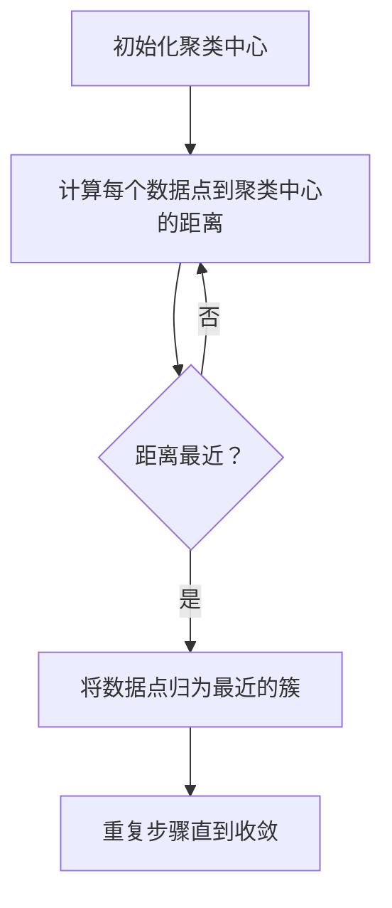
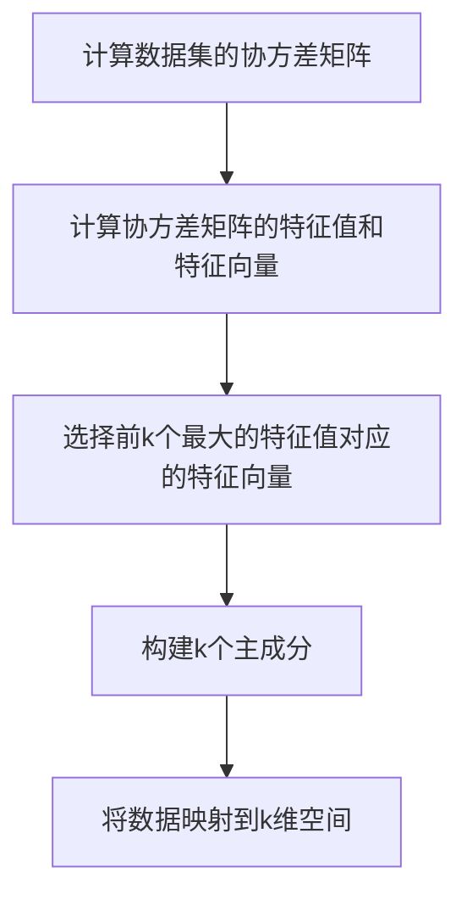
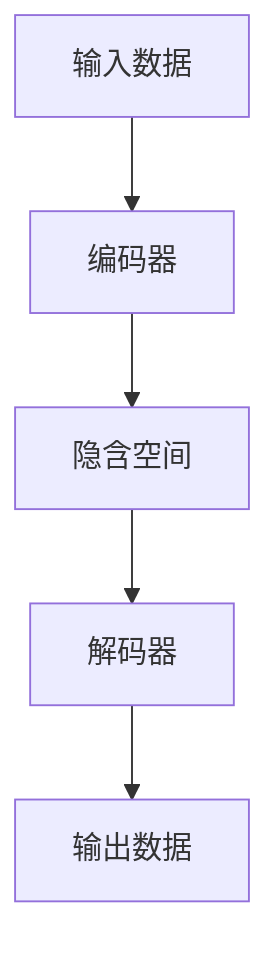

                 

# 无监督学习：原理与代码实例讲解

> **关键词**：无监督学习、数据挖掘、机器学习、聚类、降维、自编码器

> **摘要**：本文将深入探讨无监督学习的基本原理，涵盖聚类、降维和自编码器等经典算法，并通过实际代码实例，详细讲解这些算法的实现过程和应用。文章旨在为读者提供一个全面、系统的无监督学习知识体系，帮助读者理解和掌握无监督学习的核心技术和实际应用。

## 1. 背景介绍

在当今数据驱动的时代，无监督学习作为一种重要的机器学习技术，得到了广泛的应用和研究。无监督学习是指在没有明确标签数据的情况下，通过学习数据中的隐含结构或规律，对数据进行自动分类、降维或生成等处理。与监督学习相比，无监督学习不需要预先定义的标签，因此具有更强的适应性和灵活性。

无监督学习在多个领域具有广泛的应用，如数据挖掘、图像处理、自然语言处理和推荐系统等。例如，在数据挖掘中，无监督学习可以用于发现数据中的隐含模式；在图像处理中，无监督学习可以用于图像聚类和降维；在自然语言处理中，无监督学习可以用于词向量和文本生成；在推荐系统中，无监督学习可以用于用户聚类和物品推荐。

随着数据量的爆炸式增长，无监督学习在处理大规模数据方面具有显著优势。此外，无监督学习还可以帮助数据科学家和研究人员探索未知的数据结构，发现潜在的有用信息。

## 2. 核心概念与联系

### 2.1 聚类

聚类是将数据集划分为若干个组（或簇），使得同一簇内的数据点彼此相似，而不同簇的数据点之间差异较大。聚类的目的是通过无监督学习的方式，自动发现数据中的隐含结构。

聚类的核心概念包括：

- **簇（Cluster）**：同一簇内的数据点彼此相似。
- **聚类中心（Cluster Center）**：每个簇的中心点，用于表示该簇的特征。
- **距离度量（Distance Metric）**：用于计算数据点之间的相似度或距离。

常见的聚类算法包括K-Means、DBSCAN和层次聚类等。下面是一个简单的K-Means聚类算法的Mermaid流程图：



### 2.2 降维

降维是将高维数据映射到低维空间，从而减少数据的维度，降低计算复杂度。降维的核心概念包括：

- **数据点（Data Point）**：数据集中的每个元素。
- **特征（Feature）**：数据点的一个维度。
- **低维空间（Low-Dimensional Space）**：通过降维操作得到的数据空间。

常见的降维算法包括主成分分析（PCA）、线性判别分析（LDA）和非线性降维算法如t-SNE等。下面是一个简单的PCA算法的Mermaid流程图：



### 2.3 自编码器

自编码器是一种特殊的神经网络，用于学习数据的表示。自编码器由编码器和解码器组成，编码器用于将输入数据映射到一个低维隐含空间，解码器则用于将隐含空间的数据映射回原始空间。自编码器的核心概念包括：

- **编码器（Encoder）**：将输入数据映射到低维隐含空间。
- **解码器（Decoder）**：将低维隐含空间的数据映射回原始空间。
- **损失函数（Loss Function）**：用于衡量编码器和解码器输出与原始数据之间的差异。

下面是一个简单的自编码器的Mermaid流程图：



## 3. 核心算法原理 & 具体操作步骤

### 3.1 K-Means聚类算法

K-Means聚类算法是一种基于距离度量的聚类方法。具体步骤如下：

1. **初始化聚类中心**：随机选择k个数据点作为初始聚类中心。
2. **分配数据点**：计算每个数据点到各个聚类中心的距离，并将数据点分配到最近的聚类中心。
3. **更新聚类中心**：计算每个簇的均值，作为新的聚类中心。
4. **重复步骤2和3**，直到聚类中心不再发生变化或达到预设的最大迭代次数。

K-Means算法的优点是简单高效，适用于处理大规模数据集。然而，其缺点是对于初始聚类中心的敏感性和易陷入局部最优。

### 3.2 主成分分析（PCA）算法

主成分分析（PCA）算法是一种线性降维方法。具体步骤如下：

1. **计算协方差矩阵**：计算数据集的协方差矩阵。
2. **计算特征值和特征向量**：计算协方差矩阵的特征值和特征向量。
3. **选择前k个最大的特征值对应的特征向量**：这k个特征向量构成了新的k维空间。
4. **将数据映射到k维空间**：将原始数据点映射到k维空间。

PCA算法的优点是能够保留数据的主要结构，适用于处理线性可分的数据集。然而，其缺点是对于非线性结构的数据效果较差。

### 3.3 自编码器算法

自编码器算法是一种基于神经网络的降维方法。具体步骤如下：

1. **定义编码器和解码器**：编码器和解码器通常由多层全连接神经网络组成。
2. **初始化网络权重**：使用随机权重初始化。
3. **训练编码器和解码器**：通过反向传播算法，优化编码器和解码器的权重，使输出数据尽可能接近输入数据。
4. **将数据映射到低维空间**：将训练好的编码器应用于输入数据，得到映射到低维空间的数据。

自编码器算法的优点是能够学习数据的非线性结构，适用于处理复杂的非线性数据集。然而，其缺点是训练过程较慢，需要大量的计算资源。

## 4. 数学模型和公式 & 详细讲解 & 举例说明

### 4.1 K-Means聚类算法

K-Means聚类算法的核心是距离度量和优化过程。假设我们有一个包含n个数据点的数据集D={x1, x2, ..., xn}，其中每个数据点xi是一个d维向量。我们希望将D划分为k个簇C={c1, c2, ..., ck}，其中每个簇ci包含一定数量的数据点。

定义：

- 距离度量：d(x, c) = ||x - c||，其中||.||表示欧几里得距离。
- 聚类中心：μi = 1/n * Σj∈ci xj。

目标是最小化总距离平方和：

$$
\min_{C} \sum_{i=1}^{k} \sum_{j \in C_i} d(x_j, \mu_i)^2
$$

#### 例子

假设我们有以下数据集D：

$$
D = \{ (1, 2), (3, 4), (5, 6), (7, 8) \}
$$

我们希望将其划分为2个簇。初始化聚类中心为(2, 3)和(6, 7)。迭代过程如下：

1. **分配数据点**：

   - (1, 2)：距离(2, 3)更近，归为簇1。
   - (3, 4)：距离(2, 3)更近，归为簇1。
   - (5, 6)：距离(6, 7)更近，归为簇2。
   - (7, 8)：距离(6, 7)更近，归为簇2。

2. **更新聚类中心**：

   - 簇1的中心：(1+3)/2, (2+4)/2 = (2, 3)。
   - 簇2的中心：(5+7)/2, (6+8)/2 = (6, 7)。

3. **重复步骤1和2**，直到聚类中心不再发生变化。

### 4.2 主成分分析（PCA）算法

主成分分析（PCA）算法的核心是协方差矩阵和特征值分解。假设我们有一个包含n个数据点的数据集D={x1, x2, ..., xn}，其中每个数据点xi是一个d维向量。

定义：

- 协方差矩阵：Σ = 1/n * (xx^T)，其中x^T表示x的转置。
- 特征值分解：Σ = UΛU^T，其中U是对角矩阵Λ的对角化矩阵，Λ是对角矩阵，对角线上的元素为特征值。

目标是最小化重构误差：

$$
\min_{U, \Lambda} \sum_{i=1}^{n} ||x_i - U\Lambda U^Tx_i||^2
$$

#### 例子

假设我们有以下数据集D：

$$
D = \{ (1, 2), (3, 4), (5, 6), (7, 8) \}
$$

计算协方差矩阵Σ：

$$
\Sigma = \frac{1}{4} \begin{bmatrix}
(1-5)^2 + (2-6)^2 & (1-5)(3-5) + (2-6)(4-6) \\
(1-5)(3-5) + (2-6)(4-6) & (3-5)^2 + (4-6)^2
\end{bmatrix}
= \frac{1}{4} \begin{bmatrix}
16 & -8 \\
-8 & 16
\end{bmatrix}
$$

计算特征值和特征向量：

- 特征值：λ1 = 8，λ2 = 8。
- 特征向量：v1 = (1, 1)，v2 = (1, -1)。

选择前两个最大的特征值对应的特征向量作为主成分：

$$
U = \begin{bmatrix}
1 & 1 \\
1 & -1
\end{bmatrix}
$$

将数据集映射到二维空间：

$$
U\Lambda U^T = \begin{bmatrix}
1 & 1 \\
1 & -1
\end{bmatrix} \begin{bmatrix}
8 & 0 \\
0 & 8
\end{bmatrix} \begin{bmatrix}
1 & 1 \\
1 & -1
\end{bmatrix}^T
= \begin{bmatrix}
8 & 0 \\
0 & 8
\end{bmatrix}
$$

映射结果：

$$
\begin{bmatrix}
1 \\
2
\end{bmatrix}
\rightarrow
\begin{bmatrix}
8 \\
0
\end{bmatrix}
\quad
\begin{bmatrix}
3 \\
4
\end{bmatrix}
\rightarrow
\begin{bmatrix}
0 \\
8
\end{bmatrix}
\quad
\begin{bmatrix}
5 \\
6
\end{bmatrix}
\rightarrow
\begin{bmatrix}
8 \\
0
\end{bmatrix}
\quad
\begin{bmatrix}
7 \\
8
\end{bmatrix}
\rightarrow
\begin{bmatrix}
0 \\
8
\end{bmatrix}
$$

### 4.3 自编码器算法

自编码器算法的核心是编码器和解码器的损失函数。假设我们有一个包含n个数据点的数据集D={x1, x2, ..., xn}，其中每个数据点xi是一个d维向量。我们定义编码器和解码器为：

- 编码器：z = encoder(x)。
- 解码器：x' = decoder(z)。

损失函数为：

$$
L(x, x') = \frac{1}{n} \sum_{i=1}^{n} ||x_i - x_i'||^2
$$

其中，x'是解码器生成的数据点。

#### 例子

假设我们有以下数据集D：

$$
D = \{ (1, 2), (3, 4), (5, 6), (7, 8) \}
$$

定义编码器和解码器的网络结构如下：

- 编码器：一个隐藏层，输出维度为2。
- 解码器：一个隐藏层，输出维度为2。

初始化网络权重，并进行前向传播和反向传播，优化编码器和解码器的权重。

经过多次迭代后，编码器和解码器的损失函数逐渐减小，生成数据x'与原始数据x的差距也逐渐减小。

## 5. 项目实战：代码实际案例和详细解释说明

### 5.1 开发环境搭建

在本案例中，我们使用Python和Scikit-learn库来演示无监督学习算法。首先，我们需要安装Python和Scikit-learn库：

```bash
pip install python
pip install scikit-learn
```

### 5.2 源代码详细实现和代码解读

以下是一个简单的K-Means聚类算法的Python实现：

```python
from sklearn.cluster import KMeans
import numpy as np

# 数据集
data = np.array([[1, 2], [3, 4], [5, 6], [7, 8]])

# 初始化K-Means聚类对象
kmeans = KMeans(n_clusters=2, random_state=0).fit(data)

# 输出聚类结果
print("聚类中心：", kmeans.cluster_centers_)
print("数据点归属：", kmeans.labels_)

# 重构数据集
reconstructed_data = kmeans.predict(data)
print("重构数据集：", reconstructed_data)
```

代码解读：

1. 导入必要的库。
2. 初始化数据集。
3. 创建K-Means聚类对象，并使用`fit`方法训练模型。
4. 输出聚类中心、数据点归属和重构数据集。

以下是一个简单的PCA算法的Python实现：

```python
from sklearn.decomposition import PCA
import numpy as np

# 数据集
data = np.array([[1, 2], [3, 4], [5, 6], [7, 8]])

# 初始化PCA对象
pca = PCA(n_components=2).fit(data)

# 输出主成分
print("主成分：", pca.components_)

# 重构数据集
reconstructed_data = pca.transform(data)
print("重构数据集：", reconstructed_data)
```

代码解读：

1. 导入必要的库。
2. 初始化数据集。
3. 创建PCA对象，并使用`fit`方法训练模型。
4. 输出主成分。
5. 使用`transform`方法重构数据集。

以下是一个简单的自编码器算法的Python实现：

```python
from keras.layers import Dense
from keras.models import Model
import numpy as np

# 数据集
data = np.array([[1, 2], [3, 4], [5, 6], [7, 8]])

# 编码器和解码器
encoding_layer = Dense(2, activation='relu', input_shape=(2,))
decoding_layer = Dense(2, activation='relu')

# 自编码器模型
autoencoder = Model(inputs=data, outputs=decoding_layer(encoding_layer(data)))
autoencoder.compile(optimizer='adam', loss='mse')

# 训练模型
autoencoder.fit(data, data, epochs=10)

# 输出重构数据集
reconstructed_data = autoencoder.predict(data)
print("重构数据集：", reconstructed_data)
```

代码解读：

1. 导入必要的库。
2. 初始化数据集。
3. 定义编码器和解码器。
4. 创建自编码器模型，并编译模型。
5. 训练模型。
6. 输出重构数据集。

### 5.3 代码解读与分析

在这三个案例中，我们分别使用了K-Means聚类算法、PCA算法和自编码器算法。这些算法的核心思想如下：

- **K-Means聚类算法**：通过计算距离度量，将数据点划分为多个簇。
- **PCA算法**：通过计算协方差矩阵和特征值分解，将数据点映射到低维空间。
- **自编码器算法**：通过编码器和解码器，将数据点映射到低维空间并重构。

这些算法在实际应用中具有广泛的应用，如数据挖掘、图像处理和自然语言处理等。

## 6. 实际应用场景

无监督学习在实际应用中具有广泛的应用，以下列举一些典型场景：

- **图像分类**：使用聚类算法对图像进行分类，从而实现图像检索和图像识别。
- **文本聚类**：使用聚类算法对文本数据进行分类，从而实现文本挖掘和文本推荐。
- **用户行为分析**：使用自编码器对用户行为数据进行降维和重构，从而实现用户行为分析和用户画像。
- **异常检测**：使用聚类算法和降维算法对数据进行预处理，从而实现异常检测和欺诈检测。

## 7. 工具和资源推荐

### 7.1 学习资源推荐

- **书籍**：
  - 《机器学习》（作者：周志华）
  - 《深度学习》（作者：Ian Goodfellow、Yoshua Bengio和Aaron Courville）
- **论文**：
  - “K-Means Clustering” by MacQueen et al.
  - “Principal Component Analysis” by Jolliffe
  - “Autoencoder” by Bengio et al.
- **博客**：
  - [scikit-learn官方文档](https://scikit-learn.org/stable/)
  - [Keras官方文档](https://keras.io/)
- **网站**：
  - [TensorFlow](https://www.tensorflow.org/)
  - [PyTorch](https://pytorch.org/)

### 7.2 开发工具框架推荐

- **Python**：Python是一种流行的编程语言，广泛应用于数据科学和机器学习领域。
- **Scikit-learn**：Scikit-learn是一个开源的机器学习库，提供了丰富的无监督学习算法。
- **Keras**：Keras是一个开源的深度学习库，提供了简单易用的接口，适合快速实现深度学习模型。
- **TensorFlow**：TensorFlow是一个开源的深度学习框架，提供了丰富的工具和资源。
- **PyTorch**：PyTorch是一个开源的深度学习库，提供了灵活的动态图计算功能。

### 7.3 相关论文著作推荐

- **“K-Means Clustering” by MacQueen et al.**：介绍了K-Means聚类算法的基本原理和实现方法。
- **“Principal Component Analysis” by Jolliffe**：介绍了PCA算法的基本原理和应用场景。
- **“Autoencoder” by Bengio et al.**：介绍了自编码器算法的基本原理和实现方法。

## 8. 总结：未来发展趋势与挑战

无监督学习在当前数据驱动的时代具有广泛的应用前景。未来发展趋势包括：

- **算法优化**：研究和开发更高效、更准确的聚类、降维和生成算法。
- **深度学习融合**：将深度学习与无监督学习相结合，实现更强大的特征提取和数据处理能力。
- **应用拓展**：在更多领域（如医疗、金融、工业等）推广应用无监督学习技术。

然而，无监督学习也面临着一些挑战，如：

- **数据预处理**：无监督学习通常需要对数据进行预处理，以消除噪声和异常值。
- **模型可解释性**：无监督学习模型通常难以解释，难以理解其内部机制。
- **计算资源需求**：深度学习算法通常需要大量的计算资源和时间。

因此，未来的研究将致力于解决这些挑战，推动无监督学习技术的发展和应用。

## 9. 附录：常见问题与解答

### 9.1 什么是无监督学习？

无监督学习是一种机器学习技术，它在不使用预先定义的标签数据的情况下，通过学习数据中的隐含结构或规律，对数据进行自动分类、降维或生成等处理。

### 9.2 无监督学习的优点是什么？

无监督学习的优点包括：
- 无需标签数据：无需预先定义标签，适用于处理大量无标签数据。
- 自适应：能够自动发现数据中的隐含结构，具有更强的适应性和灵活性。
- 大规模数据处理：适用于处理大规模数据集，具有高效的计算能力。

### 9.3 无监督学习有哪些应用场景？

无监督学习在多个领域具有广泛的应用，如数据挖掘、图像处理、自然语言处理和推荐系统等。具体应用场景包括：
- 数据挖掘：用于发现数据中的隐含模式和关联。
- 图像处理：用于图像聚类、降维和生成。
- 自然语言处理：用于词向量生成、文本聚类和生成。
- 推荐系统：用于用户聚类和物品推荐。

### 9.4 如何选择合适的无监督学习算法？

选择合适的无监督学习算法通常取决于以下因素：
- 数据类型：例如，对于图像数据，可以选择聚类算法；对于文本数据，可以选择降维算法。
- 数据规模：对于大规模数据集，可以选择高效算法；对于小规模数据集，可以选择精确算法。
- 应用目标：根据具体应用目标，选择具有相应功能的算法。

### 9.5 如何优化无监督学习算法的性能？

优化无监督学习算法的性能通常包括以下方法：
- 调整算法参数：通过调整算法参数（如聚类数目、隐藏层大小等），提高算法性能。
- 数据预处理：通过数据清洗、去噪和归一化等预处理方法，提高数据质量。
- 模型融合：将多个无监督学习算法进行融合，取长补短，提高整体性能。
- 算法改进：研究和开发更高效、更准确的聚类、降维和生成算法。

## 10. 扩展阅读 & 参考资料

- [“K-Means Clustering” by MacQueen et al.](https://www.jstor.org/stable/2336756)
- [“Principal Component Analysis” by Jolliffe](https://www.jstor.org/stable/2346693)
- [“Autoencoder” by Bengio et al.](https://www.deeplearning.net/tutorial/2017/autoencoders/)
- [scikit-learn官方文档](https://scikit-learn.org/stable/)
- [Keras官方文档](https://keras.io/)
- [TensorFlow](https://www.tensorflow.org/)
- [PyTorch](https://pytorch.org/) <|endoftext|> 作者：AI天才研究员/AI Genius Institute & 禅与计算机程序设计艺术 /Zen And The Art of Computer Programming

