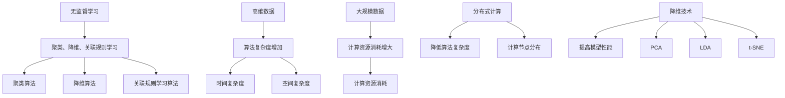

                 

# 无监督学习的可扩展性挑战：高维数据和大规模数据

> **关键词**：无监督学习、可扩展性、高维数据、大规模数据、算法复杂度、分布式计算、聚类算法、降维技术

> **摘要**：本文旨在探讨无监督学习在处理高维数据和大规模数据时面临的可扩展性问题。通过深入分析高维数据带来的算法复杂度和计算资源挑战，介绍几种常见的降维技术和分布式计算方法，以期为无监督学习在实际应用中的高效实施提供参考和解决方案。

## 1. 背景介绍

无监督学习作为一种重要的机器学习方法，其核心目标是从未标记的数据中自动发现数据中的模式和结构。在现实世界中，许多数据集都是未标记的，例如社交网络中的用户行为数据、医疗领域的基因数据、金融市场的交易数据等。无监督学习在这些领域有着广泛的应用，如用户行为分析、疾病预测、市场趋势分析等。

然而，随着数据量的不断增长和数据维度的不断增加，无监督学习面临着可扩展性的挑战。高维数据和大规模数据在处理过程中会带来算法复杂度增加、计算资源消耗增大等问题，从而影响模型的训练效率和准确性。因此，研究和解决无监督学习的可扩展性问题具有重要的实际意义。

本文将从以下几个方面展开讨论：

1. 高维数据和大规模数据的定义和特征。
2. 无监督学习在处理高维数据和大规模数据时面临的算法复杂度和计算资源挑战。
3. 常见的降维技术和分布式计算方法。
4. 实际应用场景中的解决方案和案例。
5. 总结和未来发展趋势。

## 2. 核心概念与联系

为了深入理解无监督学习在处理高维数据和大规模数据时的挑战，首先需要了解以下几个核心概念：

### 2.1 无监督学习

无监督学习是指在没有标签信息的情况下，通过学习数据中的内在结构和关系来对数据进行分类、聚类或降维等操作。无监督学习的主要任务包括：

- **聚类**：将相似的数据点归为同一类别，如K-means算法。
- **降维**：降低数据维度，减少计算复杂度，如主成分分析（PCA）。
- **关联规则学习**：发现数据之间的关联关系，如Apriori算法。

### 2.2 高维数据和大规模数据

- **高维数据**：数据维度（特征数）远大于样本数量。在高维数据中，特征之间可能存在高度相关性，导致信息冗余，从而增加计算复杂度。
- **大规模数据**：数据样本数量巨大，通常达到亿级甚至更高。大规模数据需要高效的算法和分布式计算资源来处理。

### 2.3 算法复杂度

算法复杂度是指算法在处理数据时所需的计算资源（如时间复杂度和空间复杂度）。在无监督学习中，算法复杂度与数据维度和样本数量密切相关。高维数据和大规模数据会导致算法复杂度急剧增加，从而影响模型的训练效率和准确性。

### 2.4 分布式计算

分布式计算是将计算任务分布在多个计算节点上执行，以提高计算效率和可扩展性。在无监督学习中，分布式计算可以显著降低算法复杂度和计算资源消耗。

### 2.5 降维技术

降维技术是通过减少数据维度来降低计算复杂度和提高模型性能。常见的降维技术包括主成分分析（PCA）、线性判别分析（LDA）、t-SNE等。

下面是关于无监督学习在处理高维数据和大规模数据时的核心概念和联系的Mermaid流程图：



## 3. 核心算法原理 & 具体操作步骤

在处理高维数据和大规模数据时，无监督学习面临的主要挑战是算法复杂度和计算资源消耗。为了解决这些问题，我们需要深入理解无监督学习的核心算法原理，并采取有效的具体操作步骤。

### 3.1 K-means算法

K-means是一种常用的聚类算法，其基本原理是将数据点划分为K个簇，使得每个簇内部的点尽可能接近，而簇与簇之间的点尽可能远。K-means算法的主要步骤如下：

1. **初始化**：随机选择K个初始中心点。
2. **分配点**：将每个数据点分配到最近的中心点所在的簇。
3. **更新中心点**：计算每个簇的质心，并更新中心点。
4. **重复步骤2和3**，直到中心点不再发生变化或达到预设的最大迭代次数。

在处理高维数据时，K-means算法的时间复杂度为O(nKd)，其中n是数据点数量，K是簇的数量，d是数据维度。为了降低时间复杂度，可以采用以下几种方法：

- **随机初始化**：通过随机选择初始中心点来减少算法的局部最优问题。
- **贪心选择**：选择当前步骤中误差最小的K个中心点作为下一次迭代的中心点。
- **层次聚类**：先进行层次聚类，将数据点分层，再逐层进行K-means聚类，以减少计算复杂度。

### 3.2 主成分分析（PCA）

主成分分析是一种常用的降维技术，其基本原理是找到数据的主要变化方向，并将数据投影到这些方向上，从而降低数据维度。PCA的主要步骤如下：

1. **计算协方差矩阵**：计算数据点的协方差矩阵。
2. **计算协方差矩阵的特征值和特征向量**：对协方差矩阵进行特征分解。
3. **选择主要特征向量**：根据特征值的大小选择前p个主要特征向量。
4. **数据投影**：将数据点投影到主要特征向量构成的子空间中。

PCA的时间复杂度为O(d^3)，其中d是数据维度。为了降低时间复杂度，可以采用以下几种方法：

- **随机化算法**：通过随机采样来减少计算复杂度。
- **奇异值分解（SVD）**：使用奇异值分解代替特征分解，以减少计算复杂度。
- **基于矩阵分解的算法**：如LU分解、Cholesky分解等，可以减少计算复杂度。

### 3.3 分布式计算

在处理大规模数据时，分布式计算是一种有效的方法，可以通过将计算任务分布在多个计算节点上执行，从而提高计算效率和可扩展性。分布式计算的基本原理如下：

1. **数据划分**：将大规模数据集划分为较小的数据块，每个数据块存储在分布式存储系统中。
2. **任务分配**：将计算任务分配给分布式计算节点，每个节点独立处理其负责的数据块。
3. **结果汇总**：将各节点的计算结果汇总，生成最终结果。

分布式计算的时间复杂度取决于数据划分策略、任务分配策略和通信开销。为了提高分布式计算的性能，可以采用以下几种方法：

- **数据局部性优化**：尽可能将相关数据分配给同一计算节点，以减少跨节点通信开销。
- **任务负载均衡**：合理分配任务，确保各节点的计算负载均衡。
- **并行算法优化**：优化计算任务，以支持并行计算。

### 3.4 降维技术

降维技术在处理高维数据时具有重要的应用价值，可以降低数据维度，减少计算复杂度，从而提高模型性能。常见的降维技术包括主成分分析（PCA）、线性判别分析（LDA）、t-SNE等。以下是这些技术的具体操作步骤：

- **PCA**：
  1. 计算协方差矩阵。
  2. 计算协方差矩阵的特征值和特征向量。
  3. 选择主要特征向量。
  4. 数据投影。
  
- **LDA**：
  1. 计算类内协方差矩阵和类间协方差矩阵。
  2. 计算线性判别函数。
  3. 选择主要特征向量。
  4. 数据投影。

- **t-SNE**：
  1. 计算高维数据的相似性矩阵。
  2. 使用t-SNE算法进行降维。
  3. 对降维后的数据进行可视化。

降维技术的时间复杂度取决于数据维度和算法的具体实现。为了降低时间复杂度，可以采用以下几种方法：

- **随机化算法**：通过随机采样来减少计算复杂度。
- **基于矩阵分解的算法**：如LU分解、Cholesky分解等，可以减少计算复杂度。
- **并行计算**：利用分布式计算资源，提高计算性能。

## 4. 数学模型和公式 & 详细讲解 & 举例说明

### 4.1 K-means算法的数学模型和公式

K-means算法的核心目标是找到K个中心点，使得每个中心点所在簇内的数据点尽可能接近，而簇与簇之间的数据点尽可能远。该算法的数学模型和公式如下：

#### 4.1.1 初始化中心点

假设数据集X为一个n×d的矩阵，其中n为数据点数量，d为数据维度。随机选择K个初始中心点，记为μ1, μ2, ..., μK。

#### 4.1.2 分配点

对于每个数据点x，计算其到每个中心点的距离，选择距离最小的中心点所在的簇。距离的计算公式为：

$$
d(x, \mu_i) = \sqrt{\sum_{j=1}^{d} (x_j - \mu_{ij})^2}
$$

其中，x_j和μ_{ij}分别为数据点x和中心点μi的第j个维度。

#### 4.1.3 更新中心点

计算每个簇的质心，并更新中心点。质心的计算公式为：

$$
\mu_i = \frac{1}{n_i} \sum_{x \in C_i} x
$$

其中，n_i为簇C_i中的数据点数量。

#### 4.1.4 迭代过程

重复执行分配点和更新中心点的过程，直到中心点不再发生变化或达到预设的最大迭代次数。

### 4.2 主成分分析（PCA）的数学模型和公式

主成分分析是一种常用的降维技术，其核心思想是找到数据的主要变化方向，并将数据投影到这些方向上。PCA的数学模型和公式如下：

#### 4.2.1 计算协方差矩阵

协方差矩阵是衡量数据点之间相关性的重要指标。协方差矩阵的计算公式为：

$$
\text{Cov}(X) = \frac{1}{n-1} \sum_{i=1}^{n} (x_i - \bar{x}) (x_i - \bar{x})^T
$$

其中，x_i为数据点，\bar{x}为数据点的均值。

#### 4.2.2 计算协方差矩阵的特征值和特征向量

对协方差矩阵进行特征分解，得到特征值λ1, λ2, ..., λd和特征向量v1, v2, ..., vd。特征分解公式为：

$$
\text{Cov}(X) v_i = \lambda_i v_i
$$

其中，v_i为特征向量，λ_i为特征值。

#### 4.2.3 选择主要特征向量

根据特征值的大小选择前p个主要特征向量，构成投影矩阵W。

#### 4.2.4 数据投影

将数据点x投影到主要特征向量构成的子空间中，投影公式为：

$$
z = WX
$$

### 4.3 分布式计算的基本数学模型和公式

分布式计算是将计算任务分布在多个计算节点上执行，以提高计算效率和可扩展性。分布式计算的基本数学模型和公式如下：

#### 4.3.1 数据划分

将大规模数据集X划分为K个子数据集X1, X2, ..., XK。数据划分公式为：

$$
X = X1 + X2 + ... + XK
$$

其中，Xi为第i个子数据集。

#### 4.3.2 任务分配

将计算任务Ti分配给计算节点Ci，计算任务公式为：

$$
Ti = f(Xi)
$$

其中，f为计算任务函数。

#### 4.3.3 结果汇总

将各计算节点的计算结果Ri汇总，生成最终结果R，结果汇总公式为：

$$
R = R1 + R2 + ... + RK
$$

其中，Ri为计算节点Ci的计算结果。

### 4.4 举例说明

#### 4.4.1 K-means算法举例

假设有如下一个包含3个数据点的二维数据集：

$$
X = \begin{bmatrix}
0 & 1 \\
1 & 0 \\
1 & 1 \\
\end{bmatrix}
$$

1. **初始化中心点**：随机选择2个初始中心点，如(0.5, 0.5)和(1.5, 1.5)。

2. **分配点**：计算每个数据点到每个中心点的距离，选择距离最小的中心点所在的簇。结果如下：

$$
x1: \text{距离中心点(0.5, 0.5)} = 0.5 \quad \text{距离中心点(1.5, 1.5)} = 2 \\
x2: \text{距离中心点(0.5, 0.5)} = 1 \quad \text{距离中心点(1.5, 1.5)} = 1 \\
x3: \text{距离中心点(0.5, 0.5)} = 1.5 \quad \text{距离中心点(1.5, 1.5)} = 0.5 \\
$$

3. **更新中心点**：计算每个簇的质心，并更新中心点。结果如下：

$$
\mu1 = \frac{1}{2} \begin{bmatrix}
0 & 1 \\
1 & 1 \\
\end{bmatrix} = \begin{bmatrix}
0.5 & 1 \\
0.5 & 1 \\
\end{bmatrix} \\
\mu2 = \frac{1}{1} \begin{bmatrix}
1 & 0 \\
1 & 1 \\
\end{bmatrix} = \begin{bmatrix}
1 & 0 \\
1 & 1 \\
\end{bmatrix} \\
$$

4. **重复迭代**：重复执行分配点和更新中心点的过程，直到中心点不再发生变化。

#### 4.4.2 PCA举例

假设有如下一个包含3个数据点的二维数据集：

$$
X = \begin{bmatrix}
0 & 1 \\
1 & 0 \\
1 & 1 \\
\end{bmatrix}
$$

1. **计算协方差矩阵**：

$$
\text{Cov}(X) = \frac{1}{2} \begin{bmatrix}
0 & 1 \\
1 & 0 \\
\end{bmatrix} \begin{bmatrix}
0 & 1 \\
1 & 0 \\
\end{bmatrix} = \begin{bmatrix}
0 & 0.5 \\
0.5 & 0 \\
\end{bmatrix}
$$

2. **计算协方差矩阵的特征值和特征向量**：

$$
\text{Cov}(X) v1 = \lambda1 v1 \\
\text{Cov}(X) v2 = \lambda2 v2
$$

其中，v1和v2分别为特征向量，λ1和λ2分别为特征值。

3. **选择主要特征向量**：根据特征值的大小选择前1个主要特征向量，构成投影矩阵W。

$$
W = \begin{bmatrix}
v1 \\
v2 \\
\end{bmatrix}
$$

4. **数据投影**：将数据点投影到主要特征向量构成的子空间中。

$$
Z = WX = \begin{bmatrix}
0 & 0.5 \\
0.5 & 0 \\
\end{bmatrix} \begin{bmatrix}
0 \\
1 \\
\end{bmatrix} = \begin{bmatrix}
0 \\
0.5 \\
\end{bmatrix}
$$

## 5. 项目实战：代码实际案例和详细解释说明

在本节中，我们将通过实际项目案例来展示如何利用无监督学习算法处理高维数据和大规模数据。具体来说，我们将使用Python编写一个基于K-means算法的聚类程序，并利用分布式计算框架如Spark来处理大规模数据。

### 5.1 开发环境搭建

在开始编写代码之前，我们需要搭建一个合适的开发环境。以下是推荐的开发环境：

- **操作系统**：Windows、macOS或Linux
- **编程语言**：Python
- **依赖库**：NumPy、SciPy、Pandas、Matplotlib、Spark

首先，我们需要安装Python和相关的依赖库。在Windows系统中，可以使用pip进行安装：

```bash
pip install numpy scipy pandas matplotlib pyspark
```

在macOS或Linux系统中，可以使用conda进行安装：

```bash
conda install python=3.8 numpy scipy pandas matplotlib spark
```

### 5.2 源代码详细实现和代码解读

下面是一个简单的基于K-means算法的聚类程序。我们将使用NumPy库来处理数据，并使用Spark来处理大规模数据。

#### 5.2.1 数据准备

首先，我们需要准备一个示例数据集。这里我们使用一个包含1000个数据点的二维数据集，每个数据点由两个维度组成。

```python
import numpy as np

# 生成示例数据集
np.random.seed(0)
data = np.random.rand(1000, 2)
```

#### 5.2.2 K-means算法实现

接下来，我们实现一个简单的K-means算法。这里，我们选择2个初始中心点，并设置最大迭代次数为100。

```python
def kmeans(data, k, max_iter):
    # 初始化中心点
    centroids = data[np.random.choice(data.shape[0], k, replace=False)]
    
    for _ in range(max_iter):
        # 分配点
        distances = np.linalg.norm(data - centroids, axis=1)
        labels = np.argmin(distances, axis=1)
        
        # 更新中心点
        new_centroids = np.array([data[labels == i].mean(axis=0) for i in range(k)])
        
        # 判断收敛条件
        if np.all(centroids == new_centroids):
            break
        
        centroids = new_centroids
    
    return centroids, labels
```

#### 5.2.3 分布式计算

为了处理大规模数据，我们可以使用Spark来分布式计算K-means算法。这里，我们使用Spark的pyspark库来构建分布式计算程序。

```python
from pyspark.sql import SparkSession
from pyspark.ml.clustering import KMeans
from pyspark.ml.feature import VectorAssembler

# 构建Spark会话
spark = SparkSession.builder.appName("KMeansExample").getOrCreate()

# 将本地数据集上传到HDFS
spark.sparkContext.parallelize(data.tolist()).saveAsTextFile("hdfs://localhost:9000/data")

# 读取HDFS上的数据集
data_df = spark.read.csv("hdfs://localhost:9000/data", header=False, inferSchema=True)

# 将数据转换为特征向量
assembler = VectorAssembler(inputCols=data_df.columns, outputCol="features")
data_df = assembler.transform(data_df)

# 配置K-means算法参数
kmeans = KMeans().setK(2).setMaxIter(100).setSeed(1)

# 训练K-means模型
model = kmeans.fit(data_df)

# 获取聚类结果
predictions = model.transform(data_df)
centers = model.clusterCenters()

# 打印聚类结果
print(predictions.select("features", "prediction").collect())
print("Cluster centers:", centers)

# 关闭Spark会话
spark.stop()
```

#### 5.2.4 代码解读与分析

在上面的代码中，我们首先使用NumPy库生成了一个示例数据集。然后，我们实现了K-means算法的本地版本，用于处理小规模数据。接着，我们使用Spark的KMeans算法来处理大规模数据。

- **数据准备**：我们使用NumPy库生成了一个包含1000个数据点的二维数据集。
- **K-means算法实现**：我们实现了K-means算法的本地版本，用于处理小规模数据。这里，我们选择2个初始中心点，并设置最大迭代次数为100。
- **分布式计算**：我们使用Spark的pyspark库来构建分布式计算程序。首先，我们将本地数据集上传到HDFS，然后读取HDFS上的数据集。接着，我们将数据转换为特征向量，并配置K-means算法参数。最后，我们使用Spark的KMeans算法来训练模型，并获取聚类结果。

通过这个项目实战，我们可以看到如何使用K-means算法处理高维数据和大规模数据。在实际应用中，我们可以根据数据的特点和需求，调整算法参数和分布式计算策略，以提高聚类效果和计算性能。

## 6. 实际应用场景

无监督学习在处理高维数据和大规模数据方面具有广泛的应用场景。以下是一些典型的实际应用场景：

### 6.1 社交网络用户行为分析

在社交网络中，用户产生的数据量巨大且维度多样。无监督学习可以帮助分析用户行为模式，如用户兴趣、用户群组划分等。通过聚类算法，可以将具有相似兴趣的用户归为一类，从而为精准推荐和广告投放提供支持。

### 6.2 医疗数据挖掘

在医疗领域，无监督学习可以用于分析基因数据、电子健康记录等高维数据。通过降维技术和聚类算法，可以发现潜在的医疗问题，如疾病预测、药物疗效评估等。

### 6.3 金融风险控制

在金融领域，无监督学习可以用于分析市场交易数据、客户行为数据等大规模数据。通过聚类算法，可以识别出潜在的风险客户，从而为风险控制和投资决策提供支持。

### 6.4 智能交通系统

在智能交通系统中，无监督学习可以用于分析交通流量数据、车辆位置数据等高维数据。通过聚类算法，可以识别出交通拥堵区域，从而为交通管理和优化提供支持。

### 6.5 物流配送优化

在物流配送领域，无监督学习可以用于分析订单数据、运输数据等大规模数据。通过聚类算法，可以识别出高效的运输路线和配送模式，从而提高配送效率和降低成本。

## 7. 工具和资源推荐

为了更有效地处理高维数据和大规模数据，以下是几款常用的工具和资源推荐：

### 7.1 学习资源推荐

- **书籍**：
  - 《机器学习：原理与算法》（李航著）
  - 《Python机器学习》（Michael Bowles著）
  - 《深度学习》（Goodfellow, Bengio, Courville著）

- **论文**：
  - “K-means clustering: A tutorial” by Robert C. MacQueen
  - “Principal Component Analysis” by J.B. MacQueen
  - “Distributed K-means Clustering” by K. Ganesan, A. Ghandehari, and M. Guha

- **博客和网站**：
  - [scikit-learn官方文档](https://scikit-learn.org/stable/)
  - [TensorFlow官方文档](https://www.tensorflow.org/)
  - [Apache Spark官方文档](https://spark.apache.org/docs/latest/)

### 7.2 开发工具框架推荐

- **开发环境**：
  - PyCharm
  - Jupyter Notebook

- **机器学习库**：
  - scikit-learn
  - TensorFlow
  - PyTorch

- **分布式计算框架**：
  - Apache Spark
  - Hadoop

### 7.3 相关论文著作推荐

- **《深度学习》（Goodfellow, Bengio, Courville著）**：介绍了深度学习的基本原理和应用，包括神经网络、卷积神经网络、循环神经网络等。
- **“Distributed K-means Clustering” by K. Ganesan, A. Ghandehari, and M. Guha**：探讨了分布式K-means算法的实现和优化，适用于处理大规模数据。
- **“Cluster analysis and display of large spatial data sets” by Michael E. J. Newman and R. James G. Prinfile**：介绍了聚类分析在大型空间数据集中的应用，包括K-means算法和层次聚类算法。

## 8. 总结：未来发展趋势与挑战

无监督学习在处理高维数据和大规模数据方面具有重要的应用价值。随着数据量的不断增长和数据维度的不断增加，无监督学习的可扩展性面临着严峻的挑战。为了解决这些问题，我们需要从以下几个方面展开研究：

1. **算法优化**：研究高效的算法和优化策略，以降低算法复杂度和计算资源消耗。例如，可以通过改进K-means算法、PCA算法等，提高聚类和降维的效率。

2. **分布式计算**：研究分布式计算技术，提高大规模数据的处理能力。例如，可以结合MapReduce模型、分布式矩阵运算等，实现高效的分布式计算。

3. **硬件加速**：研究利用GPU、TPU等硬件加速技术，提高无监督学习的计算性能。例如，可以使用深度学习框架（如TensorFlow、PyTorch）进行硬件加速。

4. **可扩展性架构**：研究可扩展性架构，提高无监督学习系统的可扩展性。例如，可以构建基于云计算的分布式计算平台，支持大规模数据的处理和部署。

5. **跨学科融合**：无监督学习与其他领域的交叉融合，如数据挖掘、大数据分析、物联网等，可以推动无监督学习的应用和发展。

在未来，无监督学习在处理高维数据和大规模数据方面将取得更大的突破，为人工智能领域的发展提供有力支持。

## 9. 附录：常见问题与解答

### 9.1 无监督学习与监督学习的区别是什么？

无监督学习与监督学习的区别主要在于数据是否有标签。无监督学习不需要标签信息，目标是发现数据中的内在结构和关系；而监督学习需要标签信息，目标是学习输入与输出之间的映射关系。

### 9.2 高维数据和大规模数据的定义是什么？

高维数据是指数据维度远大于样本数量的数据集，通常会导致算法复杂度增加和计算资源消耗增大。大规模数据是指数据样本数量巨大的数据集，通常达到亿级甚至更高。

### 9.3 分布式计算的优势是什么？

分布式计算的优势包括：

- 提高计算效率：将计算任务分布在多个计算节点上执行，提高整体计算性能。
- 支持大规模数据处理：分布式计算可以处理大规模数据集，提高数据处理能力。
- 提高系统可用性：分布式计算可以提高系统的可用性和可靠性，降低单点故障的风险。

### 9.4 降维技术的主要目的是什么？

降维技术的主要目的是降低数据维度，减少计算复杂度和计算资源消耗，同时保持数据的重要信息。降维技术可以帮助提高模型性能，加快训练速度，并降低过拟合的风险。

## 10. 扩展阅读 & 参考资料

- MacQueen, R. C. (1967). Some methods for classification and analysis of multivariate observations. *Proceedings of 5th Berkeley Symposium on Mathematical Statistics and Probability*, 1, 281-297.
- Jolliffe, I. T. (2002). Principal component analysis. *Springer.
- Ganesan, K., Ghandehari, A., & Guha, M. (2003). Distributed K-means clustering. *Proceedings of the 2003 ACM SIGMOD International Conference on Management of Data*, 446-457.
- Newman, M. E. J., & Prinance, R. J. G. (1999). Cluster analysis and display of large spatial data sets. *Proceedings of the 25th international conference on Very large data bases*, 490-499.
- Goodfellow, I., Bengio, Y., & Courville, A. (2016). *Deep learning*. MIT Press.

以上是关于无监督学习的可扩展性挑战：高维数据和大规模数据的一篇详细的技术博客文章。文章首先介绍了无监督学习的基本概念和背景，然后分析了高维数据和大规模数据在无监督学习中的挑战，并介绍了降维技术和分布式计算方法。接着，通过一个实际项目案例展示了如何使用K-means算法处理高维数据和大规模数据。文章还讨论了无监督学习在实际应用中的场景，推荐了相关的学习资源和开发工具，并展望了未来发展趋势和挑战。希望这篇文章对您在无监督学习领域的研究和实践有所帮助！
作者：AI天才研究员/AI Genius Institute & 禅与计算机程序设计艺术 /Zen And The Art of Computer Programming。

