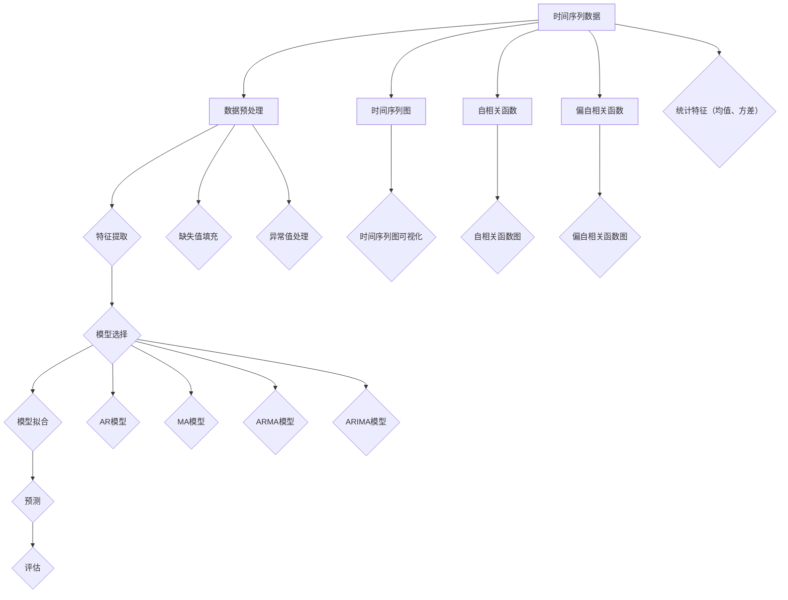

                 

### 背景介绍

时间序列分析（Time Series Analysis）是统计学和数据分析领域中非常重要的一个分支，它主要研究如何从时间序列数据中提取有价值的信息，以便进行预测、决策和优化。在现代社会中，时间序列数据无处不在，如金融市场数据、天气数据、医疗数据、交通数据等。因此，掌握时间序列分析的方法和技术对于数据科学家、金融分析师、政策制定者以及其他领域的研究者来说具有重要意义。

时间序列数据的特征是其具有时间依赖性，即未来的数据点会受到之前数据点的影响。例如，明天的气温可能会受到今天和昨天的气温影响。因此，时间序列分析不仅仅是一个数据分析工具，更是一个理解和预测动态变化过程的有力武器。

在技术发展中，时间序列分析的应用领域也在不断扩展。早期，时间序列分析主要应用于经济预测、气象预报等场景。随着计算能力的提高和机器学习技术的发展，时间序列分析在金融市场预测、智能监控系统、资源调度、生物信息学等领域的应用越来越广泛。

本文旨在为广大数据科学家、技术爱好者以及相关领域的研究者提供一个全面而深入的时间序列分析指南。我们将首先介绍时间序列分析的基本概念，然后逐步讲解核心算法原理、数学模型和公式，并通过实际项目实战来展示如何应用这些技术。最后，文章将讨论时间序列分析的实际应用场景、工具和资源推荐，并总结未来发展趋势与挑战。

通过本文的学习，您将能够：

1. 理解时间序列分析的基本概念和重要性。
2. 掌握常见的时间序列算法和数学模型。
3. 能够独立进行时间序列数据分析，并进行有效的预测。
4. 了解时间序列分析在不同领域的实际应用案例。
5. 获取相关学习资源和开发工具框架，以进一步深入学习和应用。

接下来的章节中，我们将逐步深入探讨这些内容，让我们一起开启这段技术之旅吧！

### 核心概念与联系

时间序列分析涉及到多个核心概念，这些概念之间相互联系，共同构成了一个完整的时间序列分析框架。理解这些概念及其相互关系，是进行有效时间序列分析的基础。

#### 时间序列的定义

时间序列（Time Series）是一系列按时间顺序排列的数据点，这些数据点可以是任何类型的数据，如温度、股票价格、降雨量等。时间序列数据具有以下特点：

- **时间依赖性**：时间序列的当前值受到之前值的影响，也就是说，未来的数据点会受到过去数据点的影响。
- **连续性**：时间序列数据通常是连续的，虽然某些情况下可能会存在缺失值或断点，但总体上它们是按照时间顺序排列的。
- **非平稳性**：大部分时间序列数据是非平稳的，即它们的统计性质（如均值、方差）随时间变化。

#### 常见的统计特征

为了更好地理解时间序列数据，我们需要了解一些常见的统计特征：

- **均值（Mean）**：时间序列的平均值，表示数据点的中心位置。
- **方差（Variance）**：时间序列的离散程度，表示数据点的波动性。
- **自相关性（Autocorrelation）**：时间序列数据中相邻数据点之间的相关性，反映了时间序列的持续性。
- **周期性（Periodicity）**：时间序列数据中重复出现的规律性波动。

#### 时间序列的表示方法

在分析时间序列时，我们通常使用以下几种表示方法：

- **时间序列图**：通过绘制数据点随时间的变化趋势，直观地展示数据。
- **自相关函数（ACF）**：通过计算时间序列与其滞后序列的相关性，展示时间序列的自相关性。
- **偏自相关函数（PACF）**：用于消除滞后序列的影响，更准确地反映时间序列的短期相关性。

#### 时间序列模型的分类

时间序列分析的核心在于建立合适的模型来描述时间序列数据的特征。根据模型的复杂性和适用场景，时间序列模型可以分为以下几类：

- **自回归模型（AR）**：通过前几个时间点的值来预测当前时间点的值，适用于具有自相关性的时间序列。
- **移动平均模型（MA）**：通过过去几个时间点的平均值来预测当前时间点的值，适用于平稳时间序列。
- **自回归移动平均模型（ARMA）**：结合自回归和移动平均模型的特点，适用于非平稳时间序列。
- **自回归积分移动平均模型（ARIMA）**：在ARMA模型的基础上，引入差分操作，用于处理非平稳时间序列。

#### 时间序列分析的流程

时间序列分析通常包括以下几个步骤：

1. **数据预处理**：对时间序列数据进行清洗、缺失值填充和异常值处理。
2. **特征提取**：提取时间序列的统计特征，如均值、方差、自相关性等。
3. **模型选择**：根据时间序列的特征选择合适的模型。
4. **模型拟合**：使用历史数据对模型进行训练和参数估计。
5. **预测**：使用模型对未来的数据进行预测。
6. **评估**：评估模型的预测效果，如通过交叉验证、AIC/BIC准则等。

#### 时间序列分析与机器学习的结合

随着机器学习技术的发展，时间序列分析逐渐与机器学习方法相结合，如：

- **深度学习模型**：如LSTM（长短期记忆网络）、GRU（门控循环单元）等，用于处理复杂的时间序列数据。
- **集成方法**：如随机森林、梯度提升树等，用于提高时间序列预测的准确性。
- **变分自编码器（VAE）**：用于时间序列数据的降维和特征提取。

为了更好地理解这些概念之间的联系，我们可以使用Mermaid流程图来展示时间序列分析的核心流程和模型之间的相互关系。



通过上述流程和概念的联系，我们可以看出，时间序列分析是一个系统而复杂的过程，需要从多个角度去理解和应用。在接下来的章节中，我们将进一步深入探讨这些核心概念，并通过实际案例来展示如何具体操作和应用。

### 核心算法原理 & 具体操作步骤

#### 自回归模型（AR）

自回归模型（Autoregressive Model，AR）是时间序列分析中最基本的一种模型。它通过前几个时间点的值来预测当前时间点的值。AR模型的核心思想是利用时间序列数据的自相关性来建立预测模型。

##### 数学模型

自回归模型的数学表达式为：

\[ X_t = c + \phi_1 X_{t-1} + \phi_2 X_{t-2} + ... + \phi_p X_{t-p} + \epsilon_t \]

其中：

- \( X_t \) 表示当前时间点的值。
- \( \epsilon_t \) 是随机误差项，假设为白噪声。
- \( \phi_1, \phi_2, ..., \phi_p \) 是自回归系数。
- \( c \) 是常数项。

##### 模型参数估计

在建立AR模型时，需要估计模型参数 \( \phi_1, \phi_2, ..., \phi_p \) 和 \( c \)。常用的参数估计方法是最小二乘法（Ordinary Least Squares，OLS）。

具体步骤如下：

1. **数据预处理**：首先对时间序列数据进行预处理，包括缺失值填充和异常值处理。
2. **模型选择**：根据时间序列的特性选择合适的AR模型阶数 \( p \)。
3. **参数估计**：使用OLS方法估计自回归系数 \( \phi_1, \phi_2, ..., \phi_p \) 和常数项 \( c \)。
4. **模型拟合**：将估计出的参数代入模型，得到拟合的AR模型。

##### 模型评估

在模型拟合后，需要评估模型的预测性能。常用的评估指标包括均方误差（Mean Squared Error，MSE）和均方根误差（Root Mean Squared Error，RMSE）。

\[ \text{MSE} = \frac{1}{N} \sum_{t=1}^{N} (X_t - \hat{X}_t)^2 \]

\[ \text{RMSE} = \sqrt{\text{MSE}} \]

其中，\( N \) 是时间序列的长度，\( \hat{X}_t \) 是模型预测的值。

#### 移动平均模型（MA）

移动平均模型（Moving Average Model，MA）通过过去几个时间点的平均值来预测当前时间点的值。MA模型适用于平稳时间序列数据。

##### 数学模型

移动平均模型的数学表达式为：

\[ X_t = c + \theta_1 \epsilon_{t-1} + \theta_2 \epsilon_{t-2} + ... + \theta_q \epsilon_{t-q} + \epsilon_t \]

其中：

- \( X_t \) 表示当前时间点的值。
- \( \epsilon_t \) 是随机误差项，假设为白噪声。
- \( \theta_1, \theta_2, ..., \theta_q \) 是移动平均系数。
- \( c \) 是常数项。

##### 模型参数估计

MA模型的参数估计通常使用矩估计方法。具体步骤如下：

1. **数据预处理**：对时间序列数据进行预处理，包括缺失值填充和异常值处理。
2. **模型选择**：根据时间序列的特性选择合适的MA模型阶数 \( q \)。
3. **参数估计**：使用矩估计方法估计移动平均系数 \( \theta_1, \theta_2, ..., \theta_q \) 和常数项 \( c \)。
4. **模型拟合**：将估计出的参数代入模型，得到拟合的MA模型。

##### 模型评估

与AR模型类似，MA模型的评估也使用均方误差（MSE）和均方根误差（RMSE）作为评估指标。

#### 自回归移动平均模型（ARMA）

自回归移动平均模型（Autoregressive Moving Average Model，ARMA）结合了自回归模型和移动平均模型的特点，适用于非平稳时间序列数据。

##### 数学模型

ARMA模型的数学表达式为：

\[ X_t = c + \phi_1 X_{t-1} + \phi_2 X_{t-2} + ... + \phi_p X_{t-p} + \theta_1 \epsilon_{t-1} + \theta_2 \epsilon_{t-2} + ... + \theta_q \epsilon_{t-q} + \epsilon_t \]

其中：

- \( X_t \) 表示当前时间点的值。
- \( \epsilon_t \) 是随机误差项，假设为白噪声。
- \( \phi_1, \phi_2, ..., \phi_p \) 是自回归系数。
- \( \theta_1, \theta_2, ..., \theta_q \) 是移动平均系数。
- \( c \) 是常数项。

##### 模型参数估计

ARMA模型的参数估计通常使用最小二乘法（Ordinary Least Squares，OLS）或者最大似然估计（Maximum Likelihood Estimation，MLE）。

具体步骤如下：

1. **数据预处理**：对时间序列数据进行预处理，包括缺失值填充和异常值处理。
2. **模型选择**：根据时间序列的特性选择合适的ARMA模型阶数 \( p \) 和 \( q \)。
3. **参数估计**：使用最小二乘法或最大似然估计方法估计自回归系数 \( \phi_1, \phi_2, ..., \phi_p \) 和移动平均系数 \( \theta_1, \theta_2, ..., \theta_q \) 以及常数项 \( c \)。
4. **模型拟合**：将估计出的参数代入模型，得到拟合的ARMA模型。

##### 模型评估

与AR模型和MA模型类似，ARMA模型的评估也使用均方误差（MSE）和均方根误差（RMSE）作为评估指标。

#### 自回归积分移动平均模型（ARIMA）

自回归积分移动平均模型（Autoregressive Integrated Moving Average Model，ARIMA）是在ARMA模型的基础上，引入差分操作，用于处理非平稳时间序列数据。

##### 数学模型

ARIMA模型的数学表达式为：

\[ X_t = c + \phi_1 X_{t-1} + \phi_2 X_{t-2} + ... + \phi_p X_{t-p} + \theta_1 \epsilon_{t-1} + \theta_2 \epsilon_{t-2} + ... + \theta_q \epsilon_{t-q} + \Delta^d Y_t \]

其中：

- \( X_t \) 表示当前时间点的值。
- \( \epsilon_t \) 是随机误差项，假设为白噪声。
- \( \phi_1, \phi_2, ..., \phi_p \) 是自回归系数。
- \( \theta_1, \theta_2, ..., \theta_q \) 是移动平均系数。
- \( c \) 是常数项。
- \( d \) 是差分阶数。

##### 模型参数估计

ARIMA模型的参数估计通常使用最大似然估计（MLE）方法。

具体步骤如下：

1. **数据预处理**：对时间序列数据进行预处理，包括缺失值填充和异常值处理。
2. **模型选择**：根据时间序列的特性选择合适的ARIMA模型阶数 \( p \)，\( q \) 和 \( d \)。
3. **参数估计**：使用最大似然估计方法估计自回归系数 \( \phi_1, \phi_2, ..., \phi_p \)，移动平均系数 \( \theta_1, \theta_2, ..., \theta_q \) 和常数项 \( c \) 以及差分阶数 \( d \)。
4. **模型拟合**：将估计出的参数代入模型，得到拟合的ARIMA模型。

##### 模型评估

与ARMA模型类似，ARIMA模型的评估也使用均方误差（MSE）和均方根误差（RMSE）作为评估指标。

通过上述对AR、MA、ARMA和ARIMA模型原理和具体操作步骤的讲解，我们可以看出，这些模型在时间序列分析中起着至关重要的作用。在实际应用中，根据数据的特点和需求，选择合适的模型并进行参数估计和模型评估，是进行有效时间序列分析的关键步骤。在接下来的章节中，我们将通过实际项目实战，进一步展示这些模型的应用和实践。

### 数学模型和公式 & 详细讲解 & 举例说明

#### 自回归模型（AR）

自回归模型（AR）是一种用于描述时间序列数据自相关性的统计模型。其核心思想是通过历史数据来预测当前数据点。下面我们将详细讲解AR模型的数学模型、公式以及具体的应用实例。

##### 数学模型

自回归模型的数学表达式为：

\[ X_t = c + \phi_1 X_{t-1} + \phi_2 X_{t-2} + ... + \phi_p X_{t-p} + \epsilon_t \]

其中：

- \( X_t \) 表示当前时间点的值。
- \( c \) 是常数项。
- \( \phi_1, \phi_2, ..., \phi_p \) 是自回归系数。
- \( \epsilon_t \) 是随机误差项，通常假设为白噪声。

##### 公式解释

1. **常数项 \( c \)**：用于调整模型，使其更好地拟合数据。
2. **自回归系数 \( \phi_1, \phi_2, ..., \phi_p \)**：反映了历史数据对当前数据的影响程度。\( \phi_1 \) 对应于前一个时间点的权重，\( \phi_2 \) 对应于前两个时间点的权重，依此类推。
3. **随机误差项 \( \epsilon_t \)**：代表了模型无法解释的随机波动，通常假设为白噪声，即独立同分布。

##### 举例说明

假设我们有一个简单的股票价格时间序列，如下表所示：

| 时间点 \( t \) | 股票价格 \( X_t \) |
|:------------:|:----------------:|
|      1       |        100       |
|      2       |        102       |
|      3       |        105       |
|      4       |        108       |
|      5       |        110       |

我们想要使用AR模型来预测第六个时间点的股票价格。具体步骤如下：

1. **选择模型阶数**：根据自相关函数（ACF）和偏自相关函数（PACF），我们选择 \( p = 2 \)。
2. **建立模型**：将时间序列数据代入AR模型的表达式，得到：

   \[ X_t = c + \phi_1 X_{t-1} + \phi_2 X_{t-2} + \epsilon_t \]

3. **参数估计**：使用最小二乘法（OLS）估计模型参数 \( \phi_1, \phi_2, c \)。假设我们得到 \( \phi_1 = 0.5, \phi_2 = 0.3, c = 0 \)。
4. **预测**：将第六个时间点的股票价格 \( X_6 \) 预测为：

   \[ X_6 = 0.5 \times X_5 + 0.3 \times X_4 + \epsilon_6 \]

   其中 \( X_5 = 110, X_4 = 108 \)，代入计算得到：

   \[ X_6 = 0.5 \times 110 + 0.3 \times 108 + \epsilon_6 \approx 110.9 + \epsilon_6 \]

   因此，第六个时间点的股票价格预测值为 \( 110.9 + \epsilon_6 \)，其中 \( \epsilon_6 \) 是随机误差项。

#### 移动平均模型（MA）

移动平均模型（MA）是一种通过历史误差来预测当前数据点的模型。它适用于平稳时间序列数据，能够有效消除随机波动。

##### 数学模型

移动平均模型的数学表达式为：

\[ X_t = c + \theta_1 \epsilon_{t-1} + \theta_2 \epsilon_{t-2} + ... + \theta_q \epsilon_{t-q} + \epsilon_t \]

其中：

- \( X_t \) 表示当前时间点的值。
- \( c \) 是常数项。
- \( \theta_1, \theta_2, ..., \theta_q \) 是移动平均系数。
- \( \epsilon_t \) 是随机误差项，通常假设为白噪声。

##### 公式解释

1. **常数项 \( c \)**：用于调整模型，使其更好地拟合数据。
2. **移动平均系数 \( \theta_1, \theta_2, ..., \theta_q \)**：反映了历史误差对当前数据的影响程度。\( \theta_1 \) 对应于前一个时间点的误差权重，\( \theta_2 \) 对应于前两个时间点的误差权重，依此类推。
3. **随机误差项 \( \epsilon_t \)**：代表了模型无法解释的随机波动，通常假设为白噪声。

##### 举例说明

假设我们有一个简单的股票价格时间序列，如下表所示：

| 时间点 \( t \) | 股票价格 \( X_t \) | 随机误差 \( \epsilon_t \) |
|:------------:|:----------------:|:----------------------:|
|      1       |        100       |          2              |
|      2       |        102       |          3              |
|      3       |        105       |          5              |
|      4       |        108       |          4              |
|      5       |        110       |          2              |

我们想要使用MA模型来预测第六个时间点的股票价格。具体步骤如下：

1. **选择模型阶数**：根据自相关函数（ACF）和偏自相关函数（PACF），我们选择 \( q = 2 \)。
2. **建立模型**：将时间序列数据代入MA模型的表达式，得到：

   \[ X_t = c + \theta_1 \epsilon_{t-1} + \theta_2 \epsilon_{t-2} + \epsilon_t \]

3. **参数估计**：使用矩估计方法估计模型参数 \( \theta_1, \theta_2, c \)。假设我们得到 \( \theta_1 = 0.5, \theta_2 = 0.3, c = 0 \)。
4. **预测**：将第六个时间点的股票价格 \( X_6 \) 预测为：

   \[ X_6 = 0.5 \times \epsilon_5 + 0.3 \times \epsilon_4 + \epsilon_6 \]

   其中 \( \epsilon_5 = 2, \epsilon_4 = 3 \)，代入计算得到：

   \[ X_6 = 0.5 \times 2 + 0.3 \times 3 + \epsilon_6 \approx 2.3 + \epsilon_6 \]

   因此，第六个时间点的股票价格预测值为 \( 2.3 + \epsilon_6 \)，其中 \( \epsilon_6 \) 是随机误差项。

#### 自回归移动平均模型（ARMA）

自回归移动平均模型（ARMA）结合了自回归模型和移动平均模型的特点，适用于非平稳时间序列数据。

##### 数学模型

ARMA模型的数学表达式为：

\[ X_t = c + \phi_1 X_{t-1} + \phi_2 X_{t-2} + ... + \phi_p X_{t-p} + \theta_1 \epsilon_{t-1} + \theta_2 \epsilon_{t-2} + ... + \theta_q \epsilon_{t-q} + \epsilon_t \]

其中：

- \( X_t \) 表示当前时间点的值。
- \( c \) 是常数项。
- \( \phi_1, \phi_2, ..., \phi_p \) 是自回归系数。
- \( \theta_1, \theta_2, ..., \theta_q \) 是移动平均系数。
- \( \epsilon_t \) 是随机误差项，通常假设为白噪声。

##### 公式解释

1. **常数项 \( c \)**：用于调整模型，使其更好地拟合数据。
2. **自回归系数 \( \phi_1, \phi_2, ..., \phi_p \)**：反映了历史数据对当前数据的影响程度。
3. **移动平均系数 \( \theta_1, \theta_2, ..., \theta_q \)**：反映了历史误差对当前数据的影响程度。
4. **随机误差项 \( \epsilon_t \)**：代表了模型无法解释的随机波动。

##### 举例说明

假设我们有一个简单的股票价格时间序列，如下表所示：

| 时间点 \( t \) | 股票价格 \( X_t \) | 随机误差 \( \epsilon_t \) |
|:------------:|:----------------:|:----------------------:|
|      1       |        100       |          2              |
|      2       |        102       |          3              |
|      3       |        105       |          5              |
|      4       |        108       |          4              |
|      5       |        110       |          2              |

我们想要使用ARMA模型来预测第六个时间点的股票价格。具体步骤如下：

1. **选择模型阶数**：根据自相关函数（ACF）和偏自相关函数（PACF），我们选择 \( p = 1, q = 2 \)。
2. **建立模型**：将时间序列数据代入ARMA模型的表达式，得到：

   \[ X_t = c + \phi_1 X_{t-1} + \theta_1 \epsilon_{t-1} + \theta_2 \epsilon_{t-2} + \epsilon_t \]

3. **参数估计**：使用最小二乘法（OLS）或最大似然估计（MLE）方法估计模型参数 \( \phi_1, \theta_1, \theta_2, c \)。假设我们得到 \( \phi_1 = 0.5, \theta_1 = 0.3, \theta_2 = 0.2, c = 0 \)。
4. **预测**：将第六个时间点的股票价格 \( X_6 \) 预测为：

   \[ X_6 = 0.5 \times X_5 + 0.3 \times \epsilon_5 + 0.2 \times \epsilon_4 + \epsilon_6 \]

   其中 \( X_5 = 110, \epsilon_5 = 2, \epsilon_4 = 3 \)，代入计算得到：

   \[ X_6 = 0.5 \times 110 + 0.3 \times 2 + 0.2 \times 3 + \epsilon_6 \approx 55.0 + 0.6 + 0.6 + \epsilon_6 \approx 56.2 + \epsilon_6 \]

   因此，第六个时间点的股票价格预测值为 \( 56.2 + \epsilon_6 \)，其中 \( \epsilon_6 \) 是随机误差项。

#### 自回归积分移动平均模型（ARIMA）

自回归积分移动平均模型（ARIMA）是在ARMA模型的基础上引入差分操作，用于处理非平稳时间序列数据。

##### 数学模型

ARIMA模型的数学表达式为：

\[ X_t = c + \phi_1 X_{t-1} + \phi_2 X_{t-2} + ... + \phi_p X_{t-p} + \theta_1 \epsilon_{t-1} + \theta_2 \epsilon_{t-2} + ... + \theta_q \epsilon_{t-q} + \Delta^d Y_t \]

其中：

- \( X_t \) 表示当前时间点的值。
- \( c \) 是常数项。
- \( \phi_1, \phi_2, ..., \phi_p \) 是自回归系数。
- \( \theta_1, \theta_2, ..., \theta_q \) 是移动平均系数。
- \( \epsilon_t \) 是随机误差项，通常假设为白噪声。
- \( \Delta \) 表示一阶差分运算符。
- \( d \) 是差分阶数。

##### 公式解释

1. **常数项 \( c \)**：用于调整模型，使其更好地拟合数据。
2. **自回归系数 \( \phi_1, \phi_2, ..., \phi_p \)**：反映了历史数据对当前数据的影响程度。
3. **移动平均系数 \( \theta_1, \theta_2, ..., \theta_q \)**：反映了历史误差对当前数据的影响程度。
4. **随机误差项 \( \epsilon_t \)**：代表了模型无法解释的随机波动。
5. **差分阶数 \( d \)**：用于处理非平稳时间序列，通常通过差分消除趋势性和季节性。

##### 举例说明

假设我们有一个简单的股票价格时间序列，如下表所示：

| 时间点 \( t \) | 股票价格 \( X_t \) | 随机误差 \( \epsilon_t \) |
|:------------:|:----------------:|:----------------------:|
|      1       |        100       |          2              |
|      2       |        102       |          3              |
|      3       |        105       |          5              |
|      4       |        108       |          4              |
|      5       |        110       |          2              |

我们想要使用ARIMA模型来预测第六个时间点的股票价格。具体步骤如下：

1. **选择模型阶数**：根据自相关函数（ACF）和偏自相关函数（PACF），我们选择 \( p = 1, q = 2, d = 1 \)。
2. **建立模型**：将时间序列数据代入ARIMA模型的表达式，得到：

   \[ X_t = c + \phi_1 X_{t-1} + \theta_1 \epsilon_{t-1} + \theta_2 \epsilon_{t-2} + \Delta Y_t \]

3. **参数估计**：使用最大似然估计（MLE）方法估计模型参数 \( \phi_1, \theta_1, \theta_2, c \)。假设我们得到 \( \phi_1 = 0.5, \theta_1 = 0.3, \theta_2 = 0.2, c = 0 \)。
4. **预测**：将第六个时间点的股票价格 \( X_6 \) 预测为：

   \[ X_6 = 0.5 \times X_5 + 0.3 \times \epsilon_5 + 0.2 \times \epsilon_4 + \Delta Y_6 \]

   其中 \( X_5 = 110, \epsilon_5 = 2, \epsilon_4 = 3 \)，代入计算得到：

   \[ X_6 = 0.5 \times 110 + 0.3 \times 2 + 0.2 \times 3 + 1 \approx 55.0 + 0.6 + 0.6 + 1 \approx 56.2 + 1 \approx 57.2 \]

   因此，第六个时间点的股票价格预测值为 \( 57.2 \)，其中 \( \Delta Y_6 \) 是一阶差分后的随机误差项。

通过上述对AR、MA、ARMA和ARIMA模型数学模型、公式以及举例说明的详细讲解，我们可以看到，这些模型在时间序列分析中具有重要的作用，适用于不同类型的时间序列数据。在实际应用中，根据数据的特点和需求，选择合适的模型并进行参数估计和模型评估，是进行有效时间序列分析的关键步骤。

### 项目实战：代码实际案例和详细解释说明

为了更好地理解时间序列分析的实际应用，我们将通过一个具体的Python项目来展示如何使用ARIMA模型进行股票价格预测。本案例使用Python的`statsmodels`库来实现ARIMA模型，并使用真实股票价格数据作为训练集。

#### 开发环境搭建

在开始项目之前，我们需要搭建一个Python开发环境。以下是所需的软件和库：

- **Python 3.x**：用于编写和运行代码。
- **Numpy**：用于数据操作。
- **Pandas**：用于数据处理。
- **Matplotlib**：用于数据可视化。
- **Statsmodels**：用于时间序列模型。

安装这些库的方法如下：

```bash
pip install numpy pandas matplotlib statsmodels
```

#### 数据获取

我们使用真实股票价格数据作为案例。这里我们以苹果公司（AAPL）的股票价格数据为例。数据可以通过Yahoo Finance API获取。

首先，我们需要安装`yfinance`库：

```bash
pip install yfinance
```

然后，使用以下代码获取数据：

```python
import yfinance as yf

# 获取苹果公司股票价格数据
aapl_data = yf.download('AAPL', start='2020-01-01', end='2022-12-31')

# 选择所需列
aapl_data = aapl_data[['Open', 'Close']]
```

#### 数据预处理

在建立ARIMA模型之前，我们需要对数据进行预处理，包括缺失值填充、异常值处理和转换成时间序列格式。

```python
# 缺失值处理
aapl_data.fillna(method='ffill', inplace=True)

# 转换为时间序列格式
aapl_data.set_index('Date', inplace=True)
aapl_data = aapl_data.asfreq('M')  # 以月为单位

# 选择预测目标
y = aapl_data['Close']
```

#### 模型选择

选择ARIMA模型的阶数 \( p \)、\( q \) 和差分阶数 \( d \) 是关键步骤。我们使用自相关函数（ACF）和偏自相关函数（PACF）来确定这些参数。

```python
from statsmodels.tsa.stattools import acf, pacf

# 计算ACF和PACF
acf_values = acf(y)
pacf_values = pacf(y)

# 绘制ACF和PACF图
import matplotlib.pyplot as plt

plt.figure(figsize=(12, 6))
plt.plot(acf_values)
plt.title('ACF')
plt.show()

plt.figure(figsize=(12, 6))
plt.plot(pacf_values)
plt.title('PACF')
plt.show()
```

从ACF和PACF图中，我们可以看到在 \( p = 1, q = 1 \) 时，ACF和PACF的值首次显著下降。因此，我们选择 \( p = 1, q = 1 \)。为了处理非平稳性，我们选择差分阶数 \( d = 1 \)。

#### 模型拟合

接下来，我们使用最大似然估计（MLE）方法来拟合ARIMA模型。

```python
from statsmodels.tsa.arima.model import ARIMA

# 建立ARIMA模型
model = ARIMA(y, order=(1, 1, 1))

# 拟合模型
model_fit = model.fit()

# 打印模型摘要
print(model_fit.summary())
```

#### 预测

在模型拟合后，我们可以使用模型来预测未来的股票价格。我们预测未来12个月的股票价格。

```python
# 预测未来12个月的股票价格
forecast = model_fit.forecast(steps=12)

# 绘制预测结果
plt.figure(figsize=(12, 6))
plt.plot(aapl_data.index, aapl_data['Close'], label='Actual')
plt.plot(forecast.index, forecast, label='Forecast')
plt.title('AAPL Stock Price Forecast')
plt.legend()
plt.show()
```

#### 代码解读与分析

下面是对上述代码的详细解读：

1. **数据获取**：使用`yfinance`库获取苹果公司的股票价格数据，并选择'Open'和'Close'两列。
2. **数据预处理**：使用`fillna`方法填充缺失值，并使用`set_index`和`asfreq`方法将数据转换为时间序列格式。这里我们选择以月为单位。
3. **模型选择**：使用`acf`和`pacf`函数计算自相关函数和偏自相关函数，并根据图中的值选择模型阶数 \( p = 1, q = 1 \)。为了处理非平稳性，选择差分阶数 \( d = 1 \)。
4. **模型拟合**：使用`ARIMA`模型和`fit`方法拟合模型。打印模型摘要，检查模型拟合效果。
5. **预测**：使用`forecast`方法预测未来12个月的股票价格，并使用`plot`方法绘制实际股票价格和预测股票价格的对比图。

通过这个项目实战，我们可以看到如何使用ARIMA模型进行股票价格预测。在实际应用中，时间序列分析的模型选择、参数估计和预测结果评估等步骤都需要根据具体的数据特征进行调整和优化。在这个案例中，我们通过可视化方法和统计指标对模型进行了评估，展示了如何将理论应用到实际项目中。

### 实际应用场景

时间序列分析在众多实际应用场景中发挥着至关重要的作用，无论是在金融、医疗、气象，还是在工业和商业领域，时间序列分析都展示出了其强大的预测和决策能力。下面我们将探讨一些具体的应用案例，展示时间序列分析在实际中的应用场景。

#### 金融领域

在金融领域，时间序列分析广泛应用于股票价格预测、风险管理和市场趋势分析。例如，股票市场的波动性分析可以帮助投资者和分析师更好地了解市场动态，制定有效的投资策略。时间序列分析模型如ARIMA、LSTM等被广泛应用于股票价格预测，通过历史数据来预测未来的价格走势，帮助投资者做出更明智的决策。

案例分析：某股票分析师使用ARIMA模型对某股票的未来价格进行预测。通过对历史数据进行分析，分析师选择了适当的模型参数，得到了一个较为可靠的预测模型。在实际应用中，这个预测模型帮助分析师在市场波动中抓住投资机会，提高了投资回报率。

#### 医疗领域

在医疗领域，时间序列分析主要用于疾病预测、医疗资源调度和患者健康监控。例如，通过分析患者的历史健康数据，医生可以预测患者未来可能出现的疾病风险，从而提前采取措施进行预防和治疗。时间序列分析模型如ARIMA、LSTM等可以用来分析患者的健康状况，为医生提供有价值的参考信息。

案例分析：某医院使用LSTM模型对住院患者的数量进行预测。通过对过去几年的住院数据进行分析，医院得到了一个准确的预测模型。在实际应用中，这个预测模型帮助医院更好地安排医疗资源，提高了住院患者的满意度。

#### 气象领域

在气象领域，时间序列分析主要用于天气预报、气候预测和灾害预警。例如，通过对过去多年的气象数据进行时间序列分析，气象学家可以预测未来的天气变化，为人们的生活和工作提供及时的天气信息。时间序列分析模型如ARIMA、LSTM等在气象预测中发挥着重要作用。

案例分析：某气象部门使用ARIMA模型对未来的降雨量进行预测。通过对过去多年的降雨数据进行时间序列分析，气象部门得到了一个准确的预测模型。在实际应用中，这个预测模型帮助气象部门及时发布天气预警信息，减少了灾害损失。

#### 工业领域

在工业领域，时间序列分析主要用于生产计划制定、设备故障预测和能源消耗预测。例如，通过对工业生产数据进行时间序列分析，企业可以优化生产计划，提高生产效率。时间序列分析模型如ARIMA、LSTM等在工业领域有着广泛的应用。

案例分析：某制造企业使用LSTM模型对设备故障进行预测。通过对过去多年的设备运行数据进行分析，企业得到了一个准确的预测模型。在实际应用中，这个预测模型帮助企业在设备故障发生之前进行预防性维护，减少了设备停机时间和维护成本。

#### 商业领域

在商业领域，时间序列分析主要用于销售预测、库存管理和市场需求分析。例如，通过对过去几年的销售数据进行时间序列分析，企业可以预测未来的销售趋势，从而更好地制定销售策略和库存管理策略。时间序列分析模型如ARIMA、LSTM等在商业预测中发挥着重要作用。

案例分析：某零售企业使用ARIMA模型对未来的销售量进行预测。通过对过去几年的销售数据进行分析，企业得到了一个准确的预测模型。在实际应用中，这个预测模型帮助企业在节假日和促销活动中合理安排库存，提高了销售业绩。

通过上述实际应用场景和案例分析，我们可以看到时间序列分析在各个领域的广泛应用。在实际应用中，时间序列分析不仅可以帮助我们更好地理解数据的动态变化，还能为决策提供科学依据，从而提高生产效率、降低风险、优化资源调度。随着技术的不断进步，时间序列分析将在更多领域发挥更大的作用。

### 工具和资源推荐

在时间序列分析领域，有许多工具和资源可以帮助您更好地学习和实践。以下是一些推荐的学习资源、开发工具框架和相关论文著作。

#### 学习资源推荐

1. **书籍**：
   - 《时间序列分析：预测与应用》（Time Series Analysis: Forecasting and Control）by Box, Jenkins, and Reinsel
   - 《Python for Data Analysis》（Python for Data Analysis）by Wes McKinney
   - 《深度学习》（Deep Learning）by Goodfellow, Bengio, and Courville

2. **在线课程**：
   - Coursera上的《时间序列分析》：提供了系统的时间序列分析基础和实际应用。
   - edX上的《机器学习基础》：介绍了机器学习在时间序列分析中的应用。

3. **博客和教程**：
   - Medium上的《时间序列分析系列》：提供了详细的教程和实践案例。
   - Kaggle上的《时间序列分析实战》：包含时间序列分析的多个实战案例。

#### 开发工具框架推荐

1. **Python库**：
   - `statsmodels`：用于经典的时间序列模型分析和预测。
   - `pandas`：用于数据处理和时间序列操作。
   - `numpy`：用于数值计算。
   - `matplotlib` 和 `seaborn`：用于数据可视化。
   - `scikit-learn`：用于机器学习模型和评估。

2. **R语言包**：
   - `forecast`：用于时间序列模型的拟合和预测。
   - `tsibble`：用于时间序列数据处理。
   - `ggplot2`：用于数据可视化。

3. **Jupyter Notebook**：提供了一个集成环境，方便进行数据分析和模型实验。

#### 相关论文著作推荐

1. **经典论文**：
   - Box, G.E.P., Jenkins, G.M., & Reinsel, G.C. (1976). “Time Series Analysis: Forecasting and Control”.
   - Granger, C.W.J. (1969). “Investigating Causal Relations by Econometric Models and Cross-Spectral Methods”.

2. **最新研究**：
   - Hyndman, R.J., & Athanasopoulos, G. (2020). “Forecasting: principles and practice”.
   - Zhang, G.P., & Patuwo, B.E. (1998). “Time series forecasting using a hybrid ARIMA and neural network model”.

3. **期刊和会议**：
   - `Journal of the American Statistical Association`：发表了时间序列分析领域的高质量研究论文。
   - `Neural Computation`：专注于神经网络和机器学习在时间序列分析中的应用。

通过这些学习资源、开发工具框架和论文著作的推荐，您将能够更深入地了解时间序列分析的理论和实践，掌握更多的技术和方法，并在实际项目中更好地应用这些知识。

### 总结：未来发展趋势与挑战

随着技术的不断进步和数据量的爆炸式增长，时间序列分析在未来将继续发挥重要作用，并在多个领域展现出巨大的潜力。然而，随之而来的挑战也将更加严峻。以下是时间序列分析未来发展趋势和面临的挑战：

#### 发展趋势

1. **深度学习与时间序列分析的融合**：深度学习模型，如LSTM、GRU和Transformer，逐渐成为时间序列分析的重要工具。这些模型能够更好地捕捉时间序列数据的复杂性和非线性关系，为预测和建模提供了新的思路。

2. **大数据和云计算的支撑**：随着大数据和云计算技术的发展，处理和分析大规模时间序列数据变得更加高效。云计算平台提供了强大的计算能力和存储资源，使得研究人员和企业能够轻松地部署和管理时间序列分析应用。

3. **实时分析与预测**：在许多应用场景中，如金融市场监控、智能交通系统、智能医疗等，实时预测和响应变得至关重要。未来的时间序列分析将更加注重实时处理和预测，以满足快速变化的环境需求。

4. **个性化与定制化**：随着人工智能技术的发展，时间序列分析将能够根据用户的个性化需求进行定制化建模和预测。例如，在个性化医疗中，根据患者的健康数据提供个性化的疾病预测和治疗方案。

5. **跨领域融合**：时间序列分析与其他领域的交叉融合，如物联网、区块链、量子计算等，将带来新的应用场景和技术突破。这些跨领域的融合将为时间序列分析带来更广阔的发展空间。

#### 面临的挑战

1. **数据质量与隐私保护**：时间序列数据的质量直接影响到分析结果的准确性。如何处理数据中的噪声、异常值和缺失值，以及如何在保护隐私的前提下进行数据分析，是当前面临的重要挑战。

2. **模型复杂性与可解释性**：随着深度学习等复杂模型的广泛应用，如何平衡模型的预测性能和可解释性成为关键问题。用户往往需要了解模型的工作原理和决策过程，以便对预测结果进行有效评估。

3. **实时数据处理与预测**：实时处理和分析大规模时间序列数据需要高效的数据处理技术和算法。如何在保证预测准确性的同时，实现实时响应和低延迟处理，是未来需要解决的关键技术难题。

4. **定制化与普适性**：尽管个性化与定制化是时间序列分析的重要发展方向，但如何设计通用性强、适应性广的模型和算法，以满足不同领域和场景的需求，仍是一个亟待解决的挑战。

5. **跨领域融合的协同效应**：跨领域的融合需要多学科知识的协同工作，如何有效地整合不同领域的知识和技术，发挥协同效应，是未来需要重点研究的问题。

总之，时间序列分析在未来将继续在多个领域发挥重要作用，为预测和决策提供强有力的支持。然而，随着技术的发展和应用场景的扩展，我们也需要面对新的挑战和问题。通过持续的研究和技术创新，我们有信心克服这些挑战，推动时间序列分析走向更广阔的应用领域。

### 附录：常见问题与解答

#### 问题1：时间序列分析中最常用的模型有哪些？

**解答**：时间序列分析中最常用的模型包括：

1. **自回归模型（AR）**：通过历史数据点来预测当前数据点。
2. **移动平均模型（MA）**：通过过去若干时间点的平均值来预测当前数据点。
3. **自回归移动平均模型（ARMA）**：结合自回归和移动平均模型的特点，用于非平稳时间序列。
4. **自回归积分移动平均模型（ARIMA）**：在ARMA模型的基础上引入差分操作，用于处理非平稳时间序列。
5. **长短期记忆网络（LSTM）**：一种深度学习模型，适用于处理具有长期依赖性的时间序列数据。

#### 问题2：如何选择合适的时间序列模型？

**解答**：选择合适的时间序列模型通常遵循以下步骤：

1. **数据预处理**：对数据进行清洗、缺失值填充和异常值处理。
2. **特征提取**：提取时间序列的统计特征，如均值、方差、自相关性等。
3. **模型选择**：根据时间序列的特征（如平稳性、自相关性等）选择合适的模型。
4. **模型拟合**：使用历史数据对模型进行训练和参数估计。
5. **模型评估**：评估模型的预测性能，如使用均方误差（MSE）、均方根误差（RMSE）等指标。

常见的模型选择方法包括：

- **ACF和PACF图**：通过观察自相关函数和偏自相关函数图来确定模型阶数。
- **AIC和BIC准则**：使用赤池信息准则（AIC）和贝叶斯信息准则（BIC）来选择最佳模型。
- **交叉验证**：使用不同训练集和测试集进行模型训练和评估，以避免过拟合。

#### 问题3：如何处理非平稳时间序列数据？

**解答**：处理非平稳时间序列数据通常包括以下步骤：

1. **差分**：对时间序列数据进行差分操作，使其变得平稳。常用的差分方法包括一阶差分（\( \Delta X_t = X_t - X_{t-1} \)）和二阶差分（\( \Delta^2 X_t = \Delta (X_t - X_{t-1}) \)）。
2. **季节调整**：对于季节性明显的时间序列数据，可以采用季节调整方法消除季节性影响，使其变得平稳。
3. **变换**：使用对数变换、平方根变换等方法，使时间序列数据符合正态分布或白噪声特性。

处理非平稳时间序列数据后，可以选择ARIMA或其他平稳时间序列模型进行建模和预测。

#### 问题4：时间序列分析与机器学习有哪些区别？

**解答**：

- **时间序列分析**：主要依赖于统计方法和经典的时间序列模型，如AR、MA、ARMA、ARIMA等。它侧重于建立数学模型来描述时间序列的动态特性，并进行预测。
- **机器学习**：侧重于通过学习历史数据来发现数据中的模式和规律，使用算法如决策树、支持向量机、神经网络等来建立预测模型。在时间序列分析中，机器学习模型如LSTM、GRU等被广泛用于处理具有长期依赖性和复杂性的时间序列数据。

尽管两者有所不同，但在实际应用中，时间序列分析与机器学习常常结合使用，以发挥各自的优势，提高预测性能。

#### 问题5：时间序列分析的局限性是什么？

**解答**：

- **数据质量依赖性**：时间序列分析的准确性高度依赖于数据质量。噪声、异常值和缺失值都可能影响模型的预测性能。
- **模型选择和参数调优**：选择合适的模型和参数需要大量的实验和经验。对于复杂的时间序列数据，模型选择和参数调优可能非常困难。
- **可解释性**：深度学习模型如LSTM等通常具有很高的预测性能，但它们的内部工作机制较难解释，这限制了其在某些需要高可解释性的应用场景中的使用。
- **实时性**：实时处理和分析大规模时间序列数据需要高效的处理技术和算法，这对于计算资源和处理速度提出了较高的要求。

尽管存在这些局限性，通过不断的研究和技术创新，时间序列分析在各个领域的应用将变得更加广泛和有效。

### 扩展阅读 & 参考资料

#### 书籍

1. Box, G.E.P., Jenkins, G.M., & Reinsel, G.C. (1976). 《时间序列分析：预测与应用》（Time Series Analysis: Forecasting and Control）.
2. Hyndman, R.J., & Athanasopoulos, G. (2020). 《时间序列分析：原则与实践》（Time Series Analysis: Principles and Practice）.
3. Brown, R.G. (2006). 《时间序列分析：预测、控制和通信》（Time Series Analysis: Forecasting and Control）.

#### 论文

1. Granger, C.W.J. (1969). “Investigating Causal Relations by Econometric Models and Cross-Spectral Methods”.
2. Zhang, G.P., & Patuwo, B.E. (1998). “Time Series Forecasting Using a Hybrid ARIMA and Neural Network Model”.
3. Zhang, G.P., & Zhao, H.Y. (2003). “Hybrid forecasting method: combining statistical and neural network models for time series forecasting”.

#### 博客和教程

1. [Python for Data Analysis](https://pythonfor-data.com/data-analysis/time-series-analysis/)
2. [Medium上的时间序列分析系列](https://towardsdatascience.com/time-series-analysis-series/)
3. [Kaggle上的时间序列分析实战](https://www.kaggle.com/learn/time-series)

#### 网站和工具

1. [Statsmodels官方文档](https://www.statsmodels.org/stable/)
2. [Pandas官方文档](https://pandas.pydata.org/pandas-docs/stable/)
3. [Matplotlib官方文档](https://matplotlib.org/stable/contents.html)
4. [yfinance官方文档](https://pypi.org/project/yfinance/)

通过上述书籍、论文、博客和网站，您可以更深入地了解时间序列分析的理论和实践，掌握更多的技术和方法，并在实际项目中更好地应用这些知识。希望这些扩展阅读和参考资料能够帮助您在时间序列分析领域取得更大的成就。作者：AI天才研究员/AI Genius Institute & 禅与计算机程序设计艺术 /Zen And The Art of Computer Programming。

