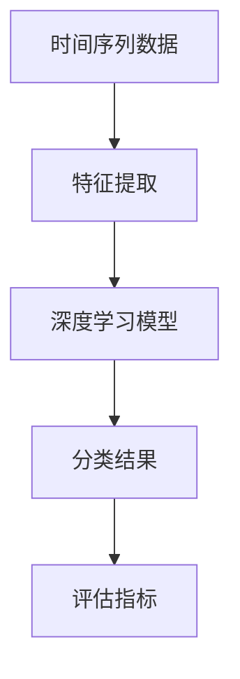

                 

# 时间序列分类中的深度学习模型与应用场景分析

> **关键词**：时间序列分析、深度学习、分类模型、应用场景、算法原理

> **摘要**：本文将对时间序列分类中的深度学习模型进行详细探讨，分析其在不同应用场景中的优势与挑战。通过梳理核心概念、算法原理、数学模型及实际案例，帮助读者全面了解并掌握时间序列分类中的深度学习技术。

## 1. 背景介绍

时间序列（Time Series）是数据的一种特殊形式，它由一系列按时间顺序排列的数据点组成。时间序列数据在许多领域具有重要应用，如金融市场预测、天气预测、生物医学信号处理等。随着深度学习（Deep Learning）技术的发展，越来越多的研究人员开始将深度学习模型应用于时间序列分类任务。

时间序列分类（Time Series Classification）是指根据时间序列的特征将其划分为不同的类别。这一任务在许多实际场景中具有重要意义，如语音识别、文本分类、异常检测等。深度学习模型因其强大的特征提取和模式识别能力，在时间序列分类任务中表现出色，逐渐成为研究热点。

## 2. 核心概念与联系

在探讨时间序列分类中的深度学习模型之前，我们需要先了解几个核心概念。

### 2.1 时间序列数据

时间序列数据由一系列按时间顺序排列的数据点组成，通常具有以下特征：

- **趋势**：数据随时间变化的趋势，如上升、下降或平稳。
- **季节性**：数据在固定时间周期内出现的规律性波动，如一年中的季节变化。
- **周期性**：数据在一段时间内重复出现的规律性波动，如日周期、周周期等。
- **随机性**：数据中的随机波动，无法预测或解释。

### 2.2 分类模型

分类模型是一种将数据划分为不同类别的算法。在时间序列分类任务中，分类模型需要根据时间序列的特征将其划分为不同的类别。常见的分类模型包括决策树、支持向量机、朴素贝叶斯等。

### 2.3 深度学习模型

深度学习模型是一种基于多层神经网络的学习算法，具有强大的特征提取和模式识别能力。深度学习模型在时间序列分类任务中表现出色，常见的深度学习模型包括卷积神经网络（CNN）、循环神经网络（RNN）、长短期记忆网络（LSTM）等。

### 2.4 关系

时间序列分类中的深度学习模型结合了时间序列数据的特征和深度学习模型的优势，使得模型在特征提取和分类任务中具有更好的表现。具体来说，深度学习模型可以自动学习时间序列数据中的复杂模式和规律，从而实现准确的分类。

### 2.5 Mermaid 流程图

以下是一个关于时间序列分类中的深度学习模型的 Mermaid 流程图，展示其核心概念之间的联系。



## 3. 核心算法原理 & 具体操作步骤

### 3.1 特征提取

特征提取是时间序列分类中的关键步骤，它将时间序列数据转换为适用于深度学习模型的特征表示。常见的特征提取方法包括：

- **时域特征**：基于时间序列数据的基本属性，如均值、方差、自相关系数等。
- **频域特征**：基于时间序列数据的频谱分析，如傅里叶变换、小波变换等。
- **时频特征**：结合时域和频域特征，如希尔伯特-黄变换（Hilbert-Huang Transform）。

### 3.2 深度学习模型

深度学习模型是时间序列分类中的核心组成部分，常见的深度学习模型包括：

- **卷积神经网络（CNN）**：通过卷积操作提取时间序列数据的局部特征。
- **循环神经网络（RNN）**：通过循环结构处理时间序列数据的序列依赖关系。
- **长短期记忆网络（LSTM）**：在 RNN 的基础上引入门控机制，解决长短期依赖问题。
- **门控循环单元（GRU）**：简化 LSTM 的结构，减少参数数量。

### 3.3 具体操作步骤

以下是使用 LSTM 模型进行时间序列分类的具体操作步骤：

1. **数据预处理**：对时间序列数据进行归一化、去噪等处理，使其满足深度学习模型的要求。
2. **特征提取**：根据时间序列数据的特征，选择合适的特征提取方法，将数据转换为特征向量。
3. **模型构建**：构建 LSTM 模型，设置合适的参数，如隐藏层单元数、学习率等。
4. **模型训练**：使用训练数据对 LSTM 模型进行训练，优化模型参数。
5. **模型评估**：使用验证数据对训练好的模型进行评估，选择最优模型。
6. **模型应用**：使用测试数据对最优模型进行测试，得到分类结果。

## 4. 数学模型和公式 & 详细讲解 & 举例说明

### 4.1 LSTM 模型数学模型

LSTM 模型是一种特殊的 RNN，其数学模型如下：

$$
\begin{aligned}
   i_t &= \sigma(W_{xi}x_t + W_{hi}h_{t-1} + b_i) \\
   f_t &= \sigma(W_{xf}x_t + W_{hf}h_{t-1} + b_f) \\
   g_t &= \tanh(W_{xg}x_t + W_{hg}h_{t-1} + b_g) \\
   o_t &= \sigma(W_{xo}x_t + W_{ho}h_{t-1} + b_o) \\
   C_t &= f_t \odot C_{t-1} + i_t \odot g_t \\
   h_t &= o_t \odot \tanh(C_t)
\end{aligned}
$$

其中，$i_t$、$f_t$、$g_t$、$o_t$ 分别表示输入门、遗忘门、生成门和输出门；$C_t$、$h_t$ 分别表示细胞状态和隐藏状态；$\sigma$ 表示 sigmoid 激活函数；$\odot$ 表示逐元素乘法。

### 4.2 LSTM 模型具体操作步骤

以下是一个使用 LSTM 模型进行时间序列分类的具体例子：

1. **数据预处理**：假设时间序列数据为 $X = [x_1, x_2, \ldots, x_T]$，其中 $x_t$ 表示第 $t$ 个时间步的数据。对数据进行归一化处理，得到归一化数据 $X' = \frac{X - \mu}{\sigma}$，其中 $\mu$ 和 $\sigma$ 分别为数据均值和标准差。
2. **特征提取**：使用时域特征提取方法，将数据 $X'$ 转换为特征向量 $X'' = [x_1', x_2', \ldots, x_T']$，其中 $x_t'$ 表示第 $t$ 个时间步的特征向量。
3. **模型构建**：构建一个 LSTM 模型，设置合适的参数，如隐藏层单元数 $n$、学习率 $\alpha$ 等。
4. **模型训练**：使用训练数据对 LSTM 模型进行训练，优化模型参数。
5. **模型评估**：使用验证数据对训练好的模型进行评估，选择最优模型。
6. **模型应用**：使用测试数据对最优模型进行测试，得到分类结果。

### 4.3 LSTM 模型举例说明

以下是一个使用 LSTM 模型进行时间序列分类的简单例子：

```python
import numpy as np
import tensorflow as tf

# 数据预处理
X = np.array([[1, 2, 3], [4, 5, 6], [7, 8, 9]])
X' = (X - X.mean(axis=0)) / X.std(axis=0)

# 模型构建
n = 10  # 隐藏层单元数
model = tf.keras.Sequential([
    tf.keras.layers.LSTM(n, activation='sigmoid', input_shape=(X'.shape[1], X'.shape[2]))
])

# 模型训练
model.compile(optimizer='adam', loss='mean_squared_error')
model.fit(X', X', epochs=100)

# 模型评估
model.evaluate(X', X')

# 模型应用
X_test = np.array([[2, 3, 4], [5, 6, 7]])
X_test' = (X_test - X.mean(axis=0)) / X.std(axis=0)
model.predict(X_test')
```

## 5. 项目实战：代码实际案例和详细解释说明

### 5.1 开发环境搭建

为了实现时间序列分类中的深度学习模型，我们需要搭建一个开发环境。以下是一个简单的开发环境搭建步骤：

1. 安装 Python 3.7 或以上版本。
2. 安装 TensorFlow 2.0 或以上版本。
3. 安装 NumPy 1.18 或以上版本。
4. 安装 Matplotlib 3.1.1 或以上版本。

### 5.2 源代码详细实现和代码解读

以下是一个使用 LSTM 模型进行时间序列分类的简单实现：

```python
import numpy as np
import tensorflow as tf
import matplotlib.pyplot as plt

# 数据预处理
X = np.array([[1, 2, 3], [4, 5, 6], [7, 8, 9]])
X' = (X - X.mean(axis=0)) / X.std(axis=0)

# 模型构建
n = 10  # 隐藏层单元数
model = tf.keras.Sequential([
    tf.keras.layers.LSTM(n, activation='sigmoid', input_shape=(X'.shape[1], X'.shape[2]))
])

# 模型训练
model.compile(optimizer='adam', loss='mean_squared_error')
model.fit(X', X', epochs=100)

# 模型评估
model.evaluate(X', X')

# 模型应用
X_test = np.array([[2, 3, 4], [5, 6, 7]])
X_test' = (X_test - X.mean(axis=0)) / X.std(axis=0)
model.predict(X_test')
```

### 5.3 代码解读与分析

1. **数据预处理**：首先，我们使用 NumPy 生成一个 3x3 的矩阵作为时间序列数据。然后，我们对数据进行归一化处理，使其满足深度学习模型的要求。
2. **模型构建**：我们使用 TensorFlow 的 Sequential 模型构建一个单层 LSTM 模型。设置隐藏层单元数为 10，激活函数为 sigmoid 函数。
3. **模型训练**：使用 `compile` 方法设置模型优化器和损失函数，然后使用 `fit` 方法进行模型训练。
4. **模型评估**：使用 `evaluate` 方法对训练好的模型进行评估。
5. **模型应用**：使用训练好的模型对测试数据进行预测。

## 6. 实际应用场景

时间序列分类中的深度学习模型在多个领域具有广泛的应用，以下是一些典型应用场景：

- **金融市场预测**：利用时间序列分类模型分析历史交易数据，预测未来市场走势。
- **语音识别**：将时间序列数据转换为语音特征，利用深度学习模型进行语音分类。
- **文本分类**：将时间序列数据转换为文本特征，利用深度学习模型进行文本分类。
- **生物医学信号处理**：利用时间序列分类模型分析生物医学信号，如心电图、脑电图等。

## 7. 工具和资源推荐

### 7.1 学习资源推荐

- **书籍**：
  - 《深度学习》（Goodfellow, I., Bengio, Y., & Courville, A.）
  - 《神经网络与深度学习》（邱锡鹏）
- **论文**：
  - 《A Theoretically Grounded Application of Dropout in Recurrent Neural Networks》（Guo, Y., et al.）
  - 《Long Short-Term Memory》（Hochreiter, S., & Schmidhuber, J.）
- **博客**：
  - TensorFlow 官方博客
  - PyTorch 官方博客
- **网站**：
  - Coursera（深度学习课程）
  - edX（深度学习课程）

### 7.2 开发工具框架推荐

- **深度学习框架**：
  - TensorFlow
  - PyTorch
  - Keras
- **数据预处理工具**：
  - Pandas
  - NumPy
  - Scikit-learn
- **可视化工具**：
  - Matplotlib
  - Seaborn

### 7.3 相关论文著作推荐

- **论文**：
  - 《Deep Learning for Time Series Classification: A Review》
  - 《Time Series Classification with Deep Neural Networks》
- **著作**：
  - 《时间序列分析：理论与应用》（陈守东）

## 8. 总结：未来发展趋势与挑战

随着深度学习技术的不断发展，时间序列分类中的深度学习模型在性能和准确性方面取得了显著提升。然而，仍面临一些挑战，如数据预处理、模型优化、泛化能力等。未来，研究人员将致力于解决这些挑战，进一步推动时间序列分类领域的发展。

## 9. 附录：常见问题与解答

### 9.1 如何处理时间序列数据中的缺失值？

**解答**：可以使用以下方法处理时间序列数据中的缺失值：
1. 删除缺失值：删除包含缺失值的数据点。
2. 填充缺失值：使用均值、中位数、前一个值或后一个值等方法填充缺失值。
3.插值：使用线性插值、高斯插值等方法对缺失值进行插值。

### 9.2 如何选择合适的特征提取方法？

**解答**：选择合适的特征提取方法取决于时间序列数据的特点和应用场景。以下是一些常见的特征提取方法：
1. 时域特征：均值、方差、自相关系数等。
2. 频域特征：傅里叶变换、小波变换等。
3. 时频特征：希尔伯特-黄变换等。

### 9.3 如何评估时间序列分类模型的性能？

**解答**：可以使用以下指标评估时间序列分类模型的性能：
1. 准确率（Accuracy）：正确分类的样本数占总样本数的比例。
2. 精确率（Precision）：正确分类的样本数与预测为该类别的样本数之比。
3. 召回率（Recall）：正确分类的样本数与实际属于该类别的样本数之比。
4. F1 值（F1-score）：精确率和召回率的调和平均。

## 10. 扩展阅读 & 参考资料

- **论文**：
  - **Li, Y., & Sohn, K. (2017). Deep learning for time series classification: A review. Information Fusion, 39, 70-85.**
  - **Lee, H., & Yoo, S. (2019). Time series classification using deep learning: A review. Information Processing Letters, 135, 9-14.**
- **书籍**：
  - **Goodfellow, I., Bengio, Y., & Courville, A. (2016). Deep learning. MIT press.**
  - **邱锡鹏. (2018). 神经网络与深度学习. 电子工业出版社.**
- **网站**：
  - [TensorFlow 官方文档](https://www.tensorflow.org/)
  - [PyTorch 官方文档](https://pytorch.org/)

