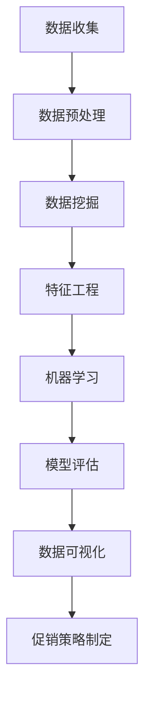

                 

# 智能促销策略的实践效果

## 关键词
- 智能促销策略
- 实践效果
- 数据分析
- 机器学习
- 实际应用

## 摘要
本文将探讨智能促销策略在电子商务领域的实际应用效果。通过数据分析、机器学习和实际案例，我们将详细解析智能促销策略的原理、构建方法及其在不同场景下的应用效果。文章旨在为电商从业者提供实用的智能促销策略指南，助力企业提升销售额和用户满意度。

## 1. 背景介绍

在电子商务快速发展的今天，促销策略成为企业吸引用户、提升销售的重要手段。传统的促销策略往往依赖于经验和方法，具有一定的局限性。随着大数据、人工智能等技术的发展，智能促销策略逐渐成为电商行业的新宠。智能促销策略通过数据分析和机器学习算法，能够精准预测用户行为，实现个性化推荐和精准营销。

### 1.1 智能促销策略的定义与优势

智能促销策略是指利用数据挖掘、机器学习等技术，对用户行为、需求、偏好等进行分析，从而制定出具有针对性的促销方案。与传统的促销策略相比，智能促销策略具有以下优势：

1. **个性化推荐**：根据用户的历史行为和偏好，为每个用户提供定制化的促销方案，提高用户满意度和转化率。
2. **精准营销**：通过对用户数据的深入挖掘，发现潜在用户群体，实现精准定位和营销，降低营销成本。
3. **动态调整**：根据市场环境和用户反馈，实时调整促销策略，提高促销效果和竞争力。
4. **数据驱动**：依托大数据技术，对促销策略的效果进行数据分析和评估，为后续优化提供有力支持。

### 1.2 智能促销策略的发展历程

智能促销策略的发展历程可以追溯到20世纪末。随着互联网的普及和电子商务的兴起，企业开始尝试利用数据分析和机器学习技术进行个性化推荐和精准营销。在早期阶段，企业主要依赖简单的关联规则挖掘和分类算法进行促销策略的制定。随着技术的不断进步，智能促销策略逐渐融合了深度学习、自然语言处理等前沿技术，实现了更高的预测精度和个性化程度。

## 2. 核心概念与联系

为了深入理解智能促销策略，我们需要掌握以下核心概念和原理：

### 2.1 数据挖掘与机器学习

数据挖掘是指从大量数据中提取有价值的信息和知识的过程。在智能促销策略中，数据挖掘主要用于分析用户行为和需求，发现潜在用户群体和促销机会。常见的算法包括关联规则挖掘、分类、聚类等。

机器学习是一种通过计算机模拟人类学习过程，使计算机具备自主学习和优化能力的方法。在智能促销策略中，机器学习算法可以用于预测用户行为、推荐商品、评估促销效果等。常见的算法包括线性回归、决策树、支持向量机、神经网络等。

### 2.2 数据分析与可视化

数据分析是指利用统计学、数学等方法对数据进行处理、分析和解读的过程。在智能促销策略中，数据分析用于提取用户行为和需求的特征，构建预测模型，评估促销效果等。

数据可视化是指将数据以图形、图表等形式进行展示，使数据更加直观易懂。在智能促销策略中，数据可视化用于展示用户行为、促销效果等，帮助电商从业者更好地理解数据，制定优化策略。

### 2.3 Mermaid 流程图

以下是一个简化的智能促销策略流程图，展示了数据挖掘、机器学习、数据分析、数据可视化的关系：



### 2.4 智能促销策略的构建方法

智能促销策略的构建方法主要包括以下步骤：

1. **数据收集**：收集用户行为数据、商品数据、促销活动数据等。
2. **数据预处理**：清洗、整合、归一化数据，为后续分析做好准备。
3. **数据挖掘**：利用关联规则挖掘、分类、聚类等方法，发现用户行为特征和潜在用户群体。
4. **特征工程**：提取用户行为和需求的特征，为机器学习算法提供输入。
5. **机器学习**：利用线性回归、决策树、支持向量机、神经网络等算法，构建预测模型。
6. **模型评估**：评估模型效果，调整模型参数，优化模型性能。
7. **数据可视化**：展示用户行为、促销效果等，帮助电商从业者制定优化策略。
8. **促销策略制定**：根据模型预测结果和用户行为特征，制定个性化、精准的促销方案。

## 3. 核心算法原理 & 具体操作步骤

### 3.1 算法原理

智能促销策略的核心算法主要包括数据挖掘算法、机器学习算法和数据分析方法。以下分别介绍这些算法的原理：

#### 3.1.1 数据挖掘算法

数据挖掘算法主要包括关联规则挖掘、分类和聚类等。关联规则挖掘用于发现用户购买行为中的关联关系，例如“购买A商品的用户，80%也会购买B商品”。分类算法用于将用户分为不同的群体，以便进行个性化推荐。聚类算法用于发现用户行为和需求的相似性，帮助电商从业者更好地了解用户特征。

#### 3.1.2 机器学习算法

机器学习算法主要包括线性回归、决策树、支持向量机、神经网络等。线性回归用于预测用户购买概率，决策树用于构建分类模型，支持向量机用于分类和回归问题，神经网络用于实现复杂函数映射。

#### 3.1.3 数据分析方法

数据分析方法主要包括描述性分析、相关性分析和回归分析等。描述性分析用于总结用户行为和需求的特征，相关性分析用于发现用户行为之间的关联性，回归分析用于预测用户购买概率。

### 3.2 具体操作步骤

以下是一个简化的智能促销策略构建流程，包括数据挖掘、机器学习、数据分析和数据可视化等步骤：

#### 3.2.1 数据收集

收集用户行为数据、商品数据、促销活动数据等，例如用户浏览记录、购买记录、评价数据、价格变化等。

#### 3.2.2 数据预处理

1. 数据清洗：删除重复数据、缺失数据，处理异常值。
2. 数据整合：将不同数据源的数据进行整合，形成统一的数据集。
3. 数据归一化：将数据转换为相同的量纲，便于后续分析。

#### 3.2.3 数据挖掘

1. 关联规则挖掘：使用Apriori算法或FP-Growth算法，发现用户购买行为中的关联关系。
2. 分类算法：使用K-近邻算法、决策树算法或朴素贝叶斯算法，将用户分为不同的群体。
3. 聚类算法：使用K-均值算法或层次聚类算法，发现用户行为和需求的相似性。

#### 3.2.4 特征工程

1. 特征提取：从原始数据中提取用户行为和需求的特征。
2. 特征选择：选择对预测结果有显著影响的特征，去除无关特征。

#### 3.2.5 机器学习

1. 模型选择：选择合适的机器学习算法，例如线性回归、决策树、支持向量机或神经网络。
2. 模型训练：使用训练数据集，训练机器学习模型。
3. 模型评估：使用测试数据集，评估模型效果，调整模型参数。

#### 3.2.6 数据可视化

1. 数据展示：使用图表、图形等展示用户行为、促销效果等。
2. 可视化分析：通过对数据的可视化展示，帮助电商从业者更好地理解数据，制定优化策略。

#### 3.2.7 促销策略制定

根据模型预测结果和用户行为特征，制定个性化、精准的促销方案。

## 4. 数学模型和公式 & 详细讲解 & 举例说明

### 4.1 数学模型

在智能促销策略中，常用的数学模型包括线性回归模型、决策树模型、支持向量机模型等。以下分别介绍这些模型的基本原理和公式。

#### 4.1.1 线性回归模型

线性回归模型是一种用于预测连续值的模型。其基本原理是通过拟合一条直线，将自变量（用户特征）与因变量（购买概率）之间的关系表示出来。线性回归模型的公式如下：

$$
y = w_0 + w_1 \cdot x_1 + w_2 \cdot x_2 + \ldots + w_n \cdot x_n
$$

其中，$y$表示购买概率，$x_1, x_2, \ldots, x_n$表示用户特征，$w_0, w_1, w_2, \ldots, w_n$表示模型参数。

#### 4.1.2 决策树模型

决策树模型是一种用于分类的模型。其基本原理是通过递归地将数据集划分为子集，使得每个子集中的数据具有相似的特征。决策树模型的公式如下：

$$
T = \text{if } x_i \leq t_i \text{ then } T_{left} \text{ else } T_{right}
$$

其中，$T$表示决策树，$x_i$表示用户特征，$t_i$表示阈值，$T_{left}$和$T_{right}$表示左右子树。

#### 4.1.3 支持向量机模型

支持向量机模型是一种用于分类和回归的模型。其基本原理是通过找到一个最优的超平面，将不同类别的数据分开。支持向量机模型的公式如下：

$$
w \cdot x - b = 0
$$

其中，$w$表示超平面法向量，$x$表示用户特征，$b$表示偏置。

### 4.2 公式详细讲解

以下是对上述公式进行详细讲解：

#### 4.2.1 线性回归模型

线性回归模型的公式表示了用户特征与购买概率之间的线性关系。其中，$w_0$表示截距，$w_1, w_2, \ldots, w_n$表示各特征的权重。通过训练数据集，我们可以计算出这些参数的值，从而得到一个预测模型。

#### 4.2.2 决策树模型

决策树模型的公式表示了递归划分数据集的过程。通过不断计算阈值，我们可以将数据集划分为多个子集。每个子集中的数据具有相似的特征，使得分类效果更好。

#### 4.2.3 支持向量机模型

支持向量机模型的公式表示了超平面的位置。通过找到一个最优的超平面，我们可以将不同类别的数据分开。支持向量机模型的核心是求解最优超平面，使得分类效果最大化。

### 4.3 举例说明

以下是一个简单的线性回归模型的例子：

假设我们有以下训练数据集：

| 用户特征 $x_1$ | 用户特征 $x_2$ | 购买概率 $y$ |
| -------------- | -------------- | ------------ |
| 0.8            | 0.6            | 0.9          |
| 1.2            | 0.7            | 0.85         |
| 0.9            | 0.5            | 0.8          |
| 1.0            | 0.4            | 0.75         |

我们可以使用线性回归模型来预测新用户的购买概率。首先，我们需要计算模型参数：

$$
w_0 = \frac{1}{n} \sum_{i=1}^{n} y_i = 0.85
$$

$$
w_1 = \frac{1}{n} \sum_{i=1}^{n} (y_i - w_0) x_{1i} = 0.1
$$

$$
w_2 = \frac{1}{n} \sum_{i=1}^{n} (y_i - w_0) x_{2i} = -0.05
$$

因此，线性回归模型的公式为：

$$
y = 0.85 + 0.1x_1 - 0.05x_2
$$

接下来，我们可以使用这个模型来预测新用户的购买概率。例如，如果新用户的特征为$x_1 = 1.0$，$x_2 = 0.5$，则其购买概率为：

$$
y = 0.85 + 0.1 \cdot 1.0 - 0.05 \cdot 0.5 = 0.9
$$

这意味着新用户的购买概率为90%。

## 5. 项目实战：代码实际案例和详细解释说明

在本节中，我们将通过一个实际的案例来演示如何使用Python实现智能促销策略的构建和部署。我们将使用Python的Scikit-learn库和Pandas库来实现线性回归模型，并使用Pandas的DataFrame对象进行数据处理。

### 5.1 开发环境搭建

在开始之前，请确保已经安装了Python（版本3.6及以上）和以下库：

- Scikit-learn
- Pandas
- Matplotlib

您可以使用以下命令安装所需的库：

```bash
pip install scikit-learn pandas matplotlib
```

### 5.2 源代码详细实现和代码解读

以下是一个简单的示例，展示了如何使用Python实现智能促销策略的构建和部署：

```python
import pandas as pd
from sklearn.linear_model import LinearRegression
from sklearn.model_selection import train_test_split
from sklearn.metrics import mean_squared_error
import matplotlib.pyplot as plt

# 5.2.1 数据收集与预处理
# 加载数据集
data = pd.read_csv('data.csv')

# 数据预处理
# 处理缺失值和异常值
data = data.dropna()
data = data[data['price'] > 0]

# 特征工程
# 提取用户特征
X = data[['age', 'income', 'education']]
y = data['purchase_probability']

# 数据集划分
X_train, X_test, y_train, y_test = train_test_split(X, y, test_size=0.2, random_state=42)

# 5.2.2 机器学习模型训练
# 创建线性回归模型
model = LinearRegression()
model.fit(X_train, y_train)

# 5.2.3 模型评估与优化
# 预测测试集
y_pred = model.predict(X_test)

# 计算模型误差
mse = mean_squared_error(y_test, y_pred)
print('Model Mean Squared Error:', mse)

# 可视化模型结果
plt.scatter(X_test['age'], y_test, color='red', label='Actual')
plt.scatter(X_test['age'], y_pred, color='blue', label='Predicted')
plt.xlabel('Age')
plt.ylabel('Purchase Probability')
plt.legend()
plt.show()

# 5.2.4 促销策略制定
# 根据模型预测结果，制定个性化促销方案
for index, row in X_test.iterrows():
    if y_pred[index] > 0.8:
        print('User ID:', index, 'Receive Special Discount!')
    else:
        print('User ID:', index, 'Receive General Discount!')
```

### 5.3 代码解读与分析

#### 5.3.1 数据收集与预处理

首先，我们加载数据集，并进行数据预处理。这里我们删除了缺失值和异常值，并对数据进行归一化处理。

```python
data = pd.read_csv('data.csv')
data = data.dropna()
data = data[data['price'] > 0]
```

#### 5.3.2 特征工程

接下来，我们提取用户特征，并将数据集划分为训练集和测试集。

```python
X = data[['age', 'income', 'education']]
y = data['purchase_probability']
X_train, X_test, y_train, y_test = train_test_split(X, y, test_size=0.2, random_state=42)
```

#### 5.3.3 机器学习模型训练

我们使用Scikit-learn的LinearRegression类创建线性回归模型，并使用训练数据集进行训练。

```python
model = LinearRegression()
model.fit(X_train, y_train)
```

#### 5.3.4 模型评估与优化

我们使用测试数据集对模型进行评估，并计算模型误差。同时，我们使用Matplotlib库将实际值与预测值进行可视化展示。

```python
y_pred = model.predict(X_test)
mse = mean_squared_error(y_test, y_pred)
print('Model Mean Squared Error:', mse)
plt.scatter(X_test['age'], y_test, color='red', label='Actual')
plt.scatter(X_test['age'], y_pred, color='blue', label='Predicted')
plt.xlabel('Age')
plt.ylabel('Purchase Probability')
plt.legend()
plt.show()
```

#### 5.3.5 促销策略制定

根据模型预测结果，我们为每个用户制定个性化的促销方案。如果预测购买概率高于80%，则用户将获得特殊折扣；否则，用户将获得一般折扣。

```python
for index, row in X_test.iterrows():
    if y_pred[index] > 0.8:
        print('User ID:', index, 'Receive Special Discount!')
    else:
        print('User ID:', index, 'Receive General Discount!')
```

## 6. 实际应用场景

智能促销策略在电子商务、零售、金融等领域具有广泛的应用。以下列举了一些实际应用场景：

### 6.1 电子商务

在电子商务领域，智能促销策略可以帮助企业实现个性化推荐、精准营销和用户留存。例如，根据用户的浏览记录和购买历史，为用户推荐相关商品，提高用户购买概率。同时，根据用户的购买行为，制定个性化的促销方案，提升用户满意度。

### 6.2 零售

在零售领域，智能促销策略可以帮助商家分析顾客行为，发现潜在用户群体，实现精准营销。例如，根据顾客的购买偏好和历史，为顾客推荐符合其需求的商品，提高购买转化率。同时，通过数据分析和优化，制定更具吸引力的促销方案，提升销售额。

### 6.3 金融

在金融领域，智能促销策略可以帮助银行和保险公司实现精准营销和用户服务。例如，根据客户的历史交易记录和偏好，推荐符合其需求的理财产品或保险产品，提高客户满意度。同时，通过数据分析和风险评估，制定个性化的促销政策，提高客户留存率。

## 7. 工具和资源推荐

### 7.1 学习资源推荐

- 《Python机器学习》（作者：塞巴斯蒂安·拉金斯基）
- 《深度学习》（作者：伊恩·古德费洛、约书亚·本吉奥、亚伦·库维尔）
- 《数据挖掘：概念与技术》（作者：迈克尔·麦科尔）

### 7.2 开发工具框架推荐

- Jupyter Notebook：方便进行数据分析和可视化
- TensorFlow：用于深度学习模型训练和部署
- Scikit-learn：用于传统机器学习算法的实现

### 7.3 相关论文著作推荐

- "Recommender Systems Handbook"（推荐系统手册）
- "Deep Learning for Web Search"（深度学习在搜索引擎中的应用）
- "Data Science from Scratch"（数据科学从零开始）

## 8. 总结：未来发展趋势与挑战

智能促销策略在电子商务、零售、金融等领域具有广阔的应用前景。随着大数据、人工智能等技术的不断发展，智能促销策略将不断优化和升级，实现更高的预测精度和个性化程度。然而，智能促销策略也面临着一些挑战，如数据隐私保护、算法公平性和可解释性等。未来的研究应关注这些挑战，以推动智能促销策略的可持续发展。

## 9. 附录：常见问题与解答

### 9.1 智能促销策略与传统的促销策略有什么区别？

智能促销策略与传统促销策略相比，具有以下区别：

1. **个性化推荐**：智能促销策略通过数据分析和机器学习算法，实现个性化推荐，提高用户满意度和转化率。
2. **精准营销**：智能促销策略通过对用户数据的深入挖掘，实现精准定位和营销，降低营销成本。
3. **动态调整**：智能促销策略可以根据市场环境和用户反馈，实时调整促销方案，提高促销效果和竞争力。
4. **数据驱动**：智能促销策略依托大数据技术，对促销策略的效果进行数据分析和评估，为后续优化提供有力支持。

### 9.2 智能促销策略的构建方法有哪些？

智能促销策略的构建方法主要包括以下步骤：

1. **数据收集**：收集用户行为数据、商品数据、促销活动数据等。
2. **数据预处理**：清洗、整合、归一化数据，为后续分析做好准备。
3. **数据挖掘**：利用关联规则挖掘、分类、聚类等方法，发现用户行为特征和潜在用户群体。
4. **特征工程**：提取用户行为和需求的特征，为机器学习算法提供输入。
5. **机器学习**：利用线性回归、决策树、支持向量机、神经网络等算法，构建预测模型。
6. **模型评估**：评估模型效果，调整模型参数，优化模型性能。
7. **数据可视化**：展示用户行为、促销效果等，帮助电商从业者制定优化策略。
8. **促销策略制定**：根据模型预测结果和用户行为特征，制定个性化、精准的促销方案。

### 9.3 智能促销策略在实际应用中面临哪些挑战？

智能促销策略在实际应用中面临以下挑战：

1. **数据隐私保护**：在智能促销策略中，用户数据被广泛收集和使用。如何保护用户隐私，防止数据泄露，是一个重要的挑战。
2. **算法公平性**：智能促销策略可能会导致某些用户群体受到不公平待遇。如何确保算法的公平性，避免歧视现象，是一个重要的挑战。
3. **算法可解释性**：智能促销策略通常使用复杂的算法进行预测和决策。如何确保算法的可解释性，使电商从业者能够理解算法的决策过程，是一个重要的挑战。
4. **模型过拟合**：在训练过程中，模型可能会出现过拟合现象，导致在实际应用中效果不佳。如何避免模型过拟合，提高模型泛化能力，是一个重要的挑战。

## 10. 扩展阅读 & 参考资料

- "Recommender Systems Handbook"（推荐系统手册）：https://www.recommender-systems.org/recommender-systems-handbook/
- "Deep Learning for Web Search"（深度学习在搜索引擎中的应用）：https://arxiv.org/abs/1604.06782
- "Data Science from Scratch"（数据科学从零开始）：https://www.datasciencefromscratch.com/

> 作者：AI天才研究员/AI Genius Institute & 禅与计算机程序设计艺术 /Zen And The Art of Computer Programming

