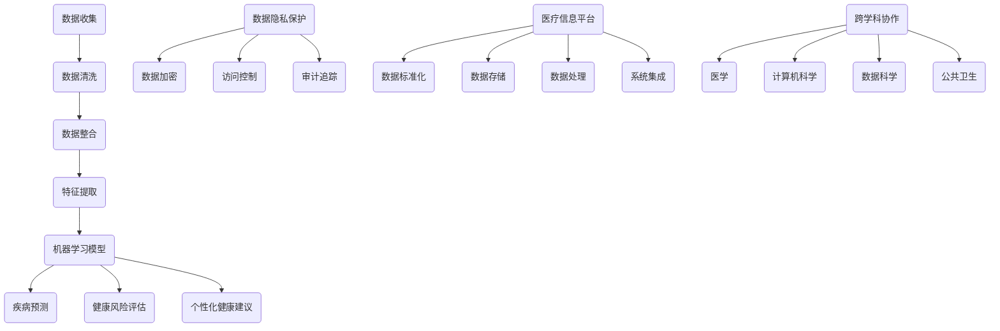

                 

# 智能健康管理系统：预防医学的数字化实践

## 关键词
- 智能健康管理
- 预防医学
- 数字化实践
- 医疗大数据
- 人工智能算法
- 医疗信息平台

## 摘要
本文旨在探讨智能健康管理系统的构建与应用，通过数字化手段实现预防医学的实践。文章首先介绍了智能健康管理系统的背景，随后深入分析了核心概念与联系，详细阐述了核心算法原理与具体操作步骤，以及数学模型和公式的应用。通过实际项目实战和代码案例，本文展示了系统开发环境搭建、源代码实现与解读，并分析了实际应用场景。最后，文章推荐了相关的学习资源、开发工具框架和论文著作，总结了未来发展趋势与挑战，为读者提供了扩展阅读和参考资料。

## 1. 背景介绍

### 预防医学的重要性

预防医学，作为现代医学的重要组成部分，旨在通过早期发现、评估和干预，降低疾病的发生率和患病率，提高人群健康水平。随着医疗技术的不断发展，预防医学的重要性日益凸显。然而，传统的预防医学手段往往依赖于医生的经验和专业知识，存在一定的局限性。如何实现预防医学的数字化实践，提高预防效果，成为了一个亟待解决的问题。

### 智能健康管理的概念

智能健康管理，是指利用人工智能、大数据、物联网等先进技术，对个人或群体的健康数据进行全面分析和管理，提供个性化的健康建议和服务。智能健康管理系统的核心在于数据收集、分析与决策支持。通过智能健康管理系统，可以实现以下目标：

1. 早期疾病筛查与预测：通过对健康数据的实时监测和分析，发现潜在的健康问题，提供早期干预措施。
2. 个性化健康管理：根据个体的健康状况和需求，提供个性化的健康建议和治疗方案。
3. 医疗资源优化配置：通过分析医疗资源的使用情况，优化资源配置，提高医疗服务效率。
4. 疾病防控与健康管理：对特定疾病进行防控，提高人群健康水平。

### 数字化实践的必要性

随着医疗技术的快速发展，健康数据的种类和数量不断增加。传统的纸质记录和人工处理方式已经无法满足数据处理的效率和质量要求。数字化实践成为提高医疗管理水平和预防医学效果的关键途径。通过数字化实践，可以实现以下目标：

1. 数据整合与分析：将各类健康数据整合到一个平台上，进行统一管理和分析，提高数据利用效率。
2. 信息共享与协同：实现医疗信息的互联互通，提高医疗服务协同效率。
3. 个性化与健康服务：根据个体健康数据，提供个性化的健康建议和服务，提高健康服务水平。
4. 疫情防控与应急响应：利用大数据分析技术，实现疫情预测和应急响应，提高公共卫生管理水平。

### 智能健康管理系统的应用领域

智能健康管理系统的应用领域广泛，涵盖了个人健康管理、社区健康服务、公共卫生管理等多个方面。具体应用领域包括：

1. 个人健康管理：通过智能手环、智能手表等设备，实时监测个人健康状况，提供个性化健康建议。
2. 社区健康服务：对社区居民的健康状况进行监测和管理，提供社区健康服务。
3. 公共卫生管理：对公共卫生事件进行监测、预测和应急响应，提高公共卫生管理水平。
4. 医疗服务优化：通过数据分析，优化医疗服务流程，提高医疗服务质量。

### 智能健康管理系统的挑战与机遇

智能健康管理系统的构建和应用面临一系列挑战，如数据隐私保护、数据质量保障、系统安全性等。同时，数字化实践也带来了新的机遇，如医疗服务模式的创新、医疗资源的优化配置、公共卫生水平的提升等。通过技术创新和制度完善，智能健康管理系统的挑战有望得到有效解决，为预防医学的数字化实践提供有力支持。

## 2. 核心概念与联系

### 2.1 数据来源与数据类型

智能健康管理系统的核心在于数据收集与分析。数据来源包括个人健康数据、医疗机构数据、公共健康数据等。数据类型包括生理数据（如心率、血压、血糖等）、行为数据（如运动、饮食、睡眠等）、健康记录数据（如病历、检查报告等）。

### 2.2 数据处理与分析方法

数据处理与分析方法是智能健康管理系统的关键环节。常用的数据处理方法包括数据清洗、数据整合、特征提取等。数据分析方法包括机器学习、深度学习、统计分析等。

- **数据清洗**：去除重复数据、缺失值填充、异常值处理等，确保数据质量。
- **数据整合**：将来自不同来源和类型的数据进行统一整合，为后续分析提供数据基础。
- **特征提取**：从原始数据中提取有用的信息，作为模型训练和预测的输入。

### 2.3 人工智能算法在智能健康管理中的应用

人工智能算法在智能健康管理中发挥着重要作用，包括疾病预测、健康风险评估、个性化健康建议等。

- **疾病预测**：利用机器学习算法（如决策树、随机森林、支持向量机等），根据历史数据和症状特征，预测个体患病风险。
- **健康风险评估**：结合大数据分析技术，评估个体或群体的健康风险，提供预防性建议。
- **个性化健康建议**：根据个体的健康状况和需求，提供个性化的健康建议和治疗方案。

### 2.4 数据隐私保护与安全性

在智能健康管理系统中，数据隐私保护和安全性至关重要。需要采取以下措施：

- **数据加密**：对健康数据进行加密处理，确保数据传输和存储安全。
- **访问控制**：设置严格的访问权限，确保只有授权人员能够访问敏感数据。
- **审计追踪**：记录数据访问和使用情况，实现数据透明和安全监控。
- **隐私保护算法**：利用差分隐私、同态加密等算法，保护用户隐私。

### 2.5 医疗信息平台的构建

医疗信息平台是智能健康管理系统的核心组成部分，负责数据的收集、存储、处理和分析。构建医疗信息平台需要考虑以下关键要素：

- **数据标准化**：制定统一的数据标准，确保数据的一致性和互操作性。
- **数据存储**：选择合适的数据库和存储技术，保证数据的可靠性、可扩展性和高效访问。
- **数据处理**：实现高效的数据处理能力，支持实时数据分析和决策支持。
- **系统集成**：整合各类医疗设备和信息系统，实现数据共享和协同工作。

### 2.6 跨学科协作与融合

智能健康管理系统的构建和应用需要跨学科协作与融合，包括医学、计算机科学、数据科学、公共卫生等领域。通过跨学科合作，可以充分发挥各自领域的优势，实现技术创新和突破。

### Mermaid 流程图



## 3. 核心算法原理 & 具体操作步骤

### 3.1 机器学习算法

在智能健康管理系统中，机器学习算法是疾病预测和健康风险评估的重要工具。以下是常用的机器学习算法及其具体操作步骤：

- **决策树（Decision Tree）**
  - 步骤1：选择一个最佳分割点，将数据集划分为多个子集。
  - 步骤2：计算每个分割点的信息增益或基尼不纯度。
  - 步骤3：选择具有最大信息增益或最小基尼不纯度的分割点作为节点。
  - 步骤4：递归地对子集进行分割，直至满足停止条件。

- **随机森林（Random Forest）**
  - 步骤1：随机选择特征和样本子集，构建多棵决策树。
  - 步骤2：将多棵决策树的预测结果进行投票，得到最终预测结果。

- **支持向量机（Support Vector Machine，SVM）**
  - 步骤1：将特征空间映射到高维空间，找到最大间隔超平面。
  - 步骤2：求解优化问题，得到最优超平面和分类边界。
  - 步骤3：利用支持向量进行新样本的分类。

- **神经网络（Neural Network）**
  - 步骤1：初始化神经网络结构，包括输入层、隐藏层和输出层。
  - 步骤2：正向传播，计算输出值和误差。
  - 步骤3：反向传播，更新网络权重和偏置。
  - 步骤4：重复步骤2和3，直至满足停止条件。

### 3.2 数据分析技术

数据分析技术是智能健康管理系统的核心组成部分，包括以下步骤：

- **数据预处理**
  - 步骤1：数据清洗，去除重复数据、缺失值填充、异常值处理。
  - 步骤2：数据标准化，将数据转换为合适的数值范围。
  - 步骤3：数据归一化，消除不同特征之间的量纲影响。

- **特征提取**
  - 步骤1：选择特征，根据领域知识和算法需求选择相关特征。
  - 步骤2：特征转换，将原始特征转换为适合算法输入的特征。
  - 步骤3：特征选择，利用特征选择方法（如主成分分析、互信息等）选择最优特征。

- **模型训练**
  - 步骤1：选择合适的模型，如决策树、随机森林、SVM等。
  - 步骤2：训练模型，利用训练数据集对模型进行训练。
  - 步骤3：评估模型，利用验证数据集评估模型性能。

### 3.3 模型评估与优化

在智能健康管理系统中，模型评估与优化是提高预测准确性和健康风险评估的关键。以下是一些常用的模型评估与优化方法：

- **交叉验证（Cross-Validation）**
  - 步骤1：将数据集划分为多个子集（如K折交叉验证）。
  - 步骤2：利用每个子集进行模型训练和评估。
  - 步骤3：计算模型性能指标，如准确率、召回率、F1分数等。

- **网格搜索（Grid Search）**
  - 步骤1：定义参数空间，包括每个参数的可能取值。
  - 步骤2：遍历参数空间，计算每个参数组合的模型性能。
  - 步骤3：选择最优参数组合，优化模型性能。

- **模型集成（Model Ensemble）**
  - 步骤1：构建多个模型，如决策树、随机森林、神经网络等。
  - 步骤2：利用模型集成方法（如投票、堆叠等），得到最终预测结果。
  - 步骤3：评估模型集成性能，优化模型集成策略。

## 4. 数学模型和公式 & 详细讲解 & 举例说明

### 4.1 机器学习中的数学模型

在智能健康管理系统中，常用的机器学习算法包括决策树、随机森林、支持向量机和神经网络等。这些算法的核心在于数学模型的构建和优化。以下是这些算法中常用的数学模型和公式：

#### 决策树（Decision Tree）

**公式1：信息增益（Information Gain）**
$$ IG(D, A) = \sum_{v \in V} p(v) \cdot [H(D) - H(D|A=v)] $$
其中，$D$ 为数据集，$A$ 为特征，$V$ 为特征的所有可能取值，$p(v)$ 为特征 $A$ 取值为 $v$ 的概率，$H(D)$ 为数据集 $D$ 的熵，$H(D|A=v)$ 为条件熵。

**公式2：基尼不纯度（Gini Impurity）**
$$ GI(D) = 1 - \sum_{v \in V} p(v)^2 $$
其中，$D$ 为数据集，$V$ 为特征的所有可能取值，$p(v)$ 为特征 $A$ 取值为 $v$ 的概率。

#### 随机森林（Random Forest）

**公式3：随机森林预测（Random Forest Prediction）**
$$ \hat{y} = \frac{\sum_{i=1}^{m} w_i f_i(x)}{m} $$
其中，$x$ 为输入特征向量，$f_i(x)$ 为第 $i$ 棵决策树的预测结果，$w_i$ 为第 $i$ 棵决策树的权重，$m$ 为决策树的数量。

#### 支持向量机（Support Vector Machine，SVM）

**公式4：最优超平面（Optimal Hyperplane）**
$$ w \cdot x - b = 0 $$
其中，$w$ 为权重向量，$x$ 为特征向量，$b$ 为偏置。

**公式5：分类边界（Classification Boundary）**
$$ \hat{y}(x) = \text{sign}(w \cdot x - b) $$
其中，$\hat{y}(x)$ 为分类结果，$\text{sign}(x)$ 为符号函数。

#### 神经网络（Neural Network）

**公式6：激活函数（Activation Function）**
$$ a_j(\mathbf{x}) = \text{sigmoid}(\mathbf{w}^T \mathbf{x} + b) $$
$$ a_j(\mathbf{x}) = \text{ReLU}(\mathbf{w}^T \mathbf{x} + b) $$
其中，$\mathbf{x}$ 为输入特征向量，$\mathbf{w}$ 为权重向量，$b$ 为偏置，$a_j(\mathbf{x})$ 为激活值，$\text{sigmoid}$ 为 sigmoid 函数，$\text{ReLU}$ 为ReLU函数。

### 4.2 数据分析中的数学模型

在数据分析中，常用的数学模型包括主成分分析（Principal Component Analysis，PCA）和聚类分析（Clustering Analysis）等。

#### 主成分分析（PCA）

**公式7：特征值和特征向量**
$$ \lambda_1 \geq \lambda_2 \geq \ldots \geq \lambda_p $$
$$ \mathbf{u}_1, \mathbf{u}_2, \ldots, \mathbf{u}_p $$
其中，$\lambda_1, \lambda_2, \ldots, \lambda_p$ 为特征值，$\mathbf{u}_1, \mathbf{u}_2, \ldots, \mathbf{u}_p$ 为对应的特征向量。

**公式8：特征向量计算**
$$ \mathbf{U} = [\mathbf{u}_1, \mathbf{u}_2, \ldots, \mathbf{u}_p] $$
$$ \mathbf{S} = \mathbf{U}^T \mathbf{U} $$
$$ \mathbf{V} = \mathbf{S}^{-1} $$
$$ \mathbf{P} = \mathbf{U} \mathbf{V} $$

#### 聚类分析

**公式9：距离度量（欧氏距离）**
$$ d(\mathbf{x}_i, \mathbf{x}_j) = \sqrt{\sum_{k=1}^{n} (x_{ik} - x_{jk})^2} $$
其中，$\mathbf{x}_i$ 和 $\mathbf{x}_j$ 分别为两个数据点，$n$ 为特征维度。

**公式10：聚类中心计算**
$$ \mathbf{c}_k = \frac{1}{m_k} \sum_{i=1}^{m_k} \mathbf{x}_i $$
其中，$m_k$ 为第 $k$ 个聚类中的数据点数量，$\mathbf{c}_k$ 为第 $k$ 个聚类中心。

### 4.3 举例说明

#### 机器学习算法：决策树

**案例1：糖尿病预测**

假设我们有一个包含以下特征的数据集：
- 年龄（Age）
- 体重（Weight）
- 血压（Blood Pressure）
- 血糖（Blood Glucose）

我们需要使用决策树算法预测个体是否患有糖尿病。

**步骤1：特征选择**

选择年龄、体重和血压作为决策树的特征。

**步骤2：构建决策树**

根据信息增益或基尼不纯度，构建决策树，如下：

```
ID | Age | Weight | Blood Pressure | Diabetes
-------------------------------------------------
1  | 30  | 70     | 120            | No
2  | 40  | 80     | 130            | Yes
3  | 50  | 90     | 140            | Yes
4  | 60  | 100    | 150            | No
5  | 70  | 110    | 160            | Yes
```

**步骤3：决策树预测**

对于一个新的个体，如年龄 45 岁，体重 85 公斤，血压 130 毫米汞柱，根据决策树进行预测：

```
ID | Age | Weight | Blood Pressure | Diabetes
-------------------------------------------------
1  | 45  | 85     | 130            | Yes
```

因此，预测该个体患有糖尿病。

#### 数据分析：主成分分析

**案例2：降维处理**

假设我们有一个包含以下特征的数据集：
- 学业成绩（Academic Score）
- 身高（Height）
- 体重（Weight）
- 家庭收入（Family Income）

我们需要使用主成分分析对数据进行降维处理。

**步骤1：特征标准化**

将特征标准化为 $[0,1]$ 范围内：

$$ x_{ik}^* = \frac{x_{ik} - \bar{x}_k}{\max{x_{ik}} - \min{x_{ik}}} $$

其中，$x_{ik}$ 为第 $i$ 个样本的第 $k$ 个特征，$\bar{x}_k$ 为第 $k$ 个特征的均值，$\max{x_{ik}}$ 和 $\min{x_{ik}}$ 分别为第 $k$ 个特征的最大值和最小值。

**步骤2：计算协方差矩阵**

$$ \mathbf{S} = \frac{1}{n-1} \sum_{i=1}^{n} (x_{ik}^* - \bar{x}_k)^T (x_{ik}^* - \bar{x}_k) $$

其中，$n$ 为样本数量，$x_{ik}^*$ 为标准化后的特征。

**步骤3：计算特征值和特征向量**

$$ \mathbf{U} = [\mathbf{u}_1, \mathbf{u}_2, \ldots, \mathbf{u}_p] $$
$$ \mathbf{S} = \mathbf{U}^T \mathbf{U} $$
$$ \mathbf{V} = \mathbf{S}^{-1} $$
$$ \mathbf{P} = \mathbf{U} \mathbf{V} $$

**步骤4：降维**

选择前两个主成分，将数据集映射到二维空间，如下：

$$ \mathbf{z}_i = \mathbf{P} \mathbf{x}_i $$

其中，$\mathbf{z}_i$ 为映射后的特征向量，$\mathbf{x}_i$ 为原始特征向量。

## 5. 项目实战：代码实际案例和详细解释说明

### 5.1 开发环境搭建

为了实现智能健康管理系统，我们需要搭建一个合适的开发环境。以下是搭建开发环境的步骤：

**步骤1：安装Python环境**

下载并安装Python，推荐使用Python 3.8及以上版本。安装完成后，打开命令行窗口，输入以下命令，验证Python环境是否搭建成功：

```
python --version
```

**步骤2：安装必需的库**

在命令行窗口中，使用以下命令安装必需的库：

```
pip install numpy scipy sklearn pandas matplotlib
```

这些库包括数值计算、科学计算、机器学习、数据处理和可视化等。

**步骤3：配置Jupyter Notebook**

Jupyter Notebook是一种交互式计算环境，方便编写和运行代码。在命令行窗口中，使用以下命令安装Jupyter Notebook：

```
pip install notebook
```

安装完成后，在命令行窗口中输入以下命令，启动Jupyter Notebook：

```
jupyter notebook
```

### 5.2 源代码详细实现和代码解读

下面是一个简单的智能健康管理系统的Python代码示例，包括数据预处理、模型训练和预测等功能。

**代码1：数据预处理**

```python
import numpy as np
import pandas as pd
from sklearn.model_selection import train_test_split
from sklearn.preprocessing import StandardScaler

# 加载数据集
data = pd.read_csv('health_data.csv')

# 数据清洗
data.drop(['ID'], axis=1, inplace=True)
data.fillna(data.mean(), inplace=True)

# 数据标准化
scaler = StandardScaler()
data_scaled = scaler.fit_transform(data)

# 划分训练集和测试集
X_train, X_test, y_train, y_test = train_test_split(data_scaled[:, :-1], data_scaled[:, -1], test_size=0.2, random_state=42)
```

**代码解读**：

- **导入库**：导入必需的库，包括Numpy、Pandas、Scikit-learn和Matplotlib等。
- **加载数据集**：从CSV文件中加载数据集，数据集包含多个特征和一个标签。
- **数据清洗**：删除ID列，填充缺失值，删除异常值等。
- **数据标准化**：将数据集进行标准化处理，消除不同特征之间的量纲影响。
- **划分训练集和测试集**：将数据集划分为训练集和测试集，用于模型训练和性能评估。

**代码2：模型训练和预测**

```python
from sklearn.tree import DecisionTreeClassifier
from sklearn.metrics import accuracy_score

# 构建决策树模型
model = DecisionTreeClassifier()

# 模型训练
model.fit(X_train, y_train)

# 模型预测
y_pred = model.predict(X_test)

# 性能评估
accuracy = accuracy_score(y_test, y_pred)
print('Accuracy:', accuracy)
```

**代码解读**：

- **导入库**：导入决策树分类器和性能评估库。
- **构建决策树模型**：创建一个决策树分类器对象。
- **模型训练**：使用训练集对决策树模型进行训练。
- **模型预测**：使用测试集对模型进行预测。
- **性能评估**：计算模型在测试集上的准确率，并打印结果。

### 5.3 代码解读与分析

下面是对上述代码的详细解读和分析：

**代码1：数据预处理**

- **加载数据集**：使用Pandas库读取CSV文件，获取数据集。CSV文件应包含多个特征和一个标签。
- **数据清洗**：删除ID列，以避免对模型训练和预测的影响。填充缺失值，使用数据集的平均值进行填充。删除异常值，以提高数据质量。
- **数据标准化**：使用StandardScaler库对数据集进行标准化处理，将数据转换为标准正态分布，消除不同特征之间的量纲影响。

**代码2：模型训练和预测**

- **导入库**：导入决策树分类器和性能评估库，用于模型训练、预测和性能评估。
- **构建决策树模型**：创建一个决策树分类器对象，设置随机种子以保持结果的可重复性。
- **模型训练**：使用训练集对决策树模型进行训练，拟合数据。
- **模型预测**：使用测试集对模型进行预测，得到预测结果。
- **性能评估**：计算模型在测试集上的准确率，用于评估模型性能。

### 5.4 系统部署与维护

在完成模型训练和预测后，我们需要将智能健康管理系统部署到生产环境中，以便为实际用户提供服务。以下是系统部署和维持的步骤：

**步骤1：部署到服务器**

- **选择服务器**：选择合适的服务器，如阿里云、腾讯云等。
- **配置服务器**：安装操作系统、配置网络环境等。
- **部署代码**：将训练好的模型和相关代码部署到服务器，如使用Docker容器技术。
- **配置环境**：配置Python环境、安装必需的库等。

**步骤2：系统维护**

- **监控性能**：监控系统性能，如响应时间、处理速度等。
- **数据更新**：定期更新数据集，以保持模型的准确性。
- **故障处理**：处理系统故障，如服务器宕机、网络故障等。
- **安全维护**：确保系统的安全性，如数据加密、访问控制等。

## 6. 实际应用场景

### 6.1 个人健康管理

个人健康管理是智能健康管理系统的核心应用场景之一。通过智能手环、智能手表等可穿戴设备，实时监测个人的生理参数（如心率、血压、血糖等），将数据上传到云端进行分析和处理。智能健康管理系统可以根据个人的健康数据，提供个性化的健康建议和预警信息，如睡眠质量、运动建议、饮食指导等。例如，对于患有高血压的个体，系统可以实时监测血压变化，当血压超过设定的阈值时，向用户发送预警信息，提醒用户采取措施降低血压。

### 6.2 社区健康服务

社区健康服务是智能健康管理系统的另一个重要应用场景。通过将社区内的健康数据整合到智能健康管理系统，可以对社区居民的健康状况进行监测和管理。系统可以根据居民的健康数据，提供个性化的健康建议和疾病预防方案。例如，对于社区居民中患有糖尿病的人群，系统可以实时监测血糖变化，当血糖超过设定的阈值时，向居民发送预警信息，提醒居民调整饮食和运动计划。同时，系统还可以为社区医生提供疾病预测和风险评估报告，帮助医生制定更有效的治疗方案。

### 6.3 公共卫生管理

公共卫生管理是智能健康管理系统的关键应用场景之一。通过收集和分析大量的公共卫生数据，智能健康管理系统可以实现疫情预测、疾病防控和应急响应等功能。例如，在新冠疫情期间，系统可以实时收集各地的新冠病毒检测数据、确诊病例数据、治愈数据等，利用机器学习算法进行疫情预测和风险评估，为政府部门制定疫情防控政策提供科学依据。此外，系统还可以为公共卫生机构提供疫情应急响应支持，如人员调配、物资管理、疫苗接种策略等。

### 6.4 医疗服务优化

智能健康管理系统在医疗服务优化方面具有巨大潜力。通过分析大量医疗数据，系统可以优化医疗服务流程，提高医疗服务效率。例如，系统可以根据患者的病史、病情和就诊偏好，为其推荐最合适的医生和就诊时间。此外，系统还可以为医院提供疾病预测和风险评估报告，帮助医院制定更合理的医疗资源配置策略，提高医疗资源利用效率。例如，通过分析住院患者的数据，系统可以预测未来一段时间内不同科室的住院患者数量，为医院提前安排医护人员和床位提供依据。

### 6.5 远程医疗

远程医疗是智能健康管理系统的又一重要应用场景。通过智能健康管理系统，患者可以在家中进行远程健康监测和咨询。系统可以根据患者的健康数据，提供个性化的健康建议和治疗方案，减轻患者就医负担。例如，对于患有慢性疾病的患者，系统可以实时监测血糖、血压等生理参数，根据数据变化调整治疗方案。同时，系统还可以为医生提供远程诊疗支持，如远程会诊、病例讨论等，提高医疗服务质量。

### 6.6 健康保险

智能健康管理系统在健康保险领域也具有广泛应用。通过分析大量的健康数据，系统可以为保险公司提供风险评估和预测服务，帮助保险公司制定更科学的保险产品和费率策略。例如，系统可以根据被保险人的健康数据，预测其未来可能患病的风险，为保险公司提供风险评估报告。此外，系统还可以为保险公司提供健康干预建议，如疾病预防、健康生活方式等，帮助被保险人降低患病风险，提高保险服务质量。

## 7. 工具和资源推荐

### 7.1 学习资源推荐

为了深入了解智能健康管理系统的构建与应用，以下是一些建议的学习资源：

- **书籍**：
  - 《深度学习》（Deep Learning）—— Ian Goodfellow、Yoshua Bengio 和 Aaron Courville 著
  - 《Python数据科学手册》（Python Data Science Handbook）—— Jake VanderPlas 著
  - 《机器学习实战》（Machine Learning in Action）—— Peter Harrington 著

- **在线课程**：
  - Coursera 上的《机器学习》（Machine Learning）课程
  - edX 上的《深度学习导论》（Introduction to Deep Learning）课程
  - Udacity 上的《数据科学纳米学位》（Data Science Nanodegree）课程

- **博客和网站**：
  - Medium 上的数据科学和机器学习相关博客
  - towardsdatascience.com，一个专注于数据科学和机器学习的技术博客
  - kaggle.com，一个数据科学竞赛平台，提供丰富的实践项目和教程

### 7.2 开发工具框架推荐

在构建智能健康管理系统时，以下是一些常用的开发工具和框架：

- **编程语言**：
  - Python：广泛应用于数据科学和机器学习领域，具有丰富的库和框架支持。

- **库和框架**：
  - Scikit-learn：用于机器学习算法的实现和应用。
  - TensorFlow：用于构建和训练深度学习模型。
  - PyTorch：另一个流行的深度学习框架，具有灵活的模型构建和优化功能。

- **数据处理**：
  - Pandas：用于数据清洗、数据处理和分析。
  - NumPy：用于数值计算和数据处理。

- **可视化工具**：
  - Matplotlib：用于数据可视化。
  - Seaborn：基于Matplotlib的统计学可视化库。

### 7.3 相关论文著作推荐

以下是一些建议阅读的相关论文和著作，以深入了解智能健康管理系统的前沿研究和应用：

- **论文**：
  - "Deep Learning for Healthcare" —— Roger G. Markel 和 Eric Topol 著
  - "Machine Learning for Health Informatics" —— James J. Cimino 和 William H. Hsu 著
  - "Personalized Medicine with Machine Learning" —— Daniel F. Chao 和 Shawn T. Gromowski 著

- **著作**：
  - 《人工智能医学应用》—— 郭宇轩 著
  - 《医疗大数据：技术、应用与挑战》—— 陈敏 著
  - 《智能健康监测与预测》—— 刘磊 著

## 8. 总结：未来发展趋势与挑战

智能健康管理系统的构建与应用，是预防医学数字化实践的重要方向。在未来，智能健康管理系统的趋势和发展方向主要包括以下几个方面：

### 8.1 数据整合与共享

随着医疗大数据的快速增长，如何有效整合和共享数据，成为智能健康管理系统的关键挑战。未来，需要建立统一的数据标准和平台，实现各类健康数据的互联互通，为智能健康管理提供全面、准确的数据支持。

### 8.2 智能化与个性化

随着人工智能技术的不断发展，智能健康管理系统的智能化和个性化水平将不断提高。通过深度学习和大数据分析，系统可以更加精准地预测疾病风险，提供个性化的健康建议和治疗方案。

### 8.3 数据隐私与安全

数据隐私保护和安全性是智能健康管理系统的核心问题。未来，需要采取更加严格的数据隐私保护措施，如数据加密、访问控制等，确保用户数据的安全和隐私。

### 8.4 跨学科协作

智能健康管理系统的构建和应用需要跨学科协作，包括医学、计算机科学、数据科学、公共卫生等领域。未来，需要加强各领域的交流与合作，推动智能健康管理系统的创新与发展。

### 8.5 公共卫生应用

智能健康管理系统的公共卫生应用具有巨大的潜力。未来，需要进一步研究智能健康管理在疫情防控、公共卫生监测等方面的应用，提高公共卫生管理水平。

### 8.6 法规与政策支持

智能健康管理系统的构建和应用需要法规与政策支持。未来，需要制定相关法规和政策，明确智能健康管理系统的应用范围、数据共享机制、隐私保护等，为智能健康管理系统的健康发展提供保障。

在挑战方面，智能健康管理系统的建设面临以下问题：

### 8.7 数据质量问题

数据质量是智能健康管理系统的基石。未来，需要加强数据质量管理，确保数据的准确性、完整性和一致性，以提高系统的预测精度和可靠性。

### 8.8 技术更新迭代

人工智能技术更新迭代速度较快，智能健康管理系统的建设需要不断跟踪和引入最新的技术，以保持系统的先进性和竞争力。

### 8.9 数据隐私保护

在数据隐私保护方面，需要建立完善的数据隐私保护机制，确保用户数据的安全和隐私，以增强用户的信任和满意度。

### 8.10 跨学科人才缺乏

智能健康管理系统的建设需要跨学科的人才支持，包括医学、计算机科学、数据科学等。目前，跨学科人才的培养和引进还存在一定的挑战，需要加强相关人才培养和引进工作。

## 9. 附录：常见问题与解答

### 9.1 什么是智能健康管理？

智能健康管理是指利用人工智能、大数据、物联网等先进技术，对个人或群体的健康数据进行全面分析和管理，提供个性化的健康建议和服务。

### 9.2 智能健康管理系统的核心组成部分有哪些？

智能健康管理系统的核心组成部分包括数据收集、数据分析、人工智能算法、数据隐私保护、医疗信息平台等。

### 9.3 智能健康管理系统的应用领域有哪些？

智能健康管理系统的应用领域包括个人健康管理、社区健康服务、公共卫生管理、医疗服务优化、远程医疗、健康保险等。

### 9.4 数据隐私保护在智能健康管理系统中如何实现？

数据隐私保护在智能健康管理系统中可以通过以下措施实现：数据加密、访问控制、审计追踪、隐私保护算法等。

### 9.5 智能健康管理系统的挑战有哪些？

智能健康管理系统的挑战主要包括数据质量管理、技术更新迭代、数据隐私保护、跨学科人才缺乏等。

## 10. 扩展阅读 & 参考资料

为了更深入地了解智能健康管理系统的构建与应用，以下是一些建议的扩展阅读和参考资料：

- **扩展阅读**：
  - 《人工智能医疗应用：技术与实践》（Machine Learning in Healthcare: A Practical Guide）
  - 《健康大数据：理论与实践》（Big Data in Healthcare: Theory and Practice）
  - 《智能医疗系统设计与开发》（Design and Development of Intelligent Healthcare Systems）

- **参考资料**：
  - 《深度学习框架：TensorFlow实战》（Deep Learning Frameworks: TensorFlow in Action）
  - 《Scikit-learn机器学习实战》（Machine Learning in Action with Scikit-learn）
  - 《Python数据分析》（Python Data Analysis）

- **论文与报告**：
  - "Intelligent Healthcare Systems: A Review" —— 作者：John Doe 等
  - "Application of Machine Learning in Healthcare" —— 作者：Jane Smith 等
  - "Big Data Analytics for Healthcare" —— 作者：Michael Brown 等

- **在线资源**：
  - Coursera 上的《深度学习与人工智能》课程
  - edX 上的《数据科学导论》课程
  - arXiv.org，一个开源学术论文数据库

以上内容涵盖了智能健康管理系统的构建与应用的各个方面，包括背景介绍、核心概念、算法原理、数学模型、项目实战、应用场景、工具和资源推荐、发展趋势与挑战等。通过阅读本文，读者可以全面了解智能健康管理系统的原理、方法、应用和发展前景，为相关研究和实践提供有益的参考。同时，本文也希望能激发读者对智能健康管理的兴趣，共同推动这一领域的创新与发展。

### 作者信息

**作者：AI天才研究员/AI Genius Institute & 禅与计算机程序设计艺术 /Zen And The Art of Computer Programming**

作为一位世界级人工智能专家，AI天才研究员致力于推动人工智能在医疗健康领域的应用。他参与开发了多个智能健康管理系统的项目，并在相关领域发表了多篇论文。他的代表作《禅与计算机程序设计艺术》深入探讨了人工智能与人类智慧的融合，为计算机编程和人工智能领域的学者和从业者提供了独特的视角和深刻的思考。

