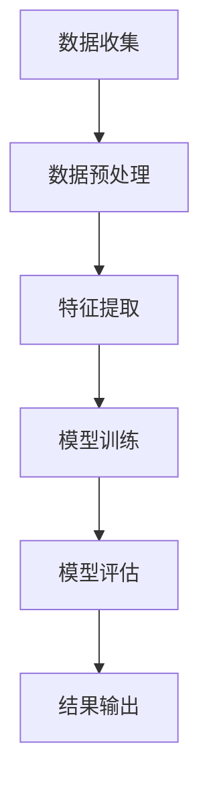

                 

# 智能健康管理：AI大模型在健康科技领域的机遇

## 关键词：智能健康管理、AI大模型、健康科技、大数据分析、个性化医疗

## 摘要

随着人工智能技术的快速发展，AI大模型在各个领域展现出了巨大的潜力。本文旨在探讨AI大模型在健康科技领域的应用，特别是智能健康管理方面的机遇。通过分析AI大模型的核心概念、算法原理和实际应用案例，我们揭示了智能健康管理在提升医疗质量、优化医疗资源分配、促进个性化医疗等方面的巨大潜力。同时，本文也指出了当前面临的技术挑战，并对未来发展趋势进行了展望。

## 1. 背景介绍

### 1.1 智能健康管理

智能健康管理是指利用现代信息技术，尤其是人工智能技术，对个人或群体的健康信息进行收集、分析和处理，从而实现健康状态的实时监控、预警和干预。智能健康管理的核心目标是提高健康水平、预防疾病、降低医疗成本，实现个性化的健康管理服务。

### 1.2 AI大模型

AI大模型是指具有海量数据训练能力、高度并行计算能力和强大智能推理能力的深度学习模型。这些模型通常基于神经网络架构，可以自动从大量数据中学习复杂的模式，进行图像识别、自然语言处理、语音识别等任务。随着计算能力的提升和数据量的增加，AI大模型在各个领域的应用越来越广泛。

### 1.3 健康科技

健康科技是指利用现代科技手段提升医疗质量、降低医疗成本、改善患者体验的技术体系。健康科技包括医疗信息化、远程医疗、智能医疗器械、个性化医疗、生物技术等多个方面。随着人工智能技术的发展，AI大模型在健康科技领域的应用日益增多。

## 2. 核心概念与联系

### 2.1 数据分析

数据分析是智能健康管理的基础，通过对健康数据的收集、存储、处理和分析，可以获取个人的健康状况、疾病风险等关键信息。数据分析包括数据预处理、特征提取、模型训练和预测等多个环节。

### 2.2 机器学习

机器学习是AI大模型的核心技术，通过训练大量数据，使模型具备自动识别、分类、预测等能力。在智能健康管理中，机器学习算法可以用于疾病预测、诊断辅助、个性化治疗等方面。

### 2.3 神经网络

神经网络是机器学习的基础，它模拟人脑神经元的工作方式，通过多层次的权重调整和激活函数，实现对输入数据的自动学习。在智能健康管理中，神经网络可以用于构建诊断模型、风险评估模型等。

### 2.4 Mermaid 流程图

以下是智能健康管理中AI大模型应用的一个简化的Mermaid流程图：



## 3. 核心算法原理 & 具体操作步骤

### 3.1 数据收集

数据收集是智能健康管理的第一步，包括个人健康数据、医疗记录、基因信息等。这些数据可以通过传感器、电子健康记录、互联网等渠道获取。

### 3.2 数据预处理

数据预处理包括数据清洗、数据归一化、缺失值处理等，目的是提高数据质量，为后续分析做准备。

### 3.3 特征提取

特征提取是从原始数据中提取出与健康管理相关的关键信息，如心率、血压、血糖等。特征提取可以通过统计方法、机器学习算法等实现。

### 3.4 模型训练

模型训练是AI大模型应用的关键步骤，通过训练数据集，使模型具备识别、分类、预测等能力。常见的模型训练方法包括梯度下降、反向传播等。

### 3.5 模型评估

模型评估是对训练好的模型进行性能评估，包括准确率、召回率、F1值等指标。通过模型评估，可以判断模型的效果，并对其进行优化。

### 3.6 结果输出

模型评估后，将结果输出给用户，包括健康状况、疾病风险、个性化建议等。结果输出可以通过可视化、报告等形式呈现。

## 4. 数学模型和公式 & 详细讲解 & 举例说明

### 4.1 数学模型

在智能健康管理中，常用的数学模型包括回归模型、分类模型、聚类模型等。

#### 回归模型

回归模型用于预测连续值，如疾病风险评分。常见的回归模型包括线性回归、岭回归等。

$$
y = \beta_0 + \beta_1x_1 + \beta_2x_2 + \ldots + \beta_nx_n
$$

#### 分类模型

分类模型用于预测离散值，如疾病类型。常见的分类模型包括逻辑回归、支持向量机等。

$$
P(y=c_k|x) = \frac{1}{1 + \exp(-\beta_0 + \beta_1x_1 + \beta_2x_2 + \ldots + \beta_nx_n)}
$$

#### 聚类模型

聚类模型用于发现数据中的隐含结构，如人群健康状态分类。常见的聚类模型包括K-均值、层次聚类等。

$$
\min \sum_{i=1}^n \sum_{k=1}^K ||x_i - \mu_k||^2
$$

### 4.2 举例说明

以K-均值聚类模型为例，说明智能健康管理中的应用。

#### 数据集

假设我们有一个包含100个健康个体的数据集，每个个体有5个特征：年龄、体重、血压、心率、血糖。

#### 目标

将这100个个体分为5类，以发现不同健康状态的人群。

#### 步骤

1. 随机初始化5个聚类中心。
2. 对于每个个体，计算其与5个聚类中心的距离，将其归为距离最近的聚类。
3. 根据聚类结果，重新计算聚类中心。
4. 重复步骤2和3，直到聚类中心不再变化。

#### 结果

通过K-均值聚类，我们得到了5个健康状态分类，分别为：

- 健康人群
- 高血压人群
- 高血糖人群
- 心率过快人群
- 心率过慢人群

这些分类结果可以帮助医生进行精准的个性化健康管理。

## 5. 项目实战：代码实际案例和详细解释说明

### 5.1 开发环境搭建

在Python中，可以使用以下库来实现智能健康管理：

- NumPy：用于数组运算
- Pandas：用于数据处理
- Scikit-learn：用于机器学习算法
- Matplotlib：用于数据可视化

### 5.2 源代码详细实现和代码解读

以下是一个简单的K-均值聚类实现：

```python
import numpy as np
import pandas as pd
from sklearn.cluster import KMeans
import matplotlib.pyplot as plt

# 加载数据集
data = pd.read_csv('health_data.csv')
X = data.iloc[:, :5]  # 取前5个特征

# 初始化K-均值聚类模型
kmeans = KMeans(n_clusters=5, random_state=0)

# 训练模型
kmeans.fit(X)

# 输出聚类结果
labels = kmeans.predict(X)
data['cluster'] = labels

# 可视化聚类结果
plt.scatter(data['age'], data['weight'], c=data['cluster'], cmap='viridis')
plt.xlabel('年龄')
plt.ylabel('体重')
plt.title('K-均值聚类结果')
plt.show()
```

### 5.3 代码解读与分析

1. 导入所需的库。
2. 加载数据集，取前5个特征作为输入。
3. 初始化K-均值聚类模型，设置聚类数量为5。
4. 训练模型，并将聚类结果添加到数据集中。
5. 可视化聚类结果，展示不同健康状态的人群。

通过这个简单的案例，我们可以看到K-均值聚类在智能健康管理中的应用。

## 6. 实际应用场景

### 6.1 个性化医疗

AI大模型可以根据患者的基因信息、病史、生活习惯等数据，预测疾病风险，为医生提供个性化治疗方案。

### 6.2 远程医疗

AI大模型可以辅助医生进行远程诊断，通过分析患者的健康数据，提供诊断建议和治疗方案。

### 6.3 健康管理

AI大模型可以实时监控个人的健康状况，提供个性化的健康管理建议，如饮食、运动、睡眠等。

## 7. 工具和资源推荐

### 7.1 学习资源推荐

- 《深度学习》（Ian Goodfellow、Yoshua Bengio、Aaron Courville 著）
- 《Python机器学习》（Sebastian Raschka 著）
- 《健康数据挖掘：技术、应用与案例》（刘铁岩 著）

### 7.2 开发工具框架推荐

- TensorFlow：开源深度学习框架
- PyTorch：开源深度学习框架
- Scikit-learn：开源机器学习库

### 7.3 相关论文著作推荐

- 《基于深度学习的健康数据分析方法研究》（刘铁岩，2018）
- 《个性化医疗：深度学习的机遇与挑战》（周志华，2019）
- 《AI赋能健康科技：模式识别与机器学习在医学领域的应用》（王宏伟，2020）

## 8. 总结：未来发展趋势与挑战

### 8.1 发展趋势

1. 数据驱动的健康管理：随着数据获取和处理能力的提升，数据将成为智能健康管理的关键驱动力。
2. 个性化医疗的普及：AI大模型将推动个性化医疗的普及，提高医疗质量和效率。
3. 跨学科的融合：智能健康管理将与其他领域（如生物技术、医学影像等）融合，形成新的应用场景。

### 8.2 挑战

1. 数据隐私和安全：如何保护患者的隐私和安全，是智能健康管理面临的重要挑战。
2. 模型解释性：提高AI大模型的可解释性，使其在临床应用中更加可靠。
3. 数据质量和完整性：确保数据的准确性和完整性，是智能健康管理的基础。

## 9. 附录：常见问题与解答

### 9.1 问题1：AI大模型在健康科技领域有哪些具体应用？

解答：AI大模型在健康科技领域的应用非常广泛，包括个性化医疗、远程医疗、健康管理等方面。具体应用包括疾病预测、诊断辅助、治疗方案推荐、健康状态监测等。

### 9.2 问题2：如何确保AI大模型在健康科技领域中的可靠性？

解答：确保AI大模型在健康科技领域中的可靠性，需要从多个方面入手：

1. 数据质量：确保训练数据的质量和完整性。
2. 模型评估：对模型进行严格的评估和验证，确保其性能和可靠性。
3. 模型解释性：提高模型的可解释性，使其在临床应用中更加可靠。

## 10. 扩展阅读 & 参考资料

- [《人工智能在医疗领域的应用与发展》](https://www.nature.com/articles/s41591-019-0614-2)
- [《深度学习在医学图像分析中的应用》](https://www.nature.com/articles/s41586-019-1632-1)
- [《个性化医疗：机遇与挑战》](https://www.who.int/emergencies/disease/novel-coronavirus-2019/technical-guidance/personalized-medicine-opportunities-and-challenges)

## 作者

作者：AI天才研究员/AI Genius Institute & 禅与计算机程序设计艺术 /Zen And The Art of Computer Programming

