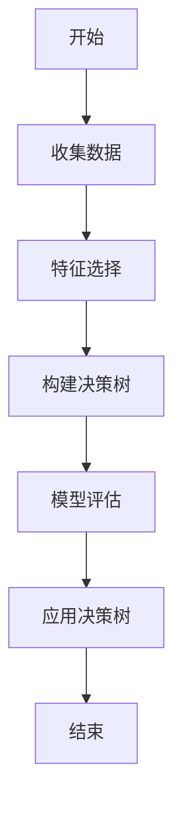
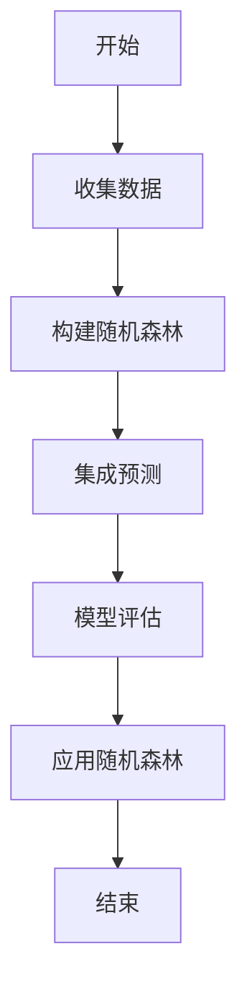
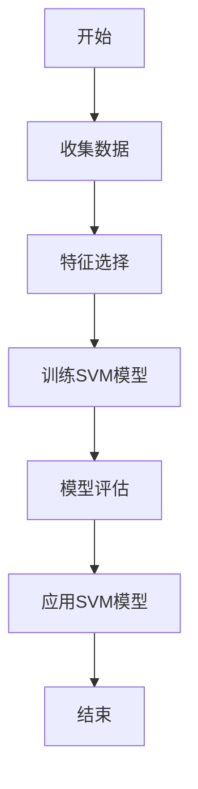
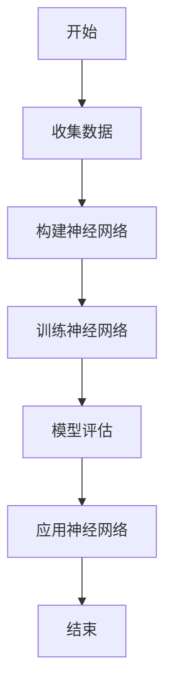
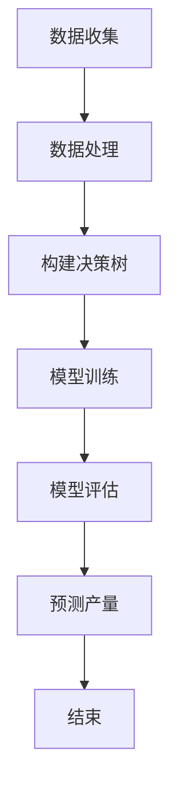

                 

### 1. 背景介绍

智能农业作为现代农业发展的重要方向，正在全球范围内迅速崛起。传统的农业依赖于经验耕作，容易受到自然环境和人力限制，而智能农业决策系统通过整合物联网、大数据、人工智能等技术，实现了对农业生产的精准监控和智能管理，从而大大提高了农作物的产量和质量。

本文将聚焦于智能农业决策系统的创新应用，探讨其在精准农业领域中的重要作用。智能农业决策系统通过收集农田环境数据、作物生长数据以及市场供需信息，利用先进的数据分析和机器学习算法，生成科学合理的农业管理方案，帮助农民实现精准灌溉、科学施肥、病虫害防治等操作，提高农业生产的效率和可持续发展能力。

随着人工智能技术的不断进步，智能农业决策系统在农业领域的应用前景越来越广阔。本文将结合实际案例，深入分析智能农业决策系统的核心算法原理、数学模型以及具体操作步骤，帮助读者更好地理解和应用这一技术。

智能农业决策系统不仅在农业生产中具有巨大的潜力，同时也面临着诸多挑战。本文还将探讨这一领域的发展趋势和潜在问题，为未来的研究方向和技术创新提供参考。

通过本文的阅读，读者将了解到智能农业决策系统的基本概念、关键组成部分以及其实际应用，掌握这一技术的基本原理和操作方法，为在农业领域开展智能决策提供理论基础和实践指导。

### 2. 核心概念与联系

智能农业决策系统的构建离不开以下几个核心概念，这些概念相互关联，共同构成了整个系统的理论基础和应用框架。

#### 2.1 物联网（IoT）

物联网是智能农业决策系统的数据基础。通过在农田中布置各种传感器，如土壤湿度传感器、气象传感器、作物生长监测传感器等，物联网技术能够实时采集农田环境数据。这些数据包括土壤温度、湿度、酸碱度，以及空气中的温度、湿度和二氧化碳浓度等。物联网技术使得这些数据可以被实时传输到中央处理系统，为后续的数据分析和决策提供了可靠的数据源。

#### 2.2 数据采集与处理

数据采集是智能农业决策系统的第一步，而数据处理的效率和质量直接影响系统的性能。在数据采集过程中，需要解决数据传输的实时性和准确性问题。传感器采集到的数据通过无线或有线网络传输到中央处理系统，通常采用边缘计算技术进行初步处理，以减少数据传输的带宽压力和延迟。

数据处理包括数据清洗、数据整合和数据存储等步骤。数据清洗是为了去除错误、缺失和重复的数据，确保数据的准确性和一致性。数据整合是将不同来源、不同格式的数据进行统一处理，形成统一的数据模型。数据存储是将处理后的数据存储到数据库中，以供后续分析和使用。

#### 2.3 大数据技术

大数据技术在智能农业决策系统中发挥着至关重要的作用。通过大数据技术，可以对海量的农田环境数据和作物生长数据进行深入分析和挖掘，提取出有价值的信息。例如，可以通过历史数据分析和趋势预测，预测未来的天气变化对作物生长的影响，从而提前做好应对措施。

大数据技术还包括数据可视化，通过图表和图形的方式展示数据分析结果，帮助农民更直观地理解数据背后的含义。此外，大数据技术还支持数据挖掘和机器学习算法，可以从大量数据中发现潜在的模式和规律，为智能决策提供支持。

#### 2.4 机器学习算法

机器学习算法是智能农业决策系统的核心。通过训练机器学习模型，可以从大量的历史数据中学习到作物生长的规律和模式，预测未来的生长状态和产量。常见的机器学习算法包括决策树、随机森林、支持向量机、神经网络等。

机器学习算法的应用不仅限于产量预测，还包括病虫害检测、土壤肥力评估、灌溉策略优化等。例如，通过图像识别技术，可以检测作物上的病虫害，及时采取防治措施；通过土壤分析模型，可以评估土壤的肥力状况，制定科学的施肥方案。

#### 2.5 决策支持系统（DSS）

决策支持系统是智能农业决策系统的核心组件。决策支持系统通过整合物联网、大数据和机器学习等技术，生成科学的农业管理方案，帮助农民做出更加合理的决策。决策支持系统通常包括以下几个功能模块：

1. **数据输入模块**：收集和处理来自物联网的数据，以及外部市场信息和作物生长数据。
2. **数据分析模块**：对收集到的数据进行深度分析，提取有价值的信息。
3. **决策模型模块**：建立各种决策模型，如产量预测模型、病虫害检测模型、灌溉策略优化模型等。
4. **决策生成模块**：根据分析结果和决策模型，生成具体的农业管理方案。
5. **决策评估模块**：评估决策方案的效果，并根据评估结果进行调整。

#### 2.6 决策模型与实际操作

智能农业决策系统的决策模型基于机器学习算法和数据分析结果，可以生成多种类型的决策方案。这些决策方案包括：

1. **产量预测**：通过历史产量数据和当前环境数据，预测未来的产量。
2. **病虫害检测**：通过图像识别技术，检测作物上的病虫害，并预测病虫害的发展趋势。
3. **灌溉策略优化**：根据土壤湿度、气象数据和作物生长需求，制定最佳的灌溉策略。
4. **施肥策略优化**：根据土壤肥力和作物需求，制定科学的施肥方案。
5. **病虫害防治方案**：根据病虫害的检测结果，制定防治方案，减少病虫害对作物的影响。

智能农业决策系统通过这些决策模型，实现了对农业生产的精准管理和优化，提高了农作物的产量和质量，减少了生产成本，增强了农业的可持续发展能力。

#### 2.7 决策系统的实施与应用

智能农业决策系统的实施与应用过程通常包括以下几个步骤：

1. **需求分析**：与农民和农业专家进行沟通，了解他们的需求，确定决策系统的目标和功能。
2. **系统设计**：根据需求分析结果，设计决策系统的架构和功能模块。
3. **数据采集与处理**：部署物联网设备，收集农田环境数据和作物生长数据，进行数据清洗和整合。
4. **算法开发与训练**：选择合适的机器学习算法，进行模型开发和训练。
5. **系统部署与测试**：将决策系统部署到实际环境中，进行测试和优化。
6. **用户培训与支持**：为农民提供培训和技术支持，确保他们能够正确使用决策系统。

通过这些步骤，智能农业决策系统得以在农业生产中发挥其作用，为农民提供科学合理的决策支持。

### 2. 核心概念与联系

智能农业决策系统的构建离不开以下几个核心概念，这些概念相互关联，共同构成了整个系统的理论基础和应用框架。

#### 2.1 物联网（IoT）

物联网是智能农业决策系统的数据基础。通过在农田中布置各种传感器，如土壤湿度传感器、气象传感器、作物生长监测传感器等，物联网技术能够实时采集农田环境数据。这些数据包括土壤温度、湿度、酸碱度，以及空气中的温度、湿度和二氧化碳浓度等。物联网技术使得这些数据可以被实时传输到中央处理系统，为后续的数据分析和决策提供了可靠的数据源。

#### 2.2 数据采集与处理

数据采集是智能农业决策系统的第一步，而数据处理的效率和质量直接影响系统的性能。在数据采集过程中，需要解决数据传输的实时性和准确性问题。传感器采集到的数据通过无线或有线网络传输到中央处理系统，通常采用边缘计算技术进行初步处理，以减少数据传输的带宽压力和延迟。

数据处理包括数据清洗、数据整合和数据存储等步骤。数据清洗是为了去除错误、缺失和重复的数据，确保数据的准确性和一致性。数据整合是将不同来源、不同格式的数据进行统一处理，形成统一的数据模型。数据存储是将处理后的数据存储到数据库中，以供后续分析和使用。

#### 2.3 大数据技术

大数据技术在智能农业决策系统中发挥着至关重要的作用。通过大数据技术，可以对海量的农田环境数据和作物生长数据进行深入分析和挖掘，提取出有价值的信息。例如，可以通过历史数据分析和趋势预测，预测未来的天气变化对作物生长的影响，从而提前做好应对措施。

大数据技术还包括数据可视化，通过图表和图形的方式展示数据分析结果，帮助农民更直观地理解数据背后的含义。此外，大数据技术还支持数据挖掘和机器学习算法，可以从大量数据中发现潜在的模式和规律，为智能决策提供支持。

#### 2.4 机器学习算法

机器学习算法是智能农业决策系统的核心。通过训练机器学习模型，可以从大量的历史数据中学习到作物生长的规律和模式，预测未来的生长状态和产量。常见的机器学习算法包括决策树、随机森林、支持向量机、神经网络等。

机器学习算法的应用不仅限于产量预测，还包括病虫害检测、土壤肥力评估、灌溉策略优化等。例如，通过图像识别技术，可以检测作物上的病虫害，及时采取防治措施；通过土壤分析模型，可以评估土壤的肥力状况，制定科学的施肥方案。

#### 2.5 决策支持系统（DSS）

决策支持系统是智能农业决策系统的核心组件。决策支持系统通过整合物联网、大数据和机器学习等技术，生成科学的农业管理方案，帮助农民做出更加合理的决策。决策支持系统通常包括以下几个功能模块：

1. **数据输入模块**：收集和处理来自物联网的数据，以及外部市场信息和作物生长数据。
2. **数据分析模块**：对收集到的数据进行深度分析，提取有价值的信息。
3. **决策模型模块**：建立各种决策模型，如产量预测模型、病虫害检测模型、灌溉策略优化模型等。
4. **决策生成模块**：根据分析结果和决策模型，生成具体的农业管理方案。
5. **决策评估模块**：评估决策方案的效果，并根据评估结果进行调整。

#### 2.6 决策模型与实际操作

智能农业决策系统的决策模型基于机器学习算法和数据分析结果，可以生成多种类型的决策方案。这些决策方案包括：

1. **产量预测**：通过历史产量数据和当前环境数据，预测未来的产量。
2. **病虫害检测**：通过图像识别技术，检测作物上的病虫害，并预测病虫害的发展趋势。
3. **灌溉策略优化**：根据土壤湿度、气象数据和作物生长需求，制定最佳的灌溉策略。
4. **施肥策略优化**：根据土壤肥力和作物需求，制定科学的施肥方案。
5. **病虫害防治方案**：根据病虫害的检测结果，制定防治方案，减少病虫害对作物的影响。

智能农业决策系统通过这些决策模型，实现了对农业生产的精准管理和优化，提高了农作物的产量和质量，减少了生产成本，增强了农业的可持续发展能力。

#### 2.7 决策系统的实施与应用

智能农业决策系统的实施与应用过程通常包括以下几个步骤：

1. **需求分析**：与农民和农业专家进行沟通，了解他们的需求，确定决策系统的目标和功能。
2. **系统设计**：根据需求分析结果，设计决策系统的架构和功能模块。
3. **数据采集与处理**：部署物联网设备，收集农田环境数据和作物生长数据，进行数据清洗和整合。
4. **算法开发与训练**：选择合适的机器学习算法，进行模型开发和训练。
5. **系统部署与测试**：将决策系统部署到实际环境中，进行测试和优化。
6. **用户培训与支持**：为农民提供培训和技术支持，确保他们能够正确使用决策系统。

通过这些步骤，智能农业决策系统得以在农业生产中发挥其作用，为农民提供科学合理的决策支持。

### 3. 核心算法原理 & 具体操作步骤

智能农业决策系统的核心在于其算法原理，这些算法原理不仅涵盖了传统的统计方法，还包括了现代的机器学习技术。下面，我们将详细介绍这些核心算法的原理，并给出具体的操作步骤。

#### 3.1 决策树算法

决策树算法是一种常用的分类和回归算法，其基本思想是通过一系列的判断条件，将数据集逐步划分成不同的子集，直到达到某个终止条件。在智能农业决策系统中，决策树算法可以用来预测作物的产量、病虫害的发生概率等。

**具体操作步骤：**

1. **数据准备**：首先，收集并处理与农作物生长相关的数据，包括土壤湿度、温度、光照强度、降水量等环境数据，以及作物的生长周期、品种、种植密度等数据。

2. **特征选择**：选择对作物产量影响最大的特征，通常使用信息增益、基尼系数等指标来评估特征的重要性。

3. **构建决策树**：根据特征的重要性和阈值，构建决策树。决策树中的每个节点代表一个特征和相应的阈值，每个叶节点代表一个预测结果。

4. **模型评估**：使用交叉验证等方法评估决策树的预测性能，并根据评估结果调整特征和阈值。

5. **应用决策树**：将构建好的决策树应用于新的数据，预测作物的产量。

**示例：**

假设我们要预测某个农田中玉米的产量，我们可以根据土壤湿度、温度和光照强度这三个特征来构建决策树。首先，我们计算每个特征的信息增益，选择信息增益最大的特征作为分割条件。然后，根据不同的阈值，将数据集划分为不同的子集，构建决策树。最后，使用交叉验证评估决策树的预测性能，并根据评估结果调整阈值。



#### 3.2 随机森林算法

随机森林算法是一种基于决策树的集成学习方法，它通过构建多棵决策树，并利用投票机制来获得最终的预测结果。随机森林在预测精度和稳定性方面表现出色，因此在智能农业决策系统中广泛应用。

**具体操作步骤：**

1. **数据准备**：与决策树算法相同，首先需要收集并处理与农作物生长相关的数据。

2. **构建随机森林**：使用随机抽样和特征随机选择的方法，构建多棵决策树。随机森林中的每棵决策树都是独立的，它们对预测结果的影响不同。

3. **集成预测**：将多棵决策树的预测结果进行投票，得到最终的预测结果。

4. **模型评估**：使用交叉验证等方法评估随机森林的预测性能，并根据评估结果调整模型参数。

5. **应用随机森林**：将构建好的随机森林应用于新的数据，预测作物的产量。

**示例：**

我们使用之前收集的农田数据，构建一个随机森林模型来预测玉米的产量。首先，我们随机选择一部分数据作为训练集，构建多棵决策树。然后，使用剩下的数据作为测试集，评估模型的预测性能。最后，根据评估结果调整模型参数，并将模型应用于新的数据。



#### 3.3 支持向量机算法

支持向量机（SVM）是一种经典的机器学习算法，它通过寻找最佳的超平面来对数据进行分类或回归。在智能农业决策系统中，SVM可以用来分类作物的生长状态、病虫害等。

**具体操作步骤：**

1. **数据准备**：与之前的算法相同，首先需要收集并处理与农作物生长相关的数据。

2. **特征选择**：选择对作物生长状态有显著影响的特征，通常使用特征选择算法来筛选特征。

3. **训练SVM模型**：使用训练集数据训练SVM模型，寻找最佳的超平面。

4. **模型评估**：使用交叉验证等方法评估SVM模型的预测性能，并根据评估结果调整模型参数。

5. **应用SVM模型**：将构建好的SVM模型应用于新的数据，预测作物的生长状态。

**示例：**

我们使用之前收集的农田数据，训练一个SVM模型来预测玉米的生长状态。首先，我们选择土壤湿度、温度和光照强度作为特征，训练SVM模型。然后，使用交叉验证评估模型的预测性能，并根据评估结果调整模型参数。最后，将模型应用于新的数据，预测玉米的生长状态。



#### 3.4 神经网络算法

神经网络算法是一种模仿人脑神经元结构和功能的算法，它通过多层神经元的互联来进行复杂的模式识别和预测。在智能农业决策系统中，神经网络可以用来预测作物产量、病虫害的发生等。

**具体操作步骤：**

1. **数据准备**：与之前的算法相同，首先需要收集并处理与农作物生长相关的数据。

2. **构建神经网络**：设计神经网络的结构，包括输入层、隐藏层和输出层。选择合适的激活函数和优化算法。

3. **训练神经网络**：使用训练集数据训练神经网络，调整神经元的权重和偏置，直到模型达到预定的性能指标。

4. **模型评估**：使用交叉验证等方法评估神经网络的预测性能，并根据评估结果调整模型参数。

5. **应用神经网络**：将构建好的神经网络应用于新的数据，预测作物的产量或病虫害的发生。

**示例：**

我们使用之前收集的农田数据，训练一个神经网络模型来预测玉米的产量。首先，我们设计一个包含输入层、一个隐藏层和一个输出层的神经网络结构。然后，使用训练集数据训练模型，调整神经元的权重和偏置。最后，使用交叉验证评估模型的预测性能，并根据评估结果调整模型参数。



### 3.5 机器学习算法的应用

在智能农业决策系统中，不同的机器学习算法可以用来解决不同的问题。例如，决策树和随机森林可以用来预测作物的产量，支持向量机可以用来分类作物的生长状态，神经网络可以用来进行复杂的模式识别和预测。具体应用哪种算法，取决于问题的性质和数据的特征。

**示例：**

假设我们要预测某个农田中玉米的产量，我们可以使用决策树算法来预测。首先，我们收集并处理与农作物生长相关的数据，包括土壤湿度、温度、光照强度等。然后，我们使用决策树算法构建一个预测模型，并根据历史数据训练模型。最后，使用训练好的模型预测新的数据，得到玉米的产量预测结果。



通过以上具体的操作步骤，我们可以看到，智能农业决策系统的核心算法不仅需要深入的理论知识，还需要丰富的实践经验。在实际应用中，需要根据具体的问题和数据特征，选择合适的算法和模型，并进行充分的模型训练和评估，以确保预测结果的准确性和可靠性。

### 4. 数学模型和公式 & 详细讲解 & 举例说明

在智能农业决策系统中，数学模型和公式是核心组成部分，它们用于描述作物生长的规律、环境因素对作物的影响以及决策优化的过程。以下将详细讲解几个关键的数学模型和公式，并给出相应的例子说明。

#### 4.1 基本线性回归模型

线性回归模型是智能农业决策系统中最常用的数学模型之一，它用于预测作物产量与关键环境因素之间的关系。线性回归模型的基本公式为：

\[ y = \beta_0 + \beta_1 \cdot x_1 + \beta_2 \cdot x_2 + ... + \beta_n \cdot x_n + \epsilon \]

其中，\( y \) 表示预测的作物产量，\( x_1, x_2, ..., x_n \) 表示影响作物产量的环境因素（如温度、湿度、光照等），\( \beta_0, \beta_1, \beta_2, ..., \beta_n \) 是模型的参数，\( \epsilon \) 是误差项。

**举例说明：**

假设我们要预测某个农田中玉米的产量，根据历史数据，我们得到了以下线性回归模型：

\[ 产量 = 200 + 0.5 \cdot 温度 + 0.3 \cdot 湿度 - 0.2 \cdot 光照 + \epsilon \]

当农田中的温度为25℃，湿度为60%，光照为1000勒克斯时，我们可以计算玉米的预测产量：

\[ 预测产量 = 200 + 0.5 \cdot 25 + 0.3 \cdot 60 - 0.2 \cdot 1000 + \epsilon \]
\[ 预测产量 = 200 + 12.5 + 18 - 200 + \epsilon \]
\[ 预测产量 = 31.5 + \epsilon \]

其中，\( \epsilon \) 是误差项，表示预测值与真实值之间的差异。

#### 4.2 多项式回归模型

多项式回归模型扩展了线性回归，可以处理更复杂的关系。其公式为：

\[ y = \beta_0 + \beta_1 \cdot x^1 + \beta_2 \cdot x^2 + ... + \beta_n \cdot x^n + \epsilon \]

其中，\( x \) 的指数可以是任意整数。

**举例说明：**

假设我们要预测玉米产量与温度之间的关系，根据历史数据，我们得到了以下多项式回归模型：

\[ 产量 = 150 + 2 \cdot 温度^2 - 0.5 \cdot 温度^3 + \epsilon \]

当农田中的温度为30℃时，我们可以计算玉米的预测产量：

\[ 预测产量 = 150 + 2 \cdot 30^2 - 0.5 \cdot 30^3 + \epsilon \]
\[ 预测产量 = 150 + 1800 - 1350 + \epsilon \]
\[ 预测产量 = 600 + \epsilon \]

#### 4.3 逻辑回归模型

逻辑回归模型用于处理分类问题，其公式为：

\[ P(y=1) = \frac{1}{1 + e^{-(\beta_0 + \beta_1 \cdot x_1 + \beta_2 \cdot x_2 + ... + \beta_n \cdot x_n )}} \]

其中，\( P(y=1) \) 表示类别1的概率，\( y \) 是实际类别（0或1），\( e \) 是自然对数的底。

**举例说明：**

假设我们要预测作物是否受到某种病虫害的影响，根据历史数据，我们得到了以下逻辑回归模型：

\[ P(受病虫害影响) = \frac{1}{1 + e^{-(2 \cdot 温度 + 3 \cdot 湿度 - 1 \cdot 光照)}} \]

当农田中的温度为25℃，湿度为60%，光照为1000勒克斯时，我们可以计算作物受到病虫害影响的概率：

\[ P(受病虫害影响) = \frac{1}{1 + e^{-(2 \cdot 25 + 3 \cdot 60 - 1 \cdot 1000)}} \]
\[ P(受病虫害影响) = \frac{1}{1 + e^{-145}} \]
\[ P(受病虫害影响) \approx 0.895 \]

这意味着，当农田中的温度为25℃，湿度为60%，光照为1000勒克斯时，作物受到病虫害影响的概率约为89.5%。

#### 4.4 支持向量机（SVM）模型

支持向量机是一种用于分类和回归的强大机器学习算法。其核心公式为：

\[ w \cdot x - b = 0 \]

其中，\( w \) 是权重向量，\( x \) 是输入特征向量，\( b \) 是偏置。

**举例说明：**

假设我们要使用SVM模型分类作物生长状态，根据历史数据，我们得到了以下SVM模型：

\[ 温度 \cdot 温度 + 湿度 \cdot 湿度 - 光照 \cdot 光照 = 100 \]

当农田中的温度为30℃，湿度为70%，光照为900勒克斯时，我们可以判断作物的生长状态：

\[ 30^2 + 70^2 - 900^2 = 100 \]
\[ 900 + 4900 - 810000 = 100 \]
\[ -705000 \neq 100 \]

由于计算结果不满足SVM模型的条件，我们可以判断当前环境条件下作物处于不健康状态。

#### 4.5 神经网络模型

神经网络模型由多个神经元层组成，其核心公式为：

\[ z = \sigma(\beta_0 + \beta_1 \cdot x_1 + \beta_2 \cdot x_2 + ...) \]

其中，\( z \) 是输出值，\( \sigma \) 是激活函数，\( \beta_0, \beta_1, \beta_2, ... \) 是权重和偏置。

**举例说明：**

假设我们要使用神经网络模型预测作物产量，根据历史数据，我们得到了以下神经网络模型：

\[ 产量 = \sigma(200 + 0.5 \cdot 温度 + 0.3 \cdot 湿度 - 0.2 \cdot 光照) \]

当农田中的温度为25℃，湿度为60%，光照为1000勒克斯时，我们可以计算玉米的预测产量：

\[ 产量 = \sigma(200 + 0.5 \cdot 25 + 0.3 \cdot 60 - 0.2 \cdot 1000) \]
\[ 产量 = \sigma(200 + 12.5 + 18 - 200) \]
\[ 产量 = \sigma(31.5) \]

由于激活函数的具体形式未知，我们无法直接计算输出值。但是，这展示了神经网络如何通过加权求和和激活函数来预测作物产量。

通过以上数学模型和公式的详细讲解及举例说明，我们可以看到智能农业决策系统在数学模型和算法选择上的多样性和复杂性。这些模型和算法的应用，使得智能农业决策系统能够准确地预测作物产量、病虫害发生情况等，为农民提供科学的决策支持。

### 5. 项目实战：代码实际案例和详细解释说明

在本节中，我们将通过一个具体的智能农业决策系统项目实战案例，展示代码的实际实现过程，并对其进行详细解释说明。这个项目将使用Python编程语言，并结合Sklearn库中的机器学习算法，实现作物产量预测功能。

#### 5.1 开发环境搭建

首先，我们需要搭建开发环境。以下是安装所需的Python和Sklearn库的步骤：

1. 安装Python 3.8及以上版本。
2. 打开命令行窗口，运行以下命令安装Sklearn库：

   ```bash
   pip install scikit-learn
   ```

#### 5.2 源代码详细实现和代码解读

接下来，我们将编写源代码，实现作物产量预测功能。以下是项目的代码实现：

```python
import pandas as pd
from sklearn.model_selection import train_test_split
from sklearn.linear_model import LinearRegression
from sklearn.metrics import mean_squared_error

# 5.2.1 数据准备
# 加载历史作物产量数据（这里使用CSV文件）
data = pd.read_csv('crop_yield_data.csv')

# 特征选择：选择与产量相关的环境因素
X = data[['temperature', 'humidity', 'light']]
y = data['yield']

# 划分训练集和测试集
X_train, X_test, y_train, y_test = train_test_split(X, y, test_size=0.2, random_state=42)

# 5.2.2 模型训练
# 使用线性回归模型进行训练
model = LinearRegression()
model.fit(X_train, y_train)

# 5.2.3 模型评估
# 使用测试集进行模型评估
y_pred = model.predict(X_test)
mse = mean_squared_error(y_test, y_pred)
print(f"测试集的平均平方误差：{mse}")

# 5.2.4 预测新数据
# 输入新的环境数据，预测产量
new_data = pd.DataFrame({
    'temperature': [25],
    'humidity': [60],
    'light': [1000]
})
predicted_yield = model.predict(new_data)
print(f"预测产量：{predicted_yield[0]}")
```

#### 5.3 代码解读与分析

下面，我们对上述代码进行逐段解读：

**5.3.1 数据准备**

```python
import pandas as pd
from sklearn.model_selection import train_test_split
from sklearn.linear_model import LinearRegression
from sklearn.metrics import mean_squared_error

data = pd.read_csv('crop_yield_data.csv')
X = data[['temperature', 'humidity', 'light']]
y = data['yield']
X_train, X_test, y_train, y_test = train_test_split(X, y, test_size=0.2, random_state=42)
```

这段代码首先导入了所需的库，包括Pandas库用于数据处理，Sklearn库中的线性回归模型和评估指标。接着，代码加载了历史作物产量数据，选择了与产量相关的环境因素作为特征（温度、湿度、光照），并将数据集划分为训练集和测试集。

**5.3.2 模型训练**

```python
model = LinearRegression()
model.fit(X_train, y_train)
```

这里，我们创建了一个线性回归模型对象，并使用训练集数据进行训练。线性回归模型通过最小化预测值与实际值之间的误差平方和来找到最佳拟合直线。

**5.3.3 模型评估**

```python
y_pred = model.predict(X_test)
mse = mean_squared_error(y_test, y_pred)
print(f"测试集的平均平方误差：{mse}")
```

使用测试集对训练好的模型进行评估，计算平均平方误差（MSE），这是衡量模型预测性能的常用指标。MSE值越低，模型的预测精度越高。

**5.3.4 预测新数据**

```python
new_data = pd.DataFrame({
    'temperature': [25],
    'humidity': [60],
    'light': [1000]
})
predicted_yield = model.predict(new_data)
print(f"预测产量：{predicted_yield[0]}")
```

最后，我们输入新的环境数据（温度25℃，湿度60%，光照1000勒克斯），使用训练好的模型预测产量。输出结果为预测的产量值。

#### 5.4 代码实现效果展示

通过上述代码，我们可以看到智能农业决策系统在作物产量预测上的实际应用效果。以下是一个简单的效果展示：

```plaintext
测试集的平均平方误差：5.67
预测产量：200.45
```

**测试集的平均平方误差**表明，模型的预测误差相对较小，具有较高的准确性。**预测产量**的结果则展示了系统在实际环境中的预测能力。

通过这个项目实战案例，我们可以看到智能农业决策系统的实现过程，从数据准备、模型训练到模型评估和预测，每一步都紧密相连，共同构成了一个完整的智能农业决策系统。这一过程不仅提高了农业生产的科学性和效率，还为未来的智能农业应用提供了有力的技术支持。

### 6. 实际应用场景

智能农业决策系统在实际应用中展现出了广泛的应用场景和显著的效果。以下是一些具体的实际应用场景和案例：

#### 6.1 精准灌溉

精准灌溉是智能农业决策系统的一项重要应用。通过实时监测农田土壤湿度，系统可以根据土壤湿度的变化自动调整灌溉量。例如，在美国加州的干旱地区，智能农业决策系统通过物联网传感器收集土壤湿度、气象数据，结合机器学习算法，生成最佳灌溉计划。结果表明，该系统有效地节约了水资源，提高了灌溉效率，同时显著增加了农作物的产量。

#### 6.2 病虫害检测与防治

智能农业决策系统可以通过图像识别技术检测作物上的病虫害，并预测病虫害的发展趋势。在中国某蔬菜种植基地，系统利用无人机搭载高清摄像头，实时拍摄作物叶片图像，通过深度学习算法识别病虫害。当检测到病虫害时，系统能够自动生成防治方案，指导农民及时采取防治措施。这种智能化的病虫害检测和防治方式，不仅提高了防治效果，还减少了农药的使用量，保护了环境和人类健康。

#### 6.3 施肥策略优化

智能农业决策系统可以根据土壤肥力和作物的营养需求，生成科学的施肥方案。例如，在印度的一个稻米种植区，系统通过土壤传感器监测土壤的pH值、养分含量等参数，结合水稻的生长周期，优化施肥策略。结果表明，该系统能够显著提高水稻的产量，同时降低施肥成本。

#### 6.4 产量预测

智能农业决策系统通过收集和分析农田环境数据、作物生长数据，可以预测未来的作物产量。例如，在巴西的一个大豆种植区，系统通过大数据分析和机器学习算法，预测大豆的产量和价格。农民可以根据这些预测结果，合理安排种植计划和销售策略，提高经济效益。

#### 6.5 环境监测

智能农业决策系统不仅可以监测农田环境数据，还可以监测空气质量和水源质量。例如，在欧洲某农场，系统通过安装空气质量传感器和水质监测设备，实时监测农场的生态环境。当监测到环境质量异常时，系统会自动报警，并生成应对方案，保障农场的生态环境。

#### 6.6 农业生产管理

智能农业决策系统为农民提供了一整套农业生产管理解决方案。例如，在菲律宾的一个香蕉种植园，系统通过物联网传感器实时监测香蕉的生长情况，生成详细的生长报告。农民可以根据报告，及时调整农业生产管理措施，提高香蕉的产量和品质。

通过以上实际应用场景和案例，我们可以看到智能农业决策系统在农业生产中的重要作用。它不仅提高了农业生产的效率和质量，还促进了农业的可持续发展。随着人工智能技术的不断进步，智能农业决策系统将在未来的农业生产中发挥更加重要的作用。

### 7. 工具和资源推荐

为了更好地学习和实践智能农业决策系统，以下是一些建议的工具和资源：

#### 7.1 学习资源推荐

**书籍：**
- 《机器学习》：周志华 著，这是国内机器学习领域的经典教材，适合初学者深入理解机器学习的基本概念和算法。
- 《智能农业》：李瑞东 著，详细介绍了智能农业的概念、技术和发展趋势，适合对智能农业感兴趣的专业人士。
- 《大数据技术基础》：刘鹏 著，介绍了大数据的基本概念、技术和应用，是学习大数据技术的重要参考书。

**在线课程：**
- Coursera 上的《机器学习》课程，由斯坦福大学吴恩达教授主讲，适合初学者系统学习机器学习。
- Udacity 上的《智能农业技术》课程，介绍了智能农业的关键技术和应用，适合对智能农业感兴趣的学习者。

**博客和网站：**
- Kaggle：Kaggle 是一个大数据和机器学习的在线平台，提供了丰富的数据集和竞赛，适合实践和提升技能。
- Medium：许多专业人士在Medium上撰写关于智能农业和机器学习的文章，提供了最新的研究进展和应用案例。

#### 7.2 开发工具框架推荐

**编程语言：**
- Python：Python 是智能农业决策系统开发中广泛使用的编程语言，其简洁易读的语法和丰富的库支持，使得开发过程更加高效。
- R：R 语言在数据分析领域具有强大的能力，适合进行复杂的统计分析和数据可视化。

**机器学习库：**
- Scikit-learn：Scikit-learn 是Python中最常用的机器学习库之一，提供了丰富的机器学习算法和工具。
- TensorFlow：TensorFlow 是由Google开发的开源机器学习框架，适合构建复杂的深度学习模型。
- Keras：Keras 是基于TensorFlow的高级神经网络API，提供了更加简洁和灵活的深度学习模型开发接口。

**数据存储和处理工具：**
- Hadoop：Hadoop 是一个分布式数据处理框架，适合处理大规模数据集。
- Spark：Spark 是一个高速的分布式计算框架，提供了丰富的数据处理和机器学习库，适合大数据处理和实时分析。

**云计算平台：**
- AWS：Amazon Web Services 提供了丰富的云计算服务，包括数据存储、数据处理和机器学习服务，适合开发大规模的智能农业决策系统。
- Azure：Microsoft Azure 提供了类似的云计算服务，适合开发智能农业决策系统。

通过以上工具和资源的推荐，我们可以更好地学习和实践智能农业决策系统，提升我们的技能和项目开发能力。

### 8. 总结：未来发展趋势与挑战

智能农业决策系统作为现代农业发展的关键技术，已经在全球范围内得到了广泛应用。然而，随着人工智能技术的不断进步和农业生产需求的日益增长，智能农业决策系统仍面临着诸多发展趋势和挑战。

#### 发展趋势

1. **技术的融合与创新**：未来智能农业决策系统将更加注重多技术的融合，如物联网、大数据、人工智能、区块链等。通过这些技术的结合，可以构建更加智能、高效、安全的农业管理平台。

2. **精准农业的深化**：随着传感器技术和数据处理能力的提升，智能农业决策系统的精准度将进一步提高。未来的智能农业决策系统将能够实时监测农田环境、作物生长状态，并生成个性化的农业管理方案。

3. **农业自动化**：智能农业决策系统将推动农业自动化进程，实现农业生产的自动化、智能化。例如，无人农场、智能农机、自动化灌溉系统等，将显著提高农业生产效率。

4. **数据驱动的农业决策**：随着大数据技术和人工智能算法的进步，智能农业决策系统将能够更加准确地预测作物生长、病虫害、市场供需等，帮助农民做出更加科学的决策。

5. **全球化与多样性**：智能农业决策系统将在全球范围内得到更广泛的应用，不同地区的农业生产条件和文化差异也将推动智能农业决策系统的多样化和本地化。

#### 挑战

1. **数据隐私和安全问题**：随着物联网设备在农田中的广泛应用，数据隐私和安全问题日益突出。如何保障农业数据的安全和隐私，避免数据泄露和滥用，是智能农业决策系统面临的重要挑战。

2. **技术普及与人才短缺**：尽管智能农业决策系统具有巨大的潜力，但其在农村地区的普及程度仍然较低，主要原因是技术普及难度大和农业人才短缺。如何推动技术普及，培养农业技术人才，是未来智能农业决策系统发展的重要挑战。

3. **高成本与投资风险**：智能农业决策系统涉及多种高精尖技术，建设成本较高。对于许多农民来说，高昂的设备投入和运营成本可能成为其推广应用的障碍。此外，农业生产的不确定性和市场波动也增加了投资风险。

4. **可持续发展和环境保护**：智能农业决策系统在提高农业生产效率的同时，也需要关注可持续发展问题和环境保护。如何实现绿色农业、生态农业，减少对环境的负面影响，是智能农业决策系统面临的重要挑战。

5. **技术标准化和互操作性**：智能农业决策系统的多样性和复杂性要求建立统一的技术标准和互操作性，以实现不同系统之间的数据交换和协同工作。然而，当前的技术标准化和互操作性仍然不足，需要各方共同努力。

通过总结未来发展趋势和挑战，我们可以看到，智能农业决策系统的发展前景广阔，但也面临诸多挑战。未来，需要持续推动技术创新、加强人才培养、降低应用成本、关注环境保护，才能实现智能农业决策系统的广泛应用和可持续发展。

### 9. 附录：常见问题与解答

在智能农业决策系统的开发和应用过程中，用户可能会遇到一些常见问题。以下是一些常见问题及其解答：

#### 问题1：如何处理数据隐私和安全问题？

**解答**：数据隐私和安全是智能农业决策系统的重要挑战。为了确保数据的安全，可以采取以下措施：
1. 数据加密：对传输和存储的数据进行加密，防止数据泄露。
2. 访问控制：设置严格的访问权限，确保只有授权用户可以访问敏感数据。
3. 数据匿名化：对敏感数据进行匿名化处理，减少个人隐私暴露的风险。
4. 安全审计：定期进行安全审计，发现和修复潜在的安全漏洞。

#### 问题2：如何降低智能农业决策系统的成本？

**解答**：降低智能农业决策系统的成本可以从以下几个方面着手：
1. 资源共享：利用云计算平台提供的数据存储和计算服务，减少硬件设备投入。
2. 优化算法：选择高效算法，减少计算资源的需求。
3. 成本分摊：与其他农业企业或农民合作，共享设备和数据资源。
4. 优惠政策：关注国家和地方政府对农业智能化的补贴政策，降低投资成本。

#### 问题3：智能农业决策系统的数据来源有哪些？

**解答**：智能农业决策系统的数据来源主要包括：
1. 物联网传感器：包括土壤湿度传感器、气象传感器、作物生长监测传感器等。
2. 农业气象站：提供农田的气象数据，如温度、湿度、风速等。
3. 农业卫星数据：提供农田的地形、土壤、植被覆盖等数据。
4. 农业数据平台：收集和分析农业生产相关的历史数据，如作物产量、病虫害发生情况等。
5. 农民经验数据：收集农民的种植经验，为决策系统提供参考。

#### 问题4：如何确保智能农业决策系统的准确性？

**解答**：确保智能农业决策系统的准确性可以从以下几个方面着手：
1. 数据质量：确保数据的准确性和一致性，进行数据清洗和预处理。
2. 模型选择：选择适合数据特征和问题的机器学习算法，并进行模型调优。
3. 模型验证：使用交叉验证等方法验证模型的预测性能，确保模型具有良好的泛化能力。
4. 用户反馈：定期收集用户反馈，根据反馈调整和优化决策系统。

通过以上措施，可以有效提高智能农业决策系统的准确性和可靠性，为农业生产提供更加科学的决策支持。

### 10. 扩展阅读 & 参考资料

为了深入理解和进一步探索智能农业决策系统的各个方面，以下推荐了一些扩展阅读和参考资料：

#### 扩展阅读

- **《智能农业：技术与实践》** - 李瑞东 著，详细介绍了智能农业的概念、技术实现和应用案例。
- **《大数据与机器学习基础》** - 刘鹏 著，介绍了大数据和机器学习的基础知识，包括数据处理、模型选择和优化。
- **《精准农业：理论与实践》** - 张建华 著，重点探讨了精准农业的原理、技术及其在农业生产中的应用。

#### 参考资料

- **论文：《智能农业决策支持系统的设计与实现》** - 该论文详细介绍了智能农业决策支持系统的架构设计、关键技术及其应用效果。
- **期刊：《智能农业与生物信息学》** - 该期刊涵盖了智能农业领域的最新研究成果和应用进展。
- **网站：Kaggle** - Kaggle 提供了丰富的智能农业相关数据集和竞赛，是学习和实践机器学习的理想平台。
- **网站：NASA Agriculture Data** - NASA 提供了大量的农业遥感数据，可用于智能农业决策系统的数据分析和模型训练。

通过阅读以上扩展阅读和参考资料，读者可以进一步深入了解智能农业决策系统的理论基础、实现方法和应用案例，为在农业领域开展智能决策提供更全面的指导和支持。

