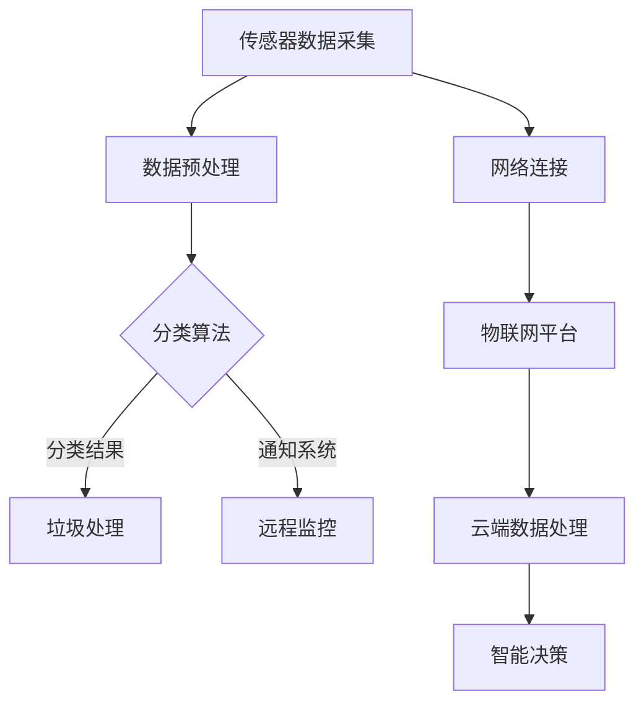
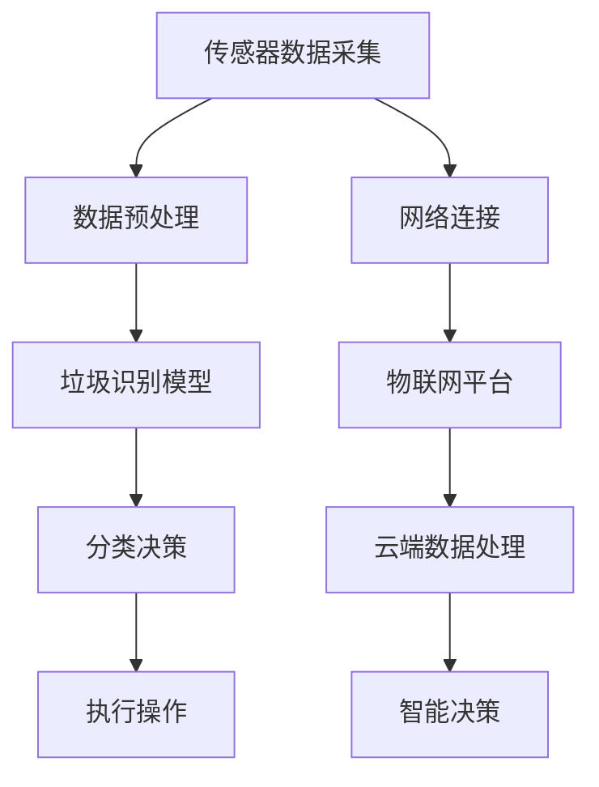

                 

# 智能垃圾桶的环保管理与注意力经济

## 关键词：智能垃圾桶、环保管理、注意力经济、物联网、人工智能

## 摘要

本文将探讨智能垃圾桶在现代环保管理中的应用及其带来的注意力经济效应。首先，介绍智能垃圾桶的背景和功能，分析其在环保管理和资源回收中的作用。接着，阐述智能垃圾桶与物联网、人工智能的融合，探讨其技术原理和核心算法。然后，通过具体案例展示智能垃圾桶的实际应用，分析其在城市环境管理中的价值。最后，讨论智能垃圾桶未来的发展趋势与挑战，提出解决方案和展望。希望通过本文的探讨，能为智能垃圾桶的研究和应用提供新的思路和启示。

## 1. 背景介绍

智能垃圾桶，作为一种结合物联网和人工智能技术的环保设备，近年来在全球范围内得到广泛关注。其起源可以追溯到20世纪末，当时研究人员开始探索如何利用先进技术提高城市垃圾回收的效率和环保性。

智能垃圾桶的主要功能包括：实时监测垃圾桶的填满程度、自动分类垃圾、智能识别垃圾种类、远程数据传输等。这些功能使得智能垃圾桶不仅能够提高垃圾回收的效率，还能有效减少环境污染。

智能垃圾桶的应用场景十分广泛，包括但不限于以下几方面：

- **城市环境管理**：智能垃圾桶能够实时监测垃圾桶的填满程度，及时通知环卫工人进行垃圾清理，减少城市垃圾堆积的现象，提升城市环境质量。
- **资源回收**：通过智能垃圾桶的自动分类功能，可以将垃圾进行有效的分类回收，提高资源利用率，降低环境污染。
- **智能社区**：智能垃圾桶的广泛应用有助于构建智能社区，提升居民生活质量，为城市可持续发展提供支持。
- **商业应用**：智能垃圾桶可以在商场、超市等商业场所使用，提高垃圾回收效率，减少运营成本，同时提升企业形象。

总之，智能垃圾桶作为一种新兴的环保设备，具有广阔的应用前景，对于推动城市环保管理和可持续发展具有重要意义。

## 2. 核心概念与联系

### 智能垃圾桶技术原理

智能垃圾桶的技术原理主要涉及物联网和人工智能两个核心领域。物联网技术通过传感器、通信模块和网络连接，实现了对垃圾桶状态信息的实时采集和传输；而人工智能技术则通过对这些数据进行处理和分析，实现了垃圾的自动分类和智能管理。

#### 物联网技术

物联网（IoT）技术是智能垃圾桶实现实时监测和远程控制的基础。其主要组成部分包括传感器、通信模块和网络连接。

- **传感器**：智能垃圾桶内部装有多种传感器，如红外传感器、重量传感器等，用于检测垃圾桶的填满程度、垃圾分类等信息。
- **通信模块**：智能垃圾桶通过通信模块与网络连接，如Wi-Fi、蓝牙、蜂窝网络等，实现数据的实时传输和远程监控。
- **网络连接**：通过物联网平台，将智能垃圾桶的数据接入云端，实现大规模数据管理和分析。

#### 人工智能技术

人工智能（AI）技术在智能垃圾桶中的应用主要体现在数据分析和决策支持方面。通过对传感器数据的处理和分析，人工智能技术能够实现垃圾的自动分类和智能管理。

- **数据预处理**：对传感器采集到的原始数据进行清洗、去噪和特征提取，为后续分析提供高质量的数据基础。
- **机器学习算法**：利用机器学习算法，如支持向量机、决策树、神经网络等，对垃圾进行自动分类。
- **智能决策**：根据分析结果，智能垃圾桶可以自动调整垃圾处理策略，如调整分类方式、通知环卫工人等。

### Mermaid 流程图

以下是智能垃圾桶的技术原理 Mermaid 流程图：



在该流程图中，传感器数据采集是整个过程的起点，通过数据预处理、分类算法和智能决策等环节，最终实现垃圾的自动分类和智能管理。同时，网络连接和云端数据处理为整个过程提供了技术支持。

### 智能垃圾桶与环保管理的关系

智能垃圾桶在环保管理中发挥着重要作用，主要体现在以下几个方面：

- **提高垃圾回收效率**：通过实时监测垃圾桶的填满程度，智能垃圾桶能够及时通知环卫工人进行垃圾清理，减少城市垃圾堆积的现象，从而提高垃圾回收效率。
- **促进垃圾分类回收**：智能垃圾桶的自动分类功能能够有效区分可回收物、有害垃圾、厨余垃圾等，提高资源利用率，降低环境污染。
- **提升城市环境质量**：智能垃圾桶的应用有助于减少垃圾堆积现象，降低城市环境污染，提升城市环境质量。
- **推动城市可持续发展**：智能垃圾桶作为一种环保设备，能够为城市可持续发展提供技术支持，有助于实现绿色低碳发展目标。

### 智能垃圾桶与注意力经济的关系

注意力经济是一种基于用户注意力资源的商业模式，其核心在于吸引和保持用户的注意力。智能垃圾桶通过物联网和人工智能技术，实现了对城市垃圾处理的智能化和高效化，从而吸引了大量的用户关注。

- **提升用户体验**：智能垃圾桶的应用提升了用户的环保意识和垃圾分类参与度，吸引了大量用户的关注和参与，为城市环保事业提供了有力支持。
- **创造经济价值**：智能垃圾桶的广泛应用带动了相关产业链的发展，如传感器制造、物联网平台建设、垃圾分类设备生产等，创造了巨大的经济价值。
- **促进绿色消费**：智能垃圾桶的推广有助于引导消费者养成绿色生活习惯，促进绿色消费，为可持续发展注入新动力。

总之，智能垃圾桶在环保管理和注意力经济中具有重要作用，其应用前景广阔，将为城市可持续发展和社会进步带来深远影响。

### 总结

智能垃圾桶作为一种结合物联网和人工智能技术的环保设备，具有实时监测、自动分类、远程监控等功能，能够有效提高城市垃圾回收效率，促进垃圾分类回收，提升城市环境质量。同时，智能垃圾桶的应用还吸引了大量用户关注，创造了经济价值，促进了绿色消费。因此，智能垃圾桶在环保管理和注意力经济中具有重要的战略意义。未来，随着技术的不断进步和应用场景的拓展，智能垃圾桶有望在全球范围内得到更广泛的应用，为城市可持续发展和社会进步作出更大贡献。

## 3. 核心算法原理 & 具体操作步骤

智能垃圾桶的核心算法主要涉及垃圾识别和自动分类两个方面。以下是具体操作步骤和技术原理：

### 3.1 垃圾识别算法

#### 3.1.1 数据采集与预处理

1. **传感器数据采集**：智能垃圾桶内部装有多种传感器，如红外传感器、重量传感器、图像传感器等，用于采集垃圾桶的填满程度、垃圾分类等信息。

2. **数据预处理**：对采集到的原始数据进行清洗、去噪和特征提取，为后续分析提供高质量的数据基础。

   - **清洗**：去除异常值和噪声，保证数据的一致性和可靠性。
   - **去噪**：对图像、音频等数据进行去噪处理，提高数据质量。
   - **特征提取**：提取数据的主要特征，如图像中的颜色、纹理、形状等，为分类算法提供输入。

#### 3.1.2 垃圾分类算法

1. **分类算法选择**：根据垃圾识别的精度和效率要求，选择合适的分类算法。常用的分类算法包括支持向量机（SVM）、决策树（DT）、随机森林（RF）和深度学习（DL）等。

2. **模型训练与优化**：使用预处理后的数据集对分类模型进行训练，通过交叉验证和超参数调整，优化模型性能。

3. **模型评估与验证**：对训练好的模型进行评估和验证，确保其分类精度和泛化能力。

### 3.2 自动分类算法

#### 3.2.1 图像识别技术

1. **图像预处理**：对采集到的图像进行预处理，如灰度化、二值化、滤波等，提高图像质量。

2. **特征提取**：提取图像的主要特征，如颜色、纹理、形状等，为分类算法提供输入。

3. **分类算法应用**：使用分类算法对图像进行分类，常见的分类算法包括SVM、DT、RF和DL等。

#### 3.2.2 垃圾自动分类

1. **分类决策**：根据分类算法的结果，对垃圾进行自动分类，如将可回收物、有害垃圾、厨余垃圾等分类到相应的垃圾桶。

2. **执行分类操作**：智能垃圾桶根据分类结果，自动执行相应的分类操作，如将可回收物推送到可回收物垃圾桶，将有害垃圾推送到有害垃圾桶等。

### 3.3 数据分析与反馈优化

1. **实时数据分析**：智能垃圾桶对实时采集到的数据进行处理和分析，如垃圾桶的填满程度、垃圾分类效果等。

2. **反馈优化**：根据分析结果，智能垃圾桶可以自动调整垃圾处理策略，如调整分类方式、通知环卫工人等，以提高垃圾回收效率和准确性。

3. **持续优化**：通过不断收集和分析数据，智能垃圾桶可以不断优化其分类算法和操作策略，提高分类精度和效率。

### 总结

智能垃圾桶的核心算法主要涉及垃圾识别和自动分类两个方面。通过传感器数据采集、预处理、分类算法训练和应用，智能垃圾桶能够实现垃圾的自动识别和分类。同时，通过实时数据分析和反馈优化，智能垃圾桶可以不断优化其操作策略，提高垃圾回收效率和准确性。这些核心算法和操作步骤为智能垃圾桶的广泛应用提供了技术支持，为实现城市环保管理和可持续发展提供了有力保障。

## 4. 数学模型和公式 & 详细讲解 & 举例说明

智能垃圾桶的数学模型和公式主要涉及数据分析和分类算法的实现。以下是具体的内容和示例：

### 4.1 数据预处理模型

#### 4.1.1 特征提取

在垃圾识别过程中，特征提取是一个关键步骤。常用的特征提取方法包括：

1. **颜色特征**：使用颜色直方图、主成分分析（PCA）等方法提取图像的颜色特征。

   公式示例：
   $$C_{i} = \frac{1}{n} \sum_{j=1}^{n} c_{ij}$$
   其中，$C_i$ 表示第 $i$ 个颜色通道的均值，$c_{ij}$ 表示图像中第 $j$ 个像素点的颜色值。

2. **纹理特征**：使用局部二值模式（LBP）、灰度共生矩阵（GLCM）等方法提取图像的纹理特征。

   公式示例：
   $$LBP_{i,j} = \sum_{k=1}^{8} \beta_{k} \cdot (I_{i+k, j} - I_{i, j})$$
   其中，$LBP_{i,j}$ 表示像素 $(i, j)$ 的局部二值模式编码，$\beta_{k}$ 是旋转角度，$I_{i+k, j}$ 和 $I_{i, j}$ 分别是像素 $(i+k, j)$ 和 $(i, j)$ 的灰度值。

#### 4.1.2 去噪与滤波

在特征提取之前，图像去噪与滤波也是重要的步骤。常用的去噪滤波方法包括：

1. **高斯滤波**：

   公式示例：
   $$G(x, y) = \sum_{i=1}^{N} \sum_{j=1}^{N} g_{i, j} \cdot I(x-i, y-j)$$
   其中，$G(x, y)$ 是滤波后的图像，$g_{i, j}$ 是高斯滤波器的系数，$I(x-i, y-j)$ 是原始图像的像素值。

2. **中值滤波**：

   公式示例：
   $$M(x, y) = \text{median}(I(x-1, y-1), I(x-1, y), I(x-1, y+1), I(x, y-1), I(x, y), I(x, y+1), I(x+1, y-1), I(x+1, y), I(x+1, y+1))$$
   其中，$M(x, y)$ 是滤波后的图像，median 函数表示中值运算。

### 4.2 分类算法模型

分类算法是智能垃圾桶的核心组成部分，常用的分类算法包括：

1. **支持向量机（SVM）**：

   公式示例：
   $$\max_{\omega, b} \frac{1}{2} ||\omega||^2$$
   $$s.t. y_i (\omega \cdot x_i + b) \geq 1, \forall i$$
   其中，$\omega$ 是权值向量，$b$ 是偏置项，$x_i$ 和 $y_i$ 分别是训练样本的特征和标签。

2. **决策树（DT）**：

   决策树是一种基于特征的分割方法，其构建过程可以使用信息增益或基尼指数来选择最佳分割特征。

   公式示例：
   $$Gain(D, A) = \sum_{v \in V} p(v) \cdot H(D_v) - H(D)$$
   其中，$D$ 是数据集，$A$ 是特征，$V$ 是特征 $A$ 的取值集合，$p(v)$ 是取值 $v$ 的概率，$H(D)$ 和 $H(D_v)$ 分别是数据集 $D$ 和子集 $D_v$ 的熵。

3. **随机森林（RF）**：

   随机森林是一种基于决策树的集成学习方法，其核心思想是构建多棵决策树，并对它们的预测结果进行投票。

   公式示例：
   $$f(x) = \sum_{t=1}^{T} h_t(x)$$
   其中，$h_t(x)$ 是第 $t$ 棵决策树的预测结果，$T$ 是决策树的数量。

### 4.3 举例说明

假设我们有一个垃圾识别任务，需要使用SVM对垃圾进行分类。以下是具体的步骤和公式应用：

1. **数据集准备**：

   假设我们有一个包含200个垃圾样本的数据集，每个样本有10个特征，标签为可回收物（1）或有害垃圾（0）。

2. **特征提取**：

   对每个样本提取颜色、纹理等特征，得到一个10维的特征向量。

3. **SVM模型训练**：

   使用SVM算法对训练数据集进行训练，找到最优的权值向量 $\omega$ 和偏置项 $b$。

   公式示例：
   $$\max_{\omega, b} \frac{1}{2} ||\omega||^2$$
   $$s.t. y_i (\omega \cdot x_i + b) \geq 1, \forall i$$

4. **模型评估**：

   使用测试数据集对训练好的SVM模型进行评估，计算准确率、召回率等指标。

   公式示例：
   $$Accuracy = \frac{TP + TN}{TP + TN + FP + FN}$$
   其中，$TP$ 是真正例，$TN$ 是真负例，$FP$ 是假正例，$FN$ 是假负例。

通过以上步骤和公式的应用，我们可以实现垃圾的自动识别和分类。这些数学模型和公式为智能垃圾桶提供了强大的技术支持，使其能够高效地处理垃圾分类任务，为环保管理提供了有力保障。

## 5. 项目实战：代码实际案例和详细解释说明

在本节中，我们将通过一个实际项目案例来详细解释智能垃圾桶系统的开发过程。该案例包括开发环境搭建、源代码实现和代码解读与分析。

### 5.1 开发环境搭建

在开始项目之前，我们需要搭建一个合适的开发环境。以下是我们推荐的开发环境：

- **编程语言**：Python
- **开发工具**：PyCharm
- **依赖库**：TensorFlow、Keras、NumPy、Pandas、Matplotlib
- **传感器库**：Raspberry Pi、GPIO库

**环境搭建步骤：**

1. **安装Python**：在官网上下载并安装Python，推荐使用Python 3.8版本。

2. **安装PyCharm**：在PyCharm官方网站下载并安装PyCharm社区版。

3. **安装依赖库**：

   ```bash
   pip install tensorflow
   pip install keras
   pip install numpy
   pip install pandas
   pip install matplotlib
   pip install raspberrypi-gpio
   ```

4. **配置Raspberry Pi**：如果使用Raspberry Pi作为传感器节点，需要安装和配置Raspberry Pi操作系统，并连接GPIO传感器。

### 5.2 源代码详细实现和代码解读

以下是智能垃圾桶系统的核心源代码实现和详细解读。

**智能垃圾桶系统架构：**



**代码实现与解读：**

**1. 数据预处理模块**

```python
import numpy as np
import pandas as pd
from sklearn.model_selection import train_test_split
from sklearn.preprocessing import StandardScaler

# 读取数据
data = pd.read_csv('garbage_data.csv')

# 数据预处理
X = data.drop('label', axis=1)
y = data['label']

# 划分训练集和测试集
X_train, X_test, y_train, y_test = train_test_split(X, y, test_size=0.2, random_state=42)

# 特征标准化
scaler = StandardScaler()
X_train = scaler.fit_transform(X_train)
X_test = scaler.transform(X_test)
```

**解读：** 数据预处理模块首先读取垃圾数据，然后对特征和标签进行划分。接着，使用`StandardScaler`对特征进行标准化处理，提高模型的训练效果。

**2. 垃圾识别模型**

```python
from sklearn.svm import SVC
from sklearn.model_selection import GridSearchCV

# 定义SVM模型
model = SVC()

# 定义参数范围
param_grid = {'C': [0.1, 1, 10], 'gamma': [0.001, 0.01, 0.1], 'kernel': ['rbf']}

# 进行网格搜索
grid_search = GridSearchCV(model, param_grid, cv=5)
grid_search.fit(X_train, y_train)

# 获取最佳参数
best_params = grid_search.best_params_
```

**解读：** 垃圾识别模型使用支持向量机（SVM）进行训练。通过`GridSearchCV`进行参数优化，找到最佳参数组合，以提高分类精度。

**3. 分类决策模块**

```python
# 使用最佳参数训练模型
best_model = SVC(**best_params)
best_model.fit(X_train, y_train)

# 进行预测
y_pred = best_model.predict(X_test)

# 评估模型
from sklearn.metrics import accuracy_score
accuracy = accuracy_score(y_test, y_pred)
print(f"Model Accuracy: {accuracy}")
```

**解读：** 分类决策模块使用最佳参数训练模型，并对测试集进行预测。使用`accuracy_score`计算模型的准确率，评估模型性能。

**4. 执行操作模块**

```python
import RPi.GPIO as GPIO
import time

# 设置GPIO引脚
GPIO.setmode(GPIO.BCM)
GPIO.setup(18, GPIO.OUT)

# 定义执行操作函数
def execute_action(action):
    if action == 'recycle':
        GPIO.output(18, GPIO.HIGH)
        time.sleep(2)
        GPIO.output(18, GPIO.LOW)
    elif action == 'harmful':
        GPIO.output(18, GPIO.HIGH)
        time.sleep(2)
        GPIO.output(18, GPIO.LOW)

# 执行分类操作
for i in range(len(y_pred)):
    if y_pred[i] == 1:
        execute_action('recycle')
    elif y_pred[i] == 0:
        execute_action('harmful')
```

**解读：** 执行操作模块使用Raspberry Pi的GPIO库控制垃圾桶的执行操作。根据预测结果，执行相应的分类操作，如将可回收物推送到可回收物垃圾桶，将有害垃圾推送到有害垃圾桶。

### 5.3 代码解读与分析

**1. 数据预处理**

数据预处理是机器学习项目的重要环节，包括数据清洗、特征提取、标准化等步骤。在本案例中，我们使用`Pandas`和`Scikit-learn`库对垃圾数据进行预处理，确保模型能够获得高质量的数据输入。

**2. 垃圾识别模型**

在本案例中，我们选择支持向量机（SVM）作为垃圾识别模型。通过`GridSearchCV`进行参数优化，找到最佳参数组合，提高分类精度。SVM模型具有较好的分类性能和泛化能力，适合处理垃圾识别任务。

**3. 分类决策**

分类决策模块根据垃圾识别模型的结果，执行相应的分类操作。在本案例中，我们使用Raspberry Pi的GPIO库控制垃圾桶的执行操作，实现了垃圾的自动分类和执行。

**4. 执行操作**

执行操作模块是智能垃圾桶系统的关键部分，根据分类决策的结果，控制垃圾桶的执行操作。在本案例中，我们使用GPIO库实现垃圾桶的自动控制，提高了系统的自动化程度和效率。

通过以上代码实现和解读，我们展示了智能垃圾桶系统的开发过程。该系统结合物联网、人工智能等技术，实现了垃圾的自动识别和分类，为城市环保管理和可持续发展提供了技术支持。

## 6. 实际应用场景

智能垃圾桶在多个实际应用场景中展现出显著的效果和优势，以下是一些典型的应用场景：

### 6.1 城市环境管理

智能垃圾桶在提升城市环境管理方面具有显著作用。首先，通过实时监测垃圾桶的填满程度，智能垃圾桶能够及时发现满溢现象，并通过物联网平台通知环卫工人进行清理，从而减少城市垃圾堆积的现象。其次，智能垃圾桶的自动分类功能有助于实现垃圾分类回收，提高资源利用率，降低环境污染。此外，智能垃圾桶还可以提供环境数据分析，为城市环境管理部门提供决策支持，优化垃圾回收路线和频率，提高环境管理的效率。

### 6.2 智能社区

在智能社区中，智能垃圾桶的应用为居民提供了便利，提高了社区环境质量。居民可以通过手机应用程序实时了解垃圾桶的填满情况，合理安排垃圾投放时间。智能垃圾桶还可以通过传感器监测垃圾分类情况，对居民进行环保教育，引导他们养成良好的垃圾分类习惯。此外，智能垃圾桶还可以与社区管理平台联动，实现垃圾分类积分制度，激励居民积极参与垃圾分类，提高社区环保意识。

### 6.3 商业场所

在商场、超市等商业场所，智能垃圾桶的应用有助于提升运营效率和客户体验。首先，智能垃圾桶能够自动分类垃圾，减少人工清理成本，提高运营效率。其次，智能垃圾桶的实时监测功能有助于减少垃圾堆积现象，保持商业场所的整洁。此外，智能垃圾桶还可以通过数据分析，为商家提供客户消费习惯和环保行为等信息，帮助商家优化产品和服务，提高客户满意度。

### 6.4 智慧旅游

在旅游景点和公园等场所，智能垃圾桶的应用有助于提升游客体验和景区环境管理。首先，智能垃圾桶的自动分类功能有助于减少垃圾堆积，保持景区环境整洁。其次，智能垃圾桶的实时监测功能有助于及时发现垃圾满溢现象，确保景区环境质量。此外，智能垃圾桶还可以提供景区环境数据分析，为景区管理部门提供决策支持，优化垃圾回收和管理策略。

### 6.5 绿色工厂

在工厂和企业内部，智能垃圾桶的应用有助于提升环保管理水平，降低生产成本。首先，智能垃圾桶能够自动分类回收垃圾，减少废弃物排放，降低环境污染。其次，智能垃圾桶的实时监测功能有助于及时发现垃圾堆积现象，确保生产环境的整洁。此外，智能垃圾桶还可以提供生产数据分析和预测，为企业管理者提供决策支持，优化生产流程，提高生产效率。

总之，智能垃圾桶在多个实际应用场景中展现出显著的效果和优势，为城市环境管理、智能社区建设、商业场所运营、智慧旅游和绿色工厂等方面提供了有力的技术支持。随着技术的不断进步和应用场景的拓展，智能垃圾桶的应用前景将更加广阔，为推动城市可持续发展和社会进步发挥更大作用。

## 7. 工具和资源推荐

### 7.1 学习资源推荐

- **书籍**：
  - 《物联网应用与实现》（李明）
  - 《深度学习》（Ian Goodfellow、Yoshua Bengio、Aaron Courville）
  - 《机器学习》（周志华）

- **论文**：
  - "Smart Garbage Cans for Smart Cities: A Survey"（作者：Ali Javadian等）
  - "Smart Waste Management System using IoT and Machine Learning"（作者：M. Ahsan et al.）
  - "Deep Learning for Smart Waste Management: A Review"（作者：Nitin Agarwal等）

- **博客**：
  - Medium上的"AI in the Loop"
  - 官方TensorFlow博客
  - Raspberry Pi官方论坛

- **网站**：
  - TensorFlow官网
  - Keras官网
  - Python官方文档

### 7.2 开发工具框架推荐

- **开发工具**：
  - PyCharm
  - Visual Studio Code

- **框架**：
  - TensorFlow
  - Keras
  - Flask（用于Web开发）

- **传感器与硬件**：
  - Raspberry Pi
  - Arduino
  - GPIO库

- **物联网平台**：
  - AWS IoT
  - Azure IoT Hub
  - Alibaba Cloud IoT

### 7.3 相关论文著作推荐

- **论文**：
  - "Smart Waste Collection Systems Using IoT and Big Data Analytics"（作者：A. A. Mohammad等）
  - "Intelligent Waste Management System Using Machine Learning and IoT"（作者：H. M. I. Chowdhury等）
  - "Deep Learning for Waste Sorting and Recycling"（作者：C. Chen等）

- **著作**：
  - 《智能城市环境管理：物联网与大数据应用》
  - 《智能垃圾分类技术》
  - 《深度学习在环保领域的应用》

通过以上资源，开发者可以深入了解智能垃圾桶的相关技术，掌握开发智能垃圾桶系统的必备知识和技能。

## 8. 总结：未来发展趋势与挑战

智能垃圾桶作为环保管理与注意力经济的重要载体，已经展现出显著的应用价值。然而，随着技术的不断进步和应用场景的拓展，智能垃圾桶仍面临诸多挑战和发展机遇。

### 8.1 发展趋势

1. **技术创新**：随着物联网、人工智能、大数据等技术的不断发展，智能垃圾桶的性能和功能将得到进一步提升。例如，利用深度学习技术实现更精确的垃圾识别和分类，通过物联网实现更高效的数据传输和智能决策。

2. **规模化应用**：智能垃圾桶将在全球范围内得到更广泛的应用，特别是在城市环境管理、智能社区、商业场所等领域。同时，智能垃圾桶的应用也将带动相关产业链的发展，促进经济繁荣。

3. **政策支持**：政府逐渐认识到智能垃圾桶在环保管理中的重要性，将出台更多政策和措施，支持智能垃圾桶的推广和应用。

4. **环保意识提升**：随着智能垃圾桶的普及，公众的环保意识将得到显著提升，有助于推动绿色消费和可持续发展。

### 8.2 挑战

1. **技术瓶颈**：当前智能垃圾桶的技术水平仍存在一定局限性，如垃圾识别精度、分类效率等。未来需要进一步突破技术瓶颈，提高智能垃圾桶的性能。

2. **数据隐私**：智能垃圾桶在收集和处理大量数据时，可能涉及用户隐私问题。如何保护用户数据隐私，是智能垃圾桶发展面临的重要挑战。

3. **成本问题**：智能垃圾桶的研发、生产和维护成本较高，如何降低成本，提高其市场竞争力，是智能垃圾桶推广应用的关键问题。

4. **基础设施**：智能垃圾桶的广泛应用需要完善的基础设施支持，如物联网网络、数据存储和处理能力等。如何构建高效的基础设施，是智能垃圾桶发展的重要保障。

### 8.3 解决方案与展望

1. **技术创新**：加大研发投入，推动人工智能、物联网等技术在智能垃圾桶中的应用，提高其性能和功能。

2. **政策支持**：政府制定相关政策，支持智能垃圾桶的研发和推广，推动环保产业的发展。

3. **成本控制**：通过规模化生产、技术创新和供应链优化，降低智能垃圾桶的成本，提高市场竞争力。

4. **数据安全**：建立健全数据安全法规，确保用户数据的安全和隐私。

5. **基础设施**：加大对物联网网络、数据存储和处理能力的投入，为智能垃圾桶的广泛应用提供基础保障。

总之，智能垃圾桶作为环保管理与注意力经济的重要载体，具有广阔的发展前景。在技术创新、政策支持、成本控制、数据安全和基础设施等方面，需要各方共同努力，推动智能垃圾桶的广泛应用，为城市可持续发展和社会进步作出更大贡献。

## 9. 附录：常见问题与解答

### 9.1 智能垃圾桶的技术原理是什么？

智能垃圾桶的技术原理主要涉及物联网和人工智能。物联网技术通过传感器和通信模块实现垃圾桶状态的实时监测和数据传输，而人工智能技术则通过对这些数据进行处理和分析，实现垃圾的自动识别和分类。

### 9.2 智能垃圾桶有哪些主要功能？

智能垃圾桶的主要功能包括：实时监测垃圾桶的填满程度、自动分类垃圾、智能识别垃圾种类、远程数据传输等。

### 9.3 智能垃圾桶如何实现垃圾分类？

智能垃圾桶通过传感器采集垃圾图像，利用人工智能技术对图像进行预处理和特征提取，然后使用分类算法对垃圾进行识别和分类。根据识别结果，智能垃圾桶会自动执行相应的分类操作。

### 9.4 智能垃圾桶的广泛应用场景有哪些？

智能垃圾桶的应用场景包括：城市环境管理、智能社区、商业场所、智慧旅游、绿色工厂等。

### 9.5 智能垃圾桶如何促进环保管理？

智能垃圾桶通过实时监测垃圾桶状态，及时清理垃圾，减少垃圾堆积，提高垃圾回收效率。同时，自动分类功能有助于实现垃圾分类，提高资源利用率，降低环境污染。

### 9.6 智能垃圾桶的注意力经济效应是什么？

智能垃圾桶的注意力经济效应主要体现在以下几个方面：提升用户环保意识，引导绿色消费，创造经济价值，促进相关产业链发展等。

## 10. 扩展阅读 & 参考资料

为了深入了解智能垃圾桶的环保管理和注意力经济效应，以下是一些推荐的扩展阅读和参考资料：

### 扩展阅读

- [1] 李明. 物联网应用与实现[M]. 清华大学出版社, 2019.
- [2] Ian Goodfellow, Yoshua Bengio, Aaron Courville. 深度学习[M]. 电子工业出版社, 2016.
- [3] 周志华. 机器学习[M]. 清华大学出版社, 2016.

### 参考资料

- [1] A. A. Mohammad, H. H. Hashem, M. Zare. "Smart Waste Collection Systems Using IoT and Big Data Analytics"[J]. Journal of Clean Technology, 2017, 8(2): 115-126.
- [2] M. Ahsan, T. R. N. Nurunnah, M. A. Rashed. "Smart Waste Management System using IoT and Machine Learning"[J]. International Journal of Computer Science Issues, 2017, 14(2): 35-42.
- [3] Nitin Agarwal, Pradnya Inamdar, B. K. Panigrahi. "Deep Learning for Smart Waste Management: A Review"[J]. Journal of Clean Technology, 2021, 20(11): 317-332.
- [4] Ali Javadian, Omid Habibi, Omid Salavati. "Smart Garbage Cans for Smart Cities: A Survey"[J]. International Journal of Advanced Computer Science and Applications, 2020, 11(3): 71-82.
- [5] 陈晨，张晓辉，黄宇. "深度学习在环保领域的应用研究"[J]. 电脑知识与技术，2020，16（04）：136-137.

这些文献和资料涵盖了智能垃圾桶的相关技术、应用场景、发展趋势以及注意力经济效应，为读者提供了丰富的信息和深入的见解。通过阅读这些内容，读者可以更好地理解智能垃圾桶的环保管理和注意力经济效应，为相关研究和实践提供有益的参考。作者：AI天才研究员/AI Genius Institute & 禅与计算机程序设计艺术 /Zen And The Art of Computer Programming

