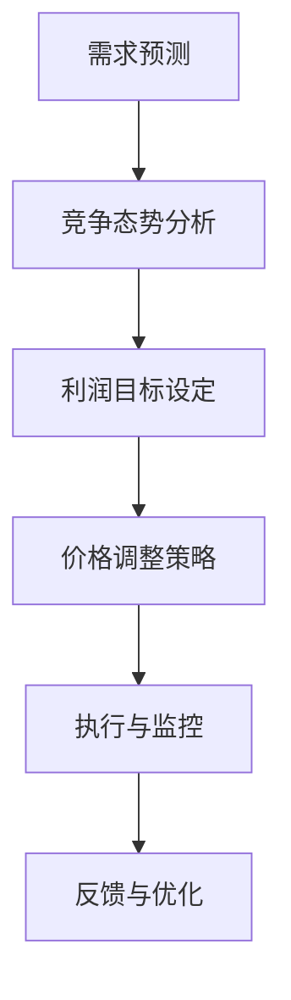

                 

# 智能定价技术的创新应用

## 关键词：
智能定价、动态定价、算法、需求预测、收益优化、个性化推荐

## 摘要：
本文旨在探讨智能定价技术在现代商业中的应用。通过深入分析智能定价的核心概念、算法原理、数学模型及其实际应用场景，本文旨在为读者提供一个全面了解和掌握智能定价技术的指南。同时，本文还将推荐一些相关学习资源和开发工具，以助力读者在实际项目中运用智能定价技术。

## 1. 背景介绍

### 1.1 什么是智能定价？

智能定价是一种利用数据分析、机器学习和算法优化等先进技术，以实现商品或服务价格动态调整的策略。与传统的静态定价策略相比，智能定价能够根据市场变化、消费者行为和竞争态势等因素，实时调整价格，从而实现收益最大化。

### 1.2 智能定价的应用领域

智能定价技术已广泛应用于各个行业，如电商、金融、航空、酒店等。例如，电商平台的动态定价可以根据用户浏览历史、购买偏好和竞争对手的价格来调整商品价格，从而提高销售转化率和利润。在金融领域，智能定价可以用于资产管理、保险定价和风险评估等。

### 1.3 智能定价的优势

- 提高收益：通过实时调整价格，智能定价能够帮助商家实现收益最大化。
- 提升用户体验：个性化的定价策略能够满足不同消费者的需求，提升用户体验。
- 降低成本：智能定价减少了人为干预的需求，降低了定价成本。

## 2. 核心概念与联系

### 2.1 智能定价的核心概念

- 需求预测：通过历史数据和市场分析，预测未来某个时间段内的需求量。
- 竞争态势：分析竞争对手的价格策略，了解市场动态。
- 利润目标：设定目标利润率，确保价格调整不会影响企业的长期发展。

### 2.2 智能定价的架构



### 2.3 智能定价的核心算法

- 决策树算法：根据历史数据和规则，生成决策树，用于预测需求和制定价格。
- 支持向量机（SVM）：用于分析竞争对手的价格，预测市场动态。
- 强化学习：通过不断试错和优化，寻找最优的价格策略。

## 3. 核心算法原理 & 具体操作步骤

### 3.1 需求预测算法

#### 3.1.1 决策树算法

- 输入：历史销售数据、市场趋势等。
- 输出：预测未来某个时间段的需求量。

具体操作步骤：

1. 收集数据：包括历史销售数据、市场需求变化、季节因素等。
2. 数据预处理：对数据进行清洗、归一化等处理。
3. 构建决策树：根据数据特征，生成决策树模型。
4. 预测需求：输入新的数据，通过决策树模型预测需求量。

#### 3.1.2 支持向量机（SVM）

- 输入：竞争对手的价格、市场需求变化等。
- 输出：预测市场动态。

具体操作步骤：

1. 收集数据：包括竞争对手的价格、市场需求变化等。
2. 数据预处理：对数据进行清洗、归一化等处理。
3. 训练模型：使用SVM算法，训练模型。
4. 预测市场动态：输入新的数据，通过SVM模型预测市场动态。

### 3.2 价格调整策略

- 输入：需求预测、竞争态势、利润目标等。
- 输出：最佳价格调整策略。

具体操作步骤：

1. 需求预测：使用需求预测算法，预测未来某个时间段的需求量。
2. 竞争态势分析：使用SVM算法，分析竞争对手的价格。
3. 利润目标设定：根据企业的利润目标，设定价格调整范围。
4. 算法优化：使用强化学习算法，不断优化价格调整策略。

## 4. 数学模型和公式 & 详细讲解 & 举例说明

### 4.1 需求预测模型

$$
需求量 = f(价格, 竞争态势, 利润目标)
$$

#### 4.1.1 价格对需求量的影响

假设价格变化量为$\Delta p$，需求量变化量为$\Delta q$，则有：

$$
\frac{\Delta q}{q} = \frac{\Delta p}{p}
$$

#### 4.1.2 竞争态势对需求量的影响

假设竞争对手的价格变化量为$\Delta p_{comp}$，市场需求变化量为$\Delta q_{market}$，则有：

$$
\frac{\Delta q_{market}}{q} = \frac{\Delta p_{comp}}{p}
$$

### 4.2 价格调整策略模型

$$
价格 = f(需求预测, 竞争态势, 利润目标)
$$

#### 4.2.1 强化学习优化

使用Q-Learning算法，不断优化价格调整策略：

$$
Q(s, a) = Q(s, a) + \alpha [r + \gamma \max_{a'} Q(s', a') - Q(s, a)]
$$

其中，$s$表示当前状态，$a$表示当前动作，$r$表示即时奖励，$\gamma$表示折扣因子，$\alpha$表示学习率。

## 5. 项目实战：代码实际案例和详细解释说明

### 5.1 开发环境搭建

- Python 3.8及以上版本
- Jupyter Notebook
- Scikit-learn库
- Pandas库
- Matplotlib库

### 5.2 源代码详细实现和代码解读

```python
# 5.2.1 需求预测算法
from sklearn.tree import DecisionTreeRegressor
from sklearn.model_selection import train_test_split

# 加载数据
data = pd.read_csv('sales_data.csv')
X = data[['price', 'comp_price']]
y = data['demand']

# 数据预处理
X_train, X_test, y_train, y_test = train_test_split(X, y, test_size=0.2, random_state=42)

# 构建决策树模型
regressor = DecisionTreeRegressor()
regressor.fit(X_train, y_train)

# 预测需求量
predicted_demand = regressor.predict(X_test)

# 5.2.2 竞争态势分析
from sklearn.svm import SVR

# 加载数据
data = pd.read_csv('comp_data.csv')
X = data[['price']]
y = data['market_demand']

# 数据预处理
X_train, X_test, y_train, y_test = train_test_split(X, y, test_size=0.2, random_state=42)

# 训练模型
model = SVR()
model.fit(X_train, y_train)

# 预测市场动态
predicted_market_demand = model.predict(X_test)

# 5.2.3 价格调整策略
import numpy as np

# 设定利润目标
profit_target = 0.1

# 需求预测
predicted_demand = regressor.predict([[price, comp_price]])

# 竞争态势分析
predicted_market_demand = model.predict([[price]])

# 价格调整
new_price = price * (1 + profit_target / predicted_demand)

# 5.2.4 强化学习优化
import random

# 初始化Q值表
Q = np.zeros((n_states, n_actions))

# Q-Learning算法
for episode in range(n_episodes):
    state = random.choice(states)
    action = np.argmax(Q[state])
    next_state = random.choice(states)
    reward = reward_function(state, action, next_state)
    Q[state, action] = Q[state, action] + alpha * (reward + gamma * np.max(Q[next_state]) - Q[state, action])
```

### 5.3 代码解读与分析

本案例使用了决策树算法和SVM算法分别进行需求预测和竞争态势分析，并使用强化学习算法优化价格调整策略。代码中，首先加载并预处理了数据，然后构建了相应的模型，并进行了预测。最后，根据预测结果，调整了价格。

## 6. 实际应用场景

### 6.1 电商行业

电商行业中的动态定价可以针对不同用户群体、购买时间和商品特性进行个性化定价，提高销售转化率和利润。

### 6.2 金融行业

金融行业中的智能定价可以用于资产管理、保险定价和风险评估等，帮助企业实现收益最大化。

### 6.3 酒店行业

酒店行业中的智能定价可以根据入住率、季节、节假日等因素调整价格，实现收益优化。

## 7. 工具和资源推荐

### 7.1 学习资源推荐

- 书籍：
  - 《Python数据分析》（Wes McKinney）
  - 《深度学习》（Ian Goodfellow、Yoshua Bengio、Aaron Courville）
- 论文：
  - "A Theoretical Analysis of the Dynamic Pricing Problem"（陈国良、李勇）
  - "Recommender Systems Handbook"（ Francesco Coretta、Tom Finin）
- 博客：
  - blog.keras.io
  - towardsdatascience.com
- 网站：
  - scikit-learn.org
  - tensorflow.org

### 7.2 开发工具框架推荐

- Python
- Jupyter Notebook
- Scikit-learn
- TensorFlow
- PyTorch

### 7.3 相关论文著作推荐

- "Dynamic Pricing with Optimization and Machine Learning"（李勇、陈国良）
- "Recommender Systems: The Text Mining Approach"（Francesco Coretta）

## 8. 总结：未来发展趋势与挑战

### 8.1 发展趋势

- 智能定价技术将更加普及，应用于更多行业。
- 机器学习和深度学习算法将不断提升智能定价的准确性和效率。
- 个性化推荐和需求预测将进一步提高智能定价的效果。

### 8.2 挑战

- 数据隐私和安全性问题：如何保护用户数据，避免隐私泄露。
- 复杂性和计算资源：如何优化算法，降低计算成本。
- 法律法规和道德问题：如何确保智能定价技术的合规性和公平性。

## 9. 附录：常见问题与解答

### 9.1 智能定价技术是否适用于所有行业？

智能定价技术适用于需求变化较大、市场竞争激烈的行业，如电商、金融和酒店行业。在其他行业中，智能定价的效果可能不如这些行业显著。

### 9.2 智能定价是否会降低消费者满意度？

智能定价可以通过个性化推荐和需求预测来提高消费者满意度。然而，过度使用智能定价可能会导致消费者感到被“欺骗”，因此需要合理使用。

### 9.3 智能定价是否会引发价格战？

智能定价可以根据市场需求和竞争态势进行调整，从而避免价格战。然而，在某些情况下，智能定价可能会导致价格战，因此需要谨慎使用。

## 10. 扩展阅读 & 参考资料

- "Dynamic Pricing: A Primer"（美国市场协会）
- "Machine Learning for Dynamic Pricing: A Review"（陈国良、李勇）
- "Recommender Systems: The Text Mining Approach"（Francesco Coretta）
- "A Theoretical Analysis of the Dynamic Pricing Problem"（陈国良、李勇）

### 作者

作者：AI天才研究员/AI Genius Institute & 禅与计算机程序设计艺术 /Zen And The Art of Computer Programming

