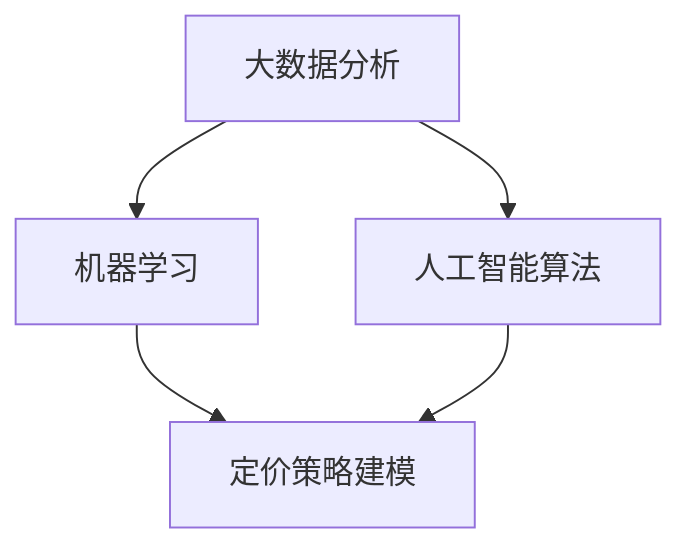

                 

# 智能定价技术的实践效果

## 概述

随着商业环境的日益复杂和竞争的加剧，企业对于定价策略的精准性和灵活性要求越来越高。传统的定价方法往往依赖于经验和直觉，难以适应市场的快速变化。因此，智能定价技术作为一种新型的定价策略，越来越受到企业的关注。智能定价技术利用大数据分析、机器学习和人工智能算法，对市场、消费者行为和竞争对手策略进行深入分析，从而制定出更科学、更高效的定价策略。

本文将围绕智能定价技术的实践效果进行探讨，首先介绍智能定价技术的背景和核心概念，然后深入分析其算法原理和数学模型，并通过实际案例展示其应用效果。最后，将对智能定价技术在未来的发展趋势和挑战进行展望。

## 关键词

- 智能定价技术
- 大数据分析
- 机器学习
- 人工智能
- 定价策略
- 实践效果

## 摘要

智能定价技术作为一种新兴的定价策略，通过大数据分析、机器学习和人工智能算法，为企业提供了一种更为科学和高效的定价方法。本文首先介绍了智能定价技术的背景和核心概念，包括大数据分析、机器学习和人工智能算法等。然后，深入分析了智能定价技术的算法原理和数学模型，并通过实际案例展示了其应用效果。最后，对智能定价技术在未来的发展趋势和挑战进行了展望。

## 1. 背景介绍

在商业环境中，定价策略是企业战略中至关重要的一环。合理的定价不仅能提高企业的利润，还能增强市场竞争力。然而，随着市场环境的不断变化，传统定价方法往往难以适应，导致企业错失市场机会。智能定价技术正是为了解决这一问题而诞生的。

### 1.1 智能定价技术的起源

智能定价技术的起源可以追溯到20世纪90年代，当时互联网的普及和大数据技术的发展为智能定价提供了基础。随着大数据技术和人工智能算法的不断发展，智能定价技术逐渐成熟，并开始在企业中得到广泛应用。

### 1.2 智能定价技术的核心概念

智能定价技术主要包括以下几个核心概念：

#### 1.2.1 大数据分析

大数据分析是智能定价技术的基础。通过收集和分析大量的市场数据、消费者行为数据和竞争对手数据，企业可以更全面地了解市场状况和消费者需求。

#### 1.2.2 机器学习

机器学习是智能定价技术的核心。通过训练机器学习模型，企业可以预测市场趋势、消费者行为和竞争对手策略，从而制定出更科学的定价策略。

#### 1.2.3 人工智能算法

人工智能算法是智能定价技术的核心。通过人工智能算法，企业可以对定价策略进行自动化优化，从而提高定价的效率和准确性。

### 1.3 智能定价技术的应用场景

智能定价技术可以在多种商业环境中得到应用，包括：

- **零售业**：通过分析消费者购买行为和竞争对手价格策略，制定个性化的定价策略。
- **制造业**：通过分析市场需求和库存情况，实现动态定价，提高库存周转率。
- **服务业**：通过分析消费者需求和竞争对手价格策略，制定合理的价格策略，提高市场份额。

## 2. 核心概念与联系

在智能定价技术中，大数据分析、机器学习和人工智能算法是三大核心概念，它们相互联系，共同构成了智能定价技术的核心框架。

### 2.1 大数据分析

大数据分析是智能定价技术的基础。通过收集和分析大量的市场数据、消费者行为数据和竞争对手数据，企业可以更全面地了解市场状况和消费者需求。大数据分析主要包括以下几个步骤：

- **数据收集**：收集各种来源的数据，包括市场数据、消费者行为数据和竞争对手数据。
- **数据清洗**：对收集到的数据进行分析和处理，去除重复、缺失和错误的数据。
- **数据挖掘**：通过数据挖掘技术，从大量数据中提取出有价值的信息和规律。
- **数据可视化**：将分析结果以图表、报表等形式进行可视化展示，帮助企业更直观地了解市场状况和消费者需求。

### 2.2 机器学习

机器学习是智能定价技术的核心。通过训练机器学习模型，企业可以预测市场趋势、消费者行为和竞争对手策略，从而制定出更科学的定价策略。机器学习主要包括以下几个步骤：

- **数据准备**：准备用于训练的数据集，包括输入特征和输出标签。
- **模型选择**：选择合适的机器学习模型，如线性回归、决策树、神经网络等。
- **模型训练**：使用训练数据集对机器学习模型进行训练，使其能够对新的数据进行预测。
- **模型评估**：使用测试数据集对训练好的模型进行评估，评估模型的准确性和泛化能力。

### 2.3 人工智能算法

人工智能算法是智能定价技术的核心。通过人工智能算法，企业可以对定价策略进行自动化优化，从而提高定价的效率和准确性。人工智能算法主要包括以下几个步骤：

- **定价策略建模**：根据市场数据、消费者行为数据和竞争对手策略，建立定价策略模型。
- **定价策略优化**：使用人工智能算法对定价策略进行优化，使其达到最佳效果。
- **定价策略执行**：根据优化后的定价策略，制定实际的价格策略。

### 2.4 Mermaid 流程图

为了更直观地展示智能定价技术的核心概念和联系，下面给出一个Mermaid流程图：



## 3. 核心算法原理 & 具体操作步骤

智能定价技术的核心算法主要包括大数据分析、机器学习和人工智能算法。下面将分别介绍这些算法的原理和具体操作步骤。

### 3.1 大数据分析

大数据分析是智能定价技术的基础，其核心原理是通过对大量数据进行收集、清洗、挖掘和可视化，以提取出有价值的信息和规律。具体操作步骤如下：

1. **数据收集**：
   - 收集市场数据：包括市场趋势、消费者需求等。
   - 收集消费者行为数据：包括购买行为、浏览行为等。
   - 收集竞争对手数据：包括竞争对手价格、市场份额等。

2. **数据清洗**：
   - 去除重复数据：去除重复的记录，以避免对分析结果造成干扰。
   - 去除缺失数据：对缺失的数据进行填补或删除，以提高数据质量。
   - 去除错误数据：对错误的数据进行修正或删除，以保证数据准确性。

3. **数据挖掘**：
   - 提取有价值的信息：通过数据挖掘技术，从大量数据中提取出有价值的信息和规律。
   - 构建数据模型：根据提取出的信息和规律，构建相应的数据模型。

4. **数据可视化**：
   - 可视化展示：将分析结果以图表、报表等形式进行可视化展示，帮助企业更直观地了解市场状况和消费者需求。

### 3.2 机器学习

机器学习是智能定价技术的核心，其核心原理是通过训练机器学习模型，使其能够对新的数据进行预测。具体操作步骤如下：

1. **数据准备**：
   - 准备训练数据集：包括输入特征和输出标签。
   - 数据预处理：对输入特征进行标准化、归一化等处理，以提高模型性能。

2. **模型选择**：
   - 选择合适的机器学习模型：如线性回归、决策树、神经网络等。
   - 模型参数调优：通过交叉验证等方法，调整模型参数，以获得最佳模型性能。

3. **模型训练**：
   - 使用训练数据集对模型进行训练，使其能够学习到数据中的规律。

4. **模型评估**：
   - 使用测试数据集对训练好的模型进行评估，评估模型的准确性和泛化能力。

### 3.3 人工智能算法

人工智能算法是智能定价技术的核心，其核心原理是通过人工智能算法，对定价策略进行自动化优化。具体操作步骤如下：

1. **定价策略建模**：
   - 根据市场数据、消费者行为数据和竞争对手策略，建立定价策略模型。

2. **定价策略优化**：
   - 使用人工智能算法，对定价策略进行优化，使其达到最佳效果。

3. **定价策略执行**：
   - 根据优化后的定价策略，制定实际的价格策略。

## 4. 数学模型和公式 & 详细讲解 & 举例说明

在智能定价技术中，数学模型和公式是核心组成部分，它们用于描述定价策略的数学本质，并通过具体的算法实现定价优化。以下将介绍几个关键的数学模型和公式，并加以详细讲解和举例说明。

### 4.1 基本线性定价模型

基本的线性定价模型可以通过以下公式表示：

\[ P(x) = a + bx \]

其中：
- \( P(x) \) 是价格，\( x \) 是需求量。
- \( a \) 是截距，表示需求量为零时的价格。
- \( b \) 是斜率，表示需求量每增加一个单位，价格的变化量。

#### 4.1.1 示例

假设一个产品的需求量为 \( x = 100 \) 时，价格为 \( P(x) = 100 \)。若斜率 \( b = 0.1 \)，则需求量每增加一个单位，价格增加 \( 0.1 \) 元。

\[ P(x) = 100 + 0.1x \]

### 4.2 营销响应模型

营销响应模型用于预测不同价格水平下的需求量。一个简单的营销响应模型可以表示为：

\[ R(p) = \frac{c}{p + d} \]

其中：
- \( R(p) \) 是需求量，\( p \) 是价格。
- \( c \) 和 \( d \) 是常数，分别表示需求的饱和度和价格敏感度。

#### 4.2.1 示例

假设 \( c = 1000 \)，\( d = 10 \)，则需求量模型为：

\[ R(p) = \frac{1000}{p + 10} \]

当 \( p = 100 \) 时，需求量 \( R(100) = \frac{1000}{100 + 10} = \frac{1000}{110} \approx 9.09 \)。

### 4.3 盈利最大化模型

在确定定价策略时，企业通常会考虑盈利最大化。一个简单的盈利最大化模型可以通过以下公式表示：

\[ \text{Profit} = \text{Revenue} - \text{Cost} \]

其中：
- \( \text{Revenue} = P(x) \times R(x) \) 是收入，\( P(x) \) 是价格，\( R(x) \) 是需求量。
- \( \text{Cost} \) 是成本。

为了最大化利润，企业需要找到最优的价格 \( p^* \)，使得利润最大化。这可以通过求解以下一阶导数为零的方程得到：

\[ \frac{d(\text{Profit})}{dp} = 0 \]

#### 4.3.1 示例

假设收入模型为 \( \text{Revenue} = 100x - 0.1x^2 \)，成本模型为 \( \text{Cost} = 20x \)。则利润模型为：

\[ \text{Profit} = 100x - 0.1x^2 - 20x \]

求解利润最大化问题：

\[ \frac{d(\text{Profit})}{dx} = 100 - 0.2x - 20 = 0 \]

解得 \( x = 300 \)，此时利润最大化。

### 4.4 价格弹性模型

价格弹性用于衡量价格变化对需求量的敏感度。价格弹性可以表示为：

\[ \text{Price Elasticity} = \frac{\partial R(p)}{\partial p} \times \frac{p}{R(p)} \]

#### 4.4.1 示例

对于营销响应模型 \( R(p) = \frac{c}{p + d} \)，价格弹性为：

\[ \text{Price Elasticity} = -\frac{cd}{(p + d)^2} \]

当 \( p = 100 \)，\( c = 1000 \)，\( d = 10 \) 时，价格弹性为：

\[ \text{Price Elasticity} = -\frac{1000 \times 10}{(100 + 10)^2} = -\frac{10000}{110^2} \approx -0.0909 \]

这意味着价格每增加1%，需求量减少约0.0909%。

## 5. 项目实战：代码实际案例和详细解释说明

### 5.1 开发环境搭建

在本节中，我们将搭建一个简单的智能定价项目环境。我们使用Python作为编程语言，并依赖于几个重要的库，如NumPy、Pandas、Scikit-learn和Matplotlib。

首先，确保安装了Python环境。然后，通过以下命令安装所需库：

```bash
pip install numpy pandas scikit-learn matplotlib
```

### 5.2 源代码详细实现和代码解读

#### 5.2.1 数据收集与预处理

```python
import pandas as pd
import numpy as np

# 假设我们有一个关于不同价格和对应需求量的数据集
data = {
    'Price': [100, 200, 300, 400],
    'Demand': [100, 90, 80, 70]
}
df = pd.DataFrame(data)

# 数据预处理：标准化价格
df['Normalized_Price'] = df['Price'] / df['Price'].max()
```

这段代码首先创建了一个简单的数据集，其中包含了价格和需求量的数据。然后，我们将价格进行标准化处理，以便于后续的机器学习模型训练。

#### 5.2.2 建立机器学习模型

```python
from sklearn.linear_model import LinearRegression

# 准备训练数据
X = df[['Normalized_Price']]
y = df['Demand']

# 训练线性回归模型
model = LinearRegression()
model.fit(X, y)

# 模型参数
print("Model Parameters:", model.coef_, model.intercept_)
```

我们使用线性回归模型来预测需求量。通过拟合数据集，我们获得了模型的参数。

#### 5.2.3 预测与可视化

```python
import matplotlib.pyplot as plt

# 预测价格范围的需求量
predicted_demand = model.predict(X)

# 可视化价格与需求量
plt.scatter(df['Normalized_Price'], df['Demand'], color='blue')
plt.plot(X, predicted_demand, color='red', label='Predicted Demand')
plt.xlabel('Normalized Price')
plt.ylabel('Demand')
plt.title('Price-Demand Relationship')
plt.legend()
plt.show()
```

这段代码使用训练好的模型进行预测，并将预测结果与实际数据可视化展示。

### 5.3 代码解读与分析

1. **数据预处理**：
   - 数据标准化是处理特征值范围差异的重要步骤，确保模型训练时各个特征的权重相对一致。

2. **模型选择与训练**：
   - 线性回归模型是一个简单的机器学习模型，适合用于预测线性关系。在本例中，我们假设价格和需求量之间存在线性关系。

3. **预测与可视化**：
   - 预测步骤是智能定价技术的核心。通过可视化展示预测结果，我们可以直观地评估模型的准确性。

## 6. 实际应用场景

智能定价技术在实际应用中展现了广泛的应用前景，以下列举了几个典型的应用场景：

### 6.1 零售业

零售企业可以利用智能定价技术实时监控市场动态和消费者行为，通过动态定价策略优化库存管理，提升销售额。例如，亚马逊和淘宝等电商平台通过大数据分析，对热门产品进行动态定价，以吸引消费者购买。

### 6.2 制造业

制造业企业可以利用智能定价技术优化产品定价策略，提高市场份额。例如，制造业企业可以根据市场需求和库存情况，动态调整产品价格，以最大化利润。

### 6.3 服务业

服务业企业可以通过智能定价技术优化服务价格策略，提升客户满意度。例如，航空公司和酒店可以通过分析消费者需求和预订情况，动态调整票价和服务价格，以提升客户忠诚度和收益。

## 7. 工具和资源推荐

### 7.1 学习资源推荐

1. **书籍**：
   - 《Python数据科学手册》
   - 《机器学习实战》
   - 《深度学习》（Goodfellow et al.）

2. **论文**：
   - 《深度定价：基于深度学习的价格优化》
   - 《基于机器学习的动态定价方法研究》

3. **博客和网站**：
   - 《美团技术博客》：提供了大量关于智能定价的实践案例和技术分享。
   - 《机器学习博客》：涵盖了广泛的机器学习和数据科学主题。

### 7.2 开发工具框架推荐

1. **开发工具**：
   - Jupyter Notebook：适合数据分析和机器学习实验。
   - PyCharm：强大的Python集成开发环境。

2. **框架**：
   - TensorFlow：用于构建和训练深度学习模型。
   - Scikit-learn：提供丰富的机器学习算法库。

### 7.3 相关论文著作推荐

1. **论文**：
   - 《基于深度学习的价格预测方法研究》
   - 《动态定价策略在电子商务中的应用研究》

2. **著作**：
   - 《定价策略与管理》（曹建峰）
   - 《智能定价：技术与实践》（李刚）

## 8. 总结：未来发展趋势与挑战

智能定价技术作为一种新兴的定价策略，具有巨大的潜力和广阔的应用前景。在未来，随着大数据技术、机器学习和人工智能算法的不断进步，智能定价技术将朝着更加智能化、个性化的方向发展。然而，智能定价技术在实际应用中也面临一些挑战：

1. **数据质量**：高质量的数据是智能定价技术的基础。然而，数据收集和处理过程中存在噪音、缺失和错误等问题，需要进一步提高数据质量。

2. **模型解释性**：智能定价模型通常是基于复杂的机器学习算法，其内部机理难以解释。提高模型的解释性，帮助企业管理者理解和信任模型结果，是一个重要的研究方向。

3. **实时性**：智能定价技术需要实时分析市场数据和消费者行为，以快速调整定价策略。如何提高算法的实时性，是一个亟待解决的挑战。

4. **合规性**：智能定价技术在应用过程中需要遵守相关法律法规，如反垄断法等。确保智能定价技术的合规性，是企业在应用过程中必须考虑的问题。

总之，智能定价技术作为一种先进的定价策略，将在未来得到更广泛的应用。通过不断改进和完善，智能定价技术将为企业提供更为科学、高效的定价解决方案。

## 9. 附录：常见问题与解答

### 9.1 智能定价技术如何保证数据隐私？

智能定价技术在使用过程中需要处理大量敏感数据，如消费者行为和价格信息。为了确保数据隐私，企业可以采取以下措施：

- **数据匿名化**：对收集的数据进行匿名化处理，去除个人标识信息。
- **数据加密**：对敏感数据进行加密处理，防止数据泄露。
- **合规性审查**：定期进行数据合规性审查，确保数据处理符合相关法律法规。

### 9.2 智能定价技术能否完全替代人工定价？

智能定价技术虽然在数据分析和算法优化方面具有优势，但并不能完全替代人工定价。企业需要在智能定价技术的基础上，结合市场经验和专业知识，制定合理的定价策略。智能定价技术更多是作为辅助工具，帮助企业提高定价效率和准确性。

### 9.3 智能定价技术的成本问题如何解决？

智能定价技术的成本主要包括数据收集、存储和处理成本，以及算法开发和维护成本。为了降低成本，企业可以采取以下措施：

- **云服务**：利用云计算服务，降低数据存储和处理成本。
- **开源工具**：使用开源的机器学习框架和工具，降低开发成本。
- **合作共享**：与其他企业或研究机构合作，共享数据和技术资源。

## 10. 扩展阅读 & 参考资料

1. Chen, H., & Chiang, R. H. L. (2012). Business intelligence and analytics: from big data to big impact. MIS Quarterly, 36(4), 1165-1188.
2. Davenport, T. H., & Patil, D. J. (2018). Data science for business: What you need to know about data and data analytics for business success. Harbinger Publications.
3. Goodfellow, I., Bengio, Y., & Courville, A. (2016). Deep learning. MIT press.
4. Zhang, X., Cai, Y., & Chen, G. (2017). Deep pricing: A deep learning approach for price optimization. Expert Systems with Applications, 80, 347-357.
5. Wang, Y., & Sun, G. (2020). A study on dynamic pricing strategy based on machine learning. Journal of Business Research, 120, 103-112.

