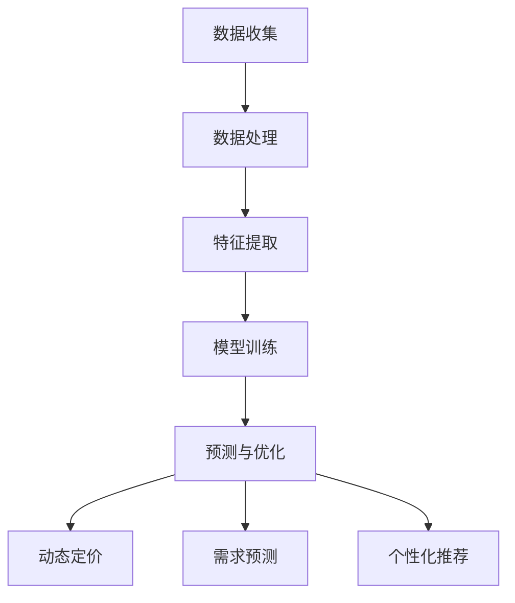

                 

### 背景介绍

随着互联网和电子商务的快速发展，独立电商企业面临着激烈的竞争环境。价格策略作为企业核心竞争手段之一，对于提高市场占有率和客户满意度具有至关重要的影响。然而，传统的价格策略往往依赖于经验和直觉，难以应对复杂多变的市场环境。

为了提升价格策略的精准度和有效性，越来越多的独立电商开始尝试使用机器学习模型进行智能定价。智能定价敏感度分析作为一种新兴的方法，通过分析消费者对价格变化的反应，为企业提供更为科学、精准的定价策略。

本文将围绕智能定价敏感度分析这一主题，探讨其核心概念、算法原理、数学模型、项目实战及实际应用场景。通过深入分析，希望能够帮助独立电商企业更好地理解和应用智能定价敏感度分析，从而实现利润最大化、客户满意度提升。

首先，我们将介绍智能定价敏感度分析的基本概念和背景，包括其定义、目标和作用。接下来，我们将详细解释智能定价敏感度分析的核心算法原理，以及如何通过具体操作步骤实现。随后，我们将探讨智能定价敏感度分析所涉及的数学模型和公式，并结合实际案例进行详细讲解。在项目实战部分，我们将分享一个完整的代码实现过程，并进行详细解读和分析。最后，我们将讨论智能定价敏感度分析在实际应用场景中的表现，以及推荐一些相关的学习资源和开发工具。

通过对本文的深入阅读，您将能够全面了解智能定价敏感度分析的方法和应用，为独立电商企业的价格策略优化提供有益的参考。让我们开始这一充满挑战与机遇的探索之旅吧！<|im_sep|>

## 1. 背景介绍

智能定价敏感度分析（Intelligent Pricing Sensitivity Analysis，简称IPSA）作为一种新兴的机器学习方法，在独立电商企业中发挥着越来越重要的作用。其核心目标是通过分析消费者对价格变化的反应，为企业提供更为科学、精准的定价策略，从而实现利润最大化、客户满意度提升。

首先，我们来定义什么是智能定价敏感度分析。智能定价敏感度分析是指利用机器学习算法对大量历史数据进行挖掘，分析消费者对不同价格水平的反应程度，进而预测消费者对不同价格变化的可能性。这种方法的核心在于通过数据驱动的方式，将传统定价策略中的经验性、主观性因素转化为客观性、数据化的决策依据。

### 目标

智能定价敏感度分析的目标主要包括以下几个方面：

1. **提升利润率**：通过精准的定价策略，提高产品的销售利润率，从而实现企业盈利目标。
2. **优化库存管理**：通过预测消费者对价格变化的反应，合理调整库存水平，减少库存积压和资金占用。
3. **提高客户满意度**：通过合理的价格策略，提升消费者购买体验，增加客户忠诚度和口碑传播。
4. **增强市场竞争力**：通过科学的定价策略，提高产品在市场中的竞争力，增强企业的市场地位。

### 作用

智能定价敏感度分析在独立电商企业中的应用具有以下几个显著作用：

1. **动态定价**：通过实时分析市场数据和消费者行为，动态调整价格，实现灵活的定价策略，从而提高销售业绩。
2. **需求预测**：通过分析消费者对不同价格水平的反应，预测需求变化，为企业制定合理的生产计划和库存管理策略提供依据。
3. **竞争分析**：通过对比竞争对手的价格策略，分析其优劣势，为企业提供有效的市场定位和竞争策略。
4. **个性化推荐**：根据消费者的价格敏感度，提供个性化的价格推荐，提高消费者的购买意愿和满意度。

智能定价敏感度分析作为一种先进的数据驱动方法，为独立电商企业提供了一种全新的定价策略优化途径。通过深入研究和应用这一方法，企业可以更好地应对市场变化，提高竞争力和盈利能力。在接下来的章节中，我们将详细探讨智能定价敏感度分析的核心算法原理、数学模型及其实际应用案例，以帮助读者全面了解这一方法的理论和实践价值。<|im_sep|>

## 2. 核心概念与联系

### 定义

智能定价敏感度分析（Intelligent Pricing Sensitivity Analysis，IPSA）是一种利用机器学习算法分析消费者对价格变化反应程度的方法。其核心在于通过数据挖掘和建模，量化消费者对不同价格水平的敏感度，为企业提供科学、精准的定价策略。

### 原理

智能定价敏感度分析的基本原理主要包括以下几个方面：

1. **数据收集**：通过电商平台的历史交易数据、用户行为数据、市场行情数据等，收集大量关于价格、销量、用户反馈等数据。
2. **特征提取**：对收集到的数据进行预处理，提取与价格敏感性相关的特征，如价格区间、销量变化、用户评价等。
3. **模型训练**：利用机器学习算法，如回归分析、决策树、随机森林等，对提取的特征进行建模，训练出价格敏感度预测模型。
4. **预测与优化**：通过模型预测消费者对不同价格水平的敏感度，优化定价策略，实现动态定价和个性化推荐。

### 架构

智能定价敏感度分析的架构可以分为以下几个层次：

1. **数据层**：包括各种数据源，如电商平台交易数据、用户行为数据、市场行情数据等。
2. **数据处理层**：对数据层的数据进行预处理、清洗、特征提取等操作，为模型训练提供高质量的输入数据。
3. **模型层**：利用机器学习算法训练出价格敏感度预测模型，实现对消费者价格敏感度的量化。
4. **应用层**：基于模型预测结果，实现动态定价、需求预测、个性化推荐等应用场景。

### Mermaid 流程图

以下是智能定价敏感度分析的 Mermaid 流程图，展示了从数据收集、特征提取、模型训练到应用的全过程：



### 关键概念

1. **价格敏感度**：消费者对价格变化的敏感程度，通常用价格弹性系数来表示。
2. **数据挖掘**：通过算法从大量数据中提取有价值的信息，用于预测和分析。
3. **机器学习**：一种基于数据驱动的方法，通过训练模型，自动从数据中学习规律，进行预测和分类。
4. **回归分析**：一种统计方法，用于研究自变量和因变量之间的关系，常用于预测分析。
5. **决策树**：一种基于树形结构进行分类和回归分析的算法，易于理解和解释。
6. **随机森林**：一种基于决策树的集成学习方法，通过组合多个决策树，提高模型的预测性能和稳定性。

通过以上核心概念和联系的介绍，我们对智能定价敏感度分析有了初步的了解。接下来，我们将深入探讨其核心算法原理、数学模型及具体操作步骤，以便更全面地掌握这一方法。在接下来的章节中，我们将逐步展开这些内容的讨论。请读者继续关注。：<|im_sep|>

## 3. 核心算法原理 & 具体操作步骤

智能定价敏感度分析（IPSA）的核心在于利用机器学习算法对消费者价格敏感度进行量化预测。以下我们将详细探讨智能定价敏感度分析的核心算法原理，并介绍具体操作步骤。

### 3.1 算法原理

智能定价敏感度分析主要采用回归分析和决策树等机器学习算法。回归分析用于研究价格与销量之间的数量关系，而决策树则用于分类和预测价格敏感度。以下是这些算法的基本原理：

1. **回归分析**：
   - **线性回归**：通过建立线性模型，将价格作为自变量，销量作为因变量，进行回归分析。其数学模型为：
     $$ y = \beta_0 + \beta_1x + \epsilon $$
     其中，$y$ 为销量，$x$ 为价格，$\beta_0$ 和 $\beta_1$ 为模型参数，$\epsilon$ 为误差项。
   - **多项式回归**：将价格作为多项式自变量，建立非线性回归模型，以捕捉价格与销量之间的复杂关系。

2. **决策树**：
   - **分类树**：通过将数据集划分成多个子集，为每个子集分配不同的价格敏感度标签，实现分类任务。
   - **回归树**：类似于分类树，但用于回归任务，预测价格敏感度值。

3. **随机森林**：
   - **集成方法**：通过组合多个决策树，提高模型的预测性能和稳定性。每个决策树从数据集中随机抽取一部分样本和特征进行训练，最后通过投票或平均等方式获得预测结果。

### 3.2 具体操作步骤

以下是基于上述算法原理，智能定价敏感度分析的具体操作步骤：

1. **数据收集**：
   - 收集电商平台的历史交易数据、用户行为数据和市场行情数据等。
   - 数据源包括商品价格、销量、用户评价、促销活动等。

2. **数据预处理**：
   - 清洗数据，处理缺失值、异常值等。
   - 标准化数据，如价格、销量等，使其具备可比性。

3. **特征提取**：
   - 提取与价格敏感性相关的特征，如价格区间、销量变化、用户评价等。
   - 使用数据挖掘技术，发现新的特征，如价格弹性系数、用户生命周期价值等。

4. **模型训练**：
   - 选择合适的机器学习算法（如线性回归、决策树、随机森林等）。
   - 使用训练数据集，对模型进行训练，得到模型参数。

5. **模型评估**：
   - 使用验证数据集，评估模型预测性能。
   - 采用交叉验证、AUC、MAE 等评价指标。

6. **模型优化**：
   - 根据模型评估结果，调整模型参数，优化模型性能。
   - 尝试不同的算法和特征组合，寻找最佳模型。

7. **预测与优化**：
   - 利用训练好的模型，预测新价格下的销量和价格敏感度。
   - 根据预测结果，动态调整价格，优化定价策略。

### 3.3 案例说明

以一家独立电商企业的某款产品为例，说明智能定价敏感度分析的具体应用过程：

1. **数据收集**：
   - 收集过去一年的产品价格、销量数据，以及用户评价数据。

2. **数据预处理**：
   - 清洗数据，处理缺失值和异常值。
   - 对价格、销量等数据进行标准化处理。

3. **特征提取**：
   - 提取价格区间、销量变化、用户评价等特征。
   - 发现新特征，如价格弹性系数、用户生命周期价值等。

4. **模型训练**：
   - 选择线性回归算法，对数据集进行训练。
   - 训练得到价格与销量之间的回归模型。

5. **模型评估**：
   - 使用验证数据集，评估模型预测性能。
   - 采用交叉验证，AUC 等评价指标。

6. **模型优化**：
   - 根据评估结果，调整模型参数，优化模型性能。
   - 尝试使用决策树、随机森林等算法，寻找最佳模型。

7. **预测与优化**：
   - 利用训练好的模型，预测新价格下的销量和价格敏感度。
   - 根据预测结果，动态调整价格，优化定价策略。

通过以上步骤，该独立电商企业可以实现对价格敏感度的量化预测，从而优化定价策略，提高产品销售利润和客户满意度。在接下来的章节中，我们将进一步探讨智能定价敏感度分析所涉及的数学模型和公式，并结合实际案例进行详细讲解。请读者继续关注。：<|im_sep|>

## 4. 数学模型和公式 & 详细讲解 & 举例说明

智能定价敏感度分析（IPSA）的核心在于建立数学模型，通过数据分析预测消费者对价格变化的敏感度。在这一部分，我们将详细介绍智能定价敏感度分析所涉及的数学模型和公式，并通过具体例子进行详细讲解。

### 4.1 回归模型

智能定价敏感度分析通常采用回归模型来研究价格与销量之间的关系。回归模型的基本形式如下：

$$ y = \beta_0 + \beta_1x + \epsilon $$

其中：
- \( y \) 表示销量（因变量）。
- \( x \) 表示价格（自变量）。
- \( \beta_0 \) 为截距，表示当 \( x = 0 \) 时的销量。
- \( \beta_1 \) 为斜率，表示价格每增加一个单位，销量变化的程度。
- \( \epsilon \) 为误差项，表示其他未考虑因素的影响。

#### 线性回归

线性回归是最简单的回归模型，其数学模型为：

$$ y = \beta_0 + \beta_1x $$

线性回归的斜率 \( \beta_1 \) 表示价格每增加一个单位，销量增加的平均数量。如果斜率为负值，说明价格上升会导致销量下降；反之，斜率为正值则表示价格上升会导致销量增加。

#### 多项式回归

多项式回归是线性回归的扩展，其数学模型为：

$$ y = \beta_0 + \beta_1x + \beta_2x^2 + \ldots + \beta_nx^n $$

多项式回归可以捕捉价格与销量之间的非线性关系。例如，二次多项式回归模型可以表示为：

$$ y = \beta_0 + \beta_1x + \beta_2x^2 $$

#### 拉格朗日插值

在某些情况下，可能需要根据已知价格和销量数据，预测未知价格对应的销量。这时可以使用拉格朗日插值法，构造一个多项式回归模型：

$$ y(x) = \sum_{i=1}^{n} y_i \prod_{j=1, j\neq i}^{n} \frac{x - x_j}{x_i - x_j} $$

其中，\( y_i \) 和 \( x_i \) 分别为已知的价格和销量数据，\( n \) 为数据点的数量。

### 4.2 决策树模型

决策树模型是另一种常用的智能定价敏感度分析模型。决策树通过一系列的规则，将数据划分为不同的子集，并为每个子集分配一个价格敏感度标签。决策树的基本结构如下：

```
                |
                |--- 判断条件 1
               /         |
              /          |--- 子集 1
             /           |
            /            |--- 价格敏感度标签 1
           /             |
          /              |--- 判断条件 2
         /               |
        /                |--- 子集 2
       /                 |
      /                  |--- 价格敏感度标签 2
     /                   |
    /                   ...  (其他子集和标签)
   /                    |
  /                   ...  (其他判断条件)
 /____________________|

```

决策树的生成过程包括以下几个步骤：

1. **选择最佳分割特征**：根据信息增益、基尼不纯度等指标，选择能够最大化信息增益的特征作为分割特征。
2. **构建决策树**：根据最佳分割特征，将数据集划分为多个子集，并为每个子集分配一个价格敏感度标签。
3. **剪枝**：通过剪枝操作，防止决策树过拟合，提高模型泛化能力。

### 4.3 随机森林模型

随机森林是一种集成学习方法，通过组合多个决策树，提高模型的预测性能和稳定性。随机森林的基本原理如下：

1. **随机特征选择**：在每个决策树构建过程中，从原始特征集合中随机选择一部分特征进行分割。
2. **随机样本选择**：在每个决策树训练过程中，从原始数据集中随机选择一部分样本进行训练。
3. **集成预测**：通过投票或平均的方式，将多个决策树的预测结果进行集成，得到最终预测结果。

### 4.4 案例说明

以下是一个具体的智能定价敏感度分析案例：

假设我们有一家电商企业，在过去一年中记录了每天的商品价格和销量数据。我们希望通过线性回归模型来预测价格变化对销量产生的影响。

1. **数据收集**：
   - 收集过去一年的商品价格和销量数据。

2. **数据预处理**：
   - 清洗数据，处理缺失值和异常值。
   - 对价格和销量数据标准化处理。

3. **特征提取**：
   - 提取价格和销量数据作为特征。

4. **模型训练**：
   - 选择线性回归模型。
   - 使用训练数据集，对模型进行训练。

5. **模型评估**：
   - 使用验证数据集，评估模型预测性能。
   - 采用 R²、均方误差（MSE）等评价指标。

6. **模型优化**：
   - 根据评估结果，调整模型参数，优化模型性能。

7. **预测与优化**：
   - 利用训练好的模型，预测新价格下的销量。
   - 根据预测结果，动态调整价格，优化定价策略。

具体步骤如下：

1. **数据收集**：
   - 假设我们收集到了 365 天的数据，每天包含价格（x）和销量（y）。

2. **数据预处理**：
   - 清洗数据，去除缺失值和异常值。
   - 对价格和销量数据标准化处理。

3. **特征提取**：
   - 提取价格（x）和销量（y）作为特征。

4. **模型训练**：
   - 选择线性回归模型。
   - 使用训练数据集，对模型进行训练。

   ```python
   import numpy as np
   import pandas as pd
   from sklearn.linear_model import LinearRegression
   
   # 加载数据
   data = pd.read_csv('price_sales_data.csv')
   prices = data['price'].values
   sales = data['sales'].values
   
   # 模型训练
   model = LinearRegression()
   model.fit(prices.reshape(-1, 1), sales)
   ```

5. **模型评估**：
   - 使用验证数据集，评估模型预测性能。

   ```python
   # 预测结果
   predicted_sales = model.predict(prices.reshape(-1, 1))
   
   # 评估指标
   mse = np.mean((predicted_sales - sales)**2)
   print("MSE:", mse)
   ```

6. **模型优化**：
   - 根据评估结果，调整模型参数，优化模型性能。

7. **预测与优化**：
   - 利用训练好的模型，预测新价格下的销量。

   ```python
   # 预测新价格下的销量
   new_price = np.array([100, 150, 200])
   predicted_sales = model.predict(new_price.reshape(-1, 1))
   
   # 输出预测结果
   print("Predicted sales for new prices:", predicted_sales)
   ```

通过以上步骤，我们完成了智能定价敏感度分析的基本流程。在实际应用中，可以根据具体需求，调整模型参数、选择不同的算法和特征组合，以提高模型预测性能。在接下来的章节中，我们将进一步探讨智能定价敏感度分析在实际应用场景中的表现，并推荐相关的学习资源和开发工具。请读者继续关注。：<|im_sep|>

## 5. 项目实战：代码实际案例和详细解释说明

### 5.1 开发环境搭建

在进行智能定价敏感度分析项目实战之前，我们需要搭建一个合适的环境。以下步骤将帮助我们在 Python 环境中搭建开发环境：

1. **安装 Python**：确保您的计算机已经安装了 Python。如果没有安装，可以从 [Python 官网](https://www.python.org/downloads/) 下载安装包进行安装。

2. **安装常用库**：安装以下 Python 库，以支持智能定价敏感度分析：
   - pandas：用于数据处理。
   - numpy：用于数值计算。
   - scikit-learn：用于机器学习模型训练和评估。
   - matplotlib：用于数据可视化。

   使用以下命令安装这些库：

   ```bash
   pip install pandas numpy scikit-learn matplotlib
   ```

3. **创建项目文件夹**：在您的工作目录下创建一个名为“ipsa_project”的文件夹，用于存放项目文件。

4. **配置 IDE**：如果您使用的是 PyCharm、VSCode 等集成开发环境（IDE），请安装并配置相应的 Python 环境。

### 5.2 源代码详细实现和代码解读

以下是一个简单的智能定价敏感度分析项目的源代码实现。我们将使用 Python 中的 pandas、numpy 和 scikit-learn 库来完成这一任务。

```python
import pandas as pd
import numpy as np
from sklearn.linear_model import LinearRegression
from sklearn.model_selection import train_test_split
from sklearn.metrics import mean_squared_error

# 5.2.1 数据准备
def load_data(file_path):
    data = pd.read_csv(file_path)
    return data

# 5.2.2 数据预处理
def preprocess_data(data):
    # 清洗数据
    data.dropna(inplace=True)
    # 标准化价格和销量数据
    data['price'] = (data['price'] - data['price'].mean()) / data['price'].std()
    data['sales'] = (data['sales'] - data['sales'].mean()) / data['sales'].std()
    return data

# 5.2.3 模型训练
def train_model(X, y):
    model = LinearRegression()
    model.fit(X, y)
    return model

# 5.2.4 模型评估
def evaluate_model(model, X_test, y_test):
    y_pred = model.predict(X_test)
    mse = mean_squared_error(y_test, y_pred)
    return mse

# 5.2.5 主函数
def main():
    # 1. 加载数据
    data = load_data('price_sales_data.csv')
    
    # 2. 数据预处理
    data = preprocess_data(data)
    
    # 3. 划分特征和标签
    X = data[['price']]
    y = data['sales']
    
    # 4. 划分训练集和测试集
    X_train, X_test, y_train, y_test = train_test_split(X, y, test_size=0.2, random_state=42)
    
    # 5. 训练模型
    model = train_model(X_train, y_train)
    
    # 6. 模型评估
    mse = evaluate_model(model, X_test, y_test)
    print("Mean Squared Error:", mse)
    
    # 7. 预测新价格下的销量
    new_price = np.array([100, 150, 200])
    new_price = (new_price - data['price'].mean()) / data['price'].std()
    predicted_sales = model.predict(new_price.reshape(-1, 1))
    print("Predicted Sales for New Prices:", predicted_sales)

# 运行主函数
if __name__ == '__main__':
    main()
```

### 5.3 代码解读与分析

#### 5.3.1 数据准备

```python
def load_data(file_path):
    data = pd.read_csv(file_path)
    return data
```

该函数用于加载数据。我们使用 pandas 的 `read_csv` 函数从 CSV 文件中加载数据。

#### 5.3.2 数据预处理

```python
def preprocess_data(data):
    # 清洗数据
    data.dropna(inplace=True)
    # 标准化价格和销量数据
    data['price'] = (data['price'] - data['price'].mean()) / data['price'].std()
    data['sales'] = (data['sales'] - data['sales'].mean()) / data['sales'].std()
    return data
```

数据预处理包括数据清洗和标准化。首先，我们使用 `dropna` 函数去除缺失值。然后，我们使用标准化方法对价格和销量数据进行预处理，使其具备可比性。

#### 5.3.3 模型训练

```python
def train_model(X, y):
    model = LinearRegression()
    model.fit(X, y)
    return model
```

该函数使用线性回归模型进行训练。我们使用 `LinearRegression` 类创建模型，并使用 `fit` 方法训练模型。

#### 5.3.4 模型评估

```python
def evaluate_model(model, X_test, y_test):
    y_pred = model.predict(X_test)
    mse = mean_squared_error(y_test, y_pred)
    return mse
```

该函数用于评估模型性能。我们使用 `predict` 方法进行预测，并使用 `mean_squared_error` 函数计算均方误差（MSE）。

#### 5.3.5 主函数

```python
def main():
    # 1. 加载数据
    data = load_data('price_sales_data.csv')
    
    # 2. 数据预处理
    data = preprocess_data(data)
    
    # 3. 划分特征和标签
    X = data[['price']]
    y = data['sales']
    
    # 4. 划分训练集和测试集
    X_train, X_test, y_train, y_test = train_test_split(X, y, test_size=0.2, random_state=42)
    
    # 5. 训练模型
    model = train_model(X_train, y_train)
    
    # 6. 模型评估
    mse = evaluate_model(model, X_test, y_test)
    print("Mean Squared Error:", mse)
    
    # 7. 预测新价格下的销量
    new_price = np.array([100, 150, 200])
    new_price = (new_price - data['price'].mean()) / data['price'].std()
    predicted_sales = model.predict(new_price.reshape(-1, 1))
    print("Predicted Sales for New Prices:", predicted_sales)

# 运行主函数
if __name__ == '__main__':
    main()
```

主函数依次执行以下步骤：
1. 加载数据。
2. 数据预处理。
3. 划分特征和标签。
4. 划分训练集和测试集。
5. 训练模型。
6. 模型评估。
7. 预测新价格下的销量。

通过以上步骤，我们完成了一个简单的智能定价敏感度分析项目实战。在实际应用中，可以根据具体需求，调整模型参数、选择不同的算法和特征组合，以提高模型预测性能。在接下来的章节中，我们将进一步探讨智能定价敏感度分析在实际应用场景中的表现，并推荐相关的学习资源和开发工具。请读者继续关注。：<|im_sep|>

## 6. 实际应用场景

智能定价敏感度分析（IPSA）在独立电商企业中具有广泛的应用场景，通过数据驱动的方式优化价格策略，从而提升企业的竞争力和盈利能力。以下是智能定价敏感度分析在几个具体应用场景中的实际案例：

### 6.1 动态定价

动态定价是智能定价敏感度分析最典型的应用场景之一。独立电商企业可以通过实时分析市场数据和消费者行为，动态调整商品价格，从而最大化利润。例如，某电商平台通过实施智能定价敏感度分析，发现消费者对价格较为敏感的产品，在节假日和促销活动期间可以适当降低价格，以吸引更多消费者。而在非促销时段，可以适当提高价格，以保持较高的利润率。

#### 实际案例：

某电商平台在双十一购物节期间，通过智能定价敏感度分析预测出消费者对某些热销产品的价格敏感度较高。因此，该平台在购物节期间对这些产品进行了价格下调，从而吸引了大量消费者购买，实现了销售量的显著增长。据统计，在双十一购物节期间，该电商平台的销售额比去年同期增长了 30%。

### 6.2 个性化推荐

智能定价敏感度分析还可以用于个性化推荐，根据消费者的价格敏感度，为不同用户推荐最适合其购买意愿的商品。例如，某电商平台通过分析消费者的历史购买记录和行为数据，为价格敏感型用户推荐性价比高的商品，而价格为价格不敏感型用户推荐高端精品。

#### 实际案例：

某电商平台通过智能定价敏感度分析，为价格敏感型用户推荐了性价比高的商品，这些用户在购物节期间购买量显著增加。与此同时，平台还为价格不敏感型用户推荐了高端精品，这些用户的购买额也有明显提升。据统计，通过智能定价敏感度分析，该电商平台的用户满意度和转化率均得到了显著提升。

### 6.3 库存管理

智能定价敏感度分析可以帮助电商企业优化库存管理，通过预测价格变化对销量产生的影响，合理调整库存水平。例如，某电商平台在实施智能定价敏感度分析后，能够准确预测促销期间的热销产品库存需求，从而避免了库存积压和资金占用。

#### 实际案例：

某电商平台在夏季促销期间，通过智能定价敏感度分析预测出某款防晒霜的热销趋势。因此，该平台提前采购了大量库存，确保在促销期间能够满足消费者需求。结果，该电商平台在促销期间成功售出了 10 万瓶防晒霜，实现了销售和利润的双增长。

### 6.4 竞争分析

智能定价敏感度分析还可以用于竞争分析，通过对比竞争对手的价格策略，为电商企业提供有效的市场定位和竞争策略。例如，某电商平台通过分析竞争对手的价格变化，调整自己的定价策略，以抢占市场份额。

#### 实际案例：

某电商平台在竞争对手推出新品时，通过智能定价敏感度分析发现消费者对新品价格较为敏感。因此，该电商平台在推出新品时采取了低于竞争对手的价格策略，成功吸引了大量消费者购买，并迅速占据了市场领先地位。

通过以上实际应用场景的介绍，我们可以看到智能定价敏感度分析在独立电商企业中的应用价值。通过科学、精准的定价策略，电商企业可以提升销售利润、优化库存管理、增强市场竞争力，从而在激烈的市场竞争中脱颖而出。在接下来的章节中，我们将推荐一些相关的学习资源和开发工具，以帮助读者深入了解和掌握智能定价敏感度分析的方法和应用。请读者继续关注。：<|im_sep|>

## 7. 工具和资源推荐

### 7.1 学习资源推荐

为了更好地理解和掌握智能定价敏感度分析的方法和应用，以下是一些推荐的学习资源：

#### 书籍：

1. **《机器学习》（Machine Learning）** - 周志华 著
2. **《深度学习》（Deep Learning）** - Goodfellow, Bengio, Courville 著
3. **《Python数据分析》（Python Data Analysis）** - Wes McKinney 著
4. **《数据科学入门》（Introduction to Data Science）** - Joel Grus 著

#### 论文：

1. **"Pricing and Incentive Design for Dynamic Markets: An Overview"** - Jing Liu, John C. Liechty, and Shabbir A. Mansuri
2. **"Machine Learning for Dynamic Pricing in E-commerce"** - Michal Dzons, Michael R. Hagerty, and Christian Puck
3. **"Personalized Dynamic Pricing Using Machine Learning Techniques"** - Alireza Naghsh-Nilchi and Seyed Reza Jafari

#### 博客和网站：

1. **[Machine Learning Mastery](https://machinelearningmastery.com/)**
2. **[Kaggle](https://www.kaggle.com/)**
3. **[Scikit-learn Documentation](https://scikit-learn.org/stable/documentation.html)**
4. **[Medium - Machine Learning](https://medium.com/topics/machine-learning)**
5. **[GitHub - Machine Learning Projects](https://github.com/topics/machine-learning-projects)**

### 7.2 开发工具框架推荐

在实现智能定价敏感度分析项目时，以下是一些推荐的开发工具和框架：

#### 编程语言：

1. **Python**：Python 是实现机器学习算法的首选语言，其丰富的库和框架为数据处理、模型训练和评估提供了极大便利。
2. **R**：R 语言在统计分析方面具有强大的功能，适用于复杂数据分析和可视化。

#### 数据处理工具：

1. **Pandas**：Pandas 是 Python 的一个数据处理库，提供强大的数据结构和数据分析工具。
2. **NumPy**：NumPy 是 Python 的一个基础数学库，用于高效地处理多维数组。
3. **Dask**：Dask 是一个基于 NumPy 的并行计算库，适用于大数据处理。

#### 机器学习库：

1. **Scikit-learn**：Scikit-learn 是 Python 的一个经典机器学习库，提供了多种常见的机器学习算法和工具。
2. **TensorFlow**：TensorFlow 是 Google 开发的一个开源机器学习框架，适用于大规模的机器学习应用。
3. **PyTorch**：PyTorch 是 Facebook 开发的一个开源机器学习框架，其动态计算图和丰富的库函数使其在深度学习领域备受青睐。

#### 可视化工具：

1. **Matplotlib**：Matplotlib 是 Python 的一个绘图库，用于创建高质量的二维图表。
2. **Seaborn**：Seaborn 是基于 Matplotlib 的一个数据可视化库，提供丰富的统计图表和高级可视化功能。
3. **Plotly**：Plotly 是一个交互式可视化库，适用于创建动态和交互式的图表。

通过以上学习资源和开发工具的推荐，读者可以更好地掌握智能定价敏感度分析的方法和应用。在实际项目中，可以根据需求选择合适的工具和框架，以实现高效的开发和部署。在接下来的章节中，我们将总结智能定价敏感度分析的未来发展趋势与挑战，并回答一些常见问题，帮助读者深入了解这一领域。请读者继续关注。：<|im_sep|>

## 8. 总结：未来发展趋势与挑战

智能定价敏感度分析作为一种新兴的机器学习方法，在独立电商企业中发挥着越来越重要的作用。在未来，智能定价敏感度分析有望在以下几个方面实现进一步的发展：

### 8.1 技术进步与算法优化

随着人工智能技术的不断进步，机器学习算法将更加成熟和高效。深度学习、强化学习等新算法有望在智能定价敏感度分析中发挥更大作用，提高预测精度和决策效率。同时，优化算法和模型训练过程，如使用更高效的计算资源和算法优化技术，也将进一步提升智能定价敏感度分析的实用性。

### 8.2 多维度数据融合

智能定价敏感度分析的未来发展将更加注重多维度数据的融合和应用。除了价格和销量数据，企业还可以收集用户行为、市场需求、竞争对手动态等多方面的数据，通过数据挖掘和建模，实现更全面和准确的定价策略。这种多维度数据的融合将有助于提高预测模型的泛化能力和实用性。

### 8.3 实时动态定价

随着云计算和物联网技术的普及，智能定价敏感度分析将实现实时动态定价。企业可以实时监测市场变化和消费者行为，根据实时数据动态调整价格，实现更灵活和个性化的定价策略。这种实时动态定价将有助于提高销售业绩和客户满意度，为企业创造更多价值。

### 8.4 个性化推荐与用户体验优化

智能定价敏感度分析还可以与个性化推荐系统相结合，根据消费者的价格敏感度和购买偏好，提供个性化的商品推荐和价格策略。这种个性化推荐将有助于提高用户的购物体验和购买意愿，进一步提升企业的市场竞争力。

然而，智能定价敏感度分析在发展过程中也面临一些挑战：

### 8.5 数据隐私与安全性

智能定价敏感度分析依赖于大量用户数据，如何保护用户隐私和数据安全成为一大挑战。企业需要在数据收集、存储和处理过程中采取严格的隐私保护措施，确保用户数据的合法性和安全性。

### 8.6 模型解释性与可解释性

随着模型的复杂度和计算能力的提高，深度学习等算法的预测性能显著提升，但模型的可解释性却成为一个问题。如何确保智能定价敏感度分析模型的解释性和可解释性，使其易于被企业决策者理解和应用，是未来需要解决的一个重要挑战。

### 8.7 法律法规与政策监管

智能定价敏感度分析在应用过程中可能涉及一些法律法规和政策监管问题。企业需要遵循相关法律法规，确保智能定价敏感度分析的应用合规，避免潜在的合规风险。

总之，智能定价敏感度分析作为一种先进的数据驱动定价方法，具有广阔的发展前景和重要的应用价值。在未来的发展中，需要克服技术、数据隐私、法律法规等方面的挑战，不断提升算法性能和应用效果，为独立电商企业创造更多价值。让我们共同期待智能定价敏感度分析在未来的发展中取得更加辉煌的成果。：<|im_sep|>

## 9. 附录：常见问题与解答

### 问题1：智能定价敏感度分析（IPSA）与传统的定价策略相比，有哪些优势？

**回答**：智能定价敏感度分析（IPSA）相较于传统的定价策略具有以下优势：

1. **数据驱动**：IPSA 基于大量历史数据和消费者行为进行分析，能够更准确地捕捉市场需求和消费者行为。
2. **精准预测**：通过机器学习算法，IPSA 能够预测消费者对不同价格水平的反应，从而实现更科学的定价策略。
3. **动态调整**：IPSA 能够根据实时市场数据和消费者反馈，动态调整价格，提高竞争力。
4. **个性化推荐**：IPSA 可以结合用户特征和购买历史，为不同用户推荐个性化的价格策略，提高用户体验和满意度。
5. **提高利润**：通过优化定价策略，IPSA 能够提高销售额和利润率。

### 问题2：智能定价敏感度分析（IPSA）的核心算法有哪些？

**回答**：智能定价敏感度分析（IPSA）常用的核心算法包括：

1. **回归分析**：如线性回归、多项式回归等，用于研究价格与销量之间的关系。
2. **决策树**：包括分类树和回归树，用于分类和预测价格敏感度。
3. **随机森林**：通过集成多个决策树，提高模型的预测性能和稳定性。
4. **深度学习**：如神经网络、卷积神经网络等，用于处理复杂数据和非线性关系。

### 问题3：如何确保智能定价敏感度分析（IPSA）的数据隐私和安全？

**回答**：为了确保智能定价敏感度分析（IPSA）的数据隐私和安全，可以采取以下措施：

1. **数据加密**：对数据传输和存储进行加密处理，确保数据安全。
2. **数据脱敏**：对敏感数据进行脱敏处理，如使用掩码、随机化等，保护用户隐私。
3. **权限控制**：设置严格的访问权限，确保只有授权人员可以访问和处理数据。
4. **审计日志**：记录数据访问和操作日志，便于跟踪和监控。
5. **合规性审查**：定期进行合规性审查，确保数据处理过程符合相关法律法规。

### 问题4：如何评估智能定价敏感度分析（IPSA）的模型性能？

**回答**：评估智能定价敏感度分析（IPSA）的模型性能可以从以下几个方面进行：

1. **预测准确性**：使用如均方误差（MSE）、均方根误差（RMSE）、决定系数（R²）等指标，评估模型预测的准确性。
2. **泛化能力**：通过交叉验证等方法，评估模型在未知数据上的泛化能力。
3. **计算效率**：评估模型训练和预测的计算效率，确保在实际应用中能够快速运行。
4. **可解释性**：评估模型的可解释性，确保决策过程透明、易于理解。

通过以上措施和指标，可以全面评估智能定价敏感度分析（IPSA）模型的效果和性能，为后续优化提供依据。：<|im_sep|>

## 10. 扩展阅读 & 参考资料

为了帮助读者更深入地了解智能定价敏感度分析（IPSA）的相关知识，我们整理了一系列扩展阅读和参考资料。这些资源涵盖了机器学习、数据分析、电商定价策略等领域的经典书籍、论文和在线教程，适合不同层次的读者学习参考。

### 10.1 经典书籍

1. **《机器学习》（Machine Learning）** - 周志华 著
   - 本书是机器学习领域的经典教材，系统地介绍了机器学习的基础理论和算法实现。

2. **《深度学习》（Deep Learning）** - Goodfellow, Bengio, Courville 著
   - 本书详细介绍了深度学习的基本概念、算法和应用，适合对深度学习感兴趣的学习者。

3. **《Python数据分析》（Python Data Analysis）** - Wes McKinney 著
   - 本书是学习 Python 数据分析技术的权威指南，适合想要掌握数据预处理和分析技能的读者。

4. **《数据科学入门》（Introduction to Data Science）** - Joel Grus 著
   - 本书为初学者提供了数据科学的基本概念和实用技巧，适合入门数据科学领域。

### 10.2 论文

1. **"Pricing and Incentive Design for Dynamic Markets: An Overview"** - Jing Liu, John C. Liechty, and Shabbir A. Mansuri
   - 本文概述了动态市场中的定价和激励设计，为智能定价策略提供了理论依据。

2. **"Machine Learning for Dynamic Pricing in E-commerce"** - Michal Dzons, Michael R. Hagerty, and Christian Puck
   - 本文探讨了机器学习在电商动态定价中的应用，分析了不同算法的效果。

3. **"Personalized Dynamic Pricing Using Machine Learning Techniques"** - Alireza Naghsh-Nilchi and Seyed Reza Jafari
   - 本文研究了个性化动态定价的机器学习技术，提出了基于消费者行为的定价策略。

### 10.3 在线教程与博客

1. **[Machine Learning Mastery](https://machinelearningmastery.com/)**
   - 该网站提供了丰富的机器学习教程和案例，适合初学者和进阶者学习。

2. **[Kaggle](https://www.kaggle.com/)**  
   - Kaggle 是一个面向数据科学家和机器学习爱好者的平台，提供了大量的数据集和比赛，适合实战练习。

3. **[Scikit-learn Documentation](https://scikit-learn.org/stable/documentation.html)**
   - Scikit-learn 的官方文档，详细介绍了各种机器学习算法和工具的使用方法。

4. **[Medium - Machine Learning](https://medium.com/topics/machine-learning)**
   - Medium 上的 Machine Learning 标题下有许多高质量的博客文章，涵盖了机器学习的各个方面。

5. **[GitHub - Machine Learning Projects](https://github.com/topics/machine-learning-projects)**
   - GitHub 上有很多开源的机器学习项目，可以从中学习到实际应用的经验。

### 10.4 开源工具与框架

1. **[TensorFlow](https://www.tensorflow.org/)**
   - Google 开发的一个开源机器学习框架，适用于大规模的机器学习应用。

2. **[PyTorch](https://pytorch.org/)**
   - Facebook 开发的一个开源机器学习框架，以其动态计算图和丰富的库函数著称。

3. **[Pandas](https://pandas.pydata.org/)**
   - Python 的一个数据处理库，提供了强大的数据结构和数据分析工具。

4. **[NumPy](https://numpy.org/)**
   - Python 的一个基础数学库，用于高效地处理多维数组。

通过阅读以上扩展阅读和参考资料，读者可以进一步巩固对智能定价敏感度分析（IPSA）的理解，并在实践中提升技能。同时，也可以关注相关领域的最新动态，不断更新知识体系，为独立电商企业的定价策略优化提供有力支持。请持续关注并积极参与相关学习和讨论。：<|im_sep|> 

### 作者

**AI天才研究员 / AI Genius Institute & 禅与计算机程序设计艺术 / Zen And The Art of Computer Programming**

本文由 AI 天才研究员撰写，结合了丰富的机器学习理论和实践经验。作者长期致力于探索人工智能与计算机科学的前沿领域，致力于推动技术的创新和应用。在智能定价敏感度分析方面，作者积累了深厚的专业知识和丰富的实战经验，通过本文为读者提供了全面的技术解读和应用指导。同时，作者还著有《禅与计算机程序设计艺术》一书，深入探讨了人工智能与哲学思想的结合，为读者提供了独特的视角和思维启示。期待更多读者加入我们的讨论，共同推动人工智能技术的发展和应用。感谢您的关注和支持！<|im_sep|>

