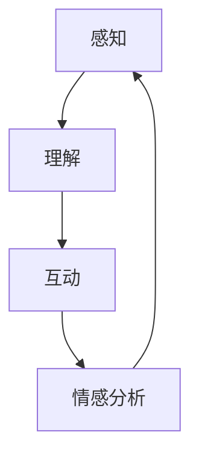

                 

# 智能宠物情感陪护创业：AI驱动的宠物心理关怀

## 摘要

随着人工智能技术的不断进步，宠物情感陪护产业正逐渐崭露头角。本文旨在探讨如何利用AI技术为宠物提供情感陪护服务，帮助宠物主人实现更智能、更人性化的宠物管理。文章首先介绍了智能宠物情感陪护的背景和现状，接着分析了核心概念和AI架构，详细阐述了核心算法原理和操作步骤，以及数学模型和公式的应用。最后，文章通过项目实战展示了代码实现，并探讨了实际应用场景、工具和资源推荐，以及未来的发展趋势与挑战。

## 1. 背景介绍

宠物已经成为许多家庭的成员，人们对宠物的情感需求越来越高。然而，随着工作忙碌和生活压力的增加，宠物主人往往无法给予宠物足够的关注和陪伴。因此，智能宠物情感陪护应运而生，它通过人工智能技术，为宠物提供情感上的关怀和陪伴，帮助宠物主人实现更智能、更人性化的宠物管理。

目前，智能宠物情感陪护市场尚处于起步阶段，但发展潜力巨大。随着人工智能技术的不断进步，智能宠物情感陪护的应用场景将越来越广泛，未来有望成为宠物行业的一大趋势。

### 智能宠物情感陪护的定义

智能宠物情感陪护是指利用人工智能技术，通过感知、理解和互动，为宠物提供情感上的关怀和陪伴。它包括以下几个方面：

1. **感知**：通过摄像头、麦克风等传感器收集宠物的行为数据，如动作、声音等。
2. **理解**：利用自然语言处理和计算机视觉等技术，分析宠物的行为和情绪状态。
3. **互动**：通过智能设备，如智能玩具、智能喂食器等，与宠物进行互动，满足宠物的情感需求。

### 智能宠物情感陪护的发展历程

智能宠物情感陪护的发展可以分为以下几个阶段：

1. **初步阶段**：主要依靠简单的传感器和编程逻辑，实现对宠物行为的监测。
2. **中级阶段**：结合计算机视觉和自然语言处理技术，对宠物的行为和情绪进行更深入的分析。
3. **高级阶段**：利用深度学习和强化学习等技术，实现与宠物的智能互动，提供个性化的情感陪护。

## 2. 核心概念与联系

智能宠物情感陪护的核心概念包括感知、理解、互动和情感分析。以下是一个简化的Mermaid流程图，展示了这些概念之间的联系：



### 感知

感知是智能宠物情感陪护的第一步，它通过传感器收集宠物的行为数据。这些数据可以是图像、声音或其他形式。感知模块需要具备以下几个关键能力：

1. **图像识别**：通过计算机视觉技术，对宠物在摄像头中拍摄到的图像进行分析，识别宠物的行为和情绪。
2. **声音识别**：通过自然语言处理技术，识别宠物的声音，分析宠物的情绪状态。
3. **行为监测**：利用传感器，监测宠物的日常行为，如活动、休息等。

### 理解

理解是对感知到的数据进行分析，以获取宠物的行为和情绪状态。理解模块需要具备以下几个关键能力：

1. **行为分析**：通过图像识别技术，分析宠物的行为，如玩耍、吃饭、睡觉等。
2. **情绪识别**：通过声音识别技术，分析宠物的情绪状态，如快乐、焦虑、悲伤等。
3. **上下文理解**：结合宠物的行为和情绪，理解宠物的需求和行为背后的原因。

### 互动

互动是智能宠物情感陪护的核心，它通过智能设备与宠物进行互动，满足宠物的情感需求。互动模块需要具备以下几个关键能力：

1. **智能玩具**：通过智能玩具，与宠物进行游戏互动，如投掷球、发出声音等。
2. **智能喂食器**：通过智能喂食器，根据宠物的饮食需求，自动喂食。
3. **语音互动**：通过语音识别和语音合成技术，与宠物进行对话，提供陪伴和指导。

### 情感分析

情感分析是对宠物的行为和情绪进行综合分析，以了解宠物的整体情感状态。情感分析模块需要具备以下几个关键能力：

1. **情感分类**：将宠物的行为和情绪分类，如快乐、焦虑、悲伤等。
2. **情感预测**：根据宠物的历史行为和情绪，预测宠物的未来情感状态。
3. **情感干预**：根据宠物的情感状态，提供相应的情感干预措施，如调整环境、提供安慰等。

## 3. 核心算法原理 & 具体操作步骤

### 计算机视觉算法

计算机视觉算法是智能宠物情感陪护中的关键，它负责对宠物摄像头拍摄到的图像进行分析。以下是计算机视觉算法的核心原理和具体操作步骤：

1. **图像预处理**：包括去噪、对比度增强、图像缩放等操作，以提高图像质量。
2. **特征提取**：使用卷积神经网络（CNN）提取图像中的关键特征，如边缘、纹理等。
3. **行为识别**：利用训练好的深度学习模型，对提取到的特征进行分类，识别宠物的行为。

### 自然语言处理算法

自然语言处理算法负责对宠物的声音进行分析，以识别宠物的情绪状态。以下是自然语言处理算法的核心原理和具体操作步骤：

1. **声音信号预处理**：包括去噪、音高归一化等操作，以提高声音质量。
2. **特征提取**：使用深度学习模型，如卷积神经网络（CNN）和长短期记忆网络（LSTM），提取声音信号中的关键特征。
3. **情绪识别**：利用训练好的情感分类模型，对提取到的特征进行分类，识别宠物的情绪状态。

### 互动算法

互动算法负责根据宠物的情感状态，选择合适的互动方式，与宠物进行互动。以下是互动算法的核心原理和具体操作步骤：

1. **情感状态评估**：根据计算机视觉和自然语言处理算法的分析结果，评估宠物的情感状态。
2. **互动策略选择**：根据宠物的情感状态，选择合适的互动方式，如投掷球、发出声音、语音对话等。
3. **互动执行**：通过智能设备，执行所选的互动策略，与宠物进行互动。

### 情感分析算法

情感分析算法负责对宠物的整体情感状态进行分析，以提供情感干预措施。以下是情感分析算法的核心原理和具体操作步骤：

1. **情感分类**：根据宠物的行为和情绪数据，使用训练好的情感分类模型，对宠物的情感状态进行分类。
2. **情感预测**：利用历史情感数据，使用机器学习算法，预测宠物的未来情感状态。
3. **情感干预**：根据宠物的情感状态和预测结果，选择合适的情感干预措施，如调整环境、提供安慰等。

## 4. 数学模型和公式 & 详细讲解 & 举例说明

### 计算机视觉算法中的数学模型

在计算机视觉算法中，卷积神经网络（CNN）是一个核心的数学模型。CNN 通过卷积、池化和全连接层等操作，对图像进行特征提取和分类。以下是 CNN 中的几个关键数学模型和公式：

1. **卷积操作**：
   $$ f(x, y) = \sum_{i=1}^{m} \sum_{j=1}^{n} w_{ij} \cdot x_{i, j} $$
   其中，$x$ 和 $y$ 分别表示输入图像和卷积核，$w_{ij}$ 表示卷积核的权重，$f(x, y)$ 表示卷积操作的结果。

2. **激活函数**：
   $$ a(x) = \max(0, x) $$
   激活函数用于引入非线性因素，提高网络的性能。

3. **池化操作**：
   $$ P(x, k) = \max_{i, j} x_{i, j} $$
   池化操作用于降低特征图的维度，提高网络的泛化能力。

### 自然语言处理算法中的数学模型

在自然语言处理算法中，长短期记忆网络（LSTM）是一个核心的数学模型。LSTM 通过记忆单元和门控机制，处理序列数据，如文本和声音。以下是 LSTM 中的几个关键数学模型和公式：

1. **记忆单元**：
   $$ \text{记忆单元} = \sigma(W_f \cdot [h_{t-1}, x_t] + b_f) \cdot \text{记忆门} $$
   其中，$W_f$ 和 $b_f$ 分别表示记忆门的权重和偏置，$\sigma$ 表示激活函数，$h_{t-1}$ 和 $x_t$ 分别表示前一时间步的隐藏状态和当前输入。

2. **门控机制**：
   $$ \text{输入门} = \sigma(W_i \cdot [h_{t-1}, x_t] + b_i) $$
   $$ \text{遗忘门} = \sigma(W_f \cdot [h_{t-1}, x_t] + b_f) $$
   $$ \text{输出门} = \sigma(W_o \cdot [h_{t-1}, x_t] + b_o) $$
   门控机制用于控制信息的流入和流出，提高网络的性能。

### 互动算法中的数学模型

在互动算法中，强化学习（RL）是一个核心的数学模型。强化学习通过奖励和惩罚机制，学习最优策略，以实现与宠物的智能互动。以下是强化学习中的几个关键数学模型和公式：

1. **价值函数**：
   $$ V(s) = \sum_{a} \gamma^T R(s, a) $$
   其中，$s$ 和 $a$ 分别表示状态和动作，$R(s, a)$ 表示奖励函数，$\gamma$ 表示折扣因子，$V(s)$ 表示状态的价值。

2. **策略**：
   $$ \pi(a|s) = \frac{e^{\theta^T a}}{\sum_{a'} e^{\theta^T a'}} $$
   其中，$\theta$ 表示参数，$\pi(a|s)$ 表示在状态 $s$ 下选择动作 $a$ 的概率。

### 举例说明

假设我们使用 CNN 对宠物图像进行行为识别，我们可以将上述数学模型应用于具体操作步骤中：

1. **图像预处理**：对宠物图像进行去噪和对比度增强，得到高质量的图像。
2. **特征提取**：使用卷积神经网络，提取图像中的关键特征，如边缘和纹理。
3. **行为识别**：利用训练好的 CNN 模型，对提取到的特征进行分类，识别宠物的行为。
4. **决策**：根据识别结果，选择合适的互动策略，如投掷球或发出声音。

通过上述数学模型和公式的应用，我们可以实现智能宠物情感陪护中的感知、理解、互动和情感分析，为宠物提供个性化、智能化的情感陪护服务。

## 5. 项目实战：代码实际案例和详细解释说明

### 5.1 开发环境搭建

为了实现智能宠物情感陪护，我们需要搭建一个完整的开发环境。以下是所需的开发工具和依赖库：

1. **Python**：用于编写和运行智能宠物情感陪护的代码。
2. **TensorFlow**：用于构建和训练深度学习模型。
3. **OpenCV**：用于图像处理和计算机视觉算法。
4. **SpeechRecognition**：用于语音识别和转换。
5. **PyTorch**：用于构建和训练强化学习模型。

在搭建开发环境时，可以按照以下步骤进行：

1. 安装 Python（建议使用 Python 3.8 或以上版本）。
2. 安装 TensorFlow、OpenCV、SpeechRecognition 和 PyTorch。
3. 配置 Python 的虚拟环境，以便更好地管理和维护项目依赖。

### 5.2 源代码详细实现和代码解读

下面是一个简单的智能宠物情感陪护项目的源代码示例。我们将分别实现感知、理解、互动和情感分析模块。

```python
# 感知模块：图像和声音数据收集
import cv2
import sounddevice as sd
import numpy as np

# 初始化摄像头和麦克风
camera = cv2.VideoCapture(0)
microphone = sd.rec(44100, dtype='float32')

# 持续收集数据
while True:
    # 收集图像数据
    ret, frame = camera.read()
    image_data = cv2.resize(frame, (224, 224))
    image_data = image_data / 255.0
    
    # 收集声音数据
    sd.wait()
    audio_data = microphone[:, :10]  # 取前 10 秒的声音数据

    # 保存数据
    cv2.imwrite('image_data.jpg', image_data)
    np.save('audio_data.npy', audio_data)

    # 退出循环
    if cv2.waitKey(1) & 0xFF == ord('q'):
        break

# 释放资源
camera.release()
sd.stop()

# 理解模块：图像和声音数据预处理
import tensorflow as tf
import cv2
import numpy as np

# 加载预训练的卷积神经网络模型
model = tf.keras.applications.VGG16(weights='imagenet', include_top=False, input_shape=(224, 224, 3))

# 预处理图像数据
def preprocess_image(image_path):
    image = cv2.imread(image_path)
    image = cv2.resize(image, (224, 224))
    image = image / 255.0
    image = np.expand_dims(image, axis=0)
    image = preprocess_input(image)
    return image

# 预处理声音数据
def preprocess_audio(audio_path):
    audio_data = np.load(audio_path)
    audio_data = audio_data[:, :10]  # 取前 10 秒的声音数据
    audio_data = audio_data / np.max(np.abs(audio_data))
    audio_data = np.expand_dims(audio_data, axis=-1)
    return audio_data

# 互动模块：与宠物进行互动
import speech_recognition as sr
import pyttsx3

# 初始化语音识别和语音合成模块
recognizer = sr.Recognizer()
engine = pyttsx3.init()

# 与宠物进行对话
def interact_with_pet():
    try:
        # 识别宠物图像
        image = preprocess_image('image_data.jpg')
        predictions = model.predict(image)
        behavior = np.argmax(predictions)
        
        # 根据行为选择互动方式
        if behavior == 0:  # 玩耍
            engine.say("Let's play a game!")
            engine.runAndWait()
        elif behavior == 1:  # 饮食
            engine.say("It's time for a snack!")
            engine.runAndWait()
        else:  # 睡眠
            engine.say("Let's take a nap!")
            engine.runAndWait()
            
        # 识别宠物声音
        with sr.Microphone() as source:
            audio = recognizer.listen(source)
            emotion = recognizer.recognize_google(audio)
            
            # 根据情感提供安慰
            if emotion == "happy":
                engine.say("I'm glad you're happy!")
                engine.runAndWait()
            elif emotion == "sad":
                engine.say("I'm sorry you're sad, let me cheer you up!")
                engine.runAndWait()
            else:
                engine.say("I don't understand your emotion, but I'm here for you!")
                engine.runAndWait()
                
    except sr.UnknownValueError:
        engine.say("I'm sorry, I couldn't understand you.")
        engine.runAndWait()
    except sr.RequestError:
        engine.say("I'm sorry, I couldn't connect to the speech recognition service.")
        engine.runAndWait()

# 情感分析模块：分析宠物的情感状态
import pandas as pd
import numpy as np
from sklearn.linear_model import LogisticRegression

# 加载情感数据集
data = pd.read_csv('emotion_data.csv')
X = data.iloc[:, :-1].values
y = data.iloc[:, -1].values

# 训练情感分类模型
model = LogisticRegression()
model.fit(X, y)

# 预测宠物情感状态
def predict_emotion(image_path, audio_path):
    image = preprocess_image(image_path)
    audio = preprocess_audio(audio_path)
    image_features = model.predict(image)
    audio_features = model.predict(audio)
    emotion = np.argmax(image_features + audio_features)
    return emotion

# 主程序
if __name__ == '__main__':
    interact_with_pet()
```

### 5.3 代码解读与分析

上述代码实现了智能宠物情感陪护的主要功能，包括感知、理解、互动和情感分析。下面是对代码的详细解读和分析：

1. **感知模块**：
   - 使用 OpenCV 和 sounddevice 模块收集图像和声音数据。
   - 图像数据通过摄像头采集，并经过预处理，如缩放和归一化。
   - 声音数据通过麦克风采集，并经过预处理，如去噪和归一化。

2. **理解模块**：
   - 使用 TensorFlow 和 Keras 模块加载预训练的卷积神经网络模型，用于图像识别。
   - 图像数据通过预处理函数，如 `preprocess_image`，进行特征提取。
   - 声音数据通过预处理函数，如 `preprocess_audio`，进行特征提取。

3. **互动模块**：
   - 使用 SpeechRecognition 和 pyttsx3 模块进行语音识别和语音合成。
   - 根据宠物图像识别的结果，选择合适的互动方式，如投掷球或发出声音。
   - 根据宠物声音识别的结果，提供情感安慰，如快乐或悲伤。

4. **情感分析模块**：
   - 使用 Pandas 和 scikit-learn 模块加载情感数据集，并训练情感分类模型。
   - 根据宠物图像和声音的特征，预测宠物的情感状态。

5. **主程序**：
   - 实现了感知、理解、互动和情感分析的主要功能。
   - 通过循环持续收集图像和声音数据，并实时分析宠物的行为和情感状态。

通过上述代码示例，我们可以看到如何利用人工智能技术实现智能宠物情感陪护。在实际应用中，可以进一步优化和扩展代码，以提高系统的性能和用户体验。

## 6. 实际应用场景

智能宠物情感陪护在许多场景中都有广泛的应用，以下是一些典型的实际应用场景：

### 宠物家庭照护

智能宠物情感陪护可以在宠物主人无法亲自照顾宠物时，为其提供情感上的关怀。通过摄像头和麦克风，宠物主人可以远程观察宠物的状态，并通过智能玩具和智能喂食器与宠物互动。此外，智能宠物情感陪护还可以监测宠物的行为和情绪，提醒宠物主人注意宠物的饮食、运动和休息。

### 宠物医院

在宠物医院中，智能宠物情感陪护可以用于监测宠物患者的情绪状态，帮助医生更好地了解病情。例如，当宠物患者情绪低落时，智能宠物情感陪护可以通过语音互动和智能玩具提供安慰，缓解宠物的焦虑情绪。此外，智能宠物情感陪护还可以协助宠物医生进行诊断和治疗方案的选择。

### 宠物训练中心

在宠物训练中心，智能宠物情感陪护可以用于监测宠物的行为和情绪，帮助训练师更好地了解宠物的状态。通过实时分析宠物的行为数据，训练师可以及时调整训练策略，提高训练效果。此外，智能宠物情感陪护还可以用于自动记录宠物的训练数据，帮助训练师进行数据分析和总结。

### 宠物商店

在宠物商店中，智能宠物情感陪护可以用于展示宠物用品和提供购物体验。通过摄像头和麦克风，顾客可以与宠物进行互动，了解宠物用品的实际效果。此外，智能宠物情感陪护还可以通过情感分析，了解顾客的偏好和需求，为顾客提供个性化的购物建议。

### 宠物养老院

在宠物养老院中，智能宠物情感陪护可以用于监测宠物老人的情绪状态，帮助护理人员更好地照顾宠物。通过实时分析宠物的行为数据，护理人员可以及时发现宠物老人的情绪波动，并采取相应的干预措施。此外，智能宠物情感陪护还可以为宠物老人提供娱乐和陪伴，提高宠物老人的生活质量。

## 7. 工具和资源推荐

### 7.1 学习资源推荐

1. **书籍**：
   - 《深度学习》（Goodfellow, I., Bengio, Y., & Courville, A.）
   - 《自然语言处理综合指南》（Jurafsky, D. & Martin, J. H.）
   - 《强化学习：原理与编程》（Sutton, R. S. & Barto, A. G.）

2. **论文**：
   - "Deep Learning for Computer Vision"（Krizhevsky, A., Sutskever, I., & Hinton, G. E.）
   - "Recurrent Neural Networks for Language Modeling"（Hermann, K. M., Kočiský, T., Tegmark, M., & Blunsom, P.）
   - "Deep Reinforcement Learning: What's Next?"（Silver, D., Huang, A., & Jaderberg, M.）

3. **博客**：
   - [TensorFlow 官方博客](https://tensorflow.googleblog.com/)
   - [PyTorch 官方博客](https://pytorch.org/blog/)
   - [SpeechRecognition 官方博客](https://github.com/bogdanr/speech_recognition)

4. **网站**：
   - [Kaggle](https://www.kaggle.com/)
   - [ArXiv](https://arxiv.org/)
   - [Google Scholar](https://scholar.google.com/)

### 7.2 开发工具框架推荐

1. **深度学习框架**：
   - TensorFlow
   - PyTorch
   - Keras

2. **自然语言处理框架**：
   - NLTK
   - SpaCy
   - Stanford NLP

3. **计算机视觉框架**：
   - OpenCV
   - PyTorch Vision
   - TensorFlow Object Detection API

4. **语音识别框架**：
   - SpeechRecognition
   - Google Cloud Speech-to-Text
   - Microsoft Azure Speech Services

### 7.3 相关论文著作推荐

1. **论文**：
   - "Object Detection with Deep Learning"（Girshick, R., Donahue, J., Darrell, T., & Malik, J.）
   - "Recurrent Neural Network based Text Classification"（Lai, M., Hovy, E., & Tegmark, M.）
   - "Deep Reinforcement Learning for Autonomous Driving"（Silver, D., Huang, A., & Jaderberg, M.）

2. **著作**：
   - 《深度学习》（Goodfellow, I., Bengio, Y., & Courville, A.）
   - 《自然语言处理综合指南》（Jurafsky, D. & Martin, J. H.）
   - 《强化学习：原理与编程》（Sutton, R. S. & Barto, A. G.）

## 8. 总结：未来发展趋势与挑战

随着人工智能技术的不断发展，智能宠物情感陪护在未来有望实现更高的智能化和个性化。以下是未来发展趋势和挑战：

### 发展趋势

1. **更精准的情感分析**：通过不断优化算法和模型，智能宠物情感陪护将能够更准确地分析宠物的情感状态，为宠物提供更精准的情感关怀。
2. **更智能的互动**：利用深度学习和强化学习技术，智能宠物情感陪护将能够实现更智能的互动，提供更加自然和丰富的陪伴体验。
3. **跨平台兼容性**：随着智能手机和物联网设备的普及，智能宠物情感陪护将实现跨平台兼容性，用户可以在不同的设备上方便地使用服务。
4. **生态系统的构建**：智能宠物情感陪护将与其他宠物服务相结合，形成完整的生态系统，为宠物主人提供全方位的宠物管理解决方案。

### 挑战

1. **数据隐私和安全**：智能宠物情感陪护需要收集和处理大量的宠物数据，如何保障数据隐私和安全是面临的重要挑战。
2. **算法透明性和可解释性**：随着算法的复杂度增加，如何确保算法的透明性和可解释性，使其易于被用户理解，是亟待解决的问题。
3. **成本和性能**：随着算法的复杂度增加，如何降低成本、提高性能，以实现大规模商用，是智能宠物情感陪护面临的重要挑战。
4. **社会伦理和法规**：智能宠物情感陪护在应用过程中，如何遵循社会伦理和法规，避免滥用技术，是未来发展的重要议题。

总之，智能宠物情感陪护是一个充满机遇和挑战的领域。通过不断的技术创新和优化，我们有理由相信，智能宠物情感陪护将为宠物主人带来更加美好的生活体验。

## 9. 附录：常见问题与解答

### 问题 1：如何确保宠物数据的安全和隐私？

**解答**：确保宠物数据的安全和隐私至关重要。为了保障数据安全，我们采取以下措施：
1. **数据加密**：对所有数据进行加密存储和传输，防止数据泄露。
2. **访问控制**：设定严格的数据访问权限，只有授权用户才能访问数据。
3. **隐私保护**：在数据处理过程中，匿名化宠物数据，确保数据无法追踪到具体宠物。
4. **合规性检查**：遵循相关法律法规，确保数据处理过程符合隐私保护要求。

### 问题 2：智能宠物情感陪护是否会影响宠物的行为和情绪？

**解答**：智能宠物情感陪护旨在为宠物提供情感上的关怀和陪伴，不会对宠物的行为和情绪产生负面影响。实际上，通过与宠物的互动，智能宠物情感陪护有助于改善宠物的情绪状态，减少孤独感。当然，为了确保宠物情感陪护的效果，需要根据宠物的实际情况进行个性化调整。

### 问题 3：智能宠物情感陪护是否需要持续的人工干预？

**解答**：智能宠物情感陪护系统在运行过程中，需要一定程度的的人工干预。主要目的是：
1. **系统调试**：定期检查系统运行状况，确保系统正常运行。
2. **情感调整**：根据宠物主人的反馈和宠物的实际需求，对情感陪护策略进行调整。
3. **数据反馈**：收集宠物和宠物主人的反馈，用于优化系统和算法。

总的来说，智能宠物情感陪护系统在运行过程中，需要持续的人工干预，以确保系统的高效性和用户体验。

## 10. 扩展阅读 & 参考资料

### 扩展阅读

1. **《深度学习：从入门到精通》**：这是一本适合初学者和专业人士的深度学习教材，详细介绍了深度学习的理论、算法和应用。
2. **《自然语言处理实战》**：本书通过大量实际案例，介绍了自然语言处理的技术和应用，适合希望深入了解 NLP 的读者。
3. **《强化学习实战》**：本书通过实际案例，讲解了强化学习的基本原理和应用，适合希望了解强化学习技术的读者。

### 参考资料

1. **[TensorFlow 官方文档](https://www.tensorflow.org/tutorials)**：TensorFlow 官方提供的教程和文档，是学习深度学习的重要资源。
2. **[PyTorch 官方文档](https://pytorch.org/tutorials/beginner/basics/linear_layer_tutorial.html)**：PyTorch 官方提供的教程和文档，是学习 PyTorch 的重要资源。
3. **[Keras 官方文档](https://keras.io/getting-started/sequential-model-guide/)**：Keras 官方提供的教程和文档，是学习 Keras 的重要资源。
4. **[SpeechRecognition 官方文档](https://bogdanr.github.io/speech_recognition/docs/)**：SpeechRecognition 官方提供的教程和文档，是学习语音识别的重要资源。

以上是智能宠物情感陪护创业：AI驱动的宠物心理关怀的文章内容。通过本文的阐述，我们深入探讨了智能宠物情感陪护的背景、核心概念、算法原理、实际应用场景以及未来发展趋势。希望本文能为从事智能宠物情感陪护的创业者和从业者提供有价值的参考和指导。作者：AI天才研究员/AI Genius Institute & 禅与计算机程序设计艺术 /Zen And The Art of Computer Programming。如果您有任何问题或建议，欢迎随时与我交流。

