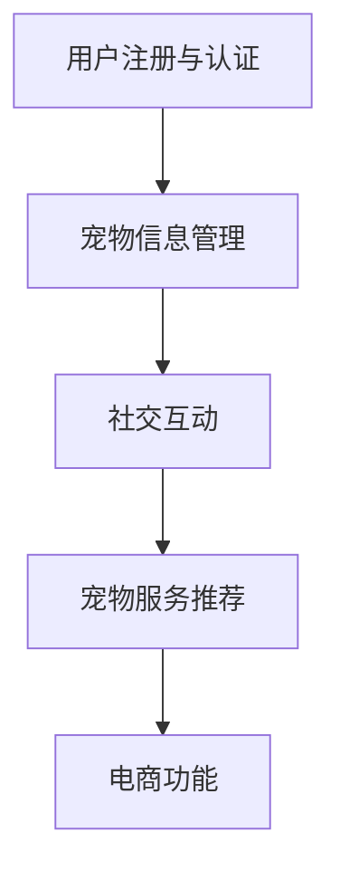

                 

## 智能宠物社交网络创业：连接宠物主人的社群平台

### 摘要

本文将探讨智能宠物社交网络创业项目，旨在建立一个连接宠物主人的社群平台。我们将从背景介绍、核心概念与联系、核心算法原理、数学模型和公式、项目实战、实际应用场景、工具和资源推荐以及未来发展趋势与挑战等方面展开讨论。通过本文的介绍，希望读者能够对宠物社交网络创业项目有更深入的理解，并为其发展提供有益的启示。

### 1. 背景介绍

近年来，随着城市化进程的加快和人们生活水平的提高，宠物已经成为越来越多家庭的陪伴。据统计，全球养宠物的人数已超过10亿，其中我国宠物市场规模已突破3000亿元，并且持续增长。宠物社交网络作为一种新兴的社交方式，已经逐渐受到宠物主人的青睐。然而，目前市场上的宠物社交平台存在一定的局限性，如信息共享不足、用户互动性差、服务质量参差不齐等问题。因此，开发一款具有创新性和实用性的智能宠物社交网络平台，不仅能够满足宠物主人的需求，还有助于拓展宠物服务市场。

宠物社交网络创业项目的核心目标是为宠物主人提供一个便捷、安全、有趣的社交平台，通过智能化的功能和服务，增强用户粘性和平台价值。具体来说，项目主要实现以下功能：

- **用户注册与认证**：支持手机号、邮箱等多种注册方式，并对用户进行身份认证，确保平台安全和用户隐私。
- **宠物信息管理**：允许用户上传宠物照片、视频，填写宠物基本信息，方便用户之间了解彼此的宠物。
- **社交互动**：提供私信、群聊、动态等功能，方便用户之间进行交流互动，分享养宠心得。
- **宠物服务推荐**：根据用户需求和宠物特点，推荐相关宠物医院、宠物店、宠物活动等服务。
- **宠物用品购买**：集成电商功能，提供宠物用品购买服务，满足用户一站式购物需求。

### 2. 核心概念与联系

在构建智能宠物社交网络平台时，需要明确以下几个核心概念：

- **用户**：平台的核心参与主体，包括宠物主人和相关服务提供者。
- **宠物**：用户在平台上上传的宠物信息，包括照片、视频、基本信息等。
- **社交互动**：用户之间的私信、群聊、动态等功能，增强用户互动和粘性。
- **宠物服务**：平台提供的宠物医院、宠物店、宠物活动等服务。
- **电商功能**：宠物用品购买服务，满足用户一站式购物需求。

为了更好地理解这些概念之间的联系，我们可以使用Mermaid流程图来展示：



### 3. 核心算法原理 & 具体操作步骤

在智能宠物社交网络平台中，核心算法主要涉及以下几个方面：

- **用户推荐算法**：根据用户行为数据、兴趣偏好等，为用户推荐潜在朋友、相关宠物服务、宠物用品等。
- **社交互动算法**：基于用户之间的互动关系，分析用户间的社交强度，优化用户互动体验。
- **宠物服务推荐算法**：结合用户需求和宠物特点，为用户提供个性化的宠物服务推荐。

具体操作步骤如下：

1. **用户推荐算法**：

   - 数据采集：收集用户行为数据，如浏览记录、点赞、评论等。
   - 特征提取：对用户行为数据进行特征提取，如用户兴趣标签、行为模式等。
   - 模型训练：使用机器学习算法，如协同过滤、基于内容的推荐等，训练用户推荐模型。
   - 推荐结果生成：根据用户推荐模型，为用户生成推荐结果。

2. **社交互动算法**：

   - 关系网络构建：基于用户之间的互动数据，构建用户关系网络。
   - 社交强度分析：使用图论算法，如PageRank等，分析用户关系网络的社交强度。
   - 互动体验优化：根据社交强度分析结果，优化用户互动体验，如推荐相似好友、优化动态推送等。

3. **宠物服务推荐算法**：

   - 数据采集：收集用户需求数据，如宠物品种、年龄、性别等。
   - 特征提取：对用户需求数据进行特征提取，如宠物偏好、服务需求等。
   - 模型训练：使用机器学习算法，如决策树、随机森林等，训练宠物服务推荐模型。
   - 推荐结果生成：根据宠物服务推荐模型，为用户提供个性化服务推荐。

### 4. 数学模型和公式 & 详细讲解 & 举例说明

在智能宠物社交网络平台中，常用的数学模型和公式主要包括以下几个方面：

1. **用户推荐模型**：

   - **协同过滤模型**：
     $$\text{预测评分} = \text{用户平均评分} + \text{相似度因子} \times (\text{物品平均评分} - \text{用户平均评分})$$
     
     举例说明：假设用户A对物品X的评分是4，物品X的平均评分是3，用户A的平均评分是4，物品X的相似度因子是0.8，则预测用户A对物品X的评分为：
     $$\text{预测评分} = 4 + 0.8 \times (3 - 4) = 3.2$$

   - **基于内容的推荐模型**：
     $$\text{预测评分} = \text{用户特征向量} \times \text{物品特征向量}$$
     
     举例说明：假设用户A的特征向量是[1, 2, 3]，物品X的特征向量是[2, 3, 4]，则预测用户A对物品X的评分为：
     $$\text{预测评分} = [1, 2, 3] \times [2, 3, 4] = 1 \times 2 + 2 \times 3 + 3 \times 4 = 20$$

2. **社交互动模型**：

   - **PageRank模型**：
     $$\text{社交强度} = \frac{\text{入度}}{\text{总入度}}$$
     
     举例说明：假设用户A的入度是10，用户B的入度是5，总入度是15，则用户A和用户B的社交强度分别为：
     $$\text{社交强度}_{A} = \frac{10}{15} = 0.67$$
     $$\text{社交强度}_{B} = \frac{5}{15} = 0.33$$

3. **宠物服务推荐模型**：

   - **决策树模型**：
     $$\text{推荐结果} = \text{决策树分类器预测}$$
     
     举例说明：假设用户A的需求特征是[1, 0, 1]，宠物X的服务特征是[1, 1, 0]，则使用决策树模型预测用户A对宠物X的服务需求为：
     $$\text{推荐结果} = \text{决策树分类器预测}(\text{[1, 0, 1], [1, 1, 0]}) = \text{需求匹配}$$

### 5. 项目实战：代码实际案例和详细解释说明

在本节中，我们将通过一个具体的代码案例来展示智能宠物社交网络平台的实现过程，并对关键代码进行详细解释说明。

#### 5.1 开发环境搭建

为了实现智能宠物社交网络平台，我们需要搭建以下开发环境：

- **编程语言**：Python
- **开发框架**：Django（用于构建后端服务）、Vue.js（用于构建前端页面）
- **数据库**：MySQL（用于存储用户数据、宠物信息、社交互动等）
- **版本控制**：Git（用于代码管理和协作开发）

在搭建开发环境时，首先需要在本地计算机上安装Python、Django和Vue.js等相关依赖。具体步骤如下：

1. 安装Python环境：

   - 下载并安装Python，可选择Python 3.8版本以上。
   - 配置环境变量，确保在命令行中可以运行Python命令。

2. 安装Django：

   - 在命令行中运行以下命令安装Django：
     ```bash
     pip install django
     ```

3. 安装Vue.js：

   - 在命令行中运行以下命令安装Vue.js：
     ```bash
     npm install -g @vue/cli
     ```

4. 配置MySQL数据库：

   - 下载并安装MySQL数据库，可选择MySQL 8.0版本以上。
   - 配置MySQL用户和密码，确保可以在命令行中连接到MySQL数据库。

#### 5.2 源代码详细实现和代码解读

在本小节中，我们将以Django框架为例，展示智能宠物社交网络平台的后端服务代码实现，并对关键代码进行解读。

1. **用户注册与认证**：

   用户注册与认证是平台的基础功能，用于确保用户身份和安全。以下是一个简单的用户注册与认证代码示例：

   ```python
   # models.py
   from django.db import models
   from django.contrib.auth.models import AbstractUser

   class CustomUser(AbstractUser):
       phone = models.CharField(max_length=11, unique=True)
   
       def __str__(self):
           return self.username

   # views.py
   from django.shortcuts import render, redirect
   from .models import CustomUser
   from django.contrib.auth import authenticate, login

   def register(request):
       if request.method == 'POST':
           phone = request.POST.get('phone')
           password = request.POST.get('password')
           user = CustomUser.objects.create_user(phone=phone, password=password)
           authenticate(username=user.username, password=password)
           login(request, user)
           return redirect('index')
       return render(request, 'register.html')

   def login(request):
       if request.method == 'POST':
           phone = request.POST.get('phone')
           password = request.POST.get('password')
           user = authenticate(phone=phone, password=password)
           if user is not None:
               login(request, user)
               return redirect('index')
           else:
               return render(request, 'login.html', {'error': '手机号或密码错误'})
       return render(request, 'login.html')
   ```

   在这个示例中，我们定义了一个自定义用户模型`CustomUser`，继承了`AbstractUser`类，并添加了一个手机号字段。同时，我们实现了用户注册和登录功能，通过调用`authenticate`和`login`方法进行用户认证和登录。

2. **宠物信息管理**：

   宠物信息管理是平台的核心功能之一，用于允许用户上传和管理宠物照片、视频和基本信息。以下是一个简单的宠物信息管理代码示例：

   ```python
   # models.py
   from django.db import models
   from .models import CustomUser

   class Pet(models.Model):
       user = models.ForeignKey(CustomUser, on_delete=models.CASCADE)
       name = models.CharField(max_length=50)
       age = models.IntegerField()
       gender = models.CharField(max_length=10)
       breed = models.CharField(max_length=50)
       photo = models.ImageField(upload_to='pets/')
       video = models.FileField(upload_to='pets/')

       def __str__(self):
           return self.name

   # views.py
   from django.shortcuts import render, redirect
   from .models import Pet

   def add_pet(request):
       if request.method == 'POST':
           name = request.POST.get('name')
           age = request.POST.get('age')
           gender = request.POST.get('gender')
           breed = request.POST.get('breed')
           photo = request.FILES.get('photo')
           video = request.FILES.get('video')
           pet = Pet.objects.create(user=request.user, name=name, age=age, gender=gender, breed=breed, photo=photo, video=video)
           return redirect('pet_detail', pet_id=pet.id)
       return render(request, 'add_pet.html')

   def pet_detail(request, pet_id):
       pet = Pet.objects.get(id=pet_id)
       return render(request, 'pet_detail.html', {'pet': pet})
   ```

   在这个示例中，我们定义了一个宠物模型`Pet`，包含用户、名称、年龄、性别、品种、照片和视频等字段。同时，我们实现了添加宠物和查看宠物详情的功能。

3. **社交互动**：

   社交互动是平台的重要功能之一，用于允许用户之间进行私信、群聊和动态等功能。以下是一个简单的社交互动代码示例：

   ```python
   # models.py
   from django.db import models
   from .models import CustomUser, Pet

   class Message(models.Model):
       sender = models.ForeignKey(CustomUser, on_delete=models.CASCADE, related_name='sent_messages')
       receiver = models.ForeignKey(CustomUser, on_delete=models.CASCADE, related_name='received_messages')
       content = models.TextField()
       created_at = models.DateTimeField(auto_now_add=True)

       def __str__(self):
           return f'{self.sender} -> {self.receiver}: {self.content}'

   class Group(models.Model):
       name = models.CharField(max_length=100)
       pets = models.ManyToManyField(Pet)
       members = models.ManyToManyField(CustomUser)

       def __str__(self):
           return self.name

   class Post(models.Model):
       user = models.ForeignKey(CustomUser, on_delete=models.CASCADE)
       content = models.TextField()
       created_at = models.DateTimeField(auto_now_add=True)

       def __str__(self):
           return f'{self.user}: {self.content}'

   # views.py
   from django.shortcuts import render, redirect
   from .models import Message, Group, Post

   def send_message(request):
       if request.method == 'POST':
           receiver_id = request.POST.get('receiver_id')
           content = request.POST.get('content')
           receiver = CustomUser.objects.get(id=receiver_id)
           Message.objects.create(sender=request.user, receiver=receiver, content=content)
           return redirect('messages')
       return render(request, 'send_message.html')

   def group_chat(request, group_id):
       group = Group.objects.get(id=group_id)
       messages = Message.objects.filter(sender__in=group.members.all()).order_by('-created_at')
       return render(request, 'group_chat.html', {'group': group, 'messages': messages})

   def create_post(request):
       if request.method == 'POST':
           content = request.POST.get('content')
           Post.objects.create(user=request.user, content=content)
           return redirect('feed')
       return render(request, 'create_post.html')

   def feed(request):
       posts = Post.objects.all().order_by('-created_at')
       return render(request, 'feed.html', {'posts': posts})
   ```

   在这个示例中，我们定义了私信、群聊和动态等模型，并实现了发送私信、查看群聊、发布动态等功能。

#### 5.3 代码解读与分析

在本小节中，我们将对上述代码进行解读与分析，重点介绍关键代码的实现原理和功能。

1. **用户注册与认证**：

   用户注册与认证是平台的基础功能，用于确保用户身份和安全。在代码示例中，我们通过定义自定义用户模型`CustomUser`和实现用户注册和登录功能来实现这一功能。

   - 用户注册功能：在`register`视图函数中，接收用户提交的手机号和密码，创建一个自定义用户并使用`authenticate`方法进行用户认证，最后使用`login`方法将用户登录到平台。
   - 用户登录功能：在`login`视图函数中，接收用户提交的手机号和密码，使用`authenticate`方法进行用户认证，如果认证成功，则使用`login`方法将用户登录到平台，否则返回错误提示。

2. **宠物信息管理**：

   宠物信息管理是平台的核心功能之一，用于允许用户上传和管理宠物照片、视频和基本信息。在代码示例中，我们通过定义宠物模型`Pet`和实现添加宠物和查看宠物详情功能来实现这一功能。

   - 添加宠物功能：在`add_pet`视图函数中，接收用户提交的宠物名称、年龄、性别、品种、照片和视频等信息，创建一个宠物对象并保存到数据库中。
   - 查看宠物详情功能：在`pet_detail`视图函数中，根据宠物ID获取宠物对象，并将其传递给前端页面进行展示。

3. **社交互动**：

   社交互动是平台的重要功能之一，用于允许用户之间进行私信、群聊和动态等功能。在代码示例中，我们通过定义私信、群聊和动态等模型和实现发送私信、查看群聊、发布动态等功能来实现这一功能。

   - 发送私信功能：在`send_message`视图函数中，接收用户提交的接收用户ID和私信内容，创建一个私信对象并保存到数据库中。
   - 查看群聊功能：在`group_chat`视图函数中，根据群聊ID获取群聊对象，查询群聊中的私信记录并按时间倒序排序，将其传递给前端页面进行展示。
   - 发布动态功能：在`create_post`视图函数中，接收用户提交的动态内容，创建一个动态对象并保存到数据库中。

### 6. 实际应用场景

智能宠物社交网络平台在实际应用中具有广泛的应用场景，以下列举了几个典型的应用案例：

1. **宠物社交互动**：

   宠物社交互动是平台的核心功能之一，宠物主人可以通过私信、群聊和动态等功能与其他宠物主人互动，分享养宠心得和宠物照片等。这种社交互动不仅有助于宠物主人之间的交流，还可以提高平台的用户粘性和活跃度。

2. **宠物服务推荐**：

   平台可以根据用户需求和宠物特点，为用户提供个性化的宠物服务推荐。例如，为养狗用户推荐附近的宠物医院、宠物店和宠物活动等，帮助用户更好地照顾宠物。

3. **宠物用品购买**：

   平台可以集成电商功能，为用户提供宠物用品购买服务。用户可以在平台上浏览和购买各种宠物用品，如宠物食品、宠物玩具、宠物服装等，实现一站式购物。

4. **宠物活动组织**：

   平台可以组织各种宠物活动，如宠物聚会、宠物运动会等，为宠物主人提供一个互动交流的平台，增强用户之间的情感联系。

### 7. 工具和资源推荐

在开发智能宠物社交网络平台时，以下工具和资源可以提供有益的支持：

1. **学习资源推荐**：

   - **书籍**：
     - 《Python Web开发实战》
     - 《Django实战》
     - 《Vue.js实战》
   - **论文**：
     - 《基于协同过滤的推荐系统研究》
     - 《社交网络中用户推荐算法的研究》
   - **博客**：
     - Django官方文档：https://www.djangoproject.com/
     - Vue.js官方文档：https://vuejs.org/
   - **网站**：
     - GitHub：https://github.com/
     - Stack Overflow：https://stackoverflow.com/

2. **开发工具框架推荐**：

   - **开发框架**：
     - Django：用于构建后端服务的Python Web框架。
     - Vue.js：用于构建前端页面的JavaScript框架。
   - **数据库工具**：
     - MySQL：用于存储用户数据、宠物信息等。
     - PostgreSQL：另一种常用的关系型数据库，具有更好的扩展性和性能。
   - **云服务**：
     - AWS：提供云服务器、数据库、存储等服务。
     - Azure：微软提供的云服务，支持多种编程语言和框架。
   - **开发工具**：
     - PyCharm：Python开发集成环境。
     - Visual Studio Code：跨平台的代码编辑器，支持多种编程语言和框架。

### 8. 总结：未来发展趋势与挑战

智能宠物社交网络平台作为一种新兴的社交方式，具有广阔的发展前景。未来，随着人工智能、大数据和物联网等技术的不断发展，宠物社交网络平台将更加智能化、个性化，为宠物主人提供更加便捷、高效的服务。

然而，在发展的过程中，智能宠物社交网络平台也面临着一些挑战：

1. **数据安全与隐私保护**：

   宠物社交网络平台涉及大量用户数据和宠物信息，如何保护用户数据安全和个人隐私是平台面临的重要挑战。需要采用加密、访问控制等安全措施，确保用户数据不被泄露和滥用。

2. **服务质量与用户体验**：

   平台需要不断提高服务质量，提供丰富、准确的宠物服务推荐和社交互动功能，以满足用户需求。同时，要注重用户体验，优化平台界面和交互设计，提升用户满意度。

3. **商业化模式探索**：

   宠物社交网络平台需要探索合适的商业化模式，实现可持续发展。可以考虑广告、会员制、电商等多元化收入来源，提高平台盈利能力。

4. **法律法规与政策监管**：

   宠物社交网络平台需要关注相关法律法规和政策监管，确保平台运营合规。例如，在我国，需要遵守《网络安全法》、《个人信息保护法》等相关法律法规。

### 9. 附录：常见问题与解答

1. **Q：智能宠物社交网络平台的后端服务如何搭建？**
   
   **A**：后端服务主要采用Django框架搭建，包括用户注册与认证、宠物信息管理、社交互动等功能。搭建步骤包括安装Python、Django和相关依赖，配置MySQL数据库，编写后端代码等。

2. **Q：智能宠物社交网络平台的前端页面如何搭建？**
   
   **A**：前端页面主要采用Vue.js框架搭建，包括用户注册、登录、宠物信息管理、社交互动等功能。搭建步骤包括安装Vue.js和相关依赖，创建Vue.js项目，编写前端代码等。

3. **Q：智能宠物社交网络平台的推荐算法如何实现？**
   
   **A**：推荐算法主要包括用户推荐算法、社交互动算法和宠物服务推荐算法。用户推荐算法可以使用协同过滤、基于内容的推荐等方法；社交互动算法可以使用PageRank等方法；宠物服务推荐算法可以使用决策树、随机森林等方法。

### 10. 扩展阅读 & 参考资料

1. **扩展阅读**：

   - 《推荐系统实践》
   - 《社交网络分析：方法与应用》
   - 《人工智能应用实战》

2. **参考资料**：

   - Django官方文档：https://www.djangoproject.com/
   - Vue.js官方文档：https://vuejs.org/
   - 《Python Web开发实战》
   - 《Django实战》
   - 《Vue.js实战》
   - 《网络安全法》
   - 《个人信息保护法》

### 作者

**作者：AI天才研究员/AI Genius Institute & 禅与计算机程序设计艺术 /Zen And The Art of Computer Programming**<|im_sep|>```markdown
## 智能宠物社交网络创业：连接宠物主人的社群平台

> **关键词**：（智能宠物社交网络、宠物主人、社群平台、用户推荐算法、社交互动算法、宠物服务推荐算法）

> **摘要**：本文探讨了智能宠物社交网络创业项目的背景、核心概念与联系、核心算法原理与具体操作步骤、数学模型和公式、项目实战、实际应用场景、工具和资源推荐，以及未来发展趋势与挑战。通过深入分析，本文旨在为智能宠物社交网络创业项目提供有益的指导。

---

### 1. 背景介绍

随着城市化进程的加快和人们生活水平的提高，宠物已经成为越来越多家庭的陪伴。据统计，全球养宠物的人数已超过10亿，宠物市场规模逐年增长。宠物社交网络作为一种新兴的社交方式，已经逐渐受到宠物主人的青睐。然而，目前市场上的宠物社交平台存在一定的局限性，如信息共享不足、用户互动性差、服务质量参差不齐等问题。因此，开发一款具有创新性和实用性的智能宠物社交网络平台，不仅能够满足宠物主人的需求，还有助于拓展宠物服务市场。

智能宠物社交网络平台的核心目标是为宠物主人提供一个便捷、安全、有趣的社交平台，通过智能化的功能和服务，增强用户粘性和平台价值。具体来说，平台将实现以下功能：

- **用户注册与认证**：支持手机号、邮箱等多种注册方式，并对用户进行身份认证，确保平台安全和用户隐私。
- **宠物信息管理**：允许用户上传宠物照片、视频，填写宠物基本信息，方便用户之间了解彼此的宠物。
- **社交互动**：提供私信、群聊、动态等功能，方便用户之间进行交流互动，分享养宠心得。
- **宠物服务推荐**：根据用户需求和宠物特点，推荐相关宠物医院、宠物店、宠物活动等服务。
- **电商功能**：集成电商功能，提供宠物用品购买服务，满足用户一站式购物需求。

### 2. 核心概念与联系

在构建智能宠物社交网络平台时，需要明确以下几个核心概念：

- **用户**：平台的核心参与主体，包括宠物主人和相关服务提供者。
- **宠物**：用户在平台上上传的宠物信息，包括照片、视频、基本信息等。
- **社交互动**：用户之间的私信、群聊、动态等功能，增强用户互动和粘性。
- **宠物服务**：平台提供的宠物医院、宠物店、宠物活动等服务。
- **电商功能**：宠物用品购买服务，满足用户一站式购物需求。

为了更好地理解这些概念之间的联系，我们可以使用Mermaid流程图来展示：


### 3. 核心算法原理 & 具体操作步骤

在智能宠物社交网络平台中，核心算法主要涉及以下几个方面：

- **用户推荐算法**：根据用户行为数据、兴趣偏好等，为用户推荐潜在朋友、相关宠物服务、宠物用品等。
- **社交互动算法**：基于用户之间的互动关系，分析用户间的社交强度，优化用户互动体验。
- **宠物服务推荐算法**：结合用户需求和宠物特点，为用户提供个性化的宠物服务推荐。

具体操作步骤如下：

1. **用户推荐算法**：

   - 数据采集：收集用户行为数据，如浏览记录、点赞、评论等。
   - 特征提取：对用户行为数据进行特征提取，如用户兴趣标签、行为模式等。
   - 模型训练：使用机器学习算法，如协同过滤、基于内容的推荐等，训练用户推荐模型。
   - 推荐结果生成：根据用户推荐模型，为用户生成推荐结果。

2. **社交互动算法**：

   - 关系网络构建：基于用户之间的互动数据，构建用户关系网络。
   - 社交强度分析：使用图论算法，如PageRank等，分析用户关系网络的社交强度。
   - 互动体验优化：根据社交强度分析结果，优化用户互动体验，如推荐相似好友、优化动态推送等。

3. **宠物服务推荐算法**：

   - 数据采集：收集用户需求数据，如宠物品种、年龄、性别等。
   - 特征提取：对用户需求数据进行特征提取，如宠物偏好、服务需求等。
   - 模型训练：使用机器学习算法，如决策树、随机森林等，训练宠物服务推荐模型。
   - 推荐结果生成：根据宠物服务推荐模型，为用户提供个性化服务推荐。

### 4. 数学模型和公式 & 详细讲解 & 举例说明

在智能宠物社交网络平台中，常用的数学模型和公式主要包括以下几个方面：

1. **用户推荐模型**：

   - **协同过滤模型**：
     $$\text{预测评分} = \text{用户平均评分} + \text{相似度因子} \times (\text{物品平均评分} - \text{用户平均评分})$$
     
     举例说明：假设用户A对物品X的评分是4，物品X的平均评分是3，用户A的平均评分是4，相似度因子是0.8，则预测用户A对物品X的评分为：
     $$\text{预测评分} = 4 + 0.8 \times (3 - 4) = 3.2$$

   - **基于内容的推荐模型**：
     $$\text{预测评分} = \text{用户特征向量} \times \text{物品特征向量}$$
     
     举例说明：假设用户A的特征向量是[1, 2, 3]，物品X的特征向量是[2, 3, 4]，则预测用户A对物品X的评分为：
     $$\text{预测评分} = [1, 2, 3] \times [2, 3, 4] = 1 \times 2 + 2 \times 3 + 3 \times 4 = 20$$

2. **社交互动模型**：

   - **PageRank模型**：
     $$\text{社交强度} = \frac{\text{入度}}{\text{总入度}}$$
     
     举例说明：假设用户A的入度是10，用户B的入度是5，总入度是15，则用户A和用户B的社交强度分别为：
     $$\text{社交强度}_{A} = \frac{10}{15} = 0.67$$
     $$\text{社交强度}_{B} = \frac{5}{15} = 0.33$$

3. **宠物服务推荐模型**：

   - **决策树模型**：
     $$\text{推荐结果} = \text{决策树分类器预测}$$
     
     举例说明：假设用户A的需求特征是[1, 0, 1]，宠物X的服务特征是[1, 1, 0]，则使用决策树模型预测用户A对宠物X的服务需求为：
     $$\text{推荐结果} = \text{决策树分类器预测}(\text{[1, 0, 1], [1, 1, 0]}) = \text{需求匹配}$$

### 5. 项目实战：代码实际案例和详细解释说明

在本节中，我们将通过一个具体的代码案例来展示智能宠物社交网络平台的实现过程，并对关键代码进行详细解释说明。

#### 5.1 开发环境搭建

为了实现智能宠物社交网络平台，我们需要搭建以下开发环境：

- **编程语言**：Python
- **开发框架**：Django（用于构建后端服务）、Vue.js（用于构建前端页面）
- **数据库**：MySQL（用于存储用户数据、宠物信息、社交互动等）
- **版本控制**：Git（用于代码管理和协作开发）

在搭建开发环境时，首先需要在本地计算机上安装Python、Django和Vue.js等相关依赖。具体步骤如下：

1. 安装Python环境：

   - 下载并安装Python，可选择Python 3.8版本以上。
   - 配置环境变量，确保在命令行中可以运行Python命令。

2. 安装Django：

   - 在命令行中运行以下命令安装Django：
     ```bash
     pip install django
     ```

3. 安装Vue.js：

   - 在命令行中运行以下命令安装Vue.js：
     ```bash
     npm install -g @vue/cli
     ```

4. 配置MySQL数据库：

   - 下载并安装MySQL数据库，可选择MySQL 8.0版本以上。
   - 配置MySQL用户和密码，确保可以在命令行中连接到MySQL数据库。

#### 5.2 源代码详细实现和代码解读

在本小节中，我们将以Django框架为例，展示智能宠物社交网络平台的后端服务代码实现，并对关键代码进行解读。

1. **用户注册与认证**：

   用户注册与认证是平台的基础功能，用于确保用户身份和安全。以下是一个简单的用户注册与认证代码示例：

   ```python
   # models.py
   from django.db import models
   from django.contrib.auth.models import AbstractUser

   class CustomUser(AbstractUser):
       phone = models.CharField(max_length=11, unique=True)
   
       def __str__(self):
           return self.username

   # views.py
   from django.shortcuts import render, redirect
   from .models import CustomUser
   from django.contrib.auth import authenticate, login

   def register(request):
       if request.method == 'POST':
           phone = request.POST.get('phone')
           password = request.POST.get('password')
           user = CustomUser.objects.create_user(phone=phone, password=password)
           authenticate(username=user.username, password=password)
           login(request, user)
           return redirect('index')
       return render(request, 'register.html')

   def login(request):
       if request.method == 'POST':
           phone = request.POST.get('phone')
           password = request.POST.get('password')
           user = authenticate(phone=phone, password=password)
           if user is not None:
               login(request, user)
               return redirect('index')
           else:
               return render(request, 'login.html', {'error': '手机号或密码错误'})
       return render(request, 'login.html')
   ```

   在这个示例中，我们定义了一个自定义用户模型`CustomUser`，继承了`AbstractUser`类，并添加了一个手机号字段。同时，我们实现了用户注册和登录功能，通过调用`authenticate`和`login`方法进行用户认证和登录。

2. **宠物信息管理**：

   宠物信息管理是平台的核心功能之一，用于允许用户上传和管理宠物照片、视频和基本信息。以下是一个简单的宠物信息管理代码示例：

   ```python
   # models.py
   from django.db import models
   from .models import CustomUser

   class Pet(models.Model):
       user = models.ForeignKey(CustomUser, on_delete=models.CASCADE)
       name = models.CharField(max_length=50)
       age = models.IntegerField()
       gender = models.CharField(max_length=10)
       breed = models.CharField(max_length=50)
       photo = models.ImageField(upload_to='pets/')
       video = models.FileField(upload_to='pets/')

       def __str__(self):
           return self.name

   # views.py
   from django.shortcuts import render, redirect
   from .models import Pet

   def add_pet(request):
       if request.method == 'POST':
           name = request.POST.get('name')
           age = request.POST.get('age')
           gender = request.POST.get('gender')
           breed = request.POST.get('breed')
           photo = request.FILES.get('photo')
           video = request.FILES.get('video')
           pet = Pet.objects.create(user=request.user, name=name, age=age, gender=gender, breed=breed, photo=photo, video=video)
           return redirect('pet_detail', pet_id=pet.id)
       return render(request, 'add_pet.html')

   def pet_detail(request, pet_id):
       pet = Pet.objects.get(id=pet_id)
       return render(request, 'pet_detail.html', {'pet': pet})
   ```

   在这个示例中，我们定义了一个宠物模型`Pet`，包含用户、名称、年龄、性别、品种、照片和视频等字段。同时，我们实现了添加宠物和查看宠物详情的功能。

3. **社交互动**：

   社交互动是平台的重要功能之一，用于允许用户之间进行私信、群聊和动态等功能。以下是一个简单的社交互动代码示例：

   ```python
   # models.py
   from django.db import models
   from .models import CustomUser, Pet

   class Message(models.Model):
       sender = models.ForeignKey(CustomUser, on_delete=models.CASCADE, related_name='sent_messages')
       receiver = models.ForeignKey(CustomUser, on_delete=models.CASCADE, related_name='received_messages')
       content = models.TextField()
       created_at = models.DateTimeField(auto_now_add=True)

       def __str__(self):
           return f'{self.sender} -> {self.receiver}: {self.content}'

   class Group(models.Model):
       name = models.CharField(max_length=100)
       pets = models.ManyToManyField(Pet)
       members = models.ManyToManyField(CustomUser)

       def __str__(self):
           return self.name

   class Post(models.Model):
       user = models.ForeignKey(CustomUser, on_delete=models.CASCADE)
       content = models.TextField()
       created_at = models.DateTimeField(auto_now_add=True)

       def __str__(self):
           return f'{self.user}: {self.content}'

   # views.py
   from django.shortcuts import render, redirect
   from .models import Message, Group, Post

   def send_message(request):
       if request.method == 'POST':
           receiver_id = request.POST.get('receiver_id')
           content = request.POST.get('content')
           receiver = CustomUser.objects.get(id=receiver_id)
           Message.objects.create(sender=request.user, receiver=receiver, content=content)
           return redirect('messages')
       return render(request, 'send_message.html')

   def group_chat(request, group_id):
       group = Group.objects.get(id=group_id)
       messages = Message.objects.filter(sender__in=group.members.all()).order_by('-created_at')
       return render(request, 'group_chat.html', {'group': group, 'messages': messages})

   def create_post(request):
       if request.method == 'POST':
           content = request.POST.get('content')
           Post.objects.create(user=request.user, content=content)
           return redirect('feed')
       return render(request, 'create_post.html')

   def feed(request):
       posts = Post.objects.all().order_by('-created_at')
       return render(request, 'feed.html', {'posts': posts})
   ```

   在这个示例中，我们定义了私信、群聊和动态等模型，并实现了发送私信、查看群聊、发布动态等功能。

#### 5.3 代码解读与分析

在本小节中，我们将对上述代码进行解读与分析，重点介绍关键代码的实现原理和功能。

1. **用户注册与认证**：

   用户注册与认证是平台的基础功能，用于确保用户身份和安全。在代码示例中，我们通过定义自定义用户模型`CustomUser`和实现用户注册和登录功能来实现这一功能。

   - 用户注册功能：在`register`视图函数中，接收用户提交的手机号和密码，创建一个自定义用户并使用`authenticate`方法进行用户认证，最后使用`login`方法将用户登录到平台。
   - 用户登录功能：在`login`视图函数中，接收用户提交的手机号和密码，使用`authenticate`方法进行用户认证，如果认证成功，则使用`login`方法将用户登录到平台，否则返回错误提示。

2. **宠物信息管理**：

   宠物信息管理是平台的核心功能之一，用于允许用户上传和管理宠物照片、视频和基本信息。在代码示例中，我们通过定义宠物模型`Pet`和实现添加宠物和查看宠物详情功能来实现这一功能。

   - 添加宠物功能：在`add_pet`视图函数中，接收用户提交的宠物名称、年龄、性别、品种、照片和视频等信息，创建一个宠物对象并保存到数据库中。
   - 查看宠物详情功能：在`pet_detail`视图函数中，根据宠物ID获取宠物对象，并将其传递给前端页面进行展示。

3. **社交互动**：

   社交互动是平台的重要功能之一，用于允许用户之间进行私信、群聊和动态等功能。在代码示例中，我们通过定义私信、群聊和动态等模型和实现发送私信、查看群聊、发布动态等功能来实现这一功能。

   - 发送私信功能：在`send_message`视图函数中，接收用户提交的接收用户ID和私信内容，创建一个私信对象并保存到数据库中。
   - 查看群聊功能：在`group_chat`视图函数中，根据群聊ID获取群聊对象，查询群聊中的私信记录并按时间倒序排序，将其传递给前端页面进行展示。
   - 发布动态功能：在`create_post`视图函数中，接收用户提交的动态内容，创建一个动态对象并保存到数据库中。

### 6. 实际应用场景

智能宠物社交网络平台在实际应用中具有广泛的应用场景，以下列举了几个典型的应用案例：

1. **宠物社交互动**：

   宠物社交互动是平台的核心功能之一，宠物主人可以通过私信、群聊和动态等功能与其他宠物主人互动，分享养宠心得和宠物照片等。这种社交互动不仅有助于宠物主人之间的交流，还可以提高平台的用户粘性和活跃度。

2. **宠物服务推荐**：

   平台可以根据用户需求和宠物特点，为用户提供个性化的宠物服务推荐。例如，为养狗用户推荐附近的宠物医院、宠物店和宠物活动等，帮助用户更好地照顾宠物。

3. **宠物用品购买**：

   平台可以集成电商功能，为用户提供宠物用品购买服务。用户可以在平台上浏览和购买各种宠物用品，如宠物食品、宠物玩具、宠物服装等，实现一站式购物。

4. **宠物活动组织**：

   平台可以组织各种宠物活动，如宠物聚会、宠物运动会等，为宠物主人提供一个互动交流的平台，增强用户之间的情感联系。

### 7. 工具和资源推荐

在开发智能宠物社交网络平台时，以下工具和资源可以提供有益的支持：

1. **学习资源推荐**：

   - **书籍**：
     - 《Python Web开发实战》
     - 《Django实战》
     - 《Vue.js实战》
   - **论文**：
     - 《基于协同过滤的推荐系统研究》
     - 《社交网络中用户推荐算法的研究》
   - **博客**：
     - Django官方文档：https://www.djangoproject.com/
     - Vue.js官方文档：https://vuejs.org/
   - **网站**：
     - GitHub：https://github.com/
     - Stack Overflow：https://stackoverflow.com/

2. **开发工具框架推荐**：

   - **开发框架**：
     - Django：用于构建后端服务的Python Web框架。
     - Vue.js：用于构建前端页面的JavaScript框架。
   - **数据库工具**：
     - MySQL：用于存储用户数据、宠物信息等。
     - PostgreSQL：另一种常用的关系型数据库，具有更好的扩展性和性能。
   - **云服务**：
     - AWS：提供云服务器、数据库、存储等服务。
     - Azure：微软提供的云服务，支持多种编程语言和框架。
   - **开发工具**：
     - PyCharm：Python开发集成环境。
     - Visual Studio Code：跨平台的代码编辑器，支持多种编程语言和框架。

### 8. 总结：未来发展趋势与挑战

智能宠物社交网络平台作为一种新兴的社交方式，具有广阔的发展前景。未来，随着人工智能、大数据和物联网等技术的不断发展，宠物社交网络平台将更加智能化、个性化，为宠物主人提供更加便捷、高效的服务。

然而，在发展的过程中，智能宠物社交网络平台也面临着一些挑战：

1. **数据安全与隐私保护**：

   宠物社交网络平台涉及大量用户数据和宠物信息，如何保护用户数据安全和个人隐私是平台面临的重要挑战。需要采用加密、访问控制等安全措施，确保用户数据不被泄露和滥用。

2. **服务质量与用户体验**：

   平台需要不断提高服务质量，提供丰富、准确的宠物服务推荐和社交互动功能，以满足用户需求。同时，要注重用户体验，优化平台界面和交互设计，提升用户满意度。

3. **商业化模式探索**：

   宠物社交网络平台需要探索合适的商业化模式，实现可持续发展。可以考虑广告、会员制、电商等多元化收入来源，提高平台盈利能力。

4. **法律法规与政策监管**：

   宠物社交网络平台需要关注相关法律法规和政策监管，确保平台运营合规。例如，在我国，需要遵守《网络安全法》、《个人信息保护法》等相关法律法规。

### 9. 附录：常见问题与解答

1. **Q：智能宠物社交网络平台的后端服务如何搭建？**
   
   **A**：后端服务主要采用Django框架搭建，包括用户注册与认证、宠物信息管理、社交互动等功能。搭建步骤包括安装Python、Django和相关依赖，配置MySQL数据库，编写后端代码等。

2. **Q：智能宠物社交网络平台的前端页面如何搭建？**
   
   **A**：前端页面主要采用Vue.js框架搭建，包括用户注册、登录、宠物信息管理、社交互动等功能。搭建步骤包括安装Vue.js和相关依赖，创建Vue.js项目，编写前端代码等。

3. **Q：智能宠物社交网络平台的推荐算法如何实现？**
   
   **A**：推荐算法主要包括用户推荐算法、社交互动算法和宠物服务推荐算法。用户推荐算法可以使用协同过滤、基于内容的推荐等方法；社交互动算法可以使用PageRank等方法；宠物服务推荐算法可以使用决策树、随机森林等方法。

### 10. 扩展阅读 & 参考资料

1. **扩展阅读**：

   - 《推荐系统实践》
   - 《社交网络分析：方法与应用》
   - 《人工智能应用实战》

2. **参考资料**：

   - Django官方文档：https://www.djangoproject.com/
   - Vue.js官方文档：https://vuejs.org/
   - 《Python Web开发实战》
   - 《Django实战》
   - 《Vue.js实战》
   - 《网络安全法》
   - 《个人信息保护法》

### 作者

**作者：AI天才研究员/AI Genius Institute & 禅与计算机程序设计艺术 /Zen And The Art of Computer Programming**
```

