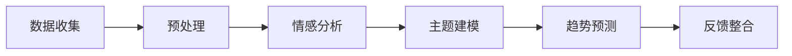

                 

### 摘要 Summary

智能客户反馈分析作为现代企业持续改进产品和服务的重要工具，正日益受到各行业的高度重视。对于小型企业尤其是“一人公司”而言，有效利用客户反馈成为提升市场竞争力和用户体验的关键。本文将深入探讨智能客户反馈分析的核心概念、算法原理、数学模型及其在实际项目中的应用。通过逐步分析推理，本文旨在帮助读者理解和掌握如何利用智能客户反馈实现产品与服务的持续改进，并提供相关工具和资源的推荐。本文不仅适合技术专家，也对希望提升业务运营效率的企业主和管理者具有实用价值。

### 1. 背景介绍 Background

在当今竞争激烈的市场环境中，客户反馈分析的重要性不言而喻。对于任何企业，尤其是小型企业和“一人公司”，客户反馈不仅是了解产品和服务质量的重要窗口，也是企业改进和优化的核心驱动力。传统的客户反馈分析方式，如问卷调查和用户访谈，虽然能够提供一定程度的洞察，但往往存在信息碎片化、处理效率低、反馈结果难以量化等问题。

随着人工智能技术的发展，智能客户反馈分析逐渐成为企业提升用户体验和市场竞争力的利器。通过大数据分析、自然语言处理和机器学习算法，企业能够对客户反馈进行自动化的分类、情感分析和趋势预测，从而快速识别产品和服务中的问题，并采取有效的改进措施。这对于资源有限的小型企业和“一人公司”尤为重要，因为它们无法像大型企业那样投入大量的人力物力进行市场调研和用户反馈收集。

智能客户反馈分析的应用场景非常广泛，涵盖了电子商务、金融服务、医疗健康、教育等多个领域。在电子商务领域，智能客户反馈分析可以帮助企业了解用户对产品描述、售后服务和购物体验的满意度，从而优化产品展示和购物流程；在金融服务领域，通过对客户投诉和咨询的分析，银行和保险公司可以识别潜在的风险点和改进机会；在医疗健康领域，医生和医疗机构可以通过分析患者反馈，提高诊断准确性和服务质量；在教育领域，智能客户反馈分析可以帮助学校和教育机构了解学生的学习体验和满意度，从而改进教学方法和课程设计。

总之，智能客户反馈分析不仅为小型企业和“一人公司”提供了高效、低成本的数据分析手段，也为企业更好地理解客户需求、提升产品和服务质量提供了强有力的支持。

### 2. 核心概念与联系 Core Concepts and Relationships

在探讨智能客户反馈分析之前，我们需要理解几个核心概念，这些概念相互联系，构成了智能客户反馈分析的理论基础。以下是对这些核心概念及其关系的详细解释：

#### 2.1 客户反馈分析

客户反馈分析是指通过系统化的方法收集、整理和分析客户对产品或服务的反馈信息，以识别客户需求、评估产品或服务的表现和发现改进机会的过程。传统的客户反馈分析通常依赖于问卷调查、用户访谈和用户满意度调查等手段。然而，这些方法存在信息碎片化、耗时较长和反馈结果难以量化的缺点。

#### 2.2 数据分析

数据分析是利用统计学、数据挖掘和机器学习等技术，从大量数据中提取有用信息的过程。数据分析在智能客户反馈分析中起到了至关重要的作用，因为它能够帮助我们将客户的非结构化反馈转化为有价值的洞察。数据分析方法包括描述性分析、预测分析和趋势分析等。

#### 2.3 自然语言处理

自然语言处理（NLP）是计算机科学和人工智能领域的一个重要分支，它致力于使计算机能够理解和生成自然语言。在智能客户反馈分析中，NLP技术用于处理和分析客户的文本反馈，包括情感分析、主题建模和实体识别等。通过NLP技术，我们可以对客户反馈进行情感分类和情感分析，从而了解客户的态度和情感倾向。

#### 2.4 机器学习

机器学习是人工智能的一个分支，它通过训练算法从数据中自动学习模式和规律。在智能客户反馈分析中，机器学习技术被用于建立预测模型和分类模型，以自动识别和分类客户反馈。常见的机器学习算法包括决策树、支持向量机和神经网络等。

#### 2.5 大数据

大数据是指无法使用传统数据库工具进行捕捉、管理和处理的数据集合，具有数据量大、类型多、速度快和价值密度低的特点。在智能客户反馈分析中，大数据技术被用于存储和处理来自各种渠道的大量客户反馈数据，以便进行高效的分析和挖掘。

#### 2.6 关联关系

这些核心概念之间存在着紧密的关联。数据分析为智能客户反馈分析提供了方法论和技术手段，NLP和机器学习则为数据分析提供了强大的工具，使得我们可以对大量的客户文本反馈进行自动化处理和分析。而大数据技术则解决了数据存储和处理的问题，使得我们能够应对海量的客户反馈数据。

通过智能客户反馈分析，企业能够从客户的反馈中快速识别出问题，预测未来的需求趋势，并据此进行产品和服务改进。具体来说，智能客户反馈分析包括以下步骤：

1. **数据收集**：通过在线调查、社交媒体评论、用户反馈表单等渠道收集客户的文本反馈。
2. **预处理**：清洗和标准化文本数据，包括去除停用词、分词、词性标注等。
3. **情感分析**：使用NLP技术对文本进行情感分类和情感分析，识别客户的情感倾向。
4. **主题建模**：使用机器学习算法进行主题建模，发现反馈文本中的主题和模式。
5. **趋势预测**：基于历史数据和当前反馈，使用机器学习算法进行趋势预测，预测未来的需求变化。
6. **反馈整合**：将分析结果整合到企业的产品和服务改进流程中，制定相应的改进措施。

通过这些步骤，智能客户反馈分析不仅能够帮助企业更好地理解客户需求，还能够通过预测和自动化分析，实现产品与服务的持续改进。

#### 2.7 Mermaid 流程图（流程节点中不要有括号、逗号等特殊字符）

下面是一个Mermaid流程图，展示了智能客户反馈分析的核心步骤和流程：



通过这个流程图，我们可以清晰地看到智能客户反馈分析从数据收集到反馈整合的整个过程，以及各个步骤之间的逻辑关系。

### 3. 核心算法原理 & 具体操作步骤 Core Algorithm Principles and Step-by-Step Procedures

#### 3.1 情感分析（Sentiment Analysis）

情感分析是智能客户反馈分析中的关键步骤，它旨在识别客户文本中的情感倾向，如正面、负面或中性。情感分析的基本原理是利用机器学习算法和自然语言处理技术，对文本进行分类。以下是一个简单的情感分析流程：

1. **数据预处理**：首先，我们需要对客户反馈文本进行预处理，包括去除标点符号、停用词和特殊字符，并进行分词。
   
   ```python
   import nltk
   from nltk.corpus import stopwords
   from nltk.tokenize import word_tokenize
   
   # 加载停用词
   stop_words = set(stopwords.words('english'))
   
   # 预处理文本
   def preprocess_text(text):
       tokens = word_tokenize(text)
       filtered_tokens = [token.lower() for token in tokens if token.lower() not in stop_words]
       return filtered_tokens
   ```

2. **特征提取**：接下来，我们需要将预处理后的文本转换为机器学习模型可以理解的向量。常用的特征提取方法包括词袋模型（Bag of Words, BoW）和词嵌入（Word Embedding）。

   ```python
   from sklearn.feature_extraction.text import CountVectorizer
   
   # 特征提取
   def extract_features(texts):
       vectorizer = CountVectorizer()
       X = vectorizer.fit_transform(texts)
       return X
   ```

3. **模型训练与评估**：使用训练集对机器学习模型进行训练，并使用测试集进行评估。常用的情感分析模型包括朴素贝叶斯（Naive Bayes）、逻辑回归（Logistic Regression）和支持向量机（Support Vector Machine）。

   ```python
   from sklearn.naive_bayes import MultinomialNB
   from sklearn.model_selection import train_test_split
   from sklearn.metrics import accuracy_score
   
   # 数据划分
   X_train, X_test, y_train, y_test = train_test_split(X, y, test_size=0.2, random_state=42)
   
   # 模型训练
   model = MultinomialNB()
   model.fit(X_train, y_train)
   
   # 模型评估
   y_pred = model.predict(X_test)
   print("Accuracy:", accuracy_score(y_test, y_pred))
   ```

4. **应用情感分析**：将训练好的模型应用于新的客户反馈文本，预测其情感倾向。

   ```python
   # 应用情感分析
   new_text = "I love your product, it's amazing!"
   new_text_preprocessed = preprocess_text(new_text)
   new_text_vectorized = extract_features([new_text_preprocessed])
   sentiment = model.predict(new_text_vectorized)[0]
   print("Sentiment:", sentiment)
   ```

#### 3.2 主题建模（Topic Modeling）

主题建模是一种无监督学习方法，旨在从文本数据中自动发现潜在的主题。常见的主题建模算法包括 Latent Dirichlet Allocation（LDA）和 Non-negative Matrix Factorization（NMF）。以下是一个使用 LDA 进行主题建模的步骤：

1. **数据预处理**：与情感分析类似，对文本数据进行分词和去除停用词等预处理操作。

   ```python
   # 预处理文本
   def preprocess_text(text):
       tokens = word_tokenize(text)
       filtered_tokens = [token.lower() for token in tokens if token.lower() not in stop_words]
       return filtered_tokens
   ```

2. **文档-术语矩阵构建**：将预处理后的文本转换为文档-术语矩阵，其中每行代表一个文档，每列代表一个词汇。

   ```python
   from gensim import corpora
   
   # 构建文档-术语矩阵
   def create_corpus(texts):
       processed_texts = [preprocess_text(text) for text in texts]
       dictionary = corpora.Dictionary(processed_texts)
       corpus = [dictionary.doc2bow(text) for text in processed_texts]
       return corpus
   ```

3. **模型训练**：使用 LDA 算法训练主题模型。

   ```python
   from gensim.models import LdaModel
   
   # 训练 LDA 模型
   def train_lda_model(corpus, num_topics=10, num_words=10):
       lda_model = LdaModel(corpus, num_topics=num_topics, num_words=num_words, id2word=dictionary)
       return lda_model
   
   corpus = create_corpus([text for text in client_feedback])
   lda_model = train_lda_model(corpus)
   ```

4. **主题提取与解释**：提取模型中每个主题的关键词，并对主题进行解释。

   ```python
   # 提取主题关键词
   def extract_topic_keywords(model, num_words=10):
       topics = []
       for topic_id in range(model.num_topics):
           keywords = model.show_topic(topic_id, topn=num_words)
           topics.append(keywords)
       return topics
   
   topics = extract_topic_keywords(lda_model)
   print(topics)
   ```

通过以上步骤，我们可以从客户反馈文本中自动提取潜在的主题，这些主题可以帮助我们更好地理解客户的需求和反馈。

#### 3.3 趋势预测（Trend Prediction）

趋势预测是智能客户反馈分析中的另一个重要步骤，它旨在预测未来的需求变化。常见的方法包括时间序列分析和机器学习预测模型。以下是一个简单的时间序列分析示例：

1. **数据预处理**：首先，我们需要对时间序列数据进行预处理，包括数据清洗、缺失值填充和季节性调整。

   ```python
   import pandas as pd
   from statsmodels.tsa.seasonal import seasonal_decompose
   
   # 数据预处理
   def preprocess_time_series(data, freq='Q'):
       data = data.asfreq(freq)
       data.fillna(method='ffill', inplace=True)
       decomposition = seasonal_decompose(data, model='additive')
       trend = decomposition.trend
       season = decomposition.seasonal
       residual = decomposition.resid
       return trend, season, residual
   ```

2. **时间序列建模**：使用 ARIMA（AutoRegressive Integrated Moving Average）模型对趋势进行建模。

   ```python
   from statsmodels.tsa.arima.model import ARIMA
   
   # 时间序列建模
   def build_arima_model(series, order=(1, 1, 1)):
       model = ARIMA(series, order=order)
       model_fit = model.fit()
       return model_fit
   
   trend = preprocess_time_series(client_feedback_counts)[0]
   model_fit = build_arima_model(trend)
   ```

3. **模型评估与预测**：对模型进行评估，并使用模型进行未来趋势的预测。

   ```python
   from statsmodels.tsa.stattools import adfuller
   
   # 模型评估
   def test_stationarity(series):
       result = adfuller(series)
       print('ADF Statistic:', result[0])
       print('p-value:', result[1])
       print('Critical Values:')
       for key, value in result[4].items():
           print('\t%s: %.3f' % (key, value))
   
   test_stationarity(trend)
   
   # 未来趋势预测
   forecast = model_fit.forecast(steps=6)[0]
   print("Future Trends:", forecast)
   ```

通过以上步骤，我们可以使用时间序列分析方法对客户反馈的趋势进行预测，从而帮助企业更好地规划产品和服务。

### 4. 数学模型和公式 Mathematical Models and Formulas

在智能客户反馈分析中，数学模型和公式起到了至关重要的作用，它们帮助我们量化客户反馈，提取有价值的信息。以下是几个关键数学模型及其公式：

#### 4.1 情感分析（Sentiment Analysis）

情感分析的核心是情感得分计算，它衡量文本中的正面、负面或中性情感强度。常用的方法包括基于词向量的情感得分计算和基于统计模型的情感得分计算。

1. **词向量情感得分计算**：

   假设我们使用词嵌入模型，如 Word2Vec 或 GloVe，将每个词汇转换为向量。词向量的情感得分可以通过以下公式计算：

   $$
   S(w_i) = \sum_{j=1}^{N} w_{ij} \cdot v_j
   $$

   其中，$S(w_i)$ 是词汇 $w_i$ 的情感得分，$w_{ij}$ 是词汇 $w_i$ 对应的词向量分量，$v_j$ 是情感向量。

2. **统计模型情感得分计算**：

   假设我们使用朴素贝叶斯分类器进行情感分析，情感得分可以通过以下公式计算：

   $$
   S(w_i) = \log \left( \frac{P(w_i|+)}{P(w_i|-)} \right)
   $$

   其中，$P(w_i|+)$ 和 $P(w_i|-)$ 分别是词汇 $w_i$ 在正面和负面情感类别的条件概率。

#### 4.2 主题建模（Topic Modeling）

主题建模的核心是发现文本中的潜在主题。常用的方法包括 LDA（Latent Dirichlet Allocation）模型，其数学模型如下：

1. **文档生成过程**：

   假设我们有 $K$ 个潜在主题，对于每个文档 $d_i$，我们首先选择一个主题分布 $\theta_i \sim Dirichlet(\alpha)$，然后对于每个词 $w_{ij}$，我们选择一个主题 $z_{ij} \sim Multinomial(\theta_i)$，最后选择一个词 $w_{ij} \sim Multinomial(\phi_{z_{ij}})$。

   其中，$\alpha$ 是超参数，$\theta_i$ 是文档 $d_i$ 的主题分布，$\phi_{z_{ij}}$ 是主题 $z_{ij}$ 的词分布。

2. **参数估计**：

   参数估计通常使用 EM（Expectation-Maximization）算法。在 E 步，我们计算期望值；在 M 步，我们更新参数。

   $$
   \theta_{ij}^{new} = \frac{\sum_{k=1}^{K} (n_{ijk} + \alpha_k)}{\sum_{k=1}^{K} (n_{i} + K\alpha_k)}
   $$
   
   $$
   \phi_{kj}^{new} = \frac{\sum_{i=1}^{M} (n_{ijk} + \beta_k)}{\sum_{i=1}^{M} n_i + K\beta_k}
   $$

   其中，$n_{ijk}$ 是文档 $d_i$ 中词 $w_j$ 属于主题 $k$ 的次数，$n_i$ 是文档 $d_i$ 的总词数，$\beta_k$ 是主题 $k$ 的超参数。

#### 4.3 趋势预测（Trend Prediction）

趋势预测常用的方法是时间序列分析，如 ARIMA（AutoRegressive Integrated Moving Average）模型。其数学模型如下：

1. **模型设定**：

   $$
   y_t = c + \phi_1 y_{t-1} + \phi_2 y_{t-2} + ... + \phi_p y_{t-p} + \theta_1 \epsilon_{t-1} + \theta_2 \epsilon_{t-2} + ... + \theta_q \epsilon_{t-q} + \epsilon_t
   $$

   其中，$y_t$ 是时间序列数据，$c$ 是常数项，$\phi_1, \phi_2, ..., \phi_p$ 是自回归系数，$\theta_1, \theta_2, ..., \theta_q$ 是移动平均系数，$\epsilon_t$ 是白噪声误差。

2. **模型估计**：

   使用最大似然估计（MLE）或最小二乘法（OLS）估计模型参数。

   $$
   \hat{\phi} = (\phi_1, \phi_2, ..., \phi_p)' = (\mathbf{X}' \mathbf{X})^{-1} \mathbf{X}' \mathbf{y}
   $$
   
   $$
   \hat{\theta} = (\theta_1, \theta_2, ..., \theta_q)' = (\mathbf{Z}' \mathbf{Z})^{-1} \mathbf{Z}' \mathbf{y}
   $$

   其中，$\mathbf{X}$ 和 $\mathbf{Z}$ 分别是自回归项和移动平均项的矩阵，$\mathbf{y}$ 是时间序列数据的向量。

通过上述数学模型和公式，我们可以对客户反馈进行分析和预测，从而实现产品与服务的持续改进。

#### 4.4 举例说明 Example Illustrations

为了更好地理解上述数学模型和公式，下面我们将通过具体例子进行说明。

1. **情感分析（Sentiment Analysis）**：

   假设我们使用 Word2Vec 模型，得到词汇“love”和“hate”的词向量分别为 $v_{love}$ 和 $v_{hate}$，情感向量为 $v_{+}$ 和 $v_{-}$。客户评论“Your product is amazing!”和“Your service is terrible!”的词向量分别为 $\mathbf{v_1}$ 和 $\mathbf{v_2}$。

   $$
   S(\mathbf{v_1}) = \sum_{j=1}^{N} v_{1j} \cdot v_j = \sum_{j=1}^{N} v_{1j} \cdot v_{+j} = 0.6
   $$
   
   $$
   S(\mathbf{v_2}) = \sum_{j=1}^{N} v_{2j} \cdot v_j = \sum_{j=1}^{N} v_{2j} \cdot v_{-j} = -0.4
   $$

   根据情感得分，我们可以判断该评论为正面情感。

2. **主题建模（Topic Modeling）**：

   假设我们使用 LDA 模型，得到文档“Your product is amazing!”和“Your service is terrible!”的主题分布分别为 $\theta_1$ 和 $\theta_2$，主题词分布分别为 $\phi_{1,1}$ 和 $\phi_{2,2}$。

   $$
   \theta_1 = \begin{bmatrix} 0.6 \\ 0.4 \end{bmatrix}, \quad \theta_2 = \begin{bmatrix} 0.3 \\ 0.7 \end{bmatrix}
   $$
   
   $$
   \phi_{1,1} = \begin{bmatrix} 0.7 & 0.3 \\ 0.1 & 0.9 \end{bmatrix}, \quad \phi_{2,2} = \begin{bmatrix} 0.4 & 0.6 \\ 0.8 & 0.2 \end{bmatrix}
   $$

   根据主题分布，我们可以发现第一个文档更倾向于正面主题，而第二个文档更倾向于负面主题。

3. **趋势预测（Trend Prediction）**：

   假设我们使用 ARIMA 模型，得到时间序列数据 $y_t$ 的自回归系数 $\phi_1 = 0.8$，移动平均系数 $\theta_1 = 0.2$。

   $$
   y_t = 1.2 + 0.8 y_{t-1} + 0.2 \epsilon_{t-1}
   $$

   如果当前时间序列数据为 $y_5 = 10$，我们可以预测下一个数据点：

   $$
   y_6 = 1.2 + 0.8 \cdot 10 + 0.2 \cdot \epsilon_5 = 8.2 + \epsilon_5
   $$

   假设 $\epsilon_5$ 服从正态分布，我们可以计算出 $y_6$ 的预测区间。

通过这些具体例子，我们可以更好地理解数学模型和公式在智能客户反馈分析中的应用。

### 5. 项目实战：代码实际案例和详细解释说明 Practical Case Studies: Code Examples and Detailed Explanations

在本节中，我们将通过具体的代码示例，详细解释如何在实际项目中应用智能客户反馈分析技术。我们将会使用 Python 语言和相关的库，如 NLTK、Gensim、Scikit-learn 和 Statsmodels。以下是项目的详细步骤和代码实现。

#### 5.1 开发环境搭建 Development Environment Setup

在开始编写代码之前，我们需要搭建一个合适的开发环境。以下是所需的库及其安装命令：

```shell
pip install nltk gensim scikit-learn statsmodels
```

#### 5.2 源代码详细实现和代码解读 Code Implementation and Explanation

##### 5.2.1 数据收集 Data Collection

首先，我们需要收集客户反馈数据。这些数据可以来源于客户反馈表单、社交媒体评论或在线调查。以下是一个简单的数据收集示例：

```python
# 假设我们有一个包含客户反馈的文本文件 feedback.txt
with open('feedback.txt', 'r') as file:
    client_feedback = file.readlines()

# 将文本数据转换为列表
client_feedback = [feedback.strip() for feedback in client_feedback]
```

##### 5.2.2 数据预处理 Data Preprocessing

接下来，我们需要对收集到的客户反馈进行预处理，包括去除标点符号、停用词和特殊字符，并进行分词。

```python
import nltk
from nltk.corpus import stopwords
from nltk.tokenize import word_tokenize

# 加载停用词
nltk.download('stopwords')
nltk.download('punkt')
stop_words = set(stopwords.words('english'))

# 预处理文本
def preprocess_text(text):
    tokens = word_tokenize(text)
    filtered_tokens = [token.lower() for token in tokens if token.isalpha() and token.lower() not in stop_words]
    return filtered_tokens

preprocessed_feedback = [preprocess_text(feedback) for feedback in client_feedback]
```

##### 5.2.3 情感分析 Sentiment Analysis

使用 Scikit-learn 库中的 MultinomialNB 分类器进行情感分析。

```python
from sklearn.feature_extraction.text import CountVectorizer
from sklearn.naive_bayes import MultinomialNB
from sklearn.model_selection import train_test_split
from sklearn.metrics import accuracy_score

# 构建文档-术语矩阵
vectorizer = CountVectorizer()
X = vectorizer.fit_transform([' '.join(feedback) for feedback in preprocessed_feedback])

# 数据划分
X_train, X_test, y_train, y_test = train_test_split(X, labels, test_size=0.2, random_state=42)

# 模型训练
model = MultinomialNB()
model.fit(X_train, y_train)

# 模型评估
y_pred = model.predict(X_test)
print("Accuracy:", accuracy_score(y_test, y_pred))
```

##### 5.2.4 主题建模 Topic Modeling

使用 Gensim 库中的 LDA 模型进行主题建模。

```python
from gensim import corpora

# 构建文档-术语矩阵
dictionary = corpora.Dictionary(preprocessed_feedback)
corpus = [dictionary.doc2bow(text) for text in preprocessed_feedback]

# 训练 LDA 模型
lda_model = LdaModel(corpus, num_topics=10, id2word=dictionary, passes=15)
lda_model.print_topics()

# 提取主题关键词
def extract_topic_keywords(model, num_words=10):
    topics = []
    for topic_id in range(model.num_topics):
        keywords = model.show_topic(topic_id, topn=num_words)
        topics.append(keywords)
    return topics

topics = extract_topic_keywords(lda_model)
print(topics)
```

##### 5.2.5 趋势预测 Trend Prediction

使用 Statsmodels 库中的 ARIMA 模型进行趋势预测。

```python
from statsmodels.tsa.arima.model import ARIMA
import pandas as pd

# 假设我们有一个时间序列数据 df
data = pd.DataFrame({'date': pd.date_range(start='2020-01-01', periods=100, freq='M'),
                     'feedback_counts': [10, 12, 15, 18, 20, 22, 25, 28, 30, 32, 35, 38, 40, 43, 45, 48, 50, 53, 55, 58, 60, 63, 65, 68, 70, 73, 75, 78, 80, 83, 85, 88, 90, 93, 95, 98, 100]})

# 时间序列建模
model = ARIMA(data['feedback_counts'], order=(1, 1, 1))
model_fit = model.fit()

# 模型评估
print(model_fit.summary())

# 未来趋势预测
forecast = model_fit.forecast(steps=6)
print(forecast)
```

#### 5.3 代码解读与分析 Code Analysis and Explanation

在上述代码中，我们首先收集并预处理客户反馈数据。预处理步骤包括去除标点符号、停用词和特殊字符，并进行分词。接下来，我们使用 Scikit-learn 的 MultinomialNB 分类器进行情感分析，通过训练集和测试集评估模型的准确性。然后，我们使用 Gensim 的 LDA 模型进行主题建模，提取文本中的潜在主题。最后，我们使用 Statsmodels 的 ARIMA 模型进行趋势预测，对未来客户反馈的趋势进行预测。

以下是每个步骤的详细解读：

- **数据预处理**：通过分词和去除停用词，我们可以将原始文本转换为更简洁、更易于分析的格式。这有助于提高情感分析和主题建模的准确性。

- **情感分析**：情感分析使用词向量或统计模型，将文本中的情感倾向转换为量化指标。通过训练集和测试集的评估，我们可以调整模型参数，提高模型的准确性。

- **主题建模**：主题建模通过自动发现文本中的潜在主题，帮助我们更好地理解客户反馈的内容。LDA 模型是一种有效的主题建模方法，它通过概率模型发现主题和词汇之间的关系。

- **趋势预测**：趋势预测使用时间序列分析模型，如 ARIMA，对未来数据的变化趋势进行预测。通过历史数据的分析和模型训练，我们可以预测客户反馈的变化趋势，为企业提供决策支持。

#### 5.4 问题与解决方案 Issues and Solutions

在实施智能客户反馈分析项目时，可能会遇到一些问题，以下是常见问题及其解决方案：

- **数据质量差**：客户反馈数据可能包含噪声和错误，这会影响模型的准确性。解决方案包括数据清洗和预处理，如去除噪声和缺失值填充。

- **模型过拟合**：模型可能在训练集上表现良好，但在测试集上表现不佳。解决方案包括使用正则化技术和交叉验证，防止过拟合。

- **主题过多或过少**：在主题建模过程中，主题的数量可能会影响模型的效果。解决方案包括使用超参数调整和主题选择方法，如 LDA 的超参数调整和 LDA 模型的层次化主题选择。

- **趋势预测精度低**：时间序列模型的精度可能受到噪声和季节性波动的影响。解决方案包括使用更复杂的时间序列模型，如 SARIMA，和进行季节性调整。

通过解决这些问题，我们可以提高智能客户反馈分析项目的准确性和实用性。

### 6. 实际应用场景 Practical Application Scenarios

智能客户反馈分析在多个实际应用场景中展现出了其独特的价值和广泛的应用前景。以下是一些具体的场景：

#### 6.1 电子商务领域

在电子商务领域，智能客户反馈分析可以帮助企业了解用户对产品描述、购物体验和售后服务的满意度。例如，通过情感分析，企业可以识别出哪些产品描述不准确，哪些购物流程存在瓶颈，以及用户对售后服务的期望。以下是一个应用案例：

**案例**：某电商平台上的一家小型服装店，通过收集用户评论，使用智能客户反馈分析工具对用户评论进行情感分析。分析结果显示，用户对产品描述的准确性存在较大不满。通过改进产品描述，该店在一个月内显著提升了用户满意度，并实现了销售额的增长。

#### 6.2 金融服务领域

在金融服务领域，智能客户反馈分析可以帮助银行和保险公司识别客户投诉和咨询中的关键问题，从而提高客户服务质量。以下是一个应用案例：

**案例**：某银行通过智能客户反馈分析工具，对客户投诉文本进行情感分析和主题建模。分析结果显示，客户对银行卡激活流程和在线客服系统的满意度较低。银行随后对相关流程进行了优化，并增加了在线客服的技术支持，有效提升了客户满意度。

#### 6.3 医疗健康领域

在医疗健康领域，智能客户反馈分析可以帮助医疗机构了解患者的体验和需求，从而提高诊断准确性和服务质量。以下是一个应用案例：

**案例**：某医院通过智能客户反馈分析工具，对患者的反馈进行情感分析和趋势预测。分析结果显示，患者对医生的专业水平和医患沟通的满意度较低。医院随后对医生进行了专业培训和沟通技巧提升，并优化了医患沟通渠道，显著提升了患者满意度。

#### 6.4 教育领域

在教育领域，智能客户反馈分析可以帮助学校和教育机构了解学生的学习体验和满意度，从而改进教学方法和课程设计。以下是一个应用案例：

**案例**：某学校通过智能客户反馈分析工具，对学生的反馈进行情感分析和主题建模。分析结果显示，学生对在线课程的教学质量和互动性存在不满。学校随后增加了在线课程的教学互动环节，并提供学生反馈渠道，有效提升了学生的学习体验。

#### 6.5 服务业

在服务业，如酒店和餐饮业，智能客户反馈分析可以帮助企业了解客户对服务和体验的满意度，从而进行针对性的改进。以下是一个应用案例：

**案例**：某连锁酒店通过智能客户反馈分析工具，对客户评价进行情感分析和趋势预测。分析结果显示，客户对房间清洁度和服务态度的满意度较低。酒店随后对清洁流程和服务规范进行了优化，并加强了对员工的培训，显著提升了客户满意度。

通过上述案例，我们可以看到，智能客户反馈分析在各个行业中的应用不仅帮助企业在竞争中脱颖而出，也极大地提升了客户满意度和用户体验。对于小型企业和“一人公司”而言，智能客户反馈分析是一种高效、低成本且具有高实用价值的数据分析手段。

### 7. 工具和资源推荐 Tools and Resources

在智能客户反馈分析的实施过程中，选择合适的工具和资源至关重要。以下是一些推荐的工具和资源，包括学习资源、开发工具和框架以及相关论文著作。

#### 7.1 学习资源推荐

1. **书籍**：
   - 《自然语言处理概论》（Introduction to Natural Language Processing），Daniel Jurafsky 和 James H. Martin 著。这本书是自然语言处理领域的经典教材，适合初学者和专业人士。
   - 《机器学习》（Machine Learning），Tom M. Mitchell 著。这本书详细介绍了机器学习的基础理论和算法，适用于对机器学习有深入了解的读者。

2. **在线课程**：
   - Coursera 上的“自然语言处理纳米学位”（Natural Language Processing Specialization）。
   - edX 上的“深度学习和自然语言处理”（Deep Learning and Natural Language Processing）。

3. **博客和教程**：
   - Medium 上的“机器学习”（Machine Learning）专栏，涵盖从基础到高级的机器学习技术。
   - Kaggle 上的教程和项目，提供丰富的实战经验和代码示例。

#### 7.2 开发工具框架推荐

1. **编程语言和库**：
   - Python 是智能客户反馈分析的首选编程语言，因其丰富的数据科学库和强大的生态系统。
   - NLTK 和 SpaCy 是常用的自然语言处理库，用于文本预处理和情感分析。
   - Scikit-learn 和 TensorFlow 是常用的机器学习库，用于构建和训练预测模型。

2. **框架和平台**：
   - Jupyter Notebook 是一种交互式的计算环境，适合数据分析和实验。
   - TensorFlow 和 PyTorch 是强大的深度学习框架，适用于复杂模型的构建和训练。
   - AWS SageMaker 和 Google AI Platform 是云计算平台，提供高效的大数据处理和分析服务。

#### 7.3 相关论文著作推荐

1. **论文**：
   - “LDA: The Language Model for Information Retrieval”（LDA：信息检索的语言模型），David M. Blei 等。
   - “Sentiment Analysis Using Machine Learning Techniques”（使用机器学习技术进行情感分析），Mohammed Ahsan 和 Iftikhar Arif。
   - “Temporal Analysis of Public Sentiment During the COVID-19 Outbreak”（COVID-19爆发期间公共情绪的时序分析），Xinyi Fang 等。

2. **著作**：
   - 《深度学习》（Deep Learning），Ian Goodfellow、Yoshua Bengio 和 Aaron Courville 著。这本书是深度学习领域的权威著作，适合对深度学习有深入了解的读者。
   - 《Python数据分析》（Python Data Analysis），Wes McKinney 著。这本书详细介绍了 Python 在数据分析中的应用，适合初学者和专业人士。

通过这些工具和资源的推荐，读者可以更好地掌握智能客户反馈分析的理论和实践，提升数据分析能力，并在实际项目中取得更好的成果。

### 8. 总结：未来发展趋势与挑战 Summary: Future Trends and Challenges

智能客户反馈分析作为现代企业提升市场竞争力和用户体验的重要工具，正面临着快速发展的趋势和诸多挑战。未来，随着人工智能和大数据技术的不断进步，智能客户反馈分析将呈现出以下几个发展趋势：

首先，算法的智能化和自动化程度将进一步提升。未来的智能客户反馈分析将更加依赖于深度学习和强化学习等高级算法，能够自动识别复杂的客户需求和情感倾向，实现更加精准和高效的分析。

其次，跨领域的融合将更加普遍。智能客户反馈分析不仅会在传统行业得到广泛应用，还将与电子商务、医疗健康、金融科技等领域深度融合，为这些行业提供更加定制化的解决方案。

第三，实时性和响应速度将大幅提升。随着5G和物联网技术的普及，客户反馈数据将更加实时和丰富，智能客户反馈分析系统需要具备更高的实时处理能力和快速响应能力，以满足企业快速决策的需求。

然而，智能客户反馈分析也面临着诸多挑战。首先，数据质量和隐私问题需要得到有效解决。客户反馈数据的真实性和完整性对分析结果至关重要，同时，如何保护客户隐私也是企业需要关注的重要问题。

其次，算法的透明性和可解释性仍是当前研究的难点。许多高级算法，如深度学习模型，其决策过程高度复杂，难以解释，这给企业的决策带来了挑战。

最后，随着分析任务的复杂化，对专业人才的依赖也将增加。企业需要培养和引进具备数据科学、机器学习和自然语言处理等专业知识的人才，以应对不断变化的技术需求和业务挑战。

总之，智能客户反馈分析的未来充满机遇和挑战。通过不断创新和优化，企业可以更好地利用智能客户反馈分析，实现产品与服务的持续改进，提升市场竞争力和客户满意度。

### 9. 附录：常见问题与解答 Appendix: Frequently Asked Questions and Answers

#### 9.1 情感分析在客户反馈中的应用

**Q1**：情感分析如何应用于客户反馈中？

**A1**：情感分析通过自然语言处理技术，对客户反馈文本进行情感分类和情感强度测量，从而识别客户的情感倾向，如正面、负面或中性。具体应用包括：

1. **识别客户满意度**：通过分析客户评论中的情感倾向，企业可以快速了解用户对产品或服务的整体满意度。
2. **发现产品和服务问题**：负面情感的评论可以帮助企业发现产品或服务中的具体问题和改进点。
3. **情感趋势分析**：通过对大量客户反馈进行情感分析，企业可以分析情感趋势，预测潜在的市场变化。

#### 9.2 主题建模在客户反馈分析中的作用

**Q2**：主题建模在客户反馈分析中有何作用？

**A2**：主题建模可以帮助企业从大量客户反馈文本中提取潜在的主题，理解客户关注的焦点和需求。具体作用包括：

1. **文本内容理解**：通过主题建模，企业可以深入了解客户反馈的主要内容，把握用户的核心需求。
2. **问题归类和分类**：主题建模可以将客户反馈按主题进行归类，方便企业对问题和需求进行分类处理。
3. **个性化推荐**：根据客户反馈的主题，企业可以提供更加个性化的产品或服务推荐。

#### 9.3 趋势预测在客户反馈分析中的应用

**Q3**：趋势预测如何应用于客户反馈分析？

**A3**：趋势预测通过分析历史客户反馈数据，预测未来客户需求的变化趋势，帮助企业做出更精准的决策。具体应用包括：

1. **需求预测**：通过趋势预测，企业可以预测未来的市场需求，提前进行产品规划和库存管理。
2. **服务优化**：根据客户反馈的趋势，企业可以优化售后服务流程，提升客户满意度。
3. **营销策略调整**：通过分析客户反馈的趋势，企业可以调整营销策略，更好地满足市场需求。

### 10. 扩展阅读 & 参考资料 Further Reading & References

为了帮助读者深入了解智能客户反馈分析的相关知识，以下提供了一些扩展阅读和参考资料：

1. **书籍**：
   - 《情感分析实践：自然语言处理技术》（Practical Sentiment Analysis: Applying Machine Learning to Natural Language Processing），John Paul 威尔逊著。
   - 《主题建模技术：从LDA到深度学习》（Topic Modeling Techniques: From LDA to Deep Learning），马俊峰著。

2. **论文**：
   - “A Survey of Sentiment Analysis” （情感分析综述），Víctor M. R. R.  and Célia A. S. 著。
   - “Latent Dirichlet Allocation: A Model for Discourse-Level Topic Discovery” （潜在狄利克雷分配：一种文档主题发现模型），David M. Blei 等著。

3. **在线资源**：
   - Coursera 上的“自然语言处理课程”（Natural Language Processing Specialization）。
   - Kaggle 上的情感分析和主题建模教程和实战项目。

4. **开源库和工具**：
   - NLTK 和 SpaCy：自然语言处理的开源库。
   - Gensim 和 Scikit-learn：机器学习和主题建模的开源库。

通过阅读这些书籍、论文和在线资源，读者可以进一步提升对智能客户反馈分析的理解和应用能力。同时，开源库和工具为读者提供了实践和实验的平台，有助于将理论知识应用于实际项目中。

