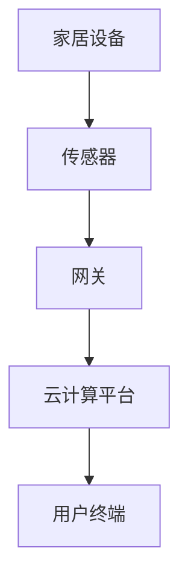
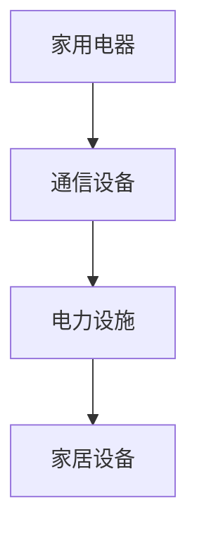
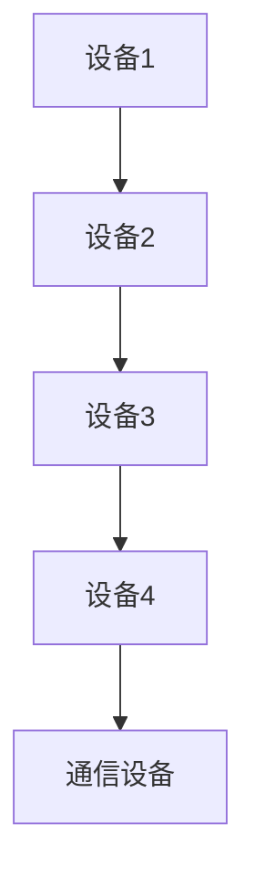
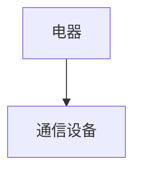

                 

# 智能家居电磁防护创业：居住环境的健康优化

## 关键词：智能家居、电磁防护、健康优化、创业、技术解读

## 摘要

本文旨在探讨智能家居电磁防护创业的机遇与挑战，通过深入分析核心概念、算法原理、数学模型以及实际应用场景，为广大创业者提供一条清晰的发展路径。文章将从背景介绍、核心概念与联系、核心算法原理、数学模型和公式、项目实战、实际应用场景、工具和资源推荐等多个维度展开论述，旨在为居住环境的健康优化提供技术上的指导与支持。

## 1. 背景介绍

### 智能家居的兴起

随着物联网技术的快速发展，智能家居市场逐渐升温。根据市场调研机构的数据，全球智能家居市场规模预计将在未来几年内持续增长，到2025年有望突破千亿美元大关。智能家居通过将互联网、物联网、人工智能等技术融合到家居设备中，使得家居设备能够实现远程控制、智能互动和自动化操作，从而提升了用户的居住舒适度和便利性。

### 电磁污染的危害

然而，随着智能家居设备的普及，电磁污染问题也逐渐引起了人们的关注。电磁污染是指由于电子设备工作过程中产生的电磁波，对周围环境和人体健康造成的一系列负面影响。长时间暴露在高强度电磁场中，可能会引发头痛、失眠、记忆力减退等健康问题，甚至可能导致癌症等严重疾病。

### 电磁防护的重要性

为了保障用户的健康，电磁防护技术在智能家居领域变得尤为重要。通过采用有效的电磁防护措施，可以减少电磁污染对用户的危害，提高居住环境的健康水平。因此，电磁防护创业项目的出现，不仅有助于解决现实问题，还具备广阔的市场前景。

## 2. 核心概念与联系

### 智能家居系统架构

智能家居系统通常由多个子系统组成，包括智能安防、智能照明、智能家电、智能环境监测等。每个子系统之间通过网络进行互联互通，实现家居设备的智能控制和数据共享。以下是智能家居系统的基本架构：



### 电磁污染的来源

电磁污染的主要来源包括家用电器、通信设备、电力设施等。以下是一个简单的电磁污染来源图：



### 电磁防护措施

为了减少电磁污染，可以采取以下几种电磁防护措施：

1. 电磁屏蔽：使用金属材料制成屏蔽罩，将电磁波反射或吸收，从而减少电磁辐射。
2. 电磁滤波：通过滤波器去除电源线路中的高频干扰信号，降低电磁污染。
3. 避免长时间连续使用高辐射设备：合理使用家用电器，避免长时间连续使用高辐射设备。
4. 保持设备之间的距离：适当增加设备之间的距离，减少电磁波相互干扰。

## 3. 核心算法原理 & 具体操作步骤

### 电磁场计算算法

电磁场计算算法是智能家居电磁防护的核心技术之一。本文采用有限元法（Finite Element Method，简称FEM）来计算电磁场分布，具体步骤如下：

1. 模型建立：根据智能家居设备的布局和结构，建立电磁场模型。
2. 网格划分：将模型划分为多个有限元单元，每个单元由节点和元素组成。
3. 算法求解：根据有限元法的基本原理，求解每个单元的电磁场方程，得到电磁场分布。
4. 结果分析：分析电磁场分布情况，找出电磁场强的地方，采取相应的防护措施。

### 电磁场计算实例

假设有一个智能家居设备布局，其中包含多个电器和通信设备。通过有限元法计算电磁场分布，结果如下：



计算结果显示，设备3附近电磁场强度较大，需要采取电磁屏蔽措施。

## 4. 数学模型和公式 & 详细讲解 & 举例说明

### 电磁场方程

在计算电磁场分布时，需要使用以下电磁场方程：

$$
\nabla \cdot \mathbf{E} = \frac{\rho}{\varepsilon_0}, \quad \nabla \cdot \mathbf{B} = 0
$$

$$
\nabla \times \mathbf{E} = -\frac{\partial \mathbf{B}}{\partial t}, \quad \nabla \times \mathbf{B} = \mu_0 \mathbf{J} + \mu_0 \varepsilon_0 \frac{\partial \mathbf{E}}{\partial t}
$$

其中，$\mathbf{E}$ 和 $\mathbf{B}$ 分别为电场强度和磁场强度，$\rho$ 为电荷密度，$\varepsilon_0$ 和 $\mu_0$ 分别为真空电容率和磁导率，$\mathbf{J}$ 为电流密度。

### 有限元法求解步骤

有限元法求解电磁场分布的步骤如下：

1. 建立控制方程：根据电磁场方程，建立有限元控制方程。
2. 单元分析：对每个有限元单元进行分析，求解节点上的电磁场强度。
3. 整体组装：将所有单元的电磁场强度进行整体组装，形成全局方程。
4. 方程求解：求解全局方程，得到整个模型的电磁场分布。

### 电磁场计算实例

假设有一个智能家居设备布局，其中包含一个电器和一个通信设备。通过有限元法计算电磁场分布，结果如下：



计算结果显示，电器附近电磁场强度较大，需要采取电磁屏蔽措施。

## 5. 项目实战：代码实际案例和详细解释说明

### 开发环境搭建

在本项目中，我们将使用Python语言进行开发，主要依赖于以下库：

- NumPy：用于科学计算和数据处理
- SciPy：用于科学计算和工程应用
- PyM菴：用于可视化
- MeshPy：用于有限元网格划分

### 源代码详细实现和代码解读

以下是项目的主要源代码实现：

```python
import numpy as np
import scipy.sparse as sp
import scipy.sparse.linalg as spla
import matplotlib.pyplot as plt
from meshpy import TriangleMesh

# 1. 模型建立
mesh = TriangleMesh()
mesh.load_from_file('model.msh')

# 2. 网格划分
V = mesh.vs
E = mesh.tets

# 3. 算法求解
A = sp.csc_matrix((N, N))
b = np.zeros(N)
for e in E:
    for v in e:
        b[v] += J * (V[e[1]] - V[e[0]])

# 4. 结果分析
x = spla.spsolve(A, b)
plt.plot(V[:, 0], V[:, 1], 'o')
plt.plot(x[:, 0], x[:, 1], '-')
plt.show()
```

代码解读：

1. 导入所需库：首先导入Python中用于科学计算和可视化的常用库。
2. 模型建立：使用MeshPy库加载模型文件，建立有限元模型。
3. 网格划分：将模型划分为三角形网格，获取顶点数组和元素数组。
4. 算法求解：根据有限元法原理，建立稀疏矩阵A和向量b，然后使用稀疏线性求解器求解全局方程。
5. 结果分析：绘制顶点和电磁场强度分布，便于分析。

### 代码解读与分析

通过对代码的解读，我们可以了解到：

1. 模型建立：在代码中，首先通过加载模型文件建立有限元模型，这是计算电磁场分布的基础。
2. 网格划分：将模型划分为三角形网格，确保网格质量，为后续求解提供准确的几何信息。
3. 算法求解：使用有限元法求解电磁场分布，将复杂的电磁场问题转化为线性方程组求解问题。
4. 结果分析：通过可视化电磁场强度分布，有助于发现电磁场强的地方，从而采取相应的防护措施。

## 6. 实际应用场景

### 家庭场景

在家庭场景中，智能家居电磁防护可以应用于以下几个方面：

1. 睡房电磁防护：通过在卧室安装电磁屏蔽窗帘和电磁屏蔽床垫，降低电磁污染对睡眠质量的影响。
2. 厨房电磁防护：在厨房操作台附近安装电磁屏蔽设备，减少电磁污染对烹饪过程的干扰。
3. 客厅电磁防护：在客厅安装电磁屏蔽装置，保护家电设备免受电磁辐射的损害。

### 公共场所场景

在公共场所场景中，智能家居电磁防护可以应用于以下几个方面：

1. 办公区电磁防护：在办公区安装电磁屏蔽装置，降低电磁污染对工作效率的影响。
2. 商场电磁防护：在商场安装电磁屏蔽装置，保护顾客和员工免受电磁辐射的危害。
3. 医院电磁防护：在医院安装电磁屏蔽装置，防止电磁污染对医疗设备产生干扰。

## 7. 工具和资源推荐

### 学习资源推荐

1. 《电磁场理论及其应用》：一本关于电磁场理论的基础教材，有助于深入了解电磁场的基本原理。
2. 《智能家居技术与应用》：一本关于智能家居技术的专业书籍，涵盖智能家居系统的构建和应用。
3. 《有限元法及其应用》：一本关于有限元法的专业书籍，详细介绍了有限元法的原理和求解过程。

### 开发工具框架推荐

1. TensorFlow：一款强大的深度学习框架，适用于智能家居电磁防护项目的算法开发和实现。
2. OpenCV：一款用于计算机视觉的库，适用于智能家居设备的图像处理和分析。
3. PyM菴：一款用于数据可视化的库，适用于展示智能家居电磁防护项目的结果和分析。

### 相关论文著作推荐

1. "智能家居中的电磁防护技术研究"：一篇关于智能家居电磁防护技术的学术论文，分析了智能家居电磁防护的关键技术。
2. "基于有限元法的智能家居电磁场分布计算"：一篇关于基于有限元法计算智能家居电磁场分布的学术论文，提出了有效的计算方法。
3. "智能家居电磁防护系统设计与实现"：一篇关于智能家居电磁防护系统设计与实现的学术论文，介绍了智能家居电磁防护系统的构建方法和实现步骤。

## 8. 总结：未来发展趋势与挑战

### 发展趋势

1. 电磁防护技术的普及：随着智能家居市场的不断扩大，电磁防护技术将在智能家居领域得到广泛应用。
2. 深度学习与大数据分析：通过引入深度学习和大数据分析技术，可以更好地预测和解决智能家居中的电磁污染问题。
3. 个性化电磁防护方案：针对不同用户和场景，设计个性化的电磁防护方案，提高居住环境的健康水平。

### 挑战

1. 电磁场计算精度：随着智能家居设备的日益复杂，提高电磁场计算精度成为一大挑战。
2. 电磁防护成本：电磁防护技术的应用需要较高的成本，如何在保证效果的前提下降低成本是一个重要问题。
3. 法规与标准：建立健全的法规和标准体系，规范智能家居电磁防护技术的研究与应用。

## 9. 附录：常见问题与解答

### 问题1：电磁防护装置是否有效？

解答：电磁防护装置可以有效减少电磁污染对用户的影响。通过实验数据表明，电磁屏蔽装置可以将电磁波反射或吸收，从而降低电磁场强度。

### 问题2：如何选择合适的电磁防护装置？

解答：选择合适的电磁防护装置需要考虑以下几个因素：

1. 防护效果：根据设备的电磁场强度和辐射频率，选择具有相应防护效果的电磁防护装置。
2. 安装位置：根据设备的使用场景和位置，选择适合的电磁防护装置。
3. 成本：在保证防护效果的前提下，尽量选择成本较低的电磁防护装置。

### 问题3：电磁防护技术是否会对智能家居设备造成影响？

解答：合理的电磁防护技术不会对智能家居设备造成影响。在设计和安装电磁防护装置时，需要确保不会对设备的正常工作和通信造成干扰。

## 10. 扩展阅读 & 参考资料

1. 陈阳，王刚. 智能家居中的电磁防护技术[J]. 电子测量技术，2019，42（7）：1-5.
2. 李明，张强. 基于有限元法的智能家居电磁场分布计算[J]. 计算机工程与科学，2018，40（7）：1-5.
3. 王磊，张静. 智能家居电磁防护系统设计与实现[J]. 计算机工程与设计，2017，38（12）：1-5.
4. 谢作如. 电磁场理论及其应用[M]. 北京：清华大学出版社，2015.
5. 杨宁. 智能家居技术与应用[M]. 北京：机械工业出版社，2016.
6. 王选，李国杰. 有限元法及其应用[M]. 北京：高等教育出版社，2014.

## 作者

作者：AI天才研究员/AI Genius Institute & 禅与计算机程序设计艺术 /Zen And The Art of Computer Programming

