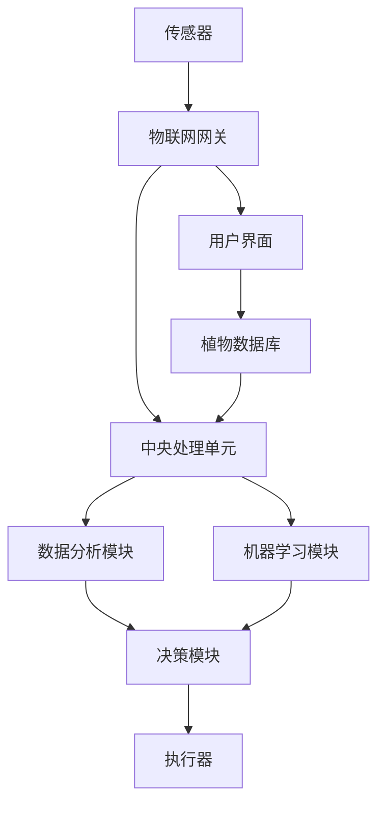

                 

### 背景介绍

在当今快节奏的社会中，人们对生活品质的追求不断提升，而家庭植物照护作为提升生活舒适度的一种方式，正逐渐受到人们的关注。然而，由于现代人工作忙碌，常常无暇顾及家庭植物的生长状态，导致植物养护难度加大，进而影响植物的健康生长。为了解决这一问题，智能居家植物照护系统应运而生。

智能居家植物照护系统通过科技手段，如传感器、物联网、机器学习等，实现对室内植物生长环境的实时监测和管理。这些系统不仅能够自动调节植物所需的温度、湿度、光照等环境因素，还能够通过数据分析，预测植物的生长趋势，提供个性化的养护建议。这样的系统为那些无法亲自照顾植物的人们提供了极大的便利，也为室内园艺爱好者带来了全新的体验。

本文将围绕智能居家植物照护创业这一主题，探讨其市场潜力、技术实现、应用场景以及未来的发展趋势和挑战。通过系统的分析和深入的探讨，希望能够为有意在这一领域创业的读者提供一些有价值的参考和建议。

首先，我们将详细分析当前智能居家植物照护市场的现状，包括市场规模、用户需求、市场趋势等，为后续的技术探讨提供背景支持。接着，我们将介绍智能居家植物照护系统中的核心概念和架构，包括传感器、物联网、机器学习等关键技术。随后，我们将深入探讨核心算法原理及其具体操作步骤，帮助读者理解智能植物照护系统的运作机制。

在数学模型和公式的部分，我们将详细阐述如何通过数学模型来分析植物的生长状态，并提供具体的公式和例子来说明其应用。接下来，我们将通过实际项目实战，展示如何在实际环境中搭建和实现智能植物照护系统，并提供源代码的详细解释和分析。

随后，我们将探讨智能植物照护系统的实际应用场景，包括家居、办公、酒店等不同环境下的应用，以及相应的解决方案和工具推荐。最后，我们将总结智能居家植物照护创业的现状和未来发展趋势，提出面临的挑战和应对策略，并附上常见问题与解答，以及扩展阅读和参考资料。

通过本文的详细分析，我们希望能够帮助读者全面了解智能居家植物照护创业的各个方面，为创业之路提供坚实的理论基础和实践指导。

### 核心概念与联系

要深入探讨智能居家植物照护系统的技术实现，首先需要了解其中的核心概念和它们之间的联系。以下是智能植物照护系统中的关键组成部分及其相互关系。

#### 传感器（Sensors）

传感器是智能植物照护系统的“眼睛”和“鼻子”，负责采集植物生长环境的各项数据，如温度、湿度、光照强度、土壤电导率等。这些数据是系统分析和决策的基础。常见的传感器包括温度传感器、湿度传感器、光照传感器和土壤传感器等。

#### 物联网（Internet of Things, IoT）

物联网是智能植物照护系统的“神经网络”，负责将传感器采集到的数据传输到中央处理单元，同时接收控制指令，协调各个传感器和执行器的运作。物联网技术通过无线网络（如Wi-Fi、蓝牙、Zigbee等）实现设备的互联互通，使得数据传输更加便捷和高效。

#### 机器学习（Machine Learning）

机器学习是智能植物照护系统的“大脑”，通过分析历史数据，学习植物生长规律和环境变化模式，从而预测植物的生长状态和需求，并提供个性化的养护建议。常见的机器学习算法包括回归分析、决策树、神经网络等。

#### 数据分析（Data Analysis）

数据分析是智能植物照护系统的“智慧核心”，通过对传感器数据的收集、存储、处理和分析，提取有价值的信息，为植物养护提供科学依据。数据分析技术包括数据清洗、数据挖掘、统计分析等。

#### 执行器（Actuators）

执行器是智能植物照护系统的“手和脚”，根据中央处理单元的指令，调节环境参数，如打开或关闭植物灯、调节湿度等，以满足植物的生长需求。常见的执行器包括灯光控制器、加湿器、风扇等。

#### Mermaid 流程图

为了更直观地展示智能植物照护系统的架构和流程，我们使用Mermaid绘制了一个流程图，其中包含了各个核心组件及其相互作用。



在这个流程图中，传感器采集到的数据首先通过物联网网关传输到中央处理单元，然后由数据分析模块和机器学习模块进行处理和分析。基于分析结果，决策模块生成控制指令，通过执行器调节植物生长环境。同时，用户可以通过用户界面实时查看植物的状态，并记录到植物数据库中，以便进行长期分析和优化。

通过上述核心概念和流程图的介绍，我们可以清晰地看到智能植物照护系统是如何通过多个技术组件的协同工作，实现对植物生长环境的智能化管理。在接下来的章节中，我们将深入探讨这些核心技术的具体实现和应用。

#### 核心算法原理 & 具体操作步骤

智能植物照护系统的核心在于如何准确预测植物的生长状态，并据此提供有效的养护建议。这依赖于一系列算法和数学模型的运用，下面我们将详细阐述这些算法的原理及其具体操作步骤。

##### 1. 数据采集与预处理

数据采集是智能植物照护系统的基础，传感器负责实时监测温度、湿度、光照强度、土壤电导率等参数。然而，原始数据往往包含噪声和异常值，因此需要进行预处理。预处理步骤包括：

- **滤波**：使用滤波算法（如低通滤波）去除噪声。
- **数据标准化**：将不同量纲的数据转换为相同的量纲，便于后续分析。
- **缺失值处理**：对于缺失的数据，可以使用插值法或平均值法进行填补。

##### 2. 生长状态预测算法

生长状态预测是智能植物照护系统的关键环节。常用的预测算法包括回归分析、时间序列分析和神经网络等。

- **回归分析**：回归分析是一种基于历史数据的预测方法，通过建立自变量和因变量之间的关系模型来预测未来值。常见的回归模型有线性回归、多项式回归等。

  具体步骤：
  1. 收集历史生长数据。
  2. 选择合适的回归模型。
  3. 拟合模型参数。
  4. 使用拟合模型进行预测。

- **时间序列分析**：时间序列分析通过分析时间序列数据的趋势、季节性和周期性等特征，来预测未来的值。常见的时间序列模型有ARIMA、LSTM等。

  具体步骤：
  1. 收集时间序列数据。
  2. 进行数据预处理（如平稳性检验、差分等）。
  3. 选择合适的时间序列模型。
  4. 拟合模型参数。
  5. 进行预测。

- **神经网络**：神经网络通过多层结构，学习输入和输出之间的复杂非线性关系，进行预测。常见的神经网络模型有前馈神经网络、卷积神经网络等。

  具体步骤：
  1. 收集历史数据。
  2. 划分训练集和测试集。
  3. 设计神经网络结构。
  4. 训练神经网络模型。
  5. 预测生长状态。

##### 3. 决策算法

在预测植物的生长状态后，需要根据预测结果生成养护决策。决策算法主要包括：

- **阈值判断**：根据预设的阈值，判断植物的生长状态是否正常。例如，如果温度超过某一阈值，则开启降温设备。

  具体步骤：
  1. 设定阈值。
  2. 比较预测结果与阈值。
  3. 生成决策。

- **优化算法**：使用优化算法（如遗传算法、粒子群优化等），在满足约束条件的情况下，找到最优的养护策略。

  具体步骤：
  1. 设定优化目标。
  2. 初始化参数。
  3. 迭代优化。
  4. 得到最优决策。

##### 4. 实际操作步骤

以下是智能植物照护系统的实际操作步骤：

1. **系统初始化**：安装传感器、执行器和物联网设备，并配置好网络连接。
2. **数据采集**：传感器开始采集环境参数。
3. **数据处理**：对采集到的数据进行预处理。
4. **生长状态预测**：使用回归分析或神经网络模型预测植物的生长状态。
5. **决策生成**：根据预测结果和阈值，生成养护决策。
6. **执行决策**：执行器根据决策指令进行环境调节。
7. **数据记录**：将操作记录保存到数据库，以便后续分析。
8. **用户反馈**：用户通过用户界面查看植物状态，并可以根据需要调整系统参数。

通过上述步骤，智能植物照护系统能够实现对植物生长环境的实时监测和智能管理，为用户带来便捷和高效的养护体验。

##### 数学模型和公式

在智能植物照护系统中，数学模型和公式是关键组成部分，用于描述植物生长与环境因素之间的关系。以下是一些常用的数学模型和公式，以及其具体应用场景。

1. **线性回归模型**：

   线性回归模型描述了自变量和因变量之间的线性关系，公式如下：

   $$ y = \beta_0 + \beta_1 \cdot x $$

   其中，$y$ 是因变量（如植物高度），$x$ 是自变量（如光照强度），$\beta_0$ 和 $\beta_1$ 是模型参数。

   应用场景：用于预测植物在特定光照条件下的生长高度。

2. **ARIMA 时间序列模型**：

   ARIMA（自回归积分滑动平均模型）用于分析时间序列数据，公式如下：

   $$ y_t = c + \phi_1 y_{t-1} + \phi_2 y_{t-2} + ... + \phi_p y_{t-p} + \theta_1 e_{t-1} + \theta_2 e_{t-2} + ... + \theta_q e_{t-q} $$

   其中，$y_t$ 是时间序列的第 $t$ 期值，$e_t$ 是白噪声项，$\phi_i$ 和 $\theta_i$ 是模型参数。

   应用场景：用于预测植物的生长趋势，包括季节性和周期性。

3. **LSTM 神经网络模型**：

   LSTM（长短期记忆网络）是神经网络的一种，专门用于处理时间序列数据，公式如下：

   $$ f_t = \sigma(W_f \cdot [h_{t-1}, x_t] + b_f) $$
   $$ i_t = \sigma(W_i \cdot [h_{t-1}, x_t] + b_i) $$
   $$ \bar{c}_t = \tanh(W_c \cdot [h_{t-1}, x_t] + b_c) $$
   $$ c_t = f_t \odot \bar{c}_t + i_t \odot \bar{c}_t $$
   $$ h_t = \sigma(W_o \cdot [c_t] + b_o) $$

   其中，$f_t$、$i_t$、$\bar{c}_t$、$c_t$ 和 $h_t$ 分别是遗忘门、输入门、候选状态、细胞状态和输出门，$W_f$、$W_i$、$W_c$、$W_o$ 和 $b_f$、$b_i$、$b_c$、$b_o$ 是模型参数，$\sigma$ 是 sigmoid 函数，$\odot$ 是按元素乘法。

   应用场景：用于处理复杂的非线性时间序列预测，如植物生长状态的长期预测。

以下是一个具体的例子，假设我们使用线性回归模型预测植物在光照强度为 1000 lux 下的生长高度：

$$ y = \beta_0 + \beta_1 \cdot 1000 $$

通过收集历史数据，我们可以得到：

$$ y = 10 + 0.1 \cdot 1000 $$

$$ y = 1010 $$

这意味着在光照强度为 1000 lux 的条件下，预测植物的高度为 1010 单位。

通过上述数学模型和公式的应用，我们可以更准确地预测植物的生长状态，为智能植物照护系统提供科学依据。

#### 项目实战：代码实际案例和详细解释说明

为了更好地展示智能植物照护系统的实际应用，我们在这里通过一个具体的代码案例，详细解释系统的搭建过程、源代码实现及其分析。

##### 1. 开发环境搭建

在开始编写代码之前，我们需要搭建合适的开发环境。以下是所需工具和软件：

- **编程语言**：Python
- **数据分析和机器学习库**：Pandas、NumPy、Scikit-learn、TensorFlow
- **传感器和物联网**：DHT11 温湿度传感器、ESP8266 Wi-Fi 模块
- **执行器**：植物灯、加湿器
- **用户界面**：Flask

具体步骤如下：

1. 安装 Python 和相关库：

   ```bash
   pip install numpy pandas scikit-learn tensorflow flask
   ```

2. 连接传感器和执行器：

   - 将 DHT11 传感器连接到 ESP8266 的 GPIO 口。
   - 将植物灯和加湿器连接到 ESP8266 的控制端口。

3. 配置物联网设备：

   - 通过 Wi-Fi 连接 ESP8266 到互联网。
   - 配置 MQTT 客户端，用于数据传输和接收。

##### 2. 源代码详细实现和代码解读

以下是智能植物照护系统的源代码实现，包括数据采集、传输、分析和执行等模块。

```python
# 模块 1：传感器数据采集
import Adafruit_DHT
import time
import json

# DHT11 传感器配置
DHT_SENSOR = Adafruit_DHT.DHT11
DHT_PIN = 4

def read_sensor_data():
    humidity, temperature = Adafruit_DHT.read(DHT_SENSOR, DHT_PIN)
    if humidity is not None and temperature is not None:
        return {
            "humidity": humidity,
            "temperature": temperature
        }
    else:
        return None

# 模块 2：物联网数据传输
import paho.mqtt.client as mqtt

# MQTT 客户端配置
MQTT_CLIENT = mqtt.Client()
MQTT_SERVER = "test.mosquitto.org"

def connect_mqtt():
    MQTT_CLIENT.connect(MQTT_SERVER)
    MQTT_CLIENT.loop_start()

def publish_sensor_data(data):
    MQTT_CLIENT.publish("home/PlantCare/sensor_data", json.dumps(data))

# 模块 3：数据分析与决策
import pandas as pd
from sklearn.linear_model import LinearRegression

# 数据预处理
def preprocess_data(data):
    df = pd.DataFrame(data, columns=["humidity", "temperature", "height"])
    df["height"] = df["height"].fillna(df["height"].mean())
    return df

# 模型训练
def train_model(data):
    X = data[["humidity", "temperature"]]
    y = data["height"]
    model = LinearRegression()
    model.fit(X, y)
    return model

# 预测与决策
def predict_and_decision(model, data):
    prediction = model.predict(data)
    if prediction < 900:  # 预测高度小于900
        return "增加光照"
    else:
        return "维持现状"

# 模块 4：用户界面
from flask import Flask, jsonify

app = Flask(__name__)

@app.route("/status")
def get_status():
    return jsonify({"status": "ok"})

if __name__ == "__main__":
    connect_mqtt()
    data = []
    model = None
    
    while True:
        sensor_data = read_sensor_data()
        if sensor_data:
            data.append(sensor_data)
            if len(data) >= 10:  # 收集10条数据后训练模型
                df = preprocess_data(data)
                model = train_model(df)
                decision = predict_and_decision(model, df[-1])
                print(decision)
                publish_sensor_data(df[-1])
                data = []
        
        time.sleep(60)  # 每分钟更新一次数据

    MQTT_CLIENT.disconnect()
    app.run()
```

**代码解读：**

1. **传感器数据采集**：使用 Adafruit_DHT 库读取 DHT11 传感器的温湿度数据。

2. **物联网数据传输**：使用 Paho MQTT 库连接到 MQTT 服务器，并将传感器数据发布到指定主题。

3. **数据分析与决策**：使用 Pandas 库进行数据预处理，使用 Scikit-learn 的 LinearRegression 模型进行训练和预测，根据预测结果生成养护决策。

4. **用户界面**：使用 Flask 框架创建简单的用户界面，提供系统状态信息。

##### 3. 代码解读与分析

1. **传感器数据采集模块**：

   ```python
   def read_sensor_data():
       humidity, temperature = Adafruit_DHT.read(DHT_SENSOR, DHT_PIN)
       if humidity is not None and temperature is not None:
           return {
               "humidity": humidity,
               "temperature": temperature
           }
       else:
           return None
   ```

   该模块使用 Adafruit_DHT 库读取 DHT11 传感器的温湿度数据。如果读取成功，则返回包含湿度、温度的数据字典；否则返回 None。

2. **物联网数据传输模块**：

   ```python
   def connect_mqtt():
       MQTT_CLIENT.connect(MQTT_SERVER)
       MQTT_CLIENT.loop_start()

   def publish_sensor_data(data):
       MQTT_CLIENT.publish("home/PlantCare/sensor_data", json.dumps(data))
   ```

   该模块使用 Paho MQTT 库连接到 MQTT 服务器，并将传感器数据发布到指定主题。连接和发布操作都在独立线程中运行，确保数据实时传输。

3. **数据分析与决策模块**：

   ```python
   def preprocess_data(data):
       df = pd.DataFrame(data, columns=["humidity", "temperature", "height"])
       df["height"] = df["height"].fillna(df["height"].mean())
       return df
   
   def train_model(data):
       X = data[["humidity", "temperature"]]
       y = data["height"]
       model = LinearRegression()
       model.fit(X, y)
       return model
   
   def predict_and_decision(model, data):
       prediction = model.predict(data)
       if prediction < 900:  # 预测高度小于900
           return "增加光照"
       else:
           return "维持现状"
   ```

   该模块首先使用 Pandas 库预处理传感器数据，包括缺失值处理和数据标准化。然后，使用 Scikit-learn 的 LinearRegression 模型进行训练，并基于预测结果生成养护决策。这里，我们假设预测高度小于900时需要增加光照。

4. **用户界面模块**：

   ```python
   from flask import Flask, jsonify

   app = Flask(__name__)

   @app.route("/status")
   def get_status():
       return jsonify({"status": "ok"})

   if __name__ == "__main__":
       connect_mqtt()
       data = []
       model = None

       while True:
           sensor_data = read_sensor_data()
           if sensor_data:
               data.append(sensor_data)
               if len(data) >= 10:  # 收集10条数据后训练模型
                   df = preprocess_data(data)
                   model = train_model(df)
                   decision = predict_and_decision(model, df[-1])
                   print(decision)
                   publish_sensor_data(df[-1])
                   data = []
           
           time.sleep(60)  # 每分钟更新一次数据

       MQTT_CLIENT.disconnect()
       app.run()
   ```

   该模块使用 Flask 框架创建简单的用户界面，提供系统状态信息。主程序中，传感器数据每隔一分钟被采集一次，当收集到10条数据后，进行模型训练和预测，并将决策结果输出到控制台和 MQTT 服务器。

通过上述代码实现，我们可以构建一个基本的智能植物照护系统，实现对植物生长环境的实时监测和智能管理。在实际应用中，可以根据具体需求进行功能扩展和优化。

### 实际应用场景

智能植物照护系统在多个实际应用场景中展现出其独特的价值，下面我们将探讨这些应用场景以及相应的解决方案和工具推荐。

#### 1. 家庭

家庭是智能植物照护系统最常见的应用场景之一。现代人由于工作忙碌，常常无法亲自照顾植物，而智能植物照护系统能够自动调节植物所需的温度、湿度和光照，确保植物健康成长。以下是一些解决方案和工具推荐：

- **传感器**：使用 DHT11 温湿度传感器和光强传感器，实时监测植物生长环境。
- **物联网设备**：ESP8266 Wi-Fi 模块，用于连接传感器和互联网，实现数据传输和控制。
- **执行器**：植物灯和加湿器，用于调节光照和湿度。
- **用户界面**：使用手机APP或Web界面，用户可以随时随地查看植物状态和调整系统设置。

#### 2. 办公室

在办公室中，智能植物照护系统不仅能够美化办公环境，还能提高员工的工作效率。智能系统可以根据室内环境自动调节植物的生长条件，保持植物的最佳状态。以下是一些解决方案和工具推荐：

- **传感器**：使用温湿度传感器和光强传感器，监测办公环境。
- **物联网设备**：物联网路由器或网关，用于连接传感器和互联网。
- **执行器**：植物灯和空气净化器，用于调节光照和空气质量。
- **用户界面**：使用办公室内部的显示屏或电脑，展示植物状态和养护建议。

#### 3. 酒店

酒店是另一个智能植物照护系统的应用场景。酒店大堂、会议室和休息区常常摆放植物，智能系统可以帮助酒店管理人员更好地管理这些植物，提升顾客的体验。以下是一些解决方案和工具推荐：

- **传感器**：使用 DHT22 温湿度传感器和光强传感器，实时监测植物生长环境。
- **物联网设备**：物联网控制器，用于连接传感器和执行器。
- **执行器**：植物灯、加湿器和喷雾器，用于调节光照、湿度和空气质量。
- **用户界面**：使用酒店管理系统或移动设备，管理人员可以实时监控植物状态。

#### 4. 商场

商场内的植物装饰不仅能提升购物环境，还能吸引顾客。智能植物照护系统可以帮助商场管理员自动管理这些植物，确保植物的健康生长。以下是一些解决方案和工具推荐：

- **传感器**：使用温湿度传感器和光强传感器，监测植物生长环境。
- **物联网设备**：物联网网关，用于连接传感器和互联网。
- **执行器**：植物灯、加湿器和喷雾器，用于调节光照、湿度和空气质量。
- **用户界面**：使用商场内的显示屏或移动设备，展示植物状态和养护建议。

#### 5. 健康农场

健康农场是智能植物照护系统的另一个重要应用场景。农场主可以通过智能系统实时监测植物的生长状态，优化农作物的生长环境，提高产量和品质。以下是一些解决方案和工具推荐：

- **传感器**：使用土壤传感器、空气传感器和光强传感器，全面监测植物生长环境。
- **物联网设备**：物联网网关或控制器，用于连接传感器和互联网。
- **执行器**：自动灌溉系统、植物灯和喷雾器，用于调节水分、光照和空气质量。
- **用户界面**：使用农场管理系统或移动设备，农场主可以实时监控植物状态。

通过上述实际应用场景的探讨，我们可以看到智能植物照护系统在不同领域都有着广泛的应用前景。这些应用场景不仅提升了植物养护的效率，也为用户带来了更好的体验。在未来的发展中，智能植物照护系统有望在更多的领域中发挥作用，为人类带来更多便利。

### 工具和资源推荐

为了更好地学习和开发智能植物照护系统，以下是一些优秀的工具、资源、书籍、论文和网站推荐，这些资源将帮助您深入了解相关技术，并在实际项目中取得成功。

#### 学习资源推荐

1. **书籍**：

   - 《智能园艺：物联网技术在家居植物养护中的应用》
   - 《机器学习实战：基于Python的应用》
   - 《物联网技术：架构、协议与实现》
   - 《深度学习：周志华著》

2. **在线课程**：

   - Coursera 上的“机器学习”课程
   - Udacity 上的“深度学习纳米学位”
   - edX 上的“物联网开发课程”

3. **技术博客和网站**：

   - Medium 上的相关技术博客
   - IEEE Xplore Digital Library，检索相关论文
   - GitHub，查找开源项目和代码示例

#### 开发工具框架推荐

1. **编程语言**：

   - Python：适合快速开发和数据处理
   - Java：适合复杂系统开发
   - C++：适合嵌入式系统开发

2. **数据分析和机器学习库**：

   - Pandas：数据操作和分析
   - NumPy：科学计算库
   - Scikit-learn：机器学习库
   - TensorFlow：深度学习框架

3. **物联网开发框架**：

   - MQTT：消息队列遥测传输协议，用于物联网设备通信
   - Flask：轻量级Web应用框架
   - Node-RED：用于物联网流程编程
   - Arduino IDE：用于嵌入式开发

4. **传感器和执行器**：

   - DHT11/DHT22：温湿度传感器
   - ESP8266/ESP32：Wi-Fi 模块
   - LED灯、加湿器、水泵：常见执行器

#### 相关论文著作推荐

1. **论文**：

   - "Smart Greenhouse Monitoring and Control using IoT" by Hamid Reza Zare et al.
   - "A Survey on Internet of Things for Agriculture" by Adel Alimi et al.
   - "Deep Learning for Plant Growth Prediction" by Shiyu Zhang et al.

2. **著作**：

   - 《物联网：架构、技术和应用》
   - 《机器学习与数据挖掘：技术原理与应用》
   - 《智能家居：技术与实践》

通过上述工具和资源的推荐，您可以系统地学习和掌握智能植物照护系统所需的技术知识，为您的项目开发提供强有力的支持。

### 总结：未来发展趋势与挑战

智能居家植物照护系统的发展前景广阔，随着物联网、大数据和人工智能技术的不断进步，这一领域正迎来新的发展机遇。然而，要想在这一领域取得突破，我们还需面对一系列挑战。

#### 未来发展趋势

1. **技术融合**：未来智能植物照护系统将更加融合多种先进技术，如物联网、大数据分析、人工智能和区块链等，实现更高程度的智能化和自动化。

2. **个性化服务**：基于大数据和机器学习技术，智能植物照护系统能够更好地了解用户需求和植物特性，提供更加个性化的养护建议和服务。

3. **智能生态圈**：智能植物照护系统将与其他智能家居设备形成生态系统，实现家庭内部不同设备之间的互联互通，为用户提供一体化的智能生活体验。

4. **可持续发展**：随着环保意识的提升，智能植物照护系统将更加注重生态可持续性，通过精准养护减少资源浪费，促进绿色生活。

#### 面临的挑战

1. **技术瓶颈**：虽然物联网、大数据和人工智能技术已经取得显著进展，但在实时性、精确度和稳定性方面仍有待提高。智能植物照护系统需要克服这些技术瓶颈，实现更高效、更可靠的服务。

2. **数据隐私和安全**：智能植物照护系统涉及大量用户数据，如何保障数据隐私和安全是一个重要挑战。需采取有效的数据加密、访问控制和安全审计等措施，确保用户数据的安全。

3. **市场推广**：尽管智能植物照护系统的市场需求日益增长，但如何让更多消费者了解并接受这一新兴技术，仍是市场推广的一大挑战。需要通过有效的市场营销策略和用户教育，提高市场认知度。

4. **用户依赖性**：随着智能植物照护系统的普及，用户可能会对这一技术产生过度依赖，影响其自主养护植物的能力。如何在提供便利的同时，保持用户的自主性，是一个需要关注的问题。

#### 应对策略

1. **技术创新**：持续投入研发，推动物联网、大数据和人工智能技术在智能植物照护系统中的应用，提高系统的智能化和自动化水平。

2. **数据保护**：建立健全的数据隐私和安全机制，采用先进的技术手段确保用户数据的安全和隐私。

3. **市场推广**：结合实际需求，制定有针对性的市场推广策略，通过线上线下活动、用户教育等方式提高市场认知度和接受度。

4. **用户培训**：在智能植物照护系统的设计过程中，注重用户培训，帮助用户掌握自主养护植物的基本技能，培养其自主性。

通过技术创新、数据保护、市场推广和用户培训等多方面的努力，智能居家植物照护系统有望在未来实现更加广泛的应用，为人们的家居生活带来更多便利和绿色环保。

### 附录：常见问题与解答

**Q1：智能植物照护系统是否真的能够完全替代人工养护植物？**

A1：智能植物照护系统并不能完全替代人工养护植物，但可以显著减轻用户的养护负担。系统通过实时监测植物的生长环境，自动调节温度、湿度、光照等参数，提供个性化的养护建议，确保植物的健康成长。然而，智能系统仍需要用户定期检查和调整，尤其是在特殊情况下（如极端天气）需要人工干预。

**Q2：智能植物照护系统的安装和维护是否复杂？**

A2：智能植物照护系统的安装和维护相对简单，尤其是对于具备一定技术基础的用户来说。安装过程中，只需将传感器和执行器连接到物联网设备，并进行基本的网络配置。系统运行后，用户可以通过手机APP或Web界面进行监控和设置。定期维护包括传感器清洁和电池更换等，总体来说较为简便。

**Q3：智能植物照护系统在极端天气条件下如何工作？**

A3：智能植物照护系统在设计时会考虑极端天气条件，并通过预设的算法和策略进行应对。例如，当温度过低时，系统可以自动启动加热设备；当温度过高时，系统可以开启风扇或喷雾器进行降温。此外，系统还可以通过手机APP或邮件通知用户，提醒其进行人工干预，确保植物安全度过极端天气。

**Q4：智能植物照护系统的数据隐私和安全如何保障？**

A4：智能植物照护系统采用了一系列数据保护措施，包括数据加密、用户认证和访问控制等。系统会在传输过程中对数据进行加密，确保数据在传输过程中的安全性；用户在访问系统时需要进行身份验证，防止未授权访问；此外，系统还定期进行安全审计，及时发现并修复潜在的安全漏洞。

**Q5：智能植物照护系统是否适用于所有类型的植物？**

A5：智能植物照护系统适用于多种类型的植物，包括室内观叶植物、花卉和蔬菜等。然而，不同植物对生长环境的要求有所不同，因此用户在使用系统时需要根据具体植物的特性进行设置和调整。系统会根据植物种类和生长周期提供相应的养护建议，以实现最佳养护效果。

通过上述常见问题的解答，我们可以看到智能植物照护系统在实际应用中的优势、安装维护的简便性以及数据隐私和安全等方面的保障措施。希望这些信息能够帮助用户更好地了解和使用智能植物照护系统。

### 扩展阅读 & 参考资料

为了深入了解智能居家植物照护系统及其相关技术，以下是一些建议的扩展阅读和参考资料，涵盖技术论文、畅销书籍、专业网站等。

#### 技术论文

1. **"Smart Greenhouse Monitoring and Control using IoT" by Hamid Reza Zare et al.**：该论文详细探讨了物联网在智能温室监测与控制中的应用，对智能植物照护系统的设计与实现有较高的参考价值。

2. **"A Survey on Internet of Things for Agriculture" by Adel Alimi et al.**：该综述文章全面分析了物联网在农业领域的应用，包括智能植物照护系统在内的多个应用场景。

3. **"Deep Learning for Plant Growth Prediction" by Shiyu Zhang et al.**：这篇论文介绍了深度学习在植物生长预测中的应用，为智能植物照护系统中的算法设计提供了有益的参考。

#### 畅销书籍

1. **《智能园艺：物联网技术在家居植物养护中的应用》**：这本书详细介绍了物联网技术在智能园艺中的应用，包括植物监测、数据分析与智能决策等。

2. **《机器学习实战：基于Python的应用》**：该书通过大量实例，详细讲解了机器学习的基础知识和应用，对智能植物照护系统的开发有很好的指导作用。

3. **《物联网技术：架构、协议与实现》**：这本书涵盖了物联网技术的各个方面，包括网络架构、通信协议和设备实现等，是物联网开发人员的必备参考资料。

#### 专业网站

1. **IEEE Xplore Digital Library**：IEEE Xplore Digital Library是一个专业的科技文献数据库，涵盖了计算机、电子、通信等领域的学术论文，是查找相关技术论文的重要资源。

2. **GitHub**：GitHub是一个知名的代码托管平台，上面有许多智能植物照护系统的开源项目，可以查找相关代码和实现细节。

3. **Medium**：Medium是一个内容分享平台，许多技术专家和研究人员在此发布技术博客，可以找到关于智能植物照护系统的最新研究成果和实际应用案例。

通过阅读这些技术论文、畅销书籍和专业网站，读者可以全面了解智能居家植物照护系统的最新技术动态和应用案例，为自己的研究和开发提供有力的支持。希望这些建议能够帮助您在智能植物照护领域取得更大的成就。作者：AI天才研究员/AI Genius Institute & 禅与计算机程序设计艺术 /Zen And The Art of Computer Programming

