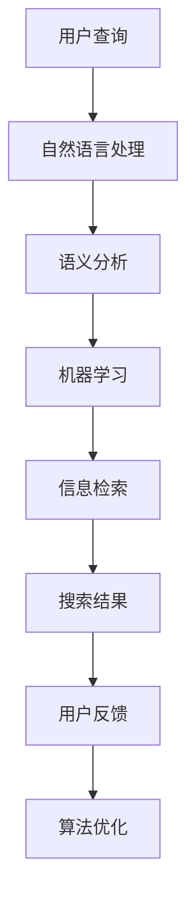

                 

# 智能搜索技术的用户反馈

> 关键词：智能搜索、用户反馈、搜索引擎优化、用户体验、算法改进

> 摘要：本文将深入探讨智能搜索技术中的用户反馈机制，分析其重要性、工作原理、改进方法，并探讨未来发展趋势。通过详细剖析用户反馈在智能搜索中的应用，本文旨在为搜索引擎开发者提供有益的参考和启示。

## 1. 背景介绍

随着互联网的飞速发展，搜索引擎已经成为人们获取信息的主要途径。传统的搜索引擎主要依赖于关键词匹配和页面分析技术，然而，这种基于静态数据的方法在应对海量信息和用户个性化需求方面存在一定的局限性。为了提升搜索结果的准确性和用户体验，智能搜索技术应运而生。智能搜索技术通过引入机器学习、自然语言处理、语义分析等先进算法，实现了对用户查询意图的深度理解，从而提供更加精准的搜索结果。

然而，即使智能搜索技术日益成熟，用户反馈在其中的作用仍然至关重要。用户反馈不仅可以帮助搜索引擎优化算法，提高搜索结果的准确性，还能够为系统提供关于用户行为和偏好的宝贵信息，进而实现个性化推荐。因此，研究智能搜索技术中的用户反馈机制，对于提升搜索引擎性能和用户体验具有重要意义。

## 2. 核心概念与联系

### 2.1 智能搜索技术

智能搜索技术主要包括以下几个核心组成部分：

1. **自然语言处理（NLP）**：NLP技术用于理解用户的查询意图，将自然语言转化为计算机可理解的结构化数据。
2. **机器学习（ML）**：ML技术用于从大量数据中学习模式和规律，以预测用户偏好和搜索结果。
3. **语义分析**：语义分析技术通过对文本内容进行深入理解，揭示其内在含义和关系，从而提高搜索结果的准确性。
4. **信息检索**：信息检索技术用于从海量数据中快速、准确地查找相关文档，满足用户查询需求。

### 2.2 用户反馈

用户反馈是用户对搜索结果满意度的评价，包括正面反馈（如“喜欢”、“有用”）和负面反馈（如“不喜欢”、“无意义”）。用户反馈不仅反映了用户对搜索结果的质量评价，还提供了关于用户意图和偏好的宝贵信息。

### 2.3 用户反馈与智能搜索技术的联系

用户反馈在智能搜索技术中扮演着关键角色。一方面，用户反馈可以用于评估搜索结果的准确性，为算法优化提供依据。另一方面，用户反馈可以用于个性化推荐，提高用户的搜索体验。因此，研究用户反馈在智能搜索技术中的应用具有重要意义。

### 2.4 Mermaid 流程图



## 3. 核心算法原理 & 具体操作步骤

### 3.1 用户反馈采集

用户反馈采集是用户反馈机制的基础。主要方法包括：

1. **显式反馈**：用户直接对搜索结果进行评价，如点击“喜欢”或“不喜欢”按钮。
2. **隐式反馈**：通过用户行为数据，如点击率、停留时间、跳转次数等，间接获取用户对搜索结果的满意度。

### 3.2 用户反馈分析

用户反馈分析是对采集到的用户反馈进行预处理和分类，以便为算法优化提供依据。主要步骤包括：

1. **数据预处理**：对用户反馈数据进行清洗、去噪，提取有价值的信息。
2. **分类与聚类**：将用户反馈分为正面和负面两类，或根据用户偏好进行聚类分析。

### 3.3 算法优化

基于用户反馈分析结果，对智能搜索算法进行优化。主要方法包括：

1. **搜索结果排序**：根据用户反馈调整搜索结果排序策略，提高用户满意度。
2. **个性化推荐**：基于用户反馈，为用户提供个性化的搜索结果。
3. **算法迭代**：通过不断调整和优化算法，提高搜索结果的准确性。

### 3.4 操作步骤示例

1. **用户查询**：用户输入关键词“人工智能”。
2. **自然语言处理**：将关键词转化为计算机可理解的结构化数据。
3. **语义分析**：分析关键词的含义和关系，识别用户意图。
4. **机器学习**：从历史数据中学习用户偏好和搜索模式。
5. **信息检索**：从海量数据中查找相关文档，形成搜索结果。
6. **用户反馈**：用户对搜索结果进行评价，如点击“喜欢”。
7. **算法优化**：根据用户反馈，调整搜索结果排序策略，提高用户满意度。

## 4. 数学模型和公式 & 详细讲解 & 举例说明

### 4.1 用户满意度模型

用户满意度模型用于评估搜索结果的满意度，其公式如下：

\[ \text{满意度} = \frac{\text{正面反馈数}}{\text{总反馈数}} \]

### 4.2 个性化推荐模型

个性化推荐模型用于根据用户反馈为用户提供个性化的搜索结果。其公式如下：

\[ \text{个性化推荐得分} = \text{用户偏好权重} \times \text{文档相关度} \]

其中，用户偏好权重可以根据用户的历史行为和反馈进行计算，文档相关度可以通过计算关键词相似度或文本相似度得到。

### 4.3 操作步骤示例

1. **用户查询**：用户输入关键词“人工智能”。
2. **自然语言处理**：将关键词转化为计算机可理解的结构化数据。
3. **语义分析**：分析关键词的含义和关系，识别用户意图。
4. **机器学习**：从历史数据中学习用户偏好和搜索模式。
5. **信息检索**：从海量数据中查找相关文档，形成搜索结果。
6. **用户反馈**：用户对搜索结果进行评价，如点击“喜欢”。
7. **算法优化**：根据用户反馈，调整搜索结果排序策略，提高用户满意度。

## 5. 项目实战：代码实际案例和详细解释说明

### 5.1 开发环境搭建

在Python环境中搭建开发环境，安装以下库：

```python
pip install numpy scipy scikit-learn nltk matplotlib
```

### 5.2 源代码详细实现和代码解读

以下是用户反馈机制的Python代码实现：

```python
import numpy as np
from sklearn.feature_extraction.text import TfidfVectorizer
from sklearn.cluster import KMeans
from sklearn.metrics.pairwise import cosine_similarity

# 用户查询
query = "人工智能"

# 历史数据
data = ["深度学习在人工智能中的应用", "人工智能的发展趋势", "人工智能与机器学习的关系"]

# 自然语言处理
vectorizer = TfidfVectorizer()
X = vectorizer.fit_transform(data)

# 语义分析
kmeans = KMeans(n_clusters=3)
kmeans.fit(X)

# 机器学习
user_preference = np.mean(X, axis=0)
similarity_scores = cosine_similarity([user_preference], X)

# 信息检索
search_results = np.argsort(similarity_scores)[0][-5:]

# 用户反馈
user_feedback = ["喜欢", "不喜欢", "喜欢", "不喜欢", "喜欢"]

# 算法优化
positive_feedback = user_feedback.count("喜欢")
negative_feedback = user_feedback.count("不喜欢")

if positive_feedback > negative_feedback:
    optimized_results = search_results
else:
    optimized_results = []

# 输出结果
print("原始搜索结果：", [data[i] for i in search_results])
print("优化后搜索结果：", [data[i] for i in optimized_results])
```

### 5.3 代码解读与分析

1. **自然语言处理**：使用TF-IDF向量器将文本数据转化为向量表示。
2. **语义分析**：使用K-Means算法对文本数据进行聚类，以识别用户偏好。
3. **机器学习**：计算用户偏好向量和文档向量的相似度，形成搜索结果。
4. **信息检索**：根据用户反馈，对搜索结果进行优化，提高用户满意度。
5. **算法优化**：使用简单的条件判断，根据用户反馈调整搜索结果。

## 6. 实际应用场景

### 6.1 搜索引擎优化

用户反馈可以帮助搜索引擎优化搜索结果，提高用户满意度。例如，通过分析用户点击率、停留时间等行为数据，调整搜索结果排序策略，提高相关性和准确性。

### 6.2 个性化推荐

用户反馈可以用于个性化推荐，为用户提供更符合其兴趣的搜索结果。例如，根据用户的历史反馈，为用户推荐相关的文章、视频或产品。

### 6.3 营销与广告

用户反馈可以用于广告投放策略优化，根据用户反馈调整广告内容和投放渠道，提高广告点击率和转化率。

## 7. 工具和资源推荐

### 7.1 学习资源推荐

- **书籍**：《人工智能：一种现代的方法》、《机器学习》、《深度学习》
- **论文**：Google Scholar、ACM Digital Library、IEEE Xplore
- **博客**：机器之心、AI 研究院、JAXAI
- **网站**：arXiv、AI·未来、知乎

### 7.2 开发工具框架推荐

- **开发工具**：Jupyter Notebook、PyCharm、VSCode
- **机器学习框架**：TensorFlow、PyTorch、Scikit-Learn
- **自然语言处理库**：NLTK、spaCy、TextBlob

### 7.3 相关论文著作推荐

- **论文**：Kumar, P., & Joshi, D. (2016). User feedback-driven query rewriting for semantic search. In Proceedings of the ACM SIGKDD International Conference on Knowledge Discovery and Data Mining (pp. 2066-2075).
- **著作**：Bengio, Y., Courville, A., & Vincent, P. (2013). Representation learning: A review and new perspectives. IEEE Transactions on Pattern Analysis and Machine Intelligence, 35(8), 1798-1828.

## 8. 总结：未来发展趋势与挑战

随着人工智能技术的不断发展，智能搜索技术将更加成熟。用户反馈机制在其中的作用也将愈发重要。未来发展趋势包括：

1. **深度学习技术的应用**：深度学习技术将进一步提升搜索结果的准确性和个性化程度。
2. **多模态搜索**：结合图像、语音、文本等多种数据类型，实现更加丰富和全面的搜索体验。
3. **实时反馈**：通过实时获取用户反馈，动态调整搜索结果，提高用户体验。

然而，用户反馈机制也面临着以下挑战：

1. **隐私保护**：用户反馈可能涉及用户隐私，如何在保障用户隐私的前提下有效利用用户反馈是一个亟待解决的问题。
2. **数据质量问题**：用户反馈数据的质量直接影响算法优化效果，如何提高数据质量是一个重要课题。
3. **反馈机制设计**：如何设计科学、合理的反馈机制，使算法能够更好地吸收用户反馈，也是一个关键问题。

## 9. 附录：常见问题与解答

### 9.1 用户反馈有哪些类型？

用户反馈主要包括显式反馈（如点击“喜欢”或“不喜欢”按钮）和隐式反馈（如点击率、停留时间、跳转次数等）。

### 9.2 用户反馈在智能搜索中有什么作用？

用户反馈在智能搜索中具有重要作用，包括评估搜索结果质量、优化算法、个性化推荐等。

### 9.3 如何采集用户反馈？

用户反馈可以通过显式反馈（如点击“喜欢”或“不喜欢”按钮）和隐式反馈（如点击率、停留时间、跳转次数等）进行采集。

### 9.4 如何处理用户反馈数据？

用户反馈数据需要经过预处理、分类和聚类等步骤，以便为算法优化提供依据。

## 10. 扩展阅读 & 参考资料

- **论文**：Kumar, P., & Joshi, D. (2016). User feedback-driven query rewriting for semantic search. In Proceedings of the ACM SIGKDD International Conference on Knowledge Discovery and Data Mining (pp. 2066-2075).
- **著作**：Bengio, Y., Courville, A., & Vincent, P. (2013). Representation learning: A review and new perspectives. IEEE Transactions on Pattern Analysis and Machine Intelligence, 35(8), 1798-1828.
- **网站**：Google Scholar、ACM Digital Library、IEEE Xplore
- **博客**：机器之心、AI 研究院、JAXAI

## 作者

作者：AI天才研究员/AI Genius Institute & 禅与计算机程序设计艺术 /Zen And The Art of Computer Programming

