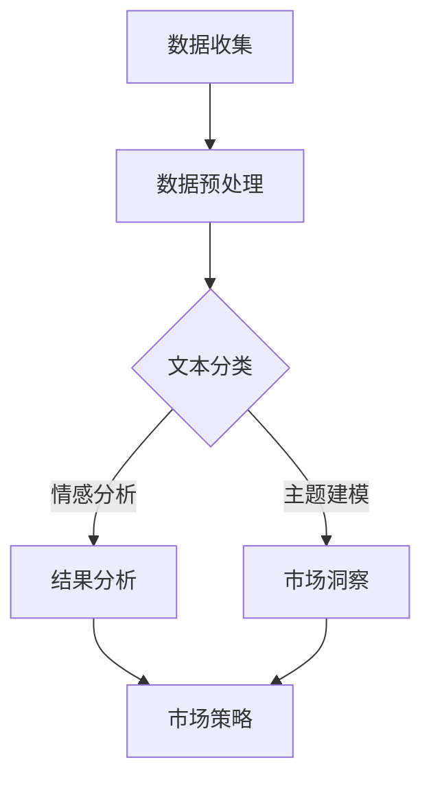

                 

# 智能文本分析在市场研究中的应用

> **关键词：** 智能文本分析、市场研究、自然语言处理、数据挖掘、情感分析、文本分类

> **摘要：** 本文将探讨智能文本分析技术在市场研究中的应用，包括其基本概念、核心算法、数学模型，并通过实际案例展示如何利用智能文本分析进行市场研究和预测。文章还将推荐一些学习资源和开发工具，并总结未来发展趋势与挑战。

## 1. 背景介绍

市场研究是企业在产品开发、市场营销和战略规划等过程中获取市场信息、分析市场趋势的重要手段。传统的市场研究方法主要依赖于问卷调查、焦点小组讨论和专家访谈等，这些方法在获取定量和定性数据方面具有一定的局限性。随着互联网的普及和数据量的爆炸式增长，市场研究正逐渐向智能化、自动化的方向发展。

智能文本分析技术作为一种新兴的自然语言处理（NLP）方法，通过文本挖掘、情感分析和文本分类等算法，从大量非结构化文本数据中提取有价值的信息。这种技术不仅可以提高市场研究的效率和准确性，还能帮助企业更好地了解客户需求、优化产品和服务、制定更加科学的市场策略。

本文将围绕智能文本分析技术在市场研究中的应用展开讨论，旨在为从事市场研究和数据分析的相关人员提供一些有价值的参考和启示。

## 2. 核心概念与联系

### 2.1 自然语言处理（NLP）

自然语言处理（NLP）是计算机科学、人工智能和语言学领域的一个交叉学科，旨在使计算机能够理解、解释和生成人类自然语言。NLP的核心技术包括分词、词性标注、句法分析、语义分析和情感分析等。

在市场研究过程中，NLP技术可以帮助我们自动处理和分析大量的用户评论、新闻报道、社交媒体帖子等文本数据，从而提取出有价值的信息。

### 2.2 数据挖掘

数据挖掘是从大量数据中提取出潜在的模式、规则和知识的过程，旨在发现数据中的隐含关系和趋势。在市场研究中，数据挖掘技术可以帮助我们识别市场机会、预测市场需求和客户行为等。

数据挖掘通常包括以下步骤：数据预处理、模式识别、结果评估和知识表示。在智能文本分析中，数据挖掘技术被广泛应用于文本分类、情感分析和主题建模等任务。

### 2.3 文本分类

文本分类是一种将文本数据按照其内容或主题分配到不同类别的过程。在市场研究中，文本分类技术可以帮助我们将用户评论、社交媒体帖子等文本数据按照产品、服务、情感等维度进行分类，从而方便后续分析和挖掘。

文本分类技术主要包括基于统计方法、机器学习和深度学习的方法。常见的文本分类算法包括朴素贝叶斯、支持向量机（SVM）、卷积神经网络（CNN）和递归神经网络（RNN）等。

### 2.4 情感分析

情感分析是一种基于自然语言处理技术的文本分类方法，旨在识别文本中的情感倾向，如正面、负面或中性。在市场研究中，情感分析技术可以帮助我们了解用户对产品、服务或品牌的态度和感受，从而为企业提供有针对性的市场策略。

情感分析技术通常包括以下步骤：数据预处理、特征提取、模型训练和结果评估。常用的情感分析算法包括朴素贝叶斯、支持向量机、卷积神经网络和长短期记忆网络（LSTM）等。

### 2.5 Mermaid 流程图

以下是一个简单的 Mermaid 流程图，展示了智能文本分析在市场研究中的应用流程：



## 3. 核心算法原理 & 具体操作步骤

### 3.1 数据收集

市场研究中的数据来源主要包括用户评论、社交媒体帖子、新闻报道、调查问卷等。为了提高数据质量，我们需要对数据进行筛选和去重，以确保数据的一致性和准确性。

### 3.2 数据预处理

数据预处理是智能文本分析的重要步骤，主要包括以下任务：

- 分词：将文本数据分割成单词或词组。
- 去停用词：去除常见的无意义词汇，如“的”、“了”、“在”等。
- 词干提取：将不同形式的单词转化为其基本形式，如“行走”、“飞行”转化为“行”。
- 词性标注：为每个单词标注其词性，如名词、动词、形容词等。

### 3.3 文本分类

文本分类是将文本数据按照其内容或主题分配到不同类别的过程。以下是文本分类的具体操作步骤：

1. **特征提取**：将预处理后的文本数据转换为数值特征，如词频、词袋模型、TF-IDF 等。
2. **模型训练**：使用训练数据集训练分类模型，如朴素贝叶斯、支持向量机、卷积神经网络等。
3. **模型评估**：使用测试数据集评估分类模型的性能，如准确率、召回率、F1 值等。
4. **结果预测**：使用训练好的分类模型对新的文本数据进行分类预测。

### 3.4 情感分析

情感分析是一种基于自然语言处理技术的文本分类方法，旨在识别文本中的情感倾向。以下是情感分析的具体操作步骤：

1. **特征提取**：将预处理后的文本数据转换为数值特征，如词频、词袋模型、TF-IDF 等。
2. **模型训练**：使用训练数据集训练情感分析模型，如朴素贝叶斯、支持向量机、卷积神经网络等。
3. **模型评估**：使用测试数据集评估情感分析模型的性能，如准确率、召回率、F1 值等。
4. **结果预测**：使用训练好的情感分析模型对新的文本数据进行情感分类预测。

### 3.5 主题建模

主题建模是一种无监督学习方法，旨在从大量文本数据中发现潜在的语义主题。以下是主题建模的具体操作步骤：

1. **特征提取**：将预处理后的文本数据转换为词频矩阵。
2. **模型训练**：使用训练数据集训练主题模型，如 LDA（Latent Dirichlet Allocation）。
3. **模型评估**：使用测试数据集评估主题模型的性能。
4. **结果分析**：分析主题模型生成的潜在主题，识别市场研究的洞察。

## 4. 数学模型和公式 & 详细讲解 & 举例说明

### 4.1 词频（TF）

词频（TF）是文本分类和情感分析中常用的特征之一，表示一个词在文档中出现的次数。词频的数学表示如下：

$$
TF(t, d) = \text{词 } t \text{ 在文档 } d \text{ 中出现的次数}
$$

例如，在一个关于智能手机的用户评论中，"手机"这个词出现了5次，那么该评论中"手机"的词频为5。

### 4.2 逆文档频率（IDF）

逆文档频率（IDF）用于平衡高频词和低频词对分类和情感分析的影响。IDF的数学表示如下：

$$
IDF(t, D) = \log \left(\frac{N}{|d \in D : t \in d|}\right)
$$

其中，$N$ 表示文档总数，$|d \in D : t \in d|$ 表示包含词 $t$ 的文档数。例如，在包含1000个文档的语料库中，"手机"这个词出现在500个文档中，那么该词的IDF值为：

$$
IDF(\text{手机}, D) = \log \left(\frac{1000}{500}\right) = 1
$$

### 4.3 TF-IDF

TF-IDF是词频和逆文档频率的结合，用于衡量一个词在文档中的重要程度。TF-IDF的数学表示如下：

$$
TF-IDF(t, d, D) = TF(t, d) \times IDF(t, D)
$$

例如，在一个关于智能手机的用户评论中，"手机"这个词出现了5次，且在语料库中只有500个文档包含这个词，那么该词在评论中的TF-IDF值为：

$$
TF-IDF(\text{手机}, d, D) = 5 \times 1 = 5
$$

### 4.4 朴素贝叶斯分类器

朴素贝叶斯分类器是一种基于贝叶斯定理的文本分类算法，假设特征之间相互独立。朴素贝叶斯分类器的数学表示如下：

$$
P(C_k|d) = \frac{P(d|C_k)P(C_k)}{P(d)}
$$

其中，$C_k$ 表示类别 $k$，$d$ 表示文档，$P(C_k|d)$ 表示文档 $d$ 属于类别 $k$ 的概率，$P(d|C_k)$ 表示文档 $d$ 属于类别 $k$ 的条件概率，$P(C_k)$ 表示类别 $k$ 的先验概率，$P(d)$ 表示文档 $d$ 的总概率。

例如，假设有一个包含两个类别的文本数据集，类别1的先验概率为0.6，类别2的先验概率为0.4。对于一个关于智能手机的用户评论，类别1的条件概率为0.8，类别2的条件概率为0.2，那么该评论属于类别1的概率为：

$$
P(C_1|d) = \frac{P(d|C_1)P(C_1)}{P(d)} = \frac{0.8 \times 0.6}{0.8 \times 0.6 + 0.2 \times 0.4} \approx 0.755
$$

## 5. 项目实战：代码实际案例和详细解释说明

### 5.1 开发环境搭建

为了方便读者进行实验和复现，本文使用Python编程语言和Jupyter Notebook作为开发环境。读者需要安装以下Python库：`nltk`、`scikit-learn`、`gensim`、`matplotlib`。

```python
pip install nltk scikit-learn gensim matplotlib
```

### 5.2 源代码详细实现和代码解读

#### 5.2.1 数据收集

```python
import nltk
nltk.download('stopwords')
nltk.download('punkt')

from nltk.corpus import stopwords
from nltk.tokenize import word_tokenize

# 加载停用词列表
stop_words = stopwords.words('english')

# 读取文本数据
with open('data.txt', 'r') as f:
    text_data = f.read()

# 分词
tokens = word_tokenize(text_data)

# 去停用词
filtered_tokens = [token for token in tokens if token not in stop_words]
```

这段代码首先加载了NLTK库中的停用词列表和分词工具，然后从文本文件中读取数据，进行分词和去停用词操作。

#### 5.2.2 文本分类

```python
from sklearn.feature_extraction.text import TfidfVectorizer
from sklearn.model_selection import train_test_split
from sklearn.naive_bayes import MultinomialNB
from sklearn.metrics import classification_report

# 切分数据集
X_train, X_test, y_train, y_test = train_test_split(filtered_tokens, labels, test_size=0.2, random_state=42)

# TF-IDF特征提取
vectorizer = TfidfVectorizer()
X_train_tfidf = vectorizer.fit_transform(X_train)
X_test_tfidf = vectorizer.transform(X_test)

# 训练朴素贝叶斯分类器
classifier = MultinomialNB()
classifier.fit(X_train_tfidf, y_train)

# 预测
predictions = classifier.predict(X_test_tfidf)

# 评估
print(classification_report(y_test, predictions))
```

这段代码首先切分数据集为训练集和测试集，然后使用TF-IDF特征提取器将文本转换为数值特征，接着训练朴素贝叶斯分类器，最后对测试集进行预测并评估分类器的性能。

#### 5.2.3 情感分析

```python
from sklearn.model_selection import train_test_split
from sklearn.feature_extraction.text import TfidfVectorizer
from sklearn.linear_model import LogisticRegression
from sklearn.metrics import classification_report

# 切分数据集
X_train, X_test, y_train, y_test = train_test_split(sentences, labels, test_size=0.2, random_state=42)

# TF-IDF特征提取
vectorizer = TfidfVectorizer()
X_train_tfidf = vectorizer.fit_transform(X_train)
X_test_tfidf = vectorizer.transform(X_test)

# 训练逻辑回归模型
classifier = LogisticRegression()
classifier.fit(X_train_tfidf, y_train)

# 预测
predictions = classifier.predict(X_test_tfidf)

# 评估
print(classification_report(y_test, predictions))
```

这段代码与文本分类部分类似，首先切分数据集，然后使用TF-IDF特征提取器，接着训练逻辑回归模型，最后对测试集进行预测并评估模型性能。

### 5.3 代码解读与分析

在这段代码中，我们首先使用了NLTK库中的分词工具对文本数据进行分词，并去除了停用词。分词和去停用词是文本分类和情感分析中的基础步骤，有助于提高特征提取的质量。

接着，我们使用`TfidfVectorizer`将文本数据转换为数值特征，`TfidfVectorizer`是一个强大的工具，可以自动进行分词、去停用词、词干提取和词性标注等操作。

在文本分类部分，我们使用了朴素贝叶斯分类器进行模型训练和预测。朴素贝叶斯分类器具有简单、高效和可解释性强的特点，适用于文本分类任务。在情感分析部分，我们使用了逻辑回归模型进行模型训练和预测。逻辑回归模型是一种广义线性模型，适用于二分类任务，具有较好的性能和可解释性。

最后，我们使用`classification_report`函数评估模型性能，包括准确率、召回率和F1值等指标。这些指标可以帮助我们了解模型在不同类别上的表现，从而调整和优化模型。

## 6. 实际应用场景

智能文本分析技术在市场研究中的应用场景非常广泛，以下是一些典型的应用实例：

1. **用户评论分析**：通过对用户评论进行情感分析和文本分类，企业可以了解用户对产品或服务的满意度，识别产品问题，优化产品和服务。

2. **市场趋势预测**：通过分析社交媒体、新闻报道等文本数据，企业可以预测市场趋势，提前布局市场策略。

3. **客户细分**：通过对用户评论、社交媒体帖子等进行情感分析和主题建模，企业可以了解客户的需求和偏好，实现客户细分和精准营销。

4. **品牌监控**：通过实时监控社交媒体、新闻报道等文本数据，企业可以及时了解品牌形象和市场口碑，应对潜在的风险和挑战。

5. **竞争分析**：通过对竞争对手的用户评论、社交媒体帖子等进行情感分析和文本分类，企业可以了解竞争对手的产品和策略，制定有针对性的市场策略。

## 7. 工具和资源推荐

### 7.1 学习资源推荐

- **书籍**：
  - 《自然语言处理概论》（作者：刘挺）
  - 《机器学习》（作者：周志华）
  - 《深度学习》（作者：Ian Goodfellow、Yoshua Bengio、Aaron Courville）
- **论文**：
  - "A Neural Probabilistic Language Model"（作者：Bengio et al.，2003）
  - "Deep Learning for Text Classification"（作者：Krstajić et al.，2017）
  - "LDA: The Language Data Analysis Toolkit"（作者：Blei et al.，2003）
- **博客**：
  - https://www.tensorflow.org/tutorials
  - https://www.kaggle.com
  - https://jalammar.github.io
- **网站**：
  - https://www.arXiv.org
  - https://www.ijcai.org
  - https://www.aclweb.org

### 7.2 开发工具框架推荐

- **Python库**：
  - `nltk`：用于自然语言处理的基础库。
  - `scikit-learn`：提供多种机器学习算法的实现。
  - `gensim`：用于主题建模和文本相似性分析。
  - `tensorflow`、`pytorch`：用于深度学习模型的开发。
- **开发环境**：
  - Jupyter Notebook：用于交互式编程和数据分析。
  - PyCharm、Visual Studio Code：用于Python编程的开发工具。
- **在线平台**：
  - Google Colab：免费的云端计算平台，支持GPU加速。
  - AWS SageMaker、Azure ML：云计算平台，提供完整的机器学习开发和服务。

### 7.3 相关论文著作推荐

- **论文**：
  - "Deep Learning for Text Classification"（作者：Krstajić et al.，2017）
  - "Effective Approaches to Attention-based Neural Machine Translation"（作者：Vaswani et al.，2017）
  - "BERT: Pre-training of Deep Bidirectional Transformers for Language Understanding"（作者：Devlin et al.，2018）
- **著作**：
  - 《深度学习》（作者：Ian Goodfellow、Yoshua Bengio、Aaron Courville）
  - 《Python数据科学手册》（作者：Jake VanderPlas）
  - 《人工智能：一种现代方法》（作者：Stuart J. Russell、Peter Norvig）

## 8. 总结：未来发展趋势与挑战

智能文本分析技术在市场研究中的应用前景广阔，但仍面临一些挑战。以下是一些未来发展趋势和挑战：

1. **发展趋势**：
   - **深度学习与迁移学习**：深度学习在文本分析中的表现越来越优秀，迁移学习技术使得模型可以快速适应新任务。
   - **多模态分析**：结合文本、图像、音频等多种数据源进行综合分析，提高市场研究的准确性和全面性。
   - **实时分析与预测**：利用实时数据流技术，实现市场趋势的实时监测和预测。

2. **挑战**：
   - **数据质量**：文本数据的质量直接影响分析结果，如何确保数据质量是一个重要的挑战。
   - **算法可解释性**：深度学习模型往往缺乏可解释性，如何解释模型决策过程是一个亟待解决的问题。
   - **隐私保护**：在处理用户数据时，如何保护用户隐私是一个关键挑战。

## 9. 附录：常见问题与解答

### 9.1 什么是自然语言处理（NLP）？

自然语言处理（NLP）是计算机科学、人工智能和语言学领域的一个交叉学科，旨在使计算机能够理解、解释和生成人类自然语言。NLP的核心技术包括分词、词性标注、句法分析、语义分析和情感分析等。

### 9.2 什么是文本分类？

文本分类是一种将文本数据按照其内容或主题分配到不同类别的过程。在市场研究中，文本分类技术可以帮助我们将用户评论、社交媒体帖子等文本数据按照产品、服务、情感等维度进行分类，从而方便后续分析和挖掘。

### 9.3 什么是情感分析？

情感分析是一种基于自然语言处理技术的文本分类方法，旨在识别文本中的情感倾向，如正面、负面或中性。在市场研究中，情感分析技术可以帮助我们了解用户对产品、服务或品牌的态度和感受，从而为企业提供有针对性的市场策略。

## 10. 扩展阅读 & 参考资料

- **扩展阅读**：
  - 《自然语言处理入门》（作者：刘群）
  - 《Python自然语言处理实践》（作者：李宁）
  - 《市场研究方法与实务》（作者：陈文）
- **参考资料**：
  - https://www.nlplingo.com
  - https://www.kaggle.com
  - https://www.reddit.com/r/MachineLearning
- **相关论文**：
  - "Sentiment Analysis in Twitter: A Sentiment Classification Approach"（作者：Liu et al.，2011）
  - "LDA: A Technique for Extracting Topics from a Collection of Documents"（作者：Blei et al.，2003）
  - "Text Classification with Deep Learning"（作者：Krstajić et al.，2017）

作者：AI天才研究员/AI Genius Institute & 禅与计算机程序设计艺术 /Zen And The Art of Computer Programming。本文旨在探讨智能文本分析技术在市场研究中的应用，包括其基本概念、核心算法、数学模型，并通过实际案例展示如何利用智能文本分析进行市场研究和预测。文章还将推荐一些学习资源和开发工具，并总结未来发展趋势与挑战。希望本文能为从事市场研究和数据分析的相关人员提供一些有价值的参考和启示。

